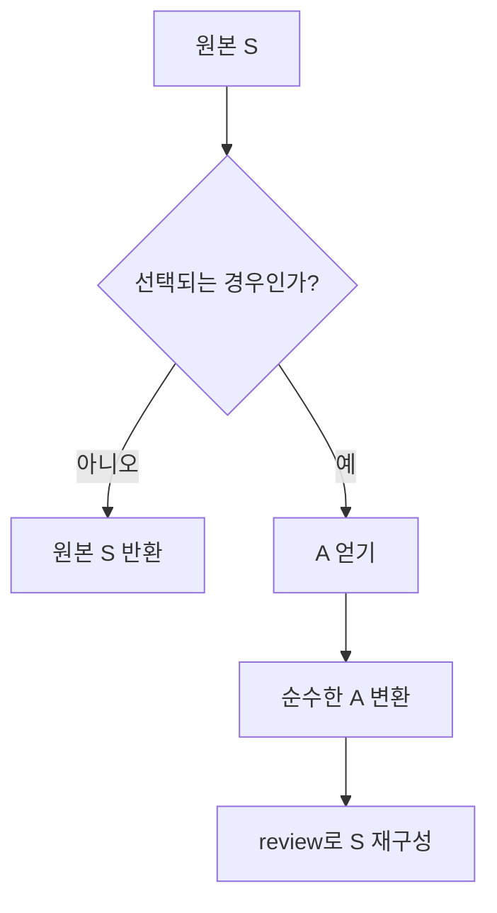

# 59장. Prism

앞 장의 Lens는 전체 데이터 안에 항상 존재하는 하나의 필드를 다뤘다.
그러나 처리 결과가 대기, 완료, 실패 중 하나라면 완료 값은 항상 존재하지 않는다.
이 상황에서 실패를 예외로 감춘 getter를 만드는 대신 선택 가능성을 타입으로 표현할 수 있다.

Prism은 합 타입의 특정 경우를 선택하고, 선택한 부분값으로 그 경우를 다시 구성한다.
부분적인 읽기와 총체적인 구성이 한 쌍을 이룬다.
두 방향을 왕복했을 때 정보가 보존되는지가 중요한 계약이다.

이 장은 합 타입, Option, 패턴 매칭, Lens에 이어진다.
선택되지 않은 경우를 보존하는 갱신과, 원래 값 없이 새 경우를 만드는 구성을 구분한다.

---

## 1. 개념과 기본 구분

### 선택과 재구성

```text
preview: S -> Option[A]
review:  A -> S
```

`S`는 전체 합 타입이고 `A`는 선택한 경우의 내용이다.
`preview`는 해당 경우이면 내용을 반환하고 아니면 부재를 반환한다.
`review`는 내용만 받아 전체 타입의 그 경우를 만든다.

### Lens와 방향이 다르다

Lens의 교체는 초점 바깥의 정보를 보존하기 위해 원본 `S`를 받는다.
Prism의 구성은 `A`만으로 선택한 경우 전체를 복원할 수 있어야 한다.
따라서 임의의 부분 필드 getter에 `Option`을 붙인다고 Prism이 되는 것은 아니다.

| 구분 | Lens | Prism |
| --- | --- | --- |
| 읽기 | 항상 하나의 A | 없거나 하나의 A |
| 쓰기 방향 | 원본 S와 새 A로 S 생성 | A만으로 해당 S 구성 |
| 자연스러운 대상 | 곱 타입의 필드 | 합 타입의 한 경우 |
| 핵심 보존 | 초점 밖 필드 | 선택된 경우 전체 정보 |

### 두 가지 왕복 법칙

```text
preview(review(a)) == Some(a)
preview(s) == Some(a) 이면 review(a) == s
```

구성한 값을 다시 선택하면 원래 내용을 얻는다.
선택에 성공한 전체값은 그 내용만으로 원래 전체값을 복원할 수 있어야 한다.
선택이 실패한 `s`에는 두 번째 법칙의 복원 요구가 적용되지 않는다.

### 왜 두 번째 법칙이 필요한가

완료 결과가 본문과 처리 시간을 갖는데 본문만 선택했다고 가정하자.
본문만으로 처리 시간을 복원할 수 없다면 그 선택은 전체 완료 경우의 Prism이 아니다.
완료 레코드 전체를 선택하는 Prism을 만들고 본문에는 Lens를 합성하는 편이 맞다.

### 특정 경우와 임의 조건

“양수이면 선택한다”는 함수는 쉽게 만들 수 있다.
하지만 `review`의 입력 타입이 모든 정수를 허용하면 음수 구성 후 선택이 실패한다.
선택 조건과 구성 가능한 내용의 범위를 함께 설계해야 한다.

---

## 2. 명령형 스타일과 함수형 스타일

### 반복되는 분기

```text
결과가 Completed이면:
    내용이 Note이면:
        문자열을 바꾼 Completed(Note(...)) 생성
    아니면 원본 유지
아니면 원본 유지
```

분기 자체는 나쁜 코드가 아니다.
문제는 같은 경로를 읽기, 수정, 테스트마다 반복할 때다.
합 타입의 중첩이 깊어지면 어떤 경우에만 동작하는지가 흐려질 수 있다.

### 선택 경로를 값으로 만든다

```text
Result --completed--> Payload --note--> String
```

완료 결과를 선택하는 Prism과 문자열 내용을 선택하는 Prism을 각각 정의한다.
두 Prism을 합성하면 완료된 문자열 결과에만 초점을 맞추는 하나의 경로를 얻는다.
선택 실패는 어느 단계에서든 부재로 전달된다.

### 무조건 구성하는 것과 조건부 교체

```text
review("hello"):
    언제나 Completed(Note("hello"))를 만든다

replace(source, "hello"):
    source가 이미 해당 경우일 때만 내용을 교체한다
```

두 연산의 차이는 중요하다.
실패 결과를 조건부로 수정했는데 갑자기 성공으로 바뀌어서는 안 되는 경우가 많다.
상태 전환 자체는 별도의 도메인 명령으로 드러낸다.

### 중첩 분기 대신 이름

`completedNote`라는 이름은 선택하는 경로를 설명한다.
그러나 이름이 실제 분기 계약을 숨기지 않도록 정의와 테스트를 가까이 둔다.
특정 경우를 선택하는 기준이 바뀌면 API의 의미도 바뀐다.

---

## 3. 왜 이 개념을 사용하는가?

### 안전한 경우 선택

선택 실패가 정상적인 결과로 나타난다.
호출자는 예외를 잡지 않고도 데이터가 해당 경우인지 판단할 수 있다.
Option 장에서 배운 부재의 조합을 구조적 접근에 적용한다.

### 양방향 계약

일반 파서는 입력을 해석한 뒤 일부 표기 정보를 버릴 수 있다.
Prism은 선택한 전체값을 다시 구성할 때 정보 보존을 요구한다.
따라서 “파싱할 수 있다”와 “Prism으로 왕복할 수 있다”를 구별하게 한다.

### 무관한 경우 보존

실패 메시지를 수정하는 Prism은 완료 결과를 그대로 둬야 한다.
부재일 때 기본 실패 메시지를 만들어 덮어쓰는 것은 다른 정책이다.
조건부 갱신과 기본값 생성은 명시적으로 나눈다.

### 합성 가능한 선택

`Option`의 `flatMap`으로 두 선택을 연결할 수 있다.
구성 방향은 안쪽 내용을 구성한 뒤 바깥 경우를 구성한다.
읽기와 생성의 방향이 서로 반대임을 타입에서 확인할 수 있다.

### 명시적인 상태 전이

Prism은 어떤 경우인지 선택하는 도구다.
대기에서 완료로 전환할 조건이나 실패를 재시도할 권한까지 결정하지 않는다.
생성자 접근과 도메인 전이의 책임을 분리한다.

---

## 4. Scala에서의 표현

### 중첩 합 타입의 Prism

아래 예제는 완료된 문자열만 수정하고 나머지 경우는 보존한다.
또한 모든 정수 표기를 받아들이는 파서가 왜 문자열 Prism으로는 부적절한지 검사한다.
정수의 정규 표기만 선택하는 별도 Prism도 비교한다.

<!-- executable:scala -->
```scala
object Chapter59:
  final case class Prism[S, A](preview: S => Option[A], review: A => S):
    def modify(f: A => A)(source: S): S =
      preview(source).fold(source)(value => review(f(value)))
    def replace(source: S, value: A): S = modify(_ => value)(source)
    def modifyOption(f: A => A)(source: S): Option[S] =
      preview(source).map(value => review(f(value)))
    def andThen[B](inner: Prism[A, B]): Prism[S, B] = Prism(
      source => preview(source).flatMap(inner.preview),
      value => review(inner.review(value))
    )

  enum Payload:
    case Note(text: String)
    case Count(value: BigInt)
    case Empty

  enum Result:
    case Pending
    case Completed(payload: Payload)
    case Failed(reason: String)

  val completed: Prism[Result, Payload] = Prism(
    {
      case Result.Completed(payload) => Some(payload)
      case _ => None
    },
    Result.Completed.apply
  )
  val note: Prism[Payload, String] = Prism(
    {
      case Payload.Note(text) => Some(text)
      case _ => None
    },
    Payload.Note.apply
  )
  val completedNote = completed.andThen(note)
  val empty: Prism[Payload, Unit] = Prism(
    {
      case Payload.Empty => Some(())
      case _ => None
    },
    _ => Payload.Empty
  )

  def parseInteger(text: String): Option[BigInt] =
    scala.util.Try(BigInt(text)).toOption

  val looseInteger: Prism[String, BigInt] = Prism(parseInteger, _.toString)
  val canonicalInteger: Prism[String, BigInt] = Prism(
    text => parseInteger(text).filter(_.toString == text),
    _.toString
  )

  def laws[S, A](prism: Prism[S, A], sources: List[S], values: List[A]): Unit =
    for value <- values do
      assert(prism.preview(prism.review(value)) == Some(value))
    for source <- sources do
      prism.preview(source).foreach(value => assert(prism.review(value) == source))
      assert(prism.modify(identity)(source) == source)

  def check(): Unit =
    val sources = List(
      Result.Pending,
      Result.Completed(Payload.Note("hello")),
      Result.Completed(Payload.Note("")),
      Result.Completed(Payload.Count(7)),
      Result.Completed(Payload.Empty),
      Result.Failed("timeout")
    )
    laws(completedNote, sources, List("hello", "", "한글"))
    assert(completedNote.preview(Result.Pending).isEmpty)
    assert(completedNote.review("ok") == Result.Completed(Payload.Note("ok")))
    assert(completedNote.replace(Result.Failed("timeout"), "ok") == Result.Failed("timeout"))
    assert(completedNote.modify(_ + "!")(sources(1)) == Result.Completed(Payload.Note("hello!")))
    assert(completedNote.modifyOption(_.reverse)(Result.Pending).isEmpty)
    var calls = 0
    val skipped = completedNote.modify { text => calls += 1; text + "!" }(Result.Pending)
    assert(skipped == Result.Pending && calls == 0)
    laws(empty, List(Payload.Empty, Payload.Note("x")), List(()))
    assert(empty.preview(Payload.Empty) == Some(()))
    assert(looseInteger.preview("007") == Some(BigInt(7)))
    assert(looseInteger.review(BigInt(7)) != "007")
    val spellings = List("0", "7", "-7", "007", "+7", "-0", " 7 ", "x", "")
    laws(canonicalInteger, spellings, List(BigInt(0), BigInt(7), BigInt(-7)))
    assert(canonicalInteger.preview("007").isEmpty)
    assert(canonicalInteger.preview("7") == Some(BigInt(7)))
    for source <- sources do
      val f: String => String = _ + "!"
      val g: String => String = _.reverse
      assert(completedNote.modify(g)(completedNote.modify(f)(source)) ==
        completedNote.modify(f.andThen(g))(source))
```

### 검사의 해석

정규 정수 Prism은 모든 문자열을 정수로 변환하려는 도구가 아니다.
표기까지 왕복 가능한 부분집합만 선택한다.
사용자 입력을 관대하게 파싱하는 일반 파서의 목적과는 다르다.

### 참고 계약

Monocle의 [Prism 문서](https://www.optics.dev/Monocle/docs/optics/prism)는 합 타입 선택, 조건부 수정, 양방향 왕복 법칙을 설명한다.
이 장은 같은 종류의 계약을 작은 독립 구현으로 살펴본다.
표준 라이브러리에 이 `Prism` 타입이 내장되어 있다고 가정하지 않는다.

---

## 5. 상태 변경보다 값 변환

### 선택 실패는 원본을 유지한다



변환 함수는 선택에 성공한 경우에만 호출한다.
이 계약을 실행 횟수 테스트로 확인할 수 있다.
실패한 경우에도 변환을 먼저 실행한 뒤 버리면 부수효과와 비용이 달라진다.

### 선택된 경우의 정보 보존

`Completed(Note(text))`는 `text`만으로 다시 구성할 수 있다.
반면 `Completed(text, timestamp)`에서 text만 선택하면 timestamp를 잃는다.
후자의 초점은 두 필드를 모두 가진 레코드여야 한다.

### 수정 성공 여부를 보존한다

조건부 갱신이 원본을 그대로 반환하면 실패인지 같은 값을 쓴 것인지 결과만으로 구분하기 어렵다.
이 차이가 중요하면 `modifyOption` 같은 연산을 사용한다.
감사 기록이나 사용자 안내에 필요한 정보를 버리지 않는다.

### 값의 재구성과 상태 전환

`review`로 새 완료 값을 만들 수 있다는 것은 도메인상 완료 전환이 허용된다는 뜻이 아니다.
원래 상태와 전환 조건을 검사하는 함수는 별도로 둔다.
잘못된 상태를 표현하기 어렵게 만드는 모델과 접근 편의의 균형이 필요하다.

---

## 6. 함수 합성과 데이터 흐름

### 선택의 합성

바깥 Prism이 선택에 실패하면 안쪽 Prism을 호출할 필요가 없다.
바깥 선택이 성공하면 그 내용을 안쪽 선택에 전달한다.
이는 `Option`의 `flatMap`과 정확히 같은 분기 구조다.

```text
previewOuter(s).flatMap(previewInner)
```

### 구성의 합성

가장 안쪽 내용으로 안쪽 경우를 만든다.
그 결과를 바깥 Prism의 생성 함수에 전달한다.
합성한 Prism의 `review`에는 원본 전체값이 필요하지 않다.

```text
reviewOuter(reviewInner(a))
```

### Prism과 Lens를 섞는다

배송 결과의 `Delivered` 경우 전체를 Prism으로 선택하고 그 안의 수령인 이름을 Lens로 고칠 수
있다.
그러나 이름만으로 `Delivered` 전체를 만들 수 없으므로 결과를 일반 Prism이라고 할 수는 없다.
원본을 필요로 하는 부분 접근, 즉 Optional 계열의 계약으로 이어진다.

### 선택 기준을 갱신이 바꾸는 경우

짝수만 선택하는 필터에 1 더하기를 적용하면 다음 갱신에서는 그 값이 선택되지 않을 수 있다.
따라서 두 번 수정하기와 합성한 함수를 한 번 적용하기가 달라질 수 있다.
임의 필터를 법칙적인 Prism으로 설명하지 않는다.

### 왕복 법칙과 합성

두 Prism이 각자의 왕복 법칙을 만족하면 성공한 선택의 복원도 단계별로 추론할 수 있다.
안쪽 값을 복원하면 바깥 Prism이 선택했던 원래 내용이 되고, 그것으로 전체값을 복원한다.
실제 구현의 함수가 순수하고 타입의 유효한 값 범위를 지킨다는 전제가 필요하다.

---

## 7. 장점과 트레이드오프

### 장점

합 타입의 특정 경우를 다루는 반복 분기를 이름 붙인 값으로 모을 수 있다.
선택 실패를 정상적인 데이터 흐름으로 다룬다.
왕복 법칙은 정보 손실을 발견하는 유용한 검토 기준이다.

### 주의할 점

복잡한 분기를 무조건 추상화하면 오히려 의미를 숨길 수 있다.
경우별 업무 처리가 모두 다를 때는 명시적인 패턴 매칭이 더 읽기 쉽다.
Prism은 같은 경로를 반복해서 선택하고 변환할 때 가치가 있다.

| 요구 | 적합한 출발점 | 주의 |
| --- | --- | --- |
| 한 경우의 전체 내용 선택 | Prism | 내용으로 경우 전체를 복원해야 한다 |
| 경우 내부의 일부 필드 | Prism과 Lens 합성 | 결과는 보통 Optional이다 |
| 임의 문자열 해석 | Parser | 원래 표기를 잃을 수 있다 |
| 상태 전환 정책 | 도메인 함수 | 접근 경로와 전환 허용은 다르다 |
| 모든 경우 처리 | 패턴 매칭 | 누락된 경우를 확인한다 |

### 비용

선택과 재구성에 함수 호출과 새 값 생성이 필요할 수 있다.
실패한 경로에서는 불필요한 재구성을 피할 수 있다.
반복 호출량과 데이터 구조에 따라 비용을 측정해야 한다.

### 법칙과 설계 의도

어떤 변환이 Prism 법칙을 깨뜨린다고 그 변환 자체가 무조건 잘못된 것은 아니다.
정규화 파서는 원래 표기를 버리도록 설계될 수 있다.
문제는 다른 계약의 연산을 Prism이라고 부르며 법칙을 기대하는 것이다.

---

## 8. 상태와 부수효과의 경계

### 실패와 예외의 구분

선택되는 경우가 아니라는 것은 정상적인 부재다.
선택 함수의 프로그래밍 오류나 외부 시스템 실패까지 `None`으로 숨기지 않는다.
예외를 너무 넓게 포착하면 데이터가 없는 상황과 실행 장애가 섞인다.

### 변환 함수의 효과

선택 실패 시 콜백을 실행하지 않는다는 사실은 효과의 실행 횟수에 영향을 준다.
콜백에서 저장이나 출력이 일어난다면 그 계약을 명시해야 한다.
책의 기본 사용은 순수한 변환이며 실제 효과는 바깥 경계로 옮긴다.

### 부재의 의미

현재 경우가 다르다는 부재, 값 자체가 `None`인 성공, 입력 오류를 서로 구분해야 할 수 있다.
초점 타입이 실제로 `None`을 포함한다면 단순한 `A | None`은 선택 실패와 충돌할 수 있다.
Python 구현에서는 명시적인 `Some`과 `NoMatch`를 사용한다.

### 갱신과 저장

Prism으로 실패 메시지를 바꾸는 것은 메모리 안의 값 변환이다.
실제 저장 시점에 원본 상태가 달라졌을 가능성은 별도 문제다.
도메인 버전과 충돌 결과를 외곽 실행 계층에서 관리한다.

---

## 9. Python에서 적용하기

### 선택 성공에 None도 담을 수 있다

아래 구현은 `Some(None)`과 `NoMatch`를 구분한다.
일반 문자열 초점에서는 다소 장황하지만 합 타입의 구조를 정확하게 보여준다.
선택과 조건부 교체, 합성, 왕복 법칙을 모두 실행한다.

<!-- executable:python -->
```python
from __future__ import annotations
from dataclasses import dataclass
from typing import Callable, Generic, TypeVar, Union

S = TypeVar("S")
A = TypeVar("A")
B = TypeVar("B")

@dataclass(frozen=True)
class Some(Generic[A]):
    value: A

@dataclass(frozen=True)
class NoMatch:
    pass

MISS = NoMatch()
Match = Union[Some[A], NoMatch]

@dataclass(frozen=True)
class Prism(Generic[S, A]):
    preview: Callable[[S], Match[A]]
    review: Callable[[A], S]

    def modify(self, source: S, update: Callable[[A], A]) -> S:
        selected = self.preview(source)
        if isinstance(selected, Some):
            return self.review(update(selected.value))
        return source

    def replace(self, source: S, value: A) -> S:
        return self.modify(source, lambda _: value)

    def and_then(self, inner: Prism[A, B]) -> Prism[S, B]:
        def preview(source: S) -> Match[B]:
            selected = self.preview(source)
            if isinstance(selected, Some):
                return inner.preview(selected.value)
            return MISS
        return Prism(preview, lambda value: self.review(inner.review(value)))

@dataclass(frozen=True)
class Note:
    text: str

@dataclass(frozen=True)
class Count:
    value: int

@dataclass(frozen=True)
class Empty:
    pass

Payload = Union[Note, Count, Empty]

@dataclass(frozen=True)
class Pending:
    pass

@dataclass(frozen=True)
class Completed:
    payload: Payload

@dataclass(frozen=True)
class Failed:
    reason: str

Result = Union[Pending, Completed, Failed]

completed: Prism[Result, Payload] = Prism(
    lambda source: Some(source.payload) if isinstance(source, Completed) else MISS,
    Completed,
)
note: Prism[Payload, str] = Prism(
    lambda source: Some(source.text) if isinstance(source, Note) else MISS,
    Note,
)
completed_note = completed.and_then(note)
empty: Prism[Payload, None] = Prism(
    lambda source: Some(None) if isinstance(source, Empty) else MISS,
    lambda _: Empty(),
)

def assert_laws(prism: Prism[S, A], sources: tuple[S, ...], values: tuple[A, ...]) -> None:
    for value in values:
        assert prism.preview(prism.review(value)) == Some(value)
    for source in sources:
        selected = prism.preview(source)
        if isinstance(selected, Some):
            assert prism.review(selected.value) == source
        assert prism.modify(source, lambda value: value) == source

def parse_integer(text: str) -> Match[int]:
    try:
        return Some(int(text))
    except ValueError:
        return MISS

def parse_canonical_integer(text: str) -> Match[int]:
    selected = parse_integer(text)
    if isinstance(selected, Some) and str(selected.value) == text:
        return selected
    return MISS

loose_integer: Prism[str, int] = Prism(parse_integer, str)
canonical_integer: Prism[str, int] = Prism(parse_canonical_integer, str)
sources: tuple[Result, ...] = (
    Pending(), Completed(Note("hello")), Completed(Note("")),
    Completed(Count(7)), Completed(Empty()), Failed("timeout"),
)
assert_laws(completed_note, sources, ("hello", "", "한글"))
assert completed_note.preview(Pending()) == MISS
assert completed_note.review("ok") == Completed(Note("ok"))
assert completed_note.replace(Failed("timeout"), "ok") == Failed("timeout")
assert completed_note.modify(Completed(Note("hello")), lambda text: text + "!") == Completed(Note("hello!"))

calls: list[str] = []
def observed(text: str) -> str:
    calls.append(text)
    return text + "!"
assert completed_note.modify(Pending(), observed) == Pending()
assert calls == []
assert empty.preview(Empty()) == Some(None)
assert empty.preview(Note("")) == MISS
assert_laws(empty, (Empty(), Note("x")), (None,))
assert loose_integer.preview("007") == Some(7)
assert loose_integer.review(7) != "007"
spellings = ("0", "7", "-7", "007", "+7", "-0", " 7 ", "x", "")
assert_laws(canonical_integer, spellings, (0, 7, -7))
assert canonical_integer.preview("007") == MISS
assert canonical_integer.preview("7") == Some(7)
```

### 정수 파서의 한계

이 파서는 교육용 표기 비교를 위한 것이며 무제한 길이 입력을 처리하는 프로토콜 파서는 아니다.
외부 입력에는 길이와 문법의 범위를 먼저 제한할 수 있다.
정규 표기 선택과 입력 보안 정책은 서로 다른 책임이다.

---

## 10. Python의 표현 한계

### Union은 봉인된 계층과 다르다

Python의 Union 주석은 가능한 타입의 정적 설명에 도움을 준다.
런타임에 임의 객체가 전달되는 것을 자동으로 막지는 않는다.
외부 입력을 먼저 파싱하여 내부 모델을 만든다는 앞 장들의 원칙을 유지한다.

### 단위 값과 실패

Scala에서는 `Some(())`와 `None`을 구분할 수 있다.
Python에서 `None` 자체를 성공 내용으로 쓰려면 별도의 성공 태그가 필요하다.
선택 실패를 나타내는 센티널과 실제 데이터 값을 섞지 않는다.

### 자동 Prism 생성

필드나 생성자에서 Prism을 유도하는 매크로는 언어와 라이브러리 지원에 의존한다.
본문의 Python 구현은 명시적인 선택·구성 함수를 사용한다.
코드 생성 없이도 개념은 구현할 수 있지만 모든 타입 관계가 자동 추론되지는 않는다.

### 순수성 및 법칙 검사

두 함수가 타입에 맞아도 왕복 법칙을 만족한다는 보장은 없다.
필요한 필드를 잃어버리는 `review`도 Python에서 실행될 수 있다.
정적 타입 검사와 값 기반 법칙 테스트를 별도로 수행한다.

### 부분 선택과 오류 진단

`NoMatch`만으로는 어느 단계에서 선택에 실패했는지 알 수 없다.
업무에 상세 진단이 필요하면 경로 정보나 오류 타입을 반환하는 별도 API가 적절할 수 있다.
간단한 Prism에 모든 오류 보고 기능을 억지로 넣지 않는다.

---

## 11. 핵심 정리

### 핵심 판단

Prism은 선택한 경우의 내용만으로 그 경우 전체를 복원할 수 있어야 한다.
부재에서는 원본을 보존하는 수정과 새 경우를 만드는 구성을 구분한다.
일반 파서, 필터, 상태 전환 명령과 같은 계약이라고 생각하지 않는다.

### 연습 1: 정수 파서의 반례

`"007"`을 7로 해석하고 7을 `"7"`로 출력한다.
어떤 왕복 법칙이 깨지는가?

해설: 선택한 원본 문자열을 정수만으로 복원하지 못한다.
선택 성공 후 `review`가 원본을 돌려주어야 한다는 두 번째 법칙을 깨뜨린다.
정규 문자열만 선택하거나 원래 표기를 데이터에 보존하는 다른 모델이 필요하다.

### 연습 2: 정보 손실 찾기

`Delivered(name, deliveredAt)`에서 이름만 추출하는 Prism을 만들려고 한다.
왜 원본 없이 `review(name)`을 정의하기 어려운가?

해설: 배송 시각이 없어져 전체 경우를 복원할 수 없다.
먼저 `Delivered` 레코드 전체를 초점으로 선택하고 그 안의 이름은 Lens로 접근한다.
합성 결과의 부분 접근 계약을 다음 장에서 다룬다.

### 연습 3: 조건부 수정과 구성

실패 결과에 완료 문자열 Prism의 `replace`를 적용했는데 결과가 실패 그대로다.
버그인가?

해설: 이 장의 계약에서는 선택되지 않은 경우를 보존하는 정상 동작이다.
새 완료 결과를 만들려면 `review`를 사용하고 도메인 전환 조건은 별도로 검사한다.
두 연산을 같은 이름으로 혼동하지 않는 것이 중요하다.

### 연습 4: 성공한 None

성공 내용이 None인 경우와 선택 실패를 어떻게 테스트할 것인가?

해설: `Some(None)`과 `NoMatch`를 별도 기대값으로 비교한다.
참·거짓 여부만 검사하면 빈 문자열, 0, None을 잘못 분류할 수 있다.
성공 태그를 먼저 확인한 뒤 내용을 다룬다.

### 다음 장으로

Lens와 Prism은 서로 다른 정보 보존 계약을 가진다.
다음 장은 여러 종류의 접근 경로를 합성할 때 초점 개수와 연산 능력이 어떻게 바뀌는지 다룬다.
특히 Optional, Traversal, Fold를 구분하여 필요한 것보다 강한 계약을 약속하지 않는다.
