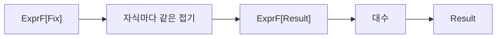

# 56장. Recursion Schemes


계산 트리를 평가하고 표시하고 노드 수를 세는 함수에는 비슷한 재귀가 반복된다.
각 함수가 하위 트리를 방문한 뒤 현재 노드의 결과를 계산한다.
재귀 스킴은 이런 순회의 구조를 분리하여 노드의 의미 계산에 집중하게 하는 방법이다.

이번 장은 산술 트리의 한 층과 전체 재귀 구조를 나누어 표현한다.
접기인 catamorphism, 펼치기인 anamorphism, 펼친 구조를 접는 hylomorphism을 작은 실행 예제로
비교한다.
추상화가 재귀를 감춘다고 종료나 스택 안전성, 무할당이 자동으로 보장되지는 않는다는 점도
확인한다.

---

## 1. 개념과 기본 구분

### 반복되는 구조적 재귀

트리의 각 경우를 구분하고 자식에게 같은 함수를 재귀 호출한 뒤 결과를 결합한다.
평가와 표시, 크기 계산에서 이 골격이 반복될 수 있다.
골격과 현재 노드의 계산을 분리할 수 있다.

```text
재귀 골격: 자식들을 같은 방식으로 처리한다
대수:      처리된 자식 결과로 현재 결과를 만든다
```

여기서 대수는 한 층의 구조를 결과값으로 바꾸는 함수다.
앞 장의 연산 언어와 해석기의 관계를 재귀 구조 수준에서 더 정리한 것이다.
Monoid의 결합 연산 하나와 동일한 뜻으로 제한하지 않는다.

### 한 층의 패턴

`ExprF[A]`는 자식 자리에 `A`를 넣는 한 층의 노드다.
자식이 전체 트리이면 재귀 구조를 만들고, 자식이 정수 결과이면 한 단계의 평가 입력이 된다.
재귀 위치를 타입 매개변수로 드러낸다.

### 고정점

한 층의 자식 자리에 다시 같은 전체 구조를 넣으면 재귀적인 트리가 된다.
예제의 `Fix`는 `ExprF[Fix]` 한 층을 감싼다.
이 표현은 유한한 내부 트리를 전제로 사용한다.

### 접기와 펼치기

접기는 이미 있는 트리를 하나의 결과로 계산한다.
펼치기는 초기 씨앗에서 다음 한 층과 자식 씨앗을 만든다.
둘은 같은 재귀 패턴을 다른 방향에서 사용한다.

---

## 2. 명령형 스타일과 함수형 스타일

### 해석기마다 재귀를 쓴다

```text
evaluate: Add이면 왼쪽과 오른쪽을 재귀 평가
render:   Add이면 왼쪽과 오른쪽을 재귀 표시
size:     Add이면 왼쪽과 오른쪽의 크기를 재귀 계산
```

새 노드가 생기면 여러 함수에서 순회 코드를 반복하여 수정할 수 있다.
작은 언어에서는 이 명시적인 방식이 충분히 읽기 쉽다.
반복되는 구조가 커지면 공통 접기를 도입할 수 있다.

### 자식 결과를 받는 대수

```text
평가 대수: Add(왼쪽 정수, 오른쪽 정수) -> 합
표시 대수: Add(왼쪽 문자열, 오른쪽 문자열) -> 수식 문자열
크기 대수: Add(왼쪽 개수, 오른쪽 개수) -> 1 + 두 개수
```

대수는 자식 트리를 직접 순회하지 않는다.
이미 계산된 자식 결과를 사용한다.
재귀의 반복 부분은 공통 접기가 담당한다.

### 과도한 일반화

한 번만 사용하는 작은 트리 함수에 여러 추상 타입을 도입하면 더 복잡해질 수 있다.
일반적인 구조적 재귀와 의미의 반복을 충분히 확인한 뒤 도입한다.
어려운 이름을 사용하는 것이 목표가 아니다.

### 제어 흐름의 변화

엄격한 접기는 현재 노드의 대수를 호출하기 전에 자식들을 계산할 수 있다.
첫 자식 결과만으로 단락하려는 계산과 다를 수 있다.
접기의 평가 전략이 원하는 의미에 맞는지 확인해야 한다.

---

## 3. 왜 이 개념을 사용하는가?

### 의미 계산의 집중

평가 대수는 숫자 연산만, 표시 대수는 출력 형식만 다룬다.
자식 방문을 반복해서 구현할 필요가 줄어든다.
각 대수를 작은 한 층 값으로 따로 테스트할 수 있다.

### 여러 해석의 재사용

하나의 접기 구조에서 금액, 문서, 크기 같은 결과를 만들 수 있다.
복합 결과를 반환하여 한 번의 순회로 여러 정보를 계산할 수도 있다.
그때 결과의 구성과 비용을 명확히 해야 한다.

### 생성 규칙의 분리

씨앗을 어떻게 다음 층으로 나눌지 함수로 표현할 수 있다.
자료 생성의 규칙과 전체 재귀 조립이 분리된다.
씨앗이 줄어드는지 같은 종료 근거를 검토하기 쉬워질 수 있다.

### 중간 구조의 생략

펼친 트리를 바로 접는 계산은 전체 Fix 트리를 만들지 않고 연결할 수 있다.
이것이 hylo의 한 유용한 해석이다.
씨앗과 한 층 값, 결과까지 모든 중간 할당이 사라지는 것은 아니다.

### 구조적인 테스트

같은 씨앗에서 생성 후 평가한 결과와 직접 hylo한 결과를 비교한다.
다른 대수의 결과도 같은 트리에서 확인한다.
유한한 예제 검사는 일반적인 융합 법칙의 증명과 구분한다.

---

## 4. Scala에서의 표현

### Scala의 한 층과 재귀 접기

산술 언어에는 상수, 덧셈, 곱셈만 있다.
한 층의 자식 위치를 `mapLayer`로 변환하고 그 연산을 사용해 재귀 스킴을 정의한다.
코드는 설명을 위한 직접 재귀 구현이며 깊은 외부 입력의 스택 안전성을 보장하지 않는다.

<!-- executable:scala -->
```scala
object Chapter56:
  enum ExprF[+A]:
    case Literal(value: BigInt)
    case Add(left: A, right: A)
    case Multiply(left: A, right: A)

  final case class Fix(layer: ExprF[Fix])

  def mapLayer[A, B](layer: ExprF[A])(f: A => B): ExprF[B] = layer match
    case ExprF.Literal(value) => ExprF.Literal(value)
    case ExprF.Add(left, right) => ExprF.Add(f(left), f(right))
    case ExprF.Multiply(left, right) => ExprF.Multiply(f(left), f(right))

  def cata[A](tree: Fix)(algebra: ExprF[A] => A): A =
    algebra(mapLayer(tree.layer)(child => cata(child)(algebra)))

  def ana[S](seed: S)(coalgebra: S => ExprF[S]): Fix =
    Fix(mapLayer(coalgebra(seed))(next => ana(next)(coalgebra)))

  def hylo[S, A](seed: S)(coalgebra: S => ExprF[S], algebra: ExprF[A] => A): A =
    algebra(mapLayer(coalgebra(seed))(next => hylo(next)(coalgebra, algebra)))

  def evaluate(layer: ExprF[BigInt]): BigInt = layer match
    case ExprF.Literal(value) => value
    case ExprF.Add(left, right) => left + right
    case ExprF.Multiply(left, right) => left * right

  def display(layer: ExprF[String]): String = layer match
    case ExprF.Literal(value) => value.toString
    case ExprF.Add(left, right) => s"($left + $right)"
    case ExprF.Multiply(left, right) => s"($left * $right)"

  def count(layer: ExprF[Int]): Int = layer match
    case ExprF.Literal(_) => 1
    case ExprF.Add(left, right) => 1 + left + right
    case ExprF.Multiply(left, right) => 1 + left + right

  def split(values: Vector[Int]): ExprF[Vector[Int]] =
    if values.isEmpty then ExprF.Literal(0)
    else if values.size == 1 then ExprF.Literal(BigInt(values.head))
    else
      val middle = values.size / 2
      ExprF.Add(values.take(middle), values.drop(middle))

  def check(): Unit =
    val tree = Fix(ExprF.Multiply(
      Fix(ExprF.Add(Fix(ExprF.Literal(1)), Fix(ExprF.Literal(2)))),
      Fix(ExprF.Literal(3))))
    assert(cata(tree)(evaluate) == 9)
    assert(cata(tree)(display) == "((1 + 2) * 3)")
    assert(cata(tree)(count) == 5)
    assert(evaluate(ExprF.Add(BigInt(2), BigInt(3))) == 5)
    assert(display(ExprF.Multiply("x", "y")) == "(x * y)")
    val values = (1 to 8).toVector
    val generated = ana(values)(split)
    assert(cata(generated)(evaluate) == 36)
    assert(hylo(values)(split, evaluate) == 36)
    assert(cata(generated)(count) == 15)
    assert(hylo(Vector.empty[Int])(split, evaluate) == 0)
    for size <- 0 to 20 do
      val input = (1 to size).toVector
      assert(cata(ana(input)(split))(evaluate) == hylo(input)(split, evaluate))
      assert(hylo(input)(split, evaluate) == input.map(BigInt(_)).sum)
    var visited = Vector.empty[BigInt]
    val recording: ExprF[BigInt] => BigInt = layer =>
      layer match
        case ExprF.Literal(value) => visited = visited :+ value
        case _ => ()
      evaluate(layer)
    assert(cata(tree)(recording) == 9)
    assert(visited == Vector(1, 2, 3))
```

### 종료의 근거

`split`은 크기가 2 이상일 때 더 작은 두 벡터로 나눈다.
빈 벡터와 원소 하나는 상수 노드로 끝난다.
이 유한한 입력에서의 감소 조건이 생성의 종료 근거이며, 임의의 coalgebra가 항상 종료한다는 주장은
아니다.

### 순회 순서의 관측

기록 대수는 상수 1, 2, 3이 어떤 순서로 방문되는지 보여 준다.
이 순서는 예제의 엄격한 왼쪽 우선 구조에 따른다.
다른 실행 방식이나 병렬 접기가 같은 효과 순서를 보장한다고 가정하지 않는다.

---

## 5. 상태 변경보다 값 변환

### 자식 자리에 결과를 넣는다

전체 트리의 한 층에는 자식 트리가 들어 있다.
접기는 자식을 결과로 바꾼 뒤 현재 대수에 전달한다.
재귀 위치의 타입 매개변수가 이 변환을 표현한다.



대수는 결과가 어떻게 계산되었는지 모두 알 필요가 없다.
한 층에서 허용하는 연산의 의미만 정의한다.
반대로 원래 자식 트리 자체가 필요한 변환에는 더 많은 정보를 주는 스킴이 필요할 수 있다.

### 구조 공유와 반복 방문

같은 하위 트리 객체가 여러 위치에서 공유되더라도 직접 재귀 접기는 여러 번 방문할 수 있다.
자료구조의 공유와 계산 결과 캐시는 다른 기능이다.
메모이제이션을 추가하려면 키와 효과 관측의 의미를 다시 검토한다.

### 불변 구조의 가정

순회 중 자식 구조가 바뀌지 않는다는 전제에서 추론한다.
가변 노드나 순환 참조를 외부에서 넣으면 종료와 결과가 달라질 수 있다.
내부 유한 트리의 계약과 외부 입력 검증을 구분한다.

---

## 6. 함수 합성과 데이터 흐름

### 대표적인 세 구조

접기는 구조를 소비하고, 펼치기는 씨앗에서 구조를 생성한다.
hylo는 생성 규칙과 소비 규칙을 직접 연결한다.
일상적인 fold와 재귀 생성기를 더 구조적으로 설명한 것으로 볼 수 있다.

```text
cata: Fix -> A
ana:  S -> Fix
hylo: S -> A
```

### 다른 재귀 스킴

원래 자식과 계산된 자식 결과를 함께 받는 paramorphism 같은 변형이 있다.
모든 변형을 이 장의 세 함수로 자동 대체할 수 있는 것은 아니다.
어떤 정보가 대수에 필요한지 먼저 확인한다.

### 융합의 전제조건

구조를 만들고 접는 과정을 합치려면 원래 의미와 평가 전략을 보존해야 한다.
순수한 유한 계산에서는 비교가 간단하지만 효과와 부분 함수가 있으면 달라질 수 있다.
이론적인 등식을 실제 코드 변환에 적용할 때 관측 범위를 명시한다.

### 종료와 전체성

재귀 스킴은 재귀의 형태를 정리하지만 모든 대수와 생성 규칙의 종료를 자동 증명하지 않는다.
대수 내부에서 무한 루프가 돌거나 씨앗이 줄지 않을 수 있다.
구조적 재귀와 프로그램 전체의 종료는 서로 다른 검토 대상이다.

---

## 7. 장점과 트레이드오프

### 장점과 트레이드오프

| 구조 | 주된 역할 | 주의점 |
| --- | --- | --- |
| 한 층의 타입 | 재귀 위치 분리 | 타입 설명 비용 |
| cata | 자식 결과로 현재 결과 계산 | 엄격한 순회 전략 |
| ana | 씨앗에서 구조 생성 | 생성의 종료 조건 |
| hylo | 생성과 소비 연결 | 모든 할당이 사라지지는 않음 |
| 복합 대수 | 여러 결과 동시 계산 | 결과 크기와 결합 비용 |

### 추상화의 가독성

익숙하지 않은 독자에게 `Fix`와 대수는 직접적인 패턴 매칭보다 어려울 수 있다.
먼저 원래 재귀 함수를 보여 주고 공통 구조를 추출하는 순서가 도움이 된다.
반복이 적으면 직접 재귀가 더 명확할 수 있다.

### 스택과 입력 깊이

예제는 일반적인 재귀 호출을 사용한다.
매우 깊은 트리에서는 스택이 부족할 수 있다.
입력 깊이를 제한하거나 트램펄린·명시적 스택을 사용하는 실행 구조가 필요할 수 있다.

### 중간 할당

hylo가 Fix 노드를 만들지 않아도 coalgebra의 벡터 분할과 한 층 값은 만들어질 수 있다.
무조건적인 무할당·무비용 주장을 피한다.
구체적인 데이터 구조와 실행 결과를 기준으로 성능을 평가한다.

---

## 8. 상태와 부수효과의 경계

### 외부 입력 트리

사용자 정의 식은 노드 종류와 인자, 깊이와 개수를 검증해야 한다.
순환 참조를 허용하는 외부 객체 그래프를 트리처럼 처리하지 않는다.
재귀 스킴의 타입만으로 모든 외부 구조의 유효성이 보장되지 않는다.

### 효과가 있는 대수

대수가 외부 로그나 저장을 수행하면 순회 순서가 관측 가능한 의미가 된다.
여러 해석을 합치거나 순서를 바꾸는 최적화가 효과를 바꿀 수 있다.
가능하면 값 계산과 실제 실행을 분리한다.

### 부분 실패

자식 중 하나가 실패했을 때 다른 자식을 이미 계산했을 수 있다.
오류값을 접는 것과 자식 계산 자체를 생략하는 것은 다르다.
필요한 단락 평가를 표현하려면 한 층의 지연이나 다른 실행 구조를 검토한다.

### 자원 사용

대수가 큰 문자열이나 컬렉션을 반복 연결하면 출력 크기 이상의 비용이 생길 수 있다.
순회 구조가 공통화되어도 결과 조합의 비용은 남는다.
빌더와 적절한 자료구조, 출력 스트리밍을 필요에 따라 선택한다.

---

## 9. Python에서 적용하기

### Python의 구체적인 한 층 타입

Python 예제도 자식 위치의 타입을 매개변수로 둔다.
임의의 고차 타입 생성자에 대한 범용 재귀 스킴 라이브러리 대신 이 산술 언어의 구체적인 층을
사용한다.
표현 범위를 명확히 하면 같은 핵심 아이디어를 실행 가능한 코드로 배울 수 있다.

<!-- executable:python -->
```python
from __future__ import annotations
from collections.abc import Callable
from dataclasses import dataclass
from typing import Generic, TypeVar

A = TypeVar("A")
B = TypeVar("B")
S = TypeVar("S")


@dataclass(frozen=True)
class Literal:
    value: int


@dataclass(frozen=True)
class Add(Generic[A]):
    left: A
    right: A


@dataclass(frozen=True)
class Multiply(Generic[A]):
    left: A
    right: A


@dataclass(frozen=True)
class Fix:
    layer: Literal | Add[Fix] | Multiply[Fix]


def map_layer(layer: Literal | Add[A] | Multiply[A], function: Callable[[A], B]) -> Literal | Add[B] | Multiply[B]:
    match layer:
        case Literal():
            return layer
        case Add(left, right):
            return Add(function(left), function(right))
        case Multiply(left, right):
            return Multiply(function(left), function(right))
    raise TypeError("unknown layer")


def cata(tree: Fix, algebra: Callable[[Literal | Add[A] | Multiply[A]], A]) -> A:
    return algebra(map_layer(tree.layer, lambda child: cata(child, algebra)))


def ana(seed: S, coalgebra: Callable[[S], Literal | Add[S] | Multiply[S]]) -> Fix:
    return Fix(map_layer(coalgebra(seed), lambda child: ana(child, coalgebra)))


def hylo(seed: S, coalgebra: Callable[[S], Literal | Add[S] | Multiply[S]], algebra: Callable[[Literal | Add[A] | Multiply[A]], A]) -> A:
    return algebra(map_layer(coalgebra(seed), lambda child: hylo(child, coalgebra, algebra)))


def evaluate(layer: Literal | Add[int] | Multiply[int]) -> int:
    match layer:
        case Literal(value):
            return value
        case Add(left, right):
            return left + right
        case Multiply(left, right):
            return left * right
    raise TypeError("unknown layer")


def display(layer: Literal | Add[str] | Multiply[str]) -> str:
    match layer:
        case Literal(value):
            return str(value)
        case Add(left, right):
            return f"({left} + {right})"
        case Multiply(left, right):
            return f"({left} * {right})"
    raise TypeError("unknown layer")


def count(layer: Literal | Add[int] | Multiply[int]) -> int:
    match layer:
        case Literal():
            return 1
        case Add(left, right) | Multiply(left, right):
            return 1 + left + right
    raise TypeError("unknown layer")


def split(values: tuple[int, ...]) -> Literal | Add[tuple[int, ...]] | Multiply[tuple[int, ...]]:
    if not values:
        return Literal(0)
    if len(values) == 1:
        return Literal(values[0])
    middle = len(values) // 2
    return Add(values[:middle], values[middle:])


def test_recursion_schemes() -> None:
    tree = Fix(Multiply(Fix(Add(Fix(Literal(1)), Fix(Literal(2)))), Fix(Literal(3))))
    assert cata(tree, evaluate) == 9
    assert cata(tree, display) == "((1 + 2) * 3)"
    assert cata(tree, count) == 5
    assert evaluate(Add(2, 3)) == 5
    assert display(Multiply("x", "y")) == "(x * y)"
    values = tuple(range(1, 9))
    generated = ana(values, split)
    assert cata(generated, evaluate) == 36
    assert hylo(values, split, evaluate) == 36
    assert cata(generated, count) == 15
    for size in range(21):
        input_values = tuple(range(1, size + 1))
        assert cata(ana(input_values, split), evaluate) == hylo(input_values, split, evaluate)
        assert hylo(input_values, split, evaluate) == sum(input_values)
    visited: list[int] = []

    def recording(layer: Literal | Add[int] | Multiply[int]) -> int:
        if isinstance(layer, Literal):
            visited.append(layer.value)
        return evaluate(layer)

    assert cata(tree, recording) == 9
    assert visited == [1, 2, 3]


if __name__ == "__main__":
    test_recursion_schemes()
```

### 대수의 단위 테스트

`evaluate(Add(2, 3))`는 전체 트리 없이 한 층의 의미를 확인한다.
전체 접기 테스트는 자식 순회와 대수의 연결을 확인한다.
두 수준의 테스트가 서로 다른 책임을 검증한다.

---

## 10. Python의 표현 한계

### 고차 타입 일반화

예제는 Literal, Add, Multiply라는 구체적인 한 층에 맞추었다.
모든 재귀 자료구조의 Functor를 표준 Python 타입 체계에서 동일한 방식으로 직접 추상화한 것은
아니다.
필요하면 별도의 프로토콜과 인코딩을 설계할 수 있지만 복잡도도 증가한다.

### 재귀 제한

Python의 일반 재귀 호출은 깊은 구조에서 제한을 만날 수 있다.
재귀 제한 값을 올리는 것만으로 메모리와 종료 문제를 해결했다고 판단하지 않는다.
명시적인 스택이나 트램펄린을 사용하는 대안을 검토한다.

### 런타임 데이터

타입 주석만으로 외부 객체가 유효한 층인지 확인되지 않는다.
예상하지 못한 노드를 조용히 기본값으로 바꾸지 않는다.
입력 파싱과 내부 트리의 불변식을 명시한다.

### 효과와 성능

대수 안의 Python 함수는 임의의 효과와 비싼 계산을 수행할 수 있다.
공통 접기가 그런 비용이나 부작용을 자동 제거하지 않는다.
순회와 의미 계산의 계약을 각각 검토한다.

---

## 11. 핵심 정리

### 핵심 결론

재귀 스킴은 반복되는 재귀의 구조와 노드의 의미 계산을 분리한다.
cata는 구조를 접고 ana는 씨앗에서 구조를 만들며 hylo는 두 단계를 직접 연결한다.
한 층의 타입은 자식 트리와 자식 결과의 자리를 공통으로 표현한다.
종료, 스택 안전성, 효과 순서, 중간 할당은 별도로 검증해야 한다.

### 연습 1: 접기의 대수

평가 대수의 Add에는 자식 트리와 자식 정수 중 무엇이 들어오는가?

**해설.** 일반적인 cata의 대수에는 이미 접힌 자식 결과가 들어온다.
대수는 그 결과로 현재 노드의 의미를 계산한다.
원래 자식 구조가 필요한 변환은 다른 정보 전달 구조를 검토한다.

### 연습 2: 생성의 종료

coalgebra가 씨앗을 그대로 자식으로 반환한다.
ana가 항상 종료한다고 할 수 있는가?

**해설.** 아니다. 씨앗이 줄거나 기저 경우에 도달한다는 근거가 필요하다.
재귀 스킴의 형태만으로 임의 생성 규칙의 종료가 증명되지는 않는다.
유한 구조의 계약을 명시한다.

### 연습 3: 무할당 주장

hylo로 바꾸었으니 모든 중간 할당이 없어졌다는 주장을 평가하라.

**해설.** 전체 Fix 트리를 만들지 않을 수 있지만 한 층과 씨앗 분할, 결과값은 여전히 생성될 수 있다.
구체적인 구현의 비용을 확인해야 한다.
구조 하나의 생략을 전체 무비용으로 확대하지 않는다.

### 연습 4: 단락 평가

왼쪽 자식에서 답을 알 수 있으면 오른쪽을 읽지 않으려 한다.
엄격한 cata가 자동으로 그렇게 동작하는가?

**해설.** 대수 호출 전에 양쪽 자식을 이미 계산할 수 있다.
지연된 자식이나 다른 실행 구조가 필요한지 확인한다.
원하는 오류와 효과의 관측을 기준으로 평가 전략을 정한다.

### 다음 장과 참고 자료

다음 장은 계산이 끝난 뒤 무엇을 할지를 함수 인자로 전달하는 CPS를 다룬다.
재귀의 형태를 정리하는 것에서 제어 흐름 자체를 명시하는 것으로 범위를 넓힌다.

[recursion-schemes 공식 API](https://hackage.haskell.org/package/recursion-schemes/docs/Data-Functor-Foldable.html)
[Matryoshka 공식 저장소](https://github.com/precog/matryoshka)
[Scala 공식 문서: Algebraic Data Types](https://docs.scala-lang.org/scala3/reference/enums/adts.html)
