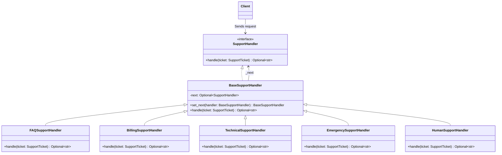

# 책임 연쇄 패턴 (Chain of Responsibility Pattern)

## 1. 패턴이 없을 때 발생하는 문제점 (The Problem)

책임 연쇄 패턴을 사용하지 않고 요청을 처리할 객체를 클라이언트가 직접 결정하면, 요청 종류가 늘어날수록 조건문이 커지고 클라이언트가 모든 처리 객체의 존재와 선택 규칙을 알아야 하는 문제가 발생합니다.

예를 들어 고객 지원 시스템에서 다음과 같은 요청을 처리한다고 가정합니다.

* 일반 문의
* 결제 문의
* 기술 문의
* 긴급 문의

이 글에서는 **우선순위가 100 이상인 요청을 분야와 관계없이 긴급팀이 먼저 처리**합니다. 나머지는 일반·결제·기술 담당 순서로 확인하고, 담당자가 없는 요청은 상담원에게 연결합니다. 패턴을 적용한 뒤에도 이 정책을 유지합니다.

### 패턴을 적용하지 않은 예시

```python
from dataclasses import dataclass


@dataclass(frozen=True)
class SupportTicket:
    category: str
    message: str
    priority: int


class FAQSupport:
    def handle(self, ticket: SupportTicket) -> str:
        return "[FAQ] 일반적인 문의를 처리합니다."


class BillingSupport:
    def handle(self, ticket: SupportTicket) -> str:
        return "[Billing] 결제 담당자가 처리합니다."


class TechnicalSupport:
    def handle(self, ticket: SupportTicket) -> str:
        return "[Technical] 기술팀이 처리합니다."


class EmergencySupport:
    def handle(self, ticket: SupportTicket) -> str:
        return "[Emergency] 긴급 지원팀으로 연결합니다."


class BadSupportService:
    def __init__(self):
        self.faq = FAQSupport()
        self.billing = BillingSupport()
        self.technical = TechnicalSupport()
        self.emergency = EmergencySupport()

    def process(self, ticket: SupportTicket) -> str:
        # 문제점: 요청을 누가 처리할지 클라이언트가 직접 결정
        if ticket.priority >= 100:
            return self.emergency.handle(ticket)
        elif ticket.category == "billing":
            return self.billing.handle(ticket)
        elif ticket.category == "technical":
            return self.technical.handle(ticket)
        elif ticket.category == "general":
            return self.faq.handle(ticket)

        return "[Human Operator] 상담원에게 요청을 전달합니다."

```

새로운 요청 종류가 추가되면 기존 분기문을 수정해야 합니다.

```python
elif ticket.category == "security":
    return self.security_support.handle(ticket)

```

문제가 여기에서 끝나지 않을 수도 있습니다. 예를 들어 일반 문의라고 하더라도 FAQ에서 처리할 수 없는 질문은 다음 담당자에게 넘겨야 한다고 가정합니다.

```text
긴급 요청인가? ── Yes → Emergency
    │ No
    ↓
FAQ가 처리 가능한가? ── Yes → FAQ
    │ No
    ↓
Billing이 처리 가능한가? ── Yes → Billing
    │ No
    ↓
Technical이 처리 가능한가? ── Yes → Technical
    │ No
    ↓
Human Operator

```

이런 규칙까지 클라이언트가 관리하기 시작하면 다음과 같은 코드가 만들어집니다.

```python
# 아래는 처리 후보 선택이 반복되는 구조를 보여주는 발췌 코드입니다.
if emergency.can_handle(ticket):
    return emergency.handle(ticket)

if faq.can_handle(ticket):
    return faq.handle(ticket)

if billing.can_handle(ticket):
    return billing.handle(ticket)

if technical.can_handle(ticket):
    return technical.handle(ticket)

return "[Human Operator] 상담원에게 요청을 전달합니다."

```

처리 객체가 늘어날수록 클라이언트가 책임 선택 규칙 전체를 관리하게 됩니다.

### 이 방식이 가진 단점

* **발신자(Sender)와 수신자(Receiver)의 강한 결합:** 요청을 보내는 쪽이 어떤 Handler들이 존재하는지 모두 알아야 합니다.
* **조건문의 증가:** 요청 종류와 처리 규칙이 늘어날수록 분기문이 무거워집니다.
* **OCP(개방-폐쇄 원칙) 위반:** 새로운 Handler를 추가할 때 기존 요청 분배 코드를 수정해야 합니다.
* **책임 선택 정책의 중복:** 비슷한 요청 분배 로직이 여러 클라이언트에 반복될 수 있습니다.
* **처리 순서 변경의 어려움:** "기술팀보다 보안팀을 먼저 확인한다"와 같은 정책 변경이 클라이언트 코드 수정으로 이어집니다.

---

## 2. 책임 연쇄 패턴으로 해결하기 (The Solution)

책임 연쇄 패턴은 "요청을 처리할 수 있는 여러 객체를 하나의 연쇄(Chain)로 연결하고, 각 Handler가 요청을 처리할 수 있으면 직접 처리하고 그렇지 않으면 다음 Handler로 전달하는 방식"으로 이 문제를 해결합니다.

일반적인 구조는 다음과 같습니다.

```text
Client
   │
   ↓
Handler A
   │
   ├─ 처리 가능 → Response
   │
   └─ 처리 불가
          ↓
       Handler B
          │
          ├─ 처리 가능 → Response
          │
          └─ 처리 불가
                 ↓
              Handler C

```

### 요청의 판단과 체인의 구성을 분리하기

이 예제에는 두 가지 변경 이유가 있습니다. “결제팀이 어떤 문의를 담당하는가”는 Billing Handler의 규칙이고, “긴급팀을 결제팀보다 먼저 확인하는가”는 체인의 구성 규칙입니다. 이를 분리하면 담당 조건을 수정할 때 연결 코드를, 우선순위를 수정할 때 담당자의 처리 내용을 함께 바꿀 필요가 줄어듭니다.

| 역할 | 예제의 구성 요소 | 담당하는 책임 |
| --- | --- | --- |
| Handler | `SupportHandler` | 요청과 처리 결과의 공통 계약 |
| Concrete Handler | Emergency·FAQ·Billing 등 | 담당 여부 판단과 처리 또는 위임 |
| 체인 구성 | `create_support_chain()` | 후보 등록과 처리 우선순위 |
| 요청 발신자 | `process_ticket()` | 첫 Handler에 요청하고 결과 사용 |

먼저 공통 Handler 인터페이스를 정의합니다.

```python
from abc import ABC, abstractmethod


class SupportHandler(ABC):
    @abstractmethod
    def handle(self, ticket: SupportTicket) -> str | None:
        pass

```

기본 Handler는 다음 Handler에 대한 참조를 가집니다.

```python
class BaseSupportHandler(SupportHandler):
    def __init__(self):
        self._next: SupportHandler | None = None

    def set_next(
        self, handler: "BaseSupportHandler"
    ) -> "BaseSupportHandler":
        self._next = handler
        return handler  # 체이닝 편의성을 위해 다음 핸들러 반환

    def handle(self, ticket: SupportTicket) -> str | None:
        if self._next is None:
            return None
        return self._next.handle(ticket)

```

구체 Handler는 자신이 처리할 수 있는 요청인지 판단합니다.

```python
class BillingSupportHandler(BaseSupportHandler):
    def handle(self, ticket: SupportTicket) -> str | None:
        if ticket.category == "billing":
            return "[Billing] 결제팀이 처리합니다."
        return super().handle(ticket)


class TechnicalSupportHandler(BaseSupportHandler):
    def handle(self, ticket: SupportTicket) -> str | None:
        if ticket.category == "technical":
            return "[Technical] 기술팀이 처리합니다."
        return super().handle(ticket)

```

이제 Handler를 원하는 순서로 연결합니다.

```python
emergency = EmergencySupportHandler()
faq = FAQSupportHandler()
billing = BillingSupportHandler()
technical = TechnicalSupportHandler()
fallback = HumanSupportHandler()

emergency.set_next(faq).set_next(billing).set_next(technical).set_next(fallback)

```

클라이언트는 체인의 첫 번째 Handler에게 요청을 전달하기만 하면 됩니다.

```python
result = emergency.handle(ticket)

```

클라이언트는 다음 사실을 알 필요가 없습니다.

* 몇 개의 Handler가 있는가?
* 어떤 Handler가 처리하는가?
* 내부적으로 어떤 후보를 거쳐 처리했는가?
* 중간 Handler가 요청을 넘겼는가?

요청을 보내는 코드는 내부 연결을 몰라도 되지만, 체인을 조립하는 코드는 검사 순서를 알아야 합니다. 긴급 처리를 마지막에 두면 결제·기술 Handler가 긴급 요청을 먼저 받아 버릴 수 있습니다.

요청은 Chain을 따라 순차적으로 이동합니다.

```text
Emergency → FAQ → Billing → Technical → Human Operator

일반 기술 문의: Emergency (Pass) → FAQ (Pass) → Billing (Pass) → Technical (Handle)

```

핵심은 단순히 `if` 문을 여러 클래스로 나누는 것이 아닙니다. **요청의 발신자가 최종 수신자를 직접 선택하지 않도록 하고, 요청 처리 책임을 여러 Handler에게 순차적으로 위임하여 처리자 선택 자체를 Chain의 구조로 표현하는 것**이 책임 연쇄 패턴의 본질입니다.

---

## 3. 장점, 단점 및 트레이드오프 (Trade-off)

### 장점 (Pros)

* **발신자와 수신자의 결합도 감소:** 클라이언트는 구체적인 최종 Handler를 알 필요가 없습니다.
* **단일 책임 원칙(SRP):** 각 Handler가 자신이 담당하는 조건과 처리 로직에만 집중할 수 있습니다.
* **처리 순서의 유연성:** Handler 연결 순서를 변경하여 처리 정책을 쉽게 바꿀 수 있습니다.
* **런타임 Chain 구성 가능:** 설정이나 실행 환경에 따라 동적으로 Handler를 추가하거나 제거할 수 있습니다.
* **개방-폐쇄 원칙(OCP):** 기존 Handler를 유지하면서 새 Handler를 추가할 수 있습니다. 체인을 조립하는 구성 코드는 등록 순서에 맞게 수정해야 합니다.
* **Short-Circuit 처리:** 특정 Handler가 요청을 처리하면 이후 Handler를 실행하지 않고 즉시 종료됩니다.

### 단점 (Cons)

* **요청 처리 보장 없음:** Chain 끝까지 어떤 Handler도 책임을 지지 않으면 요청이 미처리 상태로 남을 수 있습니다.
* **처리 흐름 추적의 어려움:** 디버깅 시 요청이 실제로 어느 Handler에서 처리되는지 코드만 보고 즉시 파악하기 어려울 수 있습니다.
* **순서 의존성:** Handler 순서를 잘못 구성하면 상위 조건의 Handler가 요청을 선점하는 부작용이 발생할 수 있습니다.
* **콜 스택 및 성능 Overhead:** Chain이 매우 길어질 경우, 요청 전달에 따른 메서드 호출 스택이 늘어납니다.

### 트레이드오프 (Trade-off)

* **처리 후보가 여러 개일수록 유리:** 하나의 요청에 대해 여러 객체가 "내가 처리할 수 있는가?"를 판단해야 하는 유연한 구조에 적합합니다.
* **처리 대상이 고정적이라면 불필요할 수 있음:** 요청 종류와 담당자가 1:1로 고정되어 있다면 단순 Dictionary Dispatcher가 더 명확합니다.

```python
handlers = {
    "billing": billing_handler,
    "technical": technical_handler,
}

```

* **Chain 순서는 비즈니스 정책:** 먼저 배치된 Handler가 요청을 선점할 수 있으므로 순서를 단순한 구현 세부사항으로 취급해서는 안 됩니다.
* **미처리 결과의 명시:** 마지막에 Fallback Handler를 두면 담당자가 없는 요청의 경로를 정할 수 있습니다. 상담원 연결은 접수 방식이며, 실제 요청 해결이나 외부 작업의 성공까지 보장하지는 않습니다.

```text
Specialized Handler ──> Specialized Handler ──> Fallback Handler

```

* **한 Handler가 처리를 반드시 종료할 필요는 없음:** 고전적인 Chain of Responsibility에서는 한 Handler가 처리하면 연쇄가 종료되지만, 필요에 따라 처리 후 다음 Handler에도 전달하는 변형(Pipeline 패턴 등)도 가능합니다.

---

### 패턴 비교 (Pattern Comparisons)

#### Chain of Responsibility vs. Decorator

두 패턴은 구조적으로 매우 유사해 보이지만 요청 전달의 목적이 다릅니다.

* **Decorator:** 같은 계약을 유지하며 기능을 **누적·가공**하는 것이 목적입니다. 캐시 적중이나 오류 등으로 내부 호출을 생략할 수도 있으므로, 모든 계층의 실행 여부만으로 두 패턴을 구분하지는 않습니다.

```text
Decorator A ──> Decorator B ──> Concrete Component

```

* **Chain of Responsibility:** 여러 후보 중 누가 요청을 맡아서 처리할 것인가(탐색)가 목적입니다.

```text
Handler A ──(Pass)──> Handler B (Handle & Stop)

```

> **웹 Middleware의 성격:** 웹 프레임워크의 Middleware는 두 성격을 모두 가집니다. 다음 Handler를 무조건 호출하면서 전/후처리를 더하면 Decorator 성격을 띠고, 권한 검사 등 특정 조건에서 다음 Handler를 호출하지 않고 응답을 Short-circuit하면 Chain of Responsibility 성격을 띱니다.

#### Chain of Responsibility vs. Command

* **Command:** 요청 자체를 **독립된 객체로 캡슐화**하는 데 초점을 둡니다.
* **Chain of Responsibility:** 전달된 요청을 **누가 처리할 것인가**를 수신자 체인 사이에서 결정하는 데 초점을 둡니다.

---

## 4. 파이썬 오픈소스에서 볼 수 있는 책임 연쇄와 유사한 설계

파이썬 생태계에서는 순차적인 Handler 연결과 선택적 전달·Short-circuit이라는 핵심 아이디어를 다음과 같이 활용하고 있습니다.

### Django Middleware

Django의 Middleware는 `get_response`라는 다음 callable을 전달받아 새로운 `request -> response` 구조를 구성합니다. Middleware가 `get_response(request)`를 호출하면 다음 Middleware 또는 최종 View로 요청이 전달됩니다.

```python
def simple_middleware(get_response):
    def middleware(request):
        # 요청 전 처리
        response = get_response(request)
        # 응답 후 처리
        return response

    return middleware

```

Middleware가 `get_response`를 호출하지 않고 직접 `HttpResponse`를 반환하면, 뒤쪽의 Middleware와 View는 실행되지 않고 종료됩니다(Short-circuit).

### urllib.request.OpenerDirector

Python 표준 라이브러리의 `urllib.request.OpenerDirector`는 여러 `BaseHandler`들을 체인으로 연결해 URL을 열고 예외를 처리합니다.

```python
import urllib.request

opener = urllib.request.build_opener(
    urllib.request.ProxyHandler(),
    urllib.request.HTTPBasicAuthHandler(),
)

```

`OpenerDirector`는 처리 단계와 `handler_order`에 따라 Handler를 호출합니다. URL 열기와 오류 처리에서는 유효한 응답을 얻을 때까지 후보를 시도하는 흐름이 있습니다. 요청·응답 전처리처럼 여러 Handler를 거치는 단계도 있으므로 모든 메서드가 동일한 `Response | None` 계약을 따르는 것은 아닙니다.

### aiohttp Middleware Chain

`aiohttp`의 Client Middleware 역시 Request와 다음 Handler를 받아 처리하는 형태입니다. 등록된 순서대로 Chain을 구성하며 필요에 따라 Short-circuit 하거나 다음 Handler로 전달할 수 있습니다.

---

## 5. 클래스 다이어그램



### 역할 정의

* **Handler:** `SupportHandler`
* **Base Handler:** `BaseSupportHandler`
* **Concrete Handlers:** `EmergencySupportHandler`, `FAQSupportHandler`, `BillingSupportHandler`, `TechnicalSupportHandler`, `HumanSupportHandler`
* **Client:** 요청을 생성하고 Chain의 시작점에 전달하는 주체

---

## 6. 파이썬 예제 코드

다음 코드는 Python 3.10 이상에서 외부 패키지 없이 실행할 수 있습니다. 앞의 설명용 발췌 코드와 달리, 이 블록에는 실행에 필요한 정의가 모두 포함되어 있습니다.

```python
from abc import ABC, abstractmethod
from dataclasses import dataclass


@dataclass(frozen=True)
class SupportTicket:
    category: str
    message: str
    priority: int = 0


class SupportHandler(ABC):
    @abstractmethod
    def handle(self, ticket: SupportTicket) -> str | None:
        pass


class BaseSupportHandler(SupportHandler):
    def __init__(self) -> None:
        self._next: SupportHandler | None = None

    def set_next(
        self, handler: "BaseSupportHandler"
    ) -> "BaseSupportHandler":
        self._next = handler
        return handler

    def handle(self, ticket: SupportTicket) -> str | None:
        if self._next is None:
            return None
        return self._next.handle(ticket)


class EmergencySupportHandler(BaseSupportHandler):
    def handle(self, ticket: SupportTicket) -> str | None:
        if ticket.priority >= 100:
            return "[Emergency] 긴급 지원팀으로 요청을 전달합니다."
        return super().handle(ticket)


class FAQSupportHandler(BaseSupportHandler):
    def handle(self, ticket: SupportTicket) -> str | None:
        if ticket.category == "general":
            return "[FAQ] 일반 문의를 자동 응답합니다."
        return super().handle(ticket)


class BillingSupportHandler(BaseSupportHandler):
    def handle(self, ticket: SupportTicket) -> str | None:
        if ticket.category == "billing":
            return "[Billing] 결제 담당자가 요청을 처리합니다."
        return super().handle(ticket)


class TechnicalSupportHandler(BaseSupportHandler):
    def handle(self, ticket: SupportTicket) -> str | None:
        if ticket.category == "technical":
            return "[Technical] 기술 지원팀이 요청을 처리합니다."
        return super().handle(ticket)


class HumanSupportHandler(BaseSupportHandler):
    def handle(self, ticket: SupportTicket) -> str | None:
        return "[Human Operator] 상담원에게 요청을 전달합니다."


def create_support_chain() -> SupportHandler:
    emergency = EmergencySupportHandler()
    faq = FAQSupportHandler()
    billing = BillingSupportHandler()
    technical = TechnicalSupportHandler()
    fallback = HumanSupportHandler()

    # 순서 자체가 정책입니다. 긴급 요청을 먼저 확인합니다.
    emergency.set_next(faq).set_next(billing).set_next(technical).set_next(fallback)
    return emergency


def process_ticket(handler: SupportHandler, ticket: SupportTicket) -> None:
    result = handler.handle(ticket)
    if result is None:
        print("처리할 수 없는 요청입니다.")
    else:
        print(result)


if __name__ == "__main__":
    chain = create_support_chain()
    tickets = [
        SupportTicket("general", "비밀번호 변경 방법", 10),
        SupportTicket("billing", "중복 결제 문의", 20),
        SupportTicket("technical", "실행 오류", 30),
        SupportTicket("billing", "긴급 결제 장애", 100),
        SupportTicket("unknown", "서버 다운", 100),
        SupportTicket("unknown", "기타 문의", 0),
    ]
    for ticket in tickets:
        process_ticket(chain, ticket)

```

**실행 결과:**

```text
[FAQ] 일반 문의를 자동 응답합니다.
[Billing] 결제 담당자가 요청을 처리합니다.
[Technical] 기술 지원팀이 요청을 처리합니다.
[Emergency] 긴급 지원팀으로 요청을 전달합니다.
[Emergency] 긴급 지원팀으로 요청을 전달합니다.
[Human Operator] 상담원에게 요청을 전달합니다.
```

### 실행 흐름 살펴보기

긴급 결제 문의는 Billing까지 내려가지 않고 첫 Emergency Handler에서 처리됩니다. 알 수 없는 일반 문의는 마지막 Human Handler로 이동합니다. `None`은 Handler를 호출하지 않았다는 뜻이 아니라, 끝까지 처리 결과를 얻지 못했다는 명시적인 값입니다.

체인은 요청을 처리하기 전에 구성하고, 순환 연결이나 실행 중 연결 변경은 허용하지 않는다고 가정합니다. 이 예제의 Setter가 그 규칙까지 검사하지는 않습니다. 긴 체인에서는 재귀 호출 대신 부록처럼 목록을 반복하는 방법도 검토할 수 있습니다. Handler에서 예외가 발생하면 그대로 전파되며, 자동으로 다음 후보에 넘기지 않습니다.

### 새로운 보안 담당자를 추가하기

지원 분야에 보안 문의가 추가되었다고 가정합니다. 새 Handler는 기존 계약을 구현하고, 구성 단계에서 긴급팀 뒤에 배치합니다. 아래 코드는 앞의 클래스 정의에 이어서 실행할 수 있습니다.

```python
class SecuritySupportHandler(BaseSupportHandler):
    def handle(self, ticket: SupportTicket) -> str | None:
        if ticket.category == "security":
            return "[Security] 보안팀이 요청을 처리합니다."
        return super().handle(ticket)


chain = EmergencySupportHandler()
chain.set_next(SecuritySupportHandler()).set_next(FAQSupportHandler()).set_next(
    BillingSupportHandler()
).set_next(TechnicalSupportHandler()).set_next(HumanSupportHandler())

process_ticket(chain, SupportTicket("security", "계정 접근 문의", 10))
process_ticket(chain, SupportTicket("security", "긴급 계정 침해", 100))
```

**실행 결과:**

```text
[Security] 보안팀이 요청을 처리합니다.
[Emergency] 긴급 지원팀으로 요청을 전달합니다.
```

기존 Billing·Technical Handler와 요청 발신자는 그대로 사용합니다. 바뀐 부분은 새 담당자의 정의와 연결 순서입니다. 이처럼 처리 규칙의 확장과 정책을 조립하는 영역의 변경을 구분하는 것이 책임 연쇄의 설계 이점입니다.

---

## 부록 (Appendix): 현대적 타입 시스템과 함수형 관점의 재해석

책임 연쇄 패턴의 고객 지원 예제에서 중요한 것은 Handler 객체의 연결 방식보다 **여러 처리 후보를 어떤 순서로 시도하고, 어떤 결과에서 멈출 것인가**입니다. 이 선택 규칙을 함수와 반환 타입으로 표현하면 처리 로직과 체인 구성을 더 분명하게 나눌 수 있습니다.

```text
객체지향: Handler가 다음 Handler에 위임
함수형:   Handler가 결정을 반환하고 조합 함수가 다음 후보 선택
```

이 부록에서는 `Option`, 대수적 데이터 타입(ADT), 고차 함수와 선택 연산을 지원하는 **가상의 Python 스타일 문법**을 사용합니다. 실행 가능한 구현은 본문의 6절을 참고합니다.

### 부록을 읽는 순서와 전제

1~3절은 본문의 지원 요청을 함수 목록으로 처리하는 과정입니다. 4~5절은 미처리와 실패를 구별하고 순서 있는 선택을 합성하는 방법을 다룹니다. 6~7절에서는 이 구조가 단순 분배표나 Middleware와 어떻게 다른지 살펴봅니다.

---

### 1. Handler의 처리 결과를 `Option`으로 표현하기

본문의 `BillingSupportHandler`는 결제 문의를 처리하고, 나머지는 다음 객체에 넘깁니다. 이 두 책임 중 **처리 여부의 판단**만 함수로 옮겨 봅니다.

```python
type Handler[Req, Res] = Req -> Option[Res]


def billing_handler(ticket: SupportTicket) -> Option[str]:
    if ticket.category == "billing":
        return Some("[Billing] 결제 담당자가 요청을 처리합니다.")
    return None
```

`Some(response)`는 처리 결과가 있다는 뜻이고, `None`은 다음 후보를 시도해도 된다는 뜻입니다. 함수는 다음 담당자가 누구인지 알 필요가 없습니다.

일부 요청에만 답한다는 의미에서는 부분적인 처리 규칙입니다. 다만 구현은 미처리도 값으로 반환하므로, 모든 입력에서 종료한다면 `Req -> Option[Res]` 형태의 전함수로 표현할 수 있습니다. `None`은 반환 자체가 생략되었다는 의미가 아닙니다.

---

### 2. 객체 연결을 순서 있는 함수 목록으로 바꾸기

긴급 문의, 일반 문의, 결제 문의, 기술 문의, 상담원 연결을 각각 같은 타입의 함수로 정의하면 체인은 함수 목록이 됩니다.

```python
handlers: Vector[Handler[SupportTicket, str]] = [
    emergency_handler,
    faq_handler,
    billing_handler,
    technical_handler,
    human_handler,
]


def first_handled[Req, Res](
    handlers: Vector[Handler[Req, Res]],
    request: Req,
) -> Option[Res]:
    for handler in handlers:
        match handler(request):
            case Some(response):
                return Some(response)
            case None:
                continue
    return None
```

처리 함수는 담당 조건과 응답을 정의하고, `first_handled()`는 첫 처리 결과에서 종료하는 공통 흐름을 정의합니다. 객체지향의 `_next` 참조가 목록의 순서로 옮겨진 것입니다.

본문의 긴급 결제 문의는 첫 함수에서 `Some`을 반환하므로 `billing_handler`가 실행되지 않습니다. 긴 체인을 목록으로 순회하면 다음 Handler를 호출하기 위한 재귀 스택도 필요하지 않습니다.

---

### 3. Fallback을 처리 정책의 마지막 단계로 두기

담당자가 없는 문의를 어떻게 처리할지도 명시적인 함수로 표현할 수 있습니다.

```python
def human_handler(ticket: SupportTicket) -> Option[str]:
    return Some("[Human Operator] 상담원에게 요청을 전달합니다.")
```

이 함수는 항상 결과를 반환하므로 마지막에 배치합니다. 맨 앞에 두면 모든 요청을 선점하여 전문 담당자에게 도달하지 않습니다.

```text
전문 담당자들 → human_handler → 상담원 연결
human_handler → 전문 담당자들 → 뒤쪽 후보에 도달하지 않음
```

이처럼 체인의 순서는 단순한 저장 순서가 아니라 업무 정책입니다. 설정으로 Handler를 등록하더라도 긴급 우선, 전문 담당, 최종 접수라는 관계를 유지해야 합니다. Fallback이 보장하는 것은 접수 경로이며, 문의가 실제로 해결되었다는 사실은 별도의 처리 결과입니다.

---

### 4. 미처리와 처리 실패를 다른 결과로 표현하기

결제 문의를 조회하는 과정에서 지원 시스템에 연결하지 못했다고 가정합니다. 이를 `None`으로 반환하면 “결제팀의 담당이 아니다”라는 의미로 바뀌어 상담원에게 정상 전달된 것처럼 보일 수 있습니다.

세 가지 결과를 구분하면 이런 의미 손실을 줄일 수 있습니다.

```python
data Decision[Res, Err] =
    Pass
  | Handled(response: Res)
  | Failed(error: Err)


def billing_handler(ticket: SupportTicket) -> Decision[str, SupportError]:
    if ticket.category != "billing":
        return Pass

    match lookup_billing_ticket(ticket):
        case Ok(details):
            return Handled(format_billing_response(details))
        case Err(error):
            return Failed(error)
```

호출자는 결과에 따라 다음 후보를 시도할지 결정합니다.

```python
def dispatch[Req, Res, Err](handlers, request: Req) -> Decision[Res, Err]:
    for handler in handlers:
        match handler(request):
            case Pass:
                continue
            case Handled(response):
                return Handled(response)
            case Failed(error):
                return Failed(error)
    return Pass
```

이 정책에서는 `Pass`만 다음 후보로 이어지고 실패는 체인을 종료합니다. 이미 접수 정보를 저장한 뒤 실패했을 수 있으므로, 실패를 다른 담당자에게 넘길 때는 중복 처리와 복구 규칙을 따로 정해야 합니다. ADT는 그 결정을 코드에 드러내는 수단입니다.

---

### 5. 왼쪽 우선 선택을 조합 연산으로 표현하기

두 Handler를 결합하여 다시 하나의 Handler를 만드는 함수를 정의할 수 있습니다.

```python
def or_else[Req, Res](
    left: Handler[Req, Res],
    right: Handler[Req, Res],
) -> Handler[Req, Res]:
    def combined(request: Req) -> Option[Res]:
        match left(request):
            case Some(response):
                return Some(response)
            case None:
                return right(request)
    return combined
```

`or_else(emergency_handler, billing_handler)`도 같은 `Handler` 타입이므로 다른 후보와 다시 결합할 수 있습니다. 이 왼쪽 우선 선택을 가상의 `<|>` 연산자로 쓰면 다음과 같습니다.

```python
combined = emergency_handler <|> faq_handler <|> billing_handler
```

여기서 중요한 것은 **왼쪽이 미처리일 때만 오른쪽을 호출한다**는 규칙입니다. 양쪽의 결과를 미리 계산하면 불필요한 외부 조회나 중복 처리가 생길 수 있습니다. Alternative 계열 추상화와 연결해 이해할 수 있지만, 모든 `<|>` 구현이 이 선택 규칙을 갖는 것은 아닙니다.

순수하고 종료하는 Handler에 이 규칙을 적용하면, 항상 `None`을 반환하는 함수는 빈 체인 역할을 합니다. 괄호를 바꾸어 같은 순서로 묶을 수 있어도 후보 순서를 바꿀 수 있다는 뜻은 아닙니다. 긴급 Handler와 Fallback의 순서는 여전히 결과를 바꿉니다.

---

### 6. 닫힌 분배 규칙과 열린 처리 후보를 구분하기

문의 종류가 `billing`과 `technical` 두 가지뿐이고 담당자가 고정되어 있다면 분배표가 더 직접적입니다. 책임 연쇄가 유용해지는 지점은 **여러 조건이 겹치거나 후보가 요청을 거절하고 다음 후보에게 넘길 수 있을 때**입니다.

| 선택 기준 | 분배표 / 단일 분기 | 책임 연쇄 |
| --- | --- | --- |
| 분야별 담당이 고정됨 | 키로 직접 선택 | 순차 탐색의 이점이 작음 |
| 긴급도가 분야보다 우선함 | 우선 조건을 별도로 표현 | 후보 순서로 우선순위 표현 |
| 플러그인이 처리 후보를 추가함 | 등록과 선택 규칙을 함께 관리 | 공통 계약의 Handler를 등록 |
| 담당 여부가 실행 중 결정됨 | 선택 함수에 판단이 집중됨 | 각 후보가 판단 후 위임 |

요청 종류를 닫힌 ADT로 정의하면 전수 검사를 지원하는 언어나 정적 검사 도구에서 누락된 분기를 확인할 수 있습니다. 반면 외부 플러그인으로 후보를 늘릴 때는 Handler 계약과 등록 순서의 검증이 더 중요합니다. Python의 `match` 문 자체가 모든 경우의 처리를 강제하는 것은 아닙니다.

---

### 7. Handler 선택과 Middleware 합성의 차이

지원 요청의 Handler는 답변을 만들면 종료합니다. 웹 Middleware는 다음 처리를 호출한 뒤 돌아온 응답에도 작업을 추가할 수 있습니다.

```python
type Endpoint = Request -> Response
type Middleware = Endpoint -> Endpoint


def with_request_log(next: Endpoint) -> Endpoint:
    def handle(request: Request) -> Response:
        log_request(request)
        response = next(request)
        log_response(response)
        return response
    return handle
```

`next`는 이후 실행을 나타내는 함수입니다. 이 함수를 호출하지 않고 바로 응답하면 단락 평가가 되고, 호출 전후에 기능을 추가하면 데코레이터와 유사한 합성이 됩니다. 실제 비동기 Middleware에서는 이 반환형이 비동기 계산을 포함하도록 달라집니다.

[데코레이터 패턴](../structural/decorator.md)이 같은 계약에 기능을 더하는 데 초점을 둔다면, 책임 연쇄는 요청을 받아들일 처리자를 찾는 데 초점을 둡니다. 객체나 함수의 중첩 모양보다 **어떤 조건에서 다음 처리를 호출하는가**를 기준으로 구별하는 것이 유용합니다.

---

### 요약 및 비교

| 관점 | 책임 연쇄 패턴 (OOP) | 현대 타입 시스템과 함수형 관점 |
| --- | --- | --- |
| 처리 후보 | Handler 객체 | `Req -> Option[Res]` 함수 |
| 다음 후보 | `_next` 참조 | 순서 있는 함수 목록 |
| 처리 종료 | 다음 객체를 호출하지 않음 | 첫 `Some` / `Handled`에서 반환 |
| 미처리와 실패 | 반환값·예외 계약 | `Pass / Handled / Failed` ADT |
| 순서 있는 결합 | 객체 연결 | `or_else` / 왼쪽 우선 선택 |
| 요청 전후 처리 | Middleware 객체 | 다음 함수를 받는 고차 함수 |
| 확장 비용 | 연결 순서와 객체 수명 관리 | 함수의 효과와 선택 규칙 관리 |

### 결론

책임 연쇄는 여러 처리 후보를 우선순위에 따라 조합하는 패턴입니다. 객체 연결과 함수 목록 중 어떤 표현을 사용하든, 처리 수락·미처리·실패의 의미와 다음 후보를 실행하는 조건을 명확히 정의하는 것이 핵심입니다.
