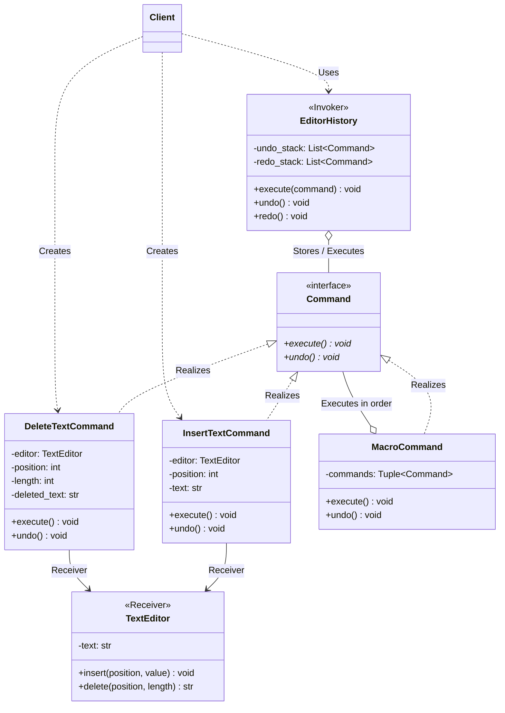

# 커맨드 패턴 (Command Pattern)

## 1. 패턴이 없을 때 발생하는 문제점 (The Problem)

커맨드 패턴을 사용하지 않고 요청을 발생시키는 객체가 실제 작업을 수행하는 객체의 메서드를 직접 호출하면, 요청을 보내는 시점과 실행하는 시점을 분리하기 어렵고 실행 내역을 저장하거나 취소(Undo)·재실행(Redo)하는 기능을 추가하기 어려워집니다.

예를 들어 텍스트 편집기에서 문자열 삽입과 삭제 기능을 제공한다고 가정합니다.

### 패턴을 적용하지 않은 예시

```python
class TextEditor:

    def __init__(self):
        self.text = ""

    def insert(self, position: int, value: str) -> None:
        self.text = self.text[:position] + value + self.text[position:]

    def delete(self, position: int, length: int) -> str:
        deleted = self.text[position : position + length]
        self.text = self.text[:position] + self.text[position + length :]
        return deleted


class BadEditorApplication:

    def __init__(self, editor: TextEditor):
        self.editor = editor

    def insert_text(self, position: int, text: str) -> None:
        # 문제점: 요청을 발생시키는 객체가 Receiver의 구체 메서드를 직접 호출
        self.editor.insert(position, text)

    def delete_text(self, position: int, length: int) -> None:
        self.editor.delete(position, length)

```

이 구조 자체는 단순한 프로그램에서는 문제가 없습니다.

하지만 다음 기능을 추가한다고 가정합니다.

* Undo / Redo
* 명령 실행 기록 (History)
* 명령 Queue
* Macro 실행
* 실행 지연 (Delayed Execution)
* 원격 명령 전송 (Remote Execution)

Undo를 추가하려면 이전 작업에 대한 정보를 별도로 기록해야 합니다.

```python
def insert_text(self, position: int, text: str) -> None:
    self.editor.insert(position, text)
    self.history.append(("insert", position, text))

```

삭제 명령은 복원할 원래 문자열까지 저장해야 합니다.

```python
def delete_text(self, position: int, length: int) -> None:
    deleted = self.editor.text[position : position + length]
    self.editor.delete(position, length)
    self.history.append(("delete", position, deleted))

```

Undo 실행 시에는 명령 종류별로 분기하여 처리해야 합니다.

```python
def undo(self) -> None:
    if not self.history:
        return

    command = self.history.pop()

    if command[0] == "insert":
        ...
    elif command[0] == "delete":
        ...
    elif command[0] == "replace":
        ...
    elif command[0] == "format":
        ...

```

새로운 작업이 추가될수록 요청 실행과 History 처리, Undo 로직이 함께 비대해지며 복잡성이 증가합니다.

### 이 방식이 가진 단점

1. **Invoker와 Receiver의 강한 결합**: 요청을 발생시키는 객체가 `TextEditor.insert()`, `TextEditor.delete()` 등의 구체적인 동작을 직접 알아야 합니다.
2. **요청을 값처럼 다루기 어려움**: 직접 호출만으로는 작업의 인자와 실행 정보를 나중에 사용할 값으로 보관하지 못합니다.
3. **Undo/Redo 구현의 복잡성**: 각 요청을 어떻게 되돌릴 것인지 별도의 조건문에서 관리해야 합니다.
4. **실행 시점 분리의 어려움**: "지금 요청을 만들고 나중에 실행"하는 구조를 만들기 어렵습니다.
5. **Macro 및 Batch 구성의 어려움**: 여러 요청을 하나의 단위로 저장하고 순차 실행하려면 별도의 표현 구조가 필요합니다.

---

## 2. 커맨드 패턴으로 해결하기 (The Solution)

커맨드 패턴은 "요청 자체를 하나의 객체(Command)로 캡슐화하여, 요청을 발생시키는 객체와 실제 작업을 수행하는 객체를 분리하는 방식"으로 이 문제를 해결합니다.

일반적인 구조는 다음과 같습니다.

```text
Client ──► Command ──► Receiver
             ▲
Invoker ─────┘  (execute / undo)

```

### 요청 생성, 실행, 실제 편집의 책임

메뉴 항목이나 단축키는 사용자의 의도를 받아 명령을 생성합니다. `EditorHistory`는 그 명령을 실행하고 이력을 관리하며, `TextEditor`는 실제 문자열을 변경합니다. 같은 삽입 명령을 메뉴와 단축키에서 사용할 수 있고, 실행 이력의 정책을 바꾸어도 문자열 편집 알고리즘은 유지됩니다.

| 역할 | 예제의 구성 요소 | 담당하는 책임 |
| --- | --- | --- |
| Client | 메뉴·단축키 또는 실행 코드 | Receiver와 인자를 선택해 명령 생성 |
| Command | `InsertTextCommand`, `DeleteTextCommand` | 요청과 복구 정보 보관 |
| Invoker | `EditorHistory` | 실행 시점과 Undo/Redo 이력 관리 |
| Receiver | `TextEditor` | 문자열 삽입과 삭제 수행 |

이 편집기에서 사용할 공통 인터페이스를 정의합니다. **커맨드 패턴 자체에 Undo가 필수인 것은 아닙니다.** 여기서는 모든 편집 요청을 되돌릴 수 있도록 `execute()`와 `undo()`를 함께 요구합니다.

```python
from abc import ABC, abstractmethod


class Command(ABC):

    @abstractmethod
    def execute(self) -> None:
        pass

    @abstractmethod
    def undo(self) -> None:
        pass

```

문자열 삽입 작업 자체를 하나의 Command 객체로 만듭니다.

```python
class InsertTextCommand(Command):

    def __init__(self, editor: TextEditor, position: int, text: str):
        self._editor = editor
        self._position = position
        self._text = text

    def execute(self) -> None:
        self._editor.insert(self._position, self._text)

    def undo(self) -> None:
        self._editor.delete(self._position, len(self._text))

```

삭제 명령 역시 별도의 객체로 표현합니다.

```python
class DeleteTextCommand(Command):

    def __init__(self, editor: TextEditor, position: int, length: int):
        self._editor = editor
        self._position = position
        self._length = length
        self._deleted_text = ""

    def execute(self) -> None:
        # 삭제 전 텍스트를 백업한 후 삭제
        self._deleted_text = self._editor.delete(self._position, self._length)

    def undo(self) -> None:
        self._editor.insert(self._position, self._deleted_text)

```

Invoker(`EditorHistory`)는 구체적인 편집 작업의 내용이나 Receiver의 메서드를 알지 못합니다.

```python
class EditorHistory:

    def __init__(self):
        self._undo_stack: list[Command] = []

    def execute(self, command: Command) -> None:
        command.execute()
        self._undo_stack.append(command)

```

Invoker가 알고 있는 것은 `Command.execute()`와 `Command.undo()`뿐입니다.

따라서 다음과 같이 요청 객체를 생성한 뒤:

```python
command = InsertTextCommand(editor, position=0, text="Hello")

```

즉시 실행할 수도 있고,

```python
history.execute(command)

```

Queue에 담아 나중에 실행할 수도 있습니다. 다음 발췌 코드는 지연 실행만 보여주며 History에는 기록하지 않습니다. Undo까지 필요하면 `command.execute()` 대신 `history.execute(command)`를 호출합니다.

```python
queue.append(command)

for command in queue:
    command.execute()

```

Undo도 각 Command 객체가 자신의 역연산을 알고 있으므로 Invoker에서 타입별 조건문이 필요하지 않습니다.

```python
command = self._undo_stack[-1]
command.undo()
self._undo_stack.pop()

```

핵심은 단순히 메서드 호출을 클래스로 감싸는 것이 아닙니다.

**실행할 작업과 그 작업에 필요한 Receiver·인자·복구 정보 등을 하나의 독립적인 요청 객체로 승격시켜, 요청 자체를 저장·전달·조합·지연·취소할 수 있게 만드는 것**이 커맨드 패턴의 본질입니다.

---

## 3. 장점, 단점 및 트레이드오프 (Trade-off)

### 장점 (Pros)

* **Invoker와 Receiver의 결합도 감소**: Invoker는 실제 작업을 수행하는 객체의 세부 메서드를 알 필요 없이 `Command` 인터페이스만 사용합니다.
* **요청의 일급 객체화**: 요청을 변수에 저장하거나 컬렉션에 보관하고 다른 객체에 전달할 수 있습니다.
* **Undo/Redo 구현에 유리**: Command가 실행에 필요한 정보와 역연산 정보를 함께 보관할 수 있습니다.
* **Queue 및 Scheduling에 적합**: 요청을 즉시 실행하지 않고 Queue에 넣어 나중에 실행할 수 있습니다.
* **Macro Command 구현 가능**: 여러 Command를 하나의 Command로 묶어 복합 작업(Composite)으로 실행할 수 있습니다.
* **로깅 및 감사 기록(Audit Log)에 유리**: 어떤 명령이 언제 실행되었는지를 명시적인 객체 단위로 기록할 수 있습니다.
* **재시도 및 원격 실행에 유리**: 실행 요청과 실행 시점을 분리할 수 있으므로 비동기/분산 작업 시스템과 잘 맞습니다.

### 단점 (Cons)

* **클래스 수 증가**: 작은 작업마다 Concrete Command 클래스가 하나씩 추가되므로 클래스 개수가 늘어납니다.
* **단순 요청에는 과도한 구조**: 단순한 콜백 하나로 충분한 문제에 Command 객체를 적용하면 코드가 불필요하게 복잡해질 수 있습니다.
* **Undo 구현이 항상 가능한 것은 아님**: 이메일 발송이나 외부 결제처럼 이미 발생한 부수효과(Side-effect)를 완전히 되돌릴 수 없는 작업도 존재합니다.
* **Command 상태 관리의 복잡성**: Undo를 지원하기 위해 실행 전 상태나 실행 결과를 Command에 보관해야 하므로 메모리를 차지할 수 있습니다.
* **직렬화 문제**: Command를 Queue나 네트워크로 전달하려면 Receiver의 직접 객체 참조를 직렬화(Serialization)하기 어려울 수 있습니다.

### 트레이드오프 (Trade-off)

1. **요청 저장/지연 실행 필요성에 따른 선택**: Undo/Redo, Job Queue, 작업 예약, Macro, 원격 명령 등이 필요할수록 명령을 독립된 값으로 표현할 이유가 커집니다.
2. **콜백과의 비교**: 단지 요청을 나중에 호출하기만 하면 된다면, 클래스 정의보다 일급 함수(Lambda/Closure)를 전달하는 것이 훨씬 간단합니다.
3. **Undo 방식의 다양성**: 역연산(Inverse Operation)을 직접 실행할 수도 있고, 실행 전 상태를 스냅샷(Memento)으로 저장하여 복원할 수도 있습니다.
4. **Receiver의 존재 유무**: GoF 전형적 구조에서는 Receiver에 작업을 위임하지만, Command 자체가 모든 실행 로직을 가질 수도 있습니다.
5. **불변성(Immutability)**: 요청 인자를 불변 데이터로 보관하면 전달 중 변경을 줄일 수 있습니다. 그러나 Receiver와 Undo 정보까지 자동으로 불변이 되는 것은 아닙니다. 본문의 Command는 삭제한 내용을 저장하므로 상태를 가지며, 새 요청마다 새 객체를 만듭니다.
6. **재시도와 중복 실행**: 큐에 넣은 작업은 다시 전달될 수 있습니다. 실행 요청을 저장하는 것과 중복 효과를 막는 것은 별개이므로, 원격 작업에는 멱등성 키나 중복 처리 기록 같은 정책이 필요합니다.

---

### 패턴 간 비교

#### Command vs Strategy

* **Strategy**: "이 작업을 **어떤 알고리즘**으로 수행할 것인가?" (`How`에 초점 - 정렬, 압축 등)
* **Command**: "**어떤 작업**을 실행할 것인가?" (`What`에 초점 - 파일 저장, 텍스트 삽입 등)

#### Command vs Memento

* **Command**: 행위(Action)를 캡슐화합니다.
* **Memento**: 특정 시점의 상태(State)를 캡슐화합니다.

Undo 구현 시 Command 내부에 백업용 Memento를 보관하도록 조합할 수 있습니다.

#### Command vs Chain of Responsibility

* **Chain of Responsibility**: "이 요청을 **누가** 처리할 것인가?"를 해결합니다.
* **Command**: "요청 자체를 **어떻게 표현**할 것인가?"를 해결합니다.

#### Command vs Event

* **Command**: **명령형 ("~를 실행하라")** — 미래에 수행해야 할 요청이며 거부되거나 실패할 수 있음.
* **Event**: **과거형 ("~가 발생했다")** — 이미 발생한 사실을 표현합니다. 구독자는 통지를 무시하거나 처리에 실패할 수 있지만, 그것이 원래 발생한 사실을 취소하지는 않습니다.

---

## 4. 파이썬 오픈소스에서 볼 수 있는 커맨드와 유사한 설계

파이썬 표준 라이브러리와 주요 프레임워크에서도 실행할 작업을 독립적인 callable이나 객체로 표현하여 실행 주체와 정의를 분리하는 구조를 자주 찾을 수 있습니다.

### 1. Django Management Command

Django의 관리 명령은 `BaseCommand`를 상속하여 객체로 정의됩니다.

```python
from django.core.management.base import BaseCommand


class Command(BaseCommand):

    def handle(self, *args, **options):
        print("작업을 실행합니다.")

```

`django-admin`이나 `call_command()`는 명령 이름이나 Command 객체를 받아 비즈니스 로직을 실행 메커니즘과 분리하여 다룹니다.

### 2. Click CLI Command

Click은 함수에 `@click.command()` 데코레이터를 적용해 내부적으로 해당 함수를 `Command` 객체로 변환합니다.

```python
import click


@click.command()
def hello():
    click.echo("Hello!")

```

명령을 정의하는 코드와 CLI 호출 메커니즘을 분리한다는 점에서 커맨드 패턴의 철학을 공유합니다.

### 3. Celery Signature

Celery의 `Signature`는 실행할 작업과 인자를 값으로 보관하는 사례입니다. 함수 호출에 필요한 인자와 실행 옵션을 하나로 감싸 직렬화하거나 메시지 큐로 전송할 수 있게 합니다.

```python
# 명령 표현 (생성)
signature = add.s(10, 20)

# 지연 / 비동기 실행
signature.delay()

# Macro처럼 워크플로우로 합성
workflow = add.s(2, 2) | multiply.s(10)

```

### 4. Tkinter Button command

GUI 이벤트 바인딩 시 `command` 매개변수에 함수나 메서드를 전달합니다.

```python
import tkinter as tk

button = tk.Button(text="저장", command=save_document)

```

클래스 기반 GoF 패턴보다는 함수를 일급 객체(First-class Command)로 사용하는 형태입니다.

---

## 5. 클래스 다이어그램



---

## 6. 파이썬 예제 코드

다음 코드는 Python 3.10 이상에서 외부 패키지 없이 실행할 수 있습니다. 앞의 설명용 발췌 코드와 달리, 이 블록에는 실행에 필요한 정의가 모두 포함되어 있습니다.

```python
from abc import ABC, abstractmethod


# 1. Receiver
class TextEditor:

    def __init__(self) -> None:
        self._text = ""

    @property
    def text(self) -> str:
        return self._text

    def insert(self, position: int, value: str) -> None:
        if not 0 <= position <= len(self._text):
            raise ValueError("삽입 위치가 범위를 벗어났습니다.")
        self._text = self._text[:position] + value + self._text[position:]

    def delete(self, position: int, length: int) -> str:
        if length < 0 or not 0 <= position <= position + length <= len(self._text):
            raise ValueError("삭제 범위가 올바르지 않습니다.")
        deleted = self._text[position : position + length]
        self._text = self._text[:position] + self._text[position + length :]
        return deleted


# 2. Command Interface
class Command(ABC):

    @abstractmethod
    def execute(self) -> None:
        pass

    @abstractmethod
    def undo(self) -> None:
        pass


# 3. Concrete Command - Insert
class InsertTextCommand(Command):

    def __init__(self, editor: TextEditor, position: int, text: str):
        self._editor = editor
        self._position = position
        self._text = text

    def execute(self) -> None:
        self._editor.insert(self._position, self._text)

    def undo(self) -> None:
        self._editor.delete(self._position, len(self._text))


# 4. Concrete Command - Delete
class DeleteTextCommand(Command):

    def __init__(self, editor: TextEditor, position: int, length: int):
        self._editor = editor
        self._position = position
        self._length = length
        self._deleted_text = ""

    def execute(self) -> None:
        self._deleted_text = self._editor.delete(self._position, self._length)

    def undo(self) -> None:
        self._editor.insert(self._position, self._deleted_text)


# 5. Invoker
class EditorHistory:

    def __init__(self) -> None:
        self._undo_stack: list[Command] = []
        self._redo_stack: list[Command] = []

    def execute(self, command: Command) -> None:
        command.execute()
        self._undo_stack.append(command)
        # 새로운 명령이 실행되면 기존 Redo 스택은 초기화
        self._redo_stack.clear()

    def undo(self) -> None:
        if not self._undo_stack:
            return
        command = self._undo_stack[-1]
        command.undo()
        # 성공한 뒤에만 이력을 이동합니다.
        self._undo_stack.pop()
        self._redo_stack.append(command)

    def redo(self) -> None:
        if not self._redo_stack:
            return
        command = self._redo_stack[-1]
        command.execute()
        self._redo_stack.pop()
        self._undo_stack.append(command)


# 6. Composite Command (Macro Command)
class MacroCommand(Command):

    def __init__(self, commands: list[Command]):
        self._commands = tuple(commands)

    def execute(self) -> None:
        completed: list[Command] = []
        try:
            for command in self._commands:
                command.execute()
                completed.append(command)
        except Exception:
            # 이 예제의 편집 명령은 실패 전에 상태를 바꾸지 않습니다.
            for command in reversed(completed):
                command.undo()
            raise

    def undo(self) -> None:
        # 실행의 역순으로 undo 호출
        for command in reversed(self._commands):
            command.undo()


# 7. 실행 (Client / Usage)
if __name__ == "__main__":
    editor = TextEditor()
    history = EditorHistory()

    # 1. 텍스트 삽입
    history.execute(InsertTextCommand(editor, position=0, text="Hello"))
    print(f"현재 텍스트: '{editor.text}'")  # Hello

    history.execute(InsertTextCommand(editor, position=5, text=" World"))
    print(f"현재 텍스트: '{editor.text}'")  # Hello World

    # 2. 텍스트 삭제
    history.execute(DeleteTextCommand(editor, position=5, length=6))
    print(f"삭제 후 텍스트: '{editor.text}'")  # Hello

    # 3. Undo 실행
    history.undo()
    print(f"Undo 1회: '{editor.text}'")  # Hello World

    history.undo()
    print(f"Undo 2회: '{editor.text}'")  # Hello

    # 4. Redo 실행
    history.redo()
    print(f"Redo 1회: '{editor.text}'")  # Hello World

    # 5. Macro Command 실행
    macro = MacroCommand(
        [
            InsertTextCommand(editor, position=11, text="!"),
            InsertTextCommand(editor, position=12, text=" Welcome"),
        ]
    )
    history.execute(macro)
    print(f"Macro 실행 후: '{editor.text}'")  # Hello World! Welcome

    history.undo()
    print(f"Macro Undo 후: '{editor.text}'")  # Hello World

```

**실행 결과:**

```text
현재 텍스트: 'Hello'
현재 텍스트: 'Hello World'
삭제 후 텍스트: 'Hello'
Undo 1회: 'Hello World'
Undo 2회: 'Hello'
Redo 1회: 'Hello World'
Macro 실행 후: 'Hello World! Welcome'
Macro Undo 후: 'Hello World'
```

---

### 실행 흐름 살펴보기

`Hello World`에서 ` World`를 삭제하면 삭제 Command가 그 문자열을 보관합니다. 첫 Undo는 보관한 문자열을 다시 삽입하고, 다음 Undo는 직전 삽입 명령을 되돌려 `Hello`로 만듭니다. Redo는 취소했던 명령을 다시 실행하므로 `Hello World`로 돌아갑니다.

Macro는 `!`와 ` Welcome`을 하나의 사용자 작업으로 묶습니다. 실행은 앞에서 뒤로, Undo는 뒤에서 앞으로 진행합니다. 마지막 삽입을 먼저 지워야 앞선 삽입의 위치가 유지되기 때문입니다. Invoker는 이 내부 순서를 알 필요 없이 Macro 하나를 이력에 보관합니다.

### 복구 정보를 관리하는 기준

이 예제에서는 편집기를 한 스레드에서 사용하고, 모든 변경을 하나의 History를 통해 실행합니다. 새 요청마다 새 Command 객체를 만들며, History가 보관한 객체는 Undo/Redo에만 재사용합니다. 같은 삭제 Command를 여러 요청이나 Macro에서 공유하면 복구 정보가 덮어써질 수 있습니다.

* **입력 범위:** 문자열 슬라이싱이 잘못된 위치를 조용히 보정하지 않도록 삽입·삭제 전에 범위를 검사합니다. 범위 오류가 나면 텍스트는 바뀌지 않습니다.
* **이력 이동:** 실행·복구에 성공한 뒤 스택을 이동합니다. 새 명령 실행이 실패하면 기존 Redo 이력을 유지합니다.
* **Macro 실패:** 완료한 하위 명령을 역순으로 되돌립니다. 이는 실패한 명령이 상태를 바꾸지 않고, 완료한 명령의 Undo가 성공한다는 전제에서만 동작합니다.

따라서 이 Macro는 범용 트랜잭션이 아닙니다. 외부 작업이 일부 수행된 뒤 실패하거나 Undo도 실패할 수 있다면 실행 결과 기록과 별도의 복구 정책이 필요합니다. 보상 작업은 이미 일어난 외부 효과를 논리적으로 보완하며, 과거 상태를 정확히 복원하는 Undo와 구별해야 합니다.

### 기존 명령을 조합해 바꾸기 기능 추가하기

선택한 문자열을 교체하는 작업은 삭제와 삽입을 조합할 수 있습니다. 아래 코드는 앞의 클래스 정의를 사용하며, 새 편집기에서 시작합니다.

```python
editor = TextEditor()
history = EditorHistory()
history.execute(InsertTextCommand(editor, 0, "Hello World"))

replace_selection = MacroCommand([
    DeleteTextCommand(editor, 6, 5),
    InsertTextCommand(editor, 6, "Python"),
])
history.execute(replace_selection)
print(editor.text)

history.undo()
print(editor.text)
```

**실행 결과:**

```text
Hello Python
Hello World
```

History는 교체 작업의 세부 내용을 몰라도 한 번의 Undo로 원래 문자열을 복원합니다. 교체가 독립적인 검증 규칙이나 감사 기록을 가져야 한다면 별도의 `ReplaceTextCommand`로 표현할 수도 있습니다. 단순 조합과 도메인의 독립된 작업 중 어느 쪽인지에 따라 확장 단위를 선택합니다.

---

## 부록 (Appendix): 현대적 타입 시스템과 함수형 관점의 재해석

본문의 편집기는 `InsertTextCommand`에 실행할 작업과 인자를, `DeleteTextCommand`에는 복구에 필요한 문자열까지 보관합니다. 이를 함수형 관점에서 보면 **요청의 표현, 상태의 변화, 실행 기록을 어떤 값으로 나눌 것인가**라는 문제로 이어집니다.

```text
요청 생성 → 실행 대기 → 상태 변경 → 실행 결과와 복구 정보 보관
```

이 부록에서는 불변 데이터, ADT, GADT, 고차 함수와 효과 처리를 지원하는 **가상의 Python 스타일 문법**을 사용합니다. 실제 실행 가능한 편집기는 본문의 6절에 있습니다.

### 부록을 읽는 순서와 전제

1~2절은 명령을 함수와 데이터로 표현합니다. 3~5절은 같은 텍스트 편집을 불변 상태의 변환으로 옮기고 Undo와 Macro를 설명합니다. 6~8절은 저장·전송, 결과 타입, 외부 효과가 필요한 경우의 확장입니다.

---

### 1. 실행할 작업을 클로저로 보관하기

저장 버튼이 나중에 `editor.insert()`를 호출하기만 하면 된다면, 별도의 Command 클래스 없이 함수를 보관할 수 있습니다.

```python
type Action = () -> Unit


def make_insert(editor: TextEditor, position: Int, text: String) -> Action:
    return lambda: editor.insert(position, text)


action = make_insert(editor, 0, "Hello")
# 아직 편집기의 내용은 바뀌지 않았습니다.
action()
```

클래스의 필드가 보관하던 Receiver와 인자를 클로저가 캡처합니다. 호출자는 함수의 내부 구현을 몰라도 나중에 실행할 수 있습니다.

다만 이 함수는 편집기 객체를 참조합니다. 명령을 만든 시점의 텍스트를 복사한 것은 아니므로, 실행 전에 편집기가 변경되면 같은 위치 인자가 다른 의미를 가질 수 있습니다. 생성과 실행을 분리할 때는 인자를 어느 상태를 기준으로 해석하는지도 정해야 합니다.

---

### 2. 작업 내용을 검사해야 한다면 ADT로 표현하기

이력 화면에 “0번 위치에 Hello 삽입”을 표시하거나 명령을 파일에 저장하려면 요청의 내용을 필드로 읽을 수 있어야 합니다.

```python
data EditorCommand =
    Insert(position: Int, text: String)
  | Delete(position: Int, length: Int)


command = Insert(position=0, text="Hello")
```

실행기는 이 데이터를 받아 실제 편집기에 적용합니다.

```python
def execute(editor: TextEditor, command: EditorCommand) -> Unit:
    match command:
        case Insert(position, text):
            editor.insert(position, text)
        case Delete(position, length):
            editor.delete(position, length)
```

명령은 **무엇을 할지**를 나타내고 실행기는 **어떤 편집기에 적용할지**를 결정합니다. 같은 명령을 테스트용 편집기나 운영용 편집기에 전달할 수 있습니다.

클로저에도 로그와 메타데이터를 붙일 수 있지만, 캡처한 지역 객체를 안정적인 저장 형식으로 만들기는 어렵습니다. Python 표준 `pickle`도 임의의 지역 함수와 람다의 직렬화를 일반적으로 지원하지 않습니다. 명시적인 데이터는 검사와 전송의 경계를 설계하기에 더 적합하며, JSON 변환과 메시지 검증은 별도로 구현합니다.

---

### 3. 편집을 불변 상태의 변환으로 표현하기

본문의 Receiver는 내부 문자열을 변경합니다. 순수 함수에서는 이전 상태와 명령을 받아 새로운 상태를 반환하도록 바꿀 수 있습니다.

```python
immutable record EditorState:
    text: String


data EditError = InvalidPosition | InvalidRange


def apply(
    state: EditorState,
    command: EditorCommand,
) -> Result[EditorState, EditError]:
    match command:
        case Insert(position, value):
            if not 0 <= position <= len(state.text):
                return Err(InvalidPosition)
            text = state.text[:position] + value + state.text[position:]
            return Ok(EditorState(text))

        case Delete(position, length):
            if length < 0 or not 0 <= position <= position + length <= len(state.text):
                return Err(InvalidRange)
            text = state.text[:position] + state.text[position + length:]
            return Ok(EditorState(text))
```

호출 과정은 다음과 같습니다.

```text
EditorState("") + Insert(0, "Hello")
                    ↓
           Ok(EditorState("Hello"))
```

기존 상태가 유지되므로 같은 입력으로 결과를 비교하거나 실패 경로를 검사하기 쉽습니다. 실패 시 반환된 오류도 값으로 다룰 수 있습니다. 반면 큰 문서의 문자열을 매번 복사하면 비용이 커지므로, 실제 편집기에서는 구조적 공유를 지원하는 문서 자료구조도 검토합니다.

---

### 4. Undo를 역연산 또는 상태 이력으로 표현하기

삽입과 삭제는 서로 반대처럼 보이지만, 삭제 명령의 입력만으로 원래 문자를 알 수는 없습니다.

```text
Delete(0, 5)
    실행 전: "Hello World"
    실행 후: " World"
    복구용:  Insert(0, "Hello")
```

역명령을 만들려면 **실행 전 상태와 실제 실행 결과**가 필요합니다. 본문의 `_deleted_text`가 그 정보를 보관합니다. 데이터 중심 설계에서는 요청과 실행 기록을 별도 값으로 나눌 수 있습니다.

```python
immutable record AppliedEdit:
    request: EditorCommand
    undo_command: EditorCommand
```

다른 방법은 이전 상태 자체를 보관하는 것입니다.

```text
Undo 스택: [EditorState(""), EditorState("Hello")]
현재 상태: EditorState("Hello World")
Redo 스택: []
```

Undo하면 현재 상태를 Redo 스택으로 옮기고 이전 상태를 꺼냅니다. 새 편집을 실행하면 이전 미래 경로에 해당하는 Redo 스택을 비웁니다. 이는 메멘토 패턴의 상태 보관 관점과 연결됩니다.

| 복구 방식 | 보관할 정보 | 선택할 때의 기준 |
| --- | --- | --- |
| 역명령 | 삭제한 문자열 등 변경 내용 | 변경이 작고 역연산이 명확함 |
| 스냅샷 | 변경 전 문서 상태 | 복합 작업의 역연산이 복잡함 |
| 불변 상태 이력 | 이전 버전의 참조 | 문서 구조가 버전 간 공유를 지원함 |

어느 방식이든 다른 경로에서 문서를 수정하면 이력과 현재 상태가 어긋날 수 있습니다. 협업 편집처럼 여러 사용자의 변경이 섞이는 경우에는 버전 확인이나 편집 병합 규칙이 추가로 필요합니다.

---

### 5. Macro를 순서 있는 상태 변환으로 합성하기

본문의 Macro는 `!`를 삽입한 뒤 ` Welcome`을 삽입합니다. 두 번째 위치는 첫 번째 편집이 끝난 상태를 기준으로 해석합니다.

```python
def apply_all(state: EditorState, commands: Vector[EditorCommand]):
    current = state
    for command in commands:
        match apply(current, command):
            case Ok(next_state):
                current = next_state
            case Err(error):
                return Err(error)
    return Ok(current)
```

각 단계의 결과가 다음 단계의 입력으로 이어집니다. 모든 편집이 순수한 상태 변환이라면 중간에 실패해도 호출자가 보관한 원래 `state`는 그대로 남습니다. 최종 성공 결과만 화면의 현재 상태로 채택할 수 있습니다.

가변 Receiver를 쓰는 본문의 Macro는 완료한 명령에 Undo를 호출하여 복원합니다. 반면 불변 상태 방식은 실패한 중간 상태를 채택하지 않습니다. 두 방식은 같은 사용자 기능을 제공할 수 있지만 복구 비용과 전제가 다릅니다. 외부 파일 저장이나 알림 발송까지 포함하면 상태값을 버리는 것만으로 그 효과가 취소되지는 않습니다.

---

### 6. 저장할 명령과 실행된 사실을 구분하기

편집 명령을 큐로 전송하려면 편집기 객체의 메모리 참조 대신 문서 ID와 요청 정보를 보관합니다.

```python
immutable record EditMessage:
    request_id: RequestId
    document_id: DocumentId
    expected_version: Version
    command: EditorCommand
```

실행기는 문서를 조회하고 버전을 확인한 뒤 명령을 적용합니다. 같은 요청이 다시 전달될 수 있다면 `request_id`로 중복을 처리하는 정책도 필요합니다. 버전 검사와 갱신, 중복 기록이 서로 어긋나지 않도록 같은 저장 경계에서 관리해야 합니다.

명령은 요청이므로 거부될 수 있습니다. 성공 후 기록하는 이벤트는 이미 발생한 사실을 나타냅니다.

```text
명령: Insert(0, "Hello")를 적용해 달라
검사: 현재 문서 버전이 요청의 expected_version과 같은가?
결과: 적용 성공 또는 버전 충돌
사실: 특정 문서의 버전 7이 버전 8로 변경되었다
```

요청 기록만 저장한 것을 곧바로 이벤트 소싱이라고 부르지는 않습니다. 상태를 재구성할 이벤트의 의미와 순서, 저장 원자성을 따로 정의해야 합니다. 또한 외부 알림을 되돌리는 보상 작업은 과거 사실을 지우는 Undo와 다른 동작입니다.

---

### 7. 반환 타입이 다른 명령을 GADT로 연결하기

편집기에는 텍스트를 읽는 요청과 길이를 읽는 요청도 있을 수 있습니다. 결과를 모두 `Any`로 반환하면 호출자가 명령과 결과 타입의 관계를 직접 기억해야 합니다.

```python
data EditorRequest[R] =
    ReadText -> EditorRequest[String]
  | ReadLength -> EditorRequest[Int]
  | Apply(command: EditorCommand) -> EditorRequest[Result[EditorState, EditError]]


def run[R](state: EditorState, request: EditorRequest[R]) -> R:
    match request:
        case ReadText:
            return state.text
        case ReadLength:
            return len(state.text)
        case Apply(command):
            return apply(state, command)
```

GADT는 생성자마다 결과 타입을 연결하는 타입 표현입니다. 이를 지원하는 언어에서는 `ReadLength`의 결과를 문자열로 사용하는 실수를 검사할 수 있습니다. 이 예시의 `Apply`는 새 상태를 반환하며 외부 편집기를 직접 변경하지 않습니다.

이 검사는 명령과 반환형의 관계에 한정됩니다. 외부 메시지를 읽을 때는 런타임 검증이 필요하고, 파일이나 네트워크 작업의 실패도 반환 계약에 포함해야 합니다. Python의 일반적인 제네릭 타입 힌트만으로 이 가상 GADT 문법의 검사를 그대로 제공하는 것은 아닙니다.

---

### 8. 효과가 있는 실행과 결과에 의존하는 다음 명령

문서 상태 계산과 파일 저장을 나누면 계산은 순수 함수로 검사하고 저장 방식은 실행 환경에서 선택할 수 있습니다.

```python
effect DocumentStore:
    def save(document_id: DocumentId, state: EditorState) -> SaveResult
```

Effect Handler는 이 연산을 실제 파일 저장이나 테스트용 메모리 저장으로 해석합니다. 효과를 선언하는 방식은 외부 의존성을 드러내며, 계산 전체를 직렬화 가능한 데이터로 바꾸는 기능과는 구별됩니다.

고정된 편집 목록은 Macro로 충분하지만, 앞선 결과에 따라 다음 작업이 달라질 수도 있습니다.

```text
ReadLength → 길이 n 획득 → Insert(n, "!") 생성 → 저장
```

이처럼 결과와 후속 계산을 연결하는 프로그램을 Free Monad 계열의 표현으로 모델링할 수 있습니다. 다음 계산이 함수로 보관되면 실행 전 전체 경로를 열거하거나 JSON으로 전송하기는 어려울 수 있습니다. 단순 편집 이력에는 고정된 명령 목록을 유지하고, 결과에 의존하는 프로그램 구성이 필요할 때 추가 추상화를 검토하는 편이 읽기 쉽습니다.

---

### 요약 및 비교

| 관점 | 커맨드 패턴 (OOP) | 현대 타입 시스템과 함수형 관점 |
| --- | --- | --- |
| 단순 지연 실행 | `execute()`를 가진 객체 | 클로저 / `() -> Unit` |
| 요청 내용 | Command의 필드 | 명령 ADT |
| 편집 상태 | Receiver 내부 변경 | `State + Command -> Result[State, Error]` |
| 복구 정보 | Command의 백업 필드 | 역명령 또는 이전 상태의 값 |
| Macro | 명령 객체의 순차 실행 | 결과를 다음 입력으로 전달 |
| 원격 전달 | 객체 참조를 별도 형식으로 변환 | 문서 ID·버전·명령 메시지 |
| 명령별 결과 | 메서드 반환형 | GADT의 결과 타입 인덱스 |
| 외부 의존성 | Receiver와 서비스 객체 | 실행기 / Effect Handler |
| 주요 비용 | 객체 수와 가변 이력 관리 | 상태 복사·데이터 형식·해석기 관리 |

### 결론

커맨드의 핵심은 실행할 요청을 독립된 값으로 다루는 것입니다. 텍스트 편집에서는 요청, 현재 상태, 복구 기록을 구분하면 실행과 Undo의 책임이 명확해집니다. 객체·클로저·명령 데이터는 이 책임을 표현하는 서로 다른 방법이며, 저장·조합·복구 요구에 맞춰 선택합니다.
