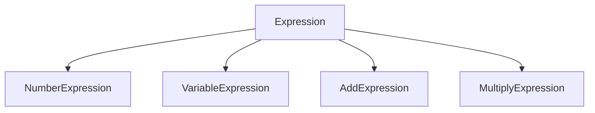
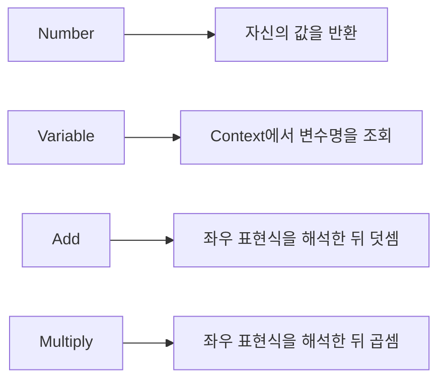
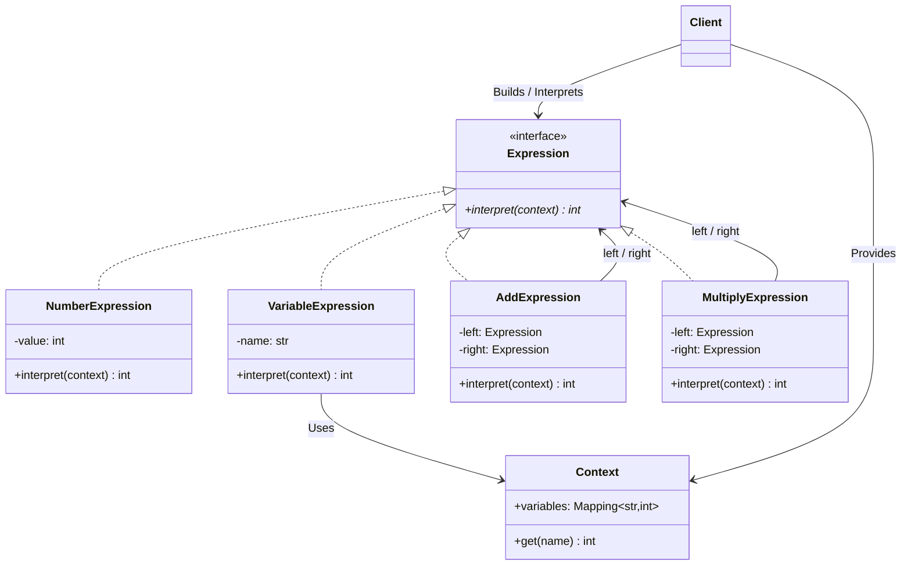

# 인터프리터 패턴 (Interpreter Pattern)


## 1. 패턴이 없을 때 발생하는 문제점 (The Problem)

작은 규칙 언어의 표현식을 문자열 태그와 튜플로 나타내고 하나의 함수에서 평가한다고 가정합니다. 연산이 늘어나면 위치 인덱스에 의존하는 데이터 구조와 타입별 분기가 함께 커질 수 있습니다. 인터프리터 패턴은 각 표현식의 구조와 평가 규칙을 클래스에 모으는 선택지입니다.

예를 들어 다음과 같은 간단한 산술 표현식을 처리해야 한다고 가정해 보겠습니다.

```text
10 + x * 2

```

지원하는 문법 요소는 다음과 같습니다.

```text
숫자
변수
덧셈
곱셈

```

이를 별도의 표현 구조 없이 처리하면 다음과 같은 코드가 작성됩니다.

### 패턴을 적용하지 않은 예시

```python
def evaluate(expression, context: dict[str, int]) -> int:
    kind = expression[0]

    if kind == "number":
        return expression[1]

    elif kind == "variable":
        name = expression[1]
        if name not in context:
            raise ValueError(f"정의되지 않은 변수입니다: {name}")
        return context[name]

    elif kind == "add":
        left = evaluate(expression[1], context)
        right = evaluate(expression[2], context)
        return left + right

    elif kind == "multiply":
        left = evaluate(expression[1], context)
        right = evaluate(expression[2], context)
        return left * right

    raise ValueError(f"알 수 없는 표현식입니다: {kind}")

```

표현식은 다음과 같이 튜플(Tuple) 구조로 작성합니다.

```python
expression = (
    "add",
    ("number", 10),
    (
        "multiply",
        ("variable", "x"),
        ("number", 2),
    ),
)

```

실행:

```python
result = evaluate(expression, {"x": 5})
print(result)
# 20

```

이 코드는 이미 튜플로 표현한 구문 트리를 평가하는 작은 인터프리터입니다. 문자열을 읽는 Parser는 포함하지 않습니다. 단일 평가 함수도 문법이 작고 고정되어 있다면 적절하며, 여기서는 이를 GoF의 클래스 기반 구조로 바꾸었을 때의 차이를 살펴봅니다.

현재는 문법이 단순하므로 큰 문제가 없어 보입니다.

하지만 여기에 다음과 같은 연산과 기능들이 추가된다고 가정해 보겠습니다.

```text
뺄셈
나눗셈
비교 연산
논리 연산
함수 호출
조건식
변수 할당

```

그러면 기존 함수에는 계속해서 새로운 분기문이 추가됩니다.

```python
if kind == "subtract":
    ...
elif kind == "divide":
    ...
elif kind == "greater_than":
    ...
elif kind == "and":
    ...
elif kind == "call":
    ...
elif kind == "if":
    ...

```

또한, 각 표현식이 어떤 데이터를 가져야 하는지도 튜플의 위치 인덱스에 암묵적으로 의존하게 됩니다.

```text
("number", value)
("variable", name)
("add", left, right)
("call", name, arguments)
("if", condition, then, else)

```

이로 인해 다음과 같이 구조적으로 잘못된 표현식도 쉽게 생성될 수 있습니다.

```python
bad_expression = (
    "add",
    "hello",
    123,
)

```

이러한 형태는 해석 함수가 실제로 실행되기 전까지 구조적 오류를 발견하기 어렵습니다.

### 이 방식이 가진 단점

* **거대한 조건문 비대화:** 새로운 문법 요소가 추가될 때마다 하나의 해석 함수가 끝없이 거대해집니다.
* **표현 구조의 불명확성:** 튜플이나 딕셔너리의 위치 및 문자열 값으로 문법을 암묵적으로 표현하면 구조적 실수를 유발하기 쉽습니다.
* **문법 규칙 간의 강한 결합:** 숫자, 변수, 덧셈, 곱셈 등 서로 다른 문법 규칙이 단일 함수 내에 뒤섞입니다.
* **재귀 구조의 가독성 저하:** 중첩된 표현식이 깊어질수록 각 노드의 의미와 흐름을 파악하기 힘들어집니다.
* **문법 확장 시 중앙 함수 수정:** 새 노드 종류를 추가할 때 평가 분기도 수정해야 합니다. 반대로 기존 노드에 대한 새로운 분석 함수를 추가하기는 쉬우므로, 무엇이 자주 확장되는지에 따라 장단점이 달라집니다.

---

## 2. 인터프리터 패턴으로 해결하기 (The Solution)

인터프리터 패턴은 "언어의 각 문법 규칙을 Expression 객체로 정의하고, 각 Expression이 자신의 의미를 `interpret()` 연산으로 직접 해석하도록 구성하는 방식"으로 이 문제를 해결합니다.

### 문법 구조와 실행 문맥의 역할

`10 + x * 2`에서 덧셈·곱셈의 관계는 식 자체에 속하고, `x`의 값은 실행 문맥에 속합니다. 둘을 나누면 같은 식을 여러 환경에서 재사용할 수 있습니다. 각 노드는 자신의 평가 규칙만 구현하고, 부모 노드는 자식이 숫자인지 복합식인지 구별하지 않고 평가 결과를 사용합니다.

| 역할 | 예제의 구성 요소 | 담당하는 책임 |
| --- | --- | --- |
| Abstract Expression | `Expression` | 평가 계약 정의 |
| Terminal Expression | Number·Variable | 숫자 반환 또는 변수 조회 |
| Nonterminal Expression | Add·Multiply | 자식 결과를 연산 규칙에 따라 결합 |
| Context | 변수 환경 | 식의 구조와 별개인 입력 값 제공 |
| Client | `build_expression()`과 실행 코드 | 트리 조립 및 최초 평가 요청 |

우선 대상 언어의 문법(Grammar)을 정의합니다.

```text
Expression ::= Term ("+" Term)*
Term       ::= Atom ("*" Atom)*
Atom       ::= Number | Variable | "(" Expression ")"

```

곱셈은 덧셈보다 먼저 묶고, 같은 연산은 왼쪽부터 묶는 문법입니다. 괄호는 묶이는 구조를 지정합니다. 아래 코드는 Parser 없이 구문 트리를 직접 만들므로, 실제 평가 순서는 문자열이 아니라 조립한 트리의 모양으로 결정됩니다.

이 문법을 클래스 계층 구조로 설계합니다.



모든 표현식은 동일한 인터페이스를 구현합니다.

```python
class Expression(ABC):

    @abstractmethod
    def interpret(self, context: dict[str, int]) -> int:
        pass

```

숫자는 더 이상 분해되지 않는 가장 단순한 단말 표현식(Terminal Expression)입니다.

```python
class NumberExpression(Expression):

    def __init__(self, value: int):
        self._value = value

    def interpret(self, context: dict[str, int]) -> int:
        return self._value

```

변수 역시 단말 표현식(Terminal Expression)입니다.

```python
class VariableExpression(Expression):

    def __init__(self, name: str):
        self._name = name

    def interpret(self, context: dict[str, int]) -> int:
        return context[self._name]

```

덧셈은 다른 Expression 두 개를 조합하는 비단말 표현식(Nonterminal Expression)입니다.

```python
class AddExpression(Expression):

    def __init__(self, left: Expression, right: Expression):
        self._left = left
        self._right = right

    def interpret(self, context: dict[str, int]) -> int:
        return self._left.interpret(context) + self._right.interpret(context)

```

곱셈 역시 다른 Expression들을 조합하는 비단말 표현식입니다.

```python
class MultiplyExpression(Expression):

    def __init__(self, left: Expression, right: Expression):
        self._left = left
        self._right = right

    def interpret(self, context: dict[str, int]) -> int:
        return self._left.interpret(context) * self._right.interpret(context)

```

이제 `10 + x * 2`라는 표현식을 객체 구조로 조립할 수 있습니다.

```python
expression = AddExpression(
    NumberExpression(10),
    MultiplyExpression(
        VariableExpression("x"),
        NumberExpression(2),
    ),
)

```

생성된 객체 트리의 구조는 다음과 같습니다.

```text
        Add
       /   \
     10   Multiply
           /    \
          x      2

```

해석할 때 Context(문맥 정보)를 함께 전달합니다.

```python
result = expression.interpret({"x": 5})

```

각 Expression은 자신의 역할에 맞는 해석 규칙만 수행합니다.



클라이언트가 전체 트리를 직접 순회하지 않아도 재귀적으로 해석이 진행됩니다.

```text
Add.interpret()
     │
     ├─ Number.interpret()
     │
     └─ Multiply.interpret()
             │
             ├─ Variable.interpret()
             └─ Number.interpret()

```

인터프리터 패턴의 핵심은 단순히 `if-elif` 문을 여러 클래스로 분산시키는 것에 그치지 않습니다.

**문법 자체를 객체 구조로 모델링하고, 각 문법 요소가 자신에 대응하는 해석 규칙을 직접 갖도록 하여 전체 문장의 의미를 재귀적인 객체 간 협력으로 계산해내는 것**이 본질입니다.

---

## 3. 장점, 단점 및 트레이드오프 (Trade-off)

### 장점 (Pros)

* **문법 규칙의 명시적 표현:** 각 Expression 클래스가 하나의 문법 규칙에 1:1로 대응하므로 코드 수준에서 언어의 구조를 직관적으로 파악할 수 있습니다.
* **재귀적 문법 구조 표현에 최적화:** Expression 내부에서 다른 Expression을 참조함으로써 복잡한 트리 형태의 문법을 자연스럽게 형성할 수 있습니다.
* **단일 책임 원칙(SRP) 준수:** 숫자, 변수, 덧셈, 곱셈 등 각 문법 규칙의 해석 로직이 전용 클래스로 명확히 분리됩니다.
* **평가 노드 확장의 용이성:** 기존 평가 클래스를 유지하면서 새 Expression을 추가할 수 있습니다. 문자열 입력도 지원한다면 Parser와 타입 검사 등 관련 단계는 함께 수정해야 합니다.
* **DSL 구현에 적합:** 규칙 엔진, 필터링 언어, 권한 검사식, 계산기 등 가볍고 제한된 도메인 언어를 구현할 때 매우 효과적입니다.

### 단점 (Cons)

* **클래스 개수의 폭발적 증가:** 문법 규칙마다 별도의 클래스가 필요하므로 문법이 복잡해질수록 관리해야 할 클래스의 수가 급격히 늘어납니다.
* **언어 전체를 구현하지는 않음:** 범용 언어에는 파싱, 이름 해석, 타입 규칙, 실행 환경 등의 추가 설계가 필요합니다. 최적화기나 VM은 요구사항에 따라 선택하며 모든 언어에 필수인 것은 아닙니다.
* **새로운 '연산' 추가의 어려움:** 모든 Expression에 `interpret()` 외에도 `pretty_print()`, `optimize()`, `type_check()` 등의 새로운 동작을 추가하려면 모든 Expression 클래스를 일일이 수정해야 합니다.
* **파싱(Parsing) 문제를 해결하지 않음:** 인터프리터 패턴은 이미 구축된 표현식 트리를 '해석'하는 역할에 집중합니다. `"10 + x * 2"`와 같은 문자열을 객체 트리로 바꾸는 로직(Parser)은 별도로 구현해야 합니다.
* **재귀적 해석 성능 비용:** 동일한 표현식을 반복 실행하는 경우, 매번 객체 트리를 재귀 순회하며 해석하면 실행 성능이 저하될 수 있습니다.

### 트레이드오프 (Trade-off)

* **작고 명확한 문법에 적합:** 규칙 수가 적고 고정된 DSL이나 설정 표현식 처리 시 뛰어난 가독성과 구조적 안정성을 제공합니다.
* **대체 구조의 선택 기준:** 문자열 문법 관리가 어렵다면 Parser Generator를, 노드에 대한 분석 연산이 많다면 AST + Visitor를 검토합니다. 바이트코드 VM은 실행 전략의 선택입니다. 이 도구들은 서로 다른 단계의 문제를 해결하므로 클래스 개수만으로 선택하지 않습니다.
* **문법 확장에는 유리, 연산 확장에는 불리:** 새로운 표현식 단위를 추가하기는 쉽지만, 기존 표현식들에 새로운 행위(기능)를 일괄 추가하는 작업은 까다롭습니다.
* **Parser와 Interpreter의 역할 분리:** Parser는 텍스트를 문법 구조(Tree)로 변환하고, Interpreter는 해당 구조에 의미를 부여하여 실행합니다.

```text
Source Text
    ↓
  Parser
    ↓
Expression Tree
    ↓
 Interpreter
    ↓
  Result

```

* **반복 실행 환경의 최적화:** 표현식 트리를 매번 해석하는 대신, 실행 성능이 중요한 경우 중간 표현식이나 바이트코드로 미리 컴파일하여 재사용하는 전략을 취할 수 있습니다.

---

### Terminal Expression과 Nonterminal Expression

고전 인터프리터 패턴에서는 문법 요소를 두 가지로 명확히 구분합니다.

#### Terminal Expression (단말 표현식)

이 패턴에서 Terminal Expression은 다른 Expression 자식을 가지지 않는 잎 노드입니다. 형식 문법의 터미널 토큰과 AST의 잎을 반드시 같은 단위로 취급하는 것은 아닙니다.

예시:

```text
10
x
true

```

코드 예시:

```text
NumberExpression
VariableExpression

```

#### Nonterminal Expression (비단말 표현식)

다른 Expression들을 하위 요소로 조합하여 더 큰 문법 구조를 형성합니다.

예시:

```text
x + 10
a * b
x + y * 2

```

코드 예시:

```text
AddExpression
MultiplyExpression

```

구조적인 측면에서 보면 컴포지트 패턴(Composite Pattern)과 유사합니다.

```text
Expression
   │
   ├─ Leaf-like Terminal
   │
   └─ Composite-like Nonterminal
            │
            └─ Expression*

```

차이점은 컴포지트 패턴이 **'부분과 전체의 관계를 동일시하는 구조'** 자체에 집중한다면, 인터프리터 패턴은 '각 노드가 갖는 문법적 의미의 해석(Behavior)'에 초점을 맞춘다는 점입니다.

---

### Interpreter와 Visitor의 차이

인터프리터 패턴에서는 비즈니스 연산이 각 Expression 클래스 내부(`interpret()`)에 분산되어 위치합니다.

```text
NumberExpression
    interpret()

AddExpression
    interpret()

MultiplyExpression
    interpret()

```

방문자 패턴(Visitor Pattern)은 연산을 별도 Visitor로 옮깁니다. 다만 Visitor는 지원하는 노드 종류와 필드를 알아야 하므로 두 구조의 의존성이 사라지는 것은 아닙니다.

```text
Expression Tree
    ↓
EvaluationVisitor
PrettyPrintVisitor
TypeCheckVisitor

```

따라서 다음과 같은 설계 선택의 기준이 적용됩니다.

```text
새로운 문법 요소(클래스)가 자주 추가되는 구조
    → 기존 평가 클래스를 유지하고 새 노드를 추가하기 쉬움

데이터 구조는 고정되어 있고, 새로운 연산(기능)이 자주 추가되는 구조
    → Visitor 패턴 유효

```

---

### Interpreter와 Strategy의 차이

전략 패턴(Strategy Pattern)은 **하나의 목적을 달성하기 위한 교체 가능한 알고리즘들**을 캡슐화합니다.

```text
CompressionStrategy
SortingStrategy

```

인터프리터 패턴은 **언어를 구성하는 여러 문법 규칙과 그 조합의 의미**를 표현합니다.

```text
Number
Variable
Add
Multiply

```

정리하자면 다음과 같이 구분할 수 있습니다.

```text
Strategy Pattern:
    단일 문제 해결을 위한 다수의 교체 가능한 알고리즘

Interpreter Pattern:
    하나의 언어를 구성하는 수많은 문법 규칙의 체계적인 결합

```

---

## 4. 파이썬 오픈소스에서 볼 수 있는 인터프리터와 유사한 설계

파이썬 표준 라이브러리와 주요 오픈소스 프로젝트에서도 **문법 구조를 객체화하고 특정 Context 환경에서 의미를 계산·실행하는 설계 패턴**을 흔히 찾아볼 수 있습니다.

다만 이 사례들이 GoF 클래스 구조를 100% 동일하게 구현했다기보다는, `문법 → 구조화된 표현식 → 해석/실행`이라는 인터프리터의 확장적 개념을 충실히 따르고 있는 예시로 보는 것이 적절합니다.

### Python `ast` 모듈

파이썬의 `ast` 모듈은 파이썬 소스 코드를 추상 구문 트리(AST, Abstract Syntax Tree) 객체로 다룹니다. `ast.parse()` 함수를 통해 파이썬 코드 문자열을 `ast.AST` 기반 노드 트리로 변환하며, 이 트리는 `compile()`을 거쳐 실행 가능한 코드 객체로 변환됩니다.

사용 예시:

```python
import ast

tree = ast.parse("10 + x * 2", mode="eval")
print(ast.dump(tree, indent=4))

```

개념적 구조:

```text
Expression
   ↓
BinOp(+)
   │
   ├─ Constant(10)
   │
   └─ BinOp(*)
         │
         ├─ Name(x)
         └─ Constant(2)

```

이는 우리가 앞서 구현한 구조와 매우 유사한 **재귀적 문법 트리 구조**입니다.

```text
AddExpression
    ├─ NumberExpression
    └─ MultiplyExpression

```

파이썬 내부 엔진은 단순 GoF `interpret()` 메서드 호출보다 훨씬 고도화된 컴파일러 및 가상 머신 구조를 이용하지만, 문법을 타입화된 객체 트리를 통해 다룬다는 점에서 인터프리터 개념을 가장 잘 보여주는 사례입니다.

---

### Python `re` 모듈 (정규 표현식)

정규 표현식 역시 텍스트 검색 및 매칭을 위한 독립적인 미니 도메인 언어입니다.

```python
r"[A-Za-z]+\d*"

```

여기에는 다음과 같은 문법 규칙들이 존재합니다.

```text
Character Class (문자 집합)
Concatenation (연결)
Quantifier +, * (수량자)
Alternation | (선택)
Grouping () (그룹화)

```

파이썬 `re.compile()`은 정규식 문자열을 파싱하여 내부 정규식 객체로 컴파일한 뒤, `match()`, `search()` 등의 실행 함수를 통해 입력 텍스트를 평가합니다.

```python
import re

pattern = re.compile(r"[A-Za-z]+\d*")
result = pattern.fullmatch("Player100")

```

개념적 평가 흐름:

```text
Regular Expression Source
        ↓
     compile
        ↓
Compiled Pattern Object
        ↓
      match
        ↓
     Result

```

실제 내부 구현은 성능에 최적화된 바이트코드 엔진으로 작동하지만, **특정 언어 규칙을 해석 가능한 객체 표현으로 변환한 후 입력 데이터에 대해 의미를 평가한다는 본질**은 구문과 실행을 분리한다는 점에서 인터프리터와 비교할 수 있습니다. 각 노드가 `interpret()`를 갖는 GoF 구현과 같은 구조는 아닙니다.

---

### Jinja 템플릿 엔진

Jinja는 HTML 및 텍스트 생성을 위해 사용하는 템플릿 DSL(Domain Specific Language)입니다.

템플릿 내부에는 변수 출력, `if` 조건문, `for` 반복문 등의 고유한 구문 요소가 포함되어 있으며, 함께 전달되는 Context(딕셔너리) 데이터를 바탕으로 결과 문자열을 렌더링합니다.

```text

    
        {{ user.name }}
    


```

구문 요소:

```text
If Statement
For Statement
Variable Expression
Attribute Access

```

Context 전달 및 평가:

```python
{"users": [...]}

```

개념적 프로세스:

```text
Template Source
      ↓
    Parse
      ↓
Template Representation (Tree)
      ↓
 Render(Context)
      ↓
 Output Text

```

Jinja는 실제 구문 해석 시 컴파일 단계를 거치는 고도화된 템플릿 엔진이지만, **도메인 전용 언어 구문과 실행 Context를 분리하여 평가한다**는 측면에서 구문과 실행 환경을 분리하는 유사 설계로 볼 수 있습니다.

---

## 5. 클래스 다이어그램



역할별 분류:

```text
Abstract Expression
    Expression

Terminal Expressions
    NumberExpression
    VariableExpression

Nonterminal Expressions
    AddExpression
    MultiplyExpression

Context
    변수 bindings 및 외부 실행 환경 데이터

Client
    Expression Tree를 조립하고 interpret()를 최초 호출하는 주체

```

핵심 재귀 구조:

```text
Expression
   │
   ├─ Terminal
   │
   └─ Nonterminal
          │
          ├─ Expression
          └─ Expression

```

---

## 6. 파이썬 예제 코드

다음 코드는 Python 3.10 이상에서 외부 패키지 없이 실행할 수 있습니다. 앞의 설명용 발췌 코드와 달리, 이 블록에는 실행에 필요한 정의가 모두 포함되어 있습니다.

```python
from abc import ABC, abstractmethod
from dataclasses import dataclass
from types import MappingProxyType
from typing import Mapping

# -------------------------------------------------------------------
# 1. Context (문맥 정보)
# -------------------------------------------------------------------

@dataclass(frozen=True)
class Context:
    variables: Mapping[str, int]

    def __post_init__(self) -> None:
        snapshot = dict(self.variables)
        if any(type(value) is not int for value in snapshot.values()):
            raise TypeError("변수 값은 정수여야 합니다.")
        object.__setattr__(self, "variables", MappingProxyType(snapshot))

    def get(self, name: str) -> int:
        if name not in self.variables:
            raise ValueError(f"정의되지 않은 변수입니다: {name}")
        return self.variables[name]

# -------------------------------------------------------------------
# 2. Abstract Expression (추상 표현식 인터페이스)
# -------------------------------------------------------------------

class Expression(ABC):
    @abstractmethod
    def interpret(self, context: Context) -> int:
        pass

# -------------------------------------------------------------------
# 3. Terminal Expression - Number (숫자)
# -------------------------------------------------------------------

@dataclass(frozen=True)
class NumberExpression(Expression):
    value: int

    def __post_init__(self) -> None:
        if type(self.value) is not int:
            raise TypeError("숫자 리터럴은 정수여야 합니다.")

    def interpret(self, context: Context) -> int:
        return self.value

# -------------------------------------------------------------------
# 4. Terminal Expression - Variable (변수)
# -------------------------------------------------------------------

@dataclass(frozen=True)
class VariableExpression(Expression):
    name: str

    def interpret(self, context: Context) -> int:
        return context.get(self.name)

# -------------------------------------------------------------------
# 5. Nonterminal Expression - Add (덧셈)
# -------------------------------------------------------------------

@dataclass(frozen=True)
class AddExpression(Expression):
    left: Expression
    right: Expression

    def interpret(self, context: Context) -> int:
        left_value = self.left.interpret(context)
        right_value = self.right.interpret(context)
        return left_value + right_value

# -------------------------------------------------------------------
# 6. Nonterminal Expression - Multiply (곱셈)
# -------------------------------------------------------------------

@dataclass(frozen=True)
class MultiplyExpression(Expression):
    left: Expression
    right: Expression

    def interpret(self, context: Context) -> int:
        left_value = self.left.interpret(context)
        right_value = self.right.interpret(context)
        return left_value * right_value

# -------------------------------------------------------------------
# 7. Client (클라이언트 및 트리를 빌드하는 함수)
# -------------------------------------------------------------------

def build_expression() -> Expression:
    # 10 + x * 2 표현식 생성
    return AddExpression(
        NumberExpression(10),
        MultiplyExpression(VariableExpression("x"), NumberExpression(2)),
    )

# -------------------------------------------------------------------
# 8. 실행 예시
# -------------------------------------------------------------------

if __name__ == "__main__":
    expression = build_expression()
    context = Context(variables={"x": 5})
    result = expression.interpret(context)
    print(result)
    print(expression.interpret(Context(variables={"x": 8})))
    try:
        expression.interpret(Context(variables={}))
    except ValueError as error:
        print(error)
```

**실행 결과:**

```text
20
26
정의되지 않은 변수입니다: x
```

### 실행 흐름 살펴보기

첫 실행은 `x = 5`를 전달하므로 곱셈 노드가 10을 만들고, 덧셈 노드가 여기에 10을 더해 20을 반환합니다. 두 번째 실행은 같은 트리에 `x = 8`을 전달하여 26을 얻습니다. 변수가 없는 환경에서는 Variable 노드의 조회가 실패하고, 호출자가 그 오류를 처리합니다.

`Context`는 입력 매핑을 복사하여 평가에 사용할 스냅샷을 만듭니다. 따라서 호출자가 원본 딕셔너리를 바꾸어도 이미 만든 Context의 값은 유지됩니다. `frozen=True`는 필드 재할당만 제한하므로, 내부 매핑은 읽기 전용으로 노출합니다. 이 방식에는 변수 수에 비례하는 복사 비용이 있습니다.

이 예제의 값은 정수로 한정하며 Python에서 `bool`이 `int`의 하위 타입인 점을 고려해 정확한 타입을 검사합니다. 외부 문자열의 파싱이나 임의로 조립한 잘못된 트리, 매우 깊은 트리에 대한 검증은 별도의 입력 경계에서 다룹니다.

생성된 객체 트리 구조:

```text
AddExpression
    │
    ├─ NumberExpression(10)
    │
    └─ MultiplyExpression
            │
            ├─ VariableExpression("x")
            │
            └─ NumberExpression(2)

```

해석 진행 단계(재귀 평가 과정):

```text
Add
 │
 ├─ Number(10)
 │      ↓
 │      10
 │
 └─ Multiply
        │
        ├─ Variable("x")
        │      ↓ (Context 조회)
        │      5
        │
        └─ Number(2)
               ↓
               2

Multiply 연산:
    5 × 2 = 10

Add 연산:
    10 + 10 = 20

```

만약 새로운 **뺄셈(Subtract)** 문법을 추가하려면 기존 클래스를 수정할 필요 없이 새 클래스를 정의하면 됩니다.

```python
@dataclass(frozen=True)
class SubtractExpression(Expression):
    left: Expression
    right: Expression

    def interpret(self, context: Context) -> int:
        return self.left.interpret(context) - self.right.interpret(context)

```

사용 예시:

```python
expression = SubtractExpression(
    NumberExpression(100),
    VariableExpression("x"),
)
print(expression.interpret(Context(variables={"x": 5})))

```

**실행 결과:**

```text
95
```

기존 Add·Multiply 노드와 Context를 수정하지 않고 뺄셈의 평가 규칙을 추가했습니다. 문자열의 `-` 기호도 지원하려면 Parser가 이 노드를 만들도록 확장해야 합니다. 평가 클래스를 추가하는 일과 입력 문법을 확장하는 일은 별도의 변경입니다.

언어가 지원하는 노드 종류가 늘어나면 관리할 클래스도 늘어납니다.

```text
AddExpression
SubtractExpression
MultiplyExpression
DivideExpression
AndExpression
OrExpression
NotExpression
IfExpression
CallExpression
...

```

문법 노드 종류에 따라 클래스가 늘어나는 것이 이 표현 방식의 비용입니다. 각 규칙에 클래스 하나를 두는 경우 증가량은 대체로 규칙 수에 비례하며, 표현식을 조합할 때마다 새 클래스가 필요한 것은 아닙니다.

---

## 부록 (Appendix): 현대적 타입 시스템과 함수형 관점의 재해석

본문의 산술식 `10 + x * 2`는 Expression 객체들의 트리로 표현됩니다. 각 노드가 `interpret(context)`를 제공하므로 트리를 따라 값을 계산할 수 있습니다.

이제 같은 식을 화면에 표시하거나, 변수 이름을 수집하거나, 반복 실행에 적합한 형태로 바꾸어야 한다고 가정합니다. 이때 핵심 질문은 **문법의 구조를 유지하면서 여러 해석을 어떻게 추가할 것인가**입니다.

```text
같은 산술식
    ├─ 변수 환경을 받아 값 계산
    ├─ 괄호를 포함한 문자열 생성
    └─ 다른 실행 표현으로 변환
```

이 부록에서는 재귀적 ADT, GADT, 고차 함수, 타입클래스와 효과 처리를 지원하는 **가상의 Python 스타일 문법**을 사용합니다. `eval_expr`는 설명용 평가 함수이며 Python 내장 `eval()`과는 관계없습니다.

### 부록을 읽는 순서와 전제

1~3절은 본문과 같은 정수 산술식을 데이터와 함수로 표현합니다. 4~6절은 재귀 순회를 공통화하고 정수·불리언 혼용을 검사합니다. 이후 Parser, Tagless Final, 효과 처리, 컴파일은 각각 별도의 확장 요구가 생겼을 때 검토할 수 있습니다.

---

### 1. 문법 구조를 재귀적 ADT로 표현하기

객체지향의 클래스 계층을 가능한 노드 종류를 나열한 합 타입으로 바꾸어 봅니다.

```text
data Expr =
    Number(value: Int)
  | Variable(name: String)
  | Add(left: Expr, right: Expr)
  | Multiply(left: Expr, right: Expr)


expression = Add(
    Number(10),
    Multiply(Variable("x"), Number(2)),
)
```

`Add`와 `Multiply`가 다시 `Expr`을 포함하므로 중첩된 문장을 표현할 수 있습니다. 본문의 객체 트리와 같은 구조이며, 이제 각 노드는 평가 메서드 없이 데이터만 보관합니다.

```text
NumberExpression(10)         ↔ Number(10)
VariableExpression("x")      ↔ Variable("x")
AddExpression(left, right)   ↔ Add(left, right)
```

이 표현은 노드 종류가 닫힌 집합일 때 읽기 쉽습니다. 새 종류를 추가하려면 타입 정의와 이를 해석하는 함수들을 함께 점검해야 합니다.

---

### 2. 의미를 외부 평가 함수에 정의하기

문법 데이터를 받아 계산하는 함수를 별도로 정의합니다.

```python
type Environment = ImmutableMap[String, Int]


def eval_expr(expr: Expr, env: Environment) -> Int:
    match expr:
        case Number(value):
            return value
        case Variable(name):
            return env[name]
        case Add(left, right):
            return eval_expr(left, env) + eval_expr(right, env)
        case Multiply(left, right):
            return eval_expr(left, env) * eval_expr(right, env)
```

`x`가 5인 환경에서 결과는 20이고, 8인 환경에서는 26입니다. 식의 구조를 바꾸지 않고 변수 환경만 교체할 수 있다는 점은 본문과 같습니다.

메서드를 함수로 옮기면 노드별 규칙을 한곳에서 읽을 수 있습니다. 이 함수는 식과 환경을 변경하지 않고 외부 효과도 발생시키지 않는다고 가정합니다. 이 단계에서는 모든 변수가 존재한다고 가정하며, 조회 실패는 다음 절에서 명시합니다.

불변 환경을 사용하면 평가 도중 바인딩이 달라지는 문제를 줄일 수 있습니다. 환경 갱신 시 기존 노드를 공유하려면 영속 자료구조가 필요합니다. 본문의 딕셔너리 복사는 독립된 스냅샷을 만드는 방법이며, 구조적 공유와는 비용이 다릅니다. 중첩 스코프를 추가한다면 이름 탐색과 캡처 규칙도 따로 정해야 합니다.

---

### 3. 변수 조회 실패를 평가 결과에 포함하기

환경에 `x`가 없다면 식을 정상적으로 계산할 수 없습니다. 실패를 값으로 표현하면 각 노드가 성공과 실패를 어떻게 조합하는지 드러납니다.

```text
data EvalError = UndefinedVariable(name: String)


def eval_expr(expr: Expr, env: Environment) -> Result[Int, EvalError]:
    match expr:
        case Number(value):
            return Ok(value)
        case Variable(name):
            match env.get(name):
                case Some(value):
                    return Ok(value)
                case None:
                    return Err(UndefinedVariable(name))
        case Add(left, right):
            left_value = eval_expr(left, env)?
            right_value = eval_expr(right, env)?
            return Ok(left_value + right_value)
        case Multiply(left, right):
            left_value = eval_expr(left, env)?
            right_value = eval_expr(right, env)?
            return Ok(left_value * right_value)
```

가상 연산자 `?`는 `Ok`에서 값을 꺼내고 `Err`이면 현재 함수에서 즉시 그 오류를 반환합니다. 위 코드는 왼쪽을 먼저 평가하므로 왼쪽에서 실패하면 오른쪽은 실행하지 않습니다.

```text
Add(Number(10), Variable("x")) + 빈 환경
                     ↓
          Err(UndefinedVariable("x"))
```

나눗셈을 추가한다면 `DivisionByZero` 같은 오류 대안을 함께 정의할 수 있습니다. 결과형은 예상한 실패를 표현하는 계약이며, 계산의 종료나 메모리 사용량까지 보장하지는 않습니다.

---

### 4. Fold로 평가와 문자열 출력의 순회를 공유하기

값을 계산하는 함수와 문자열을 출력하는 함수는 둘 다 자식을 방문하고 결과를 결합합니다. 이 반복을 `fold_expr`로 분리할 수 있습니다.

```python
def fold_expr[R](expr: Expr, number, variable, add, multiply) -> R:
    match expr:
        case Number(value):
            return number(value)
        case Variable(name):
            return variable(name)
        case Add(left, right):
            return add(
                fold_expr(left, number, variable, add, multiply),
                fold_expr(right, number, variable, add, multiply),
            )
        case Multiply(left, right):
            return multiply(
                fold_expr(left, number, variable, add, multiply),
                fold_expr(right, number, variable, add, multiply),
            )
```

각 인자의 타입은 `number: Int -> R`, `variable: String -> R`, `add: (R, R) -> R`, `multiply: (R, R) -> R`입니다. 재귀 순회는 고정하고 결과를 만드는 규칙만 교체합니다.

```python
# 모든 변수가 존재하는 환경에서 값 계산
value = fold_expr(
    expression,
    number=lambda n: n,
    variable=lambda name: env[name],
    add=lambda a, b: a + b,
    multiply=lambda a, b: a * b,
)

# 같은 구조를 문자열로 표현
text = fold_expr(
    expression,
    number=str,
    variable=lambda name: name,
    add=lambda a, b: f"({a} + {b})",
    multiply=lambda a, b: f"({a} * {b})",
)
```

`x = 5`일 때 `value`는 20, `text`는 `(10 + (x * 2))`입니다. 노드 수를 세려면 잎에서 1을 반환하고 가지에서 `1 + left + right`를 계산하면 됩니다.

이처럼 하위 구조의 결과를 현재 노드의 규칙으로 결합하는 구조적 Fold를 **Catamorphism**이라고 부릅니다. [컴포지트 패턴](../structural/composite.md)의 트리 집계와 같은 재귀 구조를 활용합니다.

다만 이 Fold는 양쪽 자식을 먼저 계산합니다. 실패 시 오른쪽을 생략하는 앞 절의 평가기나 `And`, 조건식의 단락 평가를 그대로 대체하지는 못합니다. 그런 경우 결과 `R`을 `Environment -> Result[Value, Error]` 같은 계산 함수로 만들어 실행을 지연하거나 전용 평가 규칙을 둡니다. 재귀 구조를 재사용할 때도 평가 순서의 의미를 보존해야 합니다.

---

### 5. 정수와 불리언이 섞이면 결과 타입을 문법에 기록하기

이제 언어에 논리식을 추가한다고 가정합니다. 단순한 `Expr`만 사용하면 다음 조합도 데이터로 만들 수 있습니다.

```python
Add(BoolLiteral(True), IntLiteral(10))
```

이 DSL에서는 정수와 불리언을 별도 타입으로 정의하므로 위 조합은 오류입니다. Python의 `True + 10`이 허용되는 것과는 다른 언어 규칙입니다.

결과 타입을 노드의 타입 매개변수에 포함하면 허용되는 조합을 더 구체적으로 표현할 수 있습니다.

```text
data TypedExpr[T] =
    IntLiteral(value: Int) -> TypedExpr[Int]
  | BoolLiteral(value: Bool) -> TypedExpr[Bool]
  | Add(left: TypedExpr[Int], right: TypedExpr[Int]) -> TypedExpr[Int]
  | Multiply(left: TypedExpr[Int], right: TypedExpr[Int]) -> TypedExpr[Int]
  | And(left: TypedExpr[Bool], right: TypedExpr[Bool]) -> TypedExpr[Bool]
```

GADT를 지원하는 언어에서는 `Add`에 불리언 노드를 전달하는 호출을 생성자의 타입 계약에 따라 거부합니다. 반면 정상적인 `Add(IntLiteral(10), IntLiteral(20))`은 `TypedExpr[Int]`입니다.

이 절은 변수 없는 식으로 타입 관계를 보여줍니다. 변수를 추가하려면 변수 이름과 환경의 값 타입도 연결해야 하며, 문자열에서 들어오는 식은 런타임 타입 검사 과정을 거쳐야 합니다.

---

### 6. 타입이 지정된 평가기의 결과와 실행 순서

GADT 패턴 매칭이 결과 타입을 구체화하는 언어에서는 다음과 같이 평가 함수를 작성할 수 있습니다.

```python
def eval_typed[T](expr: TypedExpr[T]) -> T:
    match expr:
        case IntLiteral(value):
            return value
        case BoolLiteral(value):
            return value
        case Add(left, right):
            return eval_typed(left) + eval_typed(right)
        case Multiply(left, right):
            return eval_typed(left) * eval_typed(right)
        case And(left, right):
            if not eval_typed(left):
                return False
            return eval_typed(right)
```

`TypedExpr[Int]`를 평가하면 `Int`, `TypedExpr[Bool]`을 평가하면 `Bool`을 반환하도록 검사됩니다. `And`의 오른쪽을 실행할지는 평가기의 코드가 정합니다. 타입 정보와 실행 순서가 각각 다른 책임이라는 점을 보여줍니다.

여기에 나눗셈이나 외부 조회를 넣으면 정상 결과 타입이 맞더라도 실행 중 실패할 수 있습니다. 그때는 `Result[T, EvalError]`처럼 실패 계약도 확장합니다. Python의 일반적인 타입 힌트만으로 이 가상 GADT 평가기의 검사를 그대로 제공하는 것은 아닙니다.

---

### 7. Parser와 타입 검사기는 평가 전에 다른 문제를 해결한다

본문은 트리를 직접 조립했습니다. 문자열 입력을 지원하려면 다음 단계를 추가합니다.

```text
문자열 → 토큰 → RawExpr → 타입 검사 → TypedExpr[T] → 평가 결과
```

Parser는 괄호와 연산자 우선순위에 따라 트리를 만듭니다. 타입 검사기는 그 트리의 피연산자 조합이 언어 규칙에 맞는지 확인합니다.

```text
def parse(source: String) -> Result[RawExpr, ParseError]:
    ...


def type_check(expr: RawExpr) -> Result[exists T. TypedExpr[T], TypeError]:
    ...
```

`exists T`는 입력을 검사한 뒤 결과 타입이 정해진다는 뜻입니다. 호출자가 반드시 정수 결과를 필요로 한다면, 검사된 타입이 `Int`인지 확인하는 단계도 있어야 합니다.

Parser Combinator는 작은 파서 함수를 결합하는 방식으로 이 파싱 단계를 구현합니다.

```text
type Parser[A] = TokenStream -> Result[(A, TokenStream), ParseError]

# 덧셈 항들을 읽는 골격
addition = term.then(many(plus.then(term)))
```

이 조합의 결과를 왼쪽 결합의 Add 트리로 바꾸는 규칙도 필요합니다. Parser Combinator는 평가기를 대체하지 않으며, 생성된 트리는 본문의 객체 기반 인터프리터나 ADT 평가기로 처리할 수 있습니다.

---

### 8. Tagless Final로 해석 방법을 매개변수화하기

프로그램을 직접 작성하고, 값 계산과 문자열 출력을 바꾸어 사용하려면 구체 노드 대신 추상 연산을 호출하는 방법도 있습니다.

```text
trait Arithmetic[R]:
    def number(value: Int) -> R
    def variable(name: String) -> R
    def add(left: R, right: R) -> R
    def multiply(left: R, right: R) -> R


def program[R](algebra: Arithmetic[R]) -> R:
    return algebra.add(
        algebra.number(10),
        algebra.multiply(algebra.variable("x"), algebra.number(2)),
    )
```

평가 구현은 환경을 보관하고 변수 이름을 조회합니다. 출력 구현은 변수 이름을 그대로 문자열에 넣습니다.

```text
class Evaluate implements Arithmetic[Int]:
    env: Environment

    def number(value): return value
    def variable(name): return env[name]
    def add(left, right): return left + right
    def multiply(left, right): return left * right


class Pretty implements Arithmetic[String]:
    def number(value): return str(value)
    def variable(name): return name
    def add(left, right): return f"({left} + {right})"
    def multiply(left, right): return f"({left} * {right})"
```

```text
program(Evaluate(env={"x": 5})) → 20
program(Pretty())               → "(10 + (x * 2))"
```

위 평가 구현은 변수가 존재하는 환경을 가정한 단순화입니다. 실패를 값으로 반환하려면 계산 함수나 `Result`를 해석의 결과 타입으로 사용하고 결합 규칙도 맞추어야 합니다.

구체 AST를 만드는 **Initial Encoding**과 달리, 이 **Final Encoding**은 프로그램을 연산 인터페이스로 표현합니다. 값 계산 구현은 중간 AST를 생략할 수 있고, 다른 구현은 AST 자체를 결과로 만들 수도 있습니다. 따라서 AST 생성 여부는 해석기에 달려 있습니다.

트리를 저장하거나 노드별 변환을 자주 수행한다면 명시적인 AST가 편리합니다. 같은 연산 계약을 여러 방식으로 실행하는 것이 중심이라면 Final Encoding을 검토할 수 있습니다. 구현할 해석기를 추가하기 쉬운 대신, 프로그램 구조를 검사하려면 AST로 다시 표현하는 등의 설계가 필요할 수 있습니다.

---

### 9. 외부 효과가 포함되면 연산과 실행 환경을 분리하기

변수 값을 메모리에서 읽는 대신 외부 서비스에서 가져오고 결과를 기록해야 한다면, 문법의 의미에 외부 효과가 포함됩니다.

```text
effect EnvironmentRead:
    def lookup(name: String) -> Result[Int, LookupError]


effect Output:
    def write(message: String) -> Unit
```

Effect Handler는 조회와 출력을 실제 서비스 또는 테스트 구현으로 해석합니다. 함수의 의존성을 효과 선언으로 드러내는 방법이며, 본문의 Context 주입과 목적이 연결됩니다. 외부 상태가 달라지면 같은 식의 결과도 달라질 수 있으므로, 환경과 오류의 계약을 함께 다룹니다.

연산 자체를 기록할 필요가 있다면 다음처럼 데이터로 표현할 수도 있습니다.

```text
data ScriptOp[Next] =
    ReadVariable(name: String, continuation: Int -> Next)
  | Print(message: String, next: Next)
```

이것은 한 단계의 연산 구조입니다. 전체 프로그램에는 종료 값을 나타내는 경우와 다음 단계로 이어지는 재귀 구조가 추가로 필요합니다. Free 계열 표현은 이런 연산과 후속 계산을 연결하는 방법입니다.

`continuation`은 읽은 값에 따라 다음 계산을 만드는 함수이므로, 실행 전에 이후 경로를 모두 열거하거나 JSON으로 저장할 수 있다고 보아서는 안 됩니다. **연산을 표현하는 것, 실행을 바꾸는 것, 프로그램을 직렬화하는 것은 각각 다른 요구사항**입니다. 요청을 데이터로 만드는 관점은 [커맨드 패턴](command.md)과 연결됩니다.

---

### 10. 반복 실행에는 컴파일과 부분 평가를 검토하기

같은 식을 여러 환경에서 평가할 때 노드 순회가 측정된 병목이라면, 식을 다른 실행 표현으로 바꾸어 재사용할 수 있습니다.

```text
10 + x * 2
    ↓ 컴파일
PUSH 10
LOAD x
PUSH 2
MUL
ADD
```

인터프리터가 주어진 환경에서 값을 계산한다면 컴파일러는 이후 실행할 코드를 만듭니다.

```python
executable = compile_expr(expression)

for env in environments:
    result = executable.run(env)
```

새 실행기는 변수 조회 실패와 연산 순서도 원래 평가기와 일치해야 합니다. 변환 비용, 코드 보관 공간, 실행 횟수를 함께 확인해야 하며 컴파일이 항상 더 빠른 것은 아닙니다.

환경과 무관한 부분은 먼저 계산할 수도 있습니다.

```text
(10 + 20) * x → 30 * x
```

이는 상수 접기(Constant Folding)의 예입니다. 부분 평가(Partial Evaluation)는 더 일반적으로 미리 알려진 입력에 대해 프로그램을 특수화합니다. 미리 계산할 부분이 순수해야 하고, 오류 발생 시점이나 단락 평가를 바꾸지 않도록 해야 합니다. 최적화는 새로운 의미를 만드는 작업이 아니라 기존 의미를 보존하는 변환입니다.

---

### 11. 문법 확장과 해석 확장의 비용 비교하기

클래스 기반 인터프리터에서는 `SubtractExpression`을 추가하여 기존 평가 클래스를 유지할 수 있습니다. 반대로 모든 노드에 새로운 `pretty_print()` 메서드를 요구하면 기존 클래스도 수정해야 합니다.

ADT 기반에서는 `pretty_expr()` 같은 함수를 외부에 추가하기 쉽지만, 새 노드가 생기면 이를 다루는 함수들을 점검해야 합니다. 기본 분기가 있어 실행은 계속되더라도 그 결과가 새 노드의 의미에 맞는지 확인해야 합니다.

| 자주 바뀌는 부분 | 먼저 검토할 표현 | 남는 비용 |
| --- | --- | --- |
| 새로운 문법 노드 | 클래스 기반 Expression | Parser·관련 분석 단계도 확장 |
| 고정된 문법의 새 연산 | ADT + 함수 또는 AST + Visitor | 노드 구조에 대한 의존성 |
| 같은 프로그램의 실행 방식 | 연산 인터페이스 / Tagless Final | 각 해석기의 계약 구현 |
| 반복 평가 성능 | 컴파일·부분 평가 | 변환 비용과 의미 보존 검증 |

이 확장 방향의 차이는 Expression Problem과 연결됩니다. Tagless Final이나 확장 가능한 타입 표현은 일부 비용을 완화할 수 있지만, 어떤 변경이 기존 구현에 영향을 주는지까지 없애지는 않습니다. 문법과 해석 중 실제로 자주 변하는 쪽을 기준으로 선택하는 것이 중요합니다.

---

### 요약 및 비교

| 관점 | 인터프리터 패턴 (OOP) | 현대 타입 시스템과 함수형 관점 |
| --- | --- | --- |
| 문법 표현 | Expression 클래스 계층 | 재귀적 ADT / 연산 인터페이스 |
| 해석 규칙 | 노드의 `interpret()` | 외부 평가 함수 / Algebra |
| 변수 문맥 | Context 객체 | 불변 환경 / 효과 의존성 |
| 평가 실패 | 예외 계약 | `Result[Value, EvalError]` |
| 재귀 재사용 | 노드별 메서드 호출 | Fold / Catamorphism |
| 피연산자 타입 | 정적·런타임 검사 | GADT에 선언된 타입 관계 검사 |
| 문자열 입력 | 별도 Parser | 별도 Parser와 타입 검사 단계 |
| 여러 실행 방식 | Visitor·다른 구현과 조합 | 여러 해석기 / Tagless Final |
| 외부 연산 | Context·서비스 호출 | Effect Handler / 연산 데이터 |
| 반복 실행 | 별도 실행 전략 | 컴파일 / 부분 평가 |
| 주요 비용 | 클래스 수와 연산 추가 범위 | 해석 함수·타입 표현·평가 순서 관리 |

### 결론

인터프리터는 문법 구조와 해석 규칙을 연결합니다. 본문의 산술식처럼 작은 언어에서는 객체의 재귀 호출만으로도 구조가 잘 드러납니다. 같은 문법에 여러 해석을 추가하거나 더 강한 타입 관계를 표현해야 할 때 ADT, Fold, Typed AST로 확장하고, 각 단계에서 기존 식의 의미와 오류 규칙을 유지하는 것이 핵심입니다.
