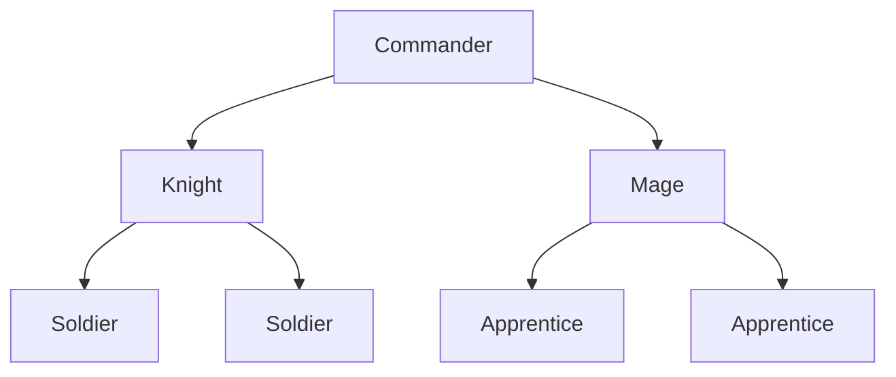
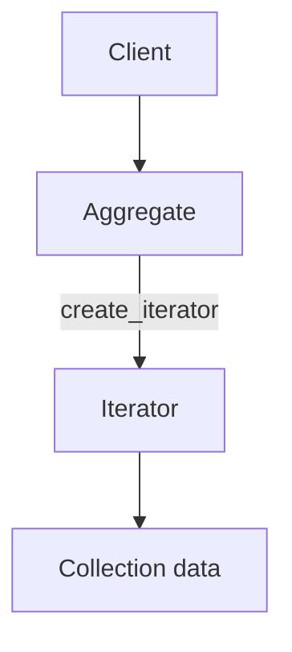
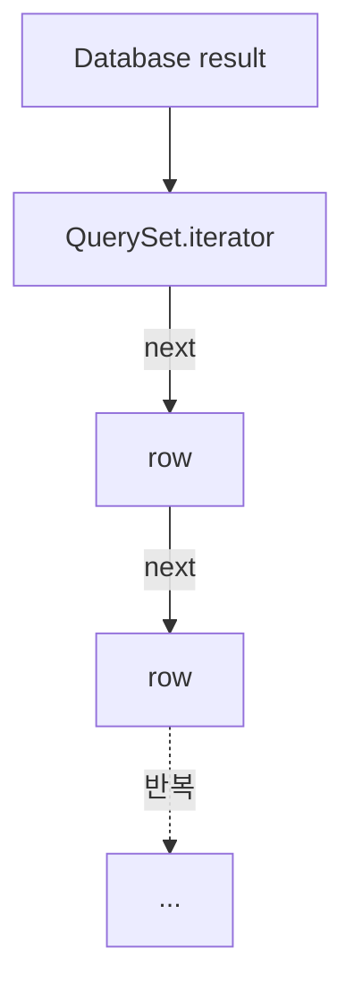
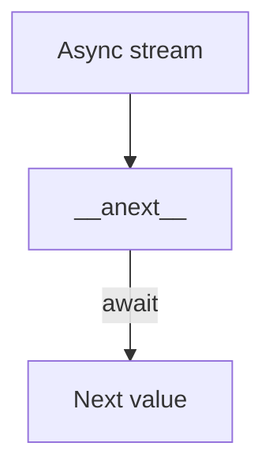
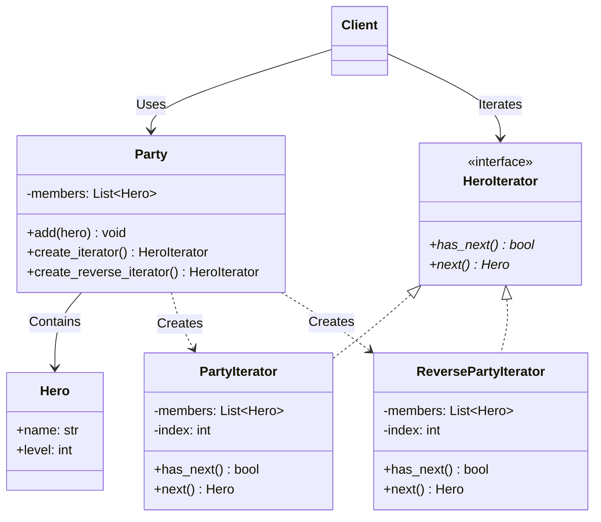
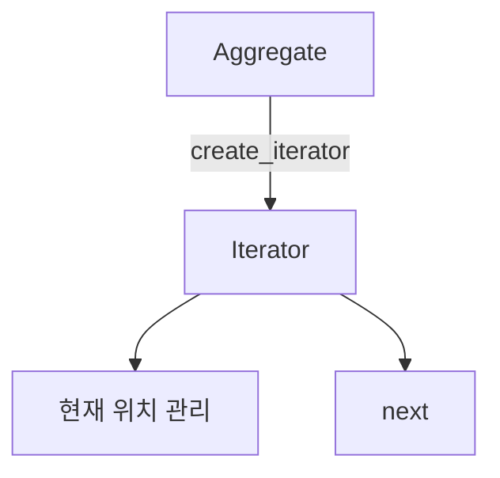
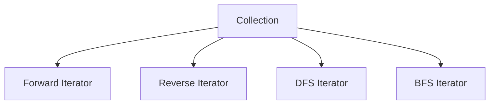

# 이터레이터 패턴 (Iterator Pattern)


## 1. 패턴이 없을 때 발생하는 문제점 (The Problem)

이터레이터 패턴을 사용하지 않고 클라이언트가 컬렉션의 요소를 직접 탐색하면, 컬렉션 내부의 자료구조와 탐색 방식을 클라이언트가 모두 알아야 하는 문제가 발생합니다.
예를 들어 게임에서 여러 캐릭터를 관리하는 파티 시스템이 있다고 가정해 봅니다.
처음에는 다음과 같이 단순한 list 형태로 구현할 수 있습니다.

### 패턴을 적용하지 않은 예시

```python
from dataclasses import dataclass


@dataclass(frozen=True)
class Hero:
    name: str
    level: int


class Party:

    def __init__(self):
        self.members: list[Hero] = []

    def add(
        self,
        hero: Hero,
    ) -> None:

        self.members.append(
            hero
        )

```

클라이언트는 다음과 같이 내부 리스트에 직접 접근하여 탐색합니다.

```python
party = Party()

party.add(
    Hero(
        name="아라곤",
        level=20,
    )
)

party.add(
    Hero(
        name="레골라스",
        level=18,
    )
)

party.add(
    Hero(
        name="김리",
        level=19,
    )
)


for hero in party.members:
    print(
        hero.name
    )

```

지금은 별문제가 없어 보이지만, Party의 내부 자료구조를 변경해야 하는 상황을 가정해 봅니다.
예를 들어 캐릭터를 이름으로 빠르게 검색하기 위해 내부 구조를 dict로 변경합니다.

```python
class Party:

    def __init__(self):

        self.members: dict[
            str,
            Hero,
        ] = {}

```

기존 클라이언트는 리스트라는 내부 구조에 직접 의존하고 있었으므로, 아래와 같이 코드를 수정해야 합니다.

```python
for hero in party.members.values():
    print(
        hero.name
    )

```

만약 파티를 트리 구조로 관리하게 된다면 문제는 더 커집니다.
조직 구조가 다음과 같이 구성되어 있다고 가정해 봅니다.



클라이언트가 모든 구성원을 탐색하려면 트리 탐색 알고리즘을 직접 작성해야 합니다.

```python
def traverse(
    node,
) -> None:

    print(
        node.value
    )

    for child in node.children:
        traverse(
            child
        )

```

또한 탐색 순서를 바꾸고 싶다면 그에 맞는 알고리즘을 매번 새로 구현해야 합니다.

* Depth First Search (깊이 우선 탐색)
* Breadth First Search (너비 우선 탐색)
* Pre-order (전위 순회)
* Post-order (후위 순회)
* Level-order (레벨 순회)
* 역순 탐색

이처럼 클라이언트가 직접 탐색 알고리즘을 관리하면 컬렉션의 내부 구조 및 탐색 정책과 강하게 결합됩니다.

### 이 방식이 가진 단점

* **컬렉션 내부 구조 노출:** 클라이언트가 list, dict, tree 등 실제 데이터 저장 방식을 알아야 합니다.
* **탐색 책임의 분산:** 요소를 보관하는 책임과 탐색하는 책임이 여러 클라이언트 코드에 흩어지게 됩니다.
* **자료구조 변경 영향 증가:** 컬렉션 내부 구현이 변경되면 이를 탐색하는 클라이언트 코드도 함께 수정해야 합니다.
* **다양한 탐색 방식 지원의 어려움:** 동일한 컬렉션에 DFS, BFS, 역순 탐색 등을 적용하려면 클라이언트가 각 알고리즘을 직접 구현해야 합니다.
* **탐색 상태 관리의 복잡성:** 현재 위치, 방문 노드, Queue나 Stack 같은 탐색 상태를 클라이언트가 직접 관리해야 하는 부담이 생깁니다.

---

## 2. 이터레이터 패턴으로 해결하기 (The Solution)

이터레이터 패턴은 "컬렉션의 내부 표현을 노출하지 않고 요소에 순차적으로 접근할 수 있는 별도의 Iterator 객체를 제공하는 방식"으로 이 문제를 해결합니다.
일반적인 구조는 다음과 같습니다.



이를 통해 컬렉션과 Iterator의 역할을 명확히 분리합니다.

* **Aggregate**
* 요소 보관
* Iterator 생성


* **Iterator**
* 현재 탐색 위치 관리
* 다음 요소 반환
* 순회 종료 여부 판단


예를 들어 다음과 같은 인터페이스를 정의할 수 있습니다.

```python
from abc import ABC, abstractmethod
from typing import Generic, TypeVar


T = TypeVar("T")


class Iterator(ABC, Generic[T]):

    @abstractmethod
    def has_next(
        self,
    ) -> bool:
        pass

    @abstractmethod
    def next(
        self,
    ) -> T:
        pass

```

Party 클래스는 내부 자료구조를 외부에 직접 공개하지 않는 대신 Iterator를 생성하여 제공합니다.

```python
class Party:

    def __init__(
        self,
    ):
        self._members: list[
            Hero
        ] = []

    def add(
        self,
        hero: Hero,
    ) -> None:

        self._members.append(
            hero
        )

    def create_iterator(
        self,
    ) -> "PartyIterator":

        return PartyIterator(
            self._members
        )

```

Iterator 객체는 현재 탐색 위치를 독립적으로 관리합니다.

```python
class PartyIterator(
    Iterator[Hero]
):

    def __init__(
        self,
        members: list[Hero],
    ):
        self._members = members
        self._index = 0

    def has_next(
        self,
    ) -> bool:

        return (
            self._index
            < len(self._members)
        )

    def next(
        self,
    ) -> Hero:

        if not self.has_next():
            raise StopIteration

        hero = self._members[
            self._index
        ]

        self._index += 1

        return hero

```

이제 클라이언트는 컬렉션의 내부 구조를 몰라도 요소를 순회할 수 있습니다.

```python
iterator = (
    party.create_iterator()
)

while iterator.has_next():

    hero = iterator.next()

    print(
        hero.name
    )

```

클라이언트가 의존하는 요소는 오직 다음 메서드뿐입니다.

* `has_next()`
* `next()`

따라서 Party가 내부적으로 list, dict, tree 중 무엇을 사용하더라도 클라이언트의 탐색 인터페이스는 동일하게 유지됩니다.
또한 하나의 컬렉션에 대해 여러 목적의 Iterator를 제공할 수도 있습니다.

```text
Party
  │
  ├─ create_forward_iterator()
  │
  ├─ create_reverse_iterator()
  │
  └─ create_level_iterator()

```

이터레이터 패턴의 본질은 단순히 순회 로직을 다른 클래스로 옮기는 것이 아닙니다.
컬렉션의 데이터 저장 구조와 탐색 알고리즘을 분리하고, 탐색 상태를 Iterator라는 독립 객체에 캡슐화하여 클라이언트가 내부 구조를 알지 못해도 일관된 방식으로 요소를 순회하게 만드는 데 있습니다.

---

## 3. 장점, 단점 및 트레이드오프 (Trade-off)

### 장점 (Pros)

* **컬렉션 내부 구조 은닉:** 클라이언트가 실제 저장 방식에 의존하지 않고 요소를 탐색할 수 있습니다.
* **탐색 책임 분리:** 컬렉션은 데이터 저장에 집중하고 Iterator는 탐색 상태와 순서를 전담합니다.
* **다양한 탐색 방식 지원:** 하나의 컬렉션에 여러 종류의 Iterator를 손쉽게 추가할 수 있습니다.
* **독립적인 다중 탐색 가능:** 각 Iterator가 고유한 위치 상태를 유지하므로, 동일한 컬렉션을 여러 위치에서 동시에 탐색할 수 있습니다.
* **클라이언트 코드 단순화:** index, stack, queue 등 탐색에 필요한 상태를 클라이언트가 직접 관리할 필요가 없습니다.
* **구현 변경 영향 최소화:** Iterator 인터페이스만 유지된다면 내부 자료구조를 변경해도 클라이언트 코드에는 영향을 주지 않습니다.

### 단점 (Cons)

* **단순 컬렉션에는 과도한 추상화일 수 있음:** 단순 배열이나 리스트를 순회하는 용도라면 별도의 Iterator 클래스를 정의하는 것이 불필요한 복잡성을 초래할 수 있습니다.
* **클래스 수 증가:** 다양한 탐색 방식을 지원할수록 작성해야 하는 Iterator 클래스의 수가 늘어납니다.
* **순회 중 데이터 변경 문제:** Iterator가 탐색하는 동안 컬렉션의 요소가 추가·삭제되면 탐색 위치의 일관성이 깨질 수 있습니다.
* **Iterator 수명 관리 필요:** 외부 리소스를 다루는 Iterator의 경우, 탐색 종료 시 명시적인 자원 해제 처리가 필요할 수 있습니다.
* **단방향 순회 제한:** 일반적인 Iterator 인터페이스는 다음 요소로의 이동만 보장하므로, 이전 요소 이동이나 임의 위치 접근을 구현하려면 추가 기능이 필요합니다.

### 트레이드오프 (Trade-off)

* **복잡한 컬렉션일수록 유용함:** 트리, 그래프, DB Result, 스트리밍 데이터처럼 탐색 알고리즘과 상태 관리가 복잡할수록 패턴 적용 효과가 큽니다.
* **단순 리스트는 언어 자체 기능으로 충분:** Python처럼 Iterator Protocol이 내장된 환경에서는 GoF 형태의 `has_next()` / `next()` 인터페이스를 직접 구현할 이유가 거의 없습니다.
* **기본 탐색 순서의 명확성 필요:** 탐색 순서가 중요한 자료구조라면 기본 Iterator가 어떤 순서로 동작하는지 명확히 정의해야 합니다.
* **명시적 메서드 제공이 더 명확할 수 있음:** 예를 들어 트리 구조에서는 다음과 같이 메서드 이름으로 탐색 의도를 드러내는 방식이 더 직관적일 수 있습니다.
```python
tree.depth_first()
tree.breadth_first()

```


* **Lazy Iteration의 메모리 이점과 일회성 한계:** 지연 평가 방식을 사용하면 메모리 사용량을 절약할 수 있지만, Iterator를 한 번 소비하고 나면 재사용할 수 없다는 특성이 있습니다.

### Internal Iterator와 External Iterator

Iterator는 제어권을 지닌 주체에 따라 크게 두 가지로 나뉩니다.

#### External Iterator (외부 이터레이터)

클라이언트가 Iterator의 순회를 직접 제어하는 방식입니다.

```python
iterator = iter(collection)

item = next(iterator)
item = next(iterator)

```

제어 흐름:

```text
Client
   ↓
next()
   ↓
Iterator

```

클라이언트가 다음 값을 요청하는 시점을 직접 결정합니다.

#### Internal Iterator (내부 이터레이터)

컬렉션이나 순회 함수가 탐색을 제어하며, 클라이언트는 요소별로 실행할 콜백 함수만 전달하는 방식입니다.

```python
collection.for_each(
    lambda item:
        print(item)
)

```

제어 흐름:

```text
Collection
   ↓
Iteration
   ↓
Callback

```

함수형 프로그래밍 언어의 map, fold, for_each 등이 Internal Iterator의 대표적인 예시입니다.

### Iterator와 Composite의 차이

Composite 패턴은 트리 형태의 부분-전체 구조를 표현하는 데 목적이 있습니다.

```text
Composite
   ├─ Leaf
   └─ Composite

```

반면 Iterator 패턴은 이러한 구조를 어떤 순서와 방식으로 탐색할 것인지를 분리하여 다룹니다.

```text
Composite Tree
       │
       ├─ DFS Iterator
       └─ BFS Iterator

```

따라서 두 패턴은 서로 대립하지 않고 함께 조합하여 자주 사용됩니다.

### Iterator와 Visitor의 차이

* **Iterator:** "어떤 순서로 각 요소에 접근할 것인가?" (Traversal)
* **Visitor:** "각 요소에 도달했을 때 어떤 연산을 수행할 것인가?" (Operation)

즉, 탐색 순서 관리와 각 요소에서의 작업 수행을 서로 다른 책임으로 구분한 것입니다.

---

## 4. 파이썬 오픈소스에서 볼 수 있는 이터레이터와 유사한 설계

Python에서 Iterator는 디자인 패턴을 넘어 언어 자체의 핵심 Protocol로 내장되어 있습니다.
공식 문서에 따르면 컨테이너 객체는 `__iter__()`로 Iterator를 반환하며, Iterator는 `__iter__()`와 `__next__()`를 구현해야 합니다. `__next__()`는 다음 값을 반환하고 더 이상 요소가 없으면 `StopIteration`을 발생시킵니다. 트리의 BFS와 DFS처럼 한 컨테이너가 여러 탐색 방식을 지원한다면 각 방식에 맞는 Iterator를 별도 메서드로 제공할 수 있습니다.

### Python Iterator Protocol

Python의 `for` 문 구문은 다음과 같습니다.

```python
for item in collection:
    print(
        item
    )

```

이 코드는 내부적으로 다음과 같은 이터레이터 프로토콜 동작을 수행합니다.

```python
iterator = iter(
    collection
)

while True:

    try:
        item = next(
            iterator
        )

    except StopIteration:
        break

    print(
        item
    )

```

Python 튜토리얼에서도 `for` 문이 컨테이너에 `iter()`를 호출한 뒤, 반환된 Iterator의 `__next__()`를 순차적으로 호출하다가 `StopIteration`이 발생하면 반복을 종료한다고 설명합니다.
이 메커니즘은 GoF Iterator 패턴의 역할과 직접 대응합니다.

* **Aggregate** $\leftrightarrow$ Iterable
* **create_iterator()** $\leftrightarrow$ `__iter__()`
* **Iterator.next()** $\leftrightarrow$ `__next__()`
* **Iteration Finished** $\leftrightarrow$ StopIteration 예외

### Python Generator

Python의 Generator는 Iterator Protocol을 훨씬 간결하게 구현할 수 있도록 돕는 언어 차원의 기능입니다.
`__iter__()`를 generator로 구현하면 Python이 Iterator 객체와 `__iter__()`, `__next__()` 프로토콜을 자동으로 구성합니다.

```python
def countdown(
    start: int,
):

    current = start

    while current > 0:

        yield current

        current -= 1

```

사용 예시:

```python
for value in countdown(3):

    print(
        value
    )

```

Generator 내부의 현재 실행 위치, 지역 변수, 재개 위치 정보가 Iterator의 탐색 상태 역할을 대신합니다.
결과적으로 명시적인 Iterator 클래스를 작성하지 않고도 `yield` 구문을 활용해 손쉽게 탐색 로직을 구현할 수 있습니다.

### Django QuerySet.iterator()

Django의 `QuerySet.iterator()`는 평가 결과를 순차적으로 반환합니다. 일반적인 QuerySet과 달리 QuerySet 수준의 결과 캐시를 만들지 않으므로, 한 번만 소비할 대량 조회에서는 메모리 사용을 줄일 수 있습니다. 데이터베이스 드라이버의 버퍼링과 가져오기 단위는 백엔드와 `chunk_size` 설정에 따라 달라집니다.

```python
for user in (
    User.objects
    .filter(
        is_active=True
    )
    .iterator()
):

    process(
        user
    )

```

동작 메커니즘은 다음과 같습니다.



QuerySet 수준의 전체 결과 캐시를 생략하고 필요한 결과를 순차 소비한다는 점에서 Lazy Iterator의 실용적인 사례입니다.

### 비동기 Iterator

Python은 동기식 Iterator 외에 비동기 Iterator Protocol도 제공합니다.
비동기 iterable은 `__aiter__()`를, 비동기 Iterator는 `__anext__()`를 제공하며 `__anext__()`는 awaitable 객체를 반환합니다. 순회가 끝나면 `StopAsyncIteration`이 발생하고 `async for` 문이 이 프로토콜을 사용합니다.

```python
async for message in stream:

    process(
        message
    )

```

동작 흐름:



네트워크 스트림처럼 다음 값이 들어오는 데 시간이 걸리는 비동기 환경으로 이터레이터 개념이 확장된 형태입니다.

---

## 5. 클래스 다이어그램



각 구성 요소의 역할은 다음과 같습니다.

* **Iterator:** `HeroIterator`
* **Concrete Iterators:** `PartyIterator`, `ReversePartyIterator`
* **Aggregate:** `Party`
* **Element:** `Hero`
* **Client:** Iterator를 다루며 `Hero`를 순회하는 코드

핵심 관계 구조:

```text
Party
  │
  ├─ create_iterator()
  │       ↓
  │   PartyIterator
  │
  └─ create_reverse_iterator()
          ↓
      ReversePartyIterator

```

---

## 6. 파이썬 예제 코드

Python 환경에서는 `has_next()` 구문보다 언어 표준 프로토콜인 `__iter__()`와 `__next__()`를 활용하는 것이 훨씬 자연스럽습니다.

```python
from dataclasses import dataclass
from typing import Iterator

# -------------------------------------------------------------------
# 1. Element
# -------------------------------------------------------------------

@dataclass(frozen=True)
class Hero:
    name: str
    level: int

# -------------------------------------------------------------------
# 2. Aggregate
# -------------------------------------------------------------------

class Party:
    def __init__(self):
        self._members: list[Hero] = []

    def add(self, hero: Hero) -> None:
        self._members.append(hero)

    def __iter__(self) -> Iterator[Hero]:
        return PartyIterator(self._members)

    def reverse(self) -> Iterator[Hero]:
        return ReversePartyIterator(self._members)

# -------------------------------------------------------------------
# 3. Concrete Iterator - Forward
# -------------------------------------------------------------------

class PartyIterator(Iterator[Hero]):
    def __init__(self, members: list[Hero]):
        self._members = members
        self._index = 0

    def __iter__(self) -> "PartyIterator":
        return self

    def __next__(self) -> Hero:
        if self._index >= len(self._members):
            raise StopIteration
        hero = self._members[self._index]
        self._index += 1
        return hero

# -------------------------------------------------------------------
# 4. Concrete Iterator - Reverse
# -------------------------------------------------------------------

class ReversePartyIterator(Iterator[Hero]):
    def __init__(self, members: list[Hero]):
        self._members = members
        self._index = len(members) - 1

    def __iter__(self) -> "ReversePartyIterator":
        return self

    def __next__(self) -> Hero:
        if self._index < 0:
            raise StopIteration
        hero = self._members[self._index]
        self._index -= 1
        return hero

# -------------------------------------------------------------------
# 5. 실행 (Usage)
# -------------------------------------------------------------------

if __name__ == "__main__":
    party = Party()
    party.add(Hero(name="아라곤", level=20))
    party.add(Hero(name="레골라스", level=18))
    party.add(Hero(name="김리", level=19))
    print("=== 정방향 ===")
    for hero in party:
        print(hero.name)
    print("\n=== 역방향 ===")
    for hero in party.reverse():
        print(hero.name)
```

실행 결과:

```text
=== 정방향 ===

아라곤
레골라스
김리


=== 역방향 ===

김리
레골라스
김리

```

클라이언트가 정방향 순회를 수행할 때:

```python
for hero in party:
    ...

```

내부적으로는 다음과 같이 동작합니다.

```text
Party.__iter__()
      ↓
PartyIterator
      ↓
__next__()
      ↓
Hero

```

역방향 순회 시에는 다음 흐름을 거칩니다.

```text
Party.reverse()
      ↓
ReversePartyIterator
      ↓
__next__()
      ↓
Hero

```

이처럼 클라이언트는 Party의 내부 저장 구조가 어떻게 변경되는지 전혀 신경 쓸 필요가 없습니다.

### Generator를 사용한 간결한 구현

Python에서는 별도의 Iterator 클래스를 정의하지 않고 Generator를 활용하면 코드를 크게 단순화할 수 있습니다.

```python
class Party:

    def __init__(
        self,
    ):
        self._members: list[
            Hero
        ] = []

    def add(
        self,
        hero: Hero,
    ) -> None:

        self._members.append(
            hero
        )

    def __iter__(
        self,
    ):

        for member in self._members:
            yield member

    def reverse(
        self,
    ):

        for member in reversed(
            self._members
        ):
            yield member

```

`yield` 구문이 순회 상태를 스스로 보존하므로 인덱스 필드(`_index`)나 `__next__()` 메서드를 명시적으로 작성하지 않아도 됩니다. GoF 이터레이터 패턴의 핵심 개념이 언어 차원의 Generator 기능으로 자연스럽게 녹아든 예시입니다.

---

## 부록 (Appendix): 현대적 타입 시스템과 함수형 관점의 재해석

현대 타입 시스템과 함수형 프로그래밍 관점에서 이터레이터 패턴을 재해석해 봅니다. 이 관점에서의 Iterator는 단순히 "컬렉션 옆에서 인덱스를 관리하는 객체"에 그치지 않고 더욱 일반화된 개념으로 확장됩니다.
고전적 Iterator는 아래와 같은 상태 머신으로 볼 수 있습니다.

```text
Iterator
   │
   ├─ 현재 탐색 상태
   │
   └─ next()
         │
         ↓
      반환 값
         │
         ↓
      다음 상태

```

즉, Iterator는 "현재 순회 상태"와 "다음 값을 구하는 연산"을 하나의 값으로 캡슐화한 것입니다.
이를 일반적인 질문으로 다시 표현하면 다음과 같습니다.

> "컬렉션의 내부 전체 구조를 노출하거나 데이터를 한꺼번에 메모리에 올리지 않고, 요소를 필요한 시점에 하나씩 생산 및 소비하는 과정을 어떻게 모델링할 것인가?"

이어지는 내용에서는 이해를 돕기 위해 재귀적 ADT, Lazy Evaluation, Generator/Coroutine, Foldable, Traversable, Stream Fusion, Linear Type, Effect System을 제공하는 가상의 Python 문법을 가정하여 설명합니다. (실제 작동하는 Python 코드가 아닙니다.)

### 1. Iterator를 명시적인 상태 전이 함수로 표현하기

고전적 Iterator 객체는 가변 상태를 다룹니다.

```python
iterator._index += 1

```

이를 상태 변화 관점에서 나타내면 다음과 같습니다.

$$\text{State}_0 \xrightarrow{\text{next()}} \text{Value}_0 + \text{State}_1 \xrightarrow{\text{next()}} \text{Value}_1 + \text{State}_2$$

이를 순수 함수형 타입으로 표현해 보면 아래와 같은 구조가 됩니다.

```text
data Step[
    State,
    Value,
] =

    Done

  | Yield(
        value: Value,
        next: State,
    )

```

이때 Iterator는 상태를 입력받아 다음 단계(Step)를 반환하는 함수로 정의됩니다.

```text
type Iterator[
    State,
    Value,
] =
    State
        -> Step[
            State,
            Value,
        ]

```

예를 들어 리스트를 순회하는 Iterator의 상태는 현재 인덱스 위치가 됩니다.

```text
record ListState[
    T
]:
    values: Vector[T]
    index: Int

```

다음 단계 전이 함수는 아래와 같이 작성할 수 있습니다.

```text
def next[
    T
](
    state: ListState[T],
) -> Step[
    ListState[T],
    T,
]:

    if (
        state.index
        >= len(state.values)
    ):
        return Done

    return Yield(
        value=state.values[
            state.index
        ],

        next=state with {
            index =
                state.index + 1
        },
    )

```

가변 상태 객체가 명시적인 순수 상태 전이 함수 형태로 대체되는 것을 확인할 수 있습니다.

### 2. 실존 타입을 통한 상태 은닉

앞선 예시의 Iterator 타입은 내부 상태(`ListState[T]`)를 외부에 노출하고 있습니다.

```python
Iterator[
    ListState[T],
    T
]

```

하지만 클라이언트는 Iterator 내부에서 인덱스를 사용하는지, 스택을 사용하는지 알 필요가 없습니다. 실존 타입(Existential Type)을 활용해 이러한 상태 타입을 숨길 수 있습니다.

```text
type Iterator[T] =
    exists State.
        (
            initial: State,
            next:
                State
                    -> Step[
                        State,
                        T,
                    ]
        )

```

클라이언트에게 보여지는 부분은 아래 내용이 전부입니다.

* `Iterator[T]`
* 다음 값을 생산해 낼 수 있는 기능

내부 구현 방식이 인덱스 제어, 스택, 큐, 또는 DB 커서인지 여부는 완전히 숨겨집니다. 고전 이터레이터 패턴의 정보 은닉 개념을 타입 시스템 차원에서 표현한 예시입니다.

### 3. Lazy List 형태의 데이터-상태 일체화

Iterator를 별도 객체로 분리하지 않고 데이터 구조 자체를 지연 평가(Lazy) 방식으로 구성하는 접근도 가능합니다.

```text
data Stream[T] =

    End

  | Cons(
        head: T,
        tail: Lazy[
            Stream[T]
        ],
    )

```

구조 예시:

```text
1
 ↓
2
 ↓
3
 ↓
Lazy Tail

```

첫 번째 값은 즉시 평가되어 존재하지만, 나머지 연산은 필요한 시점까지 미루어집니다.

```python
head(stream)

```

다음 값이 필요한 경우 계산을 강제 실행(force)합니다.

```text
tail =
    force(
        stream.tail
    )

```

기존 'Iterator 객체 + `next()` 메서드' 조합이 '지연 재귀 데이터 구조'로 전환된 형태입니다.

### 4. 무한 Stream 표현

Iterator의 대상이 반드시 크기가 정해진 컬렉션일 필요는 없습니다.
Iterator는 컬렉션뿐 아니라 끝이 정해지지 않은 데이터 스트림도 표현할 수 있습니다. 예를 들어 `itertools.count()`는 균등한 간격의 값을 무한히 생성합니다.

```text
def naturals(
    n: Int,
) -> Stream[Int]:

    return Cons(
        head=n,

        tail=lazy {
            naturals(
                n + 1
            )
        },
    )

```

구조:

```text
0 → 1 → 2 → 3 → 4 → ...

```

전체 데이터를 메모리에 올리는 것은 불가능하지만, 필요한 개수만큼만 가져와 소비할 수 있습니다.

```text
first_ten =
    naturals(0)
    |> take(10)

```

이를 통해 데이터를 필요할 때 하나씩 생산해내는 Lazy Production이라는 Iterator의 본질이 명확해집니다.

### 5. Generator와 Continuation

Generator에서 아래 코드가 실행될 때:

```python
yield value

```

함수의 실행이 완전히 끝나지 않고 다음과 같은 상태 정보가 보존됩니다.

* 지역 변수의 현재 값
* 현재 명령어의 실행 위치
* 실행 스택 상태
* 다시 호출되었을 때 재개할 위치

따라서 Generator는 개념적으로 '생산된 값'과 '이후의 실행 연속성(Continuation)'을 함께 반환한다고 해석할 수 있습니다.

```text
data Yield[
    T,
    R,
] =
    Yielded(
        value: T,
        resume: () -> R,
    )

```

상태를 객체의 필드에 직접 보관하던 방식에서, 함수 실행 Continuation 자체를 유지하는 방식으로 전환한 것입니다. 이러한 특징 덕분에 Generator를 사용하면 복잡한 Iterator 로직을 간결하게 작성할 수 있습니다.

### 6. fold를 통한 제어권의 반전

외부 이터레이터 방식에서는 클라이언트가 직접 `next()`를 호출해 순회를 제어합니다.

```python
while iterator.has_next():

    item = iterator.next()

    ...

```

반면 함수형 방식에서는 컬렉션이 스스로 순회를 주도하며, 소비자는 각 요소를 어떻게 처리할지에 대한 결합 함수만 전달합니다.

```text
result =
    fold(
        collection,
        initial,
        combine,
    )

```

합계를 구하는 예시:

```text
total =
    fold(
        numbers,
        0,
        lambda total, value:
            total + value,
    )

```

두 방식의 구조적 차이:

* **External Iterator (Pull):**
```text
Client
  ↓ next
Iterator

```


* **Fold (Push/Internal):**
```text
Collection
  ↓
Consumer Function

```


이처럼 탐색에 대한 제어 주체가 반대로 뒤집히는 양상을 보입니다.

### 7. Foldable을 통한 순회 개념의 추상화

List, Tree, Option, Map 등 자료구조마다 순회 방식은 제각각입니다. 하지만 이들 모두를 '하나의 결과값으로 집계(fold)할 수 있다'는 공통 개념으로 묶을 수 있습니다.

```text
trait Foldable[
    F[_]
]:

    def fold_left[
        A,
        B,
    ](
        values: F[A],
        initial: B,
        combine:
            (B, A) -> B,
    ) -> B

```

List 구현:

```text
impl Foldable[
    List
]:
    ...

```

Tree 구현:

```text
impl Foldable[
    Tree
]:
    ...

```

클라이언트는 구체적인 자료구조를 몰라도 다음과 같이 범용적인 연산을 작성할 수 있습니다.

```python
sum(
    values
)

```

기존 이터레이터의 공통 `next()` 프로토콜이 공통 `fold` 프로토콜로 확장·일반화된 형태입니다.

### 8. Lazy Iterator 파이프라인 (map, filter)

Iterator의 주요 장점 중 하나는 데이터 전체를 생성하지 않고 연속적인 변환 체인을 구성할 수 있다는 점입니다.

```text
Source
  ↓
filter
  ↓
map
  ↓
take
  ↓
Consumer

```

Iterator 조합기 타입 예시:

```text
def map[
    A,
    B,
](
    iterator: Iterator[A],
    f: A -> B,
) -> Iterator[B]:
    ...
def filter[
    A,
](
    iterator: Iterator[A],
    predicate:
        A -> Bool,
) -> Iterator[A]:
    ...

```

사용 예시:

```text
result =
    naturals()
    |> filter(
        lambda n:
            n % 2 == 0
    )
    |> map(
        lambda n:
            n * n
    )
    |> take(5)

```

중간 과정에서 전체 리스트를 생성하지 않으며, 최종 소비자가 요구하는 순간에 맞춰 필요한 만큼만 소스 데이터를 계산해 나갑니다.

### 9. Stream Fusion을 통한 중간 객체 최적화

Lazy 파이프라인 방식을 그대로 구현하면 단계마다 중간 Iterator 객체가 생성됩니다.

```text
SourceIterator
      ↓
FilterIterator
      ↓
MapIterator
      ↓
TakeIterator

```

개념적으로는 훌륭하지만, 성능이 중요한 시스템에서는 이러한 단계를 거칠 때 생기는 간접 호출 비용이 부담될 수 있습니다.
컴파일러의 Stream Fusion 기술은 다음과 같은 파이프라인 코드를:

```text
source
    |> filter(p)
    |> map(f)

```

내부적으로 인라인화하여 단일 루프 형태로 합성해 냅니다.

```python
for x in source:

    if p(x):

        yield f(x)

```

이로써 높은 수준의 추상화를 유지하면서도 중간 객체 생성에 따른 오버헤드를 최적화 단계에서 제거할 수 있게 됩니다.

### 10. Pull Stream과 Push Stream의 차이

일반적인 Iterator 방식은 소비자가 데이터를 직접 요청합니다.

```text
Consumer
   │
   │ next?
   ↓
Producer

```

* **Pull 기반:** 소비자가 생산 속도를 주도합니다.

반면 이벤트 스트림 방식에서는 생산자가 데이터를 능동적으로 밀어넣습니다.

```text
Producer
   │
   │ value!
   ↓
Consumer

```

* **Push 기반:** 생산자가 데이터 제공 시점을 주도합니다.

Iterator 패턴(Pull)과 Observer 패턴(Push)이 서로 대칭적인 관계를 형성하는 이유가 바로 여기에 있습니다.

### 11. 함수 타입으로 표현한 Pull Iterator

가장 단순한 형태의 Pull Iterator는 다음과 같이 매개변수가 없고 Option 타입을 반환하는 함수로 나타낼 수 있습니다.

```text
type Pull[
    T
] =
    () -> Option[T]

```

호출 방식:

```python
match next_value():

    case Some(value):
        ...

    case None:
        ...

```

단, 이 시그니처만으로는 호출할 때마다 내부 상태가 어떻게 변하는지 표현하기 어려우므로, 상태를 클로저 내부에 숨기거나 앞서 언급한 상태 머신 타입을 조합하여 사용합니다.

### 12. Consumer 함수 형태의 Push Iterator

Push 기반 순회 방식은 Consumer 타입을 활용해 표현할 수 있습니다.

```text
type Consumer[
    T
] =
    T -> Unit

```

Producer 타입:

```text
type Producer[
    T
] =
    Consumer[T]
        -> Unit

```

즉 "Consumer 함수를 전달받아 모든 요소를 Push해 주는 함수"입니다.

```text
def produce_numbers(
    consumer:
        Int -> Unit,
) -> Unit:

    consumer(1)
    consumer(2)
    consumer(3)

```

이 구조는 앞서 다룬 Internal Iterator와 거의 유사한 개념입니다.

### 13. Pull과 Push 간의 상호 변환

유한하고 동기적인 데이터 흐름이라면 Pull 방식과 Push 방식을 상호 변환할 수 있습니다.

Pull $\rightarrow$ Push 변환 예시:

```python
def to_push[
    T
](
    iterator:
        Iterator[T],
) -> Producer[T]:

    ...

```

반대로 Push 방식을 Pull 방식으로 바꿀 때에는 중간에 버퍼링 처리가 필요할 수 있습니다.

```text
Push Producer
      ↓
Buffer / Queue
      ↓
Pull Iterator

```

이러한 특성 차이는 비동기 스트림 처리 및 배후 압력(Backpressure) 조절을 다룰 때 매우 중요한 개념이 됩니다.

### 14. Effect를 내포하는 Async Iterator

동기 Iterator의 요소 추출:

```text
next
  ↓
Option[T]

```

비동기 Iterator의 요소 추출:

```text
next
  ↓
Async[
    Option[T]
]

```

가상 타입 정의:

```text
type AsyncIterator[
    T
] =
    () -> Async[
        Option[T]
    ]

```

네트워크 패킷을 다루는 경우처럼 다음 데이터를 받아오기까지 대기 시간이 발생하는 상황에 적용됩니다.

```text
next()
   ↓
await
   ↓
message

```

기존의 순수한 값 생산 연산이 Side-effect를 동반하는 비동기 연산으로 확장된 형태입니다.

### 15. 에러 처리를 포함하는 Result Iterator

파일이나 네트워크 조회의 경우 정상적인 순회 종료 외에 오류가 발생할 가능성이 존재합니다.

```text
type Iterator[
    T,
    E,
] =
    () -> Result[
        Option[T],
        E,
    ]

```

이 구성을 통해 세 가지 상태를 명확히 다룹니다.

* **Some(value):** 다음 요소 존재
* **None:** 정상적인 순회 완료
* **Err(error):** 예외 상황 발생으로 인한 중단

고전 Iterator에서 StopIteration과 일반 Exception이 섞여 처리되던 부분을 대수적 데이터 타입(ADT)으로 명확히 구분해 낸 형태입니다.

### 16. Linear Type을 활용한 일회성 소비 명시

Iterator는 탐색 진행에 따라 내부 상태가 변경되는 특성을 지닙니다.

```python
iterator = iter(values)

next(iterator)
next(iterator)

```

만약 동일한 Iterator 객체를 서로 다른 두 함수에서 동시에 접근하면 예기치 못한 문제가 생길 수 있습니다.

```python
consumer_a(iterator)

consumer_b(iterator)

```

선형 타입(Linear Type)을 도입하면 이러한 오용을 컴파일 타임에 방지할 수 있습니다.

```text
linear type Iterator[T]

```

Iterator를 특정 함수에 전달하는 순간 소유권이 이동하므로:

```python
consume(
    iterator
)

```

이후 다시 동일한 객체에 접근하려 할 때 컴파일 오류를 발생시킵니다.

```python
next(
    iterator
)

```

```text
Type Error:
Iterator has already been consumed.

```

"Iterator는 일회성으로 소비되는 상태 객체"라는 본질적 제약 조건을 타입 시스템에 직접 반영한 예시입니다.

### 17. Iterable과 Iterator 타입의 명확한 분리

두 개념은 명확히 구분해서 다루어야 합니다.

* Iterable
* Iterator

`Iterable[T]`는 필요할 때마다 새로운 Iterator를 반복해서 만들어낼 수 있는 객체입니다.

```text
iterator1 =
    iterable.iterator()

iterator2 =
    iterable.iterator()

```

반면 `Iterator[T]`는 특정 탐색 시점의 위치 상태를 나타내는 단일 객체입니다.

```text
type Iterable[T] =
    () -> Iterator[T]

```

즉, Iterable은 Iterator를 생성해 내는 팩토리(Factory)로 이해할 수 있습니다.
Python의 `__iter__()`가 이 역할을 담당합니다. 여러 번 순회할 수 있는 컨테이너는 보통 호출할 때마다 새 Iterator를 반환하고, 일회성 Iterator의 `__iter__()`는 자기 자신을 반환합니다. 두 역할을 구분하면 반복 가능 여부가 선명해집니다.

### 18. Traversable: 구조를 유지하는 효과적 순회

Foldable이 컬렉션 전체를 하나의 결과값으로 단축시키는 개념이라면, Traversable은 각 요소에 Side-effect가 포함된 연산을 적용하면서도 원래 컬렉션의 구조를 그대로 유지하도록 돕습니다.

사용자 ID 조회 함수: $\text{UserId} \rightarrow \text{Async}[\text{User}]$

ID 리스트: $\text{List}[\text{UserId}]$

조회 결과: $\text{Async}[\text{List}[\text{User}]]$

이러한 패턴을 일반화한 개념이 Traversable입니다.

```text
trait Traversable[
    F[_]
]:

    def traverse[
        A,
        B,
        G[_],
    ](
        values: F[A],
        f: A -> G[B],
    ) -> G[
        F[B]
    ]

```

단순 순회 개념이 구조 보존 및 Effect 조합 메커니즘으로 한 단계 확장된 모습입니다.

### 19. Iterator와 Cursor의 차이

DB 다루기 등에서 흔히 만나는 Cursor는 Iterator와 유사해 보이지만 다음과 같은 추가 자원 상태를 함께 관리합니다.

* 현재 DB 커서 위치
* DB Connection
* Transaction 범위
* Server-side Resource

따라서 탐색 완료 시 자원을 반납하는 수명주기 관리가 수반되어야 합니다.

```text
resource Cursor[
    T
]:
    ...

```

사용 예시:

```python
with cursor(query) as rows:

    for row in rows:
        ...

```

단순한 순회 종료를 넘어 외부 자원 해제 작업과 Iterator의 수명주기가 긴밀하게 연결되는 경우입니다.

### 20. 점진적 계산 관점에서의 Iterator

고전적인 Iterator 구조:

```text
Aggregate
   ↓
Iterator
   │
   ├─ 현재 상태
   └─ next()

```

이를 더욱 넓은 시각으로 바라보면 다음과 같습니다.

> 전체 결과를 한 번에 계산해 내지 않고, 요구가 있을 때마다 결과 일부와 다음 연산 과정을 나누어 제공하는 구조

* **객체지향 관점:** Iterator 객체로 상태를 관리합니다.
* **Generator 환경:** 중단 및 재개 가능한 계산(Suspended Computation)으로 처리합니다.
* **지연 평가 언어:** Lazy Stream 형태로 다룹니다.
* **함수형 추상화:** Foldable, Traversable, Producer/Consumer 등의 개념으로 확장됩니다.

### 21. 시간에 따른 값의 생산 관점으로의 확장

초기의 Iterator는 메모리상에 존재하는 컬렉션을 탐색하기 위한 용도로 주로 사용되었습니다.

```text
List
  ↓
Iterator

```

그러나 오늘날 Iterator의 데이터 원본은 훨씬 다양합니다.

* 파일의 각 행
* DB 쿼리 결과셋
* 수신되는 네트워크 패킷
* 사용자 입력 이벤트
* 무한 수열
* 센서 측정 데이터

이러한 대상들은 전통적인 의미의 컬렉션으로 보기 어렵습니다.

```text
Source
   ↓
시간 흐름에 따른
순차적 값 생산

```

결국 현대적 관점에서의 Iterator는 단순한 컬렉션 순회 패턴을 넘어, '시간의 흐름에 따라 점진적으로 스트림 데이터를 소비하는 추상화 기법'으로 정의할 수 있습니다.

### 요약 및 비교

| 관점 | 이터레이터 패턴 (OOP 아키텍처) | 현대 타입 시스템 + 함수형 관점 |
| --- | --- | --- |
| **핵심 문제** | 컬렉션 내부 구조를 숨기고 순회 | 값을 점진적으로 생산·소비 |
| **컬렉션** | Aggregate | Iterable / Source |
| **순회 객체** | Iterator | State Machine / Stream |
| **현재 위치** | Iterator 내부 가변 상태 | 명시적 State / Continuation |
| **다음 요소** | `next()` | `Step` / `Option[T]` |
| **종료** | `StopIteration` | `Done` / `None` |
| **내부 상태 은닉** | Iterator 객체 private state | Existential State |
| **Lazy 순회** | Iterator | Lazy Stream |
| **간결한 구현** | Iterator 클래스 | Generator / Coroutine |
| **외부 제어 순회** | External Iterator | Pull Stream |
| **내부 제어 순회** | callback 방식 | Fold / Push Stream |
| **순회 일반화** | 공통 Iterator 인터페이스 | Foldable |
| **효과 있는 순회** | Iterator 내부 효과 | Traversable |
| **변환 Pipeline** | Iterator Wrapper | Lazy map / filter |
| **Pipeline 최적화** | 수동 최적화 | Stream Fusion |
| **비동기 순회** | 별도 Iterator | `AsyncIterator[T]` |
| **오류 있는 순회** | Exception | `Result[Option[T], E]` |
| **일회성 소비** | 관례적 상태 관리 | Linear Iterator |
| **반복 가능성** | Aggregate의 Iterator 생성 | $\text{Iterable}[T] = () \rightarrow \text{Iterator}[T]$ |
| **주요 장점** | 탐색 알고리즘과 저장 구조 분리 | 순회를 Lazy·Effect·Stream 계산으로 일반화 |
| **주요 비용** | Iterator 객체와 상태 관리 | Lazy·Stream·효과 추상화에 대한 이해 필요 |

---

### 결론

고전적인 이터레이터 패턴은 컬렉션의 내부 표현을 외부에 노출하지 않으면서 요소들에 순차적으로 접근할 수 있도록 별도의 Iterator를 제공함으로써, 데이터 저장 방식과 탐색 알고리즘을 분리하는 행위 패턴입니다.
객체지향 관점에서는 다음과 같은 구조를 지닙니다.



하나의 컬렉션은 목적에 따라 여러 탐색 방식을 자유롭게 제공할 수 있습니다.



Python에서는 이러한 아이디어가 `__iter__()`와 `__next__()` 프로토콜, Generator 형태로 언어에 내장되어 있습니다.
나아가 현대 타입 시스템과 함수형 패러다임에서는 이 개념을 더 일반화된 점진적 계산과 스트림 처리 개념으로 확장하여 적용합니다.

* $\text{Iterator 내부 상태} \leftrightarrow \text{명시적 State Machine}$
* $\text{Iterator 객체} \leftrightarrow \text{Existential State}$
* $\text{next()} \leftrightarrow \text{State} \rightarrow \text{Step}[\text{State}, \text{Value}]$
* $\text{지연 Iterator} \leftrightarrow \text{Lazy Stream}$
* $\text{Iterator 클래스} \leftrightarrow \text{Generator / Continuation}$
* $\text{External Iterator} \leftrightarrow \text{Pull Stream}$
* $\text{Internal Iterator} \leftrightarrow \text{Fold / Push Stream}$
* $\text{공통 순회 인터페이스} \leftrightarrow \text{Foldable}$
* $\text{효과가 있는 순회} \leftrightarrow \text{Traversable}$
* $\text{map / filter Iterator} \leftrightarrow \text{Lazy Stream Pipeline}$
* $\text{Iterator Pipeline 최적화} \leftrightarrow \text{Stream Fusion}$
* $\text{Async Iterator} \leftrightarrow \text{Async}[\text{Option}[T]]$
* $\text{일회성 Iterator} \leftrightarrow \text{Linear Type}$
* $\text{Iterable} \leftrightarrow \text{Iterator Factory}$

이터레이터의 핵심은 데이터의 내부 구조나 생성 과정을 감추고, 요소를 하나씩 꺼내는 규약과 탐색 상태를 독립된 추상화로 분리하는 데 있습니다.
