# 미디에이터 패턴 (Mediator Pattern)


## 1. 패턴이 없을 때 발생하는 문제점 (The Problem)

미디에이터 패턴을 사용하지 않고 여러 객체가 서로 직접 통신하도록 설계하면, 객체 수가 증가할수록 객체 사이의 의존 관계가 복잡하게 얽히는 문제가 발생할 수 있습니다.

예를 들어 로그인 화면에 다음 UI 컴포넌트들이 있다고 가정합니다.

```text
UsernameField
PasswordField
RememberMeCheckbox
LoginButton
StatusLabel

```

로그인 버튼의 활성화 여부는 아이디와 비밀번호 입력 상태에 따라 달라지고, 로그인 버튼을 누르면 입력값을 읽어 인증을 수행한 뒤 결과를 `StatusLabel`에 표시해야 합니다.

### 패턴을 적용하지 않은 예시

```python
class UsernameField:

    def __init__(self):
        self.value = ""
        self.password_field = None
        self.login_button = None

    def set_value(
        self,
        value: str,
    ) -> None:

        self.value = value

        # 다른 컴포넌트를 직접 알고 있음
        self.login_button.enabled = bool(
            self.value
            and self.password_field.value
        )


class PasswordField:

    def __init__(self):
        self.value = ""
        self.username_field = None
        self.login_button = None

    def set_value(
        self,
        value: str,
    ) -> None:

        self.value = value

        self.login_button.enabled = bool(
            self.username_field.value
            and self.value
        )


class LoginButton:

    def __init__(self):
        self.enabled = False

        self.username_field = None
        self.password_field = None
        self.status_label = None
        self.auth_service = None

    def click(self) -> None:

        if not self.enabled:
            return

        success = self.auth_service.login(
            self.username_field.value,
            self.password_field.value,
        )

        if success:
            self.status_label.text = (
                "로그인 성공"
            )
        else:
            self.status_label.text = (
                "로그인 실패"
            )

```

각 객체가 서로 필요한 객체를 직접 참조하게 됩니다.

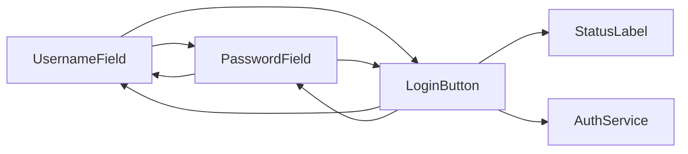

여기에 다음 기능이 추가된다고 가정합니다.

```text
2단계 인증 Checkbox

CaptchaField

GuestLoginButton

PasswordResetButton

LoginHistoryPanel

```

새로운 UI 컴포넌트가 추가될 때마다 기존 객체들의 참조 관계와 이벤트 처리 코드도 함께 수정될 수 있습니다.

예를 들어 Captcha까지 입력되어야 로그인 버튼을 활성화한다면:

```python
self.login_button.enabled = bool(
    self.username_field.value
    and self.password_field.value
    and self.captcha_field.valid
)

```

같은 규칙이 여러 컴포넌트로 퍼질 수 있습니다.

### 이 방식이 가진 단점

* **객체 간 강한 결합:** 각 Component가 다른 Component의 구체 타입과 상태를 직접 알아야 합니다.

* **의존 관계의 폭증:** 객체가 늘어나면 객체 사이의 직접 통신 관계도 빠르게 증가할 수 있습니다.

* **상호작용 규칙의 분산:** "언제 로그인 버튼을 활성화할 것인가"와 같은 협력 규칙이 여러 객체에 흩어집니다.

* **컴포넌트 재사용성 감소:** `UsernameField`가 특정 `LoginButton`, `PasswordField`에 의존하면 다른 화면에서 재사용하기 어려워집니다.

* **변경 영향 범위 증가:** 하나의 상호작용 규칙이 바뀌어도 여러 Component를 함께 수정해야 할 수 있습니다.

---

## 2. 미디에이터 패턴으로 해결하기 (The Solution)

미디에이터 패턴은 "여러 객체가 서로 직접 참조하여 통신하는 대신, 객체 사이의 상호작용을 전담하는 Mediator 객체를 통해 통신하도록 만드는 방식"으로 이 문제를 해결합니다.

일반적인 구조는 다음과 같습니다.

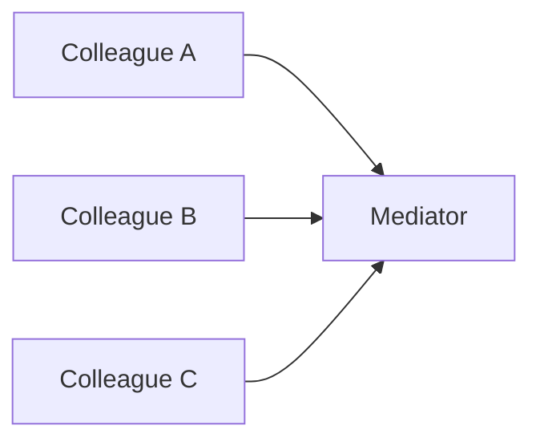

각 Component는 다른 Component를 직접 알지 않습니다.

대신 자신의 상태에 변화가 발생하면 Mediator에게 알립니다.

```python
class Component:

    def __init__(
        self,
        mediator: Mediator,
    ):
        self._mediator = mediator

```

예를 들어 사용자 이름이 변경되면:

```python
def set_value(
    self,
    value: str,
) -> None:

    self.value = value

    self._mediator.notify(
        self,
        "changed",
    )

```

비밀번호 역시 같은 방식입니다.

```python
def set_value(
    self,
    value: str,
) -> None:

    self.value = value

    self._mediator.notify(
        self,
        "changed",
    )

```

Mediator가 전체 협력 규칙을 알고 있습니다.

```python
class LoginDialogMediator(
    Mediator
):

    def notify(
        self,
        sender: Component,
        event: str,
    ) -> None:

        if (
            sender is self.username
            or sender is self.password
        ):
            self._update_login_button()

        elif (
            sender is self.login_button
            and event == "click"
        ):
            self._login()

```

로그인 버튼 활성화 규칙도 한곳에 모입니다.

```python
def _update_login_button(
    self,
) -> None:

    self.login_button.enabled = bool(
        self.username.value
        and self.password.value
    )

```

로그인 처리 역시 Mediator가 Component들을 조정합니다.

```python
def _login(self) -> None:

    success = self.auth_service.login(
        self.username.value,
        self.password.value,
    )

    self.status.text = (
        "로그인 성공"
        if success
        else "로그인 실패"
    )

```

구조가 다음과 같이 바뀝니다.

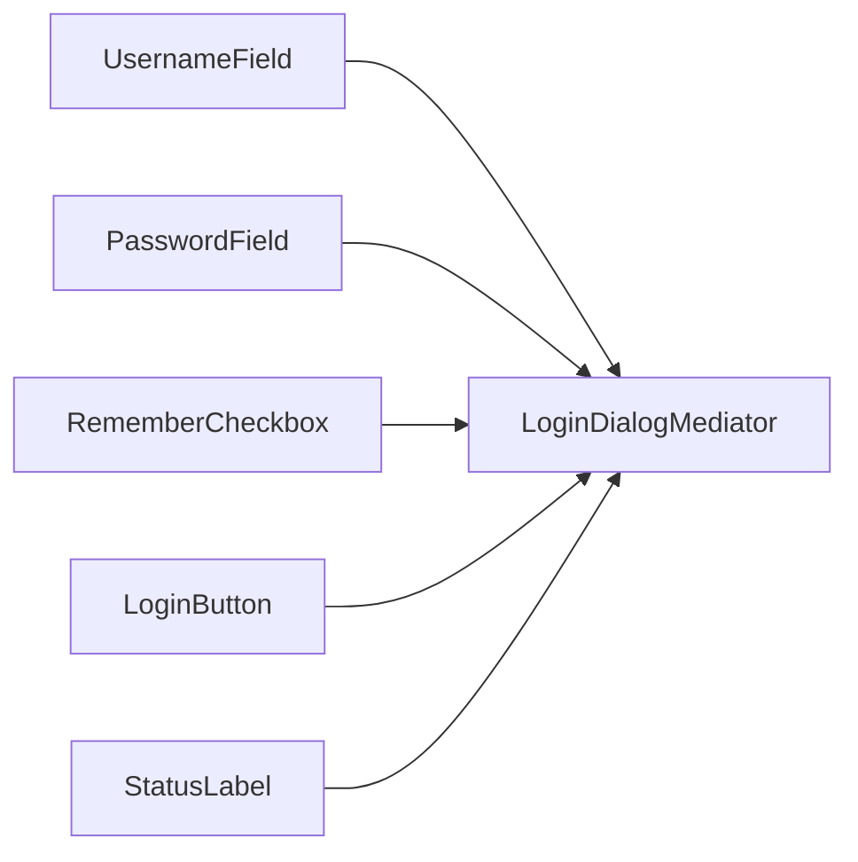

`UsernameField`는 더 이상 `PasswordField`나 `LoginButton`을 알지 않습니다.

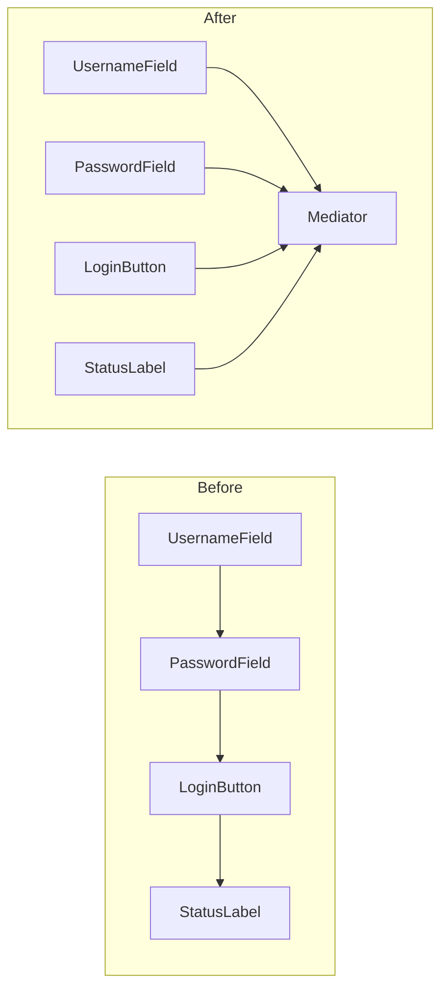

핵심은 단순히 이벤트 처리 코드를 하나의 클래스로 옮기는 것이 아닙니다.

**여러 객체 사이에 분산되어 있던 협력 규칙을 Mediator라는 명시적인 객체로 추출하여, 각 객체가 서로의 구체 구현을 몰라도 협력할 수 있도록 만드는 것**이 미디에이터 패턴의 본질입니다.

---

## 3. 장점, 단점 및 트레이드오프 (Trade-off)

### 장점 (Pros)

* **객체 간 결합도 감소:** Component가 서로 직접 참조하지 않고 Mediator에만 의존할 수 있습니다.

* **협력 규칙 집중:** 여러 객체가 언제 어떻게 상호작용하는지가 Mediator 한곳에 모입니다.

* **Component 재사용성 향상:** 다른 Component의 구체 타입을 몰라도 되므로 개별 객체를 다른 환경에서 사용하기 쉬워집니다.

* **상호작용 변경 용이:** Component 자체보다 Mediator의 조정 규칙을 수정하여 협력 방식을 변경할 수 있습니다.

* **복잡한 의존 그래프 단순화:** 객체들이 서로 모두 연결되는 구조를 중앙 Mediator를 중심으로 한 구조로 바꿀 수 있습니다.

객체가 `N`개 있을 때 직접적인 pairwise 관계의 잠재적 수는 빠르게 증가하지만 Mediator 구조에서는 각 객체가 주로 Mediator 하나와 관계를 가지므로 의존 그래프를 크게 단순화할 수 있습니다.

### 단점 (Cons)

* **Mediator 비대화 위험:** 모든 상호작용 규칙을 하나의 Mediator에 집중시키면 거대한 God Object가 될 수 있습니다.

* **중앙 집중된 복잡성:** 객체 사이의 복잡성이 사라지는 것이 아니라 Mediator 내부로 이동합니다.

* **Mediator 변경 빈도 증가:** 새로운 상호작용이 추가될 때마다 Mediator를 수정해야 할 수 있습니다.

* **동작 추적 어려움:** Component의 이벤트가 실제로 어떤 다른 Component를 변경시키는지 Component 코드만 보고 알기 어렵습니다.

* **재사용 가능한 Mediator 설계가 어려울 수 있음:** Mediator는 특정 객체들의 협력 규칙을 알고 있으므로 도메인에 강하게 특화될 수 있습니다.

### 트레이드오프 (Trade-off)

* **객체 간 상호작용이 복잡할수록 유리:** 서로 직접 참조하는 객체가 몇 개뿐이라면 Mediator 도입이 오히려 복잡할 수 있습니다.

* **Mediator의 책임을 적절히 분리해야 함:** 하나의 거대한 ApplicationMediator보다 기능 영역별 Mediator가 더 적합할 수 있습니다.

```text
LoginMediator

SearchMediator

CheckoutMediator

```

* **Mediator는 비즈니스 객체 자체를 대체하지 않음:** 각 Component의 고유 동작은 해당 Component가 유지하고, 여러 객체에 걸친 협력 규칙만 Mediator로 이동시키는 것이 자연스럽습니다.

* **중앙 집중과 분산의 교환:** Component는 단순해지는 대신 Mediator의 복잡도는 증가합니다. 즉 복잡성을 제거한다기보다 위치를 바꾸는 패턴입니다.

---

### Mediator와 Observer의 차이

두 패턴 모두 객체의 직접 결합을 줄일 수 있기 때문에 자주 혼동됩니다.

Observer의 구조는 일반적으로 다음과 같습니다.

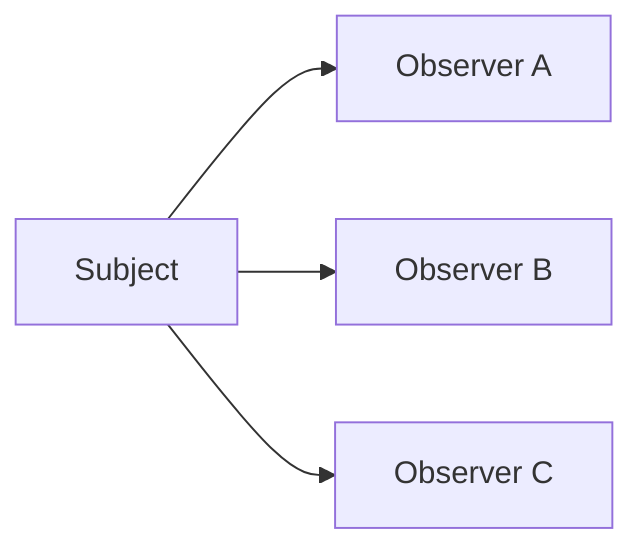

Subject는 상태 변화가 발생했음을 여러 Observer에게 알립니다.

핵심 질문은:

```text
"누가 이 변경을 관찰하고 있는가?"

```

입니다.

Mediator는 다음과 같습니다.

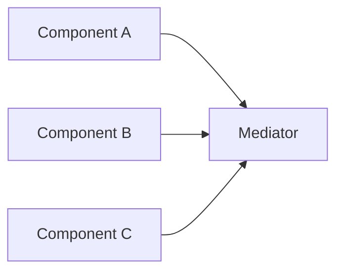

Mediator가 여러 객체의 상호작용 규칙을 알고 조정합니다.

핵심 질문은:

```text
"이 객체들이 어떻게 협력해야 하는가?"

```

입니다.

단순화하면:

```text
Observer:
    상태 변화의 전파

Mediator:
    객체 협력의 조정

```

입니다.

Event Bus를 사용하는 Mediator 구현은 Observer와 상당히 비슷해질 수도 있습니다.

---

### Mediator와 Facade의 차이

Facade 역시 여러 객체 앞에 하나의 중앙 객체를 둘 수 있습니다.

하지만 통신 방향에서 중요한 차이가 있습니다.

Facade는 일반적으로:

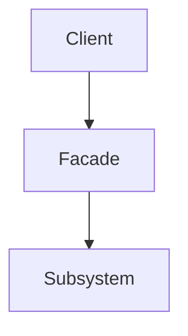

처럼 외부 Client가 복잡한 Subsystem을 쉽게 사용하도록 합니다.

Mediator는:

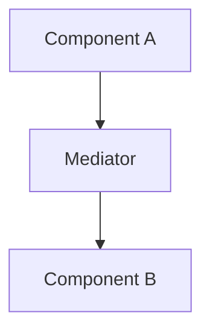

처럼 **Subsystem 내부 객체끼리의 협력 관계를 조정**합니다.

즉:

```text
Facade:
    외부에서 내부를
    단순하게 사용하는 경계

Mediator:
    내부 객체 사이의
    협력 규칙

```

에 가깝습니다.

---

### Mediator와 Chain of Responsibility의 차이

Chain of Responsibility에서는 요청이 여러 Handler를 순차적으로 이동합니다.

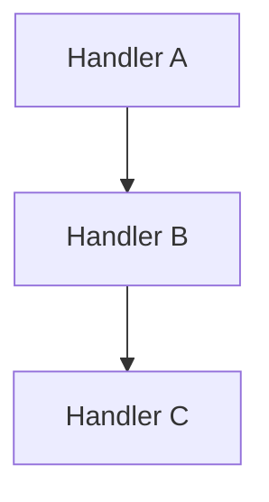

Mediator에서는 요청이 중앙 조정자에게 전달되고 Mediator가 필요한 객체의 동작을 결정합니다.

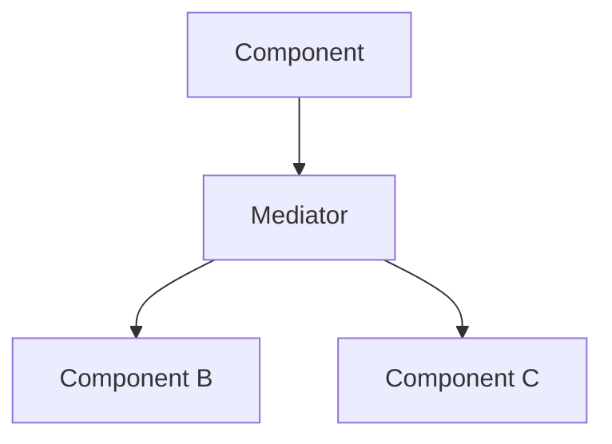

따라서:

```text
Chain of Responsibility:
    누가 요청을 처리할 것인가?

Mediator:
    객체들이 어떻게 협력할 것인가?

```

라고 구분할 수 있습니다.

---

### Mediator와 Controller의 차이

MVC의 Controller와 Mediator는 형태가 비슷해질 수 있습니다.

Controller는 일반적으로:

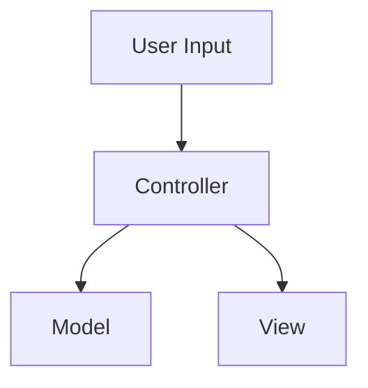

처럼 외부 입력을 애플리케이션 동작으로 변환합니다.

Mediator는 외부 입력 여부와 관계없이 **여러 Colleague 사이의 상호작용 자체를 조정**합니다.

특정 UI에서는 Controller가 Mediator의 역할까지 동시에 수행할 수도 있습니다.

---

## 4. 파이썬 오픈소스에서 볼 수 있는 미디에이터와 유사한 설계

파이썬과 관련 생태계에서도 **서로 직접 연결하지 않은 여러 실행 주체 사이에서 메시지, 작업 또는 이벤트를 중앙 구성 요소가 조정하는 구조**를 찾아볼 수 있습니다.

다만 아래 사례들이 모두 GoF Mediator 패턴의 정석 구현이라는 뜻은 아니며, **객체 또는 실행 주체 사이의 직접 결합을 줄이고 중앙 조정 계층을 통해 협력하게 한다는 관점**에서 이해하는 것이 적절합니다.

### Python `asyncio` Event Loop

Python의 `asyncio`에서 Event Loop는 Task와 Callback을 실행하고 네트워크 I/O와 subprocess 등을 관리하는 핵심 조정자입니다. Python 공식 문서는 Event Loop가 asynchronous task와 callback을 실행하고 network I/O와 subprocess를 수행하는 `asyncio` 애플리케이션의 핵심이라고 설명합니다. (Python documentation)

개념적으로 다음과 같이 볼 수 있습니다.

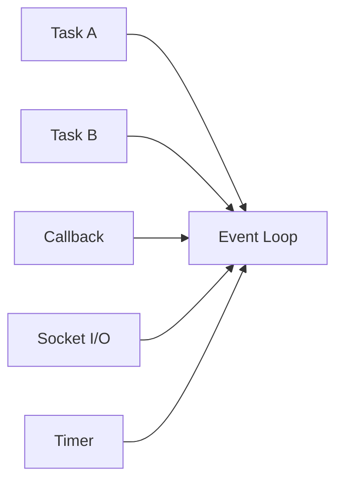

Task가 서로 직접 실행 순서를 관리하지 않고 Event Loop가 실행 가능한 Task와 Callback을 스케줄링합니다. `asyncio.Task` 역시 Event Loop 안에서 실행되며, 하나의 Task가 Future를 기다리는 동안 Event Loop는 다른 Task나 Callback, I/O 작업을 수행합니다. (Python documentation)

엄밀히는 Event Loop / Reactor / Scheduler 아키텍처의 성격이 더 강하지만, **여러 실행 주체 사이의 조정 책임을 중앙 구성 요소가 담당한다는 점에서 Mediator와 유사한 구조**로 볼 수 있습니다.

---

### Django Channels `Channel Layer`

Django Channels의 Channel Layer는 서로 다른 Application Instance나 Consumer 사이에서 메시지를 전달하는 통신 계층을 제공합니다.

Channels 공식 문서는 Channel Layer가 서로 다른 프로세스 사이에서 메시지를 보내고 받을 수 있는 메커니즘을 제공하며, Consumer는 개별 Channel 또는 Group을 통해 메시지를 주고받을 수 있다고 설명합니다. (Channels documentation)

예를 들어 채팅 시스템에서 Consumer들이 서로 직접 참조하지 않습니다.

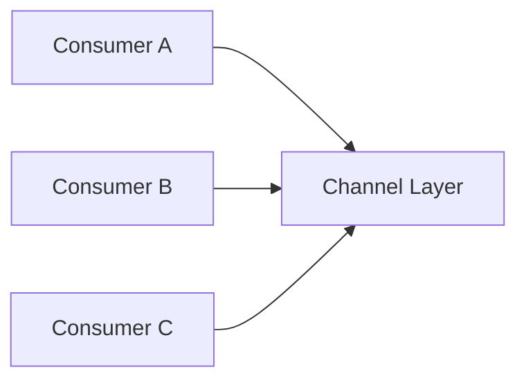

메시지는 Group을 통해 전달할 수 있습니다.

```python
await channel_layer.group_send(
    "chat",
    {
        "type": "chat.message",
        "text": "Hello",
    },
)

```

Channel Layer가 Group에 속한 Channel들로 메시지를 전달합니다. (Channels documentation)

이는 전통적인 객체형 Mediator보다 **Message Mediator / Message Bus**에 가까운 구조지만, 각 Consumer가 다른 Consumer의 구체 객체를 직접 알지 않고 중앙 메시징 계층을 통해 통신한다는 점에서 Mediator와 유사합니다.

---

### Celery Broker

Celery에서는 Task를 요청하는 Client와 실제 Task를 실행하는 Worker 사이에 Broker가 위치합니다.

Celery 공식 문서는 Task Queue를 스레드나 머신에 작업을 분배하는 메커니즘으로 설명합니다. Celery에서는 일반적으로 Broker가 Client와 Worker 사이에서 메시지를 전달합니다. Client가 Queue에 메시지를 추가하면 Broker가 이를 Worker에 전달합니다. (Celery documentation)

구조는 다음과 같습니다.

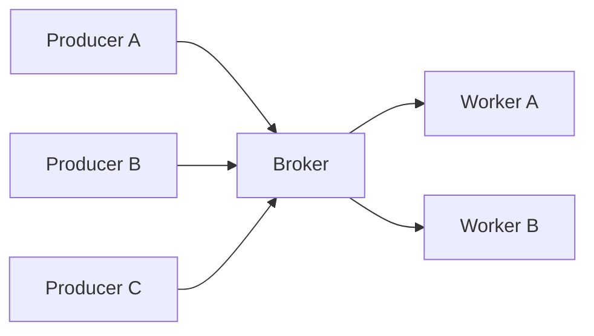

Client는 특정 Worker 객체를 직접 선택하거나 참조할 필요가 없습니다.

Celery는 여러 Broker transport를 지원하며 현재 문서에는 RabbitMQ, Redis, Amazon SQS, Kafka, Google Pub/Sub 등이 소개되어 있습니다. (Celery documentation)

이는 분산 시스템의 **Message Broker** 구조이므로 GoF Mediator와 구현 수준은 다르지만, **통신 당사자들의 직접 결합을 제거하고 중앙 중재 계층이 메시지 전달을 담당한다는 점**에서 Mediator 아이디어를 확장한 사례로 볼 수 있습니다.

---

## 5. 클래스 다이어그램

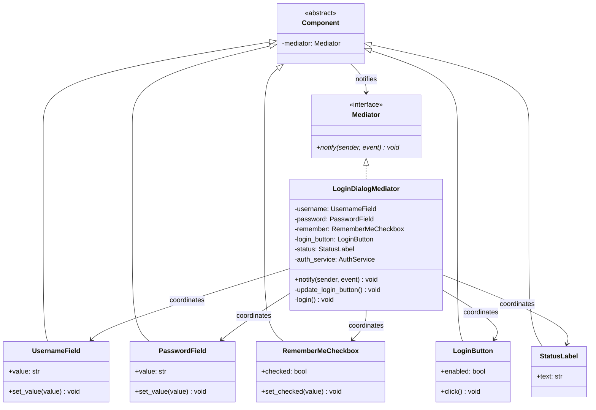

각 역할은 다음과 같습니다.

```text
Mediator
    Mediator

Concrete Mediator
    LoginDialogMediator

Colleagues
    UsernameField
    PasswordField
    RememberMeCheckbox
    LoginButton
    StatusLabel

```

핵심 구조는 다음과 같습니다.

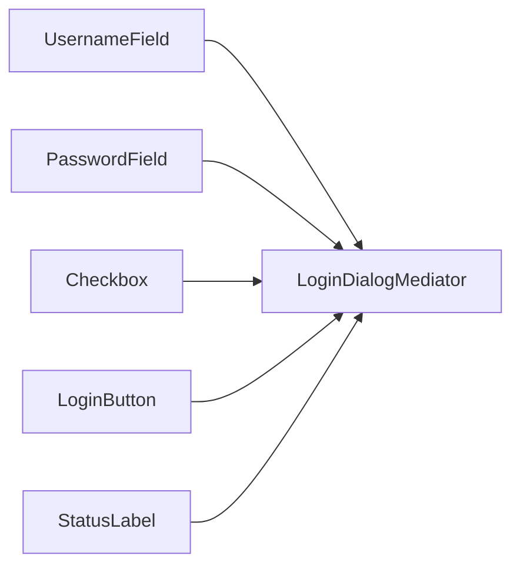

Colleague들은 서로 직접 참조하지 않습니다.

---

## 6. 파이썬 예제 코드

```python
from __future__ import annotations

from abc import ABC, abstractmethod

# -------------------------------------------------------------------
# 1. Mediator
# -------------------------------------------------------------------

class Mediator(ABC):
    @abstractmethod
    def notify(self, sender: Component, event: str) -> None:
        pass

# -------------------------------------------------------------------
# 2. Base Component
# -------------------------------------------------------------------

class Component:
    def __init__(self, mediator: Mediator | None = None):
        self._mediator = mediator

    def set_mediator(self, mediator: Mediator) -> None:
        self._mediator = mediator

    def _notify(self, event: str) -> None:
        if self._mediator is not None:
            self._mediator.notify(self, event)

# -------------------------------------------------------------------
# 3. Colleague - Username
# -------------------------------------------------------------------

class UsernameField(Component):
    def __init__(self):
        super().__init__()
        self.value = ""

    def set_value(self, value: str) -> None:
        self.value = value
        print(f"[Username] {value}")
        self._notify("changed")

# -------------------------------------------------------------------
# 4. Colleague - Password
# -------------------------------------------------------------------

class PasswordField(Component):
    def __init__(self):
        super().__init__()
        self.value = ""

    def set_value(self, value: str) -> None:
        self.value = value
        print("[Password] 변경됨")
        self._notify("changed")

# -------------------------------------------------------------------
# 5. Colleague - Remember Me
# -------------------------------------------------------------------

class RememberMeCheckbox(Component):
    def __init__(self):
        super().__init__()
        self.checked = False

    def set_checked(self, checked: bool) -> None:
        self.checked = checked
        self._notify("changed")

# -------------------------------------------------------------------
# 6. Colleague - Login Button
# -------------------------------------------------------------------

class LoginButton(Component):
    def __init__(self):
        super().__init__()
        self.enabled = False

    def click(self) -> None:
        if not self.enabled:
            print("[LoginButton] " "현재 비활성 상태입니다.")
            return
        self._notify("click")

# -------------------------------------------------------------------
# 7. Colleague - Status
# -------------------------------------------------------------------

class StatusLabel(Component):
    def __init__(self):
        super().__init__()
        self.text = ""

    def set_text(self, text: str) -> None:
        self.text = text
        print(f"[Status] {text}")

# -------------------------------------------------------------------
# 8. Service
# -------------------------------------------------------------------

class AuthService:
    def login(self, username: str, password: str) -> bool:
        return username == "aragorn" and password == "anduril"

# -------------------------------------------------------------------
# 9. Concrete Mediator
# -------------------------------------------------------------------

class LoginDialogMediator(Mediator):
    def __init__(
        self,
        username: UsernameField,
        password: PasswordField,
        remember: RememberMeCheckbox,
        login_button: LoginButton,
        status: StatusLabel,
        auth_service: AuthService,
    ):
        self._username = username
        self._password = password
        self._remember = remember
        self._login_button = login_button
        self._status = status
        self._auth_service = auth_service
        username.set_mediator(self)
        password.set_mediator(self)
        remember.set_mediator(self)
        login_button.set_mediator(self)
        status.set_mediator(self)

    def notify(self, sender: Component, event: str) -> None:
        if event == "changed" and (
            sender is self._username or sender is self._password
        ):
            self._update_login_button()
        elif sender is self._remember and event == "changed":
            self._update_remember_status()
        elif sender is self._login_button and event == "click":
            self._login()

    def _update_login_button(self) -> None:
        enabled = bool(self._username.value and self._password.value)
        self._login_button.enabled = enabled
        print("[Mediator] " f"LoginButton.enabled={enabled}")

    def _update_remember_status(self) -> None:
        if self._remember.checked:
            print("[Mediator] " "로그인 정보 저장 활성화")
        else:
            print("[Mediator] " "로그인 정보 저장 비활성화")

    def _login(self) -> None:
        success = self._auth_service.login(self._username.value, self._password.value)
        if success:
            self._status.set_text("로그인 성공")
        else:
            self._status.set_text("로그인 실패")

# -------------------------------------------------------------------
# 10. 실행 (Usage)
# -------------------------------------------------------------------

if __name__ == "__main__":
    username = UsernameField()
    password = PasswordField()
    remember = RememberMeCheckbox()
    login_button = LoginButton()
    status = StatusLabel()
    LoginDialogMediator(
        username=username,
        password=password,
        remember=remember,
        login_button=login_button,
        status=status,
        auth_service=AuthService(),
    )
    login_button.click()
    username.set_value("aragorn")
    password.set_value("anduril")
    remember.set_checked(True)
    login_button.click()
```

실행 흐름은 다음과 같습니다.

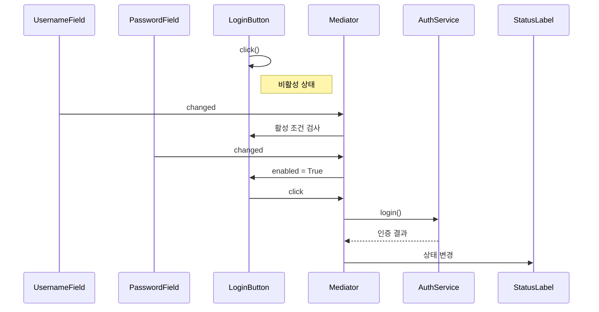

중요한 점은 `UsernameField`가 다음 객체들을 전혀 알지 않는다는 것입니다.

```text
PasswordField

LoginButton

StatusLabel

AuthService

```

`UsernameField`가 알고 있는 협력 상대는 오직:

```text
Mediator

```

뿐입니다.

새로운 `CaptchaField`가 추가되더라도 기존 `UsernameField`와 `PasswordField`를 수정하지 않고 Mediator의 협력 규칙을 변경할 수 있습니다.

---

## 부록 (Appendix): 현대적 타입 시스템과 함수형 관점의 재해석

미디에이터(Mediator) 패턴을 현대적 타입 시스템과 함수형 프로그래밍 관점에서 재해석하면, 문제의 본질은 단순히 **"객체들이 직접 통신하는 대신 중앙 객체의 메서드를 호출하는 것"** 이상입니다.

### 고전적 구조 대 추상화된 구조

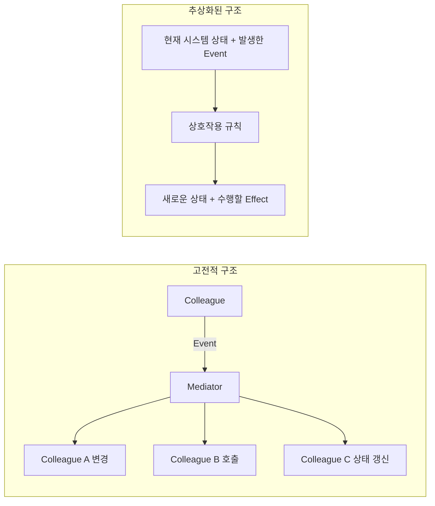

> **핵심 질문**
> *"여러 구성 요소의 상호작용 규칙을 객체 간 직접 참조가 아닌, **명시적인 메시지·상태 전이·효과 해석**으로 표현할 수는 없는가?"*
>

아래 예제는 이해를 돕기 위해 **대수적 데이터 타입(ADT), 불변 상태, Typed Message, Reducer, Actor/Message Passing, Stream/FRP, Effect Handler를 지원하는 가상의 Python 문법**을 가정하여 작성되었습니다. *(아래 코드는 실제 Python 문법이 아닙니다.)*

---

### 1. Typed Event ADT로 타입 안전성 확보

고전적 방식의 문자열 기반 Event 명시는 오타나 잘못된 메시지 전달에 취약합니다.

```python
# 고전적 방식: 오타 발생 시 컴파일 타임에 감지 불가
mediator.notify(self, "chnaged")

```

대수적 데이터 타입(ADT)을 활용하면 잘못된 Event 표현 자체가 불가능해집니다.

```text
data LoginEvent =
    UsernameChanged(value: str)
  | PasswordChanged(value: str)
  | RememberChanged(checked: Bool)
  | LoginClicked

# Component: Event 생성 및 방출
emit(UsernameChanged(value))

# Mediator: 명확한 입력 타입
def handle(event: LoginEvent) -> Unit:
    ...

```

---

### 2. Component Identity를 Event 데이터로 이동

Event 타입 자체에 의미가 담기면, Sender 객체의 Identity를 확인할 필요가 없습니다.

```python
# 기존: Sender 참조 검사
if sender is self.username: ...

# 개선: Event 타입 자체로 식별
UsernameChanged(value="aragorn")
PasswordChanged(value="anduril")

```

`(sender, "changed")` 형태의 동적 표현이 `UsernameChanged(value)`와 같은 **정적이고 의미 있는 표현**으로 전환됩니다.

---

### 3. 분산된 상태를 하나의 불변 State로 통합

여러 UI Component에 흩어져 있던 가변 상태를 단일 불변 레코드(Immutable Record)로 표현합니다.

```text
immutable record LoginState:
    username: str
    password: str
    remember: Bool
    login_enabled: Bool
    status: LoginStatus

initial = LoginState(
    username="",
    password="",
    remember=False,
    login_enabled=False,
    status=Idle,
)

```

---

### 4. Mediator의 Reducer 전환

Mediator는 객체들을 직접 변경하는 대신 **순수 상태 전이 함수(Reducer)** 역할을 수행합니다.

```text
def reduce(state: LoginState, event: LoginEvent) -> LoginState:
    match event:
        case UsernameChanged(value):
            next = state with { username = value }
            return next with {
                login_enabled = bool(next.username and next.password)
            }

        case PasswordChanged(value):
            next = state with { password = value }
            return next with {
                login_enabled = bool(next.username and next.password)
            }

        case RememberChanged(checked):
            return state with { remember = checked }

```

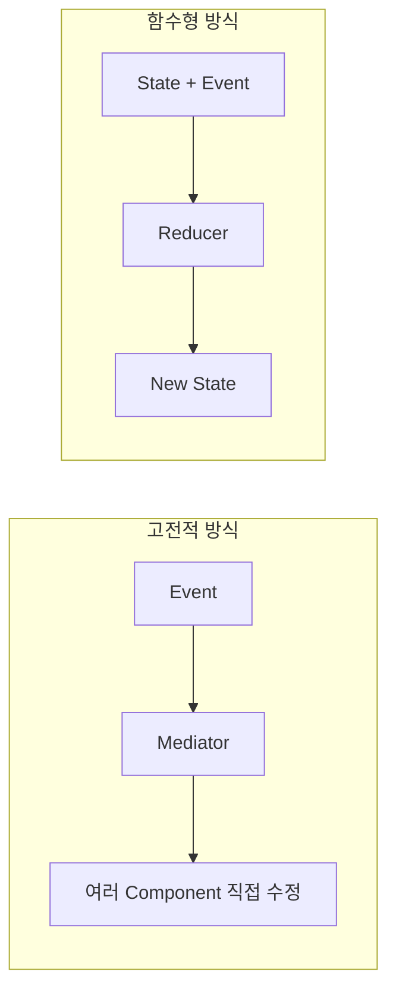

---

### 5. 순수 상태 전이와 Side Effect 분리

인증 서버 호출과 같은 외부 부수효과(Side Effect)를 명령(Effect Command)으로 추상화하여 순수성을 유지합니다.

```text
data LoginEffect =
    Authenticate(username: str, password: str)
  | SaveCredentials(username: str)

def reduce(state: LoginState, event: LoginEvent) -> (LoginState, Vector[LoginEffect]):
    match event:
        case LoginClicked:
            if not state.login_enabled:
                return (state, [])

            return (
                state with { status = Loading },
                [Authenticate(state.username, state.password)]
            )

```

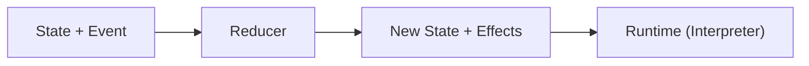

---

### 6. 단방향 데이터 흐름 (Unidirectional Data Flow)

외부 작업의 결과 역시 이벤트로 환원하여 모든 상태 변화 경로를 단일화합니다.

```mermaid
flowchart LR
    clicked["LoginClicked"] --> reducer_request["Reducer"]
    reducer_request --> effect["Authenticate Effect"]
    effect --> server["Auth Server"]
    server --> succeeded["AuthSucceeded Event"]
    succeeded --> reducer_result["Reducer"]
    reducer_result --> logged_in["LoggedIn State"]
```

---

### 7. Typed Message Router를 통한 Mediator 비대화 방지

단일 Mediator가 너무 커지는 것을 방지하기 위해 기능 영역별로 메시지를 라우팅합니다.

```text
data Message =
    LoginMessage(LoginEvent)
  | SearchMessage(SearchEvent)
  | WindowMessage(WindowEvent)

def route(message: Message) -> Unit:
    match message:
        case LoginMessage(event): login_mediator.handle(event)
        case SearchMessage(event): search_mediator.handle(event)
        case WindowMessage(event): window_mediator.handle(event)

```

```mermaid
flowchart LR
    bus["MessageBus"] --> login["LoginMediator"]
    bus --> search["SearchMediator"]
    bus --> window["WindowMediator"]
```

---

### 8. GADT를 활용한 Typed Request Broker

결과값의 타입 관계를 GADT(General Algebraic Data Type)로 정의하여 요청과 응답을 정적으로 검증합니다.

```text
data Request[Result] =
    Authenticate(username: str, password: str) -> Request[AuthResult]
  | LoadProfile(user_id: UserId)               -> Request[Profile]
  | Logout                                     -> Request[Unit]

# 사용 시 컴파일러가 'result'의 타입을 AuthResult로 추론
result = await request(Authenticate(username, password))

```

---

### 9. Actor Model 기반 메시지 패싱

객체 참조 메서드를 직접 호출하는 대신 메일박스(Mailbox)를 통한 비동기 메시지 패싱으로 격리합니다.

```text
actor LoginCoordinator:
    on LoginClicked:
        send(auth_actor, Authenticate(...))

```

```mermaid
flowchart LR
    username["Username Actor"] --> coordinator["LoginCoordinator Actor (Mailbox)"]
    password["Password Actor"] --> coordinator
    button["Button Actor"] --> coordinator
```

---

### 10. Actor Mediator를 통한 동시성 경계 구축

상태를 직접 수정하지 않고 Mailbox의 메시지를 순차 처리함으로써 동시성 이슈(Synchronization)를 자연스럽게 해결합니다.

```mermaid
flowchart LR
    event_a["Event A"] --> mailbox["Mailbox Queue"]
    event_b["Event B"] --> mailbox
    event_c["Event C"] --> mailbox
    mailbox --> actor["Mediator Actor"]
    actor --> handle_a["Event A 처리"]
    handle_a --> handle_b["Event B 처리"]
    handle_b --> handle_c["Event C 처리"]
```

---

### 11. Event Bus와 Mediator의 역할 구분

| 구분 | **Event Bus** | **Mediator** |
| --- | --- | --- |
| **핵심 목적** | 전달 메커니즘 중심 (발신자는 수신자를 모름) | 상호작용 규칙 중심 (중앙 조정 로직 존재) |
| **흐름 구조** | `Event ──> [Analytics, Audit, WelcomeEmail]` | `Event ──> Mediator ──> [AuthService, UI 비활성화]` |

---

### 12. Event Stream을 통한 반응형 조합

명령형 상태 변경을 반응형 데이터 흐름으로 전환합니다.

```text
login_enabled = combine_latest(username, password)
    |> map(lambda pair: bool(pair.username and pair.password))

```

```mermaid
flowchart LR
    username["Username Stream"] --> combine["combineLatest"]
    password["Password Stream"] --> combine
    combine --> validate["map(valid?)"]
    validate --> enabled["Button Enabled"]
```

---

### 13. FRP (Functional Reactive Programming)와 Reactive Graph

FRP 환경에서는 명시적인 Mediator 객체가 사라지고 반응형 의존성 그래프(Reactive Dependency Graph)가 조정 규칙 역할을 대체합니다.

```text
login_enabled = username.non_empty AND password.non_empty
status = login_result |> map(lambda r: "성공" if r.success else "실패")

```

---

### 14. Algebraic Effect를 활용한 협력 선언

구체 Mediator 대신 필요한 효과(Effect)만 선언하고 실행 환경(Handler)에 위임합니다.

```text
effect LoginUI:
    def SetLoginEnabled(value: Bool) -> Unit
    def SetStatus(value: LoginStatus) -> Unit

def login_flow(username: str, password: str) -> Unit ! LoginUI + Authentication:
    result = perform Login(username, password)
    perform SetStatus(LoggedIn if result.success else Failed)

```

---

### 15. Capability 기반 권한 최소화

객체 전체를 전달받는 대신, 필요한 행위 능력(Capability)만 제한적으로 주입하여 결합도를 낮춥니다.

```text
capability LoginView:
    def set_enabled(value: Bool) -> Unit
    def show_status(status: LoginStatus) -> Unit

def coordinate_login(state: LoginState, using view: LoginView, auth: Auth) -> Unit:
    ...

```

---

### 16. Reducer Composition을 통한 복잡도 분산

하나의 거대한 Mediator(God Object)를 기능별 Small Reducer로 분할하여 합성합니다.

```python
app_reducer = combine_reducers(
    login_reducer,
    search_reducer,
    settings_reducer,
)

```

---

### 17. State Machine을 활용한 유효 상태의 타입화

로그인 상태와 버튼 상태를 따로 저장하면 `LoggedIn`과 `Loading`처럼 모순된 조합이 생길 수 있습니다. 관련 UI 상태 전체를 하나의 닫힌 ADT로 모델링하면 정의하지 않은 조합을 생성하지 못하게 제한할 수 있습니다.

```text
data LoginState =
    Editing(username: str, password: str)
  | Authenticating
  | LoggedIn(user: User)
  | Failed(reason: AuthError)

```

```mermaid
stateDiagram-v2
    Editing --> Authenticating: LoginClicked
    Authenticating --> LoggedIn: Success
    Authenticating --> Failed: Failure
```

---

### 18. 상호작용 국소화 (Interaction Localization)

Mediator는 의존성 그래프를 복잡한 N:M 구조에서 Star 형태(1:N)로 단순화합니다.

```mermaid
flowchart LR
    subgraph without["Mediator 미도입"]
        a1["A"] --- b1["B"]
        a1 --- c1["C"]
        a1 --- d1["D"]
        b1 --- c1
        b1 --- d1
        c1 --- d1
    end

    subgraph with["Mediator 도입"]
        a2["A"] --> mediator["M"]
        b2["B"] --> mediator
        c2["C"] --> mediator
    end
```

> **주의**: 도메인의 본질적인 상호작용 복잡성이 사라지는 것이 아니라 **Mediator 내부로 집약(Interaction Localization)**되는 것입니다.
>
>

---

### 19. 상호작용 대수 (Interaction Algebra)

상호작용 자체를 도메인 언어(DSL)로 바라보고, Mediator를 해당 언어의 해석기(Interpreter)로 취급합니다.

```text
data LoginInteraction =
    UsernameChanged(...)
  | LoginClicked
  | AuthenticationSucceeded(...)

def interpret(interaction: LoginInteraction, state: LoginState) -> (LoginState, Vector[Effect]):
    ...

```

---

### 20. 중앙 객체에서 명시적 경계(Boundary)로의 진화

Mediator 패턴의 본질은 "참여 자간의 직접적인 알림/의존성을 배제하는 것"입니다. 현대 프로그래밍에서는 이를 가변 중앙 객체가 아닌 다양한 패턴으로 구현할 수 있습니다.

* Typed Event ADT
* Reducer / Pattern Matching
* Message Router / Actor
* Event Stream / FRP
* Capability / Effect Handler
* State Machine

---

### 요약 및 비교

| 관점 | OOP 아키텍처 (고전) | 현대 타입 시스템 + 함수형 관점 |
| --- | --- | --- |
| **상호작용 요청** | `notify(sender, event)` | **Typed Event ADT** |
| **발신자 구분** | 객체 Identity / Type | **Event Constructor** |
| **협력 상태** | 여러 Component에 분산 | **Immutable State** |
| **협력 규칙** | Mediator 메서드 조건문 | **Reducer / Pattern Matching** |
| **상태 변화** | Component 직접 수정 | **State + Event $\rightarrow$ New State** |
| **부수효과** | Mediator에서 직접 호출 | **Effect Command / Interpreter** |
| **비동기 협력** | Callback / Delegate | **Actor / Mailbox** |
| **UI 관계 표현** | 명령형 Mediator | **FRP / Signal Graph** |
| **의존성 주입** | Concrete Component 참조 | **Capability** |
| **외부 동작 추상화** | 직접 메서드 호출 | **Algebraic Effect** |
| **복잡도 완화** | 여러 Mediator 클래스 분할 | **Reducer Composition** |
| **상태 유효성** | Runtime 조건 검사 | **State Machine / ADT** |
| **주요 장점** | 객체 간 직접 결합 감소 | **상태·메시지·효과의 명시적 모델링** |
| **주요 비용** | God Object 위험 | **Event·State·Effect 설계 비용** |

---

### 결론

고전적인 Mediator 패턴은 **여러 객체가 서로 직접 참조하며 복잡한 의존 관계를 형성하는 대신, 객체 사이의 상호작용과 협력 규칙을 Mediator 객체에 집중시켜 각 객체를 느슨하게 결합하는 행위 패턴**입니다.

객체지향에서는:

```mermaid
flowchart LR
    colleague_a["Colleague A"] --> mediator["Mediator"]
    colleague_b["Colleague B"] --> mediator
    colleague_c["Colleague C"] --> mediator
```

라는 구조로 표현합니다.

Component들은:

```text
"내 상태가 바뀌었다."

```

는 사실만 Mediator에 전달하고,

Mediator는:

```text
"그 변화에 따라
어떤 다른 객체가
어떻게 동작해야 하는가?"

```

를 결정합니다.

현대 타입 시스템과 함수형 패러다임에서는 이 개념을 더 일반적인 **상호작용 모델링**으로 확장할 수 있습니다.

* `notify(sender, event)` $\leftrightarrow$ Typed Event ADT

* Sender Identity 검사 $\leftrightarrow$ Event Constructor

* Mediator 내부 가변 상태 $\leftrightarrow$ Immutable State

* Mediator의 조건문 $\leftrightarrow$ Reducer / Pattern Matching

* Component 상태 직접 변경 $\leftrightarrow$ State Transition

* 외부 서비스 호출 $\leftrightarrow$ Effect Command

* 중앙 Message 중계 $\leftrightarrow$ Typed Message Router

* 비동기 Mediator $\leftrightarrow$ Actor / Mailbox

* UI 상호작용 $\leftrightarrow$ Reactive Stream / FRP

* 구체 객체 접근 $\leftrightarrow$ Capability

* 협력 규칙의 유효 상태 $\leftrightarrow$ ADT State Machine

* 거대한 Mediator $\leftrightarrow$ Reducer / Coordinator Composition

미디에이터의 핵심은 구성 요소 사이의 직접 의존을 줄이고, 상호작용 규칙을 하나의 명시적인 조정 경계에 모으는 데 있습니다. 메시지 라우터, Reducer, Actor는 그 경계를 서로 다른 방식으로 구현합니다.
