# 메멘토 패턴 (Memento Pattern)


## 1. 패턴이 없을 때 발생하는 문제점 (The Problem)

메멘토 패턴을 사용하지 않고 객체의 이전 상태를 복원하려고 하면, 상태를 저장하는 외부 객체가 대상 객체의 내부 필드와 구조를 직접 알아야 하는 문제가 발생할 수 있습니다.

예를 들어 텍스트 편집기에서 다음 상태를 관리한다고 가정합니다.

```text
현재 텍스트
커서 위치
선택 영역
```

사용자는 편집 작업을 수행한 뒤 이전 상태로 되돌리는 Undo 기능을 사용할 수 있어야 합니다.

### 패턴을 적용하지 않은 예시

```python
class TextEditor:
    def __init__(self):
        self.text = ""
        self.cursor = 0
        self.selection: tuple[int, int] | None = None

    def insert(self, value: str) -> None:
        self.text = self.text[: self.cursor] + value + self.text[self.cursor :]
        self.cursor += len(value)

    def move_cursor(self, position: int) -> None:
        self.cursor = position
```

Undo 기능을 구현하기 위해 외부 History 객체가 현재 상태를 직접 복사한다고 가정합니다.

```python
class BadEditorHistory:
    def __init__(self, editor: TextEditor):
        self.editor = editor
        self.history: list[dict[str, object]] = []

    def backup(self) -> None:
        self.history.append(
            {
                "text": self.editor.text,
                "cursor": self.editor.cursor,
                "selection": self.editor.selection,
            }
        )
```

복원 시에도 같은 내부 필드를 직접 수정해야 합니다.

```python
def undo(self) -> None:
    if not self.history:
        return
    state = self.history.pop()
    self.editor.text = str(state["text"])
    self.editor.cursor = int(state["cursor"])
    self.editor.selection = state["selection"]
```

이제 TextEditor 내부 구현이 변경된다고 가정합니다.

```text
Before:

text
cursor
selection


After:

document
caret
selection_start
selection_end
```

TextEditor뿐 아니라 BadEditorHistory도 함께 수정해야 합니다.

```python
self.history.append(
    {
        "document": self.editor.document,
        "caret": self.editor.caret,
        "selection_start": self.editor.selection_start,
        "selection_end": self.editor.selection_end,
    }
)
```

외부 객체가 TextEditor의 내부 상태 표현을 알고 있기 때문입니다.

또한 상태가 복잡해지면 문제가 더 커집니다.

```text
텍스트
커서 위치
선택 영역
현재 스타일
스크롤 위치
접힌 영역
입력 모드
문서 메타데이터
```

History가 이러한 필드를 모두 복사하고 복원한다면 사실상 TextEditor의 내부 구현에 강하게 결합됩니다.

### 이 방식이 가진 단점

* **캡슐화 위반:** 상태를 저장하는 객체가 Originator의 내부 필드와 구조를 직접 알아야 합니다.
* **내부 구현과 강한 결합:** Originator의 상태 표현이 변경되면 History 같은 외부 객체도 함께 수정해야 합니다.
* **복원 규칙의 분산:** 어떤 필드를 저장하고 어떤 순서로 복원해야 하는지가 외부 객체에 퍼질 수 있습니다.
* **불완전한 상태 저장 위험:** 새로운 필드가 추가되었지만 History에서 저장하지 않으면 이전 상태를 정확히 복원하지 못할 수 있습니다.
* **Undo/Checkpoint 기능의 중복:** 여러 클라이언트가 각각 상태 복사 규칙을 구현할 수 있습니다.

---

## 2. 메멘토 패턴으로 해결하기 (The Solution)

메멘토 패턴은 "객체의 내부 상태를 캡슐화를 깨뜨리지 않는 별도의 Memento 객체로 저장하고, 나중에 Originator가 해당 Memento를 이용해 자신의 상태를 복원하도록 하는 방식"으로 이 문제를 해결합니다.

일반적인 구조는 다음과 같습니다.

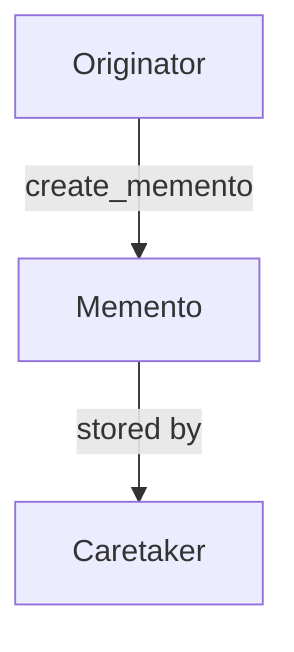

복원 과정은 반대 방향입니다.

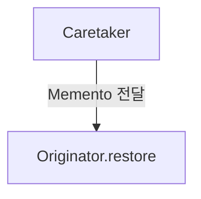

TextEditor가 자신의 상태를 직접 Snapshot으로 만듭니다.

```python
def create_memento(self) -> EditorMemento:
    return EditorMemento(
        text=self._text, cursor=self._cursor, selection=self._selection
    )
```

중요한 점은 어떤 상태를 저장해야 하는지는 Originator 자신이 결정한다는 것입니다.

History는 내부 필드를 알 필요가 없습니다.

```python
memento = editor.create_memento()
history.append(memento)
```

복원 역시 Originator가 담당합니다.

```python
editor.restore(memento)
```

History는 다음 정보를 알 필요가 없습니다.

```text
TextEditor가 어떤 필드를 가지고 있는가?
어떤 필주는 Snapshot에 포함되는가?
어떤 순서로 상태를 복원해야 하는가?
상태가 내부적으로 어떻게 표현되는가?
```

구조는 다음과 같이 바뀝니다.

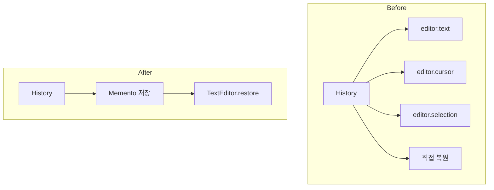

Caretaker는 Memento의 내용이 아니라 Memento 자체의 수명과 순서만 관리합니다.

```text
Undo Stack:

[0] Memento
[1] Memento
[2] Memento
```

핵심은 단순히 객체를 복사하는 데 있지 않습니다.

**Originator가 자신의 내부 상태 표현을 외부에 노출하지 않은 채 특정 시점의 상태를 독립적인 Snapshot으로 캡슐화하고, Caretaker는 그 Snapshot의 내용에 의존하지 않고 저장·관리하며, 실제 복원 책임은 다시 Originator가 담당하도록 만드는 것**이 메멘토 패턴의 본질입니다.

---

## 3. 장점, 단점 및 트레이드오프 (Trade-off)

### 장점 (Pros)

* **캡슐화 유지:** Caretaker가 Originator의 내부 상태 구조를 직접 알지 않아도 됩니다.
* **Undo/Redo 구현에 유리:** 이전 상태를 Memento로 저장하여 필요할 때 복원할 수 있습니다.
* **Checkpoint 구현 가능:** 긴 작업 중 특정 시점의 상태를 저장하고 실패 시 해당 지점으로 돌아갈 수 있습니다.
* **Originator 책임 유지:** 어떤 상태를 저장하고 어떻게 복원할 것인지를 해당 객체가 직접 결정합니다.
* **History와 상태 표현 분리:** Caretaker는 Snapshot의 실제 내부 표현에 의존하지 않고 순서와 수명만 관리합니다.

### 단점 (Cons)

* **메모리 사용량 증가:** 상태 전체를 Snapshot으로 저장하면 History 길이에 비례하여 메모리가 증가할 수 있습니다.
* **복사 비용 증가:** Originator의 상태가 크다면 Memento 생성 자체가 비쌀 수 있습니다.
* **가변 객체의 깊은 복사 문제:** Memento 내부에 가변 객체 참조를 그대로 저장하면 이후 변경에 의해 Snapshot이 오염될 수 있습니다.
* **외부 자원 복원의 어려움:** 파일 핸들, 소켓, DB 연결, 외부 API 상태 등은 단순 Snapshot만으로 복원할 수 없습니다.
* **버전 호환성 문제:** 오래된 Memento를 객체 구조가 변경된 새로운 버전에서 복원하기 어려울 수 있습니다.
* **객체 Identity 문제:** Snapshot에 다른 Entity에 대한 참조가 포함되어 있다면 단순 복원이 올바른 의미인지 판단해야 합니다.

### 트레이드오프 (Trade-off)

* **상태가 작고 Undo가 중요할수록 유리:** 편집기, 게임 저장 상태, 설정 편집 UI 등에 잘 맞습니다.
* **상태가 매우 크다면 전체 Snapshot이 비효율적일 수 있음:** 변경된 부분만 저장하는 Delta Memento나 구조적 공유가 더 적합할 수 있습니다.
* **Snapshot 주기를 조절할 수 있음:** 모든 작은 변경마다 Memento를 저장하는 대신 일정 간격마다 Checkpoint를 만들 수 있습니다.
* **Memento는 반드시 영구 저장 형식일 필요가 없음:** 프로세스 내부 Undo용 Memento와 디스크에 저장하는 Save File은 요구사항이 다릅니다.
* **Memento는 반드시 객체 전체를 저장할 필요도 없음:** 복원에 필요한 최소 상태만 캡슐화할 수 있습니다.

---

### 메멘토와 커맨드의 차이

앞서 살펴본 Command 역시 Undo를 구현할 수 있습니다. 하지만 접근 방식이 다릅니다.

Command는 무엇을했는가를 저장합니다.

```text
InsertText("Hello")
DeleteText(5)
MoveCursor(10)
```

Undo는 역연산을 실행할 수 있습니다.

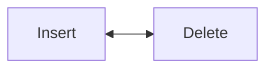

반면 Memento는 그 시점의 상태가 무엇이었는가를 저장합니다.

```text
Editor State at t₀
Editor State at t₁
Editor State at t₂
```

Undo는 이전 Snapshot을 복원합니다.

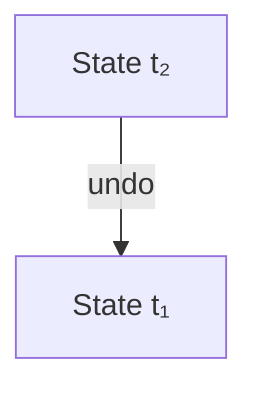

단순화하면:

```text
Command:
    행동 기반 Undo

Memento:
    상태 기반 Undo
```

입니다. 두 패턴은 함께 사용할 수도 있습니다.

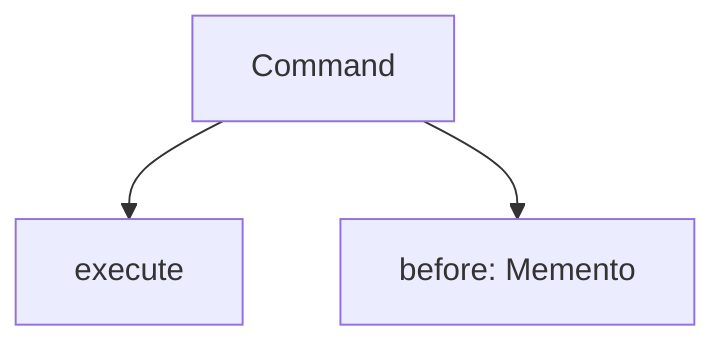

---

### 메멘토와 프로토타입의 차이

Prototype 역시 객체 상태를 복제합니다.

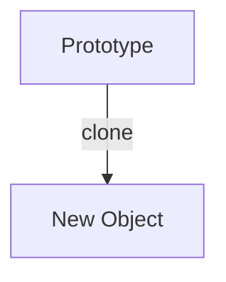

하지만 목적이 다릅니다.

Prototype은 **기존 객체를 기반으로 새로운 독립 객체 생성**이 목적입니다.
Memento는 **기존 객체의 과거 상태 저장과 복원**이 목적입니다.

즉:

```text
Prototype:
    Object Creation

Memento:
    State History
```

입니다.

---

### 메멘토와 State 패턴의 차이

State 패턴의 State 객체는 현재 상태에 따라 객체 행동을 바꾸기 위한 전략적인 상태 객체입니다.

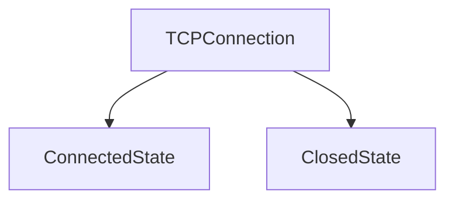

Memento는 특정 시점의 상태를 저장한 수동적인 Snapshot입니다.

```text
Memento₀
Memento₁
Memento₂
```

즉:

```text
State Pattern:
    현재 상태가 행동을 결정

Memento:
    과거 상태를 저장
```

이라고 구분할 수 있습니다.

---

### 메멘토와 Serialization의 차이

둘 다 객체 상태를 데이터로 표현할 수 있기 때문에 비슷해 보일 수 있습니다.

Serialization은 주로:

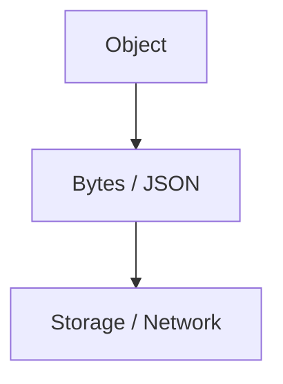

처럼 전송 또는 영속 저장 가능한 표현으로 변환하는 것이 목적입니다.

Memento는:

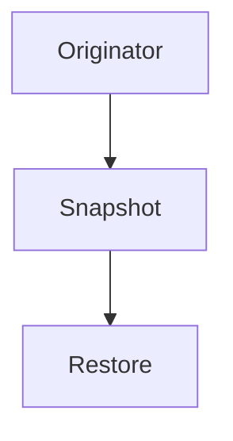

처럼 상태 복원이 목적입니다.

Serialization이 Memento의 구현 기술로 사용될 수는 있지만 두 개념의 목적은 다릅니다.

---

### 메멘토와 Event Sourcing의 차이

Memento는 특정 시점의 상태를 직접 저장합니다.

```text
State₀
State₁
State₂
```

Event Sourcing은 상태를 변경한 사건을 저장합니다.

```text
DocumentCreated
TextInserted
TextDeleted
CursorMoved
```

현재 상태는 Event들을 다시 적용하여 계산합니다.

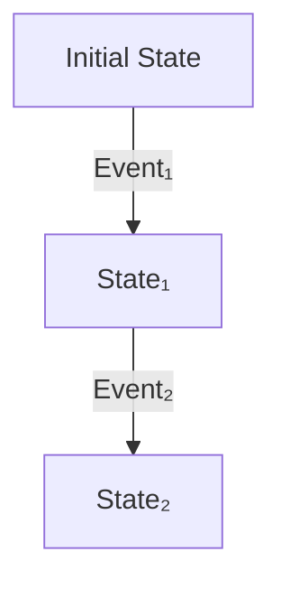

즉:

```text
Memento:
    State 저장

Event Sourcing:
    State Transition 저장
```

입니다.

실제 Event Sourcing 시스템에서는 재생 비용을 줄이기 위해 일정 시점의 Snapshot을 함께 저장할 수도 있으며, 이 Snapshot은 Memento와 유사한 역할을 할 수 있습니다.

---

## 4. 파이썬 오픈소스에서 볼 수 있는 메멘토와 유사한 설계

Python 표준 라이브러리에도 현재 내부 상태를 별도의 값으로 캡처한 뒤 나중에 해당 값으로 이전 상태를 복원하는 구조가 존재합니다.

다만 아래 사례들이 GoF Memento 패턴의 클래스 구조를 그대로 구현한다는 뜻은 아니며, **Snapshot / Restore라는 핵심 아이디어와 유사한 사례**로 이해하는 것이 적절합니다.

### `random.getstate()` / `random.setstate()`

Python의 `random` 모듈은 현재 의사 난수 생성기의 내부 상태를 `getstate()`로 캡처할 수 있으며, 해당 객체를 나중에 `setstate()`에 전달하면 난수 생성기를 그 시점의 상태로 복원할 수 있습니다.

```python
import random

state = random.getstate()
first = random.random()
second = random.random()
random.setstate(state)
again_first = random.random()
again_second = random.random()
assert first == again_first
assert second == again_second
```

구조는 다음과 같습니다.

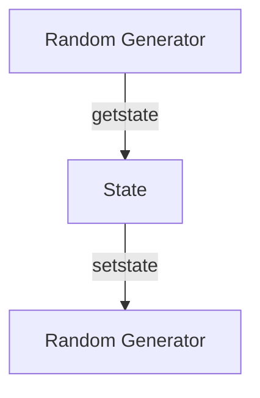

호출자는 난수 생성기의 내부 알고리즘이나 정확한 상태 표현을 알 필요가 없습니다.

```text
Caretaker:
    state 객체만 보관

Originator:
    getstate()
    setstate()
```

라는 점에서 Memento의 핵심 구조와 상당히 직접적으로 대응합니다.

---

### `contextvars.Token`

`ContextVar.set(value)`는 값을 변경하면서 이전 값을 복원하는 데 사용할 수 있는 `Token` 객체를 반환합니다. 이후 `ContextVar.reset(token)`을 호출하면 해당 `set()` 이전의 값으로 되돌릴 수 있습니다.

```python
from contextvars import ContextVar

current_user = ContextVar("current_user", default="guest")
token = current_user.set("aragorn")
print(current_user.get())
# aragorn
current_user.reset(token)
print(current_user.get())
# guest
```

개념적으로:

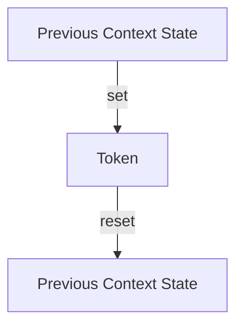

입니다.

특히 `Token`은 이전 값을 외부에 직접 조작하게 하기보다 복원에 필요한 상태를 캡슐화한 Handle 역할을 한다는 점에서 Memento와 유사합니다.

---

### `decimal.localcontext()`

`decimal.localcontext()`는 현재 Decimal Context의 복사본을 사용하도록 일시적으로 환경을 변경하고 `with` 블록을 빠져나갈 때 이전 Context를 자동으로 복원합니다.

```python
from decimal import Decimal, localcontext

with localcontext() as context:
    context.prec = 50
    value = Decimal(1) / Decimal(7)
# 여기서는 이전 Decimal Context가 복원됨
```

구조적으로:

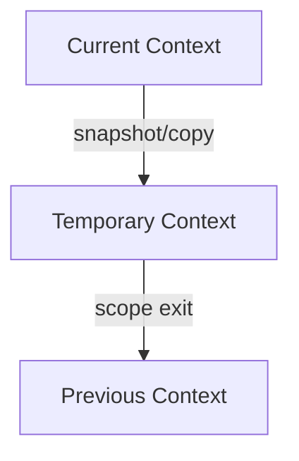

라는 Snapshot / Restore 구조를 가집니다.

전형적인 Memento 객체를 직접 노출하는 API는 아니지만, 특정 상태를 일시적으로 변경한 뒤 이전 상태를 정확하게 복원한다는 점에서 Scope 기반 Memento와 유사한 사례로 볼 수 있습니다.

---

## 5. 클래스 다이어그램

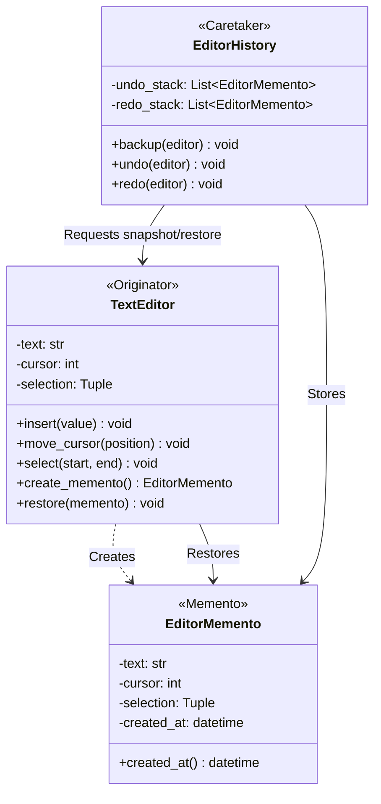

각 역할은 다음과 같습니다.

```text
Originator
    TextEditor

Memento
    EditorMemento

Caretaker
    EditorHistory

Client
    편집 작업을 수행하면서
    History에 Snapshot을 요청하는 코드
```

핵심 관계는 다음과 같습니다.

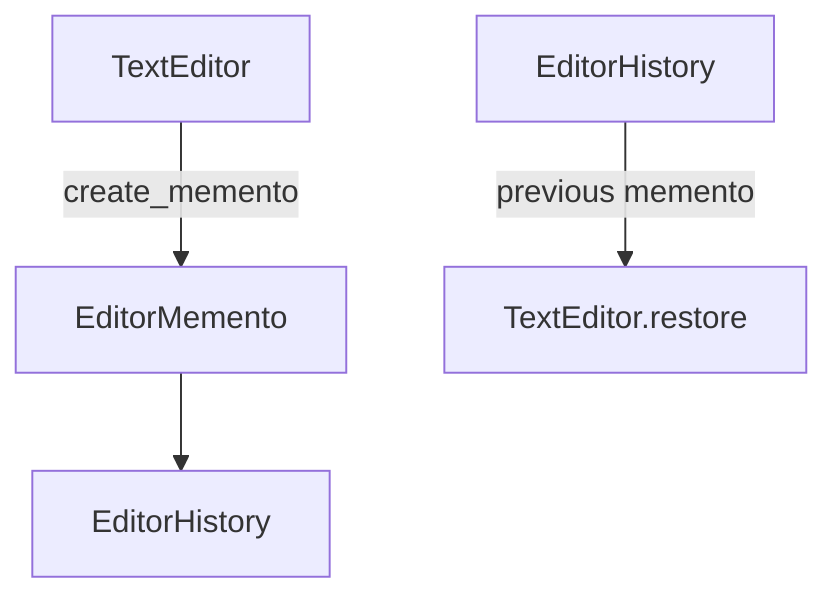

---

## 6. 파이썬 예제 코드

```python
from dataclasses import dataclass
from datetime import datetime, timezone


# -------------------------------------------------------------------
# 1. Memento
# -------------------------------------------------------------------
@dataclass(frozen=True)
class EditorMemento:
    _text: str
    _cursor: int
    _selection: tuple[int, int] | None
    created_at: datetime


# -------------------------------------------------------------------
# 2. Originator
# -------------------------------------------------------------------
class TextEditor:
    def __init__(self):
        self._text = ""
        self._cursor = 0
        self._selection: tuple[int, int] | None = None

    @property
    def text(self) -> str:
        return self._text

    @property
    def cursor(self) -> int:
        return self._cursor

    def insert(self, value: str) -> None:
        self._text = self._text[: self._cursor] + value + self._text[self._cursor :]
        self._cursor += len(value)
        self._selection = None

    def move_cursor(self, position: int) -> None:
        if not (0 <= position <= len(self._text)):
            raise ValueError("잘못된 커서 위치입니다.")
        self._cursor = position
        self._selection = None

    def select(self, start: int, end: int) -> None:
        self._selection = (start, end)

    def create_memento(self) -> EditorMemento:
        return EditorMemento(
            _text=self._text,
            _cursor=self._cursor,
            _selection=self._selection,
            created_at=datetime.now(timezone.utc),
        )

    def restore(self, memento: EditorMemento) -> None:
        self._text = memento._text
        self._cursor = memento._cursor
        self._selection = memento._selection

    def show(self) -> None:
        print(
            f"text={self._text!r}, "
            f"cursor={self._cursor}, "
            f"selection={self._selection}"
        )


# -------------------------------------------------------------------
# 3. Caretaker
# -------------------------------------------------------------------
class EditorHistory:
    def __init__(self):
        self._undo_stack: list[EditorMemento] = []
        self._redo_stack: list[EditorMemento] = []

    def backup(self, editor: TextEditor) -> None:
        self._undo_stack.append(editor.create_memento())
        # 새로운 변경이 시작되면
        # 기존 Redo history는 무효화
        self._redo_stack.clear()

    def undo(self, editor: TextEditor) -> None:
        if not self._undo_stack:
            return
        # 현재 상태는 Redo용으로 저장
        self._redo_stack.append(editor.create_memento())
        previous = self._undo_stack.pop()
        editor.restore(previous)

    def redo(self, editor: TextEditor) -> None:
        if not self._redo_stack:
            return
        # 현재 상태는 다시 Undo용으로 저장
        self._undo_stack.append(editor.create_memento())
        next_state = self._redo_stack.pop()
        editor.restore(next_state)


# -------------------------------------------------------------------
# 4. 실행 (Usage)
# -------------------------------------------------------------------
if __name__ == "__main__":
    editor = TextEditor()
    history = EditorHistory()
    history.backup(editor)
    editor.insert("Hello")
    editor.show()
    # text='Hello', cursor=5
    history.backup(editor)
    editor.insert(" World")
    editor.show()
    # text='Hello World', cursor=11
    history.backup(editor)
    editor.move_cursor(5)
    editor.insert(",")
    editor.show()
    # text='Hello, World'
    print("\n=== Undo ===")
    history.undo(editor)
    editor.show()
    # Hello World
    history.undo(editor)
    editor.show()
    # Hello
    print("\n=== Redo ===")
    history.redo(editor)
    editor.show()
    # Hello World
```

Caretaker는 다음 코드를 사용합니다.

```python
editor.create_memento()
```

그리고:

```python
editor.restore(memento)
```

만 호출합니다.

다음과 같은 코드는 존재하지 않습니다.

```python
history.text = editor._text
history.cursor = editor._cursor
```

즉 History는 상태의 내용이 아니라 상태의 Snapshot만 관리합니다.

### Memento를 불변으로 만드는 이유

예제에서는 다음과 같이 정의했습니다.

```python
@dataclass(frozen=True)
class EditorMemento: ...
```

Snapshot이 생성된 이후 변경 가능하다면:

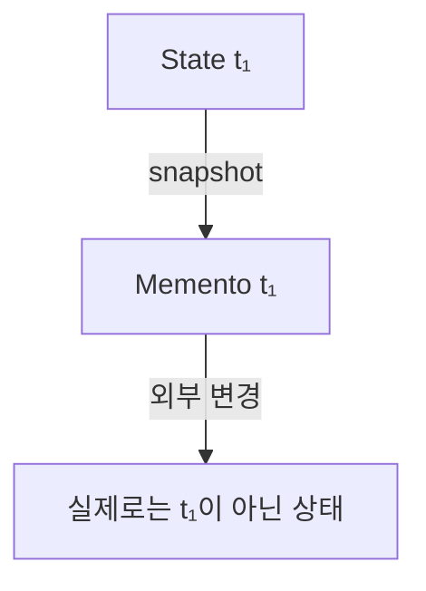

가 되어 History의 의미가 깨질 수 있기 때문입니다.

따라서 Memento는 일반적으로 생성된 순간의 상태를 보존하는 불변 값으로 만드는 것이 안전합니다.

상태 안에 `list`, `dict`와 같은 가변 객체가 포함되어 있다면 단순히 `frozen=True`만으로 충분하지 않을 수 있으므로 복사 정책까지 고려해야 합니다.

---

## 부록 (Appendix): 현대적 타입 시스템과 함수형 관점의 재해석

메멘토 패턴을 현대 타입 시스템과 함수형 프로그래밍 관점에서 재해석하면, Memento가 해결하려는 문제 중 상당 부분이 **가변 객체가 시간에 따라 자신의 상태를 덮어쓴다는 데이터 모델**에서 발생한다는 사실을 볼 수 있습니다.

### 고전적 구조 대 추상화된 구조

```text
[고전적 구조]
Mutable Originator (State₀) ──(Mutation)──> State₁ ──(Mutation)──> State₂
                                 │                      │
                          Memento 생성            Memento 생성

[추상화된 구조]
시간축 위의 상태 모델링: State × Time
  - 불변 상태: State₀, State₁, State₂ 가 영속적 값(Value)으로 존재
  - 델타 모델: State₀ + Patch₁ + Patch₂ ...
  - 이벤트 모델: Initial + Event₁ + Event₂ ...
```

> **핵심 질문**
> *"시간의 흐름에 따른 과거 상태를 캡슐화된 상태 복사 객체로 다룰 것인가, 아니면 **불변 값, 영속적 구조, 타입 제약, 델타 및 이벤트 전이**로 모델링할 것인가?"*

아래 예제는 이해를 돕기 위해 **불변 데이터, 영속적 자료구조(Persistent Data Structure), Typed Snapshot, Phantom/Generative Type, Linear Type, Patch/Delta, State Transition, Transaction 및 Versioned State를 지원하는 가상의 Python 문법**을 가정하여 작성되었습니다. *(아래 코드는 실제 Python 문법이 아닙니다.)*

---

### 1. 상태 자체를 불변 값으로 표현하기

텍스트 편집기의 전체 상태를 하나의 불변 값으로 정의합니다.

```text
immutable record EditorState:
    text: Rope
    cursor: Int
    selection: Option[Range]

# 초기 상태
state0 = EditorState(text=Rope.empty(), cursor=0, selection=None)

# 텍스트 삽입 함수는 기존 상태를 변경하지 않고 새 상태를 반환
def insert(state: EditorState, value: str) -> EditorState:
    return state with {
        text = state.text.insert(state.cursor, value),
        cursor = state.cursor + len(value),
        selection = None,
    }

state1 = insert(state0, "Hello")
state2 = insert(state1, " World")
```

가변 객체와 달리 `state0`, `state1`, `state2`가 모두 메모리 상에 안전한 과거 값으로 존재하게 됩니다.

---

### 2. 불변 상태에서는 Memento가 단순히 이전 값이다

`EditorState` 자체가 불변 값이면 Memento라는 별도의 Wrapping 객체 없이 상태 값 그 자체가 Snapshot이 됩니다.

```text
[고전적 방식]  Originator State ──(Copy)──> Memento
[함수형 방식]  Memento<State>   ≈   State (값 자체)
```

History 역시 이전 값들의 리스트로 관리될 수 있습니다.

```python
history = [state0, state1, state2]
current = history.previous()
```

---

### 3. 영속적 자료구조를 통한 구조적 공유 (Structural Sharing)

불변 상태를 계속 저장하더라도 영속적 자료구조(Persistent Data Structure)를 사용하면 변경되지 않은 내부 구조를 공유하므로 메모리가 폭발적으로 증가하지 않습니다.

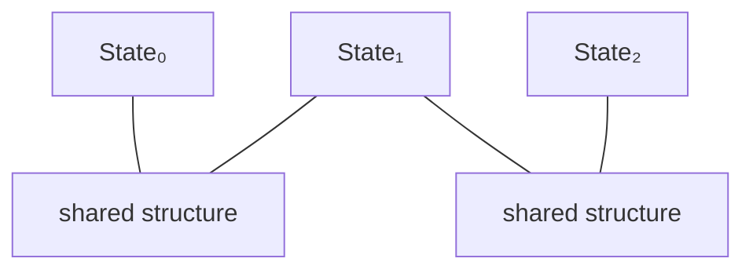

> **Full Snapshot Semantics** + **Structural Sharing**을 동시에 얻을 수 있습니다.

---

### 4. Memento를 특정 Originator와 타입 수준에서 결합하기

잘못된 Originator에 타 객체의 Memento가 전달되는 실수를 타입 시스템(Opaque Type 및 Type Parameter)으로 방지합니다.

```text
opaque type Memento[Owner, State]

EditorMemento = Memento[TextEditor, EditorState]
GameMemento   = Memento[GameEngine, GameState]

def restore[O, S](originator: O, memento: Memento[O, S]) -> O:
    ...

# 타입 오류 발생
restore(editor, game_snapshot)
```

---

### 5. 인스턴스별 Memento 식별 (Generative Type)

클래스 타입이 같더라도 서로 다른 객체 인스턴스 간 Memento 오용을 Generative Type으로 차단합니다.

```text
owner EditorA
owner EditorB

editor_a: Editor[EditorA]
snapshot_a: Snapshot[EditorA]

# 인스턴스 타입 불일치로 타입 오류
restore(editor_b, snapshot_a)
```

---

### 6. Snapshot의 Schema Version 타입화

장기간 보관되는 Memento의 버전 호환성 문제를 타입 전이 함수(Migration)로 명시화합니다.

```python
def restore(snapshot: Snapshot[Editor, V2]) -> Editor: ...
def migrate(snapshot: Snapshot[Editor, V1]) -> Snapshot[Editor, V2]:
    # v1 -> v2 변환 로직
    ...
```

---

### 7. Linear Type을 통한 일회성 Restore Token

한 번만 사용해야 하는 복원 Token은 Linear Type으로 선언하여 중복 소비를 컴파일 타임에 차단합니다.

```text
linear type RestoreToken[T]

def restore[T](token: RestoreToken[T]) -> T: ...

restore(token)
restore(token) # Type Error: RestoreToken has already been consumed.
```

---

### 8. 전체 Snapshot 대신 Delta(Patch) 저장

상태가 거대할 경우 전체 Snapshot 대신 가역적 변환(Patch)만 저장하여 Memento를 경량화합니다.

```text
data EditorPatch =
    Insert(position: Int, text: str)
  | Delete(position: Int, text: str)
  | MoveCursor(from: Int, to: Int)

def apply(state: EditorState, patch: EditorPatch) -> EditorState: ...
```

---

### 9. Checkpoint + Delta 혼합 전략

복원 속도와 메모리 사용량의 Trade-off를 맞추기 위해 일정 간격마다 Checkpoint Snapshot을 두고 사이사이에 Delta를 적용합니다.

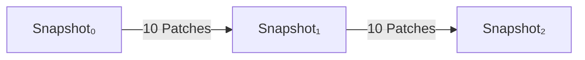

---

### 10. 가역 Patch와 역함수를 이용한 Undo

Patch가 가역적(Reversible)이라면 역연산을 통해 이전 상태로 되돌립니다.

```text
trait Reversible[P]:
    def inverse(patch: P) -> P

# Undo 수행
previous = apply(current, inverse(patch))
```

---

### 11. State Transition Architecture를 통한 자동 History 기록

모든 변경을 순수 함수 전이(`reduce`)로 모델링하면 Memento를 명시적으로 생성하지 않아도 중앙 아키텍처가 전이 이전 상태를 자동 추적합니다.

```python
def dispatch(
    history: History[EditorState], action: EditorAction
) -> History[EditorState]:
    next = reduce(history.current, action)
    return history.push(next)
```

---

### 12. Persistent History Stack

History 자체도 불변 구조로 만들어 Undo/Redo 시 안전하게 상태 이력을 관리합니다.

```text
immutable record History[S]:
    past: PersistentStack[S]
    present: S
    future: PersistentStack[S]
```

---

### 13. Zipper를 이용한 Focus 이동

History를 리스트 구조 대신 초점(Focus)을 이동시키는 Zipper 자료구조로 표현합니다.

```text
Undo 전:  Past [S₀, S₁]  |  Present S₂  |  Future [S₃, S₄]
Undo 후:  Past [S₀]      |  Present S₁  |  Future [S₂, S₃, S₄]
```

---

### 14. Transaction Rollback의 일반화

여러 작업을 묶어 실패 시 이전 상태로 되돌리는 Transaction 경계를 Memento 개념으로 일반화합니다.

```python
snapshot = begin_transaction(state)
match execute_changes():
    case Ok:
        commit(snapshot)
    case Err:
        state = rollback(snapshot)
```

---

### 15. 영속적 상태에서의 포인터 복원

불변 상태 모델에서는 Rollback이 대규모 데이터 복사 없이 포인터 변경만으로 매우 저렴하게 수행됩니다.

```python
# 단순히 이전 불변 상태 포인터 지정
current = state0
```

---

### 16. Event Sourcing과 원인 보존

Memento가 "결과 상태"만 저장한다면, Event Sourcing은 "변화의 원인(Event)"을 저장합니다.

```python
state = fold(events, initial_state, evolve)
```

---

### 17. Event Sourcing에서의 Snapshot 최적화

수많은 이벤트를 매번 재실행하는 비효율을 막기 위해 중간 지점에 Memento(Snapshot)를 도입합니다.

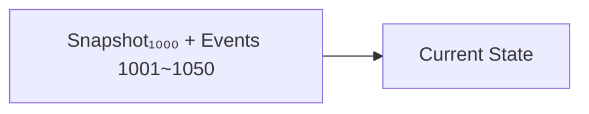

---

### 18. 외부 자원의 복원 한계 분리

소켓, 파일 핸들 등 단순 값으로 캡처 불가능한 자원(Runtime Resources)은 Pure State와 분리하여 보상 트랜잭션 정책을 적용합니다.

```text
immutable record PureState:
    text: str
    cursor: Int

linear resource RuntimeResources:
    socket: Socket
```

---

### 19. Typeclass를 통한 Snapshotable 제약 표현

복원 가능성 능력을 타입 제약으로 선언하여 Snapshot이 불가능한 객체의 저장을 금지합니다.

```text
trait Snapshotable[T]:
    type Snapshot
    def snapshot(value: T) -> Snapshot
    def restore(snapshot: Snapshot) -> T
```

---

### 20. Opaque Type 기반의 강한 캡슐화

Snapshot 내부 구조를 외부에 완전히 은닉하여 컴파일러 수준에서 Memento 캡슐화를 강제합니다.

```text
opaque type EditorSnapshot

# snapshot.text 접근 시 컴파일 에러 발생
# 오직 editor.restore(snapshot) 형태로만 사용 가능
```

---

### 21. 시간축 위의 값 (Values over Time)

메멘토 패턴의 본질은 객체를 다루는 시각을 단일 시점에서 시간축 위의 값($State \times Time$)으로 확장하는 것입니다.

```mermaid
flowchart LR
    t0[t₀] --> s0[State₀]
    t1[t₁] --> s1[State₁]
    t2[t₂] --> s2[State₂]
```

* **OOP**: 캡슐화된 Memento 객체
* **Functional**: 영속적 불변 값 (Persistent Values)
* **Delta Model**: Patches / Reversible Operations
* **Transaction**: Checkpoint / Rollback Boundary

---

### 요약 및 비교

| 관점 | 메멘토 패턴 (OOP 아키텍처) | 현대 타입 시스템 + 함수형 관점 |
| --- | --- | --- |
| **현재 상태** | 가변 Originator 내부 | **불변 State 값** |
| **과거 상태 저장** | Memento 생성 | **이전 State 자체 보관** |
| **Snapshot 생성** | `create_memento()` | **값 참조 / Persistent Value** |
| **복원** | `restore(memento)` | **이전 State 선택** |
| **History** | `List[Memento]` | **Persistent History / Zipper** |
| **Snapshot 복사 비용** | Deep Copy 가능성 | **Structural Sharing** |
| **캡슐화** | Memento 내부 상태 은닉 | **Opaque Snapshot Type** |
| **Originator 연결** | 런타임 규약 | **`Memento[Owner]`** |
| **인스턴스 연결** | 일반적으로 약함 | **Generative Owner Type** |
| **Schema Version** | 구현에서 처리 | **Version-indexed Snapshot** |
| **일회성 복원** | 런타임 검사 | **Linear Restore Token** |
| **전체 Snapshot** | Memento | **Immutable State** |
| **변경분 저장** | 별도 구현 | **Patch / Delta** |
| **가역 변경** | `undo()` 등 | **Reversible Patch** |
| **Transaction** | Snapshot 후 복원 | **Persistent State Rollback** |
| **변화 원인 기록** | 보통 없음 | **Event Sourcing** |
| **Event 재생 최적화** | 별개 | **Snapshot + Event** |
| **복원 가능성** | 객체 구현 규약 | **`Snapshotable[T]`** |
| **주요 장점** | 캡슐화를 유지한 상태 복원 | **과거 상태를 값·버전·타입으로 직접 모델링** |
| **주요 비용** | Snapshot 저장·복사 비용 | **불변 자료구조·버전 모델 설계 필요** |

---

### 결론

고전적인 Memento 패턴은 Originator의 내부 상태를 캡슐화를 깨뜨리지 않는 별도의 Memento로 저장하고, Caretaker가 Memento의 내부 표현을 알지 않은 채 이를 보관하다가 필요할 때 Originator에게 다시 전달하여 이전 상태를 복원하는 행위 패턴입니다.

객체지향에서는:

```mermaid
flowchart TD
    originator[Originator] -->|snapshot| memento[Memento]
    memento -->|보관| caretaker[Caretaker]
```

라는 구조로 표현합니다.

복원은:

```mermaid
flowchart TD
    caretaker[Caretaker] -->|Memento 전달| originator[Originator]
    originator -->|restore| previous[Previous state]
```

가 됩니다.

Command가 "무엇을 했는가?"를 저장한다면 Memento는 "그때 상태가 무엇이었는가?"를 저장합니다.

현대 타입 시스템과 함수형 패러다임에서는 이 개념을 더욱 일반적인 시간에 따른 상태의 값 모델링으로 확장할 수 있습니다.

* Mutable Originator State $\leftrightarrow$ Immutable State
* Memento $\leftrightarrow$ 이전 State Value
* Snapshot 복사 $\leftrightarrow$ Structural Sharing
* Caretaker History $\leftrightarrow$ Persistent History
* Undo/Redo Stack $\leftrightarrow$ Zipper
* private Memento $\leftrightarrow$ Opaque Snapshot
* Originator 전용 Memento $\leftrightarrow$ Owner-indexed Snapshot
* 일회성 Restore Token $\leftrightarrow$ Linear Type
* Full Snapshot $\leftrightarrow$ Persistent State
* Delta Memento $\leftrightarrow$ Patch
* 상태 기반 Undo $\leftrightarrow$ State Selection
* 변경 기반 Undo $\leftrightarrow$ Inverse Patch
* Rollback $\leftrightarrow$ Transactional Snapshot
* 전체 변화 기록 $\leftrightarrow$ Event Sourcing
* 긴 Event Stream의 최적화 $\leftrightarrow$ Snapshot Checkpoint

메멘토의 핵심은 객체의 내부 표현을 외부에 공개하지 않으면서 특정 시점의 복원 가능한 상태를 값으로 보존하고, 그 값의 보관 책임과 복원 책임을 분리하는 데 있습니다.
