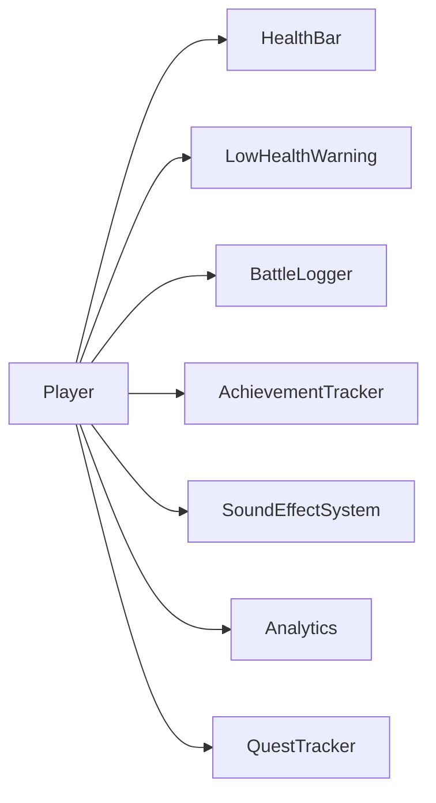
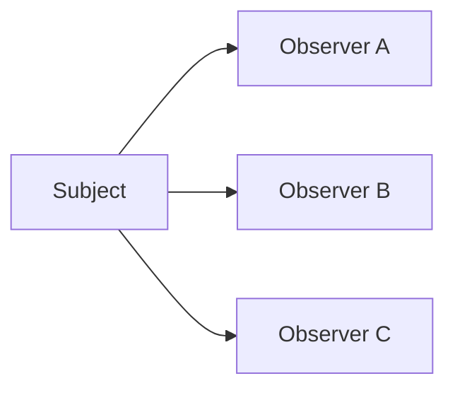
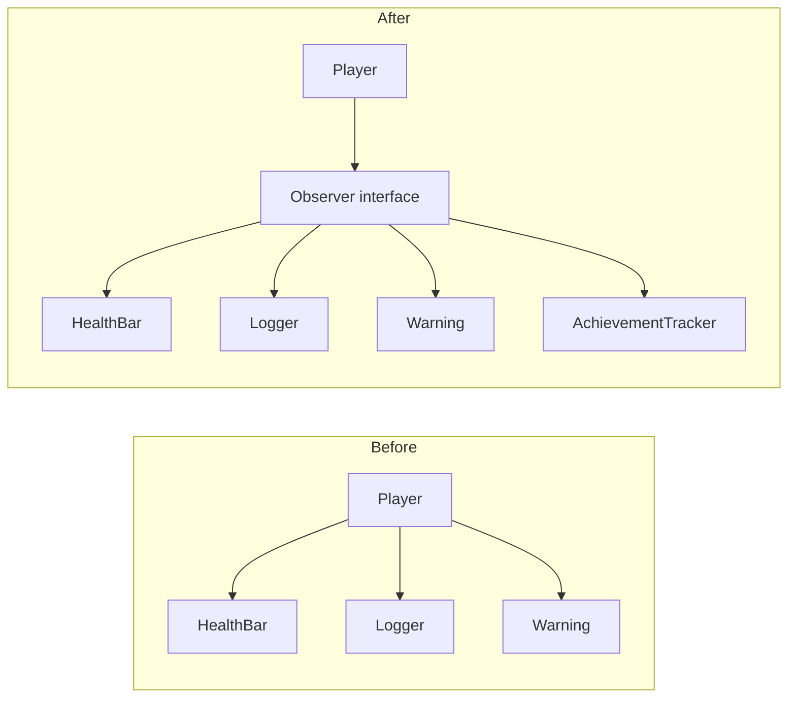
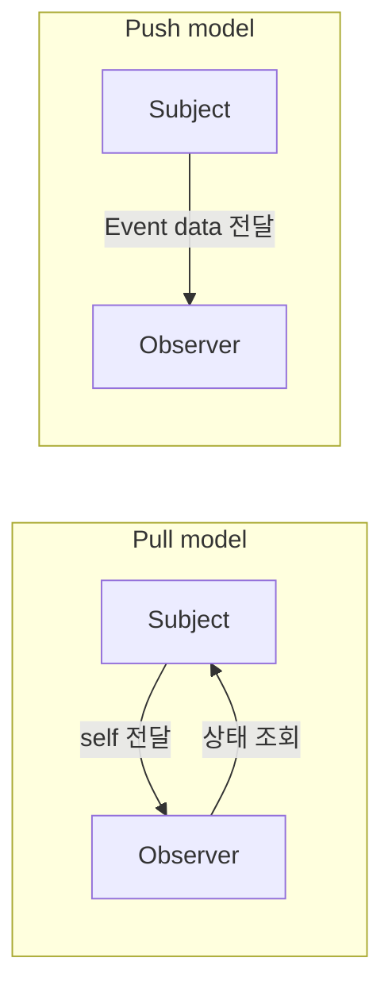
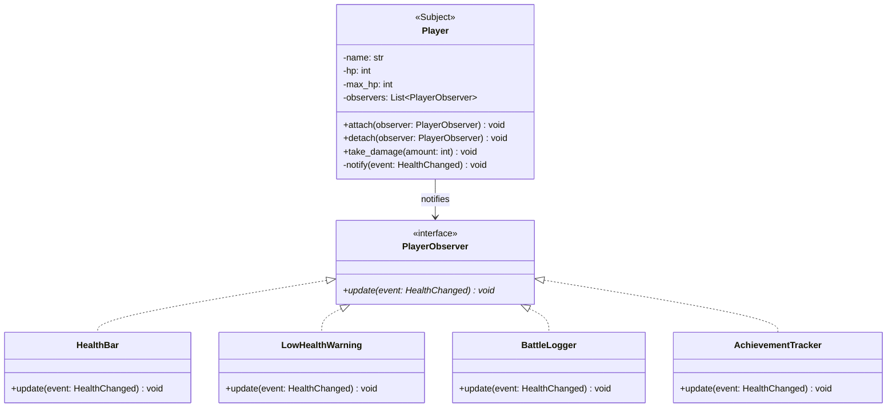
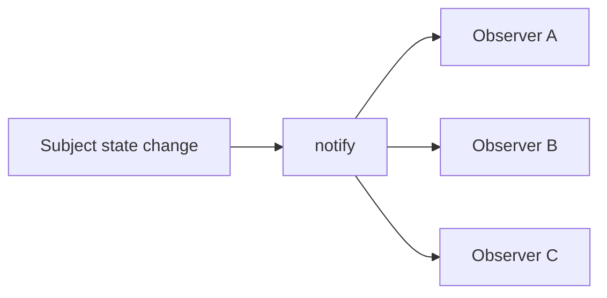

# 옵저버 패턴 (Observer Pattern)


## 1. 패턴이 없을 때 발생하는 문제점 (The Problem)

옵저버 패턴을 사용하지 않고 한 객체의 상태 변화에 반응해야 하는 여러 객체를 직접 연결하면, 상태를 가진 객체가 자신을 사용하는 모든 객체의 구체적인 타입과 동작을 알아야 하는 문제가 발생할 수 있습니다.

예를 들어 게임에서 플레이어의 HP가 변경될 때 다음 객체들이 각각 반응해야 한다고 가정합니다.

```text
HealthBar
LowHealthWarning
BattleLogger
AchievementTracker

```

### 패턴을 적용하지 않은 예시

```python
class HealthBar:

    def update(
        self,
        hp: int,
        max_hp: int,
    ) -> None:

        print(
            f"[UI] HP: {hp}/{max_hp}"
        )


class LowHealthWarning:

    def update(
        self,
        hp: int,
        max_hp: int,
    ) -> None:

        if hp <= max_hp * 0.2:
            print(
                "[Warning] 체력이 위험합니다!"
            )


class BattleLogger:

    def log_hp_changed(
        self,
        hp: int,
    ) -> None:

        print(
            f"[Log] HP 변경: {hp}"
        )


class Player:

    def __init__(
        self,
        max_hp: int,
        health_bar: HealthBar,
        warning: LowHealthWarning,
        logger: BattleLogger,
    ):
        self.max_hp = max_hp
        self.hp = max_hp

        self.health_bar = health_bar
        self.warning = warning
        self.logger = logger

    def take_damage(
        self,
        amount: int,
    ) -> None:

        self.hp = max(
            0,
            self.hp - amount,
        )

        # 문제점:
        # 상태를 가진 객체가
        # 모든 반응 객체를 직접 알고 있음
        self.health_bar.update(
            self.hp,
            self.max_hp,
        )

        self.warning.update(
            self.hp,
            self.max_hp,
        )

        self.logger.log_hp_changed(
            self.hp
        )

```

이제 새로운 기능으로 `AchievementTracker`를 추가한다고 가정합니다.

```python
class AchievementTracker:

    def check(
        self,
        hp: int,
        max_hp: int,
    ) -> None:

        if hp == 1:
            print(
                "[Achievement] "
                "기적의 생존!"
            )

```

단순히 새로운 객체를 추가하는 것만으로 끝나지 않습니다. `Player`도 수정해야 합니다.

```python
class Player:
    def __init__(
        self,
        achievement_tracker: AchievementTracker,
    ) -> None:
        self.achievement_tracker = achievement_tracker

```

상태 변경 코드에도 새로운 호출이 추가됩니다.

```python
self.achievement_tracker.check(
    self.hp,
    self.max_hp,
)

```

추가 기능이 계속 늘어나면 `Player`가 점점 더 많은 외부 객체를 알아야 합니다.



특히 일부 기능만 특정 화면에서 필요하다면 `Player` 생성 과정도 복잡해질 수 있습니다.

### 이 방식이 가진 단점

* **Subject와 반응 객체의 강한 결합:** 상태를 가진 객체가 모든 외부 객체의 구체 타입과 메서드를 알아야 합니다.
* **OCP(개방-폐쇄 원칙) 위반:** 새로운 반응 객체를 추가할 때 Subject의 상태 변경 코드를 수정해야 할 수 있습니다.
* **알림 로직의 분산:** 어떤 상태 변화가 누구에게 전달되는지가 Subject 내부에 하드코딩됩니다.
* **재사용성 감소:** `Player`가 특정 UI나 Logger에 의존하면 다른 환경에서 재사용하기 어려워집니다.
* **선택적 구독의 어려움:** 실행 중 Observer를 추가하거나 제거하려면 Subject의 구조까지 변경해야 할 수 있습니다.

---

## 2. 옵저버 패턴으로 해결하기 (The Solution)

옵저버 패턴은 "하나의 Subject가 자신의 상태 변화를 구독하고 있는 여러 Observer에게 자동으로 알리되, Subject는 Observer의 구체적인 구현을 알지 않도록 만드는 방식"으로 이 문제를 해결합니다.

일반적인 구조는 다음과 같습니다.



먼저 Observer 인터페이스를 정의합니다.

```python
from abc import ABC, abstractmethod


class PlayerObserver(ABC):

    @abstractmethod
    def update(
        self,
        player: "Player",
    ) -> None:
        pass

```

Subject는 Observer 인터페이스만 알고 있습니다.

```python
class Player:

    def __init__(
        self,
        max_hp: int,
    ):
        self.max_hp = max_hp
        self.hp = max_hp

        self._observers: list[
            PlayerObserver
        ] = []

    def attach(
        self,
        observer: PlayerObserver,
    ) -> None:

        self._observers.append(
            observer
        )

    def detach(
        self,
        observer: PlayerObserver,
    ) -> None:

        self._observers.remove(
            observer
        )

    def _notify(self) -> None:

        for observer in self._observers:
            observer.update(
                self
            )

```

상태가 변경되면 Observer들에게 알리기만 합니다.

```python
def take_damage(
    self,
    amount: int,
) -> None:

    self.hp = max(
        0,
        self.hp - amount,
    )

    self._notify()

```

Subject는 구체적으로 누가 알림을 받고 있는지 알 필요가 없습니다.

```text
Player
   │
   └─ knows only: PlayerObserver

```

HealthBar는 Observer가 됩니다.

```python
class HealthBar(
    PlayerObserver
):

    def update(
        self,
        player: Player,
    ) -> None:

        print(
            f"[UI] "
            f"HP: {player.hp}/{player.max_hp}"
        )

```

Warning도 같은 인터페이스를 구현합니다.

```python
class LowHealthWarning(
    PlayerObserver
):

    def update(
        self,
        player: Player,
    ) -> None:

        if (
            player.hp
            <= player.max_hp * 0.2
        ):
            print(
                "[Warning] "
                "체력이 위험합니다!"
            )

```

클라이언트가 필요한 Observer만 등록합니다.

```python
player = Player(
    max_hp=100
)

player.attach(
    HealthBar()
)

player.attach(
    LowHealthWarning()
)

```

나중에 Observer를 추가할 수도 있습니다.

```python
player.attach(
    BattleLogger()
)

```

또는 더 이상 필요하지 않은 Observer를 제거할 수도 있습니다.

```python
player.detach(
    health_bar
)

```

새로운 Observer를 추가해도 `Player.take_damage()`는 변경되지 않습니다.



핵심은 단순히 callback list를 만드는 것에 있지 않습니다.

**상태 변화의 발생 주체와 그 변화에 반응하는 객체들을 느슨하게 결합하고, 구독 관계를 동적으로 구성하여 하나의 상태 변화가 여러 독립적인 객체에 전파되도록 만드는 것**이 옵저버 패턴의 본질입니다.

---

## 3. 장점, 단점 및 트레이드오프 (Trade-off)

### 장점 (Pros)

* **Subject와 Observer의 결합도 감소:** Subject는 구체 Observer가 아닌 공통 인터페이스에만 의존합니다.
* **동적인 구독 관리:** 실행 중 Observer를 추가하거나 제거할 수 있습니다.
* **1:N 알림 구조:** 하나의 상태 변경을 여러 객체에 자연스럽게 전달할 수 있습니다.
* **OCP 적용:** Subject를 수정하지 않고 새로운 Observer를 추가할 수 있습니다.
* **관심사의 분리:** UI 업데이트, 로그 기록, 분석, 알림 등을 Subject의 핵심 책임에서 분리할 수 있습니다.
* **이벤트 중심 시스템에 적합:** 상태 변화에 따라 여러 독립 기능이 반응하는 구조를 표현하기 좋습니다.

### 단점 (Cons)

* **알림 흐름이 암묵적:** Subject의 메서드 호출만 보고 실제로 어떤 Observer들이 실행되는지 알기 어려울 수 있습니다.
* **실행 순서 의존 가능성:** Observer 등록 순서에 따라 결과가 달라지는 구조를 만들면 유지보수가 어려워집니다.
* **연쇄적인 상태 변경 위험:** Observer가 다시 Subject의 상태를 변경하여 새로운 알림을 발생시키면 복잡한 재귀 알림이 생길 수 있습니다.
* **구독 해제 누락:** Subject가 Observer를 강하게 참조하면 더 이상 필요하지 않은 Observer가 메모리에서 해제되지 않을 수 있습니다(Memory Leak).
* **느린 Observer의 영향:** 동기식 알림에서는 하나의 느린 Observer가 전체 `notify()` 호출을 지연시킬 수 있습니다.
* **예외 전파 정책 필요:** 하나의 Observer가 예외를 발생시켰을 때 이후 Observer까지 알림을 계속할지 결정해야 합니다.

### 트레이드오프 (Trade-off)

* **반응 객체가 여러 개일수록 유리:** 하나의 상태 변화에 UI, 로그, 분석 등 여러 기능이 동시에 관심을 가지는 문제에 적합합니다.
* **수신자가 하나로 고정되어 있다면 직접 호출이 더 명확할 수 있음:** 느슨한 결합 자체가 필요하지 않은 경우 Observer가 오히려 흐름을 숨길 수 있습니다.
* **알림 순서에 의존하지 않는 설계가 좋음:** Observer끼리 실행 순서를 전제로 하기 시작하면 다시 강한 암묵적 결합이 생깁니다.
* **Observer가 Subject를 수정하는 것을 주의해야 함:** Notification 도중 구독 목록이나 상태가 변경되면 재진입(Reentrancy) 문제를 고려해야 합니다.
* **Observer가 많고 작업이 무거우면 비동기 전달을 고려:** 동기 Observer와 Event Queue / Message Broker 구조는 서로 다른 성능과 실패 모델을 가집니다.

---

### Push Model과 Pull Model

Observer에게 데이터를 전달하는 방법에는 크게 두 가지가 있습니다.

#### Pull Model

Subject 자신을 전달합니다.

```python
observer.update(
    subject
)

```

Observer가 필요한 데이터를 Subject에서 직접 가져옵니다.

```python
def update(
    self,
    player: Player,
) -> None:

    hp = player.hp

```

장점은 Subject가 어떤 데이터를 Observer가 필요로 하는지 알 필요가 없다는 것입니다. 하지만 Observer가 Subject의 여러 속성에 의존하게 될 수 있습니다.

#### Push Model

변경 데이터를 직접 전달합니다.

```python
observer.update(
    PlayerHealthChanged(
        old_hp=80,
        new_hp=30,
        max_hp=100,
    )
)

```

Observer는 Subject 자체를 알 필요가 없습니다.



현대적인 이벤트 시스템에서는 Push Model이 자주 사용됩니다.

---

### Observer와 Mediator의 차이

앞서 살펴본 Mediator와 Observer는 모두 직접적인 객체 결합을 줄입니다.

Observer에서는:

```text
Subject
   │
   ├─ Observer A
   ├─ Observer B
   └─ Observer C

```

Subject가 **어떤 변화가 발생했다는 사실을 알리는 것**이 핵심입니다.

Mediator에서는:

```text
Component A ─┐
Component B ─┼──> Mediator
Component C ─┘

```

Mediator가 **여러 객체가 어떤 방식으로 협력해야 하는지를 조정**합니다.

즉:

```text
Observer:  변화의 전파 (Broadcasting)
Mediator:  협력의 조정 (Centralized Interaction)

```

입니다. Mediator 내부에서 Observer나 Event Bus를 사용할 수도 있습니다.

---

### Observer와 Publish/Subscribe의 차이

두 구조 역시 매우 비슷합니다.

전통적인 Observer는 Subject가 Observer 목록을 직접 관리하는 경우가 많습니다.

```text
Subject
   │
   ├─ Observer A
   └─ Observer B

```

Publish/Subscribe에서는 중간에 Broker 또는 Event Bus가 존재할 수 있습니다.

```text
Publisher ───> Event Bus ───┬───> Subscriber A
                            └───> Subscriber B

```

따라서 Publisher와 Subscriber는 서로의 존재뿐 아니라 직접적인 구독 목록조차 모를 수 있습니다.

```text
Observer: Subject와 Observer 사이의 직접적인 구독 관계
Pub/Sub:  Broker / Topic을 통한 간접적인 메시지 관계

```

Pub/Sub는 Observer 아이디어를 보다 분산된 메시징 구조로 확장한 형태로 볼 수 있습니다.

---

### Observer와 Chain of Responsibility의 차이

Observer는 하나의 Event를 **여러 Observer에게 전달**하는 것이 일반적입니다.

```text
Event
  ├─ Observer A
  ├─ Observer B
  └─ Observer C

```

Chain of Responsibility는 일반적으로 요청을 처리할 후보를 순서대로 탐색합니다.

```text
Request ───> Handler A ───(Pass)───> Handler B ───(Handle)───> 처리 완료

```

즉:

```text
Observer: 1 → N Broadcast
Chain:    1 → 후보 순차 탐색 (1개 수신자 처리)

```

이라고 볼 수 있습니다.

---

### Observer와 Event의 차이

Observer는 **객체 사이의 관계 구조**를 설명합니다.

Event는 **무슨 일이 발생했는지를 나타내는 데이터**입니다.

따라서 현대적인 Observer에서는 둘을 함께 사용하는 경우가 많습니다.

```text
Subject ───> Event ───┬───> Observer A
                      └───> Observer B

```

예:

```text
PlayerHealthChanged
OrderPlaced
FileModified

```

Event를 사용하면 Observer가 Subject의 전체 객체에 의존하지 않고 자신에게 필요한 정보만 받을 수 있습니다.

---

## 4. 파이썬 오픈소스에서 볼 수 있는 옵저버와 유사한 설계

파이썬 표준 라이브러리와 주요 프레임워크에서도 **한 주체에서 발생한 상태 변화나 사건에 여러 callback 또는 receiver를 등록하고 자동으로 호출하는 구조**를 찾아볼 수 있습니다.

다만 아래 사례들이 모두 GoF Observer의 클래스 구조를 그대로 구현한다는 뜻은 아니며, **구독 → 상태 변화/사건 → 자동 통지라는 핵심 아이디어를 활용한 사례**로 이해하는 것이 적절합니다.

### Django Signals

Django는 서로 느슨하게 결합된 애플리케이션 구성 요소들이 프레임워크 내 다른 위치에서 발생한 사건을 통지받을 수 있도록 Signal Dispatcher를 제공합니다.

공식 문서는 Signal을 통해 특정 sender가 여러 receiver에게 어떤 동작이 발생했음을 알릴 수 있으며, 여러 코드가 동일한 이벤트에 관심을 가질 때 사용할 수 있다고 설명합니다.

Receiver를 등록합니다.

```python
from django.core.signals import (
    request_finished,
)


def on_request_finished(
    sender,
    **kwargs,
):
    print(
        "요청이 완료되었습니다."
    )


request_finished.connect(
    on_request_finished
)

```

구조는 다음과 같습니다.

```text
Signal
   │
   ├─ Receiver A
   ├─ Receiver B
   └─ Receiver C

```

Signal이 전송되면 등록된 Receiver들이 호출됩니다. Django 문서는 동기 `send()`뿐 아니라 `asend()` 기반 비동기 Signal 전송도 지원하며, Receiver는 기본적으로 등록된 순서에 따라 호출된다고 설명합니다. 또한 Django 자체가 Signal이 코드를 이해하고 디버깅하기 어렵게 만들 수 있으므로 같은 프로젝트 내부에서 명시적 호출이 가능하다면 직접 호출을 고려하라고 경고합니다.

이는 Observer의 장점과 단점을 모두 잘 보여주는 사례입니다.

---

### `asyncio.Future.add_done_callback()`

Python의 `asyncio.Future`는 작업이 완료되었을 때 호출될 callback을 등록할 수 있는 `add_done_callback()`을 제공합니다.

공식 문서에 따르면 Future가 완료되면 등록된 callback에 해당 Future 객체가 전달됩니다. Future가 이미 완료된 상태에서 callback을 추가하면 event loop를 통해 callback이 예약됩니다.

```python
def on_done(
    future,
):
    print(
        "작업 완료:",
        future.result(),
    )


future.add_done_callback(
    on_done
)

```

구조적으로:

```text
Future ───(completed)───> Callbacks ───┬───> Callback A
                                        ├───> Callback B
                                        └───> Callback C

```

라고 볼 수 있습니다.

`concurrent.futures.Future` 역시 `add_done_callback()`을 제공하며, 작업이 완료되거나 취소될 때 callback을 호출합니다.

이는 특정 객체의 상태 전이(completed)에 관심 있는 callback들을 등록하는 Observer와 매우 유사한 구조입니다.

---

### Python `logging.Logger`와 Handler

Python logging에서는 하나의 Logger에 여러 Handler를 연결할 수 있습니다.

Logger에서 생성된 로그 이벤트는 연결된 Handler들로 전달되며, Logger 계층의 propagation을 통해 상위 Logger의 Handler까지 이벤트가 전달될 수도 있습니다. 공식 문서는 Logger가 직접 연결된 Handler 목록을 가지며 `addHandler()` / `removeHandler()`를 통해 이를 변경하고, propagation 설정에 따라 상위 Logger의 Handler들도 이벤트를 받을 수 있다고 설명합니다.

```python
logger.addHandler(
    console_handler
)

logger.addHandler(
    file_handler
)

```

이후:

```python
logger.error(
    "서버 연결 실패"
)

```

가 발생하면 여러 Handler가 같은 LogRecord에 반응할 수 있습니다.

```text
Logger ───> LogRecord ───┬───> ConsoleHandler
                         └───> FileHandler

```

정확히 GoF Observer만으로 설명되는 구조는 아니지만, **하나의 이벤트를 여러 등록된 처리 객체에 전달한다는 점에서 Observer와 유사한 이벤트 통지 구조**를 확인할 수 있습니다.

---

## 5. 클래스 다이어그램



각 역할은 다음과 같습니다.

```text
Subject
    Player

Observer Interface
    PlayerObserver

Concrete Observers
    HealthBar
    LowHealthWarning
    BattleLogger
    AchievementTracker

```

`Player`가 실제로 알고 있는 타입은 `PlayerObserver` 인터페이스 하나뿐입니다.

---

## 6. 파이썬 예제 코드

```python
from abc import ABC, abstractmethod
from dataclasses import dataclass

# -------------------------------------------------------------------
# 1. Event
# -------------------------------------------------------------------

@dataclass(frozen=True)
class HealthChanged:
    old_hp: int
    new_hp: int
    max_hp: int

# -------------------------------------------------------------------
# 2. Observer Interface
# -------------------------------------------------------------------

class PlayerObserver(ABC):
    @abstractmethod
    def update(self, event: HealthChanged) -> None:
        pass

# -------------------------------------------------------------------
# 3. Subject
# -------------------------------------------------------------------

class Player:
    def __init__(self, name: str, max_hp: int):
        self.name = name
        self.max_hp = max_hp
        self.hp = max_hp
        self._observers: list[PlayerObserver] = []

    def attach(self, observer: PlayerObserver) -> None:
        if observer not in self._observers:
            self._observers.append(observer)

    def detach(self, observer: PlayerObserver) -> None:
        if observer in self._observers:
            self._observers.remove(observer)

    def _notify(self, event: HealthChanged) -> None:
        # 알림 도중 attach/detach가 발생해도
        # 현재 순회를 안정적으로 유지하기 위해 복사본 사용
        for observer in tuple(self._observers):
            observer.update(event)

    def take_damage(self, amount: int) -> None:
        old_hp = self.hp
        self.hp = max(0, self.hp - amount)
        event = HealthChanged(old_hp=old_hp, new_hp=self.hp, max_hp=self.max_hp)
        self._notify(event)

# -------------------------------------------------------------------
# 4. Concrete Observer - Health Bar
# -------------------------------------------------------------------

class HealthBar(PlayerObserver):
    def update(self, event: HealthChanged) -> None:
        print("[HealthBar] " f"{event.new_hp}/{event.max_hp}")

# -------------------------------------------------------------------
# 5. Concrete Observer - Warning
# -------------------------------------------------------------------

class LowHealthWarning(PlayerObserver):
    def update(self, event: HealthChanged) -> None:
        ratio = event.new_hp / event.max_hp
        if ratio <= 0.2:
            print("[Warning] " "체력이 위험합니다!")

# -------------------------------------------------------------------
# 6. Concrete Observer - Logger
# -------------------------------------------------------------------

class BattleLogger(PlayerObserver):
    def update(self, event: HealthChanged) -> None:
        print("[BattleLogger] " f"HP: {event.old_hp} " f"-> {event.new_hp}")

# -------------------------------------------------------------------
# 7. Concrete Observer - Achievement
# -------------------------------------------------------------------

class AchievementTracker(PlayerObserver):
    def update(self, event: HealthChanged) -> None:
        if event.new_hp == 1:
            print("[Achievement] " "기적의 생존!")

# -------------------------------------------------------------------
# 8. 실행 (Usage)
# -------------------------------------------------------------------

if __name__ == "__main__":
    player = Player(name="아라곤", max_hp=100)
    health_bar = HealthBar()
    warning = LowHealthWarning()
    logger = BattleLogger()
    achievement = AchievementTracker()
    player.attach(health_bar)
    player.attach(warning)
    player.attach(logger)
    player.attach(achievement)
    player.take_damage(30)
    print()
    player.take_damage(50)
    print()
    player.take_damage(19)
```

마지막 공격 이후 HP가 1이 되면 다음 Observer들이 각각 독립적으로 반응합니다.

```text
Player.take_damage() ───> HealthChanged ───┬───> HealthBar
                                            ├───> LowHealthWarning
                                            ├───> BattleLogger
                                            └───> AchievementTracker

```

`Player`에는 다음과 같은 하드코딩된 호출이 없습니다.

```python
self.health_bar.update(...)
self.logger.log(...)
self.warning.check(...)

```

새로운 Observer를 추가할 때도 `Player`는 변경하지 않습니다.

```python
class SoundEffectObserver(
    PlayerObserver
):

    def update(
        self,
        event: HealthChanged,
    ) -> None:

        if event.new_hp < event.old_hp:
            play_sound(
                "damage.wav"
            )

```

등록만 하면 됩니다.

```python
player.attach(
    SoundEffectObserver()
)

```

---

### 구독 해제와 객체 수명

Observer 구현에서는 구독 해제도 중요합니다.

```python
player.attach(
    health_bar
)

```

Subject가 `health_bar`를 강하게 참조(Strong Reference)하고 있다면 다른 코드에서 `health_bar`를 더 이상 사용하지 않아도 메모리에 계속 남아 있을 수 있습니다.

```text
Player ─────(Strong Reference)─────> HealthBar

```

따라서 Observer의 수명이 Subject보다 짧을 수 있다면 다음 전략을 고려할 수 있습니다.

* 명시적 `detach()` 호출
* 약한 참조(Weak Reference) 활용
* Subscription Token 반환 패턴
* Context Manager (`with` 블록) 기반 구독

특히 장시간 살아 있는 Event Bus나 전역 Subject에서는 구독 해제 정책이 필수적입니다.

---

## 부록 (Appendix): 현대적 타입 시스템과 함수형 관점의 재해석

옵저버 패턴을 현대 타입 시스템과 함수형 프로그래밍 관점에서 재해석하면, Observer가 해결하려는 문제는 단순히 "Subject가 Observer 객체 목록을 가지고 반복문으로 `update()`를 호출하는 것"보다 더 일반적인 형태로 볼 수 있습니다.

고전적인 Observer는 다음 구조를 가집니다.

```text
Subject ───(State Change)───> notify() ───┬───> Observer A
                                           ├───> Observer B
                                           └───> Observer C

```

이를 더 추상적으로 바라보면 다음과 같습니다.

```text
시간에 따라 발생하는 값이나 사건
          ↓
     Event Stream
          ↓
여러 독립적인 Consumer

```

즉 핵심 질문은 다음과 같습니다.

> **"시간에 따라 변화하는 값이나 사건을 하나의 데이터 흐름으로 표현하고, 여러 독립적인 계산이 그 흐름을 타입 안전하게 구독·변환·결합하도록 만들 수는 없는가?"**

이 부록에서는 이를 설명하기 위해 **대수적 데이터 타입(ADT), 일급 함수, Stream/Signal, 함수 합성, FRP, Effect System, Async Stream, Backpressure, Linear Subscription을 지원하는 가상의 Python 문법**을 가정합니다. *(아래 코드는 실제 Python 문법이 아닙니다.)*

### 1. Observer 객체를 단순한 함수로 표현하기

고전적인 Observer는 다음 인터페이스를 가집니다.

```python
class Observer:

    def update(
        self,
        event: Event,
    ) -> None:
        ...

```

하지만 상태를 별도로 가질 필요가 없는 Observer라면 단순한 함수로 표현할 수 있습니다.

```text
type Observer[E] = E -> Unit

```

Health Bar:

```python
def update_health_bar(
    event: HealthChanged,
) -> Unit:
    ...

```

Logger:

```python
def log_health(
    event: HealthChanged,
) -> Unit:
    ...

```

Subject는 함수 목록을 관리합니다.

```text
observers: Vector[HealthChanged -> Unit]

```

알림:

```python
for observer in observers:
    observer(event)

```

객체지향 Observer의 `Observer Interface + Concrete Observer`가 `Event -> Unit`이라는 함수 타입으로 축약됩니다.

---

### 2. Subscription 자체를 값으로 표현하기

일반적인 Observer에서는 `subject.attach(observer)` 후 나중에 `subject.detach(observer)` 해야 합니다.
구독 결과를 명시적인 값으로 반환할 수 있습니다.

```text
opaque linear type Subscription

def subscribe[E](
    source: EventSource[E],
    observer: E -> Unit,
) -> Subscription:
    ...

```

사용:

```python
subscription = subscribe(
    health_events,
    update_health_bar,
)

```

구독 해제:

```python
subscription.cancel()

```

`Subscription`을 선형 타입(Linear Type)으로 만들면 한 번 해제한 구독을 다시 사용할 수 없습니다.

```python
subscription.cancel()
subscription.cancel()  # Type Error: Subscription has already been consumed.

```

구독 수명 주기를 타입 시스템 수준에서 표현한 것입니다.

---

### 3. 문자열 이벤트 대신 Typed Event ADT 사용하기

Event Bus에서 `publish("player.health.changed", payload)`와 같은 문자열 기반 Event를 사용하면 오타와 Payload 불일치 문제가 생깁니다. 대수적 데이터 타입(ADT)을 정의하여 이를 보완할 수 있습니다.

```text
data GameEvent =
    HealthChanged(player: PlayerId, old_hp: Int, new_hp: Int)
  | LevelUp(player: PlayerId, new_level: Int)
  | ItemAcquired(player: PlayerId, item: ItemId)

```

Observer는 Pattern Matching으로 처리합니다.

```python
def observe(
    event: GameEvent,
) -> Unit:

    match event:
        case HealthChanged(player, old_hp, new_hp):
            ...
        case LevelUp(player, level):
            ...

```

Event 이름과 데이터 구조가 하나의 타입으로 엄격히 묶입니다.

---

### 4. Observer 목록을 `EventStream[E]`로 추상화하기

Subject의 callback list를 직접 다루지 않고 `EventStream[E]` 타입을 정의할 수 있습니다.

Player는 HP 변경 Stream을 제공합니다.

```python
player.health_changes: EventStream[HealthChanged]

```

구독:

```python
subscription = player.health_changes.subscribe(update_health_bar)

```

```text
Player State ───(change)───> EventStream[HealthChanged] ───┬───> HealthBar
                                                           ├───> Logger
                                                           └───> Warning

```

고전적인 Subject 내부의 `List[Observer]`가 독립적인 `EventStream[E]` 추상화로 이동합니다.

---

### 5. Event Stream은 변환할 수 있다

Observer 패턴의 중요한 확장은 Event를 받기만 하는 것이 아니라 새로운 Stream으로 변환하는 것입니다.

데미지만 필터링:

```text
damage_events = player.health_changes |> filter(lambda e: e.new_hp < e.old_hp)

```

위험 체력 상태만 필터링:

```text
critical_health = player.health_changes |> filter(lambda e: e.new_hp <= 20)

```

```text
HealthChanged ───(filter)───> Damage Events ───(map)───> Damage Amounts

```

Observer가 단순한 callback 관계에서 **합성 가능한 데이터 흐름**으로 바뀝니다.

---

### 6. 여러 Subject의 변화를 하나의 Stream으로 결합하기

플레이어의 HP와 Mana 상태를 함께 이용하고 싶다고 가정합니다.

```python
hp: EventStream[Int]
mana: EventStream[Int]

```

두 Stream을 합칩니다.

```python
status = combine_latest(hp, mana)

```

이를 UI 상태로 변환합니다.

```text
hud = status |> map(
    lambda state: HUDState(
        hp=state.hp,
        mana=state.mana,
    )
)

```

고전 Observer에서는 여러 Subject의 현재 값을 Observer가 직접 가져와 조합해야 했습니다. FRP에서는 **관계 자체를 Stream 연산으로 선언**할 수 있습니다.

---

### 7. Event와 Signal을 구분하기

Event는 **특정 시점에 발생한 사건**입니다. (`HealthChanged(100 → 80)`)

Signal(또는 Behavior)은 **시간에 따라 변하는 현재 값**을 표현합니다. (`HP(t)`)

```python
player.hp: Signal[Int]
player.hp_changes: Event[HealthChanged]

```

Observer 패턴에서 흔히 섞이는 **현재 상태**와 **상태 변경 사건**을 타입 수준에서 명확히 분리합니다.

---

### 8. Derived State를 Signal 조합으로 표현하기

Signal 기반에서는 파생 상태를 선언적으로 나타냅니다.

```text
health_ratio = player.hp |> map(lambda hp: hp / player.max_hp)
is_critical = health_ratio |> map(lambda ratio: ratio <= 0.2)

```

```text
HP Signal ───(map)───> Health Ratio ───(map)───> Critical?

```

"상태가 변경되었으니 객체를 호출한다"가 아니라 **데이터 사이의 관계를 선언**합니다.

---

### 9. FRP에서는 Observer 객체가 사라질 수 있다

Functional Reactive Programming에서는 다음과 같이 관계만 정의합니다.

```python
health_bar.text = player.hp.map(lambda hp: f"{hp}/{player.max_hp}")
warning.visible = player.hp.map(lambda hp: hp <= 20)

```

더 이상 명시적인 `attach(observer)`나 `observer.update(...)`가 없을 수 있습니다. 대신 **Reactive Dependency Graph**가 Observer 관계를 대신합니다.

```text
            ┌─ HealthBar Text
HP Signal ──┤
            └─ Warning Visible

```

Observer를 **객체 그래프에서 데이터 의존 그래프로 이동**시킨 형태입니다.

---

### 10. Push와 Pull을 결합할 수 있다

고전 Observer는 Push 기반입니다. Iterator는 Pull 기반입니다.

Reactive System에서는 둘을 섞을 수 있습니다.

Event 발생 사실은 Push하고(`state changed`), Observer가 실제 필요한 값만 Pull하거나 전체 상태값을 Push받을 수 있습니다.

---

### 11. 동기 Observer의 의미를 타입에 표현하기

전통적인 `notify()`는 대개 동기식입니다.

```text
Subject.notify() ───> Observer A 실행 ───> Observer B 실행 (5초 소요) ───> Observer C 실행

```

하나의 느린 Observer가 전체 알림을 지연시킬 수 있으므로 동기성 자체가 중요한 설계 사양이 됩니다.

---

### 12. 비동기 Observer를 `Async` 타입으로 표현하기

```text
type AsyncObserver[E] = E -> Async[Unit]

```

알림 정책을 순차 실행(`await observer(event)`) 또는 병렬 실행(`await gather(...)`)으로 선택할 수 있습니다. 단순한 `Observer` 인터페이스를 넘어 **알림 실행 정책**도 명시적인 추상화 대상이 됩니다.

---

### 13. Observer 예외 정책을 ADT로 모델링하기

Observer 하나가 실패했을 때의 처리 정책(Fail Fast, Continue, Retry 등)을 타입으로 모델링합니다.

```text
data NotificationResult[E] =
    AllSucceeded
  | PartialFailure(errors: Vector[E])

```

실패 정책을 숨겨진 구현 세부 사항이 아니라 타입과 API로 명시할 수 있습니다.

---

### 14. 느린 Subscriber가 생기면 Backpressure 문제가 나타난다

이벤트 생성 속도(초당 100만 개)보다 Consumer의 처리 속도(초당 1천 개)가 느릴 경우 Queue overflow로 인한 메모리 고갈이 생길 수 있습니다.

Backpressure 정책(Producer 늦추기, Buffer, Drop, Latest 유지, Batching)이 필요합니다. 비동기 Stream 환경에서는 이러한 처리 정책이 핵심 설계 요소입니다.

---

### 15. 최신 상태만 중요하다면 Event를 모두 보관할 필요가 없다

마우스 위치 변경처럼 빠르게 바뀌는 값은 중간 Event를 드롭하고 **Latest Event/Signal**만 받아 처리할 수 있습니다.

---

### 16. 구독의 수명을 Scope와 연결하기

```python
with subscribe(health_events, update_health_bar):
    run_battle_screen()

```

Context Manager 기반으로 Scope를 벗어나면 자동으로 구독 해제되게 만들어 메모리 누수를 방지합니다.

---

### 17. Weak Subscription으로 Observer의 생명을 연장하지 않기

Subject가 Observer를 약한 참조로 다루면(`subscribe_weak(observer)`), Observer가 다른 강한 참조를 잃었을 때 수명이 자연스럽게 끝납니다. Django Signal 역시 Receiver를 기본적으로 weak reference로 저장합니다.

---

### 18. Event Bus는 Observer 관계를 한 단계 더 간접화한다

```text
Player ───(publish)───> Event Bus ───┬───> HealthBar
                                     ├───> Logger
                                     └───> Achievement

```

Publisher와 Subscriber 사이의 직접적인 관계를 완전히 차단합니다.

---

### 19. Typed Event Bus로 Event와 Handler의 타입 관계를 보존하기

```text
data Topic[Event] =
    HealthTopic -> Topic[HealthChanged]
  | LevelTopic -> Topic[LevelChanged]

```

타입 시스템을 통해 `HealthTopic`에는 `HealthChanged` 이벤트만 발행되도록 컴파일 타임에 검증합니다.

---

### 20. Observer를 Effect Handler 관계로 표현하기

```text
effect PlayerEvents:
    def HealthChanged(event: HealthChanged) -> Unit

```

Domain Logic 내부에서는 `perform HealthChanged(...)` 형태로 효과만 발생시키고, 실행 환경에서 `handle PlayerEvents with BattleLogger`와 같이 Handler를 주입합니다.

---

### 21. 상태 변화와 Event 생성을 순수 함수로 분리하기

```python
def take_damage(state: PlayerState, amount: Int) -> (PlayerState, Vector[GameEvent]):
    next_state = ...
    event = HealthChanged(...)
    return (next_state, [event])

```

Domain State Transition과 Notification Infrastructure를 완전히 분리합니다.

---

### 22. Observer를 "객체 간 통지"보다 "시간축 위의 데이터 의존성"으로 바라보기

```text
Value(t) ───┬───> UI(t)
            ├───> Warning(t)
            └───> Analytics(t)

```

Observer는 본질적으로 **시간에 따라 변하는 값 사이의 의존 관계**를 표현하는 방법입니다.

---

### 요약 및 비교

| 관점 | 옵저버 패턴 (OOP 아키텍처) | 현대 타입 시스템 + 함수형 관점 |
| --- | --- | --- |
| **변화 발생 객체** | Subject | Event Source / Signal |
| **반응 객체** | Observer | Callback / Consumer |
| **구독** | `attach(observer)` | `subscribe(handler)` |
| **구독 해제** | `detach(observer)` | Subscription Resource |
| **알림** | `notify()` | Event Emission |
| **Pull Model** | Subject 전달 후 상태 조회 | Signal Sampling |
| **Push Model** | 데이터 직접 전달 | Event Stream |
| **이벤트 표현** | 메서드 인자 / 문자열 | Typed Event ADT |
| **이벤트 변환** | Observer 내부에서 처리 | `map` / `filter` |
| **여러 상태 조합** | Observer가 직접 조회 | `combine_latest` 등 |
| **현재 값 표현** | Subject State | `Signal[T]` |
| **사건 표현** | Notification | `Event[T]` |
| **비동기 Observer** | Callback / Queue | Async Stream |
| **느린 Consumer** | 별도 처리 필요 | Backpressure Policy |
| **구독 수명** | 수동 detach | Linear / Scoped Subscription |
| **참조 수명** | 강/약 참조 직접 관리 | Weak Subscription |
| **간접 메시징** | Subject가 Observer 관리 | Typed Event Bus |
| **알림 효과** | Subject의 `notify()` | Effect Handler |
| **순수 상태 전이** | Subject 내부 mutation | `State -> State + Events` |
| **주요 장점** | 상태 변화와 반응 객체의 느슨한 결합 | 변화를 합성 가능한 시간 데이터 흐름으로 표현 |
| **주요 비용** | 암묵적 호출 흐름과 구독 관리 | Stream·FRP·Backpressure 모델에 대한 이해 필요 |

---

### 결론

고전적인 Observer 패턴은 **하나의 Subject가 자신의 상태 변화를 구독하고 있는 여러 Observer에게 자동으로 통지하면서, Subject와 Observer의 구체적인 구현 사이의 결합을 줄이는 행위 패턴**입니다.



핵심은 Subject가 Observer의 구체적인 타입(UI, Logger, Analytics 등)을 몰라도 된다는 점입니다.

옵저버의 핵심은 상태 변화나 사건을 여러 구독자에게 전달하되, 발행자가 구독자의 구체 구현을 알지 않도록 의존 방향을 제어하는 데 있습니다. 스트림이나 Signal은 같은 관계를 시간에 따른 데이터 흐름으로 표현합니다.
