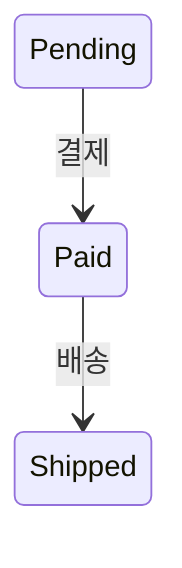
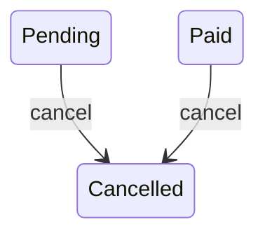
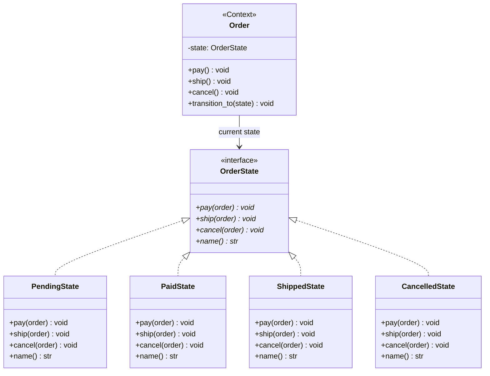
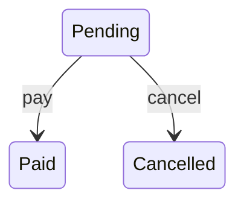
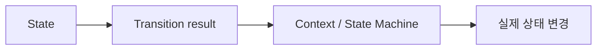
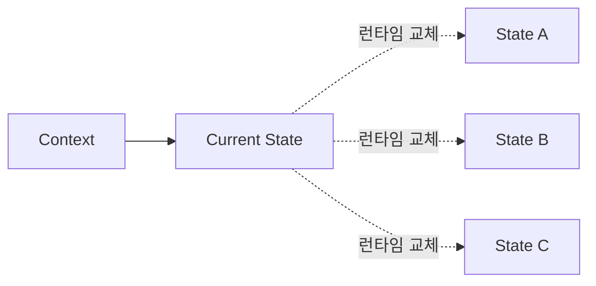
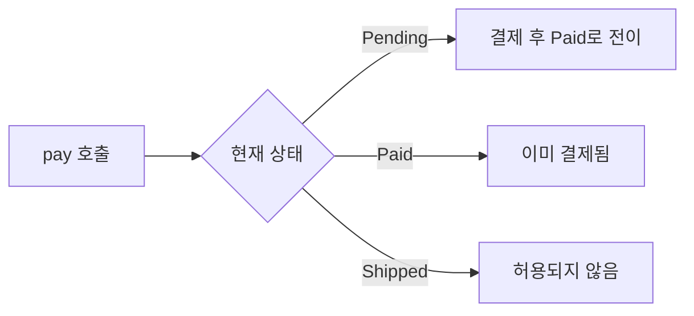

# 스테이트 패턴 (State Pattern)


## 1. 패턴이 없을 때 발생하는 문제점 (The Problem)

상태 패턴을 사용하지 않고 하나의 객체가 현재 상태에 따라 서로 다른 행동을 수행하도록 구현하면, 클래스 내부에 상태를 검사하는 조건문이 반복적으로 나타날 수 있습니다.

예를 들어 주문이 다음 상태를 가진다고 가정합니다.



주문은 상황에 따라 취소될 수도 있습니다.



각 상태에서 허용되는 동작도 서로 다릅니다.

```text
Pending:
    pay 가능
    cancel 가능
    ship 불가

Paid:
    pay 불가
    cancel 가능
    ship 가능

Shipped:
    pay 불가
    cancel 불가
    ship 불가

Cancelled:
    모든 작업 불가

```

### 패턴을 적용하지 않은 예시

```python
class BadOrder:

    def __init__(self):
        self.state = "pending"

    def pay(self) -> None:

        if self.state == "pending":

            print(
                "[Order] 결제를 완료합니다."
            )

            self.state = "paid"

        elif self.state == "paid":

            raise RuntimeError(
                "이미 결제된 주문입니다."
            )

        elif self.state == "shipped":

            raise RuntimeError(
                "배송된 주문은 결제할 수 없습니다."
            )

        elif self.state == "cancelled":

            raise RuntimeError(
                "취소된 주문은 결제할 수 없습니다."
            )

    def ship(self) -> None:

        if self.state == "pending":

            raise RuntimeError(
                "결제되지 않은 주문은 배송할 수 없습니다."
            )

        elif self.state == "paid":

            print(
                "[Order] 주문을 배송합니다."
            )

            self.state = "shipped"

        elif self.state == "shipped":

            raise RuntimeError(
                "이미 배송된 주문입니다."
            )

        elif self.state == "cancelled":

            raise RuntimeError(
                "취소된 주문은 배송할 수 없습니다."
            )

    def cancel(self) -> None:

        if self.state == "pending":

            print(
                "[Order] 주문을 취소합니다."
            )

            self.state = "cancelled"

        elif self.state == "paid":

            print(
                "[Order] 결제를 취소하고 주문을 취소합니다."
            )

            self.state = "cancelled"

        elif self.state == "shipped":

            raise RuntimeError(
                "배송된 주문은 취소할 수 없습니다."
            )

        elif self.state == "cancelled":

            raise RuntimeError(
                "이미 취소된 주문입니다."
            )

```

현재는 상태가 네 개뿐이지만 모든 동작이 상태를 다시 확인합니다.

```text
pay()
    ├─ pending
    ├─ paid
    ├─ shipped
    └─ cancelled

ship()
    ├─ pending
    ├─ paid
    ├─ shipped
    └─ cancelled

cancel()
    ├─ pending
    ├─ paid
    ├─ shipped
    └─ cancelled

```

새로운 상태로 `RefundRequested`가 추가된다고 가정합니다.

```text
Paid
  ↓ 환불 요청
RefundRequested
  ↓ 승인
Cancelled

```

그러면 기존의 여러 메서드를 다시 확인해야 합니다.

```python
def pay(self):
    if self.state == "refund_requested":
        ...

def ship(self):
    if self.state == "refund_requested":
        ...

def cancel(self):
    if self.state == "refund_requested":
        ...

```

상태와 동작이 늘어날수록 하나의 클래스에 거대한 상태 전이 표가 조건문 형태로 흩어지게 됩니다.

### 이 방식이 가진 단점

* **조건문 증가:** 상태에 따라 달라지는 거의 모든 메서드에서 동일한 상태 분기가 반복됩니다.
* **상태별 행동의 분산:** `Paid` 상태에서 가능한 행동이 여러 메서드에 흩어져 있어 한눈에 파악하기 어렵습니다.
* **새로운 상태 추가의 어려움:** 상태가 추가되면 기존 여러 메서드를 함께 수정해야 할 수 있습니다.
* **전이 규칙의 불명확성:** 어떤 상태에서 어떤 상태로 이동할 수 있는지가 조건문 사이에 흩어집니다.
* **유효하지 않은 전이 위험:** 문자열이나 Enum 값만 변경하면 원래 허용되지 않은 상태 전이도 만들 수 있습니다.

---

## 2. 상태 패턴으로 해결하기 (The Solution)

상태 패턴은 "객체의 상태에 따라 달라지는 행동을 각각의 State 객체로 분리하고, Context가 현재 State 객체에 작업을 위임하도록 만드는 방식"으로 이 문제를 해결합니다.

일반적인 구조는 다음과 같습니다.

```text
Client
   ↓
Context
   │
   └─ current_state
            │
            ↓
          State
          / | \
         /  |  \
        ↓   ↓   ↓
      StateA
      StateB
      StateC

```

먼저 상태 인터페이스를 정의합니다.

```python
from abc import ABC, abstractmethod


class OrderState(ABC):

    @abstractmethod
    def pay(
        self,
        order: "Order",
    ) -> None:
        pass

    @abstractmethod
    def ship(
        self,
        order: "Order",
    ) -> None:
        pass

    @abstractmethod
    def cancel(
        self,
        order: "Order",
    ) -> None:
        pass

```

`Pending` 상태는 자신에게 허용된 행동과 전이를 알고 있습니다.

```python
class PendingState(
    OrderState
):

    def pay(
        self,
        order: Order,
    ) -> None:

        print(
            "[Pending] 결제를 완료합니다."
        )

        order.transition_to(
            PaidState()
        )

    def ship(
        self,
        order: Order,
    ) -> None:

        raise RuntimeError(
            "결제되지 않은 주문은 배송할 수 없습니다."
        )

    def cancel(
        self,
        order: Order,
    ) -> None:

        print(
            "[Pending] 주문을 취소합니다."
        )

        order.transition_to(
            CancelledState()
        )

```

`Paid` 상태는 별도의 객체입니다.

```python
class PaidState(
    OrderState
):

    def pay(
        self,
        order: Order,
    ) -> None:

        raise RuntimeError(
            "이미 결제된 주문입니다."
        )

    def ship(
        self,
        order: Order,
    ) -> None:

        print(
            "[Paid] 주문을 배송합니다."
        )

        order.transition_to(
            ShippedState()
        )

    def cancel(
        self,
        order: Order,
    ) -> None:

        print(
            "[Paid] 결제를 취소하고 "
            "주문을 취소합니다."
        )

        order.transition_to(
            CancelledState()
        )

```

Context인 `Order`는 구체적인 상태별 규칙을 알지 않습니다.

```python
class Order:

    def __init__(self):
        self._state: OrderState = (
            PendingState()
        )

    def pay(self) -> None:
        self._state.pay(
            self
        )

    def ship(self) -> None:
        self._state.ship(
            self
        )

    def cancel(self) -> None:
        self._state.cancel(
            self
        )

    def transition_to(
        self,
        state: OrderState,
    ) -> None:

        self._state = state

```

클라이언트는 동일한 `Order` 객체를 계속 사용합니다.

```python
order = Order()

order.pay()
order.ship()

```

하지만 내부 행동은 현재 State 객체에 따라 달라집니다.

```text
Order
  │
  │ pay()
  ↓
PendingState.pay()
  │
  └─ transition
         ↓
     PaidState


Order
  │
  │ ship()
  ↓
PaidState.ship()
  │
  └─ transition
         ↓
     ShippedState

```

핵심은 단순히 `if` 문을 여러 클래스로 옮기는 것에 있지 않습니다.

**현재 상태를 하나의 명시적인 객체로 승격시키고, 상태별 행동과 상태 전이 규칙을 해당 State 객체에 응집시켜 Context가 상태에 따른 조건문 없이 자신의 행동을 변경하도록 만드는 것**이 상태 패턴의 본질입니다.

---

## 3. 장점, 단점 및 트레이드오프 (Trade-off)

### 장점 (Pros)

* **상태별 행동 응집:** 특정 상태에서 가능한 행동과 전이 규칙이 하나의 State 클래스에 모입니다.
* **거대한 조건문 감소:** Context의 각 메서드에서 반복적으로 상태를 검사할 필요가 줄어듭니다.
* **상태 전이의 명시성:** `Pending → Paid → Shipped`와 같은 전이 규칙이 State 구현에 명확하게 드러납니다.
* **새로운 상태 확장에 유리:** 기존 Context의 대규모 조건문을 수정하는 대신 새로운 State 클래스를 추가할 수 있습니다.
* **SRP 향상:** Context는 도메인 객체의 공통 상태와 진입점을 담당하고, State는 상태별 행동을 담당합니다.
* **상태 객체 재사용 가능:** 상태 자체가 별도의 데이터를 가지지 않는다면 동일한 State 객체를 여러 Context에서 공유할 수도 있습니다.

### 단점 (Cons)

* **클래스 수 증가:** 상태마다 Concrete State 클래스가 추가됩니다.
* **단순 상태에는 과도한 구조:** 상태가 두세 개뿐이고 상태별 차이가 거의 없다면 `Enum + if`가 더 단순할 수 있습니다.
* **전이 규칙의 위치 선택 문제:** Concrete State가 직접 다음 State를 생성할지, Context가 전이를 관리할지 별도의 정책 객체가 담당할지 결정해야 합니다.
* **State가 Context 내부 구조에 결합될 수 있음:** 상태별 로직에서 Context의 데이터를 많이 사용하면 State와 Context 사이의 결합도가 높아질 수 있습니다.
* **전체 상태 전이 파악이 어려울 수 있음:** 전이 규칙이 각 Concrete State에 분산되므로 전체 상태 머신을 보려면 여러 클래스를 확인해야 할 수 있습니다.

### 트레이드오프 (Trade-off)

* **상태별 행동 차이가 클수록 유리:** 상태에 따라 많은 메서드의 동작이 달라지는 객체에서 State 패턴의 가치가 커집니다.
* **상태 값만 필요하다면 Enum이 더 적합할 수 있음:** 단순히 `ACTIVE`, `INACTIVE`를 표시하는 것이 목적이라면 별도의 State 객체가 필요하지 않습니다.
* **전이가 복잡해지면 명시적 State Machine을 고려:** 수십 개의 상태와 이벤트가 존재한다면 클래스 계층만으로 관리하기보다 전이 테이블이나 상태 머신 모델이 더 명확할 수 있습니다.
* **State 객체를 불변으로 만들면 공유하기 쉬움:** 상태 객체 안에 Context별 데이터가 없다면 상태를 Flyweight처럼 공유할 수도 있습니다.

---

### State와 Strategy의 차이

State와 Strategy는 구조적으로 매우 비슷합니다.

Strategy:

```text
Context
   │
   ↓
Strategy

```

State:

```text
Context
   │
   ↓
State

```

둘 다 객체 합성을 이용해 행동을 위임합니다.

하지만 의도가 다릅니다.

Strategy는 일반적으로 **클라이언트 또는 구성 영역이 어떤 알고리즘을 사용할지 선택**합니다.

```python
calculator.set_strategy(
    DiscountStrategy()
)

```

State에서는 **객체 내부 상태 변화에 따라 사용하는 행동이 바뀝니다.**

```text
Pending
   ↓ pay
Paid
   ↓ ship
Shipped

```

즉:

```text
Strategy:
    어떤 알고리즘을 사용할 것인가?

State:
    현재 어떤 상태에 있는가?

```

라고 구분할 수 있습니다.

또한 State는 Concrete State 자신이 다음 상태로 전이시키는 경우가 많습니다. Strategy는 일반적으로 다른 Strategy를 스스로 선택하지 않습니다.

---

### State와 Command의 차이

Command는 "무엇을 수행할 것인가?"를 객체로 표현합니다.

State는 "현재 상태에서 그 요청이 어떤 의미를 가지는가?"를 표현합니다.

같은 Command도 State에 따라 다른 결과가 나올 수 있습니다.

```text
ShipOrderCommand

Pending:
    거부

Paid:
    배송

Shipped:
    거부

```

두 패턴은 함께 사용할 수 있습니다.

---

### State와 Memento의 차이

State 패턴의 State는 **현재 행동을 결정하는 활성 상태**입니다.

```text
Order
   ↓
PaidState

```

Memento는 특정 시점의 **과거 상태 Snapshot**입니다.

```text
Memento t₀
Memento t₁
Memento t₂

```

즉:

```text
State Pattern:
    현재 상태가 행동을 결정

Memento:
    과거 상태를 저장하고 복원

```

입니다.

---

### State 패턴과 State Machine의 차이

State 패턴과 유한 상태 머신(Finite State Machine)은 밀접하지만 완전히 같은 개념은 아닙니다.

State Machine은 일반적으로 다음 세 요소를 모델링합니다.

```text
States
Events
Transitions

```

예:

```text
Pending
   │ Pay
   ↓
Paid
   │ Ship
   ↓
Shipped

```

State 패턴은 이러한 상태 기반 행동을 **객체지향 클래스와 다형성으로 구현하는 방법 중 하나**입니다.

즉:

```text
State Machine:
    문제 모델

State Pattern:
    그 모델의 OOP 구현 방식

```

으로 이해할 수 있습니다.

---

## 4. 파이썬 오픈소스에서 볼 수 있는 상태 기반 설계

Python 표준 라이브러리와 주요 프레임워크에도 객체가 현재 상태에 따라 허용되는 연산과 동작을 달리하는 구조가 존재합니다.

다만 아래 사례들이 GoF State 패턴처럼 상태별 클래스를 직접 교체한다는 뜻은 아니며, **상태 전이와 상태 의존적인 행동이라는 핵심 문제를 다루는 사례**로 이해하는 것이 적절합니다.

### `asyncio.Future`

`asyncio.Future`는 아직 결과가 없는 상태와 완료된 상태, 취소된 상태에 따라 메서드의 행동이 달라집니다.

예를 들어 결과가 아직 준비되지 않은 Future에서 `result()`를 호출하면 `InvalidStateError`가 발생하고, 취소된 Future라면 `CancelledError`가 발생합니다. `set_result()`는 Future를 완료 상태로 전환하며 이미 완료된 Future에서 다시 호출하면 `InvalidStateError`가 발생합니다. `cancel()` 역시 아직 완료되지 않은 Future를 취소 상태로 변경하지만 이미 완료되었거나 취소된 경우에는 `False`를 반환합니다.

개념적으로 다음과 같이 볼 수 있습니다.

```text
Pending
   │ set_result()
   ↓
Done


Pending
   │ cancel()
   ↓
Cancelled

```

그리고 같은 메서드라도 현재 상태에 따라 의미가 달라집니다.

```text
result()

Pending:
    InvalidStateError

Done:
    Result 반환

Cancelled:
    CancelledError

```

실제 구현은 GoF State 클래스를 그대로 사용하는 것은 아니지만 **현재 상태가 객체의 허용 동작과 결과를 결정한다는 점에서 State Machine과 유사한 설계**입니다.

---

### `io.IOBase`

Python의 `IOBase` 계열 Stream은 `open` 상태와 `closed` 상태에 따라 가능한 작업이 달라집니다.

공식 문서에서는 `close()`가 Stream을 닫으며 이미 닫힌 Stream에서 다시 `close()`하는 것은 허용되지만, 닫힌 이후 읽기나 쓰기 같은 파일 작업은 `ValueError`를 발생시킨다고 설명합니다.

개념적으로:

```text
Open
  │
  │ close()
  ↓
Closed

```

입니다.

```text
Open:
    read 가능
    write 가능
    close 가능

Closed:
    read/write 불가
    close는 다시 호출 가능

```

역시 전형적인 GoF State 객체 구조라기보다 **현재 수명 주기 상태에 따라 API의 의미가 달라지는 상태 기반 객체**의 사례입니다.

---

### Django `transaction.atomic()`

Django의 transaction 관리 역시 현재 transaction nesting 상태와 예외 발생 여부에 따라 다른 동작을 수행합니다.

공식 문서에 따르면 가장 바깥쪽 `atomic()`에 진입하면 transaction을 시작하고, 중첩된 `atomic()`에 들어가면 savepoint를 생성합니다. 내부 블록 종료 시에는 savepoint를 release하거나 rollback하며, 가장 바깥 블록 종료에서는 전체 transaction을 commit하거나 rollback합니다. 또한 `atomic()` 내부에서는 직접 commit, rollback, autocommit 변경과 같은 일부 작업이 제한됩니다.

개념적으로 다음과 같은 상태 전이로 볼 수 있습니다.

```text
Outside Transaction
        │
        │ enter atomic
        ↓
Inside Transaction
        │
        │ enter nested atomic
        ↓
Inside Savepoint

```

종료 시에는 성공과 실패에 따라:

```text
Success
    → commit / release savepoint

Failure
    → rollback

```

으로 동작합니다.

이는 GoF State 구현 자체라기보다 **현재 transaction context와 nesting state가 후속 동작의 의미를 결정하는 명시적인 상태 기반 프로토콜**의 사례로 볼 수 있습니다.

---

## 5. 클래스 다이어그램



각 역할은 다음과 같습니다.

```text
Context
    Order

State
    OrderState

Concrete States
    PendingState
    PaidState
    ShippedState
    CancelledState

```

핵심 관계는 다음과 같습니다.

```text
Order
  │
  └─ current_state
           │
           ├─ PendingState
           ├─ PaidState
           ├─ ShippedState
           └─ CancelledState

```

상태가 전이되면 `Order` 객체 자체를 교체하는 것이 아니라 내부 State 객체가 변경됩니다.

```text
Order
  │
  ├─ PendingState
  │       ↓ pay
  ├─ PaidState
  │       ↓ ship
  └─ ShippedState

```

---

## 6. 파이썬 예제 코드

```python
from __future__ import annotations
from abc import ABC, abstractmethod

# -------------------------------------------------------------------
# 1. State Interface
# -------------------------------------------------------------------

class OrderState(ABC):
    @abstractmethod
    def name(self) -> str:
        pass

    @abstractmethod
    def pay(self, order: Order) -> None:
        pass

    @abstractmethod
    def ship(self, order: Order) -> None:
        pass

    @abstractmethod
    def cancel(self, order: Order) -> None:
        pass

# -------------------------------------------------------------------
# 2. Context
# -------------------------------------------------------------------

class Order:
    def __init__(self):
        self._state: OrderState = PendingState()

    @property
    def state_name(self) -> str:
        return self._state.name()

    def transition_to(self, state: OrderState) -> None:
        print(f"[Transition] " f"{self._state.name()} " f"-> {state.name()}")
        self._state = state

    def pay(self) -> None:
        self._state.pay(self)

    def ship(self) -> None:
        self._state.ship(self)

    def cancel(self) -> None:
        self._state.cancel(self)

# -------------------------------------------------------------------
# 3. Concrete State - Pending
# -------------------------------------------------------------------

class PendingState(OrderState):
    def name(self) -> str:
        return "Pending"

    def pay(self, order: Order) -> None:
        print("[Pending] 결제를 완료합니다.")
        order.transition_to(PaidState())

    def ship(self, order: Order) -> None:
        raise RuntimeError("결제되지 않은 주문은 " "배송할 수 없습니다.")

    def cancel(self, order: Order) -> None:
        print("[Pending] 주문을 취소합니다.")
        order.transition_to(CancelledState())

# -------------------------------------------------------------------
# 4. Concrete State - Paid
# -------------------------------------------------------------------

class PaidState(OrderState):
    def name(self) -> str:
        return "Paid"

    def pay(self, order: Order) -> None:
        raise RuntimeError("이미 결제된 주문입니다.")

    def ship(self, order: Order) -> None:
        print("[Paid] 주문을 배송합니다.")
        order.transition_to(ShippedState())

    def cancel(self, order: Order) -> None:
        print("[Paid] 결제를 취소하고 " "주문을 취소합니다.")
        order.transition_to(CancelledState())

# -------------------------------------------------------------------
# 5. Concrete State - Shipped
# -------------------------------------------------------------------

class ShippedState(OrderState):
    def name(self) -> str:
        return "Shipped"

    def pay(self, order: Order) -> None:
        raise RuntimeError("배송된 주문은 " "결제할 수 없습니다.")

    def ship(self, order: Order) -> None:
        raise RuntimeError("이미 배송된 주문입니다.")

    def cancel(self, order: Order) -> None:
        raise RuntimeError("배송된 주문은 " "취소할 수 없습니다.")

# -------------------------------------------------------------------
# 6. Concrete State - Cancelled
# -------------------------------------------------------------------

class CancelledState(OrderState):
    def name(self) -> str:
        return "Cancelled"

    def pay(self, order: Order) -> None:
        raise RuntimeError("취소된 주문은 " "결제할 수 없습니다.")

    def ship(self, order: Order) -> None:
        raise RuntimeError("취소된 주문은 " "배송할 수 없습니다.")

    def cancel(self, order: Order) -> None:
        raise RuntimeError("이미 취소된 주문입니다.")

# -------------------------------------------------------------------
# 7. 실행 (Usage)
# -------------------------------------------------------------------

if __name__ == "__main__":
    order = Order()
    print(order.state_name)
    # Pending
    order.pay()
    print(order.state_name)
    # Paid
    order.ship()
    print(order.state_name)
    # Shipped
```

실행 흐름은 다음과 같습니다.

```text
Pending

    order.pay()
        ↓

PendingState.pay()
        ↓

Paid


Paid

    order.ship()
        ↓

PaidState.ship()
        ↓

Shipped

```

Context의 메서드는 상태를 검사하지 않습니다.

```python
def pay(self) -> None:

    self._state.pay(
        self
    )

```

다음과 같은 코드가 사라집니다.

```python
if self.state == "pending":
    ...

elif self.state == "paid":
    ...

elif self.state == "shipped":
    ...

```

현재 State 객체가 행동을 결정합니다.

---

### 상태 전이 책임을 어디에 둘 것인가

앞의 예제에서는 Concrete State가 직접 다음 상태를 결정합니다.

```python
order.transition_to(
    PaidState()
)

```

이 방식의 장점은 특정 상태의 행동과 전이 규칙이 같은 클래스에 모인다는 것입니다.



반면 전이 규칙이 매우 복잡하거나 외부 정책에 따라 달라진다면 State 객체가 다음 State를 직접 생성하지 않도록 할 수도 있습니다.

예를 들어:



구조로 분리할 수 있습니다.

이 차이는 부록에서 다루는 **명시적인 State Machine** 관점과 연결됩니다.

---

## 부록 (Appendix): 현대적 타입 시스템과 함수형 관점의 재해석

상태 패턴을 현대 타입 시스템과 함수형 프로그래밍 관점에서 재해석하면, State 패턴이 해결하려는 핵심 문제는 단순히 "상태별 조건문을 State 클래스로 옮기는 것"보다 훨씬 일반적인 문제로 볼 수 있습니다.

고전적인 객체는 다음처럼 표현됩니다.

```text
Object
    data
    current_state
    methods

```

그리고 같은 메서드 호출이 상태에 따라 다른 의미를 가집니다.

```text
pay()

Pending:
    결제

Paid:
    거부

Shipped:
    거부

Cancelled:
    거부

```

이를 더 추상적으로 바라보면 다음과 같습니다.

```text
현재 상태
    +
입력 Event
    ↓
전이 규칙
    ↓
새로운 상태
    +
출력 / Effect

```

즉 State 패턴의 본질은 다음 질문으로 확장할 수 있습니다.

> **"현재 상태에서 가능한 연산과 상태 전이 규칙을 어떻게 명시적으로 모델링하고, 불가능한 상태와 불가능한 전이를 가능한 한 표현하지 못하게 만들 것인가?"**

이 부록에서는 이를 설명하기 위해 **ADT, 패턴 매칭, Typestate, GADT/Indexed Type, 불변 상태, State Transition Function, Mealy/Moore Machine, Effect System을 지원하는 가상의 Python 문법**을 가정합니다. *(아래 코드는 실제 Python 문법이 아닙니다.)*

### 1. 상태 객체 계층을 ADT로 표현하기

객체지향에서는 다음 클래스들이 존재합니다.

```text
PendingState
PaidState
ShippedState
CancelledState

```

함수형 언어에서는 하나의 합 타입으로 표현할 수 있습니다.

```text
data OrderState =
    Pending
  | Paid(
        transaction:
            TransactionId
    )
  | Shipped(
        tracking:
            TrackingNumber
    )
  | Cancelled(
        reason:
            CancelReason
    )

```

중요한 점은 각 상태가 **자신에게만 존재하는 데이터**를 가질 수 있다는 것입니다.

```text
Pending:
    결제 정보 없음

Paid:
    transaction 존재

Shipped:
    tracking 존재

Cancelled:
    cancellation reason 존재

```

가변 객체 안에 여러 Optional 필드를 넣는 것보다 정확합니다.

---

### 2. 잘못된 상태 조합을 표현하지 못하게 만들기

전통적인 하나의 Order 클래스가 다음 필드를 가진다고 가정합니다.

```text
record Order:

    state: OrderState

    transaction:
        Option[TransactionId]

    tracking:
        Option[TrackingNumber]

    cancel_reason:
        Option[CancelReason]

```

다음과 같은 모순된 상태를 만들 수 있습니다.

```text
state = Pending
transaction = Some(...)
tracking = Some(...)
cancel_reason = Some(...)

```

즉 여러 Boolean/Optional 필드의 조합으로 상태를 표현하면 유효하지 않은 상태가 많아집니다.

ADT에서는 상태별 데이터를 해당 Constructor 안에 넣습니다.

```text
data Order =
    PendingOrder(
        items: Vector[Item],
    )
  | PaidOrder(
        items: Vector[Item],
        transaction:
            TransactionId,
    )
  | ShippedOrder(
        items: Vector[Item],
        transaction:
            TransactionId,
        tracking:
            TrackingNumber,
    )
  | CancelledOrder(
        items: Vector[Item],
        reason:
            CancelReason,
    )

```

이제:

```text
Pending인데 tracking이 존재한다

```

는 상태 자체를 만들 수 없습니다.

**유효한 상태만 타입의 Constructor로 정의하는 것**입니다.

---

### 3. 상태 전이를 순수 함수로 표현하기

객체지향 State에서는 State 객체가 Context를 변경합니다.

```python
order.transition_to(
    PaidState()
)

```

불변 데이터에서는 기존 상태를 수정하지 않습니다.

```python
def pay(
    order: PendingOrder,
    transaction:
        TransactionId,
) -> PaidOrder:

    return PaidOrder(
        items=order.items,
        transaction=transaction,
    )

```

타입만 보아도 전이가 드러납니다.

```text
PendingOrder
     ↓ pay
PaidOrder

```

배송:

```python
def ship(
    order: PaidOrder,
    tracking:
        TrackingNumber,
) -> ShippedOrder:

    return ShippedOrder(
        items=order.items,
        transaction=
            order.transaction,
        tracking=tracking,
    )

```

타입:

```text
PaidOrder
    ↓ ship
ShippedOrder

```

상태 전이가 **함수의 입력 타입과 출력 타입**으로 표현됩니다.

---

### 4. 불가능한 연산 자체를 API에서 제거하기

고전적인 State 패턴에서는 모든 State가 같은 인터페이스를 구현하기 때문에 다음 메서드를 모두 가져야 할 수 있습니다.

```text
PendingState:
    pay()
    ship()
    cancel()

PaidState:
    pay()
    ship()
    cancel()

ShippedState:
    pay()
    ship()
    cancel()

```

그래서 의미 없는 메서드에서는 예외를 발생시킵니다.

```text
class ShippedState:

    def pay(...):

        raise RuntimeError(...)

```

Typestate 방식에서는 해당 상태에 애초에 연산을 정의하지 않습니다.

```python
def pay(
    order: PendingOrder,
) -> PaidOrder:
    ...

```

```python
def ship(
    order: PaidOrder,
) -> ShippedOrder:
    ...

```

`ShippedOrder`에 `pay()`는 없습니다.

```python
pay(
    shipped_order
)

```

컴파일러:

```text
Type Error:

pay requires:
    PendingOrder

found:
    ShippedOrder

```

런타임 예외가 아니라 **정적 타입 오류**가 됩니다.

---

### 5. 이것이 Typestate 패턴이다

객체가 현재 어느 상태인지 타입 자체에 포함시키는 방식을 Typestate라고 볼 수 있습니다.

```text
data Pending
data Paid
data Shipped

```

```text
record Order[
    State
]:
    ...

```

초기 생성:

```text
def create_order(...) -> Order[Pending]:
    ...

```

결제:

```python
def pay(
    order:
        Order[Pending],
) -> Order[Paid]:
    ...

```

배송:

```python
def ship(
    order:
        Order[Paid],
) -> Order[Shipped]:
    ...

```

상태 전이가:

```text
Order[Pending]
      ↓
Order[Paid]
      ↓
Order[Shipped]

```

라는 타입 전이로 나타납니다.

---

### 6. 상태에 따라 사용할 수 있는 메서드 집합도 달라진다

Typestate가 강력한 이유는 단순히 상태 이름만 추적하는 것이 아닙니다.

각 상태에서 허용되는 API를 다르게 만들 수 있습니다.

```text
Order[Pending]
    pay
    cancel


Order[Paid]
    ship
    refund
    cancel


Order[Shipped]
    track

```

즉 Context의 인터페이스 자체가 상태에 따라 변합니다.

고전적인 State 패턴의:

```text
같은 인터페이스
       +
상태에 따라 런타임 행동 변경

```

을:

```text
상태에 따라 정적 인터페이스 자체 변경

```

으로 강화한 것입니다.

---

### 7. 상태 머신을 `(State, Event) -> State` 함수로 표현하기

상태와 Event를 별도로 정의할 수 있습니다.

```text
data OrderState =
    Pending
  | Paid
  | Shipped
  | Cancelled

```

```text
data OrderEvent =
    PaymentReceived
  | ShipmentStarted
  | CancelRequested

```

전이 함수:

```python
def transition(
    state: OrderState,
    event: OrderEvent,
) -> Result[
    OrderState,
    InvalidTransition,
]:

    match (
        state,
        event,
    ):

        case (
            Pending,
            PaymentReceived,
        ):
            return Ok(
                Paid
            )

        case (
            Paid,
            ShipmentStarted,
        ):
            return Ok(
                Shipped
            )

        case (
            Pending | Paid,
            CancelRequested,
        ):
            return Ok(
                Cancelled
            )

        case _:
            return Err(
                InvalidTransition(
                    state,
                    event,
                )
            )

```

객체 계층이 아니라 **명시적인 전이 함수**로 State Machine을 표현합니다.

---

### 8. 전이 테이블을 데이터로 표현하기

전이 규칙이 단순하다면 코드보다 데이터가 더 적합할 수 있습니다.

```python
transition_table = {
    (
        Pending,
        PaymentReceived,
    ):
        Paid,

    (
        Paid,
        ShipmentStarted,
    ):
        Shipped,

    (
        Pending,
        CancelRequested,
    ):
        Cancelled,

    (
        Paid,
        CancelRequested,
    ):
        Cancelled,
}

```

전이:

```python
def transition(
    state,
    event,
):

    return transition_table[
        (
            state,
            event,
        )
    ]

```

장점은 전체 상태 머신을 한눈에 볼 수 있다는 것입니다.

```text
State × Event
      ↓
Next State

```

상태가 수십 개라면 Concrete State 클래스보다 이런 방식이 더 읽기 쉬울 수도 있습니다.

---

### 9. Exhaustive Pattern Matching으로 상태 누락 검출하기

상태가 하나 추가된다고 가정합니다.

```text
data OrderState =
    Pending
  | Paid
  | RefundRequested
  | Shipped
  | Cancelled

```

기존 `transition()`이 `RefundRequested`를 처리하지 않는다면 exhaustive pattern checker가 알려줄 수 있습니다.

```text
Non-exhaustive match:

State:
    RefundRequested

```

객체지향 State에서는 새 State 클래스를 만들었지만 전체 전이 중 일부가 누락되었는지 컴파일러가 자동으로 확인하기 어렵습니다.

닫힌 상태 집합에서는 ADT의 장점이 나타납니다.

---

### 10. 열린 상태 확장과 닫힌 상태 집합의 트레이드오프

객체지향 State 패턴은 새로운 Concrete State 클래스를 추가하기 쉽습니다.

```text
State
  ├─ PendingState
  ├─ PaidState
  └─ NewState

```

이는 상태 종류가 외부 Plugin 등에서 계속 추가되는 **Open World**에 적합할 수 있습니다.

반면 ADT는 상태 집합이 닫혀 있습니다.

```text
data State =
    A
  | B
  | C

```

새 상태를 추가하면 기존 패턴 매칭 함수들이 영향을 받습니다.

따라서:

```text
상태 종류가 열린 구조
    → OOP State / Type Class

상태 종류가 닫힌 구조
    → ADT + Pattern Matching

```

이라는 선택 기준을 가질 수 있습니다.

---

### 11. Mealy Machine으로 상태와 출력을 함께 표현하기

일반 상태 머신은 단순히 다음 상태만 만드는 것이 아니라 출력도 생성할 수 있습니다.

Mealy Machine은 다음 형태입니다.

```text
State + Input ───> Output + Next State

```

타입:

```text
type Mealy[
    State,
    Input,
    Output,
] = (State, Input) -> (State, Output)

```

주문 예제:

```python
def step(
    state: OrderState,
    event: OrderEvent,
) -> (
    OrderState,
    Vector[OrderEffect],
):
    ...

```

결제 Event:

```text
Pending + PaymentReceived ───> Paid + SendReceipt

```

배송 Event:

```text
Paid + ShipmentStarted ───> Shipped + NotifyCustomer

```

상태 전이와 외부 Effect를 분리할 수 있습니다.

---

### 12. Moore Machine으로 출력을 상태에 연결하기

Moore Machine에서는 출력이 Event가 아니라 현재 상태에 의해 결정됩니다.

```text
State ───> Output

```

예를 들어 UI 표시:

```python
def view(
    state: OrderState,
) -> OrderView:

    match state:

        case Pending:
            return OrderView(
                label="결제 대기",
                can_pay=True,
            )

        case Paid:
            return OrderView(
                label="배송 준비",
                can_pay=False,
            )

        case Shipped:
            return OrderView(
                label="배송 중",
                can_pay=False,
            )

```

UI가 상태를 직접 mutation하는 대신:

```text
State ───> View

```

라는 순수 함수로 파생됩니다.

---

### 13. 상태 전이와 부수효과를 분리하기

결제가 성공하면 영수증 이메일을 보내야 한다고 가정합니다.

고전적인 State 객체 안에서:

```text
def pay(...):

    payment_gateway.charge(...)

    email.send(...)

    order.transition_to(...)

```

를 모두 수행할 수도 있습니다.

하지만 상태 전이와 Effect가 섞입니다.

다음처럼 분리할 수 있습니다.

```text
data OrderEffect =
    ChargePayment(...)
  | SendReceipt(...)
  | NotifyShipping(...)

```

전이 함수:

```python
def transition(
    state: OrderState,
    event: OrderEvent,
) -> (
    OrderState,
    Vector[OrderEffect],
):
    ...

```

Runtime이 Effect를 실행합니다.

```text
State + Event ───> Pure Transition ───> New State + Effects ───> Interpreter

```

상태 머신 자체를 순수하게 유지할 수 있습니다.

---

### 14. 실패하는 Effect와 상태 전이를 구분하기

결제 요청을 받았다고 바로 `Paid`로 전이하면 안 될 수 있습니다.

```text
Pending ── PayClicked ──> ???

```

실제 결제가 실패할 수 있기 때문입니다.

중간 상태를 명시합니다.

```text
data OrderState =
    Pending
  | PaymentProcessing(
        attempt: PaymentAttemptId
    )
  | Paid(
        transaction: TransactionId
    )
  | PaymentFailed(
        reason: PaymentError
    )

```

전이:

```text
Pending ── PaymentRequested ──> PaymentProcessing ── PaymentSucceeded ──> Paid

PaymentProcessing ── PaymentFailed ──> PaymentFailed

```

**중간 상태도 도메인에서 실제 의미를 가진다면 타입으로 표현하는 것이 중요합니다.**

---

### 15. 비동기 상태 머신은 Event Loop와 자연스럽게 결합된다

네트워크 프로토콜이나 UI는 Event가 비동기로 도착합니다.

```text
State ── await Event ──> State Transition ── await Event ──> State Transition

```

가상의 함수:

```python
async def run_machine(
    initial: State,
    events:
        AsyncStream[Event],
) -> State:

    state = initial

    async for event in events:

        state = transition(
            state,
            event,
        )

    return state

```

State 객체의 직접 메서드 호출이 **Event Stream을 Fold하는 계산**으로 바뀝니다.

---

### 16. 상태 머신을 `fold`로 바라보기

상태 전이는 결국 Event 목록을 순서대로 적용하는 것입니다.

```text
Initial State ── Event₁ ──> State₁ ── Event₂ ──> State₂ ── Event₃ ──> State₃

```

따라서:

```python
current = fold(
    events,
    initial_state,
    transition,
)

```

으로 표현할 수 있습니다.

이 관점은 Event Sourcing과도 직접 연결됩니다.

```text
Events ───(fold)───> Current State

```

---

### 17. 상태 전이 로그는 Event Sourcing과 연결된다

Order에 다음 Event들이 저장되어 있다고 가정합니다.

```text
OrderCreated
PaymentReceived
ShipmentStarted

```

초기 상태:

```text
NotCreated

```

Event를 차례로 적용하면:

```text
NotCreated ── OrderCreated ──> Pending ── PaymentReceived ──> Paid ── ShipmentStarted ──> Shipped

```

현재 상태를 얻을 수 있습니다.

State 객체를 직접 직렬화하는 대신 **전이 원인이었던 Event를 저장**하는 구조입니다.

---

### 18. Memento는 상태를 저장하고 Event Sourcing은 전이를 저장한다

앞서 살펴본 Memento와 비교하면:

```text
Memento:
State₀, State₁, State₂

```

Event Sourcing:

```text
Event₁, Event₂, Event₃

```

State 패턴은 그 사이에서:

```text
현재 State + State Transition Rules

```

를 다룹니다.

세 패턴은 서로 다른 시간적 관심사를 가집니다.

```text
State:          지금 어떤 상태인가?
Memento:        과거 상태가 무엇이었는가?
Event Sourcing: 어떤 사건 때문에 상태가 변했는가?

```

---

### 19. 상태에 따른 Capability를 타입으로 부여하기

각 상태에서 가능한 능력을 Capability로 표현할 수도 있습니다.

```text
capability Payable[T]:

    def pay(
        value: T,
    ) -> PaidOrder

```

`PendingOrder`만 구현합니다.

```text
impl Payable[PendingOrder]:
    ...

```

`Shippable`:

```text
capability Shippable[T]:

    def ship(
        value: T,
    ) -> ShippedOrder

```

`PaidOrder`만 구현합니다.

```text
impl Shippable[PaidOrder]:
    ...

```

함수는 필요한 상태 능력만 요구합니다.

```text
def process_shipping[T](
    order: T,
) -> ShippedOrder
where Shippable[T]:

    return ship(
        order
    )

```

상태와 가능한 행동의 관계를 **타입클래스 수준**으로 표현합니다.

---

### 20. 상태 전이의 선형성을 타입으로 강제할 수 있다

가변 객체에서는 이전 상태의 객체 참조가 남아 잘못 사용될 수 있습니다.

Typestate를 선형 타입과 결합한다고 가정합니다.

```text
linear Order[State]

```

결제:

```python
def pay(
    order: Order[Pending],
) -> Order[Paid]:
    ...

```

호출:

```python
pending = create_order()
paid = pay(pending)

```

이제 기존 `pending`은 소비되었습니다.

```python
cancel(pending)

```

컴파일러:

```text
Type Error:
Order[Pending] has already been consumed by pay().

```

하나의 논리 Order가 동시에 `Pending`과 `Paid` 두 상태로 존재하는 것을 타입 시스템이 방지합니다.

---

### 21. State 객체를 "다형적 행동"보다 "전이 시스템"으로 바라보기

고전적인 State 패턴은 다음과 같습니다.

```text
Context ───> State Object ───┬───> handle A
                             ├───> handle B
                             └───> transition

```

하지만 더 일반적으로 보면:

```text
State Space + Input Events + Transition Relation + Outputs / Effects

```

입니다.

객체지향에서는 이를 `Context + State subclasses`로 표현합니다.

함수형 언어에서는 `ADT + transition()`으로, 더 강한 타입 시스템에서는 `Typestate / Indexed Types`로, 이벤트 기반 시스템에서는 `Event Stream + fold`로, 효과 시스템에서는 `Pure Transition + Effect Interpreter`로 표현할 수 있습니다.

---

### 요약 및 비교

| 관점 | 상태 패턴 (OOP 아키텍처) | 현대 타입 시스템 + 함수형 관점 |
| --- | --- | --- |
| **현재 상태 표현** | State 객체 | ADT / State Type |
| **상태별 데이터** | Concrete State 필드 | Constructor별 데이터 |
| **행동 위임** | Context → State | Pattern Matching / Capability |
| **상태 전이** | `transition_to()` | 순수 전이 함수 |
| **유효하지 않은 연산** | 런타임 예외 | Typestate로 정적 거부 |
| **상태별 API** | 동일 State 인터페이스 | 상태별 함수/Capability |
| **전체 전이 규칙** | Concrete State에 분산 | Transition Function/Table |
| **전이 누락** | 테스트로 발견 | Exhaustive Matching |
| **닫힌 상태 집합** | 클래스 계층 | ADT |
| **열린 상태 확장** | Concrete State 추가 | Type Class / Open Variant |
| **상태 + 입력 → 다음 상태** | State Method | State Machine |
| **출력 포함 전이** | 메서드의 부수효과 | Mealy Machine |
| **상태 기반 출력** | State Method | Moore Machine |
| **부수효과** | State 내부 실행 | Effect Description + Interpreter |
| **비동기 전이** | Callback/메서드 | Async Event Stream |
| **상태 재구성** | 객체 상태 유지 | Event Fold |
| **불가능한 상태** | 런타임 검증 | ADT로 표현 불가능하게 설계 |
| **하나의 상태만 존재** | 가변 Context 규약 | Linear Typestate |
| **주요 장점** | 상태별 조건문을 다형성으로 분리 | 상태·전이·가능한 연산을 타입 수준에 명시 |
| **주요 비용** | State 클래스 증가 | ADT·Typestate·State Machine 모델 설계 필요 |

---

### 결론

고전적인 State 패턴은 **객체가 현재 상태에 따라 행동을 변경해야 할 때 상태별 행동과 전이 규칙을 별도의 State 객체로 캡슐화하고, Context가 현재 State에 작업을 위임하도록 만드는 행위 패턴**입니다.

객체지향에서는:



라는 구조로 표현합니다.

Context의 호출은 동일하지만:

```python
order.pay()

```

실제 의미는 현재 State에 의해 결정됩니다.



현대 타입 시스템과 함수형 패러다임에서는 이 개념을 더 일반적인 **상태 머신과 타입 상태 전이**로 확장할 수 있습니다.

* Concrete State 클래스 $\leftrightarrow$ ADT Constructor
* State 객체 교체 $\leftrightarrow$ Immutable State Transition
* `transition_to()` $\leftrightarrow$ `(State, Event) -> State`
* 상태별 조건문 $\leftrightarrow$ Exhaustive Pattern Matching
* 의미 없는 State 메서드 $\leftrightarrow$ 상태별 API 제거
* 런타임 Invalid Transition $\leftrightarrow$ Typestate
* State별 허용 능력 $\leftrightarrow$ Capability / Type Class
* 상태 전이 + 출력 $\leftrightarrow$ Mealy Machine
* 상태 기반 출력 $\leftrightarrow$ Moore Machine
* 외부 동작 $\leftrightarrow$ Effect Description
* Event 기반 상태 변화 $\leftrightarrow$ Stream Fold
* 과거 상태 복원 $\leftrightarrow$ Memento
* 상태 변화의 원인 저장 $\leftrightarrow$ Event Sourcing
* 하나의 논리 상태 보장 $\leftrightarrow$ Linear Typestate

상태 패턴의 핵심은 유효한 상태, 상태별 행동, 전이 규칙을 명시적인 모델로 분리해 현재 상태가 객체의 행동을 결정하도록 만드는 데 있습니다. ADT와 Typestate는 같은 규칙을 데이터와 타입 수준에서 더 엄격하게 표현하는 선택지입니다.
