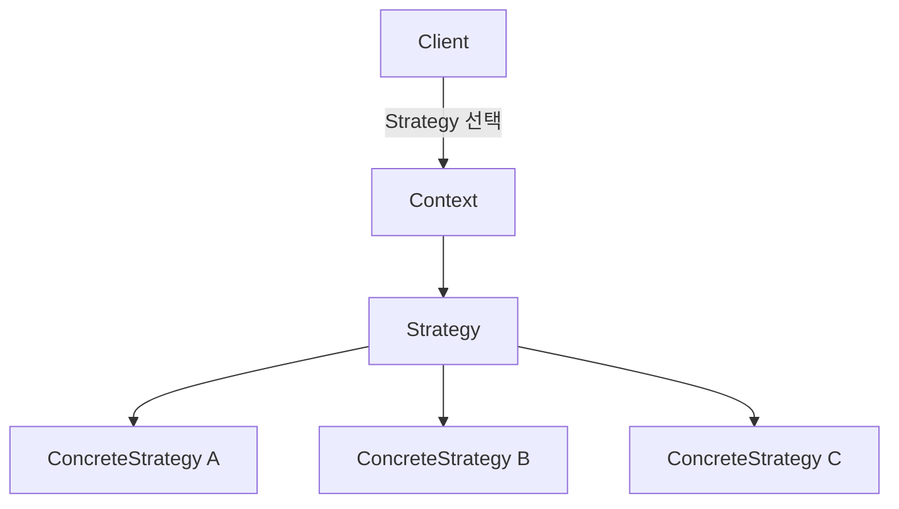
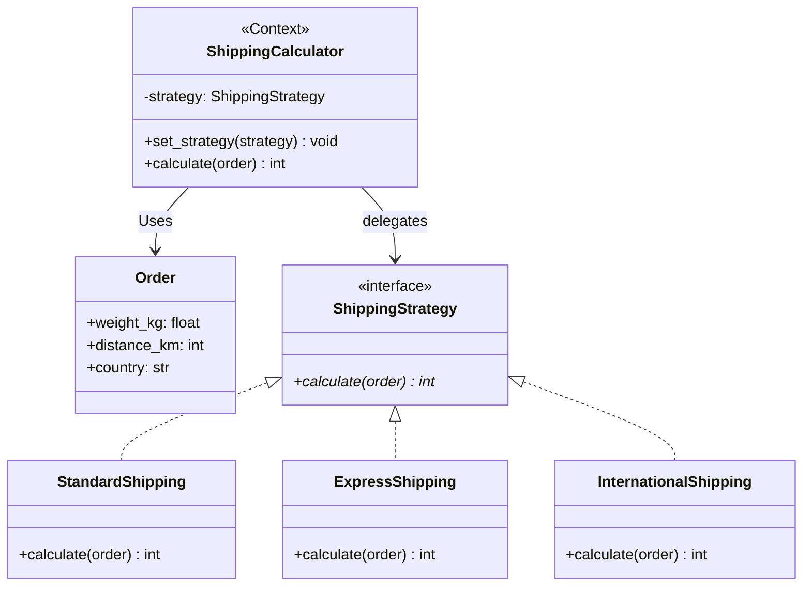

# 전략 패턴 (Strategy Pattern)


## 1. 패턴이 없을 때 발생하는 문제점 (The Problem)

전략 패턴을 사용하지 않고 하나의 작업을 수행하는 여러 알고리즘을 조건문으로 직접 선택하면, 새로운 알고리즘이 추가될수록 Context 내부의 분기문이 커지고 알고리즘 구현과 알고리즘 선택 책임이 하나의 클래스에 섞이는 문제가 발생할 수 있습니다.

예를 들어 주문의 배송비를 계산하는 시스템이 있다고 가정합니다.

배송 방식은 다음 세 가지를 지원합니다.

```text
Standard

Express

International

```

각 배송 방식은 동일한 주문 정보를 사용하지만 계산 규칙은 서로 다릅니다.

### 패턴을 적용하지 않은 예시

```python
from dataclasses import dataclass


@dataclass(frozen=True)
class Order:
    weight_kg: float
    distance_km: int
    country: str


class BadShippingCalculator:

    def calculate(
        self,
        order: Order,
        shipping_type: str,
    ) -> int:

        if shipping_type == "standard":

            base = 3_000
            weight_fee = int(
                order.weight_kg * 500
            )

            return (
                base
                + weight_fee
            )

        elif shipping_type == "express":

            base = 7_000

            weight_fee = int(
                order.weight_kg * 900
            )

            distance_fee = (
                order.distance_km * 10
            )

            return (
                base
                + weight_fee
                + distance_fee
            )

        elif shipping_type == "international":

            base = 20_000

            weight_fee = int(
                order.weight_kg * 2_000
            )

            return (
                base
                + weight_fee
            )

        raise ValueError(
            "지원하지 않는 배송 방식입니다."
        )

```

현재는 알고리즘이 세 개뿐이지만 새로운 배송 정책이 추가된다고 가정합니다.

```text
SameDay

Drone

Economy

PremiumMember

HolidayExpress

```

기존 `calculate()` 함수에는 계속 새로운 분기가 추가됩니다.

```python
if shipping_type == "same_day":
    ...

elif shipping_type == "drone":
    ...

elif shipping_type == "economy":
    ...

elif shipping_type == "holiday_express":
    ...

```

알고리즘별 설정까지 늘어나면 조건문은 더 복잡해집니다.

```python
if shipping_type == "express":

    if order.distance_km > 100:
        ...

    if order.weight_kg > 20:
        ...

    if holiday:
        ...

    if premium_member:
        ...

```

또한 배송비 계산 외의 다른 코드에서도 배송 방식에 따라 다른 처리가 필요하다면 동일한 분기가 반복될 수 있습니다.

```python
def estimate_arrival(
    shipping_type: str,
):
    if shipping_type == "standard":
        ...

    elif shipping_type == "express":
        ...

    elif shipping_type == "international":
        ...

```

알고리즘의 종류를 나타내는 값과 실제 알고리즘 구현이 여러 위치에 퍼지기 시작합니다.

### 이 방식이 가진 단점

* **조건문 증가:** 알고리즘이 추가될 때마다 Context의 분기문이 계속 커집니다.
* **OCP(개방-폐쇄 원칙) 위반:** 새로운 계산 방법을 추가하기 위해 기존 `calculate()` 구현을 수정해야 합니다.
* **알고리즘 책임의 혼재:** Standard, Express, International이라는 서로 독립적인 계산 정책이 하나의 클래스에 섞입니다.
* **Context와 구체 알고리즘의 강한 결합:** Context가 어떤 알고리즘들이 존재하는지 모두 알아야 합니다.
* **알고리즘 재사용의 어려움:** 특정 배송 계산 규칙을 다른 서비스에서 사용하려면 기존 Context에 의존하거나 로직을 다시 복사해야 할 수 있습니다.
* **테스트 범위 증가:** 하나의 거대한 함수 안에서 여러 알고리즘을 함께 테스트해야 합니다.

---

## 2. 전략 패턴으로 해결하기 (The Solution)

전략 패턴은 "하나의 작업을 수행하는 여러 알고리즘을 공통 Strategy 인터페이스 아래 각각 캡슐화하고, Context가 필요한 Strategy에 작업을 위임하도록 만드는 방식"으로 이 문제를 해결합니다.

일반적인 구조는 다음과 같습니다.



먼저 배송비 계산이라는 공통 인터페이스를 정의합니다.

```python
from abc import ABC, abstractmethod


class ShippingStrategy(ABC):

    @abstractmethod
    def calculate(
        self,
        order: Order,
    ) -> int:
        pass

```

Standard 배송 알고리즘을 독립적인 Strategy로 분리합니다.

```python
class StandardShipping(
    ShippingStrategy
):

    def calculate(
        self,
        order: Order,
    ) -> int:

        base = 3_000

        weight_fee = int(
            order.weight_kg * 500
        )

        return (
            base
            + weight_fee
        )

```

Express 역시 별도의 Strategy입니다.

```python
class ExpressShipping(
    ShippingStrategy
):

    def calculate(
        self,
        order: Order,
    ) -> int:

        base = 7_000

        weight_fee = int(
            order.weight_kg * 900
        )

        distance_fee = (
            order.distance_km * 10
        )

        return (
            base
            + weight_fee
            + distance_fee
        )

```

Context는 구체적인 계산 방법을 알 필요가 없습니다.

```python
class ShippingCalculator:

    def __init__(
        self,
        strategy: ShippingStrategy,
    ):
        self._strategy = strategy

    def set_strategy(
        self,
        strategy: ShippingStrategy,
    ) -> None:

        self._strategy = strategy

    def calculate(
        self,
        order: Order,
    ) -> int:

        return self._strategy.calculate(
            order
        )

```

클라이언트가 사용할 알고리즘을 선택합니다.

```python
calculator = ShippingCalculator(
    StandardShipping()
)

```

계산:

```python
cost = calculator.calculate(
    order
)

```

실행 중 Strategy를 교체할 수도 있습니다.

```python
calculator.set_strategy(
    ExpressShipping()
)

```

Context의 코드는 변경되지 않습니다.

```text
ShippingCalculator
       │
       │ calculate()
       ↓
ShippingStrategy
       │
       ├─ StandardShipping
       ├─ ExpressShipping
       └─ InternationalShipping

```

즉 기존의:

```text
Context

    if strategy == A:
        algorithm A

    elif strategy == B:
        algorithm B

    elif strategy == C:
        algorithm C

```

가:

```text
Context
   │
   ↓ delegation
Strategy

```

로 바뀝니다.

핵심은 단순히 조건문을 여러 클래스로 분리하는 것에 있지 않습니다.

**서로 교체 가능한 알고리즘을 독립적인 Strategy로 캡슐화하여 알고리즘을 사용하는 Context와 알고리즘의 구체 구현을 분리하고, 필요에 따라 알고리즘을 자유롭게 선택·교체할 수 있게 만드는 것**이 전략 패턴의 본질입니다.

---

## 3. 장점, 단점 및 트레이드오프 (Trade-off)

### 장점 (Pros)

* **알고리즘의 독립적인 분리:** 각 Strategy가 하나의 알고리즘에 집중할 수 있습니다.
* **조건문 감소:** Context가 알고리즘 종류를 검사하는 대규모 `if-elif` 구조를 줄일 수 있습니다.
* **OCP 적용:** 기존 Context를 수정하지 않고 새로운 Concrete Strategy를 추가할 수 있습니다.
* **런타임 알고리즘 교체:** 실행 상황이나 사용자 설정에 따라 Strategy 객체를 변경할 수 있습니다.
* **알고리즘 재사용:** 하나의 Strategy를 여러 Context에서 재사용할 수 있습니다.
* **독립적인 테스트:** 각 알고리즘을 별도의 단위로 테스트하기 쉽습니다.
* **상속 대신 합성:** Context의 하위 클래스를 계속 만드는 대신 Strategy 객체를 주입하여 행동을 변경할 수 있습니다.

### 단점 (Cons)

* **클래스 수 증가:** 알고리즘이 많아질수록 Concrete Strategy 클래스 수도 증가합니다.
* **단순 알고리즘에는 과도한 구조:** 구현이 한두 줄인 작은 알고리즘을 위해 별도의 클래스까지 만드는 것은 지나칠 수 있습니다.
* **클라이언트의 Strategy 선택 책임:** 어떤 Strategy를 사용할지 누군가는 결정해야 합니다.
* **Strategy 인터페이스 일반화의 어려움:** 알고리즘마다 필요한 입력값이 크게 다르면 하나의 공통 인터페이스로 묶기 어려울 수 있습니다.
* **작은 객체 증가:** 상태 없는 Strategy라도 객체 인스턴스를 계속 생성하면 불필요한 객체가 늘어날 수 있습니다.

### 트레이드오프 (Trade-off)

* **알고리즘이 자주 변경되거나 추가될수록 유리:** 할인 정책, 정렬 알고리즘, 경로 탐색, 직렬화 정책, 인증 방식처럼 서로 교체 가능한 구현이 많은 경우 적합합니다.
* **알고리즘이 하나뿐이라면 필요하지 않음:** 변화 가능성이 없는 단일 알고리즘에 Strategy 계층을 만들면 추상화만 증가할 수 있습니다.
* **상태 없는 Strategy는 공유 가능:** Strategy가 내부 가변 상태를 가지지 않는다면 여러 Context에서 같은 Strategy 객체를 재사용할 수도 있습니다.
* **클라이언트가 Strategy를 몰라도 되게 만들 수 있음:** 별도의 Factory나 구성 영역에서 Strategy를 선택하여 Context에 주입할 수 있습니다.

```text
Configuration
     ↓
Strategy Factory
     ↓
Context

```

* **Strategy 선택과 Strategy 실행은 서로 다른 책임:** Strategy 패턴은 주로 알고리즘 실행을 추상화합니다. 어떤 알고리즘을 선택할지는 별도의 정책이 될 수 있습니다.

---

### Strategy와 State의 차이

State와 Strategy는 구조적으로 매우 유사합니다.

Strategy:

```text
Context
   │
   ↓
Strategy

```

State:

```text
Context
   │
   ↓
State

```

둘 다 Context가 다른 객체에 행동을 위임합니다.

차이는 **교체 이유**에 있습니다.

Strategy는:

```text
"같은 작업을
어떤 알고리즘으로 수행할 것인가?"

```

를 다룹니다.

예:

```text
Standard Shipping

Express Shipping

International Shipping

```

State는:

```text
"현재 객체가
어떤 상태에 있는가?"

```

를 다룹니다.

예:

```text
Pending

Paid

Shipped

```

또한 Strategy는 일반적으로 클라이언트나 구성 영역에서 선택됩니다.

```python
calculator.set_strategy(
    ExpressShipping()
)

```

State는 객체 내부 상태 전이에 의해 변경되는 경우가 많습니다.

```text
Pending
   ↓ pay
Paid

```

단순화하면:

```text
Strategy:
    선택 가능한 알고리즘

State:
    변화하는 객체 상태

```

입니다.

---

### Strategy와 Template Method의 차이

두 패턴 모두 알고리즘의 변형을 다룹니다.

Template Method는 **상속**을 이용합니다.

```text
Base Algorithm
     │
     ├─ Step A
     ├─ Step B
     └─ Hook
          ↑
        override

```

Strategy는 **합성**을 이용합니다.

```text
Context
   │
   ↓
Strategy

```

Template Method에서는 알고리즘의 전체 골격은 부모 클래스에 고정되고 일부 단계만 하위 클래스가 변경합니다.

Strategy에서는 알고리즘 전체를 교체할 수 있습니다.

```text
Template Method:

    Algorithm skeleton 고정
    일부 Step 변경


Strategy:

    Algorithm 자체 교체

```

또한 Strategy는 런타임 교체가 자연스럽지만 Template Method는 일반적으로 객체의 클래스가 생성될 때 구현이 결정됩니다.

---

### Strategy와 Command의 차이

Command는 **어떤 작업을 실행할 것인가**를 값이나 객체로 캡슐화합니다.

```text
SaveDocumentCommand

DeleteUserCommand

SendEmailCommand

```

Strategy는 **하나의 작업을 어떤 방식으로 수행할 것인가**를 캡슐화합니다.

```text
QuickSort

MergeSort

HeapSort

```

따라서:

```text
Command:
    What

Strategy:
    How

```

로 구분할 수 있습니다.

Command는 Queue, Undo, History와 자연스럽게 연결됩니다.

Strategy는 알고리즘의 교체와 선택에 초점을 둡니다.

---

### Strategy와 Bridge의 차이

Bridge 역시 객체 합성을 통해 구현을 분리합니다.

```text
Abstraction
     ↓
Implementation

```

Strategy는 Context가 사용하는 **하나의 행동이나 알고리즘을 교체**하는 것이 목적입니다.

```text
Context
   ↓
Strategy

```

Bridge는 **서로 독립적으로 확장되는 두 클래스 계층을 분리**하는 것이 목적입니다.

```text
Shape
    ×
Renderer

```

즉:

```text
Strategy:
    알고리즘의 교체

Bridge:
    두 변화 축의 독립적인 확장

```

이라고 볼 수 있습니다.

---

### Strategy와 Dependency Injection의 차이

Strategy 객체는 흔히 생성자를 통해 주입됩니다.

```python
ShippingCalculator(
    ExpressShipping()
)

```

따라서 Dependency Injection처럼 보입니다.

하지만 두 개념의 범위가 다릅니다.

Dependency Injection은:

```text
객체가 필요로 하는
의존성을 외부에서 제공

```

하는 일반적인 의존성 관리 기법입니다.

Strategy는:

```text
교체 가능한 알고리즘을
공통 인터페이스로 캡슐화

```

하는 디자인 패턴입니다.

Strategy를 전달하는 방법으로 DI를 사용할 수 있는 것입니다.

---

## 4. 파이썬 오픈소스에서 볼 수 있는 전략과 유사한 설계

Python 표준 라이브러리와 주요 프레임워크에서도 **동일한 상위 작업을 유지하면서 실행 알고리즘이나 정책 구현을 교체할 수 있게 만드는 구조**를 찾아볼 수 있습니다.

다만 아래 사례들이 모두 GoF Strategy 패턴을 클래스 다이어그램 그대로 구현한다는 뜻은 아니며, **교체 가능한 알고리즘/정책을 공통 계약 아래 주입한다는 관점**에서 이해하는 것이 적절합니다.

### `concurrent.futures.Executor`

Python의 `concurrent.futures`는 비동기적으로 callable을 실행하기 위한 공통 `Executor` 인터페이스를 제공합니다.

`ThreadPoolExecutor`, `ProcessPoolExecutor`, `InterpreterPoolExecutor`가 공통 `Executor` 인터페이스를 구현하며, 각각 Thread, Process, 별도 Interpreter를 이용하는 서로 다른 실행 방식을 제공합니다.

클라이언트는 공통 인터페이스를 사용할 수 있습니다.

```python
future = executor.submit(
    calculate,
    value,
)

```

하지만 실제 실행 전략은 달라집니다.

```text
Executor
   │
   ├─ ThreadPoolExecutor
   │      → Thread 기반
   │
   ├─ ProcessPoolExecutor
   │      → Process 기반
   │
   └─ InterpreterPoolExecutor
          → Interpreter 기반

```

예를 들어:

```python
from concurrent.futures import (
    ThreadPoolExecutor,
)


with ThreadPoolExecutor() as executor:

    future = executor.submit(
        calculate,
        value,
    )

```

를:

```python
from concurrent.futures import (
    ProcessPoolExecutor,
)


with ProcessPoolExecutor() as executor:

    future = executor.submit(
        calculate,
        value,
    )

```

로 교체해도 상위 사용 방식은 매우 유사합니다.

`ProcessPoolExecutor`는 별도 프로세스를 사용하기 때문에 picklable 객체 등의 추가 제약을 갖는다는 차이는 있지만, **작업 제출이라는 상위 인터페이스와 실행 방식을 분리한다는 점에서 Strategy와 유사한 구조**로 볼 수 있습니다.

---

### Requests `AuthBase`

Requests는 HTTP 요청에 적용할 인증 정책을 `auth` 인자로 주입할 수 있습니다.

공식 문서는 Basic Authentication을 위한 `HTTPBasicAuth`를 제공하며, 사용자가 새로운 인증 방식을 구현하려면 `AuthBase`를 상속하고 `__call__()`을 구현하도록 안내합니다. Requests는 인증 방식을 쉽게 plug-in할 수 있도록 설계되어 있습니다.

예:

```python
import requests
from requests.auth import (
    HTTPBasicAuth,
)


auth = HTTPBasicAuth(
    "user",
    "password",
)

response = requests.get(
    "https://example.com/",
    auth=auth,
)

```

커스텀 인증 정책도 만들 수 있습니다.

```python
class MyAuth(
    requests.auth.AuthBase
):

    def __call__(
        self,
        request,
    ):
        # 인증 정책
        return request

```

상위 HTTP 요청 로직은 유지됩니다.

```text
Request
   │
   ↓
Authentication Strategy
   │
   ├─ Basic Auth
   ├─ Digest Auth
   └─ Custom Auth

```

인증 방식이라는 알고리즘/정책을 외부에서 교체할 수 있다는 점에서 Strategy와 매우 유사합니다.

---

### Django Password Hashers

Django는 비밀번호 저장과 검증에 사용할 여러 Hasher 구현을 지원합니다.

`PASSWORD_HASHERS` 설정은 사용할 hashing algorithm class의 목록이며, 새로운 비밀번호를 저장할 때는 목록의 첫 번째 Hasher가 사용됩니다. PBKDF2, Argon2, BCryptSHA256, Scrypt 등의 구현을 구성할 수 있으며 커스텀 Hasher를 등록하는 것도 가능합니다.

개념적으로:

```text
Password Operation
       │
       ↓
Password Hasher
       │
       ├─ PBKDF2
       ├─ Argon2
       ├─ BCrypt
       └─ Scrypt

```

와 같은 구조입니다.

설정을 변경하면 사용하는 알고리즘을 교체할 수 있습니다.

```python
PASSWORD_HASHERS = [
    "django.contrib.auth.hashers."
    "Argon2PasswordHasher",

    "django.contrib.auth.hashers."
    "PBKDF2PasswordHasher",
]

```

이 사례는 단순한 런타임 객체 주입과 정확히 동일한 GoF 구현은 아니지만 **하나의 상위 비밀번호 처리 작업에서 알고리즘 구현을 설정을 통해 교체한다는 점에서 Strategy와 매우 가까운 정책 교체 구조**입니다.

---

## 5. 클래스 다이어그램



각 역할은 다음과 같습니다.

```text
Strategy
    ShippingStrategy

Concrete Strategies
    StandardShipping
    ExpressShipping
    InternationalShipping

Context
    ShippingCalculator

Input
    Order

```

핵심 관계는 다음과 같습니다.

```text
ShippingCalculator
        │
        │ delegates
        ↓
ShippingStrategy
        │
        ├─ Standard
        ├─ Express
        └─ International

```

클라이언트가 Strategy를 선택합니다.

```text
Client
   │
   ├─ StandardShipping
   │
   └────> ShippingCalculator

```

필요하다면 실행 중 교체할 수도 있습니다.

```text
Standard
   ↓ set_strategy()
Express

```

---

## 6. 파이썬 예제 코드

```python
from abc import ABC, abstractmethod
from dataclasses import dataclass


# -------------------------------------------------------------------
# 1. Domain Model
# -------------------------------------------------------------------

@dataclass(frozen=True)
class Order:
    weight_kg: float
    distance_km: int
    country: str


# -------------------------------------------------------------------
# 2. Strategy
# -------------------------------------------------------------------

class ShippingStrategy(ABC):

    @abstractmethod
    def calculate(
        self,
        order: Order,
    ) -> int:
        pass


# -------------------------------------------------------------------
# 3. Concrete Strategy - Standard
# -------------------------------------------------------------------

class StandardShipping(
    ShippingStrategy
):

    def calculate(
        self,
        order: Order,
    ) -> int:

        base = 3_000

        weight_fee = int(
            order.weight_kg
            * 500
        )

        return (
            base
            + weight_fee
        )


# -------------------------------------------------------------------
# 4. Concrete Strategy - Express
# -------------------------------------------------------------------

class ExpressShipping(
    ShippingStrategy
):

    def calculate(
        self,
        order: Order,
    ) -> int:

        base = 7_000

        weight_fee = int(
            order.weight_kg
            * 900
        )

        distance_fee = (
            order.distance_km
            * 10
        )

        return (
            base
            + weight_fee
            + distance_fee
        )


# -------------------------------------------------------------------
# 5. Concrete Strategy - International
# -------------------------------------------------------------------

class InternationalShipping(
    ShippingStrategy
):

    def calculate(
        self,
        order: Order,
    ) -> int:

        base = 20_000

        weight_fee = int(
            order.weight_kg
            * 2_000
        )

        distance_fee = int(
            order.distance_km
            * 5
        )

        return (
            base
            + weight_fee
            + distance_fee
        )


# -------------------------------------------------------------------
# 6. Context
# -------------------------------------------------------------------

class ShippingCalculator:

    def __init__(
        self,
        strategy: ShippingStrategy,
    ):
        self._strategy = strategy

    def set_strategy(
        self,
        strategy: ShippingStrategy,
    ) -> None:

        self._strategy = strategy

    def calculate(
        self,
        order: Order,
    ) -> int:

        return self._strategy.calculate(
            order
        )


# -------------------------------------------------------------------
# 7. Client
# -------------------------------------------------------------------

def print_shipping_cost(
    calculator: ShippingCalculator,
    order: Order,
) -> None:

    cost = calculator.calculate(
        order
    )

    print(
        f"배송비: {cost:,}원"
    )


# -------------------------------------------------------------------
# 8. 실행 (Usage)
# -------------------------------------------------------------------

if __name__ == "__main__":

    order = Order(
        weight_kg=4.5,
        distance_km=120,
        country="KR",
    )

    calculator = ShippingCalculator(
        StandardShipping()
    )

    print(
        "=== Standard ==="
    )

    print_shipping_cost(
        calculator,
        order,
    )

    calculator.set_strategy(
        ExpressShipping()
    )

    print(
        "\n=== Express ==="
    )

    print_shipping_cost(
        calculator,
        order,
    )

    calculator.set_strategy(
        InternationalShipping()
    )

    print(
        "\n=== International ==="
    )

    print_shipping_cost(
        calculator,
        order,
    )

```

클라이언트가 호출하는 방식은 항상 동일합니다.

```python
calculator.calculate(
    order
)

```

실제로 사용되는 알고리즘만 달라집니다.

```text
StandardShipping.calculate()

ExpressShipping.calculate()

InternationalShipping.calculate()

```

Context에는 다음과 같은 분기문이 없습니다.

```python
if shipping_type == "standard":
    ...

elif shipping_type == "express":
    ...

elif shipping_type == "international":
    ...

```

새로운 당일 배송 Strategy를 추가하더라도:

```python
class SameDayShipping(
    ShippingStrategy
):

    def calculate(
        self,
        order: Order,
    ) -> int:

        return (
            15_000
            + order.distance_km * 20
        )

```

기존 `ShippingCalculator`는 수정하지 않습니다.

```python
calculator.set_strategy(
    SameDayShipping()
)

```

---

### Python에서는 함수 자체를 Strategy로 사용할 수 있음

Python에서는 함수가 일급 객체이므로 알고리즘에 별도 상태나 객체 인터페이스가 필요하지 않다면 Strategy 클래스를 반드시 만들 필요는 없습니다.

예를 들어:

```python
from collections.abc import Callable


ShippingStrategy = Callable[
    [Order],
    int,
]

```

Standard Strategy:

```python
def standard_shipping(
    order: Order,
) -> int:

    return (
        3_000
        + int(
            order.weight_kg
            * 500
        )
    )

```

Express Strategy:

```python
def express_shipping(
    order: Order,
) -> int:

    return (
        7_000
        + int(
            order.weight_kg
            * 900
        )
        + order.distance_km * 10
    )

```

Context:

```python
class ShippingCalculator:

    def __init__(
        self,
        strategy: ShippingStrategy,
    ):
        self._strategy = strategy

    def calculate(
        self,
        order: Order,
    ) -> int:

        return self._strategy(
            order
        )

```

사용:

```python
calculator = ShippingCalculator(
    standard_shipping
)

```

교체:

```python
calculator.set_strategy(
    express_shipping
)

```

Python에서는 이런 함수 기반 Strategy가 클래스 기반 구현보다 더 자연스러운 경우가 많습니다.

---

## 부록 (Appendix): 현대적 타입 시스템과 함수형 관점의 재해석

전략 패턴을 현대 타입 시스템과 함수형 프로그래밍 관점에서 재해석하면, Strategy가 해결하려는 문제는 단순히 "알고리즘마다 클래스를 하나 만들고 Context에 주입한다"는 것보다 훨씬 일반적인 문제로 볼 수 있습니다.

고전적인 Strategy 구조는 다음과 같습니다.

```text
Context
   │
   ↓
Strategy Interface
   │
   ├─ Algorithm A
   ├─ Algorithm B
   └─ Algorithm C

```

이를 더 추상적으로 바라보면 Strategy는 결국 다음과 같은 값입니다.

```text
Input
   ↓
Algorithm
   ↓
Output

```

즉 하나의 함수입니다.

$$\text{Strategy} = \text{Input} \rightarrow \text{Output}$$

핵심 질문은 다음과 같습니다.

**"동일한 입력과 출력 계약을 만족하는 여러 계산 방법을 독립적인 값으로 표현하고, 그 계산 방법을 선택·전달·조합하면서도 사용하는 로직은 구체 알고리즘에 의존하지 않게 만들 수는 없는가?"**

이 부록에서는 이를 설명하기 위해 **고차 함수(Higher-Order Function), 매개변수적 다형성, 타입클래스(Type Class), 연관 타입(Associated Type), ADT, 정적 디스패치, 효과 다형성(Effect Polymorphism), Refinement Type을 지원하는 가상의 Python 문법**을 가정합니다. *(아래 코드는 실제 Python 문법이 아닙니다.)*

### 1. Strategy의 가장 직접적인 표현은 함수 타입이다

배송비 Strategy의 타입은 다음과 같습니다.

```python
type ShippingStrategy =
    Order -> Money

```

Standard:

```python
def standard(
    order: Order,
) -> Money:

    ...

```

Express:

```python
def express(
    order: Order,
) -> Money:

    ...

```

International:

```python
def international(
    order: Order,
) -> Money:

    ...

```

상위 함수는 Strategy를 전달받습니다.

```python
def calculate_shipping(
    order: Order,
    strategy: ShippingStrategy,
) -> Money:

    return strategy(
        order
    )

```

사용:

```python
cost =
    calculate_shipping(
        order,
        express,
    )

```

고전적인:

```text
ConcreteStrategy 객체

```

가:

```text
함수 값

```

으로 치환됩니다.

Strategy가 내부 상태를 가지지 않는다면 객체를 만들 이유가 거의 없어집니다.

---

### 2. Context 자체도 고차 함수로 축약할 수 있다

객체지향 Strategy에서는 Context가 Strategy를 필드에 저장합니다.

```text
ShippingCalculator
    │
    └─ strategy

```

하지만 Context의 역할이 단순히 Strategy를 호출하는 것뿐이라면 별도의 객체가 필요하지 않을 수도 있습니다.

```python
def calculate[
    A,
    B,
](
    strategy:
        A -> B,

    value: A,
) -> B:

    return strategy(
        value
    )

```

즉:

```text
Context Object

```

가:

```text
Higher-Order Function

```

으로 축약될 수 있습니다.

다만 Context가 다른 상태나 Lifecycle을 관리한다면 객체 또는 레코드로 유지하는 것이 자연스러울 수 있습니다.

---

### 3. Strategy에 설정값이 필요하면 Closure를 사용한다

국제 배송 Strategy가 국가별 환율이나 관세율을 필요로 한다고 가정합니다.

클래스 기반에서는 다음 필드를 둘 수 있습니다.

```text
InternationalShipping

    tax_rate
    exchange_rate

```

함수형에서는 Closure를 만들 수 있습니다.

```python
def international_shipping(
    tax_rate: Decimal,
) -> ShippingStrategy:

    def strategy(
        order: Order,
    ) -> Money:

        base =
            ...

        return (
            base
            * (1 + tax_rate)
        )

    return strategy

```

Strategy 생성:

```python
korea_to_us =
    international_shipping(
        tax_rate=0.12
    )

```

사용:

```python
cost =
    korea_to_us(
        order
    )

```

즉:

```text
Strategy Object
+
Configuration Fields

```

를:

```text
Closure

```

로 표현할 수 있습니다.

---

### 4. Strategy Factory는 부분 적용(Partial Application)으로 표현할 수 있다

다음 일반 함수가 있다고 가정합니다.

```python
def shipping_cost(
    policy: Policy,
    order: Order,
) -> Money:

    ...

```

`policy`를 먼저 고정합니다.

```python
express =
    partial(
        shipping_cost,
        ExpressPolicy,
    )

```

결과 타입:

```text
Order -> Money

```

즉:

```text
(Policy, Order)
      -> Money

```

함수에서:

```text
Order -> Money

```

Strategy를 만들어 냅니다.

객체지향의 Strategy Factory가 **함수 부분 적용**으로 자연스럽게 표현됩니다.

---

### 5. Strategy를 제네릭 함수로 일반화하기

Strategy는 배송비에 국한된 개념이 아닙니다.

```python
type Strategy[
    Input,
    Output,
] =
    Input -> Output

```

예:

```text
Strategy[
    Order,
    Money
]

Strategy[
    RouteRequest,
    Route
]

Strategy[
    Document,
    CompressedBytes
]

Strategy[
    Password,
    PasswordHash
]

```

Context도 일반화할 수 있습니다.

```python
def execute[
    A,
    B,
](
    strategy:
        Strategy[
            A,
            B,
        ],

    input: A,
) -> B:

    return strategy(
        input
    )

```

Strategy의 객체지향 패턴을 **함수 타입의 parametric abstraction**으로 일반화한 것입니다.

---

### 6. Strategy마다 입력과 출력 타입이 다르면 연관 타입을 사용할 수 있다

모든 Strategy가 하나의 `Input -> Output` 인터페이스를 공유한다고 해도 Strategy 종류별 Input/Output 관계를 보존하고 싶을 수 있습니다.

```python
trait Strategy[
    S
]:

    type Input
    type Output

    def execute(
        strategy: S,
        input: Input,
    ) -> Output

```

배송 Strategy:

```python
immutable record ExpressShipping

```

```python
impl Strategy[
    ExpressShipping
]:

    type Input =
        Order

    type Output =
        Money

    def execute(
        strategy:
            ExpressShipping,

        input: Order,
    ) -> Money:

        ...

```

압축 Strategy:

```python
immutable record Gzip

```

```python
impl Strategy[
    Gzip
]:

    type Input =
        Bytes

    type Output =
        CompressedBytes

    def execute(
        strategy: Gzip,
        input: Bytes,
    ) -> CompressedBytes:

        ...

```

컴파일러는 Strategy와 입출력의 관계를 보존합니다.

---

### 7. 타입클래스는 상속 없이 Strategy 능력을 부여할 수 있다

서로 아무런 상속 관계가 없는 타입들이 있다고 가정합니다.

```python
immutable record Standard

immutable record Express

immutable record International

```

각 타입에 배송 계산 능력을 외부에서 부여합니다.

```python
trait Shipping[
    S
]:

    def calculate(
        strategy: S,
        order: Order,
    ) -> Money

```

```python
impl Shipping[
    Standard
]:

    def calculate(
        strategy: Standard,
        order: Order,
    ) -> Money:

        ...

```

```python
impl Shipping[
    Express
]:

    def calculate(
        strategy: Express,
        order: Order,
    ) -> Money:

        ...

```

사용:

```python
def checkout[
    S
](
    strategy: S,
    order: Order,
) -> Money
where Shipping[S]:

    return Shipping.calculate(
        strategy,
        order,
    )

```

공통 부모 클래스를 만들 필요가 없습니다.

---

### 8. 동적 Strategy와 정적 Strategy를 구분할 수 있다

고전적인 Strategy는 일반적으로 런타임 다형성을 사용합니다.

```text
Context
    │
    ↓ interface
Unknown Strategy

```

예:

```python
strategy =
    if config.fast
    then Express()
    else Standard()

```

런타임에 결정됩니다.

이를 **동적 Strategy**라고 볼 수 있습니다.

반면 알고리즘이 컴파일 시점에 결정된다면 Generic Type으로 표현할 수 있습니다.

```python
record ShippingCalculator[
    S
]
where Shipping[S]:

    strategy: S

```

```python
calculator:
    ShippingCalculator[
        Express
    ]

```

컴파일러가 실제 Strategy 타입을 알고 있습니다.

```text
Dynamic Strategy:

    Runtime Dispatch


Static Strategy:

    Compile-time Dispatch

```

이라는 선택이 가능합니다.

---

### 9. 정적 Strategy는 Inlining과 최적화에 유리할 수 있다

런타임 인터페이스 호출은 실제 구현이 실행 시점에 결정됩니다.

```text
Strategy Interface
      ↓ virtual dispatch
Concrete Strategy

```

정적 Generic Strategy에서는 컴파일러가 실제 구현을 알고 있습니다.

```text
ShippingCalculator[Express]

```

따라서 개념적으로:

```text
execute(strategy, order)

```

를:

```text
express(order)

```

로 특수화하거나 inline할 수 있습니다.

고성능 언어에서는 Strategy의 추상화를 유지하면서 동적 dispatch 비용을 제거할 수 있습니다.

---

### 10. Strategy 집합이 닫혀 있다면 ADT로 표현할 수 있다

지원할 알고리즘 종류가 미리 정해져 있다고 가정합니다.

```python
data ShippingMode =

    Standard

  | Express

  | International

```

함수:

```python
def calculate(
    mode: ShippingMode,
    order: Order,
) -> Money:

    match mode:

        case Standard:
            ...

        case Express:
            ...

        case International:
            ...

```

새로운 종류가 추가되면 exhaustive checking이 누락된 처리를 알려줄 수 있습니다.

```python
data ShippingMode =
    ...
  | Drone

```

```text
Non-exhaustive match:

Missing:
    Drone

```

Strategy 클래스를 추가하는 open-world 방식과는 다른 장점이 있습니다.

---

### 11. 열린 확장과 닫힌 알고리즘 집합의 트레이드오프

외부 Plugin이 새로운 알고리즘을 계속 추가해야 한다면:

```text
Open World

```

입니다.

이 경우:

```text
Interface

Type Class

First-class Function

```

이 자연스럽습니다.

반대로 알고리즘 종류가 정확하게 제한되어 있다면:

```text
Closed World

```

이고:

```text
ADT
+
Pattern Matching

```

이 더 단순할 수 있습니다.

즉:

```text
알고리즘 종류가 계속 확장
    → Strategy Interface / Function

알고리즘 종류가 닫힘
    → ADT

```

이라는 선택 기준을 가질 수 있습니다.

---

### 12. Strategy 선택 자체도 하나의 함수다

어떤 Strategy를 사용할지 조건에 따라 선택한다고 가정합니다.

```text
거리 < 20km
    → Standard

거리가 길고 긴급
    → Express

해외 주소
    → International

```

Strategy Selector를 별도로 정의할 수 있습니다.

```python
type StrategySelector[
    Context,
    Strategy,
] =
    Context -> Strategy

```

예:

```python
def select_shipping(
    request:
        ShippingRequest,
) -> ShippingStrategy:

    if request.international:

        return international

    if request.urgent:

        return express

    return standard

```

전체 계산:

```python
strategy =
    select_shipping(
        request
    )

cost =
    strategy(
        request.order
    )

```

즉:

```text
Strategy Selection

과

Strategy Execution

```

을 분리합니다.

---

### 13. 선택 결과가 Strategy 객체가 아니라 Policy 데이터일 수도 있다

Strategy 선택 정책을 단순 데이터로 표현할 수 있습니다.

```python
data ShippingPolicy =

    StandardPolicy(
        base: Money,
        per_kg: Money,
    )

  | ExpressPolicy(
        base: Money,
        per_kg: Money,
        per_km: Money,
    )

```

Interpreter:

```python
def calculate(
    policy: ShippingPolicy,
    order: Order,
) -> Money:

    ...

```

이 경우 Strategy를 객체가 아니라 **정책 데이터 + Interpreter**로 표현합니다.

장점은 Policy를 직렬화하거나 설정 파일에서 생성하기 쉽다는 것입니다.

```text
JSON Config
    ↓
ShippingPolicy
    ↓
Interpreter

```

---

### 14. 설정 가능한 Strategy와 코드 Strategy를 구분하기

일부 Strategy는 사용자 설정만으로 표현할 수 있습니다.

```text
base_fee = 3000

per_kg = 500

```

다른 Strategy는 복잡한 코드가 필요합니다.

```text
경로 탐색

ML Prediction

최적화 Algorithm

```

모든 것을 Concrete Strategy 클래스로 만들 필요는 없습니다.

```text
Data-driven Strategy

    Policy Data
    +
    Generic Interpreter


Code-driven Strategy

    Function
    / Type Class

```

으로 분리할 수 있습니다.

---

### 15. 여러 작은 정책을 합성하여 Strategy를 만들 수 있다

배송비 계산에 다음 요소가 있다고 가정합니다.

```text
기본 배송비

무게 할증

거리 할증

회원 할인

휴일 할증

```

하나의 거대한 Strategy로 만들 수도 있지만 각 정책을 독립적인 함수로 만들 수 있습니다.

```python
type PricingRule =
    (
        Order,
        Money,
    )
        -> Money

```

Rule:

```python
def weight_fee(
    order: Order,
    cost: Money,
) -> Money:
    ...

```

```python
def holiday_fee(
    order: Order,
    cost: Money,
) -> Money:
    ...

```

```python
def premium_discount(
    order: Order,
    cost: Money,
) -> Money:
    ...

```

Strategy를 조합합니다.

```python
express =
    compose_rules(
        base_price(7000),
        weight_fee,
        distance_fee,
        holiday_fee,
    )

```

Strategy가 하나의 거대한 객체가 아니라 **작은 정책들의 합성**으로 표현됩니다.

---

### 16. 모든 Strategy가 자유롭게 합성되는 것은 아니다

다만 알고리즘은 순서에 따라 의미가 달라질 수 있습니다.

```text
20% 할인 후
3000원 쿠폰

vs

3000원 쿠폰 후
20% 할인

```

일반적으로:

$$A \circ B \neq B \circ A$$

일 수 있습니다.

따라서 Strategy Composition에서는 순서 역시 정책의 일부가 됩니다.

```python
policy = [
    percentage_discount,
    fixed_coupon,
]

```

와:

```python
policy = [
    fixed_coupon,
    percentage_discount,
]

```

는 서로 다른 Strategy가 될 수 있습니다.

---

### 17. Strategy가 실패할 수 있다면 반환 타입에 표현하기

배송 계산이 항상 성공한다고 가정할 수 없는 경우도 있습니다.

```text
배송 불가 국가

무게 제한 초과

주소 검증 실패

```

가상의 결과 타입:

```python
data ShippingError =

    UnsupportedCountry

  | WeightLimitExceeded

  | InvalidAddress

```

Strategy 타입:

```python
type ShippingStrategy =

    Order
        -> Result[
            Money,
            ShippingError,
        ]

```

상위 Context는 실패를 명시적으로 처리해야 합니다.

```python
match strategy(order):

    case Ok(cost):
        ...

    case Err(error):
        ...

```

Strategy의 실패 가능성이 인터페이스 일부가 됩니다.

---

### 18. Strategy마다 실패 타입이 다르면 연관 오류 타입을 둘 수 있다

International Strategy:

```text
CustomsError

```

Drone Strategy:

```text
WeatherError

```

같은 차이가 있다고 가정합니다.

```python
trait Strategy[
    S
]:

    type Input
    type Output
    type Error

    def execute(
        strategy: S,
        input: Input,
    ) -> Result[
        Output,
        Error,
    ]

```

각 Strategy가 자신만의 Error Type을 가질 수 있습니다.

구체 전략과 실패 모델의 관계까지 타입에 보존됩니다.

---

### 19. Strategy가 외부 효과를 요구한다면 Effect Type으로 표현하기

순수한 배송 계산:

```text
Order -> Money

```

과 외부 API를 사용하는 배송 계산은 의미가 다릅니다.

```text
Order
   ↓
Carrier API
   ↓
Money

```

가상의 효과 타입:

```python
def calculate(
    order: Order,
) -> Result[
    Money,
    CarrierError,
]
    ! Network:
    ...

```

Strategy의 일반형:

```python
type Strategy[
    Input,
    Output,
    Error,
    Effects,
] =

    Input
        -> Result[
            Output,
            Error,
        ]
        ! Effects

```

알고리즘 교체 시 **어떤 부수효과까지 바뀌는지** 타입으로 추적할 수 있습니다.

---

### 20. Strategy가 요구하는 Capability를 제한할 수 있다

어떤 알고리즘은 DB가 필요하고 다른 알고리즘은 순수 계산만 필요할 수 있습니다.

```python
def local_shipping(
    order: Order,
) -> Money:
    ...

```

```python
def realtime_shipping(
    order: Order,
    using carrier: CarrierRates,
) -> Money:

    ...

```

Capability를 통해 Strategy가 실제로 필요한 외부 능력만 요구하도록 만들 수 있습니다.

```text
Local Strategy:
    Pure

Realtime Strategy:
    CarrierRates Capability

```

Context가 거대한 Service Container 전체를 Strategy에게 전달할 필요가 없습니다.

---

### 21. 사전 조건을 Refinement Type으로 Strategy 인터페이스에 넣을 수 있다

Drone 배송은 5kg 이하만 지원한다고 가정합니다.

일반적인 Strategy:

```python
def drone_shipping(
    order: Order,
) -> Money:

    if order.weight > 5:
        raise ...

```

Refinement Type을 지원한다면:

```python
type DroneOrder =
    Order
    where
        weight_kg <= 5

```

Strategy:

```python
def drone_shipping(
    order: DroneOrder,
) -> Money:

    ...

```

잘못된 입력은 호출 전에 거부됩니다.

```text
Strategy 내부 런타임 검사

```

가:

```text
입력 타입 제약

```

으로 이동합니다.

---

### 22. Strategy를 상태가 없는 "Dictionary"로 표현할 수도 있다

많은 OOP Strategy 인터페이스는 실제로 데이터 없이 함수 하나만 가집니다.

```python
class ShippingStrategy:

    def calculate(...):
        ...

```

보다 강력한 함수형 언어에서는:

```text
Strategy Dictionary

```

를 명시적으로 전달할 수도 있습니다.

```python
record ShippingOps:

    calculate:
        Order -> Money

```

Context:

```python
def checkout(
    ops: ShippingOps,
    order: Order,
) -> Money:

    return ops.calculate(
        order
    )

```

여러 연산이 필요한 Strategy라면 함수 하나보다 함수 레코드(Dictionary of Operations)가 자연스러울 수 있습니다.

---

### 23. 여러 관련 알고리즘을 Strategy Bundle로 표현하기

배송 정책에 다음 연산이 함께 변경되어야 한다고 가정합니다.

```text
배송비 계산

예상 배송일 계산

배송 가능 여부

```

각각을 독립적으로 교체하면 서로 호환되지 않는 조합이 만들어질 수 있습니다.

```python
record ShippingStrategy:

    can_ship:
        Order -> Bool

    calculate_cost:
        Order -> Money

    estimate_delivery:
        Order -> Duration

```

즉 Strategy 하나가 **서로 일관되어야 하는 여러 관련 알고리즘의 묶음**이 될 수 있습니다.

이 지점에서는 Abstract Factory나 Module/Type Class와 경계가 가까워질 수 있습니다.

---

### 24. Strategy 선택을 ML이나 최적화 문제로 확장할 수 있다

전략 선택 함수가 단순한 조건문이 아닐 수도 있습니다.

```text
Order Feature
   ↓
Selector
   ↓
Best Strategy

```

예를 들어:

```python
def choose_strategy(
    context:
        ShippingContext,
) -> StrategyId:

    return optimizer.best(
        context
    )

```

Strategy 패턴에서 중요한 것은 **어떻게 선택하는가가 아니라 선택된 알고리즘을 사용하는 코드와 구체 알고리즘을 분리한다는 것**입니다.

선택 메커니즘은 규칙 기반, 설정 기반, 최적화, ML 등 무엇이든 될 수 있습니다.

---

### 25. Strategy를 "알고리즘 객체"보다 "계산의 매개변수화"로 바라보기

고전적인 Strategy는 다음과 같습니다.

```text
Context
   │
   ↓
Strategy Object
   │
   ↓
Algorithm

```

하지만 더 추상적으로 보면 다음 구조입니다.

```text
Context Logic

    +

Algorithm Parameter

```

즉 **프로그램의 일부 계산 방법을 고정하지 않고 매개변수로 남겨두는 것**입니다.

객체지향에서는:

```text
Strategy Interface
+
Concrete Strategy

```

로 표현합니다.

함수가 일급 객체인 언어에서는:

```text
Higher-Order Function

```

으로 표현합니다.

정적 다형성이 중요하면:

```text
Generic / Type Class

```

로 표현할 수 있습니다.

알고리즘 종류가 닫혀 있다면:

```text
ADT + Pattern Matching

```

으로 표현할 수 있습니다.

정책이 데이터라면:

```text
Policy Data + Interpreter

```

로 표현할 수 있습니다.

외부 효과까지 달라진다면:

```text
Effect-polymorphic Strategy

```

로 표현할 수 있습니다.

---

### 요약 및 비교

| 관점 | 전략 패턴 (OOP 아키텍처) | 현대 타입 시스템 + 함수형 관점 |
| --- | --- | --- |
| **알고리즘 표현** | Strategy 객체 | 함수 값 |
| **공통 계약** | Strategy 인터페이스 | `Input -> Output` |
| **Strategy 설정** | 객체 필드 | Closure |
| **알고리즘 전달** | 객체 주입 | Higher-Order Function |
| **Context** | Strategy를 가진 객체 | 고차 함수 / 일반 함수 |
| **런타임 교체** | `set_strategy()` | 함수 값 교체 |
| **정적 선택** | 일반적으로 동적 Dispatch | Generic / Static Dispatch |
| **상속 없는 다형성** | 인터페이스/Protocol | Type Class |
| **Strategy별 입출력** | Generic Interface | Associated Types |
| **닫힌 알고리즘 집합** | 클래스 계층 | ADT + Pattern Matching |
| **열린 확장** | Concrete Strategy 추가 | 함수 / Type Class |
| **Strategy 선택** | Client / Factory | Selector Function |
| **설정 기반 정책** | Strategy 객체 | Policy Data |
| **작은 정책의 조합** | Decorator/복합 Strategy | Function Composition |
| **실패 가능성** | 예외 | `Result[Output, Error]` |
| **외부 의존성** | Strategy가 Service 참조 | Capability |
| **부수효과 차이** | 구현 내부에 암묵적 | Effect Polymorphism |
| **입력 제약** | Strategy 내부 검사 | Refinement Type |
| **여러 관련 연산** | Strategy 클래스 메서드 | Operation Dictionary |
| **주요 장점** | 조건문 없이 알고리즘 교체 | 계산 방법을 일급 값·타입 매개변수로 직접 추상화 |
| **주요 비용** | Concrete Strategy 클래스 증가 | 함수·타입·효과 추상화 선택에 대한 설계 필요 |

### 결론

고전적인 Strategy 패턴은 **하나의 작업을 수행하는 여러 알고리즘을 공통 Strategy 인터페이스 아래 각각 캡슐화하고, Context가 구체 알고리즘을 직접 구현하지 않고 현재 Strategy에 작업을 위임하도록 하여 알고리즘을 독립적으로 선택·교체할 수 있게 만드는 행위 패턴**입니다.

객체지향에서는 다음과 같이 표현합니다.

```text
Context
   │
   ↓
Strategy
   │
   ├─ Strategy A
   ├─ Strategy B
   └─ Strategy C

```

Context의 호출 방식은 동일합니다.

```python
calculator.calculate(
    order
)

```

실제로 사용되는 계산 방법만 변경됩니다.

```text
Standard

Express

International

```

State 패턴이:

```text
현재 상태에 따라
행동이 바뀐다

```

를 모델링한다면 Strategy는:

```text
같은 문제를 해결하는
계산 방법을 선택한다

```

를 모델링합니다.

현대 타입 시스템과 함수형 패러다임에서는 이 개념을 더 일반적인 **계산의 매개변수화**로 확장할 수 있습니다.

* Concrete Strategy $\leftrightarrow$ 함수 값
* Strategy Interface $\leftrightarrow$ `Input -> Output`
* 상태 있는 Strategy $\leftrightarrow$ Closure
* Strategy 주입 $\leftrightarrow$ Higher-Order Function
* 런타임 Dispatch $\leftrightarrow$ 일급 함수
* 정적 Strategy $\leftrightarrow$ Generic / Type Class
* Strategy별 입출력 $\leftrightarrow$ Associated Type
* 닫힌 Strategy 집합 $\leftrightarrow$ ADT
* Strategy 선택 $\leftrightarrow$ Selector Function
* 설정 가능한 Strategy $\leftrightarrow$ Policy Data
* 여러 정책의 조합 $\leftrightarrow$ Function Composition
* Strategy 실패 $\leftrightarrow$ `Result`
* 외부 서비스를 쓰는 Strategy $\leftrightarrow$ Capability / Effect
* Strategy의 사전 조건 $\leftrightarrow$ Refinement Type

전략 패턴의 핵심은 같은 계약을 만족하는 계산 방법을 독립된 값이나 객체로 만들고, 이를 사용하는 Context와 분리하는 데 있습니다. 알고리즘을 언제 선택하고 어떤 입력·출력·실패 계약을 공유할지까지 정해야 실제로 안전하게 교체할 수 있습니다.
