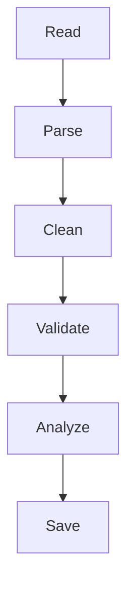
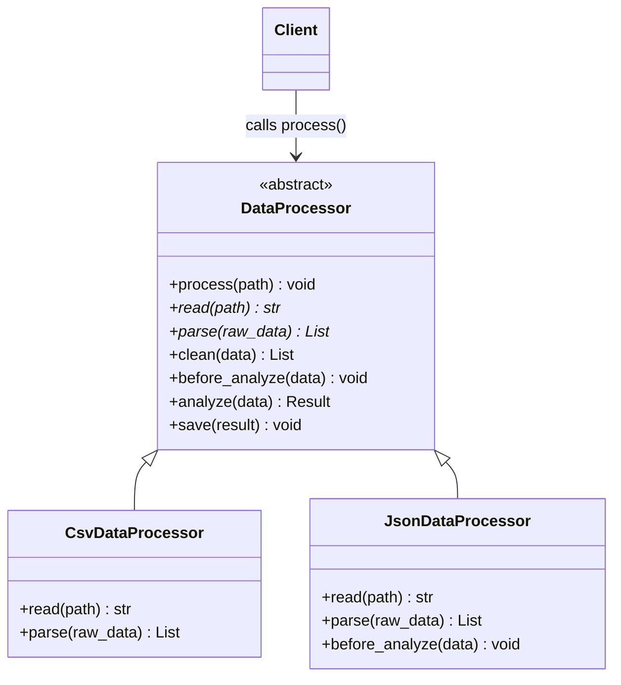
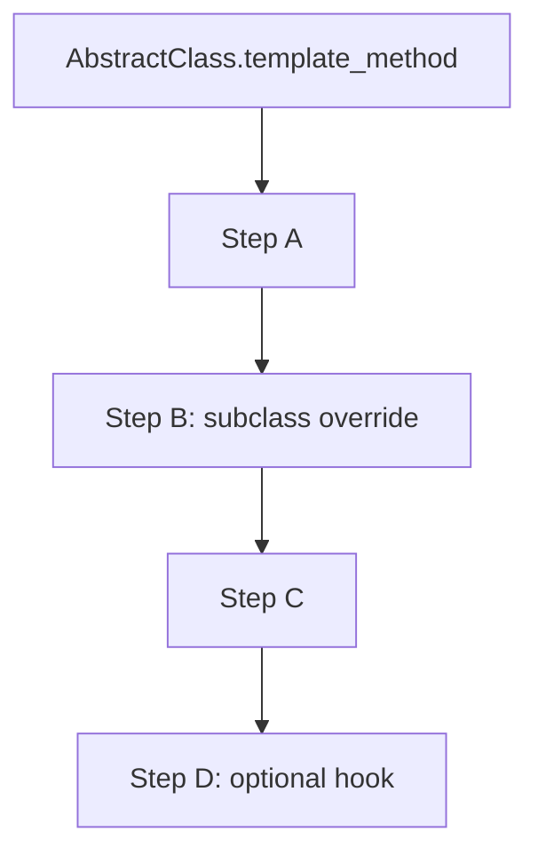
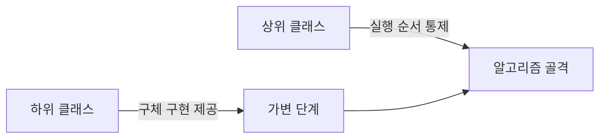

# 템플릿 메서드 패턴 (Template Method Pattern)


## 1. 패턴이 없을 때 발생하는 문제점 (The Problem)

템플릿 메서드 패턴을 적용하지 않고 여러 클래스에서 **전체 처리 과정은 유사하지만 일부 단계만 다른 알고리즘**을 각각 구현할 경우, 동일한 실행 순서와 공통 로직이 각 클래스에 반복해서 나타나는 문제가 발생합니다.

예를 들어 애플리케이션이 CSV 파일 및 JSON 파일을 읽고 데이터를 정제한 뒤 분석 결과를 저장하는 상황을 가정해 보겠습니다.

전체적인 처리 로직은 다음과 같이 동일합니다.

```text
1. 데이터 읽기
2. 데이터 파싱
3. 데이터 정제
4. 데이터 분석
5. 결과 저장

```

하지만 처리하는 파일 형식에 따라 일부 세부 단계에 차이가 존재합니다.

```text
CSV:
    CSV 읽기
    CSV 파싱

JSON:
    JSON 읽기
    JSON 파싱

```

### 패턴을 적용하지 않은 예시

```python
class CsvDataProcessor:

    def process(
        self,
        path: str,
    ) -> None:

        print(
            "[CSV] 파일을 읽습니다."
        )

        raw_data = self._read_csv(
            path
        )

        print(
            "[CSV] 데이터를 파싱합니다."
        )

        data = self._parse_csv(
            raw_data
        )

        print(
            "[Common] 데이터를 정제합니다."
        )

        cleaned = self._clean(
            data
        )

        print(
            "[Common] 데이터를 분석합니다."
        )

        result = self._analyze(
            cleaned
        )

        print(
            "[Common] 결과를 저장합니다."
        )

        self._save(
            result
        )

    def _read_csv(
        self,
        path: str,
    ) -> str:
        ...

    def _parse_csv(
        self,
        raw_data: str,
    ) -> list[dict[str, object]]:
        ...

    def _clean(
        self,
        data: list[dict[str, object]],
    ) -> list[dict[str, object]]:
        ...

    def _analyze(
        self,
        data: list[dict[str, object]],
    ) -> dict[str, object]:
        ...

    def _save(
        self,
        result: dict[str, object],
    ) -> None:
        ...

```

JSON Processor 또한 유사한 구조를 가집니다.

```python
class JsonDataProcessor:

    def process(
        self,
        path: str,
    ) -> None:

        print(
            "[JSON] 파일을 읽습니다."
        )

        raw_data = self._read_json(
            path
        )

        print(
            "[JSON] 데이터를 파싱합니다."
        )

        data = self._parse_json(
            raw_data
        )

        print(
            "[Common] 데이터를 정제합니다."
        )

        cleaned = self._clean(
            data
        )

        print(
            "[Common] 데이터를 분석합니다."
        )

        result = self._analyze(
            cleaned
        )

        print(
            "[Common] 결과를 저장합니다."
        )

        self._save(
            result
        )

```

두 클래스의 실질적인 차이는 일부 단계에 국한됩니다.

```text
CsvDataProcessor:
    read_csv()
    parse_csv()

JsonDataProcessor:
    read_json()
    parse_json()

```

그럼에도 불구하고 전체 `process()` 알고리즘의 제어 흐름이 두 클래스에 그대로 중복 구현되어 있습니다.

이때 모든 Processor에 새로운 검증(Validate) 단계를 추가하는 요구사항이 발생했다고 가정합니다.



이 경우 CSV 및 JSON 클래스를 모두 일일이 수정해야 합니다.

```python
cleaned = self._clean(
    data
)

validated = self._validate(
    cleaned
)

result = self._analyze(
    validated
)

```

만약 XML, Excel, YAML Processor 등이 추가되어 있다면 동일한 수정 작업을 반복해야 합니다.

```text
CsvDataProcessor.process()
JsonDataProcessor.process()
XmlDataProcessor.process()
ExcelDataProcessor.process()
YamlDataProcessor.process()

```

즉, **알고리즘의 실행 순서가 여러 클래스에 중복되어 있으면 전체 알고리즘의 구조를 변경할 때 관련된 모든 구현을 함께 수정해야 하는 비효율이 발생**합니다.

### 이 방식의 주요 단점

* **알고리즘 골격의 중복:** 동일한 처리 순서가 여러 클래스에 걸쳐 반복됩니다.
* **변경의 확산:** 공통 처리 순서를 변경할 때 모든 클래스의 `process()` 메서드를 수정해야 합니다.
* **단계 순서 불일치 가능성:** 특정 구현체에서 실수로 `validate()`보다 `analyze()`를 먼저 호출하는 등 알고리즘 순서가 왜곡될 위험이 있습니다.
* **공통 코드와 가변 코드의 혼재:** 공통 흐름과 파일 형식별 특화 로직이 섞여 코드 파악이 어려워집니다.
* **유지보수 비용 증가:** 새로운 파일 형식을 추가할 때마다 전체 알고리즘을 매번 새로 구현해야 합니다.

---

## 2. 템플릿 메서드 패턴으로 해결하기 (The Solution)

템플릿 메서드 패턴은 "알고리즘의 전체 골격과 실행 순서는 상위 클래스의 Template Method에 정의하고, 가변적인 일부 단계만 하위 클래스에서 재정의하도록 구성하는 방식"으로 문제를 해결합니다.

전형적인 구조는 다음과 같습니다.

```text
AbstractClass
    │
    ├─ template_method()
    │      │
    │      ├─ step1()
    │      ├─ step2()
    │      ├─ common_step()
    │      ├─ hook()
    │      └─ step3()
    │
    ├─ abstract step1()
    ├─ abstract step2()
    ├─ common_step()
    └─ hook()

        ↑
        │

ConcreteClass
    ├─ step1()
    └─ step2()

```

상위 클래스에서 전체 처리 순서를 고정하여 정의합니다.

```python
from abc import ABC, abstractmethod


class DataProcessor(ABC):

    def process(
        self,
        path: str,
    ) -> None:

        raw_data = self.read(
            path
        )

        data = self.parse(
            raw_data
        )

        cleaned = self.clean(
            data
        )

        self.before_analyze(
            cleaned
        )

        result = self.analyze(
            cleaned
        )

        self.save(
            result
        )

```

여기서 `process()` 메서드가 바로 **Template Method** 역할을 수행하며, 전체 실행 순서는 이 메서드 내부에서 단일하게 고정됩니다.

```text
read
 ↓
parse
 ↓
clean
 ↓
before_analyze
 ↓
analyze
 ↓
save

```

파일 형식별로 다르게 동작해야 하는 단계는 추상 메서드로 선언합니다.

```python
@abstractmethod
def read(
    self,
    path: str,
) -> str:
    pass


@abstractmethod
def parse(
    self,
    raw_data: str,
) -> list[
    dict[str, object]
]:
    pass

```

공통 로직 단계는 상위 클래스에서 직접 구체 구현을 작성할 수 있습니다.

```python
def clean(
    self,
    data: list[
        dict[str, object]
    ],
) -> list[
    dict[str, object]
]:

    return [
        row
        for row in data
        if row
    ]

```

필요에 따라 하위 클래스에서 선택적으로 재정의할 수 있는 Hook 메서드도 제공할 수 있습니다.

```python
def before_analyze(
    self,
    data: list[
        dict[str, object]
    ],
) -> None:

    pass

```

CSV Processor는 고유한 세부 단계만 구현합니다.

```python
class CsvDataProcessor(
    DataProcessor
):

    def read(
        self,
        path: str,
    ) -> str:

        print(
            "[CSV] 파일 읽기"
        )

        ...

    def parse(
        self,
        raw_data: str,
    ) -> list[
        dict[str, object]
    ]:

        print(
            "[CSV] 파싱"
        )

        ...

```

JSON Processor도 마찬가지로 가변적인 단계만 재정의합니다.

```python
class JsonDataProcessor(
    DataProcessor
):

    def read(
        self,
        path: str,
    ) -> str:

        print(
            "[JSON] 파일 읽기"
        )

        ...

    def parse(
        self,
        raw_data: str,
    ) -> list[
        dict[str, object]
    ]:

        print(
            "[JSON] 파싱"
        )

        ...

```

클라이언트에서는 동일한 인터페이스로 메서드를 호출합니다.

```python
processor.process(
    "data.csv"
)

```

어떠한 하위 클래스를 사용하더라도 전체 알고리즘은 상위 클래스에서 지정한 일관된 순서에 따라 수행됩니다.

```text
CsvDataProcessor

    read CSV
        ↓
    parse CSV
        ↓
    clean
        ↓
    analyze
        ↓
    save


JsonDataProcessor

    read JSON
        ↓
    parse JSON
        ↓
    clean
        ↓
    analyze
        ↓
    save

```

상위 클래스는 알고리즘의 불변 영역(Invariant Part)을 관할합니다.

```text
step order
common steps
overall control flow

```

하위 클래스는 가변 영역(Variant Part)만을 구체화합니다.

```text
format-specific reading
format-specific parsing
optional hooks

```

본 패턴의 핵심은 단순한 공통 코드의 상위 클래스 이관이 아닙니다.

**변경되어서는 안 되는 알고리즘의 전체 구조와 실행 순서를 상위 클래스에 고정해 두고, 변화가 허용되는 특정 단계만을 하위 클래스의 확장 지점으로 제공하는 것**이 템플릿 메서드 패턴의 본질입니다.

---

## 3. 장점, 단점 및 트레이드오프 (Trade-off)

### 장점 (Pros)

* **알고리즘 골격의 중복 제거:** 여러 하위 클래스에서 반복되던 처리 흐름을 상위 클래스 한곳에서 통합 관리할 수 있습니다.
* **실행 순서의 보장:** 하위 클래스가 세부 단계를 개별 재정의하더라도, 알고리즘의 전체 실행 순서는 상위 클래스가 엄격히 유지합니다.
* **공통 로직 재사용성 향상:** 모든 구현체에 동일하게 적용되는 단계는 상위 클래스에 한 번만 정의하여 재사용합니다.
* **확장 지점의 명확화:** 필수 구현 단계(추상 메서드)와 선택적 재정의 단계(Hook)를 구분하여 명확한 확장 인터페이스를 제공합니다.
* **Hollywood Principle(할리우드 원칙) 적용:** 하위 클래스가 흐름을 제어하는 대신, 상위 클래스가 적절한 시점에 하위 클래스의 메서드를 호출합니다.

```text
"Don't call us,
 we'll call you."

```

구조적 관점의 비교:

```text
Subclass
    → framework flow를 직접 제어 (기존)

```

```text
Framework / Base Class
    → Subclass Hook 호출 (할리우드 원칙 적용)

```

* **공통 알고리즘 수정의 용이성:** 전체 과정에 새로운 공통 단계를 추가할 경우 Template Method만 수정하면 되므로 변경 여파가 최소화됩니다.

### 단점 (Cons)

* **상속에 대한 의존:** 알고리즘 변형을 위해 하위 클래스를 생성해야 하므로 클래스 간 결합도가 높아집니다.
* **런타임 교체의 제약:** 전략 패턴(Strategy)과 달리 실행 시점에 객체 합성만으로 알고리즘 전체를 동적으로 교체하기 어렵습니다.
* **상위-하위 클래스 간의 강한 계약 관계:** 하위 클래스는 상위 Template Method의 내부 동작 흐름과 전제 조건을 명확히 인지하고 있어야 합니다.
* **Hook 과다 제공 시 복잡성 증가:** 오버라이드 포인트(Hook)가 너무 많아지면 전체적인 실행 흐름 추적이 복잡해질 수 있습니다.
* **Fragile Base Class(취약한 상위 클래스) 문제:** 상위 클래스의 내부 구현이 변경되면 하위 클래스의 오버라이드 동작에 의도치 않은 영향을 미칠 수 있습니다.
* **LSP(리스코프 치환 원칙) 위반 위험:** 하위 클래스가 상위 클래스에서 기대하는 세부 단계의 규약을 준수하지 않을 경우 전체 알고리즘의 수행 전제가 무너질 수 있습니다.

### 트레이드오프 (Trade-off)

* **전체 알고리즘 구조는 고정적이고 일부 단계만 변동할 때 유용:** 처리 흐름 자체가 자주 변경되는 구조라면 템플릿 메서드 패턴의 효용성이 낮아집니다.
* **동적 알고리즘 교체가 핵심인 경우 전략 패턴이 적합:** 템플릿 메서드는 상속 기반, 전략 패턴은 합성(Composition) 기반이라는 구조적 차이가 존재합니다.
* **과도한 확장 지점 허용 시 Template의 제어력 약화:** 모든 단계를 재정의 가능하도록 개방하면 상위 클래스가 알고리즘 골격을 보장하기 어렵습니다.
* **확장 지점의 부족 시 재사용성 저하:** 고정할 단계와 Hook으로 개방할 단계를 균형 있게 설계하는 것이 핵심 과제입니다.

---

### Primitive Operation과 Hook

Template Method에서 하위 클래스가 확장할 수 있는 단계는 크게 두 가지 유형으로 분류됩니다.

#### Primitive Operation (기본 연산)

알고리즘의 완성을 위해 하위 클래스에서 반드시 구현해야 하는 필수 단계입니다.

```python
@abstractmethod
def parse(
    self,
    raw_data: str,
):
    ...

```

해당 메서드를 구현하지 않으면 알고리즘이 성립되지 않습니다.

```text
Template Method
    ↓
Required Step
    ↓
Subclass must implement

```

#### Hook (훅)

상위 클래스에 기본 동작(또는 빈 동작)이 정의되어 있으며, 하위 클래스에서 필요에 따라 선택적으로 재정의하는 확장 지점입니다.

```python
def before_analyze(
    self,
    data,
) -> None:

    pass

```

특정 처리가 필요한 하위 클래스에서만 이를 재정의하여 사용합니다.

```python
class AuditedProcessor(
    DataProcessor
):

    def before_analyze(
        self,
        data,
    ) -> None:

        audit(
            data
        )

```

요약하면 다음과 같습니다.

```text
Primitive Operation:
    반드시 구현

Hook:
    선택적으로 구현

```

---

### Template Method와 Strategy의 차이

두 패턴 모두 **알고리즘의 변형**을 다루지만, 적용 방식에 차이가 있습니다.

Template Method는 **상속**을 활용합니다.

```text
Base Algorithm
      │
      ├─ common step
      ├─ abstract step
      └─ hook
             ↑
          subclass

```

Strategy는 **합성**을 활용합니다.

```text
Context
   │
   ↓
Strategy

```

Template Method가 다루는 문제:

```text
"전체 알고리즘은 유지하면서
일부 단계만 어떻게 변경할 것인가?"

```

Strategy가 다루는 문제:

```text
"전체 알고리즘 중 어떤 구현을
사용할 것인가?"

```

핵심 차이 요약:

```text
Template Method:
    Skeleton 고정
    Step 변경

Strategy:
    Algorithm 자체 교체

```

또한 Template Method는 주로 클래스 정의 시점에 변형이 결정되는 반면, Strategy는 런타임에 동적으로 알고리즘을 교체하기 용이합니다.

---

### Template Method와 Factory Method의 관계

Factory Method는 Template Method 내부의 특정 생성 단계로 자주 활용됩니다.

```python
def process(self):

    parser = (
        self.create_parser()
    )

    data = parser.parse()

    self.save(
        data
    )

```

위 구조에서 `create_parser()`가 Factory Method 역할을 담당합니다.

```text
Template Method
    │
    ├─ create_parser()
    │       ↑
    │   Factory Method
    │
    ├─ parse()
    └─ save()

```

즉, Factory Method는 **객체 생성 단계에 특화된 확장 지점**이며, Template Method는 **전체 알고리즘 실행 골격에 대한 확장 구조**입니다.

---

### Template Method와 State의 차이

Template Method는 알고리즘의 execution order(실행 순서)를 상위 클래스가 결정합니다.

```text
Step A
 ↓
Step B
 ↓
Step C

```

State 패턴은 객체의 현재 상태(State)에 따라 수행할 행동을 결정합니다.

```text
Pending
   ↓
Paid
   ↓
Shipped

```

차이점 비교:

```text
Template Method:
    알고리즘의 단계 구조

State:
    상태에 따른 행동 변화

```

---

### Template Method와 Command의 차이

Command 패턴은 연산 요청 자체를 독립된 객체로 캡슐화합니다.

```text
Command
    execute()

```

Template Method는 단일 알고리즘 내부에서의 **단계와 실행 순서**를 규정합니다.

```text
Template
   ↓
Step A
   ↓
Step B
   ↓
Step C

```

Command 객체의 `execute()` 내부에서 Template Method를 호출하는 방식으로 연계하여 사용할 수 있습니다.

---

## 4. 파이썬 오픈소스에서 볼 수 있는 템플릿 메서드와 유사한 설계

파이썬 표준 라이브러리 및 주요 프레임워크에는 **상위 클래스나 프레임워크가 전체 실행 흐름을 통제하고, 사용자는 특정 Hook이나 하위 메서드만 구현하도록 하는 패턴**이 광범위하게 적용되어 있습니다.

단, 아래 사례들이 GoF 템플릿 메서드 패턴의 표준 클래스 구조와 완전히 동일하다기보다는, "고정된 실행 골격 + 재정의 가능한 세부 단계"라는 메커니즘을 공유하는 유사 사례로 이해하는 것이 적절합니다.

### `unittest.TestCase`

Python의 `unittest.TestCase` 라이프사이클 관리는 템플릿 메서드 메커니즘을 대표하는 사례입니다.

`TestCase`를 상속받는 사용자는 테스트 메서드와 함께 필요 시 `setUp()` 및 `tearDown()` Hook을 구현합니다.

```python
import unittest


class UserServiceTest(
    unittest.TestCase
):

    def setUp(self):
        self.service = (
            create_service()
        )

    def test_create_user(self):
        ...

    def tearDown(self):
        self.service.close()

```

프레임워크 내부에서는 다음과 같은 단계를 거쳐 실행을 통제합니다.

```text
TestCase.run()
      │
      ↓
   setUp()
      │
      ↓
 test method
      │
      ↓
  tearDown()

```

`setUp()`은 테스트 메서드 수행 직전에 실행되며, `setUp()`이 성공하면 테스트의 성공/실패 여부와 관계없이 `tearDown()`이 호출되도록 흐름이 관리됩니다. `TestCase.run()` 메서드가 전체 실행 및 결과 수집 흐름을 관장하므로, 개발자는 전체 테스트 라이프사이클을 직접 제어할 필요 없이 필요한 단계만 작성합니다.

구조적 대입:

```text
Template Method:
    TestCase.run()

Hooks / Primitive Operations:
    setUp()
    test method
    tearDown()

```

---

### `http.server.BaseHTTPRequestHandler`

Python 표준 라이브러리의 `BaseHTTPRequestHandler` 역시 프레임워크가 공통 HTTP 요청 처리 흐름을 통제하고, 하위 클래스가 메서드별 Hook을 구현하는 구조를 취합니다.

`handle()` 및 `handle_one_request()`가 요청을 수신하여 파싱한 후, 요청된 HTTP Method에 따라 대응하는 `do_*()` 메서드로 디스패치합니다. 사용자는 `handle()`을 직접 오버라이드하기보다 `do_GET()`, `do_POST()` 등의 메서드를 구현합니다.

```python
from http.server import (
    BaseHTTPRequestHandler,
)


class MyHandler(
    BaseHTTPRequestHandler
):

    def do_GET(self):

        self.send_response(
            200
        )

        self.end_headers()

        self.wfile.write(
            b"Hello"
        )

```

내부 실행 처리 흐름:

```text
handle()
   ↓
handle_one_request()
   ↓
request parsing
   ↓
HTTP Method dispatch
   ↓
do_GET() / do_POST()

```

사용자는 공통 HTTP 파싱 및 분기 알고리즘을 새로 작성하지 않고, 개별 HTTP 요청 처리 단계만 구현하면 됩니다. 이는 **상위 클래스가 제어하는 알고리즘 골격과 하위 클래스의 Hook 연동**이라는 템플릿 메서드의 특성을 잘 보여줍니다.

---

### Django Class-Based Views

Django의 클래스 기반 뷰(CBV) 또한 상위 클래스가 요청 처리 라이프사이클을 관장하고, 하위 클래스가 특정 메서드를 재정의하도록 설계되어 있습니다.

`View` 클래스의 요청 흐름은 `setup()`을 거쳐 `dispatch()`로 이어집니다. `dispatch()`는 HTTP 메서드를 검증한 뒤 `get()`, `post()` 등 해당하는 메서드로 처리를 위임합니다. (`setup()` 재정의 시에는 `super()` 호출이 필수적입니다.)

```python
from django.http import (
    HttpResponse,
)
from django.views import View


class HelloView(View):

    def get(
        self,
        request,
        *args,
        **kwargs,
    ):

        return HttpResponse(
            "Hello"
        )

```

개념적 처리 순서:

```text
as_view()
   ↓
setup()
   ↓
dispatch()
   ↓
get() / post() / ...

```

아울러 `TemplateView` 등 Generic CBV는 기본적인 라이프사이클 구조를 상속받은 상태에서 `get_context_data()`와 같은 특정 확장 지점만 오버라이드하여 동작을 커스터마이징할 수 있습니다.

믹스인(Mix-in)과 다중 상속이 함께 사용되므로 단일 템플릿 메서드 패턴으로만 한정할 수는 없으나, **프레임워크가 전체 흐름 소유권을 갖고 사용자는 정해진 Hook만 재정의한다는 구조적 관점**에서 동일한 설계 패턴을 공유합니다.

---

## 5. 클래스 다이어그램



구성요소별 역할:

```text
Abstract Class:
    DataProcessor

Template Method:
    process()

Primitive Operations:
    read()
    parse()

Concrete Operations:
    clean()
    analyze()
    save()

Hook:
    before_analyze()

Concrete Classes:
    CsvDataProcessor
    JsonDataProcessor

```

호출 및 오버라이딩 관계:

```text
DataProcessor.process()
        │
        ├─ read() ----------┐
        │                   │
        ├─ parse() ---------┤ override
        │                   │
        ├─ clean()          │
        │                   │
        ├─ before_analyze() ┤ optional hook
        │                   │
        ├─ analyze()        │
        │                   │
        └─ save()           │
                            │
               Csv / Json ──┘

```

하위 클래스는 실행 순서 결정에 관여하지 않습니다.

```text
Subclass:
    "내가 호출되는 시점과 순서는 상위 클래스가 결정한다."

```

---

## 6. 파이썬 예제 코드

```python
from abc import ABC, abstractmethod
from dataclasses import dataclass
import csv
import io
import json


# -------------------------------------------------------------------
# 1. Domain Model
# -------------------------------------------------------------------

@dataclass(frozen=True)
class Record:
    name: str
    value: int


@dataclass(frozen=True)
class AnalysisResult:
    count: int
    total: int
    average: float


# -------------------------------------------------------------------
# 2. Abstract Class
# -------------------------------------------------------------------

class DataProcessor(ABC):

    # ---------------------------------------------------------------
    # Template Method
    # ---------------------------------------------------------------

    def process(
        self,
        source: str,
    ) -> AnalysisResult:

        print(
            "1. 데이터를 읽습니다."
        )

        raw_data = self.read(
            source
        )

        print(
            "2. 데이터를 파싱합니다."
        )

        records = self.parse(
            raw_data
        )

        print(
            "3. 데이터를 정제합니다."
        )

        cleaned = self.clean(
            records
        )

        # Optional Hook
        self.before_analyze(
            cleaned
        )

        print(
            "4. 데이터를 분석합니다."
        )

        result = self.analyze(
            cleaned
        )

        print(
            "5. 결과를 저장합니다."
        )

        self.save(
            result
        )

        # Optional Hook
        self.after_process(
            result
        )

        return result


    # -------------------------------------------------------------------
    # 3. Primitive Operations
    # -------------------------------------------------------------------

    @abstractmethod
    def read(
        self,
        source: str,
    ) -> str:
        pass

    @abstractmethod
    def parse(
        self,
        raw_data: str,
    ) -> list[Record]:
        pass


    # -------------------------------------------------------------------
    # 4. Concrete Operations
    # -------------------------------------------------------------------

    def clean(
        self,
        records: list[Record],
    ) -> list[Record]:

        return [
            record
            for record in records
            if record.value >= 0
        ]

    def analyze(
        self,
        records: list[Record],
    ) -> AnalysisResult:

        count = len(
            records
        )

        total = sum(
            record.value
            for record in records
        )

        average = (
            total / count
            if count
            else 0.0
        )

        return AnalysisResult(
            count=count,
            total=total,
            average=average,
        )

    def save(
        self,
        result: AnalysisResult,
    ) -> None:

        print(
            "[Save] "
            f"count={result.count}, "
            f"total={result.total}, "
            f"average={result.average:.2f}"
        )


    # -------------------------------------------------------------------
    # 5. Hooks
    # -------------------------------------------------------------------

    def before_analyze(
        self,
        records: list[Record],
    ) -> None:

        # 기본 동작 없음 (선택적 재정의용)
        pass

    def after_process(
        self,
        result: AnalysisResult,
    ) -> None:

        # 기본 동작 없음 (선택적 재정의용)
        pass


# -------------------------------------------------------------------
# 6. Concrete Class - CSV
# -------------------------------------------------------------------

class CsvDataProcessor(
    DataProcessor
):

    def read(
        self,
        source: str,
    ) -> str:

        print(
            "[CSV] 소스를 읽습니다."
        )

        return source

    def parse(
        self,
        raw_data: str,
    ) -> list[Record]:

        reader = csv.DictReader(
            io.StringIO(
                raw_data
            )
        )

        return [
            Record(
                name=row["name"],
                value=int(
                    row["value"]
                ),
            )
            for row in reader
        ]


# -------------------------------------------------------------------
# 7. Concrete Class - JSON
# -------------------------------------------------------------------

class JsonDataProcessor(
    DataProcessor
):

    def read(
        self,
        source: str,
    ) -> str:

        print(
            "[JSON] 소스를 읽습니다."
        )

        return source

    def parse(
        self,
        raw_data: str,
    ) -> list[Record]:

        values = json.loads(
            raw_data
        )

        return [
            Record(
                name=item["name"],
                value=int(
                    item["value"]
                ),
            )
            for item in values
        ]

    def before_analyze(
        self,
        records: list[Record],
    ) -> None:

        print(
            "[JSON Hook] "
            f"{len(records)}개의 "
            "레코드를 분석합니다."
        )


# -------------------------------------------------------------------
# 8. Client
# -------------------------------------------------------------------

def run_processor(
    processor: DataProcessor,
    source: str,
) -> None:

    result = processor.process(
        source
    )

    print(
        "결과:",
        result,
    )


# -------------------------------------------------------------------
# 9. 실행 (Usage)
# -------------------------------------------------------------------

if __name__ == "__main__":

    csv_source = """name,value
sword,100
shield,80
invalid,-10
"""

    json_source = """
[
    {
        "name": "sword",
        "value": 100
    },
    {
        "name": "shield",
        "value": 80
    },
    {
        "name": "invalid",
        "value": -10
    }
]
"""

    print(
        "=== CSV ==="
    )

    run_processor(
        CsvDataProcessor(),
        csv_source,
    )

    print(
        "\n=== JSON ==="
    )

    run_processor(
        JsonDataProcessor(),
        json_source,
    )

```

클라이언트에서는 구현체 종류와 상관없이 템플릿 메서드만을 동일하게 호출합니다.

```python
processor.process(
    source
)

```

CSV 실행 시 호출되는 단계 순서:

```text
DataProcessor.process()
       │
       ↓
CsvDataProcessor.read()
       │
       ↓
CsvDataProcessor.parse()
       │
       ↓
DataProcessor.clean()
       │
       ↓
DataProcessor.before_analyze()
       │
       ↓
DataProcessor.analyze()
       │
       ↓
DataProcessor.save()

```

JSON 실행 시 호출되는 단계 순서 (Hook 재정의 포함):

```text
DataProcessor.process()
       │
       ↓
JsonDataProcessor.read()
       │
       ↓
JsonDataProcessor.parse()
       │
       ↓
DataProcessor.clean()
       │
       ↓
JsonDataProcessor.before_analyze()
       │
       ↓
DataProcessor.analyze()
       │
       ↓
DataProcessor.save()

```

모든 하위 클래스는 알고리즘 전체를 제어하는 다음과 같은 코드를 직접 보유하지 않습니다.

```python
raw = self.read(...)
data = self.parse(...)
cleaned = self.clean(...)
result = self.analyze(...)
self.save(...)

```

해당 제어 흐름은 오직 상위 클래스의 Template Method 내에만 존재합니다.

---

### Template Method를 재정의하면 안 되는 이유

Template Method의 본래 목적은 전체 알고리즘의 실행 순서를 고정하는 데 있습니다.

만약 하위 클래스에서 다음과 같이 Template Method를 임의로 재정의(Override)할 경우,

```python
def process(
    self,
    source: str,
):
    ...

```

상위 클래스가 보장해야 하는 전체 알고리즘의 제어 규약과 순서가 깨지게 됩니다.

Java나 C++ 등의 언어에서는 `final` 키워드를 사용해 Template Method의 재정의를 언어 차원에서 차단하는 것이 일반적입니다.

Python은 언어 구조상 완전한 오버라이드 금지 제약을 기본 제공하지 않지만, 정적 타입 검사 단계에서 `typing.final` 데코레이터를 활용하여 재정의 금지 의도를 명시할 수 있습니다.

```python
from typing import final


class DataProcessor(ABC):

    @final
    def process(
        self,
        source: str,
    ) -> AnalysisResult:
        ...

```

이 방식을 통해 Template Method가 고정된 알고리즘 골격임을 코드상에 명확히 나타낼 수 있습니다.

---

## 부록 (Appendix): 현대적 타입 시스템과 함수형 관점의 재해석

템플릿 메서드 패턴을 현대적인 타입 시스템 및 함수형 프로그래밍 관점에서 재해석하면, 본 패턴이 해결하고자 하는 문제는 "고정된 제어 흐름과 변동되는 계산 단계를 어떻게 구조적으로 분리할 것인가"에 해당합니다.

전통적인 객체지향 프로그래밍(OOP)에서는 상속을 활용하여 이 문제를 다룹니다.

```text
Base Class

    Template Method
        │
        ├─ Fixed Step
        ├─ Abstract Step
        ├─ Hook
        └─ Fixed Step

            ↑

        Subclass

```

즉, 고정된 제어 흐름(Control Flow)과 재정의 가능한 연산(Operation)의 결합 방식입니다.

이를 함수형 시각으로 추상화하면 다음 질문으로 귀결됩니다.

**"알고리즘의 실행 구조는 단일 함수로 고정하되, 변동이 필요한 단계만 함수·타입·효과(Effect) 등의 인자(Parameter)로 전달받아 처리할 수 없는가?"**

본 부록에서는 개념적 이해를 돕기 위해 **고차 함수, 일급 함수, 타입클래스, Associated Type, Effect System, Linear Resource, Refinement Type, Typestate 구조를 지원하는 가상의 Python 확장 문법**을 가정한 예시 코드를 사용합니다. *(※ 아래 제시된 코드는 실제 Python 표준 실행 구문이 아닌 가상의 표기법입니다.)*

### 1. Template Method를 고차 함수로 표현하기

객체지향 방식의 Template Method 구조:

```python
def process(self):

    raw =
        self.read()

    data =
        self.parse(raw)

    cleaned =
        self.clean(data)

    result =
        self.analyze(cleaned)

    self.save(result)

```

위 로직에서 가변적인 부분이 `read`와 `parse` 단계로 국한된다고 정의합니다.

이를 고차 함수 형태로 변환하면 각 단계를 인자로 주입받아 처리할 수 있습니다.

```python
def process[
    Raw,
    Data,
    Result,
](
    source: Source,

    read:
        Source -> Raw,

    parse:
        Raw -> Data,

    clean:
        Data -> Data,

    analyze:
        Data -> Result,

    save:
        Result -> Unit,
) -> Result:

    raw =
        read(
            source
        )

    data =
        parse(
            raw
        )

    cleaned =
        clean(
            data
        )

    result =
        analyze(
            cleaned
        )

    save(
        result
    )

    return result

```

전체 실행 제어 순서는 `process()` 고차 함수가 통제합니다.

```text
read
 ↓
parse
 ↓
clean
 ↓
analyze
 ↓
save

```

가변적인 세부 단계는 함수 타입의 인자로 외부에서 제공받습니다.

객체지향에서의 **하위 클래스 오버라이딩(Subclass Override)** 방식이 **함수 매개변수화(Function Parameterization)** 방식으로 대체된 구조입니다.

---

### 2. 상속 기반 확장을 함수 매개변수화로 바꾸기

객체지향 방식에서는 상속 계층을 형성합니다.

```text
DataProcessor
     ↑
     ├─ CsvProcessor
     └─ JsonProcessor

```

함수형 관점에서는 필요한 함수 조합을 전달하는 방식으로 표현합니다.

```python
csv_processor =
    process(
        read=read_csv,
        parse=parse_csv,
        ...
    )

```

```python
json_processor =
    process(
        read=read_json,
        parse=parse_json,
        ...
    )

```

변환 관계:

```text
Inheritance (상속)
    ↓
Parameterization (매개변수화)

```

이를 통해 상속을 사용하지 않고도 **변화하는 단계를 확장 지점으로 분리한다**는 템플릿 메서드의 목적을 달성할 수 있습니다.

---

### 3. 여러 Step을 하나의 Operations Record로 묶기

전달할 단계별 함수 개수가 많아지면 인자 목록이 복잡해질 수 있습니다.

```python
process(
    source,
    read,
    parse,
    clean,
    analyze,
    save,
    ...
)

```

관련된 단계들을 하나의 연산 레코드(Operations Record) 구조체로 그룹화합니다.

```python
record ProcessingOps[
    Raw,
    Data,
    Result,
]:

    read:
        Source -> Raw

    parse:
        Raw -> Data

    clean:
        Data -> Data

    analyze:
        Data -> Result

    save:
        Result -> Unit

```

Template 함수 표기:

```python
def process(
    source,
    using ops:
        ProcessingOps,
):

    raw =
        ops.read(
            source
        )

    data =
        ops.parse(
            raw
        )

    cleaned =
        ops.clean(
            data
        )

    result =
        ops.analyze(
            cleaned
        )

    ops.save(
        result
    )

```

객체지향의 추상 클래스 역할이 **함수들의 레코드/사전(Record/Dictionary)** 개념으로 치환됩니다.

---

### 4. Hook을 `Option[Function]`으로 표현하기

전통적인 Hook 메서드는 상위 클래스에서 빈 상태로 정의됩니다.

```python
def before_analyze(
    self,
    data,
):
    pass

```

함수형 타입 시스템에서는 이를 Optional 함수 타입으로 명시할 수 있습니다.

```python
before_analyze:
    Option[
        Data -> Unit
    ]

```

Template 처리 로직:

```python
match before_analyze:

    case Some(hook):
        hook(
            data
        )

    case None:
        pass

```

개념적 변화:

```text
Empty virtual method (가상 메서드)
    ↓
Optional Function (선택적 함수 인자)

```

선택적 확장 지점이라는 성격이 타입 정의 자체에 명시적으로 드러나게 됩니다.

---

### 5. Required Step과 Optional Hook을 타입으로 구분하기

OOP 구조에서는 추상 메서드와 기본 구현 메서드로 필수/선택 단계를 구분합니다.

```text
Required:
    @abstractmethod

Optional:
    default method

```

가상 타입 시스템에서는 레코드 분리를 통해 이를 표현합니다.

```python
record ProcessingTemplate:

    required:
        RequiredSteps

    hooks:
        OptionalHooks

```

```python
record RequiredSteps:

    read:
        Source -> Raw

    parse:
        Raw -> Data

```

```python
record OptionalHooks:

    before_analyze:
        Option[
            Data -> Unit
        ]

    after_save:
        Option[
            Result -> Unit
        ]

```

필수 구현 요구사항과 선택적 확장 지점이 정적 타입 수준에서 구분됩니다.

---

### 6. Template Method 자체를 `final`로 강제하기

Template Method 패턴의 기본 전제:

```text
알고리즘의 전체 실행 골격은
외부나 하위 구현에서 변경할 수 없다.

```

가상 타입 시스템에서의 선언 예시:

```python
final def process(
    self,
    source: Source,
) -> Result:
    ...

```

임의로 오버라이드를 시도할 경우 컴파일 타임에 오류가 발생합니다.

```python
override def process(...):
    ...

```

```text
Type Error:
process() is final and cannot be overridden.

```

언어 차원에서 고정된 골격과 가변 단계를 엄격히 구분하게 됩니다.

---

### 7. override 가능한 메서드도 명시적으로 제한할 수 있다

클래스 내부의 모든 메서드를 오버라이드 가능하게 개방할 필요는 없습니다.

```python
sealed template DataProcessor:

    final def process(...)

    abstract def read(...)

    abstract def parse(...)

    virtual def before_analyze(...)

    private def validate_internal(...)

```

각 구성 요소의 변경 및 확장 가능 범위를 명확히 규정합니다.

```text
final:
    변경 및 재정의 불가

abstract:
    하위에서 반드시 구현

virtual:
    선택적 재정의 허용 (Hook)

private:
    외부 확장 불가능한 내부 로직

```

---

### 8. 각 Step의 사전 조건과 사후 조건을 타입으로 표현하기

Template Method 내부에는 각 단계 간 실행 조건에 대한 암묵적 계약이 존재합니다.

```text
parse() 수행 결과는 구조화된 데이터 형태여야 함
clean() 수행 결과는 유효하지 않은 데이터가 제거된 상태여야 함

```

Refinement Type(정제 타입)을 적용한 표현:

```python
type RawData
type ParsedData

```

```python
type CleanData =
    ParsedData
    where
        all_rows_valid

```

단계별 함수 규약:

```python
def clean(
    data: ParsedData,
) -> CleanData:
    ...

```

분석 단계 함수:

```python
def analyze(
    data: CleanData,
) -> Result:
    ...

```

`analyze()`에 정제되지 않은 `ParsedData`를 전달할 경우 타입 오류가 발생합니다.

```text
RawData
    ↓ parse
ParsedData
    ↓ clean
CleanData
    ↓ analyze
Result

```

단계 간 전제 조건을 정적 타입 시스템으로 검증할 수 있습니다.

---

### 9. 단계 자체를 Typestate로 표현하기

전체 처리 과정의 상태 변화를 다음과 같이 정의합니다.

```text
Unloaded → Loaded → Parsed → Cleaned → Analyzed → Saved

```

각 상태를 독립된 타입으로 선언합니다.

```python
data Unloaded
data Loaded
data Parsed
data Cleaned
data Analyzed
data Saved

```

상태를 포함하는 컨텍스트 레코드:

```python
record Process[
    State,
    Data,
]:
    data: Data

```

단계별 상태 전이 함수:

```python
def read(
    process:
        Process[
            Unloaded,
            Source,
        ],
) -> Process[
    Loaded,
    RawData,
]:
    ...

```

```python
def parse(
    process:
        Process[
            Loaded,
            RawData,
        ],
) -> Process[
    Parsed,
    ParsedData,
]:
    ...

```

```python
def analyze(
    process:
        Process[
            Cleaned,
            CleanData,
        ],
) -> Process[
    Analyzed,
    Result,
]:
    ...

```

올바르지 않은 순서로 단계를 호출하면 정적 타입 에러가 발생합니다.

```python
analyze(
    loaded_data
)

```

```text
Type Error:
analyze requires: Process[Cleaned, ...]
found: Process[Loaded, ...]

```

런타임에 보장되던 순서 제약 조건을 **Typestate 프로토콜**을 통해 컴파일 타임 안전성으로 강화한 형태입니다.

---

### 10. Template을 Pipeline Composition으로 표현하기

독립된 각 연산 단계를 파이프라인으로 합성하여 전체 알고리즘을 구성할 수 있습니다.

```python
pipeline =
    read
    >> parse
    >> clean
    >> analyze
    >> save

```

파이프라인의 입출력 타입 흐름:

```text
Source
  ↓ read
Raw
  ↓ parse
Data
  ↓ clean
CleanData
  ↓ analyze
Result
  ↓ save
Unit

```

상위 클래스 제어 메서드 기반의 순서 고정이 **함수 합성 파이프라인 구조**로 전환됩니다.

---

### 11. Pipeline을 데이터로 만들면 순서를 검사할 수 있다

파이프라인 자체를 데이터 구조화하여 선언할 수 있습니다.

```python
data Step[
    Input,
    Output,
] =
    ...

```

```python
pipeline = [
    ReadStep,
    ParseStep,
    CleanStep,
    AnalyzeStep,
    SaveStep,
]

```

타입 검사기를 통해 각 연결 단계의 입출력 일치 여부를 검증합니다.

```text
Step[A, B] >> Step[B, C]  -->  Valid
Step[A, B] >> Step[X, C]  -->  Invalid (B != X)

```

메서드 내부에 은닉되어 있던 알고리즘 구조가 **검증 가능한 파이프라인 데이터**로 명시됩니다.

---

### 12. Template Method와 Strategy의 차이를 함수 타입으로 표현하기

Strategy 패턴의 일반적인 함수 타입 표기:

```python
type Strategy[
    A,
    B,
] =
    A -> B

```

즉, **알고리즘 전체 처리 함수** 하나를 교체하는 방식입니다.

Template Method의 함수 타입 표기:

```python
def template(
    step1: A -> B,
    step2: B -> C,
    step3: C -> D,
) -> D:
    ...

```

전체 조합 흐름은 고정된 상태에서 세부 구성 요소 함수들만 주입받습니다.

타입 관점에서의 핵심 차이:

```text
Strategy:
    단일 전체 연산의 선택 (A -> B)

Template Method:
    고정된 합성 구조 내 세부 함수 주입

```

---

### 13. Strategy를 Template의 한 Step으로 사용할 수 있다

두 패턴은 상호 배타적이지 않으며 결합하여 사용 가능합니다.

```text
Read
 ↓
Parse
 ↓
Analyze  (가변 전략 적용)
 ↓
Save

```

분석(Analyze) 단계에만 다양한 전략 구현체를 주입받도록 구성할 수 있습니다.

```python
def process(
    source,
    analyze_strategy:
        Data -> Result,
):

    data =
        ...

    result =
        analyze_strategy(
            data
        )

    ...

```

구조적 합성:

```text
Template Method
    │
    ├─ fixed read
    ├─ fixed parse
    ├─ Strategy analyze
    └─ fixed save

```

---

### 14. Template Step이 Effectful하면 각 단계의 효과도 타입에 나타낼 수 있다

실제 처리 단계별 부수 효과(Effect)가 다를 수 있습니다.

```text
read    → File I/O
parse   → Pure
clean   → Pure
analyze → Database
save    → File I/O

```

Effect System 적용 예시:

```python
def read(
    source: Path,
) -> Raw
    ! FileSystem:
    ...

```

```python
def parse(
    raw: Raw,
) -> Data:
    ...

```

```python
def analyze(
    data: CleanData,
) -> Result
    ! Database:
    ...

```

Template의 전체 부수 효과는 세부 단계들의 효과 집합으로 합성됩니다.

```python
def process(
    source: Path,
) -> Result
    ! FileSystem
    + Database:
    ...

```

알고리즘 수행 시 발생하는 외부 영향을 명시적인 타입 정보로 파악할 수 있습니다.

---

### 15. Effect Polymorphism으로 Template을 재사용하기

Template 실행 골격 자체는 구체적인 I/O 처리 방식에 의존하지 않도록 다형성을 부여할 수 있습니다.

```python
def process(
    source: Source,
) -> Result
    ! Reader
    + Writer:
    ...

```

운영 환경에서의 핸들러 바인딩:

```python
handle Reader
with LocalFileSystem:

    handle Writer
    with LocalFileSystem:

        process(
            source
        )

```

테스트 환경에서의 핸들러 바인딩:

```python
handle Reader
with InMemoryReader:

    handle Writer
    with FakeWriter:

        process(
            source
        )

```

Hook을 통한 세부 로직 변경뿐 아니라, **외부 환경과의 상호작용(Effect) 방식까지 분리하여 동적으로 주입**할 수 있습니다.

---

### 16. 오류 처리를 Template에 중앙화하기

처리 과정 중 발생할 수 있는 오류의 유형:

```text
ReadError
ParseError
ValidationError
SaveError

```

단계별 예외/오류 반환 타입:

```python
read:
    Source
        -> Result[
            Raw,
            ReadError
        ]

```

```python
parse:
    Raw
        -> Result[
            Data,
            ParseError
        ]

```

Template 내부의 모나딕(Monadic) 오류 제어 흐름:

```python
def process(
    source: Source,
) -> Result[
    ResultData,
    ProcessingError,
]:

    raw <-
        read(
            source
        )

    data <-
        parse(
            raw
        )

    cleaned <-
        clean(
            data
        )

    result <-
        analyze(
            cleaned
        )

    save(
        result
    )

    return Ok(
        result
    )

```

개별 단계마다 반복되던 오류 처리 및 전파 제어 로직을 Template 수준으로 통합할 수 있습니다.

---

### 17. 오류 타입을 하나의 ADT로 합칠 수 있다

전체 파이프라인 오류를 대수적 데이터 타입(ADT)으로 정의합니다.

```python
data ProcessingError =

    ReadFailed(
        ReadError
    )

  | ParseFailed(
        ParseError
    )

  | ValidationFailed(
        ValidationError
    )

  | SaveFailed(
        SaveError
    )

```

전체 알고리즘의 예외 가능 범위를 단일 타입으로 표현합니다.

```text
Template Method

    성공 시: Result
    실패 시: ProcessingError

```

알고리즘의 정상 제어 흐름뿐만 아니라 **오류 제어 흐름(Error Flow)** 또한 Template 표준 구조에 포함됩니다.

---

### 18. Resource Safety 자체도 Template으로 볼 수 있다

자원 처리 알고리즘의 고정된 실행 순서:

```text
Open Resource → Use Resource → Close Resource

```

실패 여부와 관계없이 자원을 해제해야 하는 구조를 고차 함수로 정의할 수 있습니다 (`bracket`).

```python
def bracket[
    Resource,
    Result,
](
    acquire:
        () -> Resource,

    use:
        Resource -> Result,

    release:
        Resource -> Unit,
) -> Result:
    ...

```

기본 자원 관리 골격:

```text
acquire
   ↓
use
   ↓
release

```

사용자는 자원의 **획득, 사용, 해제 방식**에 관한 구체 로직만 인자로 제공합니다.

이는 템플릿 메서드의 구조적 아이디어를 상속 없이 자원 안전성을 보장하는 고차 함수(Resource-safe Higher-Order Function)로 구현한 형태입니다.

---

### 19. `with` / RAII도 고정된 Lifecycle Template의 한 형태로 볼 수 있다

자원 해제를 위한 Protocol 인터페이스:

```python
trait Resource[
    R
]:

    def acquire() -> R

    def release(
        value: R
    ) -> Unit

```

구문 활용:

```python
with resource():

    perform_work()

```

내부 라이프사이클 통제:

```text
Acquire
   ↓
Body (작업 수행)
   ↓
Release

```

호출자는 본문(Body) 로직만 제공하고 라이프사이클 관리는 프레임워크/문법이 담당하므로, 템플릿 메서드의 일반화된 적용례로 볼 수 있습니다.

---

### 20. Hook 순서 의존성을 타입으로 줄일 수 있다

Hook이 과도하게 추가될 경우 단계 간의 실행 순서 파악이 모호해질 위험이 있습니다.

```text
before_parse()
after_parse()
before_clean()
after_clean()
before_analyze()
after_analyze()

```

각 처리 단계의 인자 및 반환 타입을 명확히 정의함으로써 순서 의존성을 정적 타입 수준에서 명시합니다.

```python
before_analyze:
    Cleaned -> Cleaned

after_analyze:
    Analyzed -> Analyzed

```

각 Hook이 수용하고 반환하는 데이터 타입을 통해 수행 시점과 계약 관계가 명확해집니다.

---

### 21. 하위 클래스가 부모 내부 상태에 접근하지 않도록 Capability를 사용할 수 있다

전통적 템플릿 메서드에서는 하위 클래스가 상위 클래스의 `protected` 멤버에 직접 접근함으로써 결합도가 높아지는 문제가 존재했습니다.

```text
Subclass
    ↓ (직접 접근)
BaseClass protected fields

```

필요한 권한/기능만을 Capability 객체 형태로 전달합니다.

```python
capability ParseContext:

    def locale()
        -> Locale

    def schema()
        -> Schema

```

```python
parse:
    Raw
        -> Data
    using ParseContext

```

세부 단계 함수가 상위 클래스의 전체 컨텍스트에 의존하지 않고, 전달받은 Capability 인터페이스에만 의존하도록 결합도를 낮춥니다.

---

### 22. Template Skeleton 자체를 Algebra로 볼 수 있다

전체 알고리즘 연산 단계를 대수 구조(Algebra)로 정의합니다.

```python
trait ProcessingAlgebra[
    F[_]
]:

    def read(
        source: Source,
    ) -> F[Raw]

    def parse(
        raw: Raw,
    ) -> F[Data]

    def clean(
        data: Data,
    ) -> F[CleanData]

    def analyze(
        data: CleanData,
    ) -> F[Result]

    def save(
        result: Result,
    ) -> F[Unit]

```

Template은 선언된 대수 연산들의 실행 조합으로 프로그램을 구성합니다.

```python
def processing_program[
    F[_]
](
    source: Source,
) -> F[Result]
where ProcessingAlgebra[F]:

    raw <-
        read(
            source
        )

    data <-
        parse(
            raw
        )

    clean <-
        clean(
            data
        )

    result <-
        analyze(
            clean
        )

    save(
        result
    )

    return result

```

실행 순서는 프로그램 로직으로 고정되며, 각 연산의 실질적 의미는 해석기(Interpreter)의 구현에 따라 결정됩니다.

---

### 23. 하나의 Template에 여러 Interpreter를 사용할 수 있다

운영 환경용 해석기 (Production Interpreter):

```text
Read: 실제 파일 읽기
Parse: 실제 파서 연산
Save: 실제 DB 저장

```

테스트 환경용 해석기 (Test Interpreter):

```text
Read: 메모리 데이터 제공
Parse: 테스트용 Mock 파서
Save: 저장 여부 기록

```

추적용 해석기 (Tracing Interpreter):

```text
모든 Step의 실행 로그 기록

```

구조적 관계:

```text
Fixed Algorithm Program
        │
        ├─ Production Interpreter
        ├─ Test Interpreter
        └─ Trace Interpreter

```

템플릿 메서드의 **"고정 골격과 가변 구현의 분리"** 개념이 Algebra와 Interpreter 패턴 구조로 상위 추상화된 형태입니다.

---

### 24. Template Method를 "상속 패턴"보다 "제어 흐름 소유권"으로 바라보기

템플릿 메서드 패턴의 본질은 단순히 상속 구조를 사용하는 것에 그치지 않고, **제어 흐름의 소유권(Control Flow Ownership)을 누구 가졌는가**에 있습니다.

일반적인 라이브러리 호출 방식:

```text
Application Code
    │
    ├─ Library A 호출
    ├─ Library B 호출
    └─ Library C 호출

```

애플리케이션 코드가 전체 실행 흐름을 통제합니다.

Template Method / Framework 방식:

```text
Framework
    │
    ├─ Hook A 호출
    ├─ User Code 호출
    └─ Hook B 호출

```

프레임워크가 실행 흐름 통제권을 소유하며, 필요 시점에 사용자 정의 코드를 호출합니다.

이는 **제어 역전(Inversion of Control, IoC)** 개념과 직결됩니다.

```text
Library:
    애플리케이션이 라이브러리를 호출

Framework:
    프레임워크가 애플리케이션 코드를 호출

```

템플릿 메서드는 이러한 제어 역전 원칙을 객체지향의 상속 메커니즘을 통해 구현한 대표적인 패턴입니다.

---

### 25. 현대적 관점에서는 상속이 필수가 아니다

전통적 템플릿 메서드는 다음과 같은 OOP 구문을 기반으로 설계되었습니다.

```text
Inheritance (상속) + Virtual Method (가상 메서드)

```

그러나 현대적인 프로그래밍 언어 환경에서는 상속을 사용하지 않고도 동일한 설계 목적을 달성하는 다양한 기법이 존재합니다.

```text
Higher-Order Function (고차 함수)
Function Record (함수 레코드)
Callback (콜백)
Trait / Type Class (트레이트 / 타입클래스)
Pipeline Composition (파이프라인 합성)
Typestate
Effect Handler
Algebra / Interpreter

```

중요한 것은 상속 구문 자체의 사용 여부가 아니라, "전체 흐름 구조는 고정하고 일부 세부 단계만 확장할 수 있도록 개방한다"는 아키텍처적 원칙입니다.

---

### 26. Template Method를 "닫힌 제어 흐름 + 열린 단계"로 추상화하기

템플릿 메서드 패턴을 일반화하여 추상화하면 다음과 같이 요약할 수 있습니다.

```text
Closed Control Flow (닫힌 제어 흐름)
    Step A → Step B → Step C → Step D

Open Extension Points (열린 확장 지점)
    Step B 구현체
    Step C 구현체

```

즉, 전체 알고리즘 프레임워크는 변경에 닫혀 있고(Closed), 세부 구현 단계는 확장(Open)에 열려 있는 구조입니다.

```text
Control Flow:
    Closed (고정)

Operations:
    Open (확장 가능)

```

이 두 영역 간의 균형 유지가 설계의 핵심입니다.

모든 흐름이 닫혀 있으면 확장이 불가능해집니다 (No Extension).

모든 단계가 열려 있으면 실행 규칙과 순서를 보장할 수 없게 됩니다 (No Template).

따라서 **어느 영역을 고정하고 어느 영역을 확장 지점으로 개방할 것인지 결정하는 것**이 템플릿 메서드 패턴의 가장 중요한 설계적 의사결정입니다.

---

### 요약 및 비교

| 구분 | 템플릿 메서드 패턴 (OOP 아키텍처) | 현대 타입 시스템 + 함수형 관점 |
| --- | --- | --- |
| **알고리즘 골격** | Template Method | 상위 고차 함수 / Pipeline Composition |
| **가변 단계** | Override Method | 함수 매개변수 (Function Parameter) |
| **필수 단계** | Abstract Method | 필수 함수 인자 (Required Function) |
| **선택 단계** | Hook Method | `Option[Function]` |
| **공통 단계** | Base Class Method | 순수/일반 함수 |
| **확장 방식** | 클래스 상속 (Inheritance) | 함수 전달 및 합성 (Composition) |
| **전체 순서 고정** | 상위 클래스 메서드가 제어 | Pipeline Composition 구조에 의한 고정 |
| **Template 재정의 방지** | `final` 메서드 키워드 | 고정된 상위 실행 함수 |
| **단계별 계약 규약** | 문서 및 추상 메서드 명세 | 입력/출력 타입 명세 |
| **단계 순서 검증** | 런타임 제어 구조 | 컴파일 타임 Typestate 검증 |
| **Hook 실행 권한** | protected 접근 제어 | Capability 객체 전달 |
| **오류 흐름 제어** | 예외 처리 (Exception) | `Result` ADT 파이프라인 |
| **부수 효과 관리** | 상위/하위 클래스 내부 처리 | Effect Type 명시 및 분리 |
| **Resource Lifecycle** | Template Method 구현 | `bracket` 연산 / Scope 관리 |
| **관련 Step 집합** | Abstract Base Class | Operation Record 구조체 |
| **정적 확장** | Subclass Override | Type Class / Generic 제약 |
| **테스트 대체 구현** | Test Subclass 상속 | Interpreter 교체 |
| **제어 역전 (IoC)** | Base Class가 Subclass 호출 | Framework/HOF가 Callback 호출 |
| **본질적 구조** | 고정 골격 + Override | 닫힌 Control Flow + 열린 Operation |
| **주요 장점** | 공통 알고리즘 구조와 변형 단계 분리 | 상속 결합 없이 제어 흐름과 가변 계산을 독립 합성 |
| **주요 비용** | 상속 결합 및 취약한 상위 클래스 위험 | 함수·타입·효과 경계를 명시적으로 설계해야 함 |

### 결론

전통적 의미의 템플릿 메서드 패턴은 **알고리즘의 전체 실행 구조와 순서를 상위 클래스의 Template Method에 정의하고, 알고리즘을 구성하는 세부 단계 중 일부를 추상 메서드나 Hook으로 개방하여 하위 클래스에서 재정의하도록 하는 행위 패턴**입니다.

객체지향 구조적 표현:



핵심 메커니즘:



전략 패턴(Strategy)이 "어떤 알고리즘 전체를 사용할 것인가"를 다룬다면, 템플릿 메서드 패턴은 "전체 알고리즘 구조를 유지한 채 특정 단계만 어떻게 변경할 것인가"를 다룹니다.

현대적 타입 시스템과 함수형 프로그래밍에서는 이를 **제어 흐름과 세부 계산 단계의 독립적 분리**라는 개념으로 확장하여 이해합니다.

* Template Method $\leftrightarrow$ Higher-Order Function (고차 함수)
* Abstract Step $\leftrightarrow$ Required Function Parameter (필수 함수 인자)
* Hook $\leftrightarrow$ `Option[Function]` (선택적 함수)
* Abstract Base Class $\leftrightarrow$ Operation Record (연산 레코드)
* Subclass Override $\leftrightarrow$ Function Injection (함수 주입)
* `final` Template $\leftrightarrow$ Closed Control Flow (닫힌 제어 흐름)
* 단계별 계약 $\leftrightarrow$ Typed Pipeline (타입화된 파이프라인)
* 실행 순서 보장 $\leftrightarrow$ Typestate
* protected Context $\leftrightarrow$ Capability
* 예외 흐름 $\leftrightarrow$ `Result` Pipeline
* 외부 효과 $\leftrightarrow$ Effect-polymorphic Step
* Resource Template $\leftrightarrow$ `bracket`
* Framework Hook $\leftrightarrow$ Callback / Inversion of Control (제어 역전)
* 가변 Step 구현 $\leftrightarrow$ Algebra Interpreter (해석기)

템플릿 메서드의 핵심은 전체 제어 흐름과 단계 순서는 한곳에서 소유하고, 달라져야 하는 단계만 명시적인 확장 지점으로 여는 데 있습니다.
