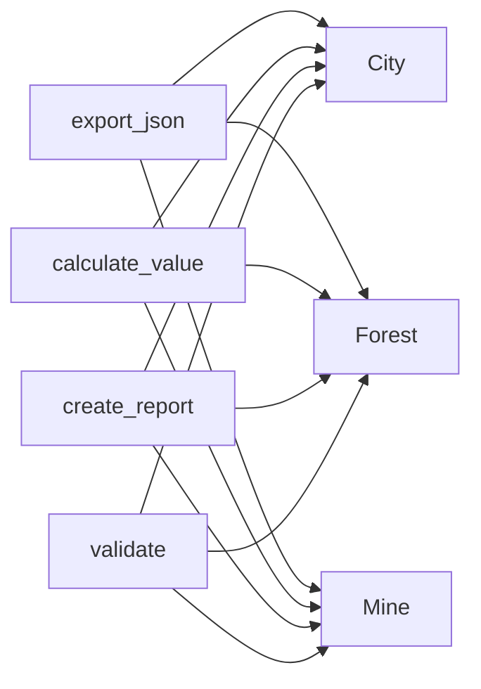
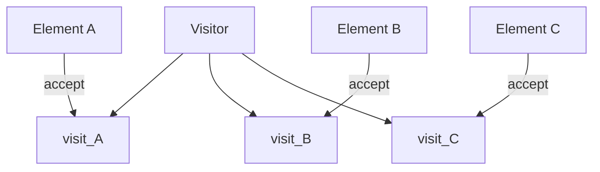
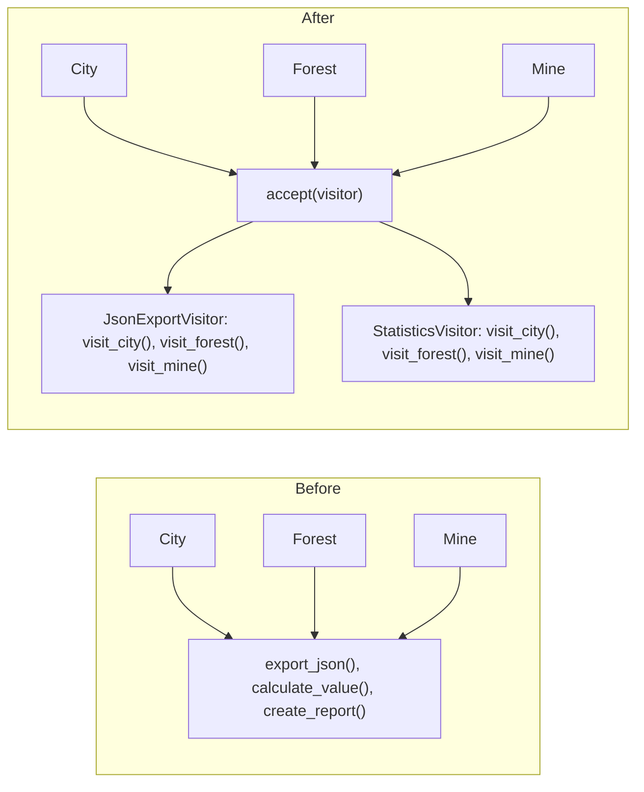
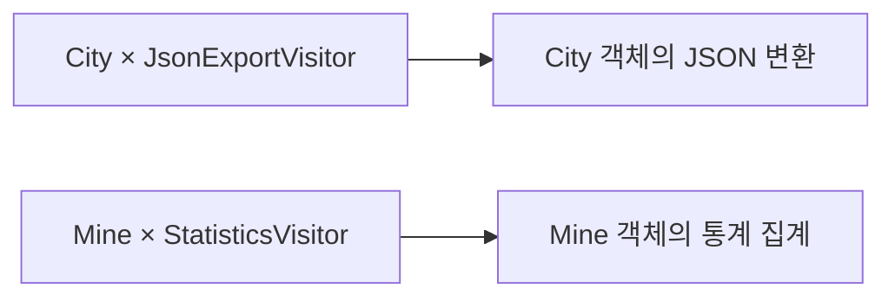
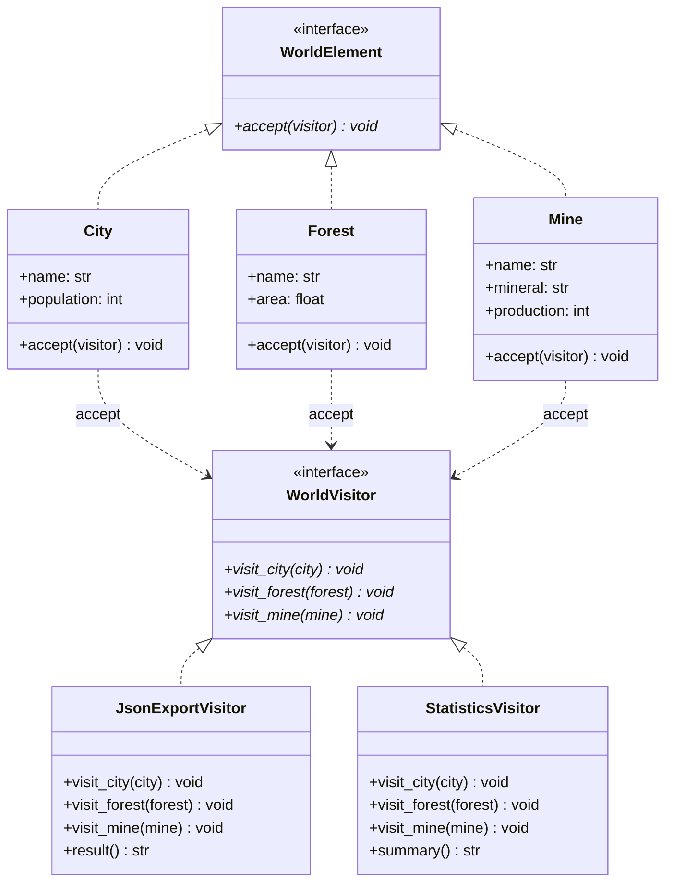

# 방문자 패턴 (Visitor Pattern)


## 1. 패턴이 없을 때 발생하는 문제점 (The Problem)

방문자 패턴을 사용하지 않고 **여러 종류의 객체로 구성된 구조에 새로운 연산을 계속 추가하면**, 객체들이 자신의 본래 책임과 무관한 기능까지 과도하게 갖게 되는 문제가 발생합니다.

예를 들어 게임 월드에 다음과 같은 요소들이 존재한다고 가정합니다.

```text
City
Forest
Mine
```

각 요소는 자신만의 데이터를 보유합니다.

```python
from dataclasses import dataclass


@dataclass
class City:
    name: str
    population: int


@dataclass
class Forest:
    name: str
    area: float


@dataclass
class Mine:
    name: str
    mineral: str
    production: int
```

초기에는 게임 로직 내부에서만 사용되므로 아무런 문제가 없습니다.

하지만 시스템이 확장되면서 다음과 같은 부가 기능들이 계속 요구된다고 가정해보겠습니다.

```text
JSON Export
통계 보고서
자원 가치 계산
디버그 출력
밸런스 검증
지도 렌더링 정보 생성
```

### 패턴을 적용하지 않은 예시 1: 클래스 내부에 연산 직접 추가

가장 단순한 접근법은 각 도메인 클래스에 필요한 연산을 직접 추가하는 것입니다.

```python
@dataclass
class City:
    name: str
    population: int

    def export_json(self) -> dict[str, object]:
        return {"type": "city", "name": self.name, "population": self.population}

    def calculate_value(self) -> int:
        return self.population * 100

    def create_report(self) -> str:
        return f"도시 {self.name}: 인구 {self.population}"
```

`Forest`와 `Mine` 클래스에도 동일한 목적의 연산 메서드들을 추가합니다.

```python
@dataclass
class Forest:
    name: str
    area: float

    def export_json(self) -> dict[str, object]:
        return {"type": "forest", "name": self.name, "area": self.area}

    def calculate_value(self) -> int:
        return int(self.area * 300)

    def create_report(self) -> str:
        return f"숲 {self.name}: 면적 {self.area}"


@dataclass
class Mine:
    name: str
    mineral: str
    production: int

    def export_json(self) -> dict[str, object]: ...
    def calculate_value(self) -> int: ...
    def create_report(self) -> str: ...
```

문제는 이 기능들이 `City`, `Forest`, `Mine`의 핵심 도메인 역할과 직접적인 관련이 없다는 점입니다.

예를 들어 `City`의 핵심 책임이 다음과 같다고 가정해봅니다.

```text
인구 관리
건물 관리
경제 상태 관리
주민 상태 관리
```

그러나 시간이 흘러 기능이 늘어나면서 도메인 객체 내부에 부가 기능들이 계속 축적됩니다.

```text
JSON Export
XML Export
Analytics
Debug Dump
Validation
Migration
AI Feature Extraction
```

그 결과 단일 도메인 클래스가 여러 외부 요구 때문에 함께 변경되며, 단일 책임 원칙(SRP)을 지키기 어려워집니다.

---

### 패턴을 적용하지 않은 예시 2: 외부 함수 및 타입 분기 사용

다른 접근법으로 연산 로직을 외부 함수로 빼고 조건문으로 타입을 분기하는 방법이 있습니다.

```python
def export_json(element) -> dict[str, object]:
    if isinstance(element, City):
        return {"type": "city", "name": element.name, "population": element.population}
    if isinstance(element, Forest):
        return {"type": "forest", "name": element.name, "area": element.area}
    if isinstance(element, Mine):
        return {
            "type": "mine",
            "name": element.name,
            "mineral": element.mineral,
            "production": element.production,
        }
    raise TypeError("지원하지 않는 타입입니다.")
```

통계 계산과 보고서 생성 함수 역시 동일한 타입 검사 구조를 반복하게 됩니다.

```python
def calculate_value(element) -> int:
    if isinstance(element, City):
        ...
    elif isinstance(element, Forest):
        ...
    elif isinstance(element, Mine):
        ...


def create_report(element) -> str:
    if isinstance(element, City):
        ...
    elif isinstance(element, Forest):
        ...
    elif isinstance(element, Mine):
        ...
```

이 방식은 동일한 타입 분기 로직이 새로운 연산이 추가될 때마다 분산되어 중복 발생합니다.



객체 종류는 안정적인 반면 **연산이 빈번하게 추가되는 구조**라면, 이러한 조건문 중복은 코드 전반으로 확산됩니다.

### 기존 방식들의 단점

* **도메인 객체의 책임 과중:** Export, Reporting, Validation 등의 부가 연산이 Element 클래스에 계속 누적됩니다.
* **타입 분기 조건문의 반복:** 연산을 외부로 분리하더라도 `isinstance()`에 의존한 조건 분기 코드가 여러 함수에 걸쳐 반복됩니다.
* **관심사의 파편화:** "JSON Export"라는 단일 기능에 대한 로직이 각 Element 클래스에 파편화되어 응집도가 낮아집니다.
* **SRP 및 둔감한 OCP:** 새로운 연산이 추가될 때마다 기존 Element 클래스나 외부 분기 함수들을 매번 수정해야 합니다.

---

## 2. 방문자 패턴으로 해결하기 (The Solution)

방문자 패턴은 "객체 구조를 구성하는 Element 클래스는 안정적으로 유지하면서, 해당 구조에서 수행되는 연산을 별도의 Visitor 객체로 분리하여 정의하는 패턴"입니다.

기본적인 구조 흐름은 다음과 같습니다.



먼저 Element 공통 인터페이스를 정의합니다.

```python
from abc import ABC, abstractmethod


class WorldElement(ABC):
    @abstractmethod
    def accept(self, visitor: WorldVisitor) -> None:
        pass
```

각 Element는 `accept()` 메서드 내에서 자신의 구체 타입에 맞는 Visitor 메서드를 호출합니다.

```python
@dataclass
class City(WorldElement):
    name: str
    population: int

    def accept(self, visitor: WorldVisitor) -> None:
        visitor.visit_city(self)


@dataclass
class Forest(WorldElement):
    name: str
    area: float

    def accept(self, visitor: WorldVisitor) -> None:
        visitor.visit_forest(self)


@dataclass
class Mine(WorldElement):
    name: str
    mineral: str
    production: int

    def accept(self, visitor: WorldVisitor) -> None:
        visitor.visit_mine(self)
```

Visitor 인터페이스는 모든 Element 종류별 방문 메서드를 선언합니다.

```python
class WorldVisitor(ABC):
    @abstractmethod
    def visit_city(self, city: City) -> None:
        pass

    @abstractmethod
    def visit_forest(self, forest: Forest) -> None:
        pass

    @abstractmethod
    def visit_mine(self, mine: Mine) -> None:
        pass
```

이 구조를 이용하면 "JSON Export"라는 하나의 관심사를 단일 Visitor 클래스로 응집할 수 있습니다.

```python
class JsonExportVisitor(WorldVisitor):
    def visit_city(self, city: City) -> None: ...
    def visit_forest(self, forest: Forest) -> None: ...
    def visit_mine(self, mine: Mine) -> None: ...
```

통계 집계 연산 역시 구체적인 Visitor 클래스로 분리됩니다.

```python
class StatisticsVisitor(WorldVisitor):
    def visit_city(self, city: City) -> None: ...
    def visit_forest(self, forest: Forest) -> None: ...
    def visit_mine(self, mine: Mine) -> None: ...
```

클라이언트는 객체 구조 변경 없이 Visitor 구현체만 교체하여 실행합니다.

```python
elements: list[WorldElement] = [
    City("왕도", 100_000),
    Forest("고대의 숲", 450.0),
    Mine("북부 광산", "철", 2_000),
]
# 1. JSON Export 실행
json_visitor = JsonExportVisitor()
for element in elements:
    element.accept(json_visitor)
# 2. 통계 계산 실행
stats_visitor = StatisticsVisitor()
for element in elements:
    element.accept(stats_visitor)
```

구조는 다음과 같이 전환됩니다.



즉, 코드의 구조화 방향이 "Element 기준의 연산 파편화"에서 "Operation 기준의 타입별 처리 응집"으로 변경됩니다.

본질적으로 방문자 패턴은 Element 타입 구조를 변경하지 않으면서, 타입별 연산을 외부 Visitor 클래스로 집중시키고, `accept()`를 통한 디스패치 메커니즘으로 알맞은 연산을 찾아 실행하도록 보장하는 설계 방식입니다.

---

### Double Dispatch (이중 디스패치)

방문자 패턴의 핵심 메커니즘은 **Double Dispatch**입니다.

일반적인 객체지향의 단일 디스패치(Single Dispatch)는 수신자(Receiver)의 런타임 타입만으로 메서드를 선택합니다.

```python
element.accept(visitor)
```

1. **첫 번째 Dispatch (Element 타입 결정):**
`element`의 실제 런타임 타입에 따라 호출될 `accept()` 메서드가 결정됩니다. 만약 `element`가 `City` 타입이라면 `City.accept()`가 호출됩니다.
2. **두 번째 Dispatch (Visitor 타입 결정):**
`City.accept()` 내부에서 `visitor.visit_city(self)`를 호출합니다. 이때 `visitor`의 실제 런타임 타입에 따라 최종 실행될 메서드가 결정됩니다.
* `JsonExportVisitor.visit_city()`
* `StatisticsVisitor.visit_city()`
* `ValidationVisitor.visit_city()`


결과적으로 실제 실행될 알고리즘은 두 축의 결합에 의해 동적으로 결정됩니다.

$$\text{Element Type} \times \text{Visitor Type}$$



이 이중 디스패치 구조 덕분에 타입 분기 조건문 없이도 정교한 다형성 처리가 가능해집니다.

---

## 3. 장점, 단점 및 트레이드오프 (Trade-off)

### 장점 (Pros)

* **연산 추가의 용이성 (OCP 준수):** 기존 Element 구조를 수정하지 않고 새로운 Concrete Visitor 클래스를 추가하는 것만으로 기능을 확장할 수 있습니다.
* **관심사 분리 및 높은 응집도:** 특정 연산에 관련된 로직이 단일 Visitor 클래스에 모이므로 관리와 유지가 용이합니다.
* **Element의 책임 최소화:** 도메인 핵심 로직과 직접적 관련이 없는 출력, 검증, 변환 등의 부가 기능을 외부로 이관할 수 있습니다.
* **알고리즘 상태 관리 용이성:** Visitor 객체 내부에 연산 수행에 필요한 상태값(누적 통계, 변환 결과 등)을 자연스럽게 보유할 수 있습니다.
* **복잡한 객체 구조와의 유연한 결합:** Composite, AST, CST 등 이질적인 노드들로 구성된 복잡한 트리를 처리하는 데 매우 유합합니다.

### 단점 (Cons)

* **Element 타입 추가의 어려움:** 새로운 Concrete Element 타입이 추가될 경우, Visitor 인터페이스 및 기존의 모든 Concrete Visitor 클래스에 `visit_xxx()` 메서드를 새로 구현해야 합니다.
* **Double Dispatch의 구조적 복잡성:** `accept()`와 `visit_xxx()`가 교차 호출되는 흐름은 초기에 이해하기 어려울 수 있습니다.
* **캡슐화 훼손 위험:** Visitor가 필요한 작업을 수행하기 위해 Element 객체의 내부 상세 데이터를 외부로 과도하게 노출해야 하는 상황이 발생할 수 있습니다.
* **인터페이스 비대화:** Element의 종류가 늘어남에 따라 Visitor 인터페이스 내부의 메서드 목록도 함께 비대해집니다.

### 트레이드오프 (Trade-off)

* **적합한 상황:** Element 타입의 구조가 매우 고정적이고, 연산(Operation)이 자주 추가되는 환경(예: 컴파일러 AST, 문서 구조 분석)에 최적입니다.
* **부적합한 상황:** Element 타입의 종류가 자주 추가되거나 변하는 도메인에는 방문자 패턴 적용 시 수정 비용이 매우 큽니다.
* **방향성:** 방문자 패턴은 연산 확장에는 열려 있고(Open), 타입 확장에는 닫혀 있는(Closed) 비대칭 OCP 구조를 가집니다.

---

### 관련 패턴과의 비교

#### Visitor vs Iterator

* **Iterator:** 객체 구조의 내부를 감추고 "어떤 순서로 접근/순회할 것인가(Traversal)"에 집중합니다.
* **Visitor:** 접근한 "각 객체에서 어떤 연산을 수행할 것인가(Operation)"에 집중합니다.
* *두 패턴은 함께 결합하여 Iterator로 순회하고 Visitor로 연산을 실행하는 방식으로 자주 혼용됩니다.*

#### Visitor vs Composite

* **Composite:** 복합 객체와 단일 객체를 동일 인터페이스로 다루어 "부분-전체 트리 구조를 형성"합니다.
* **Visitor:** 구축된 Composite 트리 구조 위에 "외부 연산을 유연하게 추가"할 때 사용합니다.

#### Visitor vs Interpreter

* **Interpreter:** 구문 트리의 각 노드(Expression) 내부에 해석 로직(`interpret()`)을 직접 위치시킵니다.
* **Visitor:** 구문 트리의 구조는 유지하되, 해석/변환/최적화 로직을 외부 Visitor 객체로 이관하여 다양화합니다.

#### Visitor vs Strategy

* **Strategy:** 단일 Context 객체 내부에서 교체하여 사용할 "단일 알고리즘"을 추상화합니다.
* **Visitor:** 서로 다른 타입들로 구성된 "객체 구조 전체를 대상으로 타입별 연산 집합"을 정의합니다.

#### Visitor vs Command

* **Command:** 요청 자체를 객체로 캡슐화하여 "실행, 취소(Undo), 큐잉"을 목적으로 합니다.
* **Visitor:** 객체 구조 내 노드 타입별로 달라지는 "다형적 연산 집합의 적용"에 집중합니다.

---

## 4. 파이썬 오픈소스 사례

Python 생태계에서는 AST(Abstract Syntax Tree)나 SQL Expression Tree처럼 다양한 종류의 노드로 구성된 트리 구조를 순회하며 분석 및 변환 작업을 수행할 때 Visitor 패턴을 적극적으로 활용합니다.

### Python standard library `ast.NodeVisitor`

Python의 `ast.NodeVisitor`는 방문자 패턴의 표준적 예시입니다. `visit(node)`를 호출하면 노드의 클래스 이름을 바탕으로 `visit_<ClassName>()` 메서드를 동적으로 찾아 실행하며, 해당 메서드가 없으면 `generic_visit()`로 자식 노드를 계속 순회합니다.

```python
import ast


class FunctionCounter(ast.NodeVisitor):
    def __init__(self):
        self.count = 0

    def visit_FunctionDef(self, node: ast.FunctionDef) -> None:
        self.count += 1
        self.generic_visit(node)


tree = ast.parse("""
def hello():
    pass

def world():
    pass
""")
visitor = FunctionCounter()
visitor.visit(tree)
print(visitor.count)  # 출력: 2
```

---

### Python standard library `ast.NodeTransformer`

`ast.NodeTransformer`는 `NodeVisitor`를 상속받아 AST의 각 노드를 **검사할 뿐만 아니라 교체 및 삭제하는 변환 작업**을 수행합니다. Visitor의 반환값을 기반으로 노드를 새 노드로 교체하거나, `None`을 반환하여 노드를 제거합니다.

```python
import ast


class RenameVariable(ast.NodeTransformer):
    def visit_Name(self, node: ast.Name) -> ast.AST:
        if node.id == "old_name":
            return ast.Name(id="new_name", ctx=node.ctx)
        return node
```

---

### SQLAlchemy `sqlalchemy.sql.visitors`

SQLAlchemy Core는 SQL 표현식 트리를 탐색하고 조작하기 위해 `visitors` 모듈을 제공합니다. `Table`, `Column`, `BindParameter` 등 다양한 타입으로 이루어진 SQL 트리를 순회하며 SQL 문장을 생성하거나 노드를 대체하는 용도로 사용됩니다.

---

### LibCST `CSTVisitor` 및 `CSTTransformer`

LibCST는 파이썬 구체 구문 트리(Concrete Syntax Tree)를 다루며, 명시적인 `CSTVisitor`와 `CSTTransformer` 인터페이스를 제공합니다. `visit_<NodeType>()`과 `leave_<NodeType>()` 메서드를 통해 노드 진입 시점과 진출 시점의 제어가 가능합니다.

---

## 5. 클래스 다이어그램



---

## 6. 파이썬 예제 코드

```python
from __future__ import annotations
from abc import ABC, abstractmethod
from dataclasses import dataclass
import json


# -------------------------------------------------------------------
# 1. Visitor Interface
# -------------------------------------------------------------------
class WorldVisitor(ABC):
    @abstractmethod
    def visit_city(self, city: City) -> None:
        pass

    @abstractmethod
    def visit_forest(self, forest: Forest) -> None:
        pass

    @abstractmethod
    def visit_mine(self, mine: Mine) -> None:
        pass


# -------------------------------------------------------------------
# 2. Element Interface
# -------------------------------------------------------------------
class WorldElement(ABC):
    @abstractmethod
    def accept(self, visitor: WorldVisitor) -> None:
        pass


# -------------------------------------------------------------------
# 3. Concrete Elements
# -------------------------------------------------------------------
@dataclass(frozen=True)
class City(WorldElement):
    name: str
    population: int

    def accept(self, visitor: WorldVisitor) -> None:
        visitor.visit_city(self)


@dataclass(frozen=True)
class Forest(WorldElement):
    name: str
    area: float

    def accept(self, visitor: WorldVisitor) -> None:
        visitor.visit_forest(self)


@dataclass(frozen=True)
class Mine(WorldElement):
    name: str
    mineral: str
    production: int

    def accept(self, visitor: WorldVisitor) -> None:
        visitor.visit_mine(self)


# -------------------------------------------------------------------
# 4. Concrete Visitors
# -------------------------------------------------------------------
class JsonExportVisitor(WorldVisitor):
    def __init__(self):
        self._items: list[dict[str, object]] = []

    def visit_city(self, city: City) -> None:
        self._items.append(
            {"type": "city", "name": city.name, "population": city.population}
        )

    def visit_forest(self, forest: Forest) -> None:
        self._items.append({"type": "forest", "name": forest.name, "area": forest.area})

    def visit_mine(self, mine: Mine) -> None:
        self._items.append(
            {
                "type": "mine",
                "name": mine.name,
                "mineral": mine.mineral,
                "production": mine.production,
            }
        )

    def result(self) -> str:
        return json.dumps(self._items, ensure_ascii=False, indent=2)


class StatisticsVisitor(WorldVisitor):
    def __init__(self):
        self.city_count = 0
        self.total_population = 0
        self.forest_count = 0
        self.total_forest_area = 0.0
        self.mine_count = 0
        self.total_production = 0

    def visit_city(self, city: City) -> None:
        self.city_count += 1
        self.total_population += city.population

    def visit_forest(self, forest: Forest) -> None:
        self.forest_count += 1
        self.total_forest_area += forest.area

    def visit_mine(self, mine: Mine) -> None:
        self.mine_count += 1
        self.total_production += mine.production

    def summary(self) -> str:
        return (
            f"도시={self.city_count}개(총 인구: {self.total_population}), "
            f"숲={self.forest_count}개(총 면적: {self.total_forest_area}), "
            f"광산={self.mine_count}개(총 생산량: {self.total_production})"
        )


# -------------------------------------------------------------------
# 5. Object Structure
# -------------------------------------------------------------------
class World:
    def __init__(self, elements: list[WorldElement]):
        self._elements = elements

    def accept(self, visitor: WorldVisitor) -> None:
        for element in self._elements:
            element.accept(visitor)


# -------------------------------------------------------------------
# 6. Usage Example
# -------------------------------------------------------------------
if __name__ == "__main__":
    world = World(
        [
            City(name="왕도", population=100_000),
            Forest(name="고대의 숲", area=450.5),
            Mine(name="북부 광산", mineral="철", production=2_000),
            City(name="항구 도시", population=40_000),
        ]
    )
    print("=== JSON Export ===")
    json_visitor = JsonExportVisitor()
    world.accept(json_visitor)
    print(json_visitor.result())
    print("\n=== Statistics ===")
    stats_visitor = StatisticsVisitor()
    world.accept(stats_visitor)
    print(stats_visitor.summary())
```

---

## 부록 (Appendix): 현대적 타입 시스템과 함수형 관점의 재해석

방문자 패턴을 현대적인 타입 시스템 및 함수형 프로그래밍(FP) 관점에서 재해석하면, 본질적으로 "닫힌 데이터 Variant(변종) 집합에 대해 다양한 연산을 어떻게 유연하게 확장할 것인가?"에 대한 해법입니다.

### 1. Element 계층 구조의 ADT(Sum Type) 전환

객체지향의 클래스 계층 구조는 함수형 언어의 대수적 데이터 타입(ADT: Algebraic Data Type) 중 하나인 **Sum Type**으로 직관적으로 표현됩니다.

```text
# OOP Subclassing                # FP ADT
WorldElement                     WorldElement =
    ├─ City                         City(name, population)
    ├─ Forest                     | Forest(name, area)
    └─ Mine                       | Mine(name, mineral, production)
```

---

### 2. Double Dispatch 대체: Pattern Matching

함수형 패러다임에서는 `accept()`와 `visit_xxx()`의 이중 디스패치 대신 패턴 매칭(Pattern Matching)을 활용해 각 Variant를 직접 다룹니다.

```python
def export_json(element: WorldElement) -> JsonValue:
    match element:
        case City(name, population):
            return {"type": "city", "name": name, "population": population}
        case Forest(name, area):
            return {"type": "forest", "name": name, "area": area}
        case Mine(name, mineral, production):
            return {
                "type": "mine",
                "name": name,
                "mineral": mineral,
                "production": production,
            }
```

별도의 `accept()` 인터페이스나 Visitor 클래스를 작성하지 않고, 패턴 매칭 함수가 Visitor와 같은 연산 분배 역할을 맡습니다.

---

### 3. Exhaustiveness Checking (완전성 검사)

닫힌 ADT와 완전성 검사를 지원하는 언어에서는 새로운 Variant(예: `River`)가 추가됐을 때 타입 검사기나 컴파일러가 누락된 패턴을 찾을 수 있습니다. Python의 `match` 문만으로 이 검사가 자동으로 보장되는 것은 아니며, 사용하는 타입 검사기의 기능과 모델링 방식에 따라 별도의 `assert_never()` 같은 장치가 필요합니다.

```text
Non-exhaustive pattern match: Missing case 'River'
```

이 조건을 만족하면 Visitor 인터페이스를 일괄 수정해 얻던 연산의 타입별 커버리지 검사를 패턴 매칭에서도 유지할 수 있습니다.

---

### 4. 핵심 이론적 배경: Expression Problem

방문자 패턴과 패턴 매칭은 프로그래밍 언어론의 **Expression Problem**과 깊이 연관되어 있습니다.

| 구분 | 데이터 Variant 추가 | 연산(Operation) 추가 |
| --- | --- | --- |
| **전통적 OOP (Virtual Method)** | **쉬움** (새 클래스만 작성) | **어려움** (모든 클래스 수정 필요) |
| **방문자 패턴 / FP (ADT + Match)** | **어려움** (모든 Visitor/Match 수정) | **쉬움** (새 Visitor/함수만 작성) |

방문자 패턴은 전통적 OOP의 확장 축을 뒤집어 **연산 추가에 유리하도록 구조화한 패턴**입니다.

---

### 비교 요약

| 개념 | GoF 방문자 패턴 (OOP) | 현대 타입 시스템 / 함수형 (FP) |
| --- | --- | --- |
| **데이터 구조** | Element 클래스 계층 구조 | Sum Type / ADT |
| **연산 모듈화** | Concrete Visitor 클래스 | 단일 함수 / Algebra |
| **타입별 분기** | `visit_xxx()` 동적 디스패치 | Pattern Matching |
| **진입 메커니즘** | `element.accept(visitor)` | ADT Eliminator / 함수 인자 전달 |
| **재귀 순회** | Recursive Visitor | Fold / Catamorphism |
| **부수 효과/상태 관리** | Visitor 내 가변 필드 | State / Writer / Monoid Effect |

---

### 결론

방문자 패턴의 핵심은 안정적인 데이터 구조에 계속 추가되는 연산을 외부로 분리하여, Element 클래스를 수정하지 않고 기능을 확장하는 데 있습니다. 타입 안전성과 누락 검출 수준은 언어의 Visitor 인터페이스 검사와 패턴 매칭 완전성 검사 기능에 따라 달라집니다.
