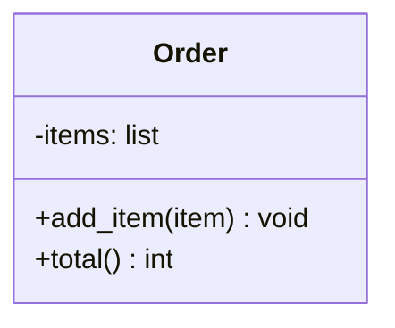
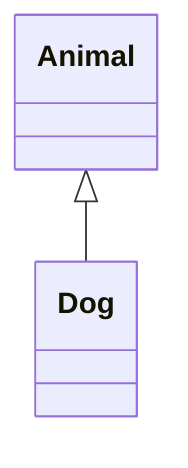
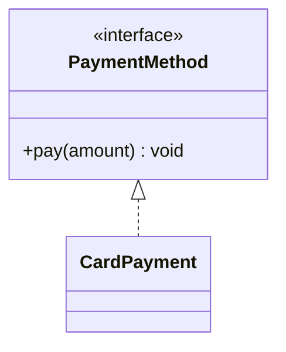
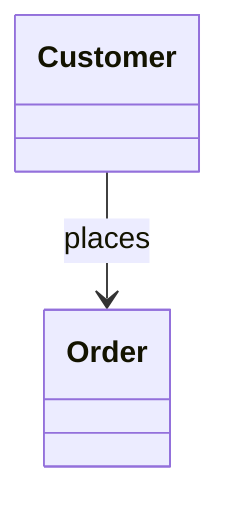
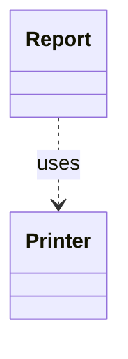
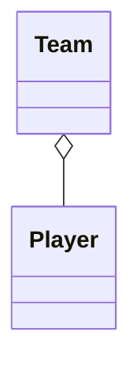
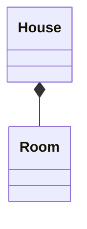
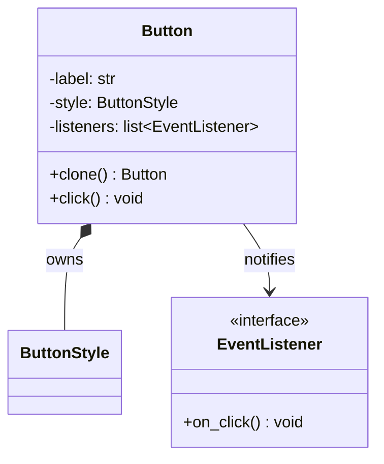
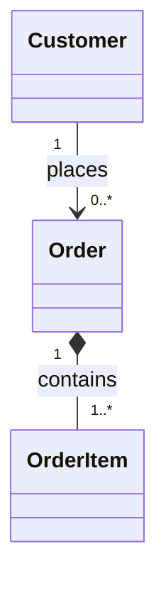
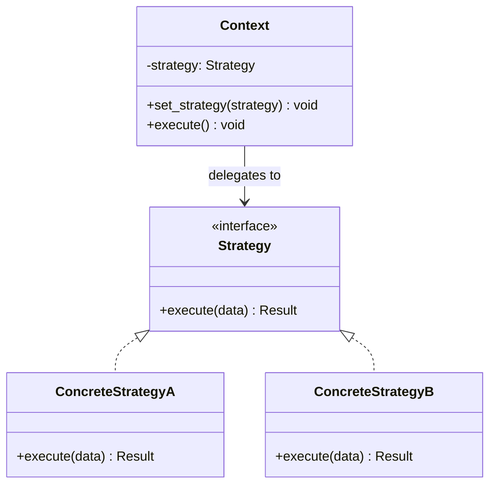

# 클래스 다이어그램 (Class Diagram)

클래스 다이어그램은 시스템을 구성하는 **클래스의 구조**와 클래스 사이의 **관계**를 표현하는 UML(Unified Modeling Language) 다이어그램입니다. 디자인 패턴 문서에서는 참여 객체가 어떤 역할을 맡고 서로 어떻게 협력하는지 빠르게 파악하는 데 사용합니다.

## 클래스 표기

클래스는 일반적으로 이름, 속성, 메서드의 세 영역으로 표현합니다.



| 기호 | 접근 범위 | Python에서의 관례 |
| --- | --- | --- |
| `+` | public | `method` |
| `-` | private | `__method` |
| `#` | protected | `_method` |
| `~` | package | 직접 대응하는 접근 제한자 없음 |

Python은 접근 제한을 엄격하게 강제하지 않으므로 `_name`과 `__name` 같은 이름 규칙으로 의도를 나타냅니다.

## 클래스 사이의 관계

### 상속 (Inheritance)

하위 클래스가 상위 클래스의 속성과 동작을 물려받는 **is-a** 관계입니다. 실선과 속이 빈 삼각형으로 표시합니다.



```python
class Animal:
    pass


class Dog(Animal):
    pass
```

### 실체화 (Realization)

클래스가 인터페이스나 추상 타입의 계약을 구현하는 관계입니다. 점선과 속이 빈 삼각형으로 표시합니다. Python에서는 주로 `Protocol`이나 `ABC`로 표현합니다.



### 연관 (Association)

한 객체가 다른 객체를 알고 있거나 지속해서 참조하는 관계입니다. 실선으로 표시합니다.



### 의존 (Dependency)

한 클래스가 메서드의 인자, 반환값 또는 지역 변수로 다른 클래스를 일시적으로 사용하는 관계입니다. 점선 화살표로 표시합니다.



### 집합 (Aggregation)

전체와 부분의 **has-a** 관계이지만, 부분은 전체와 독립적으로 존재할 수 있습니다. 전체 쪽에 속이 빈 마름모를 표시합니다.



팀이 없어져도 선수 객체는 계속 존재할 수 있습니다.

### 합성 (Composition)

전체가 부분의 생명주기를 소유하는 강한 **has-a** 관계입니다. 전체 쪽에 채워진 마름모를 표시합니다.



방은 특정 집의 일부로 생성되며, 집과 생명주기를 함께한다고 봅니다.

## 관계의 차이 한눈에 보기

관계를 구분할 때는 단순히 객체를 가지고 있는지보다 **소유권**, **생명주기**, **사용 기간**을 확인하는 편이 쉽습니다.

| 관계 | 쉬운 표현 | 판단 기준 | 관계의 강도 |
| --- | --- | --- | --- |
| 상속 | 같은 종류이다 | 하위 클래스가 상위 클래스의 구현과 타입을 물려받는가? | 강함 |
| 실체화 | 약속을 구현한다 | 클래스가 인터페이스의 계약을 구현하는가? | 강함 |
| 합성 | 내 부품이다 | 전체가 부분을 독점적으로 소유하고 생명주기도 관리하는가? | 강한 `has-a` |
| 집합 | 구성원으로 가진다 | 부분을 가지고 있지만 부분이 독립적으로 존재하고 공유될 수 있는가? | 약한 `has-a` |
| 연관 | 계속 알고 있다 | 객체가 다른 객체의 참조를 필드에 보관하는가? | 일반적인 연결 |
| 의존 | 잠시 사용한다 | 인자나 지역 변수로만 일시적으로 사용하는가? | 약함 |

관계의 강도는 대체로 `상속·실체화 → 합성 → 집합·연관 → 의존` 순서로 생각할 수 있습니다. 이는 이해를 돕기 위한 기준이며 모든 설계에 적용되는 절대적인 결합도 순위는 아닙니다.

### 상속과 실체화

- 상속은 부모 클래스의 타입과 구현을 이어받습니다. `Dog`는 `Animal`의 한 종류입니다.
- 실체화는 구현보다 **계약 준수**가 핵심입니다. `CardPayment`는 `PaymentMethod`가 요구하는 기능을 제공합니다.

Python의 `ABC`처럼 추상 클래스가 공통 구현까지 제공하면 두 개념의 경계가 겹칠 수 있습니다. 다이어그램에서는 구현 재사용을 강조하면 상속, 인터페이스 계약을 강조하면 실체화로 표현합니다.

### 합성, 집합, 연관

세 관계 모두 객체가 다른 객체를 필드로 참조할 수 있지만 소유권이 다릅니다.

- 합성: 전체가 부분을 만들고 소유합니다. 부분은 보통 다른 전체와 공유하지 않습니다.
- 집합: 전체가 부분을 모아 두지만 부분은 외부에서 만들어지고 다른 객체와 공유될 수 있습니다.
- 연관: 소유 관계를 주장하지 않고 단지 상대 객체를 알고 있다는 사실만 나타냅니다.

집합은 의미가 모호해지는 경우가 많습니다. 부분의 독립성을 특별히 강조할 필요가 없다면 일반 연관으로 표현하는 것이 더 명확할 수 있습니다.

### 연관과 의존

다른 객체를 **얼마나 오래 기억하는지**로 구분할 수 있습니다.

```python
class Checkout:
    def __init__(self, payment_method):
        self.payment_method = payment_method  # 필드에 보관: 연관

    def print_receipt(self, printer):
        printer.print(self)  # 호출 중에만 사용: 의존
```

`Checkout`은 결제 수단을 계속 기억하지만 프린터는 메서드가 실행되는 동안에만 사용합니다.

## 버튼 복사로 이해하는 소유권

버튼은 자신의 모양과 상태는 소유하지만, 클릭 이벤트를 받을 리스너는 외부 객체를 참조할 수 있습니다.



- `ButtonStyle`은 버튼이 소유하는 합성 관계입니다. 버튼을 독립적으로 복제하려면 스타일도 함께 복제하는 편이 자연스럽습니다.
- `EventListener`는 버튼 밖에서 생성되어 여러 버튼이 공유할 수 있는 연관 관계입니다. 새 버튼이 기존 버튼의 이벤트 구독자까지 그대로 가져가면 의도하지 않은 동작이 발생할 수 있으므로 복사하지 않을 수 있습니다.

```python
from copy import deepcopy


class Button:
    def __init__(self, label, style):
        self.label = label
        self.style = style
        self.listeners = []

    def clone(self):
        clone = Button(self.label, deepcopy(self.style))
        # listeners는 외부 객체의 참조이므로 복사하지 않는다.
        return clone
```

중요한 점은 **UML 관계가 복사 방법을 자동으로 결정하지는 않는다**는 것입니다. 합성 관계라고 항상 깊은 복사를 해야 하거나, 연관 관계라고 항상 참조를 버려야 하는 것은 아닙니다. 다이어그램은 소유 의도를 보여 주고, 실제 복사 정책은 요구사항에 맞게 코드와 문서로 명시해야 합니다.

## 다중성 (Multiplicity)

관계의 양 끝에 연결 가능한 객체의 개수를 표시합니다.

| 표기 | 의미 |
| --- | --- |
| `1` | 정확히 하나 |
| `0..1` | 없거나 하나 |
| `*` 또는 `0..*` | 없거나 여러 개 |
| `1..*` | 하나 이상 |



한 고객은 여러 주문을 만들 수 있고, 하나의 주문은 하나 이상의 주문 항목으로 구성됩니다.

## 디자인 패턴 다이어그램 예시

다음은 전략 패턴의 기본 구조입니다. `Context`는 구체적인 알고리즘 대신 `Strategy` 인터페이스에 의존합니다. 실행 중에 다른 전략 구현체를 주입하면 동작을 교체할 수 있습니다.



## 다이어그램 읽는 순서

1. 인터페이스와 추상 클래스에서 패턴이 제공하는 **계약**을 찾습니다.
2. 구체 클래스가 그 계약을 어떻게 구현하는지 확인합니다.
3. 객체를 생성하거나 소유하는 주체를 찾습니다.
4. 화살표 방향을 따라 의존성과 호출 흐름을 파악합니다.
5. 다중성을 확인해 객체가 하나인지 컬렉션인지 구분합니다.

클래스 다이어그램은 구현의 모든 세부 사항을 담기보다 구조와 책임을 전달하는 지도에 가깝습니다. 실제 Python 코드에서는 동적 타이핑, 덕 타이핑, 일급 함수 때문에 다이어그램보다 더 간결하게 구현될 수 있습니다.
