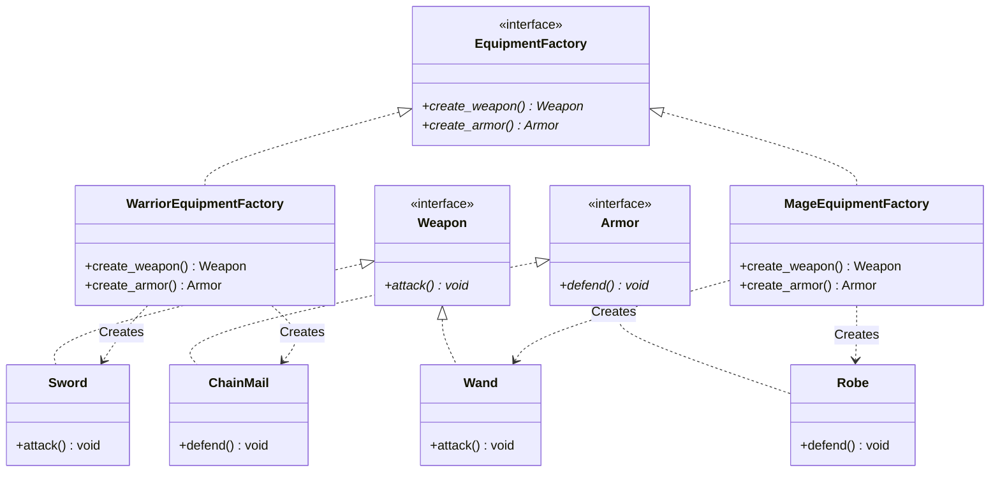

# 추상 팩토리 패턴 (Abstract Factory Pattern)


## 1. 패턴이 없을 때 발생하는 문제점 (The Problem)

다음 예시는 추상 팩토리 패턴 없이 캐릭터의 직업에 따라 무기와 방어구를 직접 생성할 때 생기는 문제를 보여줍니다. 대개 아래와 같이 조건문(`if-else`)으로 객체를 직접 조립하게 됩니다.

```python
# 패턴을 적용하지 않은 예시
class BadHero:
    def __init__(self, name: str, job: str):
        self.name = name
        self.job = job
        # 문제점 1: 구체적인 클래스에 직접 의존 (Tight Coupling)
        # 클라이언트가 Sword, Wand, ChainMail, Robe 등의 구체 클래스명을 직접 명시함
        if job == "warrior":
            self.weapon = Sword()
            self.armor = ChainMail()
        elif job == "mage":
            self.weapon = Wand()
            self.armor = Robe()
        else:
            raise ValueError("알 수 없는 직업입니다.")

    def equip_item(self, job: str, item_type: str):
        # 문제점 2: 분기문이 시스템 전체로 확산됨
        if job == "warrior" and item_type == "weapon":
            return Sword()
        elif job == "mage" and item_type == "armor":
            # 실수로 마법사에게 전사 갑옷을 반환해도 문법 에러가 발생하지 않음
            return ChainMail()
```

### 이 방식이 가진 단점

1. **제품군 조합 실수 위험**: 개발자가 실수로 전사 세트에 마법사용 로브를 섞어 코딩하더라도 런타임 이전에는 이를 감지하기 어렵습니다.
2. **OCP(개방-폐쇄 원칙) 위반**: 새 직업(예: 궁수)이 추가될 때마다 프로젝트 곳곳에 퍼져 있는 분기문을 찾아 수정해야 합니다.
3. **구체 클래스 결합**: 캐릭터 생성 로직이 `Sword`, `Wand` 같은 구체적인 구현체의 존재를 직접 알아야 합니다.

---

## 2. 추상 팩토리 패턴으로 해결하기 (The Solution)

추상 팩토리 패턴은 "관련된 객체들의 제품군을 함께 생성하는 전담 공장"을 만들어 이 문제를 해결합니다.

* 호환되어야 하는 제품들(무기+갑옷)을 하나의 팩토리 클래스 내부에 응집시켜 **잘못된 조합이 발생할 가능성을 구조적으로 크게 줄입니다.**
* 클라이언트는 구체 클래스 이름 대신 팩토리 인터페이스에 의존하므로 결합도가 낮아집니다.

---

## 3. 장점, 단점 및 트레이드오프 (Trade-off)

### 장점 (Pros)

1. **제품군 간의 호환성 유지**: 특정 팩토리에서 생성된 객체들은 서로 호환됨을 구조적으로 기대할 수 있습니다.
2. **구체 클래스와의 결합도 감소**: 클라이언트 코드가 `Sword` 같은 구체 구현체가 아닌 인터페이스에만 의존합니다.
3. **생성 로직의 일관성 (SRP)**: 객체 세트 생성 책임이 팩토리 클래스로 단일화됩니다.

### 단점 (Cons)

1. **설계 복잡도 증가**: 인터페이스, 구체 클래스, 팩토리 클래스가 늘어나 초기 구조가 다소 복잡해집니다.
2. **새로운 제품 종류 추가의 어려움**: 무기, 갑옷 외에 '장신구(Ring)'라는 **새로운 제품 종류**를 추가하려면 추상 팩토리 인터페이스와 기존의 모든 구체 팩토리 클래스를 수정해야 합니다.

### 트레이드오프 (Trade-off)

* **새로운 제품군 추가에는 유리**: 궁수(Archer) 세트라는 **새로운 제품군**을 추가할 때는 기존 팩토리를 건드리지 않고 새로운 팩토리 클래스를 확장하면 되므로 매우 수월합니다.
* **새로운 제품 종류 추가에는 불리**: 전체 직업에 '장신구'를 일괄 추가하는 작업은 기존 인터페이스 및 구현체 전반의 수정을 유발합니다.
* **OCP의 적용 범주**: 추상 팩토리를 사용하면 **제품 생성 로직과 클라이언트 코드의 대부분을 수정하지 않고 확장**할 수 있습니다. 다만, 어떤 팩토리를 사용할지 결정하는 구성 영역(Composition Root / Factory Selection)에는 여전히 최소한의 코드 수정이 필요합니다.

---

## 4. 파이썬 오픈소스에서 볼 수 있는 추상 팩토리와 유사한 설계

파이썬의 주요 프레임워크나 라이브러리에서도 실행 환경이나 설정에 따라 **연관된 객체 세트를 교체**하기 위해 추상 팩토리 패턴과 유사한 구조를 활용합니다.

1. **SQLAlchemy (Dialect 아키텍처)**:
* DB 연결 설정에 따라 `PGDialect` 또는 `SQLiteDialect` 등이 선택됩니다.
* 선택된 Dialect는 해당 DB 엔진과 호환되는 **Compiler, ExecutionContext, TypeCompiler** 객체 세트를 일관되게 생성하여 ORM 엔진에 공급합니다.


2. **Django (Cache / Session 백엔드)**:
* `CACHES` 설정에 따라 선택된 백엔드는 **Cache Client, Serializer, Connection Manager** 등 호환성 있는 객체 세트를 내보냅니다.


3. **boto3 (AWS SDK Session)**:
* `botocore.session.Session` 객체는 요청 서비스(S3, SQS 등)에 따라 적절한 **Auth, Serializer, HTTP Client** 세트를 내부적으로 조합하여 반환합니다.


---

## 5. 클래스 다이어그램



---

## 6. 파이썬 예제 코드

```python
from abc import ABC, abstractmethod


# -------------------------------------------------------------------
# 1. 추상 제품 (Abstract Products)
# -------------------------------------------------------------------
class Weapon(ABC):
    @abstractmethod
    def attack(self) -> None:
        pass


class Armor(ABC):
    @abstractmethod
    def defend(self) -> None:
        pass


# -------------------------------------------------------------------
# 2. 구체 제품 (Concrete Products)
# -------------------------------------------------------------------
class Sword(Weapon):
    def attack(self) -> None:
        print("[검] 물리 베기 공격! (데미지: 50)")


class ChainMail(Armor):
    def defend(self) -> None:
        print("[사슬 갑옷] 물리 데미지를 감소시킵니다.")


class Wand(Weapon):
    def attack(self) -> None:
        print("[지팡이] 화염구 발사! (데미지: 80)")


class Robe(Armor):
    def defend(self) -> None:
        print("[마법 로브] 마법 보호막으로 흡수합니다.")


# -------------------------------------------------------------------
# 3. 추상 팩토리 (Abstract Factory)
# -------------------------------------------------------------------
class EquipmentFactory(ABC):
    @abstractmethod
    def create_weapon(self) -> Weapon:
        pass

    @abstractmethod
    def create_armor(self) -> Armor:
        pass


# -------------------------------------------------------------------
# 4. 구체 팩토리 (Concrete Factories)
# -------------------------------------------------------------------
class WarriorEquipmentFactory(EquipmentFactory):
    def create_weapon(self) -> Weapon:
        return Sword()

    def create_armor(self) -> Armor:
        return ChainMail()


class MageEquipmentFactory(EquipmentFactory):
    def create_weapon(self) -> Weapon:
        return Wand()

    def create_armor(self) -> Armor:
        return Robe()


# -------------------------------------------------------------------
# 5. 클라이언트
# -------------------------------------------------------------------
class Hero:
    def __init__(self, name: str, factory: EquipmentFactory):
        self.name = name
        # 구체 클래스명 대신 팩토리를 통해 생성된 제품을 전달받음
        self.weapon = factory.create_weapon()
        self.armor = factory.create_armor()

    def show_equipment(self) -> None:
        print(f"\n=== {self.name} 전투 시작 ===")
        self.weapon.attack()
        self.armor.defend()


# -------------------------------------------------------------------
# 실행 (Usage)
# -------------------------------------------------------------------
if __name__ == "__main__":
    warrior_factory = WarriorEquipmentFactory()
    hero_warrior = Hero(name="아라곤", factory=warrior_factory)
    hero_warrior.show_equipment()
    mage_factory = MageEquipmentFactory()
    hero_mage = Hero(name="간달프", factory=mage_factory)
    hero_mage.show_equipment()
```

---

## 부록 (Appendix): 현대적 타입 시스템과 관점의 재해석

추상 팩토리를 현대 타입 시스템이나 함수형 패러다임의 관점에서 재해석해 보면, "객체 간의 조합 규칙을 구조적으로 다루는 또 다른 시각"을 얻을 수 있습니다.

---

### 1. 조합 관계의 표현과 객체 구조

단순한 명목적 서브타이핑(Nominal Subtyping) 환경에서는 `Sword` ↔ `ChainMail`처럼 서로 다른 타입 간의 상호 조합 규칙(Relational Constraint)을 타입 자체에 직접 명시하기 어렵습니다.

개발자가 `WarriorEquipmentFactory` 구현 시 실수로 `Wand`를 반환하더라도 인터페이스 규칙(`Weapon` 반환)은 만족하므로 정적 타입 오류가 발생하지 않습니다. 즉, 추상 팩토리는 **타입 수준에서 조합을 완전히 강제하기보다 관련 객체 생성을 한 클래스로 묶어 실수를 줄이는 아키텍처 접근법**으로 이해하는 것이 정확합니다.

---

### 2. 구체 클래스 직접 명시 회피 vs 고차 함수 (Higher-Order Functions)

클라이언트가 `Sword()`처럼 구체 클래스를 직접 명시하면 해당 구현체에 강하게 결합됩니다. 추상 팩토리는 이를 객체 메서드 다형성으로 감싸서 해결합니다.

반면, 함수가 일급 객체인 파이썬에서는 굳이 거대한 팩토리 클래스 인스턴스를 만들지 않더라도 **'생성 함수'를 직접 전달하는 방식**으로 유연하게 결합도를 낮출 수 있습니다.

```python
# 팩토리 클래스 대신 '생성 함수(고차 함수)'를 전달하는 형태
def warrior_supplier():
    return Sword(), ChainMail()


def mage_supplier():
    return Wand(), Robe()


def create_hero(name: str, supplier_fn):
    weapon, armor = supplier_fn()  # 단순 함수 호출로 객체 세트 수급
    return Hero(name, weapon, armor)


hero1 = create_hero("아라곤", warrior_supplier)
```

---

### 3. 대수적 데이터 타입(ADT) 관점에서의 조합 표현

대수적 데이터 타입(ADT)을 적극적으로 활용하는 패러다임에서는 잘못된 조합 상태를 표현조차 하지 못하도록 **타입 서명 자체에 제약 조건**을 구워버리는 방식을 선호합니다.

파이썬 3.10+ 환경에서는 `dataclass`, `Union`, 그리고 **mypy/pyright 같은 정적 타입 체커**를 결합하여 이와 유사한 형태를 구성할 수 있습니다.

```python
from dataclasses import dataclass
from typing import Union


# 1. Product Type (곱 타입): 세트 조합을 타입 레벨에서 명시
@dataclass(frozen=True)
class WarriorSet:
    weapon: Sword
    armor: ChainMail


@dataclass(frozen=True)
class MageSet:
    weapon: Wand
    armor: Robe


# 2. Sum Type (합 타입): 허용되는 세트들의 합집합
JobEquipment = Union[WarriorSet, MageSet]
# 올바른 조합
good_warrior = WarriorSet(Sword(), ChainMail())


# 정적 타입 체커(mypy) 사용 시, 아래와 같은 잘못된 조합을 검사 단계에서 탐지합니다.
# bad_warrior = WarriorSet(Wand(), ChainMail()) # Type Error!
# 3. 패턴 매칭을 통한 안전한 소비
def equip_hero(equipment: JobEquipment):
    match equipment:
        case WarriorSet(weapon, armor):
            print(f"전사 장비 장착: {type(weapon).__name__}, {type(armor).__name__}")
        case MageSet(weapon, armor):
            print(f"마법사 장비 장착: {type(weapon).__name__}, {type(armor).__name__}")
```

---

### 요약 및 비교

| 관점 | 추상 팩토리 패턴 (OOP 아키텍처) | ADT 및 정적 타입 체크 관점 |
| --- | --- | --- |
| **조합 제약 강제 방식** | 객체 생성을 한 클래스로 묶는 **구조적 응집** | 데이터 구조와 **정적 타입 검사**를 통한 탐지 |
| **주요 활용 목적** | 구체 클래스에 대한 결합도 감소 및 팩토리 교체 | 유효하지 않은 데이터 조합의 유입 차단 |
| **추가 구조물** | Abstract Factory 인터페이스 및 구체 팩토리 클래스 | Data Class, Union Type 및 타입 체커 환경 |

### 결론

추상 팩토리는 함께 사용해야 하는 제품군의 생성 규칙을 하나의 교체 가능한 객체에 모읍니다. 클라이언트는 구체 제품을 직접 선택하지 않고 제품군 전체를 일관되게 바꿀 수 있습니다. 다만 공통 반환 타입만으로 제품 조합의 유효성까지 완전히 증명할 수는 없으므로, 잘못된 조합이 치명적이라면 제네릭이나 ADT 같은 타입 모델을 함께 검토해야 합니다.
