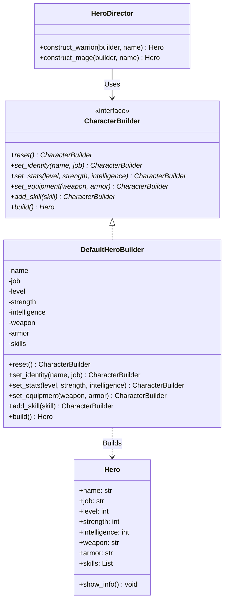

# 빌더 패턴 (Builder Pattern)


## 1. 패턴이 없을 때 발생하는 문제점 (The Problem)

빌더 패턴을 사용하지 않고 복잡한 객체를 하나의 생성자에서 직접 조립하면 여러 문제가 발생합니다. 특히 객체를 구성하는 선택지가 늘어날수록 생성자의 매개변수와 조건문이 함께 증가하여 코드가 복잡해집니다.

```python
class BadHero:
    def __init__(
        self,
        name: str,
        job: str,
        level: int = 1,
        strength: int = 10,
        intelligence: int = 10,
        weapon: str | None = None,
        armor: str | None = None,
        skills: list[str] | None = None,
        title: str | None = None,
        guild: str | None = None,
    ):
        self.name = name
        self.job = job
        self.level = level
        self.strength = strength
        self.intelligence = intelligence
        self.title = title
        self.guild = guild
        self.skills = skills or []

        # 문제점 1: 생성자가 객체 구성 규칙을 전부 알고 있어야 함
        if job == "warrior":
            self.weapon = weapon or "Sword"
            self.armor = armor or "ChainMail"

            if strength < 15:
                raise ValueError("전사는 최소 힘 15가 필요합니다.")

        elif job == "mage":
            self.weapon = weapon or "Wand"
            self.armor = armor or "Robe"

            if intelligence < 15:
                raise ValueError("마법사는 최소 지능 15가 필요합니다.")

        else:
            raise ValueError("알 수 없는 직업입니다.")

        # 문제점 2: 객체 생성 과정에 후처리 로직까지 혼재됨
        if level >= 10 and title is None:
            self.title = "숙련된 모험가"


hero = BadHero(
    "아라곤",
    "warrior",
    20,
    25,
    8,
    "Anduril",
    "PlateArmor",
    ["Slash", "Guard", "Charge"],
    "북부의 순찰자",
    None,
)

```

또한 여러 위치에서 동일한 종류의 캐릭터를 생성하는 경우, 생성 규칙 자체가 클라이언트 코드로 파편화되기 쉽습니다.

```python
# 전사 생성 규칙이 여러 클라이언트에 중복되어 작성됨

hero1 = BadHero(
    name="아라곤",
    job="warrior",
    level=20,
    strength=25,
    intelligence=8,
    weapon="Anduril",
    armor="PlateArmor",
    skills=["Slash", "Guard"],
)

hero2 = BadHero(
    name="보로미르",
    job="warrior",
    level=18,
    strength=23,
    intelligence=7,
    weapon="LongSword",
    armor="PlateArmor",
    skills=["Slash", "Guard"],
)

```

### 이 방식이 가진 단점

* **생성자 복잡도 증가:** 객체의 선택적 속성과 구성 규칙이 늘어날수록 생성자의 인자 수와 내부 조건문이 함께 증가합니다.
* **객체 생성 절차의 중복:** "전사라면 힘을 높이고 검과 갑옷을 장착한다"와 같은 생성 레시피가 여러 클라이언트 코드에 반복되어 작성될 수 있습니다.
* **불완전한 객체 상태 관리의 어려움:** 객체를 여러 단계에 걸쳐 준비해야 할 때, 어느 시점부터 객체가 사용 가능한 유효 상태인지 명확히 표현하기 어렵습니다.
* **클라이언트의 세부 구현 의존:** 호출 측에서 어떤 속성을 어떤 순서와 조합으로 지정해야 하는지 알아야 하므로 객체 생성 규칙에 대한 결합도가 높아집니다.

---

## 2. 빌더 패턴으로 해결하기 (The Solution)

빌더 패턴은 "복잡한 객체를 만드는 과정을 여러 단계로 분리하고, 그 생성 과정을 전담하는 객체"를 두어 이 문제를 해결합니다.

1. 클라이언트가 거대한 생성자에 모든 값을 한꺼번에 전달하는 대신 `set_stats()`, `set_equipment()`, `add_skill()`과 같이 의미 있는 생성 단계를 순차적으로 호출할 수 있습니다.
2. 실제 완성 객체는 마지막 `build()` 단계에서 반환하므로, 객체를 구성하는 과정과 완성된 객체를 사용하는 과정을 명확히 분리할 수 있습니다.
3. 자주 사용되는 생성 순서는 디렉터(Director)에 하나의 레시피로 모아 재사용할 수 있습니다.

예를 들어 다음과 같이 구현할 수 있습니다.

```python
hero = (
    HeroBuilder()
    .set_identity("아라곤", "warrior")
    .set_stats(level=20, strength=25, intelligence=8)
    .set_equipment("Anduril", "PlateArmor")
    .add_skill("Slash")
    .add_skill("Guard")
    .build()
)

```

클라이언트 관점에서는 생성자의 세부 인자 배치보다 "캐릭터를 어떤 단계로 구성하는가"가 코드상에 명확히 드러납니다.

또한 자주 사용되는 생성 절차는 디렉터(Director)에 위임할 수 있습니다.

```python
warrior = director.construct_warrior(builder, "아라곤")
mage = director.construct_mage(builder, "간달프")

```

핵심은 빌더가 단순히 생성자를 여러 메서드로 나누는 것에 그치지 않는다는 점입니다. **Builder가 객체의 구성 중간 상태를 보관하고, 여러 생성 단계를 하나의 완성 과정으로 캡슐화한다**는 것이 빌더 패턴의 본질입니다.

---

## 3. 장점, 단점 및 트레이드오프 (Trade-off)

### 장점 (Pros)

* **복잡한 생성 과정 분리:** 제품(Product) 객체가 자신의 생성 절차를 모두 직접 책임질 필요가 없습니다.
* **가독성 향상:** `set_stats()`, `set_equipment()`, `add_skill()`처럼 각 단계가 명확한 의미를 가지므로 거대한 생성자 호출보다 의도를 파악하기 쉽습니다.
* **생성 레시피 재사용:** Director 또는 별도의 생성 함수를 통해 "기본 전사", "기본 마법사"와 같이 반복되는 생성 절차를 한곳에 정의할 수 있습니다.
* **선택적 구성에 유리:** 필수 단계와 선택 단계를 명확히 분리할 수 있어 설정 가능한 항목이 많은 복잡한 객체에 적합합니다.
* **완성 시점 제어:** 실제 제품 객체를 `build()` 호출 시점에만 생성하도록 설계하면, 구성 중인 상태와 사용 가능한 상태를 명확히 구분할 수 있습니다.

### 단점 (Cons)

* **설계 복잡도 증가:** Product 외에 Builder 인터페이스, Concrete Builder, 경우에 따라 Director까지 추가되므로 정의해야 하는 클래스와 코드 양이 증가합니다.
* **단순 객체에는 과도한 구조:** 필드가 몇 개 없는 단순한 객체라면 키워드 인자나 데이터 클래스만으로 충분하며, 오히려 Builder 도입이 가독성을 해칠 수 있습니다.
* **불완전 상태가 Builder 내부에 존재할 수 있음:** 일반적인 객체지향 Builder는 `build()`를 호출하기 전까지 필수 값이 빠진 중간 상태를 내부적으로 유지합니다. 별도의 검증 로직이 없다면 잘못된 생성 순서를 컴파일 단계에서 차단하지 못합니다.
* **가변 Builder 재사용 시 주의 필요:** 하나의 Builder 인스턴스를 여러 객체 생성에 재사용할 때 `reset()` 처리가 누락되면 이전 객체의 설정이 다음 객체로 누출될 수 있습니다.

### 트레이드오프 (Trade-off)

* **객체 구조가 단순할수록 불리:** 생성자 하나로 충분한 객체에 Builder를 도입하면 불필요한 추상화 계층만 늘어납니다.
* **구성 단계와 선택지가 많을수록 유리:** HTTP 요청, SQL 질의, UI 구성, 복잡한 설정 객체처럼 작은 조각을 단계적으로 조합해야 하는 상황에서 Builder의 가치가 극대화됩니다.
* **생성 순서 재사용에는 Director가 유리:** 동일한 조립 순서를 여러 곳에서 반복해야 한다면 Director가 효과적입니다. 반면 생성 순서 자체가 단순하다면 Director 없이 Builder만 사용해도 충분합니다.
* **Fluent Interface와 Builder의 구별:** 메서드 체이닝(Fluent Interface)은 Builder를 편리하게 표현하는 API 스타일일 뿐입니다. 모든 Fluent API가 Builder 패턴인 것은 아니며, Builder 패턴이 반드시 메서드 체이닝을 사용해야 하는 것도 아닙니다.
* **Abstract Factory와의 차이:** Abstract Factory가 서로 관련된 여러 제품군을 선택하고 생성하는 문제에 초점을 맞춘다면, Builder는 하나의 복잡한 결과물을 여러 단계에 걸쳐 조립하는 과정에 초점을 맞춥니다.

---

## 4. 파이썬 오픈소스에서 볼 수 있는 빌더와 유사한 설계

파이썬의 주요 프레임워크와 표준 라이브러리에서도 객체나 실행 계획을 단계적으로 구성한 뒤 최종 사용한다는 점에서 Builder와 유사한 구조를 찾아볼 수 있습니다.

다만 아래 사례들이 GoF Builder 패턴을 정석대로 구현한 것은 아니며, Builder의 핵심 개념인 점진적 구성(Incremental Construction)을 활용한 대표 사례로 이해하는 것이 적절합니다.

### SQLAlchemy (Select / SQL Expression API)

`select()`로 기본 질의 객체를 생성한 뒤 `where()`, `join()`, `group_by()`, `order_by()` 등을 연속적으로 적용하여 SQL 표현식을 단계적으로 구성합니다.

```python
stmt = (
    select(User)
    .where(User.active == True)
    .order_by(User.name)
)

```

### Django (QuerySet)

`filter()`, `exclude()`, `annotate()`, `order_by()` 등을 연속적으로 호출하여 하나의 데이터베이스 질의를 점진적으로 조립합니다.

```python
users = (
    User.objects
    .filter(is_active=True)
    .exclude(status="banned")
    .order_by("-created_at")
)

```

### 표준 라이브러리 argparse.ArgumentParser

`ArgumentParser` 객체를 먼저 생성한 뒤 여러 번의 `add_argument()` 호출을 통해 명령행 인터페이스의 명세를 점진적으로 구축합니다.

```python
parser = argparse.ArgumentParser()

parser.add_argument("filename")
parser.add_argument("--verbose", action="store_true")
parser.add_argument("--count", type=int, default=1)

args = parser.parse_args()

```

---

## 5. 클래스 다이어그램



---

## 6. 파이썬 예제 코드

```python
from abc import ABC, abstractmethod
from dataclasses import dataclass, field


# -------------------------------------------------------------------
# 1. 제품 (Product)
# -------------------------------------------------------------------

@dataclass
class Hero:
    name: str
    job: str
    level: int
    strength: int
    intelligence: int
    weapon: str
    armor: str
    skills: list[str] = field(default_factory=list)

    def show_info(self) -> None:
        print(f"\n=== {self.name} ===")
        print(f"직업: {self.job}")
        print(f"레벨: {self.level}")
        print(
            f"힘: {self.strength}, "
            f"지능: {self.intelligence}"
        )
        print(f"무기: {self.weapon}")
        print(f"방어구: {self.armor}")
        print(f"스킬: {', '.join(self.skills)}")


# -------------------------------------------------------------------
# 2. 빌더 인터페이스 (Builder)
# -------------------------------------------------------------------

class CharacterBuilder(ABC):

    @abstractmethod
    def reset(self) -> "CharacterBuilder":
        pass

    @abstractmethod
    def set_identity(
        self,
        name: str,
        job: str,
    ) -> "CharacterBuilder":
        pass

    @abstractmethod
    def set_stats(
        self,
        level: int,
        strength: int,
        intelligence: int,
    ) -> "CharacterBuilder":
        pass

    @abstractmethod
    def set_equipment(
        self,
        weapon: str,
        armor: str,
    ) -> "CharacterBuilder":
        pass

    @abstractmethod
    def add_skill(
        self,
        skill: str,
    ) -> "CharacterBuilder":
        pass

    @abstractmethod
    def build(self) -> Hero:
        pass


# -------------------------------------------------------------------
# 3. 구체 빌더 (Concrete Builder)
# -------------------------------------------------------------------

class DefaultHeroBuilder(CharacterBuilder):

    def __init__(self):
        self.reset()

    def reset(self) -> "DefaultHeroBuilder":
        self._name: str | None = None
        self._job: str | None = None

        self._level = 1
        self._strength = 10
        self._intelligence = 10

        self._weapon: str | None = None
        self._armor: str | None = None

        self._skills: list[str] = []

        return self

    def set_identity(
        self,
        name: str,
        job: str,
    ) -> "DefaultHeroBuilder":

        self._name = name
        self._job = job

        return self

    def set_stats(
        self,
        level: int,
        strength: int,
        intelligence: int,
    ) -> "DefaultHeroBuilder":

        self._level = level
        self._strength = strength
        self._intelligence = intelligence

        return self

    def set_equipment(
        self,
        weapon: str,
        armor: str,
    ) -> "DefaultHeroBuilder":

        self._weapon = weapon
        self._armor = armor

        return self

    def add_skill(
        self,
        skill: str,
    ) -> "DefaultHeroBuilder":

        self._skills.append(skill)

        return self

    def build(self) -> Hero:

        # 완성 시점에 필수 상태 검증
        if self._name is None:
            raise ValueError("이름이 설정되지 않았습니다.")

        if self._job is None:
            raise ValueError("직업이 설정되지 않았습니다.")

        if self._weapon is None:
            raise ValueError("무기가 설정되지 않았습니다.")

        if self._armor is None:
            raise ValueError("방어구가 설정되지 않았습니다.")

        if self._job == "warrior" and self._strength < 15:
            raise ValueError(
                "전사는 최소 힘 15가 필요합니다."
            )

        if self._job == "mage" and self._intelligence < 15:
            raise ValueError(
                "마법사는 최소 지능 15가 필요합니다."
            )

        hero = Hero(
            name=self._name,
            job=self._job,
            level=self._level,
            strength=self._strength,
            intelligence=self._intelligence,
            weapon=self._weapon,
            armor=self._armor,
            skills=list(self._skills),
        )

        # 다음 객체 생성 시 이전 상태가 누출되지 않도록 초기화
        self.reset()

        return hero


# -------------------------------------------------------------------
# 4. 디렉터 (Director)
# -------------------------------------------------------------------

class HeroDirector:

    def construct_warrior(
        self,
        builder: CharacterBuilder,
        name: str,
    ) -> Hero:

        return (
            builder
            .reset()
            .set_identity(name, "warrior")
            .set_stats(
                level=20,
                strength=25,
                intelligence=8,
            )
            .set_equipment(
                weapon="LongSword",
                armor="PlateArmor",
            )
            .add_skill("Slash")
            .add_skill("Guard")
            .build()
        )

    def construct_mage(
        self,
        builder: CharacterBuilder,
        name: str,
    ) -> Hero:

        return (
            builder
            .reset()
            .set_identity(name, "mage")
            .set_stats(
                level=20,
                strength=7,
                intelligence=28,
            )
            .set_equipment(
                weapon="WizardStaff",
                armor="MagicRobe",
            )
            .add_skill("Fireball")
            .add_skill("ManaShield")
            .build()
        )


# -------------------------------------------------------------------
# 5. 실행 (Usage)
# -------------------------------------------------------------------

if __name__ == "__main__":
    builder = DefaultHeroBuilder()
    director = HeroDirector()

    warrior = director.construct_warrior(
        builder,
        "아라곤",
    )

    mage = director.construct_mage(
        builder,
        "간달프",
    )

    warrior.show_info()
    mage.show_info()

    # Director 없이 클라이언트가 직접 조립하는 경우
    custom_hero = (
        builder
        .reset()
        .set_identity("레골라스", "archer")
        .set_stats(
            level=18,
            strength=17,
            intelligence=12,
        )
        .set_equipment(
            weapon="ElvenBow",
            armor="LeatherArmor",
        )
        .add_skill("DoubleShot")
        .add_skill("EagleEye")
        .build()
    )

    custom_hero.show_info()

```

---

## 부록 (Appendix): 현대적 타입 시스템과 함수형 관점의 재해석

빌더 패턴을 현대 타입 시스템과 함수형 프로그래밍 관점에서 재해석하면, Builder가 해결하려 했던 문제를 "가변 객체를 하나 더 두는 방식"이 아닌 전혀 다른 접근법으로 풀 수 있습니다.

고전적인 Builder는 다음과 같이 완전하지 않은 중간 상태를 허용합니다.

```text
Builder
 ├─ 이름 있음
 ├─ 직업 있음
 ├─ 스탯 없음
 ├─ 장비 없음
 └─ build() 호출 가능

```

따라서 일반적인 객체지향 언어에서는 `build()` 실행 시 필수 필드의 존재 여부를 런타임에 재검사해야 합니다.

반면 현대적인 타입 시스템에서는 한 단계 더 나아가 다음과 같이 접근합니다.
**"완성되지 않은 상태에서는 애초에 build 연산을 정적 타입 검사 단계에서 수행할 수 없게 만들 수는 없는가?"**

이 부록에서는 이를 설명하기 위해 대수적 데이터 타입(ADT), 인덱스드 타입(Indexed Type), 타입 상태(Typestate), 정제 타입(Refinement Type), 불변 데이터 및 함수 합성을 지원하는 가상의 Python 문법을 가정하여 설명합니다. *(아래 코드는 실제 Python 문법이 아닙니다.)*

### 1. Builder의 중간 상태를 타입으로 표현하기

고전적인 Builder에서는 객체 내부 필드가 `None`인지 여부를 런타임에 확인합니다.

```python
if self._name is None:
    raise ValueError(...)

```

하지만 강력한 타입 시스템에서는 "이름이 설정되었는가?"라는 상태 자체를 타입 매개변수로 명시할 수 있습니다.

```python
data Missing
data Set[T]

record HeroDraft[
    NameState,
    JobState,
    StatState,
    EquipmentState,
]:
    name: NameState
    job: JobState
    stats: StatState
    equipment: EquipmentState
    skills: Vector[Skill]

```

초기 상태는 모든 필수 값이 누락된 상태입니다.

```python
def empty_hero() -> HeroDraft[Missing, Missing, Missing, Missing]:
    return HeroDraft(
        name=Missing,
        job=Missing,
        stats=Missing,
        equipment=Missing,
        skills=[],
    )

```

이름을 설정하는 함수는 단순히 내부 필드를 변경하는 것이 아니라 타입 상태 자체를 전환합니다.

```python
def set_name[J, S, E](
    draft: HeroDraft[Missing, J, S, E],
    name: NonEmptyStr,
) -> HeroDraft[Set[str], J, S, E]:
    return draft with { name = Set(name) }

```

`set_name()` 호출 전과 후는 타입 수준에서 완전히 다른 값으로 취급됩니다.

$$\text{HeroDraft}[\text{Missing}, \dots] \xrightarrow{\text{set\_name()}} \text{HeroDraft}[\text{Set}[str], \dots]$$

프로그램은 객체 내부를 조사하지 않고도 현재 생성 과정이 어느 단계까지 진행되었는지를 타입만으로 파악할 수 있습니다.

### 2. build()를 완성된 상태에서만 허용하기

`build()` 함수 인자의 타입을 '모든 값이 완성된 상태'로만 제한할 수 있습니다.

```python
def build(
    draft: HeroDraft[
        Set[str],
        Set[Job],
        Set[Stats],
        Set[Equipment],
    ],
) -> Hero:
    return Hero(
        name=draft.name.value,
        job=draft.job.value,
        stats=draft.stats.value,
        equipment=draft.equipment.value,
        skills=draft.skills,
    )

```

이 함수에는 모든 필드가 `Set` 상태인 값만 전달할 수 있습니다. 따라서 아래 코드는 타입 컴파일 에러를 발생시킵니다.

```python
draft = (
    empty_hero()
    |> set_name("아라곤")
    |> choose_job(Warrior)
)

hero = build(draft)

```

컴파일러는 다음과 같이 에러를 감지합니다.

```text
Type Error:
expected: HeroDraft[Set[str], Set[Job], Set[Stats], Set[Equipment]]
found:    HeroDraft[Set[str], Set[Job], Missing, Missing]

```

이 구조에서는 `if self._weapon is None:`과 같은 런타임 검사가 필요하지 않습니다. 불완전한 객체를 완성된 객체로 변환하는 연산 자체가 타입 수준에서 불가능하기 때문입니다.

### 3. 직업과 장비의 관계를 인덱스드 타입으로 표현하기

필수 값이 모두 설정되었다고 해서 논리적 오류가 완전히 사라지는 것은 아닙니다. 예를 들어 아래와 같은 상태는 모든 필드가 존재하지만 논리적으로 부적절합니다.

* 직업: Warrior
* 무기: Wand
* 방어구: MagicRobe

전통적인 Builder에서는 이 조합을 `build()` 내부 조건문으로 검사합니다. 반면 현대 타입 시스템에서는 직업과 장비 간의 관계 자체를 타입으로 바인딩할 수 있습니다.

```python
data Job = Warrior | Mage

data EquipmentFor[J]:
    WarriorEquipment(weapon: Sword, armor: ChainMail) -> EquipmentFor[Warrior]
    MageEquipment(weapon: Wand, armor: Robe) -> EquipmentFor[Mage]

record HeroDraft[J, NameState, StatState, EquipmentState]:
    name: NameState
    stats: StatState
    equipment: EquipmentState
    skills: Vector[Skill]

```

장비 설정 함수는 선택된 직업 `J`에 부합하는 장비만 허용합니다.

```python
def equip[J, N, S](
    draft: HeroDraft[J, N, S, Missing],
    equipment: EquipmentFor[J],
) -> HeroDraft[J, N, S, Set[EquipmentFor[J]]]:
    return draft with { equipment = Set(equipment) }

```

전사 `HeroDraft`에는 오직 `EquipmentFor[Warrior]` 타입만 들어갈 수 있으므로, 잘못된 조합은 컴파일 시점에 즉시 차단됩니다.

```python
warrior = choose_job(empty_hero(), Warrior)

# 정상 동작
warrior = equip(warrior, WarriorEquipment(Sword(), ChainMail()))

# 타입 오류 발생
warrior = equip(warrior, MageEquipment(Wand(), Robe()))

```

```text
Type Error:
expected: EquipmentFor[Warrior]
found:    EquipmentFor[Mage]

```

"전사에게 마법사 장비를 장착할 수 없다"는 도메인 규칙이 조건문이나 주석이 아닌 **타입 시스템 자체**로 보장됩니다.

### 4. 정제 타입(Refinement Type)을 이용한 값 제약

타입 상태만으로 표현하기 어려운 값 범위 조건(예: 레벨 1~100, 양수 스탯)은 정제 타입을 통해 정의할 수 있습니다.

```python
type Level = Int where 1 <= value <= 100
type StatPoint = Int where value >= 0
type NonEmptyStr = str where len(value) > 0

record Stats:
    level: Level
    strength: StatPoint
    intelligence: StatPoint

```

부적절한 값은 인스턴스 생성 시점에 정적으로 거부됩니다.

```python
Stats(level=-10, strength=-500, intelligence=20)

```

```text
Type Error:
-10 does not satisfy refinement: 1 <= value <= 100

```

기존 Builder의 `build()` 메서드가 담당하던 검증 책임 상당 부분이 타입을 정의하는 시점으로 이동합니다.

### 5. 가변 Builder 객체 대신 순수 함수 사용하기

함수형 언어에서는 Builder 객체가 내부 상태를 계속 변경(Mutation)할 필요가 없습니다. 각 생성 단계를 **불변 데이터를 다른 불변 데이터로 변환하는 순수 함수**로 구현하기 때문입니다.

```python
def add_skill[J, N, S, E](
    draft: HeroDraft[J, N, S, E],
    skill: Skill,
) -> HeroDraft[J, N, S, E]:
    return draft with { skills = draft.skills.append(skill) }

```

파이프 연산자(`|>`)와 조합하면 다음과 같이 작성할 수 있습니다.

```python
hero = (
    empty_hero()
    |> set_name("아라곤")
    |> choose_job(Warrior)
    |> set_stats(Stats(level=20, strength=25, intelligence=8))
    |> equip(WarriorEquipment(Sword(), ChainMail()))
    |> add_skill(Slash)
    |> add_skill(Guard)
    |> build
)

```

겉보기에는 Fluent Builder와 유사하지만, 내부 동작 방식은 크게 다릅니다.

* **객체지향 Builder:** 단일 Builder 객체가 존재하며, 내부 상태 변경을 지속적으로 수행
* **함수형 방식:** 불변 Draft 객체들이 존재하며, 순수 함수 적용에 의해 새로운 Draft로 연속 변환

"빌더 객체가 가변 상태를 가진다"는 개념 대신, **객체 생성 과정이 순수한 값 변환의 흐름으로 표현**됩니다.

### 6. Director 대신 함수 합성으로 생성 레시피 표현하기

고전적 Builder의 Director는 자주 사용되는 생성 절차를 클래스로 캡슐화합니다. 함수형 패러다임에서는 이를 가변 상태 객체 없이 함수 합성(Function Composition)으로 깔끔하게 대체할 수 있습니다.

```python
def warrior_recipe(name: NonEmptyStr) -> Hero:
    return (
        empty_hero()
        |> set_name(name)
        |> choose_job(Warrior)
        |> set_stats(Stats(level=20, strength=25, intelligence=8))
        |> equip(WarriorEquipment(Sword(), ChainMail()))
        |> add_skill(Slash)
        |> add_skill(Guard)
        |> build
    )

def mage_recipe(name: NonEmptyStr) -> Hero:
    return (
        empty_hero()
        |> set_name(name)
        |> choose_job(Mage)
        |> set_stats(Stats(level=20, strength=7, intelligence=28))
        |> equip(MageEquipment(Wand(), Robe()))
        |> add_skill(Fireball)
        |> add_skill(ManaShield)
        |> build
    )

aragorn = warrior_recipe("아라곤")
gandalf = mage_recipe("간달프")

```

별도의 `HeroDirector` 인스턴스나 재사용 시 초기화해야 하는 Builder 객체 없이, 생성 절차 그 자체를 독립적인 함수로 정의하여 재사용합니다.

### 7. Builder를 "상태 머신"으로 바라보기

이 관점에서 Builder는 단순히 메서드를 체이닝하는 도구가 아닌 객체 생성 상태 머신(State Machine)으로 해석할 수 있습니다.

$$\text{Empty} \rightarrow \text{Named} \rightarrow \text{JobSelected} \rightarrow \text{StatsConfigured} \rightarrow \text{Equipped} \rightarrow \text{Ready} \rightarrow \text{Hero}$$

고전 Builder가 이 상태 전이를 런타임 내부 변수로 관리했다면, Typestate 기법은 이 전이를 정적 타입 시스템에 직접 바인딩합니다.

```python
def choose_job(draft: HeroDraft[Named], job: J) -> HeroDraft[JobSelected[J]]: ...
def set_stats[J](draft: HeroDraft[JobSelected[J]], stats: Stats) -> HeroDraft[StatsConfigured[J]]: ...
def equip[J](draft: HeroDraft[StatsConfigured[J]], equipment: EquipmentFor[J]) -> HeroDraft[Equipped[J]]: ...
def build[J](draft: HeroDraft[Ready[J]]) -> Hero[J]: ...

```

올바르지 않은 순서로 함수를 호출할 경우 런타임 오류가 아닌 타입 검사 오류로 차단됩니다.

```python
empty_hero() |> equip(WarriorEquipment(Sword(), ChainMail()))

```

```text
Type Error:
equip requires: HeroDraft[StatsConfigured[J]]
but received:  HeroDraft[Empty]

```

### 8. 잘못된 상태를 검사하는 것과 표현하지 못하게 하는 것

고전 빌더 패턴의 검증 방식:

1. 불완전한 중간 상태의 생성을 허용한다.
2. `build()` 시점에 상태를 검사한다.
3. 조건에 맞지 않으면 런타임 예외를 발생시킨다.

반면 타입 시스템 중심 설계의 핵심 목표는 다음과 같습니다.
**"잘못된 상태를 검사하여 제거하는 것이 아니라, 잘못된 상태 자체가 표현 불가능하도록 타입을 정의한다."**

```python
data ReadyHero[J]:
    Ready(
        name: NonEmptyStr,
        stats: StatsFor[J],
        equipment: EquipmentFor[J],
        skills: Vector[SkillFor[J]],
    )

```

이 구조에서는 전사에게 마법사 장비가 할당된 `ReadyHero` 데이터 타입 구조 자체를 조합하는 것이 언어적으로 불가능해집니다.

---

### 요약 및 비교

| 관점 | 빌더 패턴 (OOP 아키텍처) | 현대 타입 시스템 + 함수형 관점 |
| --- | --- | --- |
| **생성 상태 저장 위치** | 가변 Builder 객체 내부 | 불변 값의 타입 및 데이터 |
| **생성 단계 표현** | Builder 메서드 연속 호출 | 순수 함수에 의한 타입 상태 전이 |
| **불완전 상태 처리** | `build()` 시점 런타임 검증 | `build()`가 완성 타입에만 정의됨 |
| **잘못된 호출 순서** | 런타임 컨벤션 또는 에러 처리 | Typestate를 통한 정적 타입 오류 |
| **필수 값 누락** | `None` 체크 등으로 확인 | `Missing` $\rightarrow$ `Set[T]` 상태 전이 |
| **값 범위 검증** | 조건문 및 런타임 예외 | Refinement Type (정제 타입) |
| **직업-장비 조합** | 조건문을 통한 런타임 검사 | Indexed Type / GADT |
| **중간 상태 변경** | Builder 인스턴스 직접 수정 | 새로운 불변 Draft 객체 반환 |
| **생성 레시피 재사용** | Director 객체 사용 | 함수 합성 및 고차 함수 |
| **최종 객체 생성 조건** | Builder 내부 검증 로직 | 타입 서명 수준의 제약 |
| **주요 장점** | 생성 과정의 캡슐화와 가독성 | 잘못된 생성 과정을 정적으로 방지 |
| **주요 비용** | 추가 클래스 및 가변 상태 관리 | 강력한 정적 타입 시스템 필요 |

### 결론

고전적인 Builder 패턴은 **복잡한 객체의 생성 절차를 전담 객체로 캡슐화하는 OOP 설계 패턴**입니다.

반면 현대 타입 시스템과 함수형 패러다임에서는 이 문제를 반드시 가변 Builder 객체로 풀 필요가 없습니다. 객체가 완성되어 가는 과정을 **가변 객체의 내부 상태 변경** 대신 **불변 데이터의 연속적인 타입 상태 전이**로 다룰 수 있기 때문입니다.

* Builder의 내부 상태 $\leftrightarrow$ Typestate가 바인딩된 불변 Draft
* Builder의 setter 메서드 $\leftrightarrow$ 순수 상태 전이 함수
* `build()`의 런타임 검증 $\leftrightarrow$ `build()`의 입력 타입 제한
* Director $\leftrightarrow$ 함수 합성으로 정의된 레시피 함수
* 조건문 기반 검증 $\leftrightarrow$ Indexed Type / Refinement Type

빌더의 핵심은 복잡한 객체의 생성 절차와 완성 조건을 제품 객체 밖으로 분리하는 데 있습니다. Typestate와 불변 Draft는 같은 생성 과정을 타입과 값의 전이로 표현해 잘못된 중간 상태를 더 일찍 드러내는 선택지입니다.
