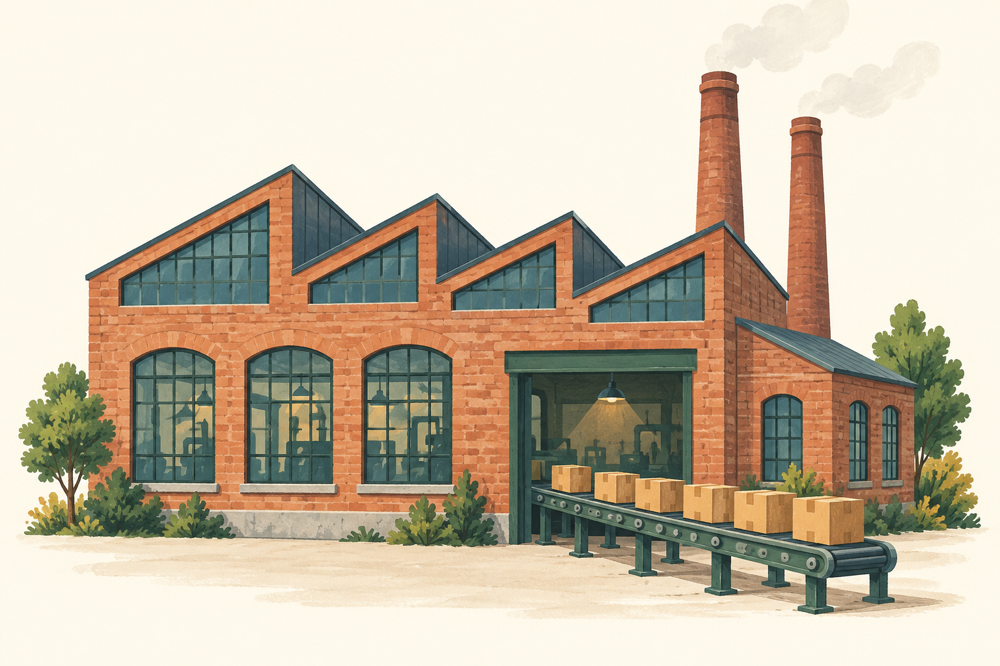
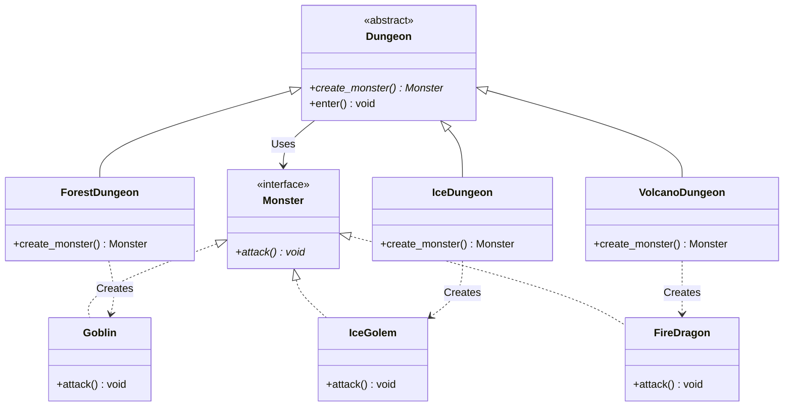

# 팩토리 메서드 패턴 (Factory Method Pattern)



## 1. 패턴이 없을 때 발생하는 문제점 (The Problem)

팩토리 메서드 패턴을 적용하지 않고 객체를 사용하는 코드에서 구체 클래스를 직접 생성하면 다양한 문제가 발생합니다. 특히 생성할 객체의 종류가 늘어날수록 조건문이 늘어나고, 객체를 활용하는 비즈니스 로직과 객체를 선택·생성하는 로직이 강하게 결합됩니다.

### 패턴을 적용하지 않은 예시

```python
from abc import ABC, abstractmethod


class Monster(ABC):
    @abstractmethod
    def attack(self) -> None:
        pass


class Goblin(Monster):
    def attack(self) -> None:
        print("[고블린] 단검 공격!")


class IceGolem(Monster):
    def attack(self) -> None:
        print("[아이스 골렘] 얼음 주먹 공격!")


class FireDragon(Monster):
    def attack(self) -> None:
        print("[화염 드래곤] 브레스 공격!")


class BadDungeon:
    def enter(self, dungeon_type: str) -> None:
        # 문제점 1: 사용하는 쪽에서 구체 제품을 직접 결정
        if dungeon_type == "forest":
            monster = Goblin()
        elif dungeon_type == "ice":
            monster = IceGolem()
        elif dungeon_type == "volcano":
            monster = FireDragon()
        else:
            raise ValueError("알 수 없는 던전입니다.")
        # 문제점 2: 생성 로직과 실제 비즈니스 로직이 혼재됨
        print("던전에 입장했습니다.")
        monster.attack()
```

새로운 던전과 몬스터가 추가되면 기존 조건문을 계속 수정해야 합니다.

```python
if dungeon_type == "forest":
    monster = Goblin()
elif dungeon_type == "ice":
    monster = IceGolem()
elif dungeon_type == "volcano":
    monster = FireDragon()
elif dungeon_type == "swamp":
    monster = PoisonSlime()
elif dungeon_type == "desert":
    monster = SandWorm()
```

동일한 생성 규칙이 필요한 곳이 많아지면 조건문이 프로젝트 전반에 반복되어 중복을 만듭니다.

```python
def preview_monster(dungeon_type: str) -> Monster:
    if dungeon_type == "forest":
        return Goblin()
    elif dungeon_type == "ice":
        return IceGolem()
    elif dungeon_type == "volcano":
        return FireDragon()
    raise ValueError("알 수 없는 던전입니다.")
```

### 이 방식이 가진 단점

* **구체 클래스에 직접 의존:** 상위 수준의 던전 로직이 `Goblin`, `IceGolem`, `FireDragon` 등 구체 제품 클래스를 직접 알아야 합니다.
* **조건문의 반복:** 객체 선택 및 분기 로직이 여러 클라이언트 코드로 확산될 수 있습니다.
* **OCP(개방-폐쇄 원칙) 위반:** 새로운 제품 종류를 추가할 때 기존 생성 조건문을 계속 수정해야 합니다.
* **생성과 사용 책임의 혼재:** "어떤 몬스터를 만들 것인가"라는 생성 책임과 "생성된 몬스터를 어떻게 사용할 것인가"라는 비즈니스 로직이 한 코드에 얽히게 됩니다.

---

## 2. 팩토리 메서드 패턴으로 해결하기 (The Solution)

팩토리 메서드 패턴은 "객체를 생성하는 메서드를 상위 클래스에 추상적인 확장 지점으로 정의하고, 실제로 어떤 구체 객체를 생성할지는 하위 클래스가 결정하도록 하는 방식"으로 문제를 해결합니다.

* 상위 `Creator`는 구체 제품이 아닌 `Product` 인터페이스에만 의존합니다.
* 객체를 실제로 생성하는 부분을 `Factory Method`로 분리합니다.
* `Concrete Creator`가 `Factory Method`를 재정의하여 자신에게 필요한 `Concrete Product`를 반환합니다.

예를 들어, 상위 `Dungeon` 클래스는 던전의 공통 실행 흐름만 정의합니다.

```python
class Dungeon(ABC):
    @abstractmethod
    def create_monster(self) -> Monster:
        pass

    def enter(self) -> None:
        monster = self.create_monster()
        print("던전에 입장했습니다.")
        monster.attack()
```

상위 클래스는 `create_monster()`가 어떤 구체 객체를 반환하는지 알 필요가 없으며, 구체 던전이 생성할 제품을 결정합니다.

```python
class ForestDungeon(Dungeon):
    def create_monster(self) -> Monster:
        return Goblin()


class IceDungeon(Dungeon):
    def create_monster(self) -> Monster:
        return IceGolem()
```

클라이언트는 구체 `Creator`를 선택한 뒤 동일한 인터페이스로 사용합니다.

```python
dungeon = ForestDungeon()
dungeon.enter()
```

`Dungeon.enter()`의 코드는 수정되지 않았지만, 실제 생성되는 제품은 `Goblin`으로 변경됩니다.

핵심은 단순히 객체 생성 코드를 별도 메서드로 옮기는 것이 아닙니다. **상위 `Creator`가 객체 생성 지점을 다형적인 확장 포인트로 정의하고, `Concrete Creator`가 어떤 `Concrete Product`를 생성할지 결정하도록 하는 것**이 팩토리 메서드 패턴의 본질입니다.

---

## 3. 장점, 단점 및 트레이드오프 (Trade-off)

### 장점 (Pros)

* **구체 제품과의 결합도 감소:** `Creator`의 비즈니스 로직은 `Goblin`, `IceGolem` 같은 구체 제품이 아닌 `Monster` 인터페이스에 의존합니다.
* **생성과 사용 책임 분리:** 제품을 사용하는 알고리즘과 제품을 실제로 생성하는 책임을 명확히 분리할 수 있습니다.
* **확장성 향상:** 새로운 제품이 추가되어도 기존 `Creator`의 핵심 비즈니스 로직을 수정하지 않고, 새로운 `Concrete Creator`를 추가하여 확장할 수 있습니다.
* **OCP 적용:** 기존 제품 사용 로직을 변경하지 않고 객체 생성 방식을 확장할 수 있습니다.
* **프레임워크 확장 포인트에 적합:** 상위 프레임워크가 전체 실행 흐름을 정의하고, 사용자 코드가 특정 객체의 생성만 변경하도록 유도하는 구조에 적합합니다.

### 단점 (Cons)

* **클래스 수 증가:** 제품 종류가 늘어날 때 `Concrete Product`뿐만 아니라 `Concrete Creator`까지 추가되어 전체 클래스 수가 늘어납니다.
* **상속 구조에 대한 의존:** 고전적인 Factory Method는 생성 전략 변경을 주로 서브클래싱과 메서드 오버라이딩으로 해결합니다.
* **단순한 생성 문제에는 과도한 구조:** 객체를 선택하는 조건이 매우 단순한 상황이라면 일반적인 팩토리 함수 하나로 해결하는 편이 더 명확할 수 있습니다.
* **런타임 조합의 유연성 부족:** 실행 중 생성 정책을 자유롭게 조합하거나 교체해야 하는 경우에는 상속보다 생성 함수나 전략 객체를 주입하는 방식이 더 유연합니다.

### 트레이드오프 (Trade-off)

* **상위 알고리즘이 안정적일수록 유리:** 전체 처리 과정은 고정되어 있고 특정 객체의 생성 방법만 확장해야 하는 경우 Factory Method가 유용합니다.
* **제품 종류 증가 시 Creator 계층 동반 증가:** 제품마다 별도의 생성 정책이 필요하면 클래스 계층도 함께 커집니다.
* **Simple Factory와의 구별:** 하나의 함수나 클래스가 조건문을 사용해 여러 `Concrete Product`를 직접 선택하는 방식은 일반적인 Simple Factory에 가깝습니다. Factory Method의 핵심은 다형성을 이용해 생성 결정을 하위 클래스에 위임하는 것입니다.
* **Template Method 패턴과의 결합:** 상위 클래스가 전체 알고리즘을 정의하고, 그중 객체 생성 단계만 Factory Method로 열어두는 형태가 자주 활용됩니다.
* **Abstract Factory 패턴과의 차이:** Factory Method가 하나의 제품 생성 지점을 다형적으로 확장하는 것에 초점을 둔다면, Abstract Factory는 서로 연관된 여러 제품을 하나의 제품군으로 묶어 생성하는 데 초점을 둡니다.
* **OCP의 적용 범주:** `Concrete Creator`를 추가해 생성 로직을 확장할 수 있지만, 애플리케이션이 어떤 `Creator`를 사용할지 결정하는 구성 영역(Composition Root / Creator Selection)에서는 새로운 `Creator`를 등록하기 위한 최소한의 변경이 발생할 수 있습니다.

---

## 4. 파이썬 오픈소스에서 볼 수 있는 팩토리 메서드와 유사한 설계

파이썬의 주요 프레임워크와 표준 라이브러리에서도 상위 알고리즘은 유지하면서 특정 객체를 생성하거나 선택하는 메서드를 하위 클래스의 확장 지점으로 제공하는 구조를 찾아볼 수 있습니다.

다만 아래 사례들이 모두 GoF Factory Method 패턴을 완전히 동일하게 구현한 것은 아니며, Factory Method의 핵심 개념인 오버라이드 가능한 생성 지점(Overridable Creation Hook)을 활용한 대표적인 사례로 이해하는 것이 적절합니다.

### `unittest.TestCase.defaultTestResult()`

Python 표준 라이브러리의 `unittest.TestCase.run()`은 별도의 결과 객체가 전달되지 않았을 때 `defaultTestResult()`를 호출하여 사용할 `TestResult` 객체를 생성합니다. `TestCase`의 서브클래스는 필요한 경우 `defaultTestResult()`를 재정의하여 다른 `TestResult` 구현을 사용할 수 있습니다.

```python
class TestCase:
    def defaultTestResult(self):
        return TestResult()

    def run(self, result=None):
        if result is None:
            result = self.defaultTestResult()
        # 공통 테스트 실행 로직
        ...
```

구조를 단순화하면 다음과 같습니다.

$$\text{TestCase.run()} \longrightarrow \text{defaultTestResult()} \longrightarrow \text{TestResult}$$

상위 실행 알고리즘은 그대로 유지하면서 생성되는 결과 객체만 하위 클래스가 변경할 수 있다는 점에서 Factory Method의 전형적인 형태와 가깝습니다.

### Django `FormMixin`

Django의 `FormMixin`은 `get_form()`을 통해 Form 인스턴스를 생성하며, 사용할 Form 클래스는 `get_form_class()`를 통해 결정합니다.

```python
class FormMixin:
    def get_form_class(self):
        return self.form_class

    def get_form(self, form_class=None):
        if form_class is None:
            form_class = self.get_form_class()
        return form_class(**self.get_form_kwargs())
```

하위 View가 `get_form_class()` 또는 `get_form()`을 오버라이드하여 상위 폼 처리 흐름을 유지하면서 생성 대상을 변경할 수 있도록 구성되어 있습니다.

### SQLAlchemy `TypeDecorator.load_dialect_impl()`

SQLAlchemy의 `TypeDecorator.load_dialect_impl()`은 현재 데이터베이스 Dialect에 대응하는 `TypeEngine` 객체를 반환하는 오버라이드 가능한 훅입니다.

```python
class GUID(TypeDecorator):
    def load_dialect_impl(self, dialect):
        if dialect.name == "postgresql":
            return UUID()
        return CHAR(32)
```

상위 `TypeDecorator`의 처리 과정은 유지하면서 하위 클래스가 사용할 구체 타입을 결정한다는 점에서 Factory Method와 유사한 패턴을 보여줍니다.

---

## 5. 클래스 다이어그램



---

## 6. 파이썬 예제 코드

```python
from abc import ABC, abstractmethod


# -------------------------------------------------------------------
# 1. 제품 인터페이스 (Product)
# -------------------------------------------------------------------
class Monster(ABC):
    @abstractmethod
    def attack(self) -> None:
        pass


# -------------------------------------------------------------------
# 2. 구체 제품 (Concrete Products)
# -------------------------------------------------------------------
class Goblin(Monster):
    def attack(self) -> None:
        print("[고블린] 단검 공격!")


class IceGolem(Monster):
    def attack(self) -> None:
        print("[아이스 골렘] 얼음 주먹 공격!")


class FireDragon(Monster):
    def attack(self) -> None:
        print("[화염 드래곤] 브레스 공격!")


# -------------------------------------------------------------------
# 3. Creator
# -------------------------------------------------------------------
class Dungeon(ABC):
    @abstractmethod
    def create_monster(self) -> Monster:
        """Factory Method"""
        pass

    def enter(self) -> None:
        # 어떤 구체 Monster가 생성되는지는 알지 못함
        monster = self.create_monster()
        print("\n=== 던전 입장 ===")
        monster.attack()


# -------------------------------------------------------------------
# 4. 구체 Creator (Concrete Creators)
# -------------------------------------------------------------------
class ForestDungeon(Dungeon):
    def create_monster(self) -> Monster:
        return Goblin()


class IceDungeon(Dungeon):
    def create_monster(self) -> Monster:
        return IceGolem()


class VolcanoDungeon(Dungeon):
    def create_monster(self) -> Monster:
        return FireDragon()


# -------------------------------------------------------------------
# 5. 클라이언트
# -------------------------------------------------------------------
def explore_dungeon(dungeon: Dungeon) -> None:
    # 클라이언트는 어떤 Monster가 생성되는지 알 필요가 없음
    dungeon.enter()


# -------------------------------------------------------------------
# 6. 실행 (Usage)
# -------------------------------------------------------------------
if __name__ == "__main__":
    dungeons: list[Dungeon] = [ForestDungeon(), IceDungeon(), VolcanoDungeon()]
    for dungeon in dungeons:
        explore_dungeon(dungeon)
```

**실행 결과:**

```text
=== 던전 입장 ===
[고블린] 단검 공격!

=== 던전 입장 ===
[아이스 골렘] 얼음 주먹 공격!

=== 던전 입장 ===
[화염 드래곤] 브레스 공격!
```

새로운 독 늪 던전을 추가하더라도 기존 `Dungeon.enter()`와 클라이언트 로직을 수정할 필요가 없습니다.

```python
class PoisonSlime(Monster):
    def attack(self) -> None:
        print("[독 슬라임] 독액 공격!")


class SwampDungeon(Dungeon):
    def create_monster(self) -> Monster:
        return PoisonSlime()
```

---

## 부록 (Appendix): 현대적 타입 시스템과 함수형 관점의 재해석

팩토리 메서드 패턴을 현대 타입 시스템과 함수형 프로그래밍 관점에서 재해석하면, Factory Method가 해결하려 했던 문제를 반드시 "상속 구조의 가상 메서드"로 표현할 필요는 없습니다.

고전적인 Factory Method의 구조는 다음과 같습니다.

$$\text{Creator} \longrightarrow \text{operation()} \longrightarrow \text{factory\_method()}$$

$$\uparrow$$

$$\text{ConcreteCreator} \longrightarrow \text{ConcreteProduct}$$

핵심 문제는 결국 다음과 같습니다.

**"어떤 구체 값을 생성할 것인가라는 계산을, 그 값을 사용하는 상위 로직으로부터 어떻게 분리하고 교체 가능하게 만들 것인가?"**

이 부록에서는 고차 함수(Higher-Order Function), 대수적 데이터 타입(ADT), 타입클래스(Type Class), 연관 타입(Associated Type), 효과 타입(Effect Type)을 지원하는 가상의 Python 확장 문법을 가정하여 설명합니다. *(아래 코드는 이해를 돕기 위한 가상 의사 코드입니다.)*

### 1. Factory Method를 함수 타입으로 표현하기

고전적인 Factory Method에서는 생성 행위를 가상 메서드로 표현합니다.

```python
class Dungeon:
    def create_monster(self) -> Monster: ...
```

하지만 함수가 일급 객체인 언어에서는 "무언가를 생성하는 행위" 자체를 하나의 값으로 표현할 수 있습니다.

```text
type Factory[T] = () -> T
```

`Monster`를 만드는 Factory는 다음 타입에 해당합니다.

```python
Factory[Monster]
```

구체 생성 함수는 단순한 함수로 정의할 수 있습니다.

```python
def create_goblin() -> Goblin:
    return Goblin()


def create_ice_golem() -> IceGolem:
    return IceGolem()
```

상위 알고리즘은 생성 함수를 매개변수로 받아 사용합니다.

```text
def enter_dungeon[M <: Monster](
    factory: Factory[M],
) -> None:

    monster = factory()

    print("던전에 입장했습니다.")
    monster.attack()
```

호출 시 필요한 생성 전략을 전달합니다.

```python
enter_dungeon(create_goblin)
enter_dungeon(create_ice_golem)
```

고전 Factory Method의 `ConcreteCreator` 오버라이딩 방식이 **`Factory[T]` 타입의 함수 값**으로 치환되는 형태입니다. 생성 전략을 바꾸기 위해 매번 새로운 Creator 서브클래스를 만들 필요가 없습니다.

### 2. 상속 대신 고차 함수로 생성 전략 주입하기

생성 과정에 입력값이 필요하다면 Factory의 타입을 일반화할 수 있습니다.

```text
type Factory[Context, Product] = Context -> Product
```

예를 들어 몬스터 생성에 던전의 난이도와 플레이어 레벨이 필요한 상황을 가정해 보겠습니다.

```text
immutable record SpawnContext:
    player_level: Int
    difficulty: Difficulty
```

고블린 생성 함수는 다음과 같습니다.

```python
def create_goblin(context: SpawnContext) -> Goblin:
    return Goblin(level=context.player_level, elite=context.difficulty == Hard)
```

아이스 골렘 생성 함수 역시 동일한 Factory 타입을 따릅니다.

```python
def create_ice_golem(context: SpawnContext) -> IceGolem:
    return IceGolem(level=context.player_level + 10)
```

상위 알고리즘은 구체 제품에 관계없이 동작합니다.

```text
def spawn[M <: Monster](
    context: SpawnContext,
    factory: Factory[SpawnContext, M],
) -> M:

    return factory(context)
```

이 구조에서는 생성 정책이 **상속 계층**에 고정되는 대신 **함수 매개변수**로 이동하므로, 실행 중에도 생성 전략을 자유롭게 교체할 수 있습니다.

```python
factory = create_ice_golem if difficulty == Hard else create_goblin
monster = spawn(context, factory)
```

### 3. Creator와 Product의 관계를 연관 타입으로 표현하기

단순히 모든 Factory가 `Monster`를 반환한다고 정의하면 구체 Factory와 생성되는 구체 제품 사이의 관계가 타입 수준에서 흐려질 수 있습니다. 더 강력한 타입 시스템에서는 Factory마다 자신이 생성하는 Product 타입을 타입 수준에 직접 연결할 수 있습니다.

```text
trait Factory[F]:

    type Product

    def create(
        factory: F,
    ) -> Product
```

숲 던전의 Factory를 정의합니다.

```text
immutable record ForestFactory
impl Factory[ForestFactory]:

    type Product = Goblin

    def create(
        factory: ForestFactory,
    ) -> Goblin:

        return Goblin()
```

얼음 던전은 다른 연관 타입을 가집니다.

```text
immutable record IceFactory
impl Factory[IceFactory]:

    type Product = IceGolem

    def create(
        factory: IceFactory,
    ) -> IceGolem:

        return IceGolem()
```

따라서 호출 코드에 따라 컴파일러가 추론하는 타입이 세분화됩니다.

```python
monster = create(ForestFactory())  # monster : Goblin
monster = create(IceFactory())  # monster : IceGolem
```

고전 Factory Method가 런타임 다형성으로 관리하던 **`Creator → Product`** 관계를 `Factory F → Associated Product Type`이라는 정적 타입 관계 형태로 보존하는 접근법입니다.

### 4. 서브타입 다형성 대신 타입클래스 사용하기

고전적인 Factory Method에서는 Creator들이 동일한 부모 클래스를 상속받아야 합니다.

$$\text{Dungeon} \longleftarrow \{\text{ForestDungeon}, \text{IceDungeon}, \text{VolcanoDungeon}\}$$

반면 타입클래스를 지원하는 언어에서는 기존 타입을 수정하거나 공통 부모 클래스를 만들지 않고도 생성 능력을 부여할 수 있습니다.

```text
immutable record Forest
immutable record IceField
immutable record Volcano
```

각 타입에 Factory 구현을 부여합니다.

```text
impl Factory[Forest]:

    type Product = Goblin

    def create(_: Forest) -> Goblin:
        return Goblin()


impl Factory[IceField]:

    type Product = IceGolem

    def create(_: IceField) -> IceGolem:
        return IceGolem()
```

상위 함수는 Factory 제약만 요구합니다.

```text
def enter[D](
    dungeon: D,
) -> None
where Factory[D]:

    monster = Factory.create(dungeon)
    monster.attack()
```

즉, 고전적인 **상속을 통한 확장**을 **타입클래스 인스턴스 추가를 통한 확장**으로 전환할 수 있습니다.

### 5. 제품 집합이 닫혀 있다면 ADT로 표현하기

Factory Method는 새로운 Concrete Product가 지속적으로 추가될 수 있는 개방된 확장(Open Extension)에 유용합니다. 하지만 생성 가능한 제품 종류가 결정되어 있는 경우라면 대수적 데이터 타입(ADT)을 통한 접근이 더 간결할 수 있습니다.

```text
data DungeonType =
    Forest
  | Ice
  | Volcano
```

몬스터 역시 닫힌 ADT로 정의합니다.

```text
data Monster =
    Goblin(attack: Int)
  | IceGolem(attack: Int)
  | FireDragon(attack: Int)
```

생성 함수는 패턴 매칭을 활용합니다.

```python
def create_monster(dungeon: DungeonType) -> Monster:
    match dungeon:
        case Forest:
            return Goblin(attack=20)
        case Ice:
            return IceGolem(attack=40)
        case Volcano:
            return FireDragon(attack=100)
```

만약 새로운 `DungeonType`이 추가되었는데 생성 분기에 누락되어 있다면 완전성 검사(Exhaustive Pattern Matching)를 통해 컴파일 타임에 즉시 탐지됩니다.

```text
data DungeonType =
    Forest
  | Ice
  | Volcano
  | Swamp  # 추가 시 create_monster()의 match 분기 미작성 오류 발생
```

정리하자면 다음과 같은 기준을 적용해볼 수 있습니다.

* 외부 플러그인처럼 제품 종류가 계속 추가되는 구조 $\rightarrow$ **개방형 다형성 / Factory 함수 / Type Class**
* 제품 종류가 미리 고정되어 있는 구조 $\rightarrow$ **ADT + 패턴 매칭**

### 6. 생성 실패를 반환 타입에 포함하기

현실의 Factory는 객체 생성 시 파일 부재, 잘못된 데이터, 리소스 로딩 실패, 네트워크 오류 등 다양한 사유로 실패할 수 있습니다. 전통적인 OOP 코드에서는 이를 예외(Exception)로 처리하곤 하지만, 반환 타입만 봐서는 실패 가능성을 파악하기 어렵습니다.

함수형 관점에서는 성공과 실패를 ADT로 명시합니다.

```text
data Result[T, E] =
    Ok(T)
  | Err(E)
```

Factory 타입 역시 실패 가능성을 서명에 포함하도록 변경됩니다.

```text
type Factory[T, E] = () -> Result[T, E]
```

```text
def create_boss() -> Result[Boss, ResourceError]:

    resource = load_resource("boss.json")?

    return Ok(Boss(resource))
```

호출자는 실패 시나리오를 타입 수준에서 강제로 명시하여 처리해야 합니다.

```python
match create_boss():
    case Ok(boss):
        boss.attack()
    case Err(error):
        show_error(error)
```

### 7. 생성 과정의 부수효과를 Effect Type으로 표현하기

객체 생성에는 파일 읽기, 네트워크 통신, DB 조회, 환경 변수 접근, 난수 생성 등 다양한 부수효과(Side-effect)가 동반될 수 있습니다.

가상의 효과 시스템(Effect System)에서는 이러한 부수효과를 함수 서명에 명시할 수 있습니다.

```text
def create_remote_monster(
    config: ServerConfig,
) -> Result[RemoteMonster, NetworkError] ! Network:

    ...
```

이 타입 서명은 다음 정보를 나타냅니다.

* **입력:** `ServerConfig`
* **성공 결과:** `RemoteMonster`
* **실패 원인:** `NetworkError`
* **부수효과:** `Network`

부수효과를 투명하게 공개하므로, 호출자는 함수 내부를 보지 않고도 생성 과정에 요구되는 외부 환경 및 부수효과를 안전하게 파악할 수 있습니다.

### 8. Factory Method를 "생성 계산의 추상화"로 바라보기

고전적인 Factory Method 패턴의 핵심 구조는 다음과 같습니다.

$$\text{Creator.operation()} \longrightarrow \text{Factory Method} \longrightarrow \text{Product}$$

여기서 본질적으로 변화하는 것은 Product 객체 자체뿐만 아니라 Product를 만들어 내는 계산(Computation)입니다.

* **객체지향:** 생성 계산을 **가상 메서드**로 표현
* **함수형:** 생성 계산을 **함수 값**(`Factory[Monster]`)으로 표현
* **타입클래스:** 생성 계산을 `Factory` 구현 + `Associated Product Type`으로 표현

효과 시스템까지 고려하여 표현하면 Factory는 다음과 같이 일반화된 형태를 갖습니다.

$$\text{Context} \longrightarrow \text{Result[Product, Error]} + \text{Effects}$$

```text
type Factory[
    Context,
    Product,
    Error,
    Effects,
] = Context -> Result[Product, Error] ! Effects
```

결국 팩토리 메서드 패턴의 본질은 클래스 구조 생성을 넘어서, "값을 생성하는 계산을 상위 비즈니스 로직에서 분리하고, 그 계산을 유연하게 교체 가능하도록 추상화하는 기법"으로 해석할 수 있습니다.

---

### 요약 및 비교

| 관점 | 팩토리 메서드 패턴 (OOP 아키텍처) | 현대 타입 시스템 + 함수형 관점 |
| --- | --- | --- |
| **생성 전략 표현** | 오버라이드 가능한 Factory Method | 일급 생성 함수 |
| **생성 전략 교체** | Concrete Creator 교체 | Factory 함수 전달 |
| **확장 방식** | 서브클래싱 (상속) | 고차 함수 / Type Class 구현 |
| **Creator-Product 관계** | 반환 인터페이스와 상속 관계 | Associated Type |
| **제품 종류가 열린 경우** | 서브타입 다형성 | 함수 / Type Class |
| **제품 종류가 닫힌 경우** | 클래스 계층 및 조건 처리 | ADT + 패턴 매칭 |
| **생성 실패 표현** | 예외 발생 또는 특수 값 반환 | `Result[Product, Error]` |
| **부수효과 표현** | 구현 내부에 암묵적으로 존재 | Effect Type으로 서명에 명시 |
| **런타임 생성 전략 변경** | Creator 객체 교체 | 함수 값 직접 교체 |
| **주요 확장 단위** | 클래스 | 함수 또는 타입클래스 인스턴스 |
| **주요 장점** | 상위 알고리즘과 구체 제품 생성의 분리 | 생성 계산 자체를 경량화하여 명시적으로 조합 가능 |
| **주요 비용** | Creator 계층 및 클래스 수 증가 | 고차 함수 및 고급 타입 추상화 개념 요구 |

---

### 결론

고전적인 Factory Method 패턴은 객체 생성 지점을 상위 클래스에 추상 메서드로 정의하고, 구체 제품의 생성을 하위 클래스에 위임하는 OOP 생성 패턴입니다. 이를 통해 상위 알고리즘은 구체 제품에 의존하지 않고도 객체를 생성하고 활용할 수 있습니다.

반면 현대 타입 시스템과 함수형 패러다임에서는 객체 생성 전략을 반드시 상속된 메서드로 표현할 필요는 없습니다. 생성 행위 자체를 일급 함수로 전달하거나, 타입클래스와 연관 타입을 통해 타입 수준에서 구성할 수 있기 때문입니다.

* **Factory Method 오버라이드** $\leftrightarrow$ **생성 함수 전달**
* **Concrete Creator** $\leftrightarrow$ **Factory 함수 또는 Type Class 인스턴스**
* **Product 반환 타입** $\leftrightarrow$ **Associated Product Type**
* **Creator 선택** $\leftrightarrow$ **고차 함수에 Factory 전달**
* **조건문 기반 제품 선택** $\leftrightarrow$ **ADT + Exhaustive Pattern Matching**
* **생성 실패 예외** $\leftrightarrow$ **`Result[Product, Error]`**
* **암묵적 부수효과** $\leftrightarrow$ **Effect Type**

팩토리 메서드의 핵심은 제품을 사용하는 상위 알고리즘에서 구체 제품의 생성 결정을 분리하고, 그 생성 지점을 재정의할 수 있게 만드는 데 있습니다. 일급 생성 함수와 타입 클래스는 같은 결정을 상속 없이 표현하는 선택지입니다.
