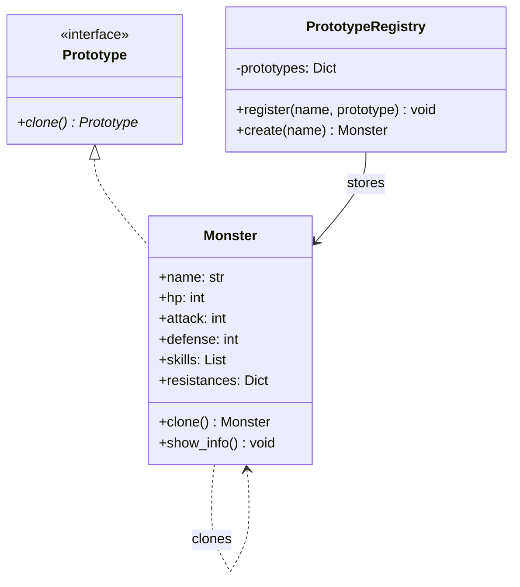

# 프로토타입 패턴 (Prototype Pattern)


## 1. 패턴이 없을 때 발생하는 문제점 (The Problem)

프로토타입 패턴을 사용하지 않고 기존 객체와 유사한 객체를 반복해서 생성하면, 복잡한 초기화 정보가 여러 위치에 중복되거나 객체 내부의 가변 상태를 잘못 공유하는 문제가 발생할 수 있습니다.

특히 객체를 생성하기 위해 많은 설정값이 필요하거나, 실행 중에 구성된 객체를 기준으로 새로운 변형 객체를 만들어야 하는 경우 이러한 문제가 더욱 두드러집니다.

### 패턴을 적용하지 않은 예시

```python
class Monster:
    def __init__(
        self,
        name: str,
        hp: int,
        attack: int,
        defense: int,
        skills: list[str],
        resistances: dict[str, int],
        loot_table: dict[str, float],
    ):
        self.name = name
        self.hp = hp
        self.attack = attack
        self.defense = defense
        self.skills = skills
        self.resistances = resistances
        self.loot_table = loot_table
```

기본 고블린과 대부분의 설정이 동일한 엘리트 고블린을 생성하는 상황을 가정해 보겠습니다.

```python
goblin = Monster(
    name="고블린",
    hp=100,
    attack=20,
    defense=10,
    skills=["Slash", "Dodge"],
    resistances={
        "fire": 0,
        "ice": 10,
    },
    loot_table={
        "gold": 0.8,
        "dagger": 0.1,
    },
)

elite_goblin = Monster(
    name="엘리트 고블린",
    hp=200,
    attack=40,
    defense=20,
    skills=["Slash", "Dodge"],
    resistances={
        "fire": 0,
        "ice": 10,
    },
    loot_table={
        "gold": 0.8,
        "dagger": 0.1,
    },
)
```

두 객체는 일부 값만 다름에도 불구하고, 대부분의 초기화 정보를 반복해서 작성해야 합니다.

이러한 중복을 피하기 위해 단순 대입을 사용하면 또 다른 문제가 발생합니다.

```python
elite_goblin = goblin

elite_goblin.name = "엘리트 고블린"
elite_goblin.hp = 200

print(goblin.name)
# 엘리트 고블린
```

Python의 대입 연산은 객체를 복제하는 것이 아니라 동일한 객체에 대한 참조를 하나 더 생성하므로, 두 변수가 동일한 객체를 가리키게 됩니다.

새로운 객체를 직접 생성하면서 내부 데이터를 재사용하는 방식 역시 위험을 내포하고 있습니다.

```python
elite_goblin = Monster(
    name="엘리트 고블린",
    hp=200,
    attack=goblin.attack,
    defense=goblin.defense,

    # 같은 list 객체를 공유
    skills=goblin.skills,

    # 같은 dict 객체를 공유
    resistances=goblin.resistances,
    loot_table=goblin.loot_table,
)
```

이 상황에서 다음과 같이 코드를 실행해 보겠습니다.

```python
elite_goblin.skills.append("PowerSlash")
```

그러면 원본 객체의 `skills`에도 영향을 주게 됩니다.

```python
print(goblin.skills)
# ["Slash", "Dodge", "PowerSlash"]
```

### 이 방식이 가진 단점

* **복잡한 초기화 코드 중복:** 기존 객체와 대부분의 상태가 동일하더라도 생성자의 모든 인자값을 다시 지정해야 합니다.
* **구체 클래스에 대한 의존:** 복사를 수행하는 클라이언트가 객체의 구체적인 타입과 생성자 구조를 상세히 알고 있어야 합니다.
* **객체 내부 구조 노출:** 어떤 필드를 그대로 공유하고 어떤 필드를 별도로 복제해야 하는지 클라이언트가 직접 파악해야 합니다.
* **공유 참조 버그 위험:** 리스트나 딕셔너리 같은 가변 객체를 잘못 공유할 경우, 한 객체의 변경이 다른 객체에 의도치 않은 영향을 줄 수 있습니다.
* **런타임 구성 재사용의 어려움:** 실행 중 복잡하게 구성된 객체를 새로운 객체의 템플릿으로 활용하려면, 해당 상태를 다시 생성자 인자로 일일이 분해해야 합니다.

---

## 2. 프로토타입 패턴으로 해결하기 (The Solution)

프로토타입 패턴은 "새로운 객체를 처음부터 생성하는 대신, 이미 존재하는 객체를 원형(Prototype)으로 사용하여 새로운 객체를 복제하는 방식"으로 이 문제를 해결합니다.

1. 복제 가능한 객체가 공통 `clone()` 인터페이스를 제공합니다.
2. 객체의 구체적인 복제 방법은 Prototype 자신이 직접 관리합니다.
3. 클라이언트는 구체적인 생성자 호출 대신 기존 객체의 `clone()` 메서드를 호출하여 새로운 객체를 얻습니다.

예를 들어 다음과 같이 활용할 수 있습니다.

```python
goblin = Monster(
    name="고블린",
    hp=100,
    attack=20,
    defense=10,
    skills=["Slash", "Dodge"],
)

elite_goblin = goblin.clone()

elite_goblin.name = "엘리트 고블린"
elite_goblin.hp = 200
```

클라이언트 입장에서는 Monster의 생성자 매개변수가 무엇인지, 내부 가변 객체나 별도 복제 필드가 무엇인지 등의 세부 구현 정보를 파악할 필요가 없습니다. 복제에 관한 정책을 객체 내부로 캡슐화할 수 있기 때문입니다.

또한 여러 Prototype을 Registry에 등록하여 관리하는 구조도 가능합니다.

```python
registry.register(
    "goblin",
    goblin_prototype,
)

monster = registry.create("goblin")
```

이 경우 객체 생성의 기준은 더 이상 클래스와 생성자를 직접 호출하는 방식이 아니며, **이미 구성된 Monster 객체의 `clone()` 연산을 호출하는 방식**으로 바뀌게 됩니다.

이 패턴의 핵심은 단순히 `deepcopy()`를 사용하는 것에 그치지 않습니다.

**객체 생성의 기준을 클래스와 생성자에서 이미 구성된 런타임 객체의 상태로 이동시키는 것**이 프로토타입 패턴의 본질입니다.

---

## 3. 장점, 단점 및 트레이드오프 (Trade-off)

### 장점 (Pros)

* **복잡한 초기화 과정 재사용:** 이미 완성된 객체의 상태를 그대로 활용하므로 복잡한 생성 과정을 반복할 필요가 없습니다.
* **구체 클래스와의 결합도 감소:** 클라이언트가 객체의 생성자 구조를 직접 알 필요 없이 `clone()` 인터페이스만으로 객체를 생성할 수 있습니다.
* **런타임 상태를 생성 템플릿으로 활용:** 설정 파일, 사용자 입력, 동적 계산 등을 통해 구성된 객체 자체를 새로운 객체 생성의 기준으로 사용할 수 있습니다.
* **변형 객체 생성에 유리:** 기본 Prototype을 복제한 뒤 일부 속성만 변경하여 다양한 변형 객체를 쉽게 생성할 수 있습니다.
* **Prototype Registry 구성 가능:** 미리 정의된 Prototype을 식별자(이름, 키 등)로 등록하여 데이터 중심의 객체 생성 시스템을 구축할 수 있습니다.

### 단점 (Cons)

* **복사 의미 정의의 어려움:** 어떤 필드를 공유하고 어떤 필드를 복제해야 하는지는 도메인 객체의 의미에 따라 달라지므로 명확히 정의하기 어려울 수 있습니다.
* **얕은 복사와 깊은 복사 문제:** 내부에 가변 객체가 포함된 경우 단순한 얕은 복사만으로는 완전히 독립된 객체를 만들어내지 못할 수 있습니다.
* **순환 참조 처리의 복잡성:** 객체 그래프 내에 순환 참조가 존재할 경우, 깊은 복사 로직을 직접 구현하기가 매우 복잡해집니다.
* **외부 자원의 복제 문제:** 파일, 소켓, 스레드, 락, DB 연결처럼 단순히 복제해서는 안 되는 자원이 포함되어 있으면 복제 처리가 까다롭습니다.
* **객체 정체성(Identity) 문제:** ID, 생성 시각, 이벤트 구독, 캐시 상태 등을 복제 대상에 포함할지, 혹은 새롭게 생성할지 별도로 정의해야 합니다.

### 트레이드오프 (Trade-off)

* **객체 초기화가 복잡할수록 유리:** 생성 과정이 단순한 객체라면 Prototype 패턴보다 생성자를 직접 호출하는 편이 훨씬 명확합니다.
* **유사한 객체를 반복 생성할수록 유리:** 게임 엔티티, 그래픽 객체, 문서 템플릿, UI 구성 요소 등 기본 상태를 공유하는 변형 객체가 다수 필요한 시스템에서 효과적입니다.
* **깊은 복사가 항상 정답은 아님:** 모든 내부 객체를 깊게 복사하면 불필요한 메모리 사용과 성능 비용이 발생할 수 있습니다.
* **얕은 복사 역시 항상 잘못된 것은 아님:** 불변 객체나 의도적으로 공유해야 하는 리소스의 경우, 여러 Prototype 인스턴스가 동일한 참조를 공유하도록 설계하는 것이 더 적절할 수 있습니다.
* **Prototype과 Factory 계열의 차이:** Factory Method나 Abstract Factory가 **생성 규칙을 클래스 또는 Factory 객체에 보관**하는 방식이라면, Prototype은 **이미 존재하는 객체의 상태 자체를 생성 규칙으로 사용**합니다.
* **Prototype과 Builder의 차이:** Builder 패턴이 객체를 여러 단계에 걸쳐 처음부터 조립하는 과정에 초점을 둔다면, Prototype 패턴은 이미 완성된 객체를 기준으로 새로운 객체를 파생시키는 데 초점을 둡니다.
* **복제 정책은 도메인 의미에 따라 결정해야 함:** Prototype 패턴 자체가 얕은 복사나 깊은 복사 중 하나만을 강제하지는 않습니다. 어떤 복사 방식이 올바른지는 해당 객체의 도메인 의미와 소유 관계에 따라 결정해야 합니다.

---

## 4. 파이썬 오픈소스에서 볼 수 있는 프로토타입과 유사한 설계

파이썬 표준 라이브러리와 오픈소스 생태계에서도 **기존 객체를 기준으로 새로운 객체를 생성하거나, 객체가 자신의 복제 정책을 스스로 정의하도록 하는 구조**를 자주 찾아볼 수 있습니다.

다만 아래 제시된 사례들이 GoF Prototype 패턴을 정석대로 구현한 것은 아니며, **기존 객체를 새로운 객체 생성의 원형으로 사용하는 Prototype의 핵심 개념을 적용한 사례**로 이해하는 것이 적절합니다.

### Python `copy` 모듈

Python 표준 라이브러리의 `copy` 모듈은 `copy.copy()`와 `copy.deepcopy()`를 통해 각각 얕은 복사와 깊은 복사를 지원합니다.

사용자 정의 클래스는 `__copy__()`와 `__deepcopy__()` 메서드를 정의하여 자신의 복제 방법을 직접 제어할 수 있습니다. `deepcopy()`는 순환 객체 구조를 처리하고 동일 객체의 중복 복사를 방지하기 위해 `memo` 딕셔너리를 내부적으로 활용합니다.

```python
from copy import copy, deepcopy

monster2 = copy(monster)
monster3 = deepcopy(monster)
```

객체가 자신의 깊은 복사 정책을 직접 정의할 수도 있습니다.

```python
class Monster:

    def __deepcopy__(self, memo):
        ...
```

이는 **복제 정책을 객체 내부에 캡슐화할 수 있다**는 점에서 Prototype 패턴의 메커니즘과 직접 연결됩니다.

---

### `copy.replace()`

Python 3.13에 추가된 `copy` 모듈의 `copy.replace()`는 기존 객체를 기반으로 일부 필드만 변경된 새로운 객체를 생성하는 기능을 제공합니다. 이 함수는 named tuple, dataclass, 그리고 `__replace__()`를 구현한 사용자 정의 클래스 등을 지원합니다.

```python
from copy import replace

elite = replace(
    goblin,
    name="엘리트 고블린",
    hp=200,
)
```

이는 기존에 **`clone()` 호출 후 필드를 수정하던 단계별 흐름**을, **`replace(changes)`를 통해 변경 사항이 적용된 새로운 변형 객체를 직접 얻는 방식**으로 단순화한 접근 방식입니다.

---

### `dataclasses.replace()`

`dataclasses.replace()`는 기존 dataclass 인스턴스와 동일한 타입의 새로운 객체를 생성하면서 지정한 필드만 변경합니다.

새 객체를 생성할 때 해당 dataclass의 `__init__()`을 다시 호출하며, `__post_init__()`이 구현되어 있다면 해당 메서드도 함께 실행됩니다. 따라서 메모리를 그대로 복제하는 전통적인 `clone()` 연산과는 차이가 있지만, **기존 객체를 새로운 객체의 템플릿으로 활용하는 방식**이라는 점에서 Prototype과 유사성을 가집니다.

```python
from dataclasses import dataclass, replace


@dataclass
class Monster:
    name: str
    hp: int
    attack: int


goblin = Monster(
    name="고블린",
    hp=100,
    attack=20,
)

elite = replace(
    goblin,
    name="엘리트 고블린",
    hp=200,
)
```

---

### attrs.evolve()

`attrs` 라이브러리의 `attrs.evolve()` 역시 기존 attrs 인스턴스를 기반으로 변경된 필드를 적용한 새로운 객체를 만들어냅니다.

`evolve()`는 기존 값을 기반으로 새 인스턴스를 생성하고 변경값을 적용하며, 이 과정에서 `__init__()` 및 기존 validator들을 그대로 활용합니다.

```python
elite = attrs.evolve(
    goblin,
    name="엘리트 고블린",
    hp=200,
)
```

이 기법은 전통적인 Prototype의 `clone()` 방식보다 **copy-with-update** 형태에 가까운 현대적 변형 구조라고 볼 수 있습니다.

---

## 5. 클래스 다이어그램



---

## 6. 파이썬 예제 코드

```python
from abc import ABC, abstractmethod
from copy import deepcopy
from dataclasses import dataclass, field
from typing import Self

# -------------------------------------------------------------------
# 1. Prototype 인터페이스
# -------------------------------------------------------------------

class Prototype(ABC):
    @abstractmethod
    def clone(self) -> Self:
        pass

# -------------------------------------------------------------------
# 2. 구체 Prototype
# -------------------------------------------------------------------

@dataclass
class Monster(Prototype):
    name: str
    hp: int
    attack: int
    defense: int
    skills: list[str] = field(default_factory=list)
    resistances: dict[str, int] = field(default_factory=dict)
    loot_table: dict[str, float] = field(default_factory=dict)

    def clone(self) -> Self:
        # 이 예제에서는 내부 가변 컬렉션까지
        # 독립시키기 위해 깊은 복사를 사용합니다.
        return deepcopy(self)

    def show_info(self) -> None:
        print(f"\n=== {self.name} ===")
        print(f"HP: {self.hp}")
        print(f"공격력: {self.attack}")
        print(f"방어력: {self.defense}")
        print(f"스킬: {self.skills}")
        print(f"저항: {self.resistances}")
        print(f"드롭 테이블: {self.loot_table}")

# -------------------------------------------------------------------
# 3. Prototype Registry
# -------------------------------------------------------------------

class PrototypeRegistry:
    def __init__(self):
        self._prototypes: dict[str, Monster] = {}

    def register(self, name: str, prototype: Monster) -> None:
        self._prototypes[name] = prototype

    def create(self, name: str) -> Monster:
        prototype = self._prototypes.get(name)
        if prototype is None:
            raise KeyError(f"등록되지 않은 Prototype입니다: {name}")
        return prototype.clone()

# -------------------------------------------------------------------
# 4. 실행 (Usage)
# -------------------------------------------------------------------

if __name__ == "__main__":
    registry = PrototypeRegistry()
    goblin_prototype = Monster(
        name="고블린",
        hp=100,
        attack=20,
        defense=10,
        skills=["Slash", "Dodge"],
        resistances={"fire": 0, "ice": 10},
        loot_table={"gold": 0.8, "dagger": 0.1},
    )
    registry.register("goblin", goblin_prototype)
    goblin1 = registry.create("goblin")
    goblin2 = registry.create("goblin")
    # 복제된 객체의 일부만 변경합니다.
    goblin2.name = "엘리트 고블린"
    goblin2.hp = 200
    goblin2.attack = 40
    goblin2.skills.append("PowerSlash")
    goblin1.show_info()
    goblin2.show_info()
```

실행 결과를 통해 두 객체의 내부 컬렉션이 서로 독립적으로 동작함을 확인할 수 있습니다.

```text
=== 고블린 ===
HP: 100
공격력: 20
방어력: 10
스킬: ['Slash', 'Dodge']

=== 엘리트 고블린 ===
HP: 200
공격력: 40
방어력: 10
스킬: ['Slash', 'Dodge', 'PowerSlash']
```

`goblin2.skills`를 변경하더라도 `goblin1.skills`에는 영향을 주지 않습니다.

다만 본 예제에서 `deepcopy()`를 사용한 이유는 **Monster 객체가 가진 모든 내부 가변 데이터를 서로 독립시키겠다는 복제 정책을 선택했기 때문**입니다.

Prototype 패턴 자체가 반드시 깊은 복사만을 요구하는 것은 아닙니다.

예를 들어 모든 몬스터가 공통으로 참조하는 불변 데이터인 `SkillMetadata`가 존재한다면, 이를 새로 복제하지 않고 기존 참조를 공유하도록 구현하는 편이 훨씬 효율적입니다.

---

## 부록 (Appendix): 현대적 타입 시스템과 함수형 관점의 재해석

프로토타입 패턴을 현대 타입 시스템 및 함수형 프로그래밍 관점에서 재해석하면, Prototype이 해결하고자 했던 문제의 상당 부분이 **가변 객체를 기본 데이터 모델로 채택했기 때문에 발생한다**는 점을 발견할 수 있습니다.

고전적인 Prototype의 작동 메커니즘은 "원형 객체의 `clone()`을 호출해 독립적인 객체를 만든 뒤, 일부 상태를 변경(`mutate`)하는 흐름"을 따릅니다.

이 구조에는 다음과 같은 중요한 전제가 깔려 있습니다.

**"원본과 복제본은 이후 서로 독립적으로 변경될 수 있어야 한다."**

따라서 객체 내부에 가변 데이터가 포함되어 있다면 얕은 복사와 깊은 복사, 소유권, 객체 정체성 등의 복잡한 문제들이 수반됩니다.

반면 기본 데이터 모델이 불변(Immutable)이고 영속적 자료구조(Persistent Data Structure)를 지원하는 함수형 언어에서는 이 문제를 전혀 다른 시각으로 접근할 수 있습니다.

이 부록에서는 이해를 돕기 위해 **불변 레코드(Immutable Record), 영속적 자료구조, Lens, 타입클래스(Type Class), 선형 타입(Linear Type), 소유권 타입(Ownership Type)을 지원하는 가상의 Python 문법**을 가정하여 설명합니다. *(아래 코드는 실제 Python 문법이 아닙니다.)*

### 1. 불변 값에서는 "복사"의 의미가 달라진다

가변 객체 환경에서는 다음 코드가 버그를 유발할 수 있습니다.

```python
monster2 = monster1
```

두 변수가 동일한 메모리 객체를 참조하므로, 한쪽에서의 상태 변경이 다른 쪽에도 그대로 반영되기 때문입니다.

그러나 해당 객체가 완전히 불변이라고 가정해 보겠습니다.

```text
immutable record Monster:
    name: str
    hp: Int
    skills: Vector[Skill]
```

이 상태에서 객체를 생성합니다.

```python
goblin = Monster(
    name="고블린",
    hp=100,
    skills=[
        Slash,
        Dodge,
    ],
)
```

그리고 다른 변수에 동일한 값을 바인딩합니다.

```python
another = goblin
```

두 변수가 내부적으로 동일한 메모리 영역을 공유하더라도 아무런 문제가 발생하지 않습니다. 어느 변수를 통해서도 상태를 수정하는 것이 불가능하기 때문입니다.

즉, 기존 가변 객체 환경에서 발생하던 "동일 객체 공유로 인한 의도치 않은 상태 변경"은 불변 데이터 모델에서는 일어나지 않습니다.

---

### 2. `clone()` 대신 Record Update 사용하기

불변 객체를 다룰 때 기존 값에서 일부 속성만 변경된 새로운 객체가 필요한 경우가 있습니다.

전통적인 Prototype 패턴에서는 이를 다음과 같이 처리합니다.

```text
clone()
    ↓
필드 변경
```

반면 불변 레코드를 지원하는 언어에서는 **기존 값을 기반으로 새로운 값을 직접 정의하여 생성**할 수 있습니다.

```text
elite_goblin = goblin with {
    name = "엘리트 고블린",
    hp = 200,
}
```

이때 원본 객체의 값은 그대로 유지됩니다.

```text
goblin
    name = "고블린"
    hp   = 100

elite_goblin
    name = "엘리트 고블린"
    hp   = 200
```

두 객체는 모두 동일한 타입을 가집니다.

```text
goblin       : Monster
elite_goblin : Monster
```

기존 방식이 `Prototype.clone()`을 통한 복제와 이후의 상태 변경(`Mutation`)을 결합하여 처리했다면, 불변 패러다임에서는 이를 **`Immutable Record Update`라는 단일 연산**으로 깔끔하게 대체한 셈입니다.

---

### 3. 전체 데이터를 복사하지 않고 구조적으로 공유하기

불변 값을 사용할 때 새로운 객체를 생성할 때마다 내부 데이터를 매번 물리적으로 전체 복사한다면 상당한 성능 비용이 발생합니다.

현대 함수형 언어에서는 이를 해결하기 위해 영속적 자료구조(Persistent Data Structure)를 활용합니다.

다음과 같은 스킬 목록이 정의되어 있다고 가정해 보겠습니다.

```python
skills = Vector[
    Slash,
    Dodge,
    Hide,
    Steal,
]
```

엘리트 고블린 객체에 새로운 스킬을 추가합니다.

```text
elite = goblin with {
    skills =
        goblin.skills.append(PowerSlash)
}
```

개념상 전체 리스트를 새로 복사하는 대신, 변경되지 않은 기존 데이터 구조를 안전하게 재사용합니다.

```text
goblin.skills
     │
     ├── Slash
     ├── Dodge
     ├── Hide
     └── Steal
          ↑
          │
     shared structure
          │
elite.skills
     │
     └── PowerSlash 추가
```

따라서 전통적인 깊은 복사처럼 **전체 객체 그래프를 통째로 복제하는 대신, 변경이 일어난 경로만 새로 생성하고 나머지 구조는 안전하게 공유**하는 방식으로 처리할 수 있습니다.

공유되는 데이터는 기본적으로 불변이므로 한쪽의 작업이 다른 쪽에 영향을 줄 위험이 전혀 없습니다.

---

### 4. 깊게 중첩된 데이터는 Lens로 변경하기

객체 내부에 여러 단계의 중첩 구조가 존재하는 경우를 살펴보겠습니다.

```text
immutable record Character:
    profile: Profile
    equipment: Equipment
```

```text
immutable record Equipment:
    weapon: Weapon
    armor: Armor
```

```text
immutable record Weapon:
    name: str
    damage: Int
```

이 상황에서 무기의 공격력만 수정하고자 할 때, 일반적인 불변 데이터 방식으로는 다음과 같이 전체 경로를 재작성해야 합니다.

```text
hero with {
    equipment = hero.equipment with {
        weapon = hero.equipment.weapon with {
            damage = 100
        }
    }
}
```

그러나 Lens를 지원하는 언어 환경에서는 특정 데이터 접근 경로를 일종의 독립된 값으로 다룰 수 있습니다.

```text
damage_lens =
    lens Character.equipment.weapon.damage
```

이를 사용하여 새로운 값을 설정할 수 있습니다.

```python
upgraded = damage_lens.set(
    hero,
    100,
)
```

또는 기존 값에 함수를 적용하여 변경할 수도 있습니다.

```python
upgraded = damage_lens.modify(
    hero,
    lambda damage:
        damage * 2,
)
```

이처럼 Lens 개념은 기존의 **"객체 깊은 복사, 중첩 필드 탐색, 대상 위치 값 변경"으로 이어지던 단계를 "특정 데이터 경로에 대한 합성 가능한 불변 업데이트"라는 형태**로 추상화해 줍니다.

---

### 5. 복제 가능성을 타입클래스로 표현하기

전통적인 Prototype 패턴에서는 복제 가능한 클래스가 `clone()` 메서드를 직접 제공하도록 설계합니다.

```python
class Prototype:
    def clone(self):
        ...
```

현대적인 타입 시스템에서는 복제 가능성(Capability)이라는 개념 자체를 별도의 타입 제약으로 선언할 수 있습니다.

```text
trait Clone[T]:

    def clone(
        value: T,
    ) -> T
```

일반적인 데이터 객체는 `Clone` 타입클래스를 구현하여 복제 동작을 정의합니다.

```text
impl Clone[Monster]:

    def clone(
        value: Monster,
    ) -> Monster:

        return value
```

불변 값이라면 물리적인 복사 연산 없이 자기 자신을 그대로 반환해도 무방합니다.

고차 함수 작성 시 복제 가능한 타입만을 받도록 제약을 걸 수 있습니다.

```text
def duplicate[T](
    value: T,
) -> T
where Clone[T]:

    return Clone.clone(value)
```

이 방식을 사용하면 모든 객체의 최상위 공통 부모 클래스에 `clone()` 메서드를 강제로 상속시키는 대신, **`Clone[T]`와 같은 타입 자격(Capability)을 붙여 복제 가능 여부를 표현**할 수 있습니다.

---

### 6. 모든 값이 복제 가능해야 하는 것은 아니다

Prototype 패턴을 적용할 때 가장 주의해야 할 부분 중 하나는 **복제 불가능한 자원**을 다루는 문제입니다.

다음과 같은 객체를 예로 들어보겠습니다.

```text
record DatabaseConnection:
    socket: Socket
    transaction: Transaction
```

이 객체에 대해 `clone()`을 수행한다는 개념은 매우 모호합니다.

Socket을 그대로 공유해야 하는지, 새로운 Socket을 연결해야 하는지, 현재 Transaction도 함께 복제해야 하는지 등 여러 모호함이 뒤따릅니다.

강력한 타입 시스템에서는 이러한 시스템 자원을 선형 타입(Linear Type)으로 정의하여 안전하게 다룹니다.

```text
linear resource DatabaseConnection:
    socket: Socket
```

선형 타입으로 지정된 값은 일반 데이터처럼 임의로 복제할 수 없습니다.

```text
connection1 =
    open_database()

connection2 =
    clone(connection1)
```

이 경우 컴파일러 단계에서 오류가 발생합니다.

```text
Type Error:

DatabaseConnection is linear
and does not implement Clone.
```

복제 가능한 필드와 복제할 수 없는 자원을 타입에 빠짐없이 반영했다면, "이 객체를 복제할 수 있는가?"라는 규칙의 일부를 수동 검토 대신 타입 검사 단계에서 확인할 수 있습니다.

---

### 7. 값의 복제와 객체 정체성의 복제를 구분하기

Prototype 패턴을 도메인 모델에 적용할 때 단순 데이터 복사 외에 도메인 엔티티(Entity)를 복제해야 하는 상황이 자주 발생합니다.

고유 식별자(ID)를 갖는 캐릭터 객체를 예로 들어보겠습니다.

```text
record Character:
    id: CharacterId
    name: str
    stats: Stats
```

이 값을 단순히 메모리 복사하게 되면 동일한 ID를 가진 캐릭터 인스턴스가 중복 생성되는 문제가 발생합니다.

그러나 도메인 관점에서 두 객체가 서로 독립된 엔티티라면 반드시 서로 다른 고유 ID를 부여받아야 합니다.

따라서 단순 메모리 복사인 `clone()`과 도메인 관점의 객체 생성인 `duplicate()`를 명확히 구분하여 다루는 것이 좋습니다.

```text
opaque type CharacterId
```

```text
def duplicate(
    source: Character,
) -> Character:

    return source with {
        id = CharacterId.fresh()
    }
```

이 로직의 실행 결과는 다음과 같습니다.

```text
원본:
    id = CharacterId(123)
    name = "아라곤"

복제본:
    id = CharacterId(456)
    name = "아라곤"
```

결론적으로 **단순한 메모리상 데이터 복사**와 **도메인 관점에서의 새로운 Entity 생성**은 명확히 구별되어야 하는 서로 다른 연산입니다.

Prototype 패턴을 구현할 때 이러한 개념적 차이를 명확하게 정의하는 것이 매우 중요합니다.

---

### 8. 소유권을 타입으로 표현하여 얕은 복사와 깊은 복사를 구분하기

전통적인 Prototype 패턴을 설계할 때는 복제 정책과 관련하여 각 필드를 공유할지, 복제할지, 소유권을 이전할지 항상 판단해야 합니다.

Monster 객체가 다음과 같이 두 종류의 데이터를 관리한다고 가정해 보겠습니다.

```text
record Monster:
    stats: Owned[Stats]
    metadata: Shared[MonsterMetadata]
```

`stats` 필드는 각 몬스터 인스턴스가 독점 소유(`Owned[Stats]`)하는 데이터이며, `metadata` 필드는 동일 종류의 몬스터들이 공유(`Shared[MonsterMetadata]`) 가능한 데이터입니다.

이러한 타입 명시를 기반으로 복제 함수는 다음과 같이 명확하게 작성될 수 있습니다.

```python
def clone(
    monster: Monster,
) -> Monster:

    return Monster(
        stats=clone(monster.stats),
        metadata=monster.metadata,
    )
```

이 접근법은 기존의 모호했던 **"얕은 복사인가 깊은 복사인가"라는 이분법적 논의**에서 벗어나, "각 필드가 가지는 소유권과 공유 가능성"을 타입 자체로 명확하게 표현할 수 있게 해줍니다.

이로써 복제 정책은 구현 로직 내부의 암묵적 규칙이 아닌, 데이터 모델의 명시적인 규칙으로 승격됩니다.

---

### 9. Prototype을 "기존 값으로부터 새로운 값을 파생하는 연산"으로 바라보기

고전적인 Prototype 패턴은 원형 객체를 복제(`clone`)한 뒤 상태를 변경(`mutate`)하여 새로운 변형 객체를 만들어내는 방식을 취합니다.

이 개념에서 본질적으로 중요한 점은 실제 메모리 영역을 물리적으로 복사한다는 사실 그 자체가 아닙니다.

핵심은 **이미 존재하는 상태를 새로운 값 생성의 기준(템플릿)으로 활용한다는 점**에 있습니다.

가변 객체지향 패러다임에서는 이를 `Clone + Mutation`의 과정으로 표현하고, 불변 함수형 패러다임에서는 `Persistent Value + Record Update`로 나타냅니다.

```text
elite =
    goblin with {
        hp = 200,
        attack = 40,
    }
```

이 과정에서 복잡하게 중첩된 구조의 변경은 **Lens**로 다루고, 공유 가능한 내부 데이터 구조는 **Structural Sharing**으로 재사용하며, 복제 불가능한 자원에 대해서는 **Linear / Ownership Type**을 통해 컴파일 단계에서 제약합니다.

따라서 Prototype 패턴을 단순히 객체를 메모리상에서 복사하는 기술적인 패턴으로만 한정하여 이해할 필요는 없습니다.

더 높고 추상적인 관점에서는,

**"이미 존재하는 값을 새로운 값 생성의 템플릿으로 사용하며, 이 과정에서 상태의 공유·복제·소유권을 어떻게 안전하게 모델링할 것인가에 대한 설계 기법"**

으로 확장하여 이해할 수 있습니다.

---

### 요약 및 비교

| 관점 | 프로토타입 패턴 (OOP 아키텍처) | 현대 타입 시스템 + 함수형 관점 |
| --- | --- | --- |
| **생성 기준** | 기존 Prototype 객체 | 기존 불변 값 |
| **새 객체 생성** | `clone()` | Record Update |
| **변형 방식** | 복제 후 Mutation | 새로운 불변 값 생성 |
| **내부 데이터 처리** | Shallow / Deep Copy | Structural Sharing |
| **중첩 데이터 변경** | 객체 그래프 복사 후 변경 | Lens |
| **복제 가능 여부** | `clone()` 구현 여부 및 규약 | `Clone[T]` 타입 제약 |
| **공유 가능 데이터** | 복제 구현에서 수동 결정 | `Shared[T]` |
| **독립 소유 데이터** | Deep Copy 등으로 처리 | `Owned[T]` |
| **복제 불가능 자원** | 개발자가 주의하여 처리 | Linear / Affine Type |
| **객체 정체성 처리** | `clone()` 구현에서 직접 결정 | Opaque ID + `duplicate()` |
| **복사 비용** | 객체 그래프 크기에 따라 증가 | Persistent Structure로 변경 부분만 생성 |
| **주요 장점** | 복잡하게 구성된 객체를 직접 재사용 | 공유와 변경 관계를 타입과 불변성으로 안전하게 표현 |
| **주요 비용** | 올바른 복제 정책 구현 필요 | 불변 자료구조·Lens·소유권 타입에 대한 이해 필요 |

### 결론

고전적인 Prototype 패턴은 **이미 존재하는 객체를 원형으로 사용하여 새로운 객체를 생성함으로써, 복잡한 초기화 과정과 구체 클래스에 대한 의존성을 줄여주는 OOP 생성 패턴**입니다.

그러나 Prototype 패턴을 다룰 때 가장 핵심이 되는 부분은 `deepcopy()`를 구현하는 기술 자체에 있지 않습니다.

상태의 성격에 따라,

* **Mutable / Owned State:** 새로 복제해야 하는 상태
* **Immutable / Shared State:** 안전하게 공유할 수 있는 상태
* **Linear Resource:** 애초에 복제해서는 안 되는 자원

을 명확히 구분하는 것에 패턴의 본질이 있습니다.

현대적인 타입 시스템과 함수형 패러다임에서는 이러한 상태의 차이를 단순한 `clone()` 메서드 내부에 숨기기보다는, **불변성, 구조적 공유, Lens, Clone 타입클래스, 소유권 및 선형 타입** 등의 장치를 활용하여 보다 명시적인 형태로 모델링합니다.

* Prototype의 `clone()` $\leftrightarrow$ 불변 Record Update
* 복제 후 setter 변경 $\leftrightarrow$ 새로운 값 생성
* Deep Copy $\leftrightarrow$ 필요한 경로만 새로 생성
* 내부 불변 데이터 공유 $\leftrightarrow$ Structural Sharing
* 중첩 객체 변경 $\leftrightarrow$ Lens
* 복제 가능한 객체 $\leftrightarrow$ `Clone[T]`
* 복제 불가능한 자원 $\leftrightarrow$ Linear / Affine Type
* 객체별 복사 규칙 $\leftrightarrow$ Ownership / Shared Type
* Entity의 복제 $\leftrightarrow$ 새로운 Identity를 발급하는 `duplicate()`

프로토타입의 핵심은 기존 객체를 새 객체 생성의 기준으로 삼되, 각 상태를 복제할지 공유할지 명시하는 데 있습니다. 객체 정체성이나 외부 자원까지 포함된다면 단순 복사가 아니라 별도의 복제 정책이 필요합니다.
