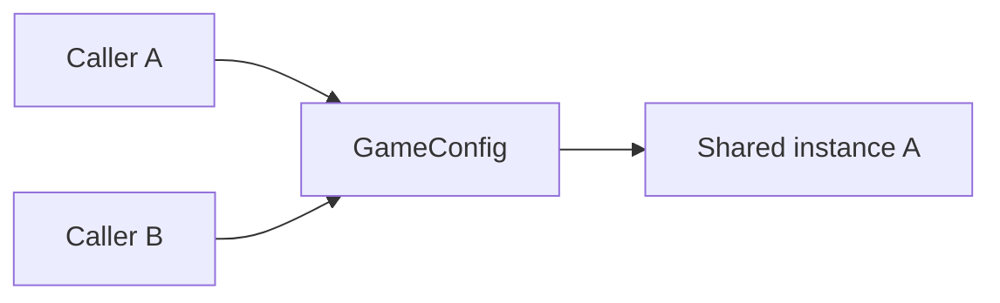
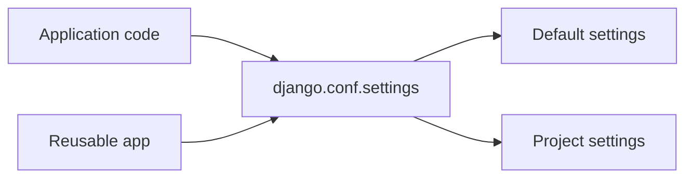
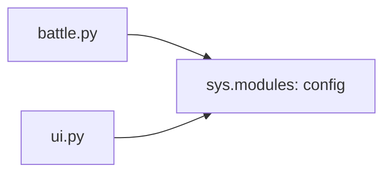
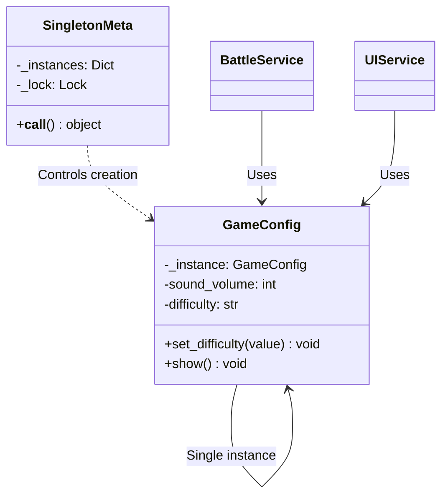

# 싱글턴 패턴 (Singleton Pattern)


## 1. 패턴이 없을 때 발생하는 문제점 (The Problem)

싱글턴 패턴을 사용하지 않고 시스템 전체에서 하나의 상태나 자원을 공유해야 하는 객체를 여러 위치에서 각각 생성하면, 서로 다른 상태를 가진 인스턴스가 만들어지거나 동일한 자원이 중복 초기화되는 문제가 발생할 수 있습니다.

예를 들어 게임 전체의 설정을 관리하는 객체가 있다고 가정해 보겠습니다.

### 패턴을 적용하지 않은 예시

```python
class GameConfig:

    def __init__(self):
        self.sound_volume = 80
        self.difficulty = "normal"


# 서로 다른 위치에서 각각 생성
battle_config = GameConfig()
ui_config = GameConfig()

battle_config.difficulty = "hard"

print(battle_config.difficulty)
# hard

print(ui_config.difficulty)
# normal

```

두 객체는 동일한 "게임 설정"이라는 개념을 나타내지만, 서로 독립적인 인스턴스이므로 상태가 일치하지 않는 문제가 발생합니다.

객체 생성 자체가 비용이 큰 경우에는 더 직접적인 문제로 이어집니다.

```python
class DatabaseManager:

    def __init__(self):
        # 비용이 큰 초기화 작업
        self.connection_pool = create_connection_pool()


service_a = DatabaseManager()
service_b = DatabaseManager()
service_c = DatabaseManager()

```

실제로 하나의 Connection Pool만 필요하더라도 여러 객체가 각각 별도의 자원을 중복으로 초기화하게 됩니다.

이를 피하기 위해 클라이언트가 하나의 객체를 직접 생성하여 곳곳에 전달하는 방식을 고려해 볼 수 있습니다.

```python
config = GameConfig()

battle_service = BattleService(config)
ui_service = UIService(config)
audio_service = AudioService(config)

```

이 방식 자체는 잘못된 것이 아니며, 오히려 의존성을 명시적으로 전달한다는 중요한 장점을 가집니다.

다만 애플리케이션 전체에서 논리적으로 하나만 존재해야 하는 특정 객체의 생성 개수를 클래스 자체에서 통제해야 한다는 요구사항이 있다면, 별도의 생성 제어 메커니즘이 필요해집니다.

### 이 방식이 가진 단점

* **상태 불일치:** 동일한 개념을 표현하는 여러 인스턴스가 서로 다른 상태를 유지하여 시스템 내 불확실성을 높입니다.
* **중복 자원 생성:** 설정 관리자, 레지스트리, 캐시 관리자처럼 한 번만 초기화하면 되는 객체가 반복 생성될 수 있습니다.
* **인스턴스 관리 책임의 확산:** 어떤 객체가 시스템에서 공식적으로 사용해야 하는 유일한 인스턴스인지 클라이언트가 직접 관리해야 합니다.
* **중복 초기화 비용:** 객체 생성 과정에서 파일 로딩, 연결 생성, 캐시 준비 등 비용이 큰 작업이 무분별하게 반복될 수 있습니다.

---

## 2. 싱글턴 패턴으로 해결하기 (The Solution)

싱글턴 패턴은 "특정 클래스의 인스턴스가 하나만 존재하도록 생성 과정을 제어하고, 해당 인스턴스에 접근할 수 있는 공통 접근 지점을 제공하는 방식"으로 이 문제를 해결합니다.

1. 클래스가 자신의 인스턴스 생성 과정을 직접 통제합니다.
2. 최초 요청 시 하나의 인스턴스를 생성합니다.
3. 이후 요청에서는 새 객체를 만들지 않고 기존 인스턴스를 반환합니다.

개념적 흐름은 다음과 같습니다.



따라서 다음 두 값은 완전히 동일한 객체를 가리키게 됩니다.

```python
config1 = GameConfig()
config2 = GameConfig()

assert config1 is config2

```

이로써 한쪽에서 상태를 변경하면 다른 쪽에서도 동일한 변경 사항을 즉시 확인할 수 있습니다.

```python
config1.difficulty = "hard"

print(config2.difficulty)
# hard

```

싱글턴 패턴에는 일반적으로 두 가지 중요한 성격이 함께 존재합니다.

1. **인스턴스 생성 개수 제한**
2. **동일한 인스턴스에 접근할 수 있는 공통 접근 지점 제공**

여기서 중요한 점은 Singleton이 단순히 "전역 변수 하나를 만드는 것"과 동일하지 않다는 것입니다. 전역 변수는 이미 생성된 객체를 특정 이름에 저장하는 방식에 불과합니다.

반면 Singleton의 핵심은 **객체의 생성 과정 자체를 통제하여 동일한 Singleton 타입의 인스턴스가 임의로 추가 생성되지 않도록 제한하는 것**에 있습니다.

다만 전역 접근 지점을 제공한다는 특성 때문에 결과적으로 전역 상태와 유사한 문제를 유발할 수 있으며, 이것이 Singleton 패턴이 가지는 가장 대표적인 트레이드오프입니다.

---

## 3. 장점, 단점 및 트레이드오프 (Trade-off)

### 장점 (Pros)

* **인스턴스 수 제어:** 특정 객체의 인스턴스가 단 하나만 생성되도록 생성 과정을 중앙에서 엄격히 관리할 수 있습니다.
* **중복 초기화 방지:** 무거운 초기화 작업을 한 번만 수행하고 이후 동일한 객체를 재사용함으로써 자원을 절약합니다.
* **공유 상태의 단일화:** 여러 클라이언트가 같은 인스턴스를 바라보므로 서로 다른 복사본이 엇갈리는 문제를 줄일 수 있습니다. 다만 동시 변경의 원자성까지 보장하지는 않으므로 별도의 동기화가 필요할 수 있습니다.
* **공통 접근 지점 제공:** 애플리케이션의 어느 위치에서나 동일한 서비스나 레지스트리에 쉽게 접근할 수 있습니다.
* **지연 초기화 가능:** 실제로 Singleton이 필요한 최초 시점까지 객체 생성을 지연하는 Lazy Initialization을 적용할 수 있습니다.

### 단점 (Cons)

* **전역 상태(Global State) 문제:** Singleton 내부에 가변 상태가 존재하면 애플리케이션 전역에서 수정 가능한 공유 상태가 되어 시스템 예측 가능성을 떨어뜨립니다.
* **숨겨진 의존성:** 함수나 객체가 내부에서 Singleton에 직접 접근할 경우, 함수 시그니처만으로는 해당 의존성을 명확히 파악하기 어렵습니다.
* **테스트 격리의 어려움:** 한 테스트에서 변경한 Singleton의 상태가 다른 테스트에 남아 테스트 간 간섭과 예기치 않은 실패를 일으키기 쉽습니다.
* **동시성 이슈:** Lazy Initialization 적용 시 여러 스레드가 동시에 최초 인스턴스를 요청하면 중복 생성을 막기 위해 스레드 동기화 처리가 필요합니다.
* **수명 주기의 경직성:** 프로세스 전체가 아닌 요청(Request), 세션(Session), 테넌트(Tenant) 등 더 짧거나 구체적인 범위의 수명이 필요한 객체에는 Singleton이 맞지 않습니다.
* **결합도 증가:** 클라이언트가 `GameConfig()` 또는 `GameConfig.instance()` 같은 전역 접근 방식에 직접 의존하게 되면 향후 다른 구현체로 교체하기 어려워집니다.

### 트레이드오프 (Trade-off)

* **"하나면 편리하다"와 "하나만 존재해야 한다"의 구분:** 단순히 여러 위치에서 접근하기 편하다는 이유만으로 Singleton을 도입하면 불필요한 전역 상태가 형성될 수 있습니다.
* **불변 객체일수록 위험 감소:** Singleton이 들고 있는 값이 완전히 불변이라면 전역 가변 상태로 인한 버그 위험이 대폭 감소합니다.
* **Dependency Injection과의 비교:** 하나의 객체를 애플리케이션 전체에서 공유하더라도 반드시 클래스를 Singleton 패턴으로 설계할 필요는 없습니다. Composition Root에서 객체를 하나 생성한 뒤 필요한 곳에 주입하는 형태가 더 유연할 수 있습니다.

```python
config = GameConfig()

app = Application(
    battle=BattleService(config),
    ui=UIService(config),
)

```

이 경우 애플리케이션 내 인스턴스는 하나만 존재하지만, 클래스 자체는 Singleton에 직접 결합되지 않습니다.

* **Python의 모듈 대안:** 모듈 수준에 상태나 객체를 정의하면 일반적인 `import` 과정에서 동일한 모듈 객체가 재사용되므로, 단순한 전역 서비스라면 별도의 Singleton 클래스를 정의하지 않아도 됩니다.
* **Singleton과 Multiton의 구별:** Singleton이 타입 전체에서 단 하나의 인스턴스를 유지한다면, Multiton은 특정 키(Key)별로 하나의 인스턴스를 유지하는 구조입니다.

```text
Singleton:
    GameConfig → 1 instance

Multiton:
    Logger["database"] → 1 instance
    Logger["network"]  → 1 instance
    Logger["game"]     → 1 instance

```

* **프로세스 단위와 시스템 단위의 구분:** Python 프로세스 내부에서 객체 유일성을 보장하더라도, 여러 프로세스나 분산 서버/컨테이너 환경 전체에서 유일한 인스턴스가 되는 것은 아닙니다.

---

## 4. 파이썬 오픈소스에서 볼 수 있는 싱글턴과 유사한 설계

파이썬 표준 라이브러리와 주요 프레임워크에서도 **객체의 직접 생성을 중앙화하고 동일한 객체 또는 공통 서비스 인터페이스를 공유하는 Singleton과 유사한 구조**를 찾아볼 수 있습니다.

다만 아래 제시된 사례들이 GoF Singleton 패턴을 정석대로 구현한 것은 아니며, **중앙화된 인스턴스 관리와 공유 접근이라는 Singleton의 핵심 개념을 적용한 사례**로 이해하는 것이 적절합니다.

### Python `logging.getLogger()`

Python의 `Logger` 객체는 직접 생성자 연산을 수행하는 대신 일반적으로 `logging.getLogger(name)`을 통해 획득합니다.

공식 문서에 따르면 동일한 이름으로 `getLogger()`를 여러 번 호출하면 항상 같은 `Logger` 객체에 대한 참조를 반환합니다.

```python
import logging

logger1 = logging.getLogger("game")
logger2 = logging.getLogger("game")

assert logger1 is logger2

```

다만 모든 이름이 단 하나의 `Logger`를 공유하는 것은 아닙니다.

```python
game_logger = logging.getLogger("game")
db_logger = logging.getLogger("database")

```

따라서 단일 전역 Singleton이라기보다는 **이름 키별로 하나의 인스턴스를 유지하는 Registry / Multiton 구조**에 더 가깝습니다.

이 구조는 객체를 직접 생성하지 않고 중앙 관리 지점을 통해 동일 인스턴스를 재사용한다는 점에서 Singleton과 유사한 설계 철학을 보여줍니다.

---

### Django `django.conf.settings`

Django 애플리케이션에서 프로젝트 설정에 접근할 때는 일반적으로 다음 객체를 사용합니다.

```python
from django.conf import settings

if settings.DEBUG:
    ...

```

Django 공식 문서에서는 `django.conf.settings`가 모듈이 아니라 기본 설정과 프로젝트 설정을 하나의 인터페이스로 추상화한 객체라고 설명합니다. 또한 실행 중 설정을 임의로 바꾸지 말 것을 권장합니다.



또한 수동 구성 시 `settings.configure()`는 한 번만 호출할 수 있으며, 이미 설정에 접근한 뒤 다시 구성해도 오류가 발생합니다.

이 역시 전통적인 GoF Singleton 구현체라기보다는 **애플리케이션 전역에서 단 하나의 설정 인터페이스를 공유하는 Singleton-like Service Object**에 해당합니다.

---

### Python 모듈과 `sys.modules`

Python의 `import` 시스템은 모듈을 처음 불러올 때 모듈 객체를 생성하고, 이를 `sys.modules` 캐시에 저장합니다.

같은 이름의 모듈을 다시 `import`할 때 `sys.modules`에 해당 항목이 있으면 저장된 모듈 객체를 재사용합니다.

```python
# config.py
difficulty = "normal"

```

여러 파일에서 불러오더라도 일반적인 흐름에서는 동일한 모듈 객체를 참조합니다.

```python
# battle.py
import config

# ui.py
import config

```

개념상 구조는 다음과 같습니다.



이러한 언어적 특성 덕분에 Python에서는 단순 전역 상태나 서비스 구현 시 별도의 Singleton 클래스를 정의하는 대신 **모듈 자체를 Singleton과 유사한 네임스페이스로 활용하는 방식**이 널리 쓰입니다.

다만 이는 엄격한 Singleton 보장이 아닙니다. 기존 참조를 남겨 둔 채 `sys.modules`에서 캐시 항목을 제거하고 다시 `import`하면 서로 다른 모듈 객체가 동시에 존재할 수 있습니다. 반면 `importlib.reload()`는 기존 모듈 객체를 재사용합니다.

---

## 5. 클래스 다이어그램



---

## 6. 파이썬 예제 코드

아래 예제에서는 Singleton 생성 로직을 재사용할 수 있도록 메타클래스로 분리합니다.

또한 여러 스레드가 동시에 최초 인스턴스를 요청하는 경우에도 인스턴스가 중복 생성되지 않도록 Lock을 사용합니다.

```python
from threading import RLock
from typing import Any


# -------------------------------------------------------------------
# 1. Singleton Meta Class
# -------------------------------------------------------------------

class SingletonMeta(type):

    _instances: dict[type, object] = {}
    _lock = RLock()

    def __call__(
        cls,
        *args: Any,
        **kwargs: Any,
    ) -> Any:

        # 인스턴스 생성과 조회를 하나의 임계 구역에서 처리합니다.
        with cls._lock:

            if cls not in cls._instances:
                instance = super().__call__(
                    *args,
                    **kwargs,
                )

                cls._instances[cls] = instance

            return cls._instances[cls]


# -------------------------------------------------------------------
# 2. Singleton
# -------------------------------------------------------------------

class GameConfig(metaclass=SingletonMeta):

    def __init__(self):
        self.sound_volume = 80
        self.difficulty = "normal"

    def set_difficulty(
        self,
        difficulty: str,
    ) -> None:

        self.difficulty = difficulty

    def set_sound_volume(
        self,
        volume: int,
    ) -> None:

        self.sound_volume = volume

    def show(self) -> None:
        print(
            f"볼륨: {self.sound_volume}, "
            f"난이도: {self.difficulty}"
        )


# -------------------------------------------------------------------
# 3. 클라이언트
# -------------------------------------------------------------------

class BattleService:

    def start(self) -> None:
        config = GameConfig()

        print(
            f"[전투 시스템] "
            f"난이도={config.difficulty}"
        )


class UIService:

    def show_settings(self) -> None:
        config = GameConfig()

        print(
            f"[UI 시스템] "
            f"볼륨={config.sound_volume}"
        )


# -------------------------------------------------------------------
# 4. 실행 (Usage)
# -------------------------------------------------------------------

if __name__ == "__main__":

    config1 = GameConfig()
    config2 = GameConfig()

    print(config1 is config2)
    # True

    config1.set_difficulty("hard")
    config1.set_sound_volume(50)

    # 동일한 객체이므로 config2에서도 변경된 값 확인
    config2.show()

    battle_service = BattleService()
    ui_service = UIService()

    battle_service.start()
    ui_service.show_settings()

```

실행 결과는 다음과 같습니다.

```text
True

볼륨: 50, 난이도: hard

[전투 시스템] 난이도=hard
[UI 시스템] 볼륨=50

```

`GameConfig()`를 여러 번 호출했지만 실제로는 동일한 객체가 반환됩니다.

```python
config1 = GameConfig()
config2 = GameConfig()

assert config1 is config2

```

이 구현에서는 `GameConfig.__init__()` 역시 실제 객체가 최초 생성될 때만 단 한 번 호출됩니다.

다만 이 Singleton이 유일성을 보장하는 범위는 현재 Python 인터프리터 프로세스 내로 한정됩니다.

예를 들어 복수의 프로세스로 애플리케이션을 실행한다면 다음과 같은 구조가 됩니다.

```text
Process A
    └─ GameConfig instance A

Process B
    └─ GameConfig instance B

Process C
    └─ GameConfig instance C

```

각 프로세스마다 독립된 Singleton 인스턴스가 존재할 수 있습니다.

따라서 데이터베이스 클러스터나 분산 시스템 전체 차원에서 단 하나의 자원을 보장해야 하는 경우라면, 언어 레벨의 Singleton 클래스가 아닌 분산 락, DB 제약 조건, 리더 선출(Leader Election) 알고리즘 등 별도의 분산 제어 메커니즘을 적용해야 합니다.

---

## 부록 (Appendix): 현대적 타입 시스템과 함수형 관점의 재해석

싱글턴 패턴을 현대 타입 시스템과 함수형 프로그래밍 관점에서 재해석하면, Singleton이 실제로 **서로 다른 여러 형태의 요구사항을 단일 패턴으로 뭉뚱그려 해결하고 있었다는 점**을 발견할 수 있습니다.

고전적인 Singleton의 주요 요구사항은 다음과 같이 분해할 수 있습니다.

1. 특정 객체의 인스턴스가 하나만 존재해야 한다.
2. 여러 위치에서 동일한 값이나 상태를 공유해야 한다.
3. 애플리케이션 어디서든 해당 객체에 접근할 수 있어야 한다.
4. 특정 자원의 수명 주기를 중앙에서 하나로 관리해야 한다.

전통적인 객체지향 Singleton은 이 모든 책임을 단일 클래스 내부에 집약시킵니다.

```text
Singleton Class
      │
      ├─ 생성 제한
      ├─ 상태 보관
      ├─ 수명 관리
      └─ 전역 접근

```

반면 현대적인 타입 시스템과 함수형 패러다임에서는 이 요구사항들을 서로 분리하여 훨씬 명확하게 모델링할 수 있습니다.

이 부록에서는 이해를 돕기 위해 **불변 데이터(Immutable Data), Capability Type, Environment/Reader, Effect System, 선형 타입(Linear Type), 유일성 타입(Uniqueness Type), Scope/Region Type을 지원하는 가상의 Python 문법**을 가정하여 설명합니다. *(아래 코드는 실제 Python 문법이 아닙니다.)*

### 1. "객체가 하나"와 "값이 하나"를 구분하기

게임 설정이 다음과 같이 불변 레코드로 정의된다고 가정해 보겠습니다.

```python
immutable record GameConfig:
    difficulty: Difficulty
    sound_volume: Volume

```

객체가 완전히 불변이라면 애플리케이션 내 여러 위치에서 동일한 설정값을 사용하는 데 굳이 Singleton 객체라는 장치가 필수적이지 않습니다.

```python
config = GameConfig(
    difficulty=Hard,
    sound_volume=80,
)

```

이 값을 필요한 함수들에 순수하게 전달합니다.

```python
def calculate_damage(
    hero: Hero,
    config: GameConfig,
) -> Damage:

    match config.difficulty:
        case Easy:
            ...
        case Hard:
            ...

```

다른 연산에도 동일한 설정 값을 바인딩해 줍니다.

```python
damage = calculate_damage(
    hero,
    config,
)

screen = render_ui(
    player,
    config,
)

```

여기서 본질적인 핵심은 "GameConfig 메모리 인스턴스가 시스템 내에 정확히 단 하나만 존재하는가?"가 아닙니다.

진짜 핵심은 "모든 계산 연산이 동일한 설정 값을 일관되게 참조하고 있는가?"에 있습니다.

불변 값 모델을 채택하면 동일한 데이터를 여러 위치에서 공유하더라도 어느 한쪽에서 상태를 변경하는 일 자체가 불가능하므로, 기존 Singleton이 해결하고자 했던 전역 가변 상태 일관성 문제의 대부분이 자연스럽게 해소됩니다.

---

### 2. 전역 접근 대신 Capability를 명시적으로 전달하기

고전적인 Singleton 구현 방식에서는 함수 내부에서 직접 전역 접근 지점을 호출하곤 합니다.

```python
def calculate_damage(
    hero: Hero,
) -> Damage:

    config = GameConfig.instance()

    ...

```

이 경우 함수 시그니처만 봐서는 내부에서 `GameConfig`를 사용하는지 알 수 없습니다.

```text
calculate_damage : Hero -> Damage

```

타입 시그니처 뒤에 숨겨진 전역 의존성이 형성되어 있는 것입니다.

```text
calculate_damage
      │
      └── GameConfig Singleton

```

Capability 개념을 지원하는 가상의 타입 시스템에서는 필요한 권한과 기능을 시그니처에 명시적으로 선언할 수 있습니다.

```python
capability GameSettings:

    def difficulty() -> Difficulty

    def sound_volume() -> Volume

```

함수는 이 Capability가 필요함을 명확히 요구합니다.

```python
def calculate_damage(
    hero: Hero,
    using settings: GameSettings,
) -> Damage:

    difficulty =
        settings.difficulty()

    ...

```

호출 시 해당 Capability 구현체를 넘겨줍니다.

```python
damage = calculate_damage(
    hero,
    using settings,
)

```

이로써 암묵적인 Singleton 의존성이 **타입 시스템으로 검증 가능한 명시적 Capability 의존성**으로 전환됩니다.

테스트 환경에서는 다른 구현체를 쉽게 주입할 수 있습니다.

```python
test_settings =
    FixedGameSettings(
        difficulty=Easy,
    )

damage = calculate_damage(
    hero,
    using test_settings,
)

```

더 이상 Singleton 전역 인스턴스의 상태를 테스트 전후로 복구하거나 초기화하기 위해 번거로운 작업을 수행할 필요가 없습니다.

---

### 3. Environment / Reader를 이용하여 반복 전달 줄이기

모든 함수 매개변수로 `config`, `logger`, `db` 등을 매번 전달하는 방식은 매개변수 오염(Parameter Drilling)을 일으킬 수 있습니다.

```python
load_user(id, database, logger, config)

calculate_damage(hero, logger, config)

save_result(result, database, logger, config)

```

이를 해결하기 위해 실행 환경을 추상화한 가상의 Environment 타입을 정의해 봅니다.

```python
environment AppEnv:
    config: GameConfig
    database: Database
    logger: Logger

```

각 함수는 자신에게 필요한 환경 구성 요소만 선택적으로 선언합니다.

```python
def calculate_damage(
    hero: Hero,
) -> Damage
requires AppEnv.config:

    config = env.config

    ...

```

```python
def load_user(
    id: UserId,
) -> User
requires AppEnv.database:

    return env.database.find(id)

```

애플리케이션 실행 경계(Entry Point)에서 환경을 한 번 바인딩해 줍니다.

```python
with environment AppEnv(
    config=production_config,
    database=production_database,
    logger=production_logger,
):

    run_game()

```

테스트 시에는 테스트용 환경으로 손쉽게 대체할 수 있습니다.

```python
with environment AppEnv(
    config=test_config,
    database=in_memory_database,
    logger=null_logger,
):

    run_tests()

```

이 방식은 얼핏 보기에는 Singleton처럼 여러 위치에서 공통 서비스에 접근하는 것처럼 보이지만, 결정적인 차이가 존재합니다.

* **Singleton:** 접근 대상이 **프로세스 전역**으로 고정되어 있습니다.
* **Environment:** 접근 대상이 특정 실행 범위(Scope)에 명시적으로 바인딩됩니다.

따라서 단일 프로세스 내에서도 서로 다른 execution context를 독립적으로 구성할 수 있습니다.

---

### 4. Effect System으로 전역 서비스 의존성을 표현하기

한 걸음 더 나아가, 구체적인 객체 인스턴스에 의존하는 대신 **"설정을 읽어오는 효과(Effect)"** 자체를 요구하도록 모델링할 수 있습니다.

```python
effect ConfigRead:

    def get_difficulty()
        -> Difficulty

```

함수는 연산 수행 중 발생할 수 있는 Effect를 선언합니다.

```python
def calculate_damage(
    hero: Hero,
) -> Damage
    ! ConfigRead:

    difficulty =
        perform get_difficulty()

    ...

```

운영 환경에서는 실제 프로덕션 설정 기반의 Handler로 해당 Effect를 처리합니다.

```python
handle ConfigRead
with ProductionConfig:

    run_game()

```

테스트 환경에서는 고정된 가짜 데이터를 반환하는 Handler를 적용할 수 있습니다.

```python
handle ConfigRead
with FixedConfig(Hard):

    test_damage()

```

이로써 고전적인 Singleton의 "어디서나 단일 객체에 직접 접근"하던 구조가, "함수가 필요한 Effect를 선언하고 최상위 실행 경계에서 해당 Effect의 구현체를 공급"하는 깔끔한 구조로 분리됩니다. 함수 내부에는 전역 객체 참조가 완전히 사라집니다.

---

### 5. 정말 "하나만 존재해야 하는 자원"은 Linear Type으로 표현하기

앞서 언급한 `GameConfig`는 사실 물리적으로 유일해야만 하는 자원은 아닙니다. 동일한 값만 보장된다면 여러 복제본이 존재해도 상관없기 때문입니다.

그러나 하드웨어 장치 제어권처럼 **실제로 물리적인 소유권이 단 하나만 존재해야 하는 자원**이 있을 수 있습니다.

```python
linear resource GPUDevice:
    handle: NativeGPUHandle

```

프로그램 실행 시 단 하나의 GPU 제어권을 획득합니다.

```python
gpu =
    acquire_gpu()

```

선형 타입(Linear Type)으로 지정된 자원은 일반적인 값처럼 복사되거나 임의로 재할당될 수 없습니다.

```python
gpu1 =
    acquire_gpu()

gpu2 =
    gpu1

```

이 경우 컴파일러 단계에서 오류가 발생합니다.

```text
Type Error:

GPUDevice is linear.

Ownership of gpu1 was moved to gpu2.
gpu1 can no longer be used.

```

명시적인 복제 역시 차단됩니다.

```python
gpu2 =
    clone(gpu1)

```

```text
Type Error:

GPUDevice does not implement Clone.

```

고전적인 Singleton이 "생성자를 통제하여 인스턴스를 하나만 만들도록 제한하는 방식"이었다면, Linear Type은 "자원에 대한 소유권 토큰 자체를 물리적으로 복제할 수 없게 막는 방식"으로 접근합니다.

따라서 물리적으로 유일해야 하는 자원의 제어권을 표현할 때 Singleton보다 훨씬 강력하고 확실한 모델을 제공합니다.

---

### 6. 유일한 소유권과 여러 사용자의 접근을 구분하기

DB Connection Pool 같은 자원은 단 하나의 관리 주체가 유일 소유권을 잡고 관리하면서, 동시에 여러 서비스에서 공유하여 접근할 수 있어야 합니다.

가상의 타입 시스템에서는 유일 소유권과 공유 접근 권한을 명확히 분리하여 표현할 수 있습니다.

```python
linear resource DatabasePool:
    ...

```

프로그램 시작 시 자원의 단일 유일 소유권을 생성합니다.

```python
pool: Unique[DatabasePool] =
    DatabasePool.open(config)

```

애플리케이션 각 서비스에는 Pool 자체의 유일 소유권을 넘기는 대신, 제약된 공유 접근 권한만을 생성하여 넘겨줍니다.

```python
database_access:
    Shared[DatabaseAccess]
        =
    pool.share_access()

```

각 서비스 연산은 접근 Capability만을 전달받아 사용합니다.

```python
def load_user(
    id: UserId,
    using db: Shared[DatabaseAccess],
) -> User:

    return db.find_user(id)

```

이 구조에서는 두 개념이 투명하게 분리됩니다.

* **`DatabasePool`:** 유일한 소유권 (`Unique[DatabasePool]`)
* **`DatabaseAccess`:** 여러 클라이언트에 공유 가능한 접근 권한 (`Shared[DatabaseAccess]`)

Singleton 패턴에서는 이 유일 소유권과 공유 접근권이라는 서로 다른 두 개념이 하나의 전역 객체 안에 혼재되어 있었습니다. 현대적 타입 모델은 **자원의 유일성**과 **자원에 대한 접근 가능성**을 개별 타입으로 정교하게 분리할 수 있게 해줍니다.

---

### 7. "하나"의 범위를 Scope Type으로 표현하기

Singleton 패턴을 사용할 때 가장 모호해지기 쉬운 질문은 "도대체 어느 범위에서 단 하나라는 뜻인가?"입니다.

현실적인 시스템 요구사항은 유일성의 범주가 저마다 다릅니다.

* 프로세스당 하나
* 스레드당 하나
* HTTP Request당 하나
* 사용자 Session당 하나
* Tenant당 하나
* 애플리케이션 수명주기당 하나

고전 Singleton은 이 유일성의 범위를 클래스 구현이나 암묵적인 전역 컨텍스트에 위임하곤 했습니다.

Scope Type을 지원하는 가상의 환경을 가정해 보겠습니다.

```python
scope Process
scope Request
scope Session
scope Tenant[TenantId]

```

프로세스 범위의 단일 캐시는 다음과 같이 명시 선언합니다.

```python
resource[
    scope=Process
] GlobalCache

```

Request당 단 하나 존재해야 하는 객체는 다음과 같이 표현합니다.

```python
resource[
    scope=Request
] RequestContext

```

Tenant별로 하나씩 지정되어야 하는 설정은 다음과 같습니다.

```python
resource[
    scope=Tenant[T]
] TenantConfig[T]

```

이로써 기존 Singleton의 모호했던 "시스템 전체에서 하나"라는 전제가 "특정 Scope 안에서 유일함"이라는 정교한 제약 조건으로 명확해집니다.

---

### 8. Singleton과 Multiton을 타입 수준에서 구분하기

앞서 살펴본 `logging.getLogger(name)` 사례처럼, 실제 시스템에서는 단 하나의 인스턴스가 아니라 **키(Key)별 단일 인스턴스**가 필요한 패턴이 흔히 발생합니다.

```text
"game"     → Logger A
"database" → Logger B
"network"  → Logger C

```

타입 매개변수에 Key를 포함할 수 있는 가상의 구조를 정의해 봅니다.

```python
resource Logger[
    Name: Symbol
]

```

```python
game_logger:
    UniqueIn[
        Process,
        Logger["game"]
    ]

database_logger:
    UniqueIn[
        Process,
        Logger["database"]
    ]

```

이 구조를 사용하면 단순 Singleton이 아닌 **Keyed Singleton(Multiton)** 형태로 동작함을 타입 정의 자체에서 명확히 드러낼 수 있습니다.

---

### 9. Singleton을 제거하는 것 자체가 목적은 아니다

현대적 아키텍처를 설계할 때 Singleton을 무조건적인 악으로 규정하고 배척하는 것만이 정답은 아닙니다. 핵심은 **실제 요구사항의 본질이 무엇인지 세분화하여 판단하는 것**에 있습니다.

다음 요구사항들은 표면적으로는 비슷해 보이지만 서로 완전히 다릅니다.

1. **모든 코드가 동일한 설정값을 바라봐야 한다.** $\rightarrow$ 불변 값 공유(`Immutable Value`)
2. **특정 물리 자원의 소유권이 단 하나만 존재해야 한다.** $\rightarrow$ 유일성/선형 타입(`Unique` / `Linear Type`)
3. **특정 수명주기 범위 내에서 서비스 객체를 재사용해야 한다.** $\rightarrow$ Scope & DI (`Scoped Resource`)
4. **단순히 어디서나 편하게 객체에 접근하고 싶다.** $\rightarrow$ 편의성 목적 (전역 의존성 위험 유발)

단지 4번(접근 편의성)만을 이유로 Singleton을 도입한다면 테스트 격리 실패와 전역 결합도 증가라는 부작용을 초래하기 쉽습니다.

따라서 Singleton 패턴을 도입하기 전, 해당 요구사항이 **값 공유인지, 정체성 공유인지, 자원 소유권 문제인지, 수명 범위 문제인지, 아니면 단지 접근 편의성 때문인지**를 명확히 구분하는 과정이先行되어야 합니다.

---

### 10. Singleton을 "공유 자원의 소유권과 접근 범위"로 바라보기

고전적인 Singleton 패턴의 구조는 다음과 같습니다.

```text
Singleton Class
      │
      ├─ instance 하나 생성
      │
      └─ global access
              │
              ↓
           Clients

```

그러나 현대적인 관점에서는 이 패턴을 여러 구성 축으로 정밀하게 분해하여 다룰 수 있습니다.

* **공유할 값** $\rightarrow$ `Immutable Value`
* **필요한 기능 권한** $\rightarrow$ `Capability`
* **암묵적 환경 의존성** $\rightarrow$ `Environment` / `Reader`
* **서비스 연산 효과** $\rightarrow$ `Effect System`
* **실제 단일 자원** $\rightarrow$ `Unique` / `Linear Type`
* **공유 접근 권한** $\rightarrow$ `Shared Capability`
* **유일성의 수명 범위** $\rightarrow$ `Scope` / `Region Type`

따라서 Singleton을 반드시 `static instance`와 `getInstance()`라는 고전적인 클래스 구조로만 국한하여 바라볼 필요는 없습니다.

더 높고 추상적인 관점에서는,

**"공유되는 값이나 자원의 정체성, 소유권, 공유 접근 권한, 그리고 수명 범위를 시스템 차원에서 어떻게 일관되게 통제할 것인가에 대한 종합적인 설계 기법"**

으로 확장하여 이해할 수 있습니다.

---

### 요약 및 비교

| 관점 | 싱글턴 패턴 (OOP 아키텍처) | 현대 타입 시스템 + 함수형 관점 |
| --- | --- | --- |
| **공유 설정값** | Singleton 객체의 내부 상태 | 불변 값 (`Immutable Value`) |
| **동일 값 사용** | 동일 인스턴스 참조 | 동일 `Immutable Value` 전달 |
| **의존성 표현** | `instance()` 등 전역 직접 접근 | `Capability` 명시 선언 |
| **반복적인 의존성 전달** | Singleton 내부 직접 접근 | `Environment` / `Reader` 사용 |
| **서비스 사용 표현** | 전역 객체의 메서드 호출 | `Effect System` 활용 |
| **구현 교체** | Singleton 인스턴스 런타임 교체/초기화 | `Environment` / `Effect Handler` 교체 |
| **테스트 격리** | 전역 상태 수동 초기화 필요 | 독립적인 테스트 `Environment` 공급 |
| **실제 자원의 유일성** | 인스턴스 생성 과정 통제 | `Linear` / `Unique Type` 기반 소유권 제약 |
| **공유 접근** | 동일 객체를 전역 참조 | `Shared Capability` 생성 및 전달 |
| **수명 범위** | 클래스 구현에 암묵적으로 고정 | `Scope` / `Region Type` 명시 |
| **키별 단일 인스턴스** | Registry / Multiton 구조 | `Indexed` / `Keyed Resource` |
| **동시성 제약** | Lock 등을 런타임 코드에 직접 구현 | 소유권·Effect·Scope 타입 기반의 정적 검증 |
| **주요 장점** | 단순하고 직관적인 전역 인스턴스 제어 | 공유·소유·접근·수명주기를 명확하게 분리하여 모델링 |
| **주요 비용** | 전역 가변 상태 및 숨겨진 의존성 위험 | 고급 타입 시스템 및 Effect 추상화 개념 필요 |

### 결론

고전적인 Singleton 패턴은 특정 클래스의 인스턴스 생성을 단 하나로 제한하고, 해당 객체에 접근할 수 있는 공통 지점을 제공하는 OOP 생성 패턴입니다.

그러나 Singleton이 실제로 해결하고자 했던 문제를 분해해 보면 다양한 차원의 개념들이 응축되어 있음을 알 수 있습니다.

* **공유 설정 객체** $\leftrightarrow$ `Immutable Value`
* **전역 접근 방식** $\leftrightarrow$ `Capability` / `Environment`
* **암묵적 서비스 이용** $\leftrightarrow$ `Effect System`
* **유일한 물리 자원** $\leftrightarrow$ `Linear` / `Unique Type`
* **다중 공유 접근** $\leftrightarrow$ `Shared Capability`
* **Singleton의 수명주기** $\leftrightarrow$ `Scope` / `Region Type`
* **키별 Singleton** $\leftrightarrow$ `Keyed Resource` / `Multiton`

따라서 현대적인 관점에서는 단순히 "Singleton 객체를 어떤 코드로 구현할 것인가?"를 넘어,

**"무엇이 실제로 시스템 내에서 단 하나여야 하며, 무엇을 공유해야 하고, 누가 소유권을 가지며, 어느 Scope 범위까지 접근을 허용할 것인가?"**

를 정교하게 구분하여 모델링하는 것이 핵심입니다.

싱글턴의 핵심은 정해진 범위에서 인스턴스 생성을 하나로 제한하고 공통 접근 지점을 제공하는 데 있습니다. 적용하기 전에는 값의 공유, 자원의 유일성, 접근 권한, 수명 범위가 실제로 같은 요구인지 분리해서 판단해야 합니다.
