# SOLID 원칙

SOLID는 객체지향 설계에서 **변경에 대응하기 쉽고**, **테스트하기 좋으며**, **서로 다른 책임이 과도하게 얽히지 않도록** 돕는 다섯 가지 설계 원칙입니다.

| 원칙 | 이름 | 핵심 질문 |
| --- | --- | --- |
| S | Single Responsibility Principle | 이 클래스가 변경되는 이유는 하나인가? |
| O | Open/Closed Principle | 기존 코드를 반복해서 수정하지 않고 기능을 확장할 수 있는가? |
| L | Liskov Substitution Principle | 하위 타입을 상위 타입 대신 사용해도 계약이 유지되는가? |
| I | Interface Segregation Principle | 사용하지 않는 기능까지 의존하고 있지 않은가? |
| D | Dependency Inversion Principle | 핵심 정책이 구체적인 구현보다 추상적인 계약에 의존하는가? |

SOLID의 목적은 모든 코드를 인터페이스와 클래스로 복잡하게 만드는 것이 아닙니다.

핵심은 **변경될 가능성이 있는 부분과 안정적인 부분 사이에 적절한 경계를 만드는 것**입니다.


Python에서는 클래스뿐만 아니라 함수, 덕 타이핑, `Protocol`, `ABC`, 일급 함수 등을 활용할 수 있으므로, SOLID를 반드시 전통적인 클래스 계층 구조로 구현할 필요는 없습니다.

---

## 단일 책임 원칙 — SRP

Single Responsibility Principle은 클래스나 모듈이 **하나의 책임을 가져야 한다**는 원칙입니다.

여기서 책임은 단순히 "클래스에 메서드가 하나만 있어야 한다"는 의미가 아닙니다.

실용적인 관점에서는 "서로 다른 이유로 변경되는 코드를 하나의 클래스에 묶지 않는다"로 이해할 수 있습니다.

### 책임이 섞인 예제

다음 클래스는 주문 금액 계산, 데이터 저장, 이메일 발송을 모두 담당합니다.

```python
class OrderService:
    def calculate_total(self, order):
        return sum(item.price for item in order.items)

    def save(self, order):
        print("DB에 주문 저장")

    def send_confirmation_email(self, order):
        print("주문 확인 이메일 발송")
```

겉으로 보면 모두 주문과 관련된 기능입니다. 하지만 각 기능이 변경되는 원인은 서로 다릅니다.

* 할인 정책 변경
* 데이터베이스 구조 변경
* 이메일 발송 방식 변경

이를 클래스 다이어그램으로 표현하면 다음과 같이 하나의 클래스에 서로 다른 변경 요인이 모이게 됩니다.

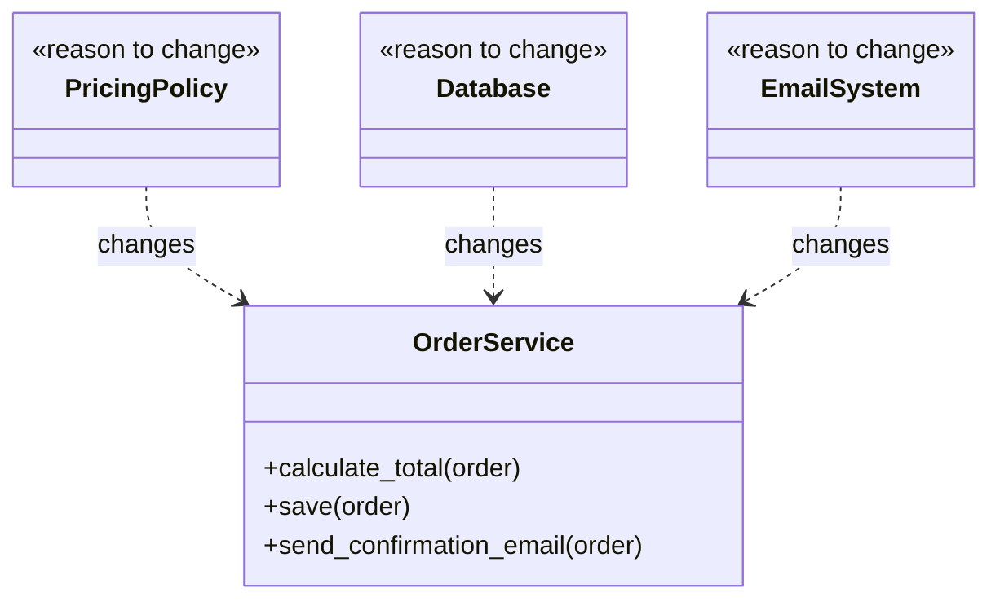

각 역할을 별도 클래스로 분리할 수 있습니다.

```python
class OrderCalculator:
    def calculate_total(self, order):
        return sum(item.price for item in order.items)


class OrderRepository:
    def save(self, order):
        print("DB에 주문 저장")


class OrderNotifier:
    def send_confirmation(self, order):
        print("주문 확인 이메일 발송")
```

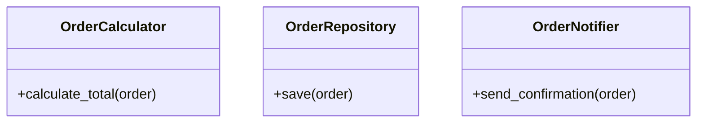

이제 가격 정책은 `OrderCalculator`, 데이터 저장은 `OrderRepository`, 알림 발송은 `OrderNotifier`로 각각 분리되어 독립적으로 변경할 수 있습니다.

### 책임을 판단하는 기준

SRP를 적용할 때는 클래스의 물리적 크기보다 **변화의 원인**을 기준 삼아야 합니다.

클래스에 메서드가 열 개 존재하더라도 모두 동일한 비즈니스 규칙에 의해 변경된다면 하나의 책임으로 볼 수 있습니다. 반대로 메서드가 두 개뿐이더라도 서로 다른 시스템이나 이해관계자의 요구로 인해 독립적으로 변경된다면 책임이 섞여 있는 것입니다.

### 실제 사례 — Python `logging`

Python 표준 라이브러리의 `logging` 모듈은 책임 분리가 잘 적용된 사례입니다.

주요 역할이 다음과 같이 나누어져 있습니다.

* `Logger`: 로그 이벤트를 생성하고 전달
* `Handler`: 로그의 출력 위치 결정
* `Formatter`: 로그를 문자열 포맷으로 변환
* `Filter`: 특정 로그의 필터링 담당

Python 공식 문서에서도 `Handler`는 로그 출력 위치 처리를, `Formatter`는 `LogRecord`를 외부용 문자열로 변환하는 책임을 담당한다고 설명합니다.

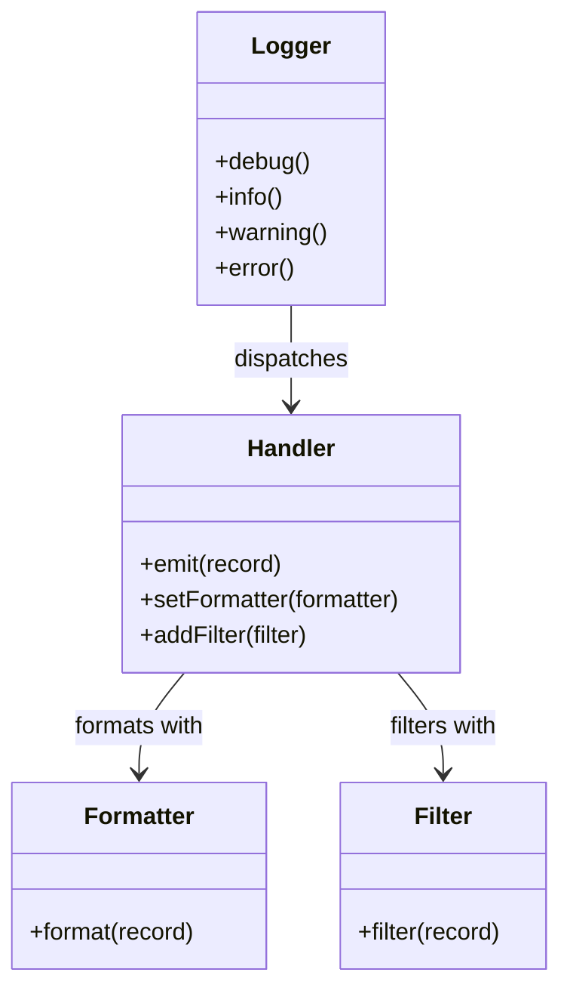

만약 단일 `Logger` 클래스가 모든 기능을 직접 수행하도록 구현되었다면,

```python
class Logger:
    def write_to_file(self): ...
    def send_to_email(self): ...
    def format_json(self): ...
    def format_text(self): ...
    def filter_by_module(self): ...
```

새로운 출력 형태나 포맷이 추가될 때마다 `Logger` 클래스 자체를 계속 수정해야 했을 것입니다. 실제 `logging` 모듈은 역할을 분리하여 출력 방식과 포맷을 독립적으로 교체할 수 있도록 설계되었습니다.

### SRP를 지나치게 적용하면

책임을 분리한다고 해서 모든 메서드를 개별 클래스로 만들 필요는 없습니다.

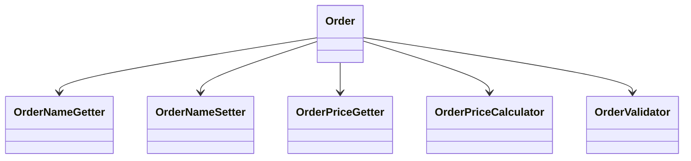

과도하게 분리하면 단순한 로직을 파악하기 위해 수많은 객체를 추적해야 하는 문제가 발생합니다. SRP의 본질은 **클래스를 작게 쪼개는 것**이 아니라 **서로 다른 변경 이유를 분리하는 것**입니다.

---

## 개방-폐쇄 원칙 — OCP

Open/Closed Principle은 소프트웨어 구성 요소가 **확장에는 열려 있고, 수정에는 닫혀 있어야 한다**는 원칙입니다.

새로운 기능이 추가될 때 이미 검증된 기존 코드를 수정하지 않고, 새로운 구현을 추가하여 기능을 확장하도록 설계하는 것을 의미합니다.

### 조건문이 계속 증가하는 예제

```python
def calculate_discount(customer_type, price):
    if customer_type == "regular":
        return price * 0.05
    if customer_type == "vip":
        return price * 0.10
    if customer_type == "employee":
        return price * 0.20
    return 0
```

이 구조에서는 새로운 고객 유형이 추가될 때마다 기존 함수를 수정해야 합니다.

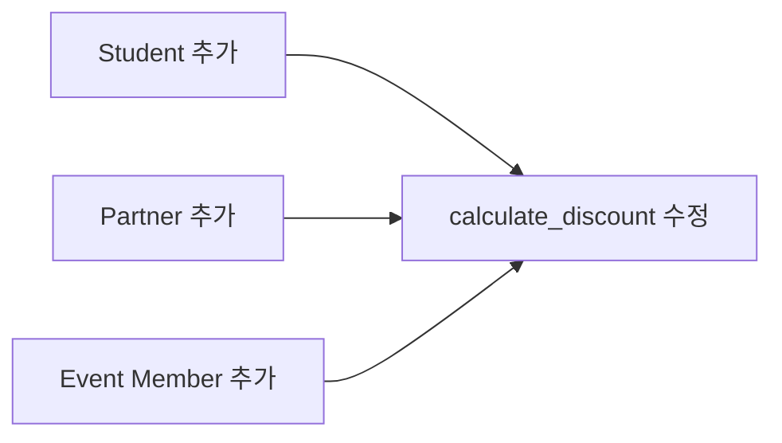

타입에 따른 분기 처리가 계속 늘어난다면 행위(전략)를 객체로 분리할 수 있습니다.

```python
from typing import Protocol


class DiscountPolicy(Protocol):
    def discount(self, price: int) -> int: ...
class RegularDiscount:
    def discount(self, price: int) -> int:
        return int(price * 0.05)


class VipDiscount:
    def discount(self, price: int) -> int:
        return int(price * 0.10)


class EmployeeDiscount:
    def discount(self, price: int) -> int:
        return int(price * 0.20)
```

이제 가격 계산 클래스는 구체적인 할인 구현 내용을 알 필요가 없습니다.

```python
class PriceCalculator:
    def calculate(self, price: int, policy: DiscountPolicy) -> int:
        return price - policy.discount(price)
```

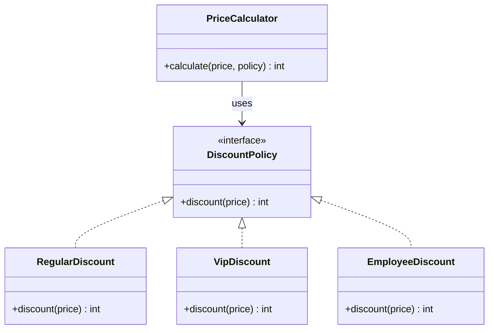

새로운 할인 정책이 추가되더라도 `PriceCalculator` 코드는 변경되지 않습니다.

```python
class StudentDiscount:
    def discount(self, price: int) -> int:
        return int(price * 0.15)
```

### OCP는 조건문 금지 원칙이 아니다

다음과 같이 고정적인 분기 로직은 조건문을 단순하게 사용하는 편이 더 직관적입니다.

```python
def shipping_fee(is_member):
    return 0 if is_member else 3000
```

문제는 조건문 존재 자체가 아니라, 새로운 요구사항이 발생할 때마다 동일한 형태의 조건문을 여러 위치에서 반복 수정해야 하는 구조입니다.

```python
if type == "a":
    ...
elif type == "b":
    ...
elif type == "c":
    ...
```

이러한 상황에서 다형성이나 전략 패턴을 도입하면 효과적인 확장 지점을 확보할 수 있습니다.

---

### 실제 사례 — pytest의 플러그인 구조

Python 테스트 프레임워크인 pytest는 플러그인 기반 확장 구조를 제공합니다.

pytest는 hook specification과 hook implementation이라는 접점을 제공하여, 외부 플러그인이나 `conftest.py`가 hook을 구현하는 방식으로 코어 동작을 확장합니다.

이를 활용하면 pytest 내부 코드를 수정하지 않고도 테스트 실행 시점에 특정 로직을 추가할 수 있습니다.

```python
import pytest


@pytest.hookimpl
def pytest_runtest_setup(item):
    print("test setup")
```

이를 구조화하면 다음과 같습니다.

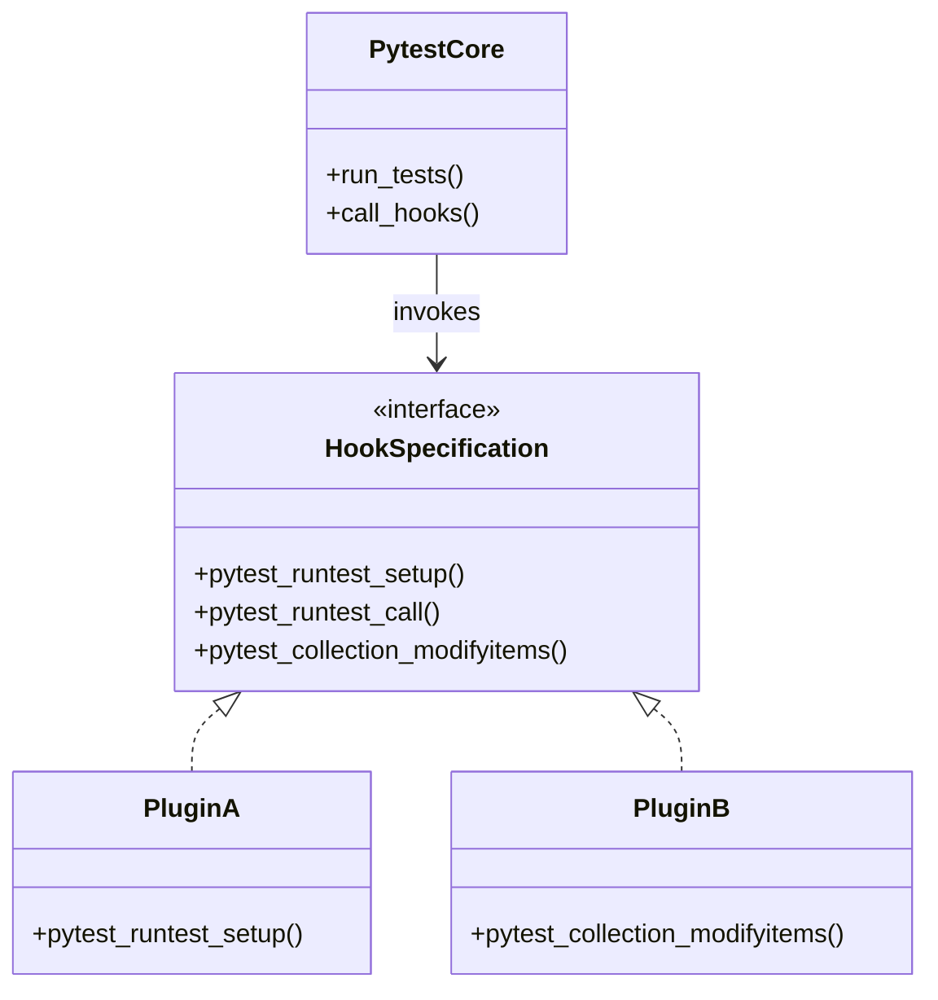

pytest 코어 시스템을 수정하지 않고도 신규 기능을 추가할 수 있는 구조입니다.

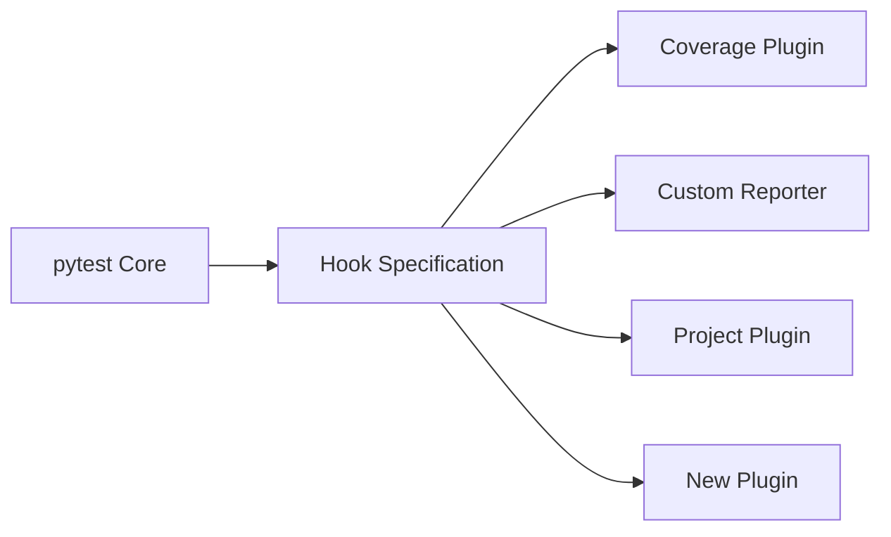

다만 확장 지점을 너무 많이 노출하면 추후 API 호환성을 유지하는 데 발생하는 비용이 커집니다. 따라서 OCP는 "모든 코드를 확장 가능하게 만드는 것"이 아니라, "실제 변화가 자주 일어나는 경계에 확장 지점을 마련하는 것"으로 이해해야 합니다.

---

## 리스코프 치환 원칙 — LSP

Liskov Substitution Principle은 **하위 타입 객체가 상위 타입 객체를 대체하더라도 프로그램의 계약(동작 규약)이 유지되어야 한다**는 원칙입니다.

자식 객체가 부모 객체의 역할을 완전하게 수행할 수 있는지를 다룹니다.

### 잘못된 상속 예제

```python
class Bird:
    def fly(self):
        print("날아간다")


class Sparrow(Bird):
    pass


class Penguin(Bird):
    def fly(self):
        raise RuntimeError("펭귄은 날 수 없습니다")
```

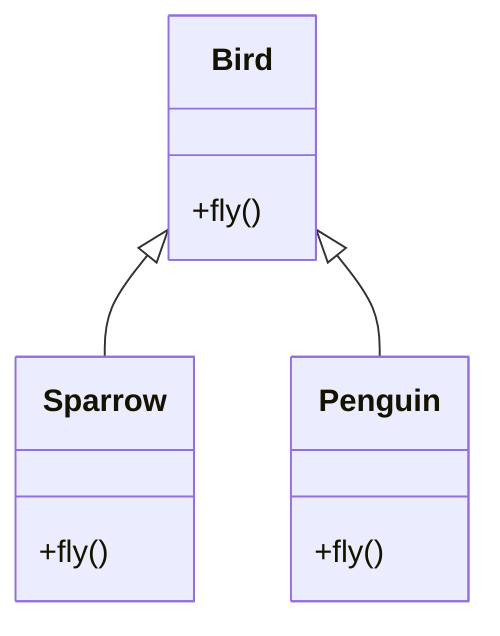

상위 타입을 인자로 받는 함수를 작성합니다.

```python
def make_bird_fly(bird: Bird):
    bird.fly()
```

`Sparrow`는 기대한 대로 동작하지만 `Penguin`을 전달하면 예외가 발생합니다. 상위 타입인 `Bird`에 '비행 기능'을 보편적인 속성으로 정의했기 때문입니다.

역할을 세분화하여 구조를 개선할 수 있습니다.

```python
class Bird:
    pass


class FlyingBird(Bird):
    def fly(self):
        raise NotImplementedError


class Sparrow(FlyingBird):
    def fly(self):
        print("참새가 날아간다")


class Penguin(Bird):
    pass
```

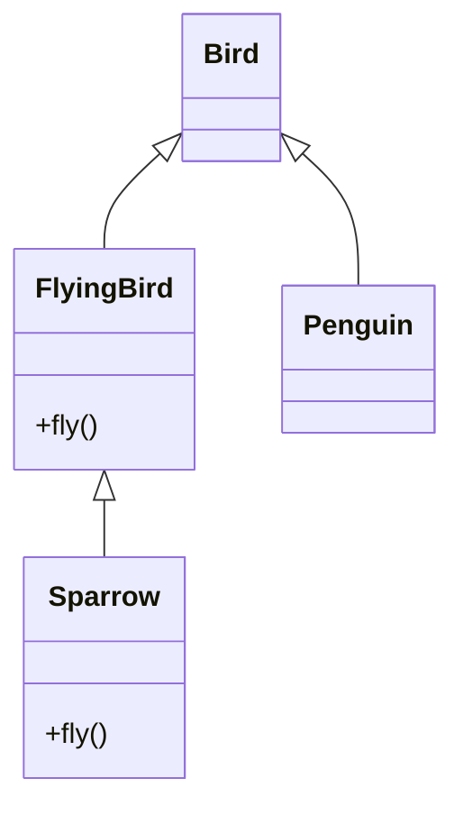

이제 `Penguin` 클래스는 불가능한 행위를 구현하도록 강제받지 않습니다.

### LSP는 메서드 이름만 같으면 되는 것이 아니다

다음과 같은 인터페이스가 있습니다.

```python
class Repository:
    def save(self, item):
        """아이템을 저장한다."""
```

이를 상속받은 하위 클래스가 다음과 같이 작성되면 문제가 발생합니다.

```python
class ReadOnlyRepository(Repository):
    def save(self, item):
        raise PermissionError("저장할 수 없습니다")
```

상위 타입에서 저장 기능을 보장하기로 계약했음에도 하위 타입이 이를 거부하기 때문입니다. 즉, 메서드의 시그니처가 동일한 것과 **행위 계약을 올바르게 이행하는 것**은 별개의 문제입니다.

### 계약으로 판단하기

LSP 준수 여부를 검증할 때는 다음 항목을 확인합니다.

* 하위 타입이 상위 타입보다 더 엄격한 입력 조건을 요구하는가?
* 상위 타입이 보장하는 결과 조건을 하위 타입이 위반하는가?
* 상위 타입에서 문제없이 동작하는 코드가 하위 타입에서 에러를 일으키는가?
* 상위 타입에 명시되지 않은 사이드 이펙트를 하위 타입이 일으키는가?

---

### 실제 사례 — Java `List`와 optional operation

Java Collections Framework는 LSP를 시사하는 대표적인 사례입니다.

Java의 `List<E>` 인터페이스는 조회 메서드와 변경 메서드를 함께 포함합니다.

```java
interface List<E> {
    E get(int index);

    boolean add(E element);

    E remove(int index);

    E set(int index, E element);

    ...
}
```

하지만 모든 `List` 구현체가 수정 기능을 지원하지는 않습니다.

```java
List<String> names =
    List.of("Alice", "Bob");

names.add("Charlie");
```

위 코드는 컴파일을 통과하지만 실행 시 `UnsupportedOperationException`이 발생합니다. Oracle 문서에 따르면 `List.of()`나 `List.copyOf()`로 생성된 리스트는 수정이 불가능하며, 변경 메서드 호출 시 예외를 발생시키도록 설계되어 있습니다.

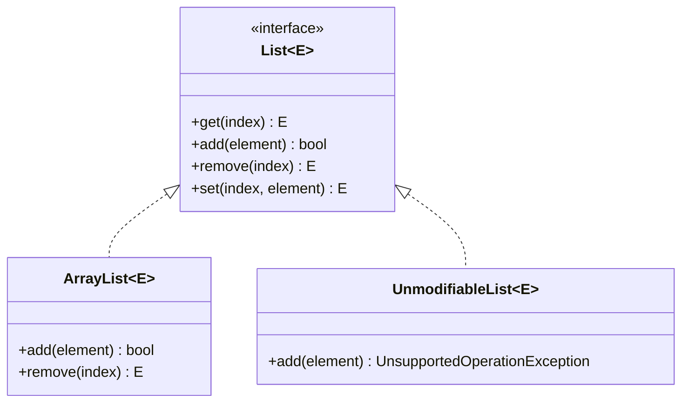

이 구조는 일반적인 LSP 기준에서 벗어난 것처럼 보입니다.

```java
void addDefaultUser(List<String> users) {
    users.add("guest");
}
```

`ArrayList`를 전달하면 정상 동작하지만, 불변 리스트를 전달하면 실패하기 때문입니다.

다만 Java 컬렉션 명세에서는 변경 관련 메서드를 optional operation(선택적 작업)으로 정의하고 있습니다. 지원하지 않는 구현체는 `UnsupportedOperationException`을 던질 수 있도록 명세 자체에 허용 규정을 두고 있으므로, 엄밀히 말해 인터페이스 규약을 위반했다고 단정하기는 어렵습니다.

이 설계의 실질적인 문제는 **타입 수준에서 변경 가능 여부가 드러나지 않는다는 점**입니다.

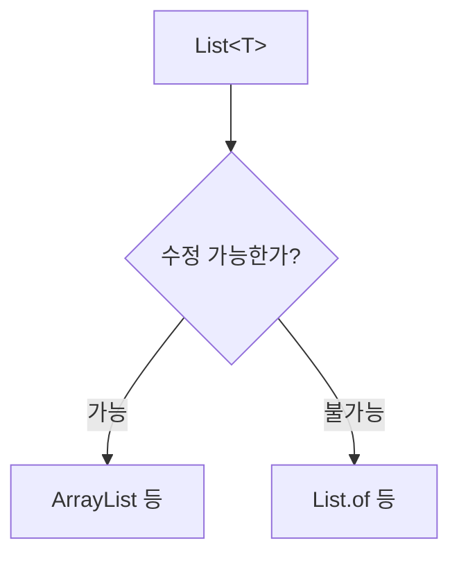

호출자는 `List<T>`라는 타입만으로 해당 객체의 수정 가능 여부를 명확히 알 수 없습니다.

---

### Java가 이렇게 설계된 이유

이 구조는 명확한 트레이드오프(Trade-off)를 고려한 결과입니다.

Java Collections API Design FAQ에 따르면, 컬렉션의 수정 가능 여부를 별도 인터페이스 타입으로 모두 분리할 경우 인터페이스 계층이 복잡해지고 관리해야 할 타입의 수가 급격히 늘어나는 단점이 존재했습니다.

컬렉션 특성은 단순히 가변/불변으로만 나뉘지 않기 때문입니다.

* 고정 크기 리스트
* 요소를 추가만 할 수 있는 리스트
* 요소를 삭제만 할 수 있는 컬렉션
* 읽기 전용 뷰(View)
* 불변 컬렉션

이러한 특성을 모두 정적 타입에 반영하면 다이어그램과 같이 계층이 과도하게 복잡해집니다.

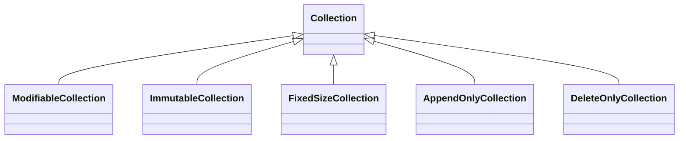

따라서 Java 설계진은 인터페이스 계층을 단순하게 유지하는 대신, 일련의 제약 사항을 런타임 예외로 처리하는 방식을 채택했습니다.


이 사례는 현실적인 제약조건에 따라 SOLID 원칙을 적절히 절충해야 함을 보여줍니다.

---

## 인터페이스 분리 원칙 — ISP

Interface Segregation Principle은 **클라이언트가 사용하지 않는 메서드에 의존하지 않아야 한다**는 원칙입니다.

하나의 거대한 인터페이스보다 **사용 목적에 맞춘 세분화된 인터페이스를 제공하는 것**을 지향합니다.

### 너무 큰 인터페이스

```python
from abc import ABC, abstractmethod


class Machine(ABC):
    @abstractmethod
    def print(self):
        pass

    @abstractmethod
    def scan(self):
        pass

    @abstractmethod
    def fax(self):
        pass
```

다기능 복합기에는 문제없는 인터페이스입니다.

```python
class MultiFunctionPrinter(Machine):
    def print(self):
        print("인쇄")

    def scan(self):
        print("스캔")

    def fax(self):
        print("팩스")
```

그러나 단순 인쇄 기능만 가진 클래스도 불필요한 메서드를 강제로 구현해야 하는 상황이 발생합니다.

```python
class SimplePrinter(Machine):
    def print(self):
        print("인쇄")

    def scan(self):
        raise NotImplementedError

    def fax(self):
        raise NotImplementedError
```

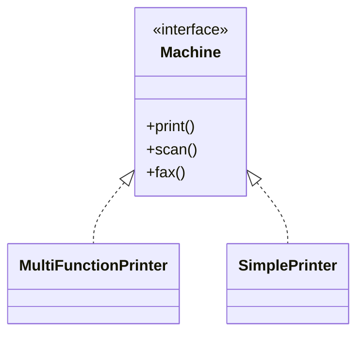

역할별로 인터페이스를 분리하여 개선합니다.

```python
from typing import Protocol


class Printer(Protocol):
    def print(self) -> None: ...
class Scanner(Protocol):
    def scan(self) -> None: ...
class Fax(Protocol):
    def fax(self) -> None: ...
```

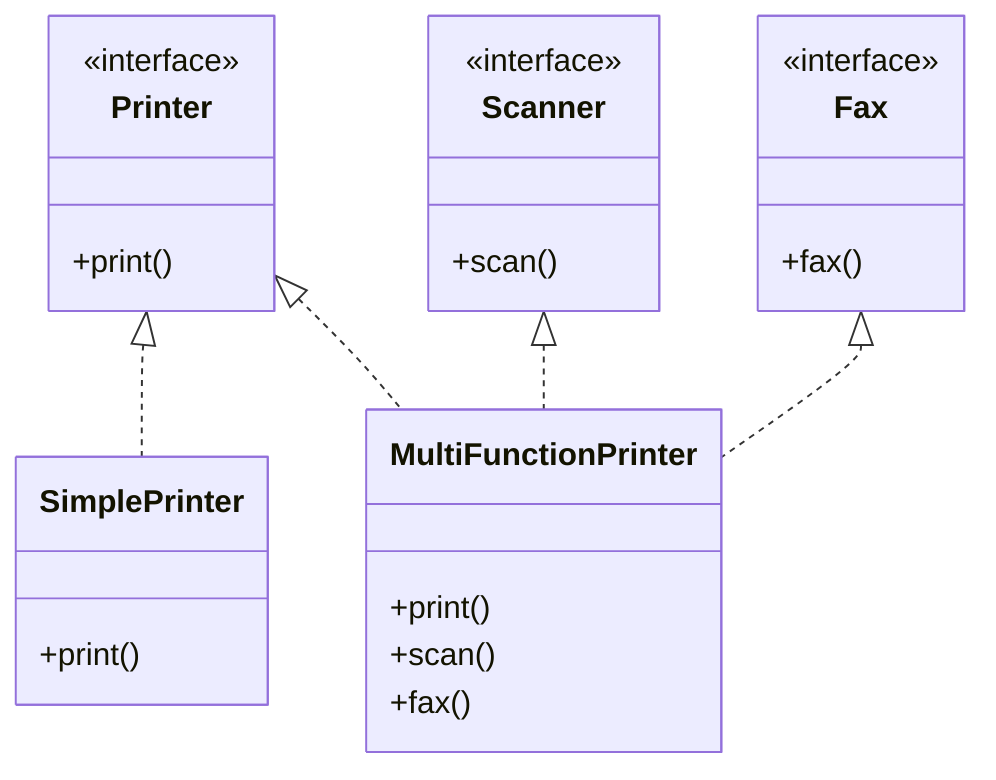

이제 `SimplePrinter`는 자신에게 필요한 `Printer` 인터페이스만 구현합니다.

---

### 실제 사례 — Java와 C#의 컬렉션 계약 비교

Java의 `List` 구조는 ISP 관점에서도 분석할 수 있습니다. 조회 기능만 필요한 경우에도 `List<T>`를 인자로 받으면 `add`, `remove`, `set` 같은 변경 메서드가 함께 노출됩니다.

.NET 프레임워크는 이를 타입 시스템 차원에서 분리하여 다룹니다.

#### `IReadOnlyList<T>`

.NET은 읽기 전용 인터페이스를 별도로 선언합니다.

```csharp
IReadOnlyList<T>
```

이 인터페이스는 인덱서 및 `Count` 등 조회 기능만 제공하며, `Add`나 `Remove` 같은 수정 메서드는 포함하지 않습니다.

```csharp
void PrintUsers(IReadOnlyList<User> users)
{
    foreach (var user in users)
    {
        Console.WriteLine(user.Name);
    }
}
```

읽기 기능만 사용하는 코드는 수정 메서드의 존재를 몰라도 됩니다.

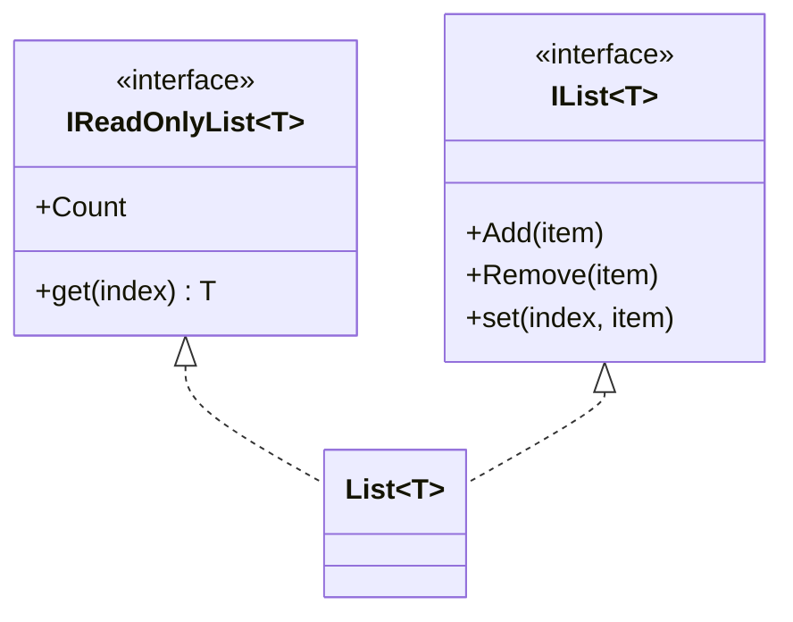

.NET의 `List<T>`는 `IList<T>`와 `IReadOnlyList<T>`를 동시에 구현합니다. 따라서 사용 목적에 따라 적절한 수준의 인터페이스를 선택할 수 있습니다.

#### 읽기 전용과 불변은 다르다

`IReadOnlyList<T>` 타입이라고 해서 내부 객체가 완전히 불변(Immutable)함을 의미하지는 않습니다. 해당 인터페이스를 통해 수정하지 못한다는 의미이며, 외부의 다른 참조를 통해 객체 상태가 변경될 가능성은 존재합니다.

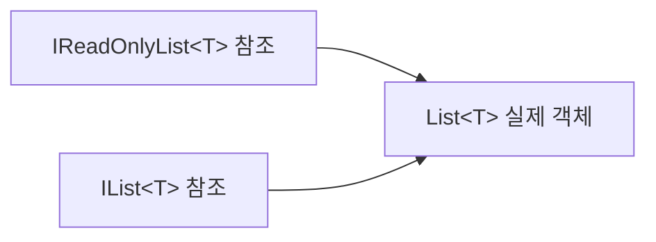

개념적으로 읽기 전용 인터페이스(Read-only interface)와 불변 객체(Immutable object)는 구별해서 다루어야 합니다.

---

#### `IImmutableList<T>`

.NET의 `System.Collections.Immutable` 라이브러리는 엄격한 불변성을 보장하는 인터페이스를 제공합니다.

```csharp
IImmutableList<T>
```

`IImmutableList<T>`는 `IReadOnlyList<T>`를 확장하며, 변경 연산 수행 시 원본을 변경하지 않고 **새로운 객체를 생성하여 반환**합니다.

```csharp
IImmutableList<string> first =
    ImmutableList.Create("A", "B");

IImmutableList<string> second =
    first.Add("C");
```

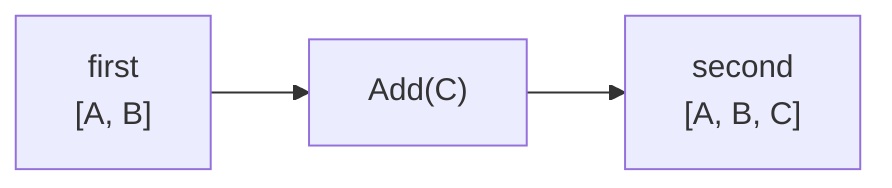

`first` 변수가 참조하는 인스턴스는 유지됩니다. .NET 명세에 따르면 새로 생성되는 인스턴스는 기존 인스턴스와 내부 메모리를 최대한 공유하도록 최적화되어 있습니다.

---

#### Java와 .NET 비교

두 환경의 컬렉션 설계 방식 차이는 다음과 같이 요약할 수 있습니다.

| Java | .NET |
| --- | --- |
| `List<T>` | `IList<T>` |
| 변경 메서드와 선택적 예외 처리가 하나의 타입에 통합 | 변경 전용 계약 분리 (`IList<T>`) |
| `List.of()`도 정적 타입은 `List<T>` 사용 | 읽기 전용 계약으로 `IReadOnlyList<T>` 활용 가능 |
| 수정 가능 여부를 타입 시스템만으로 파악하기 어려움 | 필요한 최소한의 인터페이스만 클라이언트에 노출 |
| 미지원 연산 호출 시 런타임 예외 발생 | 좁은 인터페이스 활용 시 변경 메서드가 노출되지 않음 |
| 별도 타입을 지정하여 불변성 표현 | `IImmutableList<T>` 형태의 불변 타입 제공 |

ISP 관점에서는 클라이언트의 요구 수준에 맞춰 인터페이스를 선택할 수 있는 .NET의 구조가 더 명시적입니다.

```mermaid
flowchart TD
    Client[클라이언트] --> Need{필요한 기능}
    Need -->|읽기만| ReadOnly["IReadOnlyList&lt;T&gt;"]
    Need -->|수정| Mutable["IList&lt;T&gt;"]
    Need -->|불변 값 연산| Immutable["IImmutableList&lt;T&gt;"]
```

다만 .NET의 `ImmutableList<T>` 구체 클래스 역시 하위 호환성을 위해 `IList<T>`, `ICollection<T>` 등을 복합적으로 구현하고 있습니다. 따라서 이는 설계 선택 방식의 차이이며 단편적인 우열의 문제는 아닙니다.

---

#### 같은 문제를 다르게 푼 Kotlin

Kotlin은 JVM 환경에서 컬렉션 인터페이스 계층 구조를 재설계했습니다.

```kotlin
List<T>
MutableList<T>
```

`MutableList<T>`가 `List<T>`를 상속받아 요소의 추가, 삭제, 수정 메서드를 확장하는 방식입니다. 수정 작업이 불필요한 경우 read-only 타입인 `List`를 지정합니다.

```mermaid
classDiagram
    class List~T~ {
        <<interface>>
        +get(index) T
        +size int
    }

    class MutableList~T~ {
        <<interface>>
        +add(item)
        +remove(item)
        +set(index, item)
    }

    List~T~ <|-- MutableList~T~
```

기본 `List` 타입에는 수정 메서드가 존재하지 않아 다음 코드는 컴파일되지 않습니다.

```kotlin
val names: List<String> =
    listOf("Alice", "Bob")

// names.add("Charlie")
```

변경이 필요한 경우 명시적으로 `MutableList` 타입을 사용합니다.

```kotlin
val names: MutableList<String> =
    mutableListOf("Alice", "Bob")

names.add("Charlie")
```

Kotlin의 `List` 역시 읽기 전용 인터페이스이며, 객체 자체의 완벽한 불변성을 상징하는 것은 아닙니다. 해당 객체를 참조하는 다른 가변 참조에 의해 내용이 변경될 수 있으므로 `read-only`와 `immutable`의 구분은 동일하게 유효합니다.

---

#### Python의 `Sequence`와 `MutableSequence`

Python의 `collections.abc` 모듈도 표준 컬렉션에 유사한 구조를 적용하고 있습니다.

```python
Sequence
MutableSequence
```

`MutableSequence`는 `Sequence`가 가진 읽기 전용 인터페이스에 `__setitem__`, `__delitem__`, `insert()` 등의 변경 메서드를 추가하여 확장합니다.

```mermaid
classDiagram
    class Sequence {
        <<ABC>>
        +__getitem__()
        +__len__()
    }

    class MutableSequence {
        <<ABC>>
        +__setitem__()
        +__delitem__()
        +insert()
        +append()
        +remove()
    }

    Sequence <|-- MutableSequence
```

이 상속 구조는 다른 컬렉션 ABC(Abstract Base Class)에도 적용되어 있습니다.

```mermaid
classDiagram
    class Set
    class MutableSet

    class Mapping
    class MutableMapping

    class Sequence
    class MutableSequence

    Set <|-- MutableSet
    Mapping <|-- MutableMapping
    Sequence <|-- MutableSequence
```

필요한 행위 세트만을 인터페이스로 의존하게 만드는 전형적인 ISP 적용 사례입니다.

---

#### Java 컬렉션 사례에서 배울 점

언어별 컬렉션 구조 비교는 SOLID 원칙이 절대적인 단일 기준이 아니라 트레이드오프 관계에 있음을 보여줍니다.

* Java: 최소한의 인터페이스 계층 구조와 폭넓은 호환성 선택
* .NET: `IReadOnlyList<T>`, `IImmutableList<T>` 등으로 세분화된 계약 제공
* Kotlin & Python: 읽기 전용과 수정 전용 인터페이스를 명확히 분리

```mermaid
flowchart LR
    Java[Java] --> J["List<br/>optional mutation"]

    DotNet[.NET] --> D1[IReadOnlyList]
    DotNet --> D2[IList]
    DotNet --> D3[IImmutableList]

    Kotlin[Kotlin] --> K1[List]
    Kotlin --> K2[MutableList]

    Python[Python] --> P1[Sequence]
    Python --> P2[MutableSequence]
```

핵심은 특정 언어의 우월성이 아니라 "변경 가능성이라는 제약 조건을 타입 시스템으로 강제할 것인가, 문서 및 런타임 계약으로 처리할 것인가"에 대한 설계상 결정입니다.

---

## 의존성 역전 원칙 — DIP

Dependency Inversion Principle은 **고수준 모듈이 저수준 세부 구현에 직접 의존해서는 안 되며, 두 모듈 모두 추상화에 의존해야 한다**는 원칙입니다.

세부 구현보다 인터페이스나 추상 클래스와 같은 구체적인 계약에 의존하도록 설계합니다.

### 구체 구현에 직접 의존하는 예제

```python
class EmailSender:
    def send(self, message):
        print(f"이메일 전송: {message}")


class OrderService:
    def __init__(self):
        self.sender = EmailSender()

    def complete_order(self):
        print("주문 완료")
        self.sender.send("주문이 완료되었습니다.")
```

```mermaid
classDiagram
    class OrderService {
        -sender: EmailSender
        +complete_order()
    }

    class EmailSender {
        +send(message)
    }

    OrderService --> EmailSender : directly depends on
```

`OrderService`가 비즈니스 로직 외에 `EmailSender`라는 특정 전송 기술에 직접 결합된 상태입니다. 이 상황에서 알림 매체를 SMS로 변경하면 `OrderService` 코드도 함께 수정해야 합니다.

### 추상화에 의존하기

```python
from typing import Protocol


class MessageSender(Protocol):
    def send(self, message: str) -> None: ...
```

세부 전송 클래스는 이 인터페이스 규약을 준수하도록 구현합니다.

```python
class EmailSender:
    def send(self, message: str) -> None:
        print(f"이메일 전송: {message}")


class SmsSender:
    def send(self, message: str) -> None:
        print(f"SMS 전송: {message}")
```

비즈니스 로직 클래스는 추상화된 규약에만 의존합니다.

```python
class OrderService:
    def __init__(self, sender: MessageSender):
        self.sender = sender

    def complete_order(self):
        print("주문 완료")
        self.sender.send("주문이 완료되었습니다.")
```

```mermaid
classDiagram
    class OrderService {
        -sender: MessageSender
        +complete_order()
    }

    class MessageSender {
        <<interface>>
        +send(message)
    }

    class EmailSender {
        +send(message)
    }

    class SmsSender {
        +send(message)
    }

    OrderService --> MessageSender : depends on
    MessageSender <|.. EmailSender
    MessageSender <|.. SmsSender
```

객체 생성 및 주입은 외부에서 담당합니다.

```python
sender = EmailSender()
service = OrderService(sender)
service.complete_order()
```

---

### 의존성 주입과 DIP

외부에서 인스턴스를 전달받는 테크닉을 의존성 주입(Dependency Injection, DI)이라 부릅니다.

```python
service = OrderService(EmailSender())
```

다만 DI와 DIP가 완전히 동일한 개념은 아닙니다.

```python
class OrderService:
    def __init__(self, sender: EmailSender):
        self.sender = sender
```

위 코드는 외부에서 객체를 주입받아 DI는 충족하지만, 인자의 타입으로 구체 클래스(`EmailSender`)를 지정하고 있어 DIP 원칙은 위반합니다.

```python
class OrderService:
    def __init__(self, sender: MessageSender):
        self.sender = sender
```

추상 타입(`MessageSender`)에 의존하도록 설정해야 DIP 원칙이 성립됩니다.

| 개념 | 의미 |
| --- | --- |
| Dependency Inversion | 구체 클래스가 아닌 추상화에 의존하도록 관계를 뒤집는 설계 원칙 |
| Dependency Injection | 외부에서 필요한 의존 객체를 전달받아 결합도를 낮추는 패턴/기법 |
| IoC | 객체 생성을 포함한 제어 흐름 권한을 외부 프레임워크 등에 위임하는 개념 |

---

### 실제 사례 — Requests의 Transport Adapter

Python의 HTTP 라이브러리 `requests`는 Transport Adapter라는 구조로 DIP를 활용합니다.

`requests.Session` 객체는 특정 URL 패턴에 맞춰 Custom Adapter를 연결할 수 있습니다.

```python
import requests

session = requests.Session()
session.mount("https://example.com/", MyAdapter())
```

`requests` 모듈 내부에는 모든 Adapter가 구현해야 하는 표준 규약인 `BaseAdapter` 추상 클래스가 존재합니다.

```mermaid
classDiagram
    class Session {
        +mount(prefix, adapter)
        +send(request)
    }

    class BaseAdapter {
        <<abstract>>
        +send(request)
        +close()
    }

    class HTTPAdapter {
        +send(request)
        +close()
    }

    class CustomAdapter {
        +send(request)
        +close()
    }

    Session --> BaseAdapter : delegates transport
    BaseAdapter <|-- HTTPAdapter
    BaseAdapter <|-- CustomAdapter
```

`Session` 클래스는 네트워크 전송의 구체적인 방식을 직접 알지 않고 `BaseAdapter` 규약에만 의존합니다.

```mermaid
flowchart LR
    Session --> Adapter[Transport Adapter]
    Adapter --> HTTP[HTTPAdapter]
    Adapter --> Custom[Custom Adapter]
```

새로운 통신 프로토콜이나 동작 방식이 필요한 경우 Adapter 경계에 맞추어 구현체만 교체할 수 있습니다. 이 구조는 DIP와 OCP가 복합적으로 적용된 형태입니다.

---

## SOLID 원칙은 서로 연결되어 있다

SOLID 다섯 원칙은 개별적으로 작동하기보다 실제 코드상에서 상호보완적인 관계를 갖습니다.

다음은 조건문 기반의 결제 처리 예제입니다.

```python
class Checkout:
    def pay(self, payment_type, amount):
        if payment_type == "card":
            print("카드 결제")
        elif payment_type == "bank":
            print("계좌 이체")
        elif payment_type == "point":
            print("포인트 결제")
```

새로운 결제 수단이 추가될 때마다 `Checkout` 수정이 필요합니다. 구조를 변경해 결제 수단을 전략으로 분리합니다.

```python
from typing import Protocol


class PaymentMethod(Protocol):
    def pay(self, amount: int) -> None: ...
class CardPayment:
    def pay(self, amount: int) -> None:
        print(f"카드로 {amount}원 결제")


class BankTransfer:
    def pay(self, amount: int) -> None:
        print(f"계좌이체로 {amount}원 결제")


class PointPayment:
    def pay(self, amount: int) -> None:
        print(f"포인트로 {amount}원 결제")
```

```python
class Checkout:
    def __init__(self, payment_method: PaymentMethod):
        self.payment_method = payment_method

    def checkout(self, amount: int) -> None:
        self.payment_method.pay(amount)
```

```mermaid
classDiagram
    class Checkout {
        -payment_method: PaymentMethod
        +checkout(amount)
    }

    class PaymentMethod {
        <<interface>>
        +pay(amount)
    }

    class CardPayment {
        +pay(amount)
    }

    class BankTransfer {
        +pay(amount)
    }

    class PointPayment {
        +pay(amount)
    }

    Checkout --> PaymentMethod : delegates
    PaymentMethod <|.. CardPayment
    PaymentMethod <|.. BankTransfer
    PaymentMethod <|.. PointPayment
```

이 구조 하나에 다섯 가지 원칙이 작동합니다.

### SRP

`Checkout`은 결제 승인 프로세스 전체 흐름에 집중하고, 개별 결제 수단의 세부 로직은 각 클래스가 담당합니다.

### OCP

새로운 결제 수단이 추가되면 `PaymentMethod`를 구현하는 클래스를 신규 작성하여 기능을 확장합니다.

### LSP

모든 결제 클래스는 `PaymentMethod` 규약을 동일하게 준수하므로 호출부가 예외 처리 없이 다형적으로 다룰 수 있습니다.

### ISP

`PaymentMethod` 인터페이스는 `pay()`라는 필수 기능만 최소한으로 정의하여 제공합니다.

### DIP

`Checkout` 클래스는 `CardPayment` 같은 세부 구체 타입이 아닌 `PaymentMethod` 인터페이스에 의존합니다.

이처럼 SOLID 원칙은 독립된 개별 규칙이라기보다 **변경에 유연한 구조를 다양한 각도에서 검토하기 위한 가이드라인**입니다.

---

## SRP와 ISP의 차이

두 원칙은 대상을 '분리한다'는 공통점이 있어 혼동하기 쉽습니다.

SRP는 **클래스(구현체)가 담당하는 책임 범위**를 기준으로 삼습니다.

```mermaid
flowchart TD
    Service[OrderService]
    Service --> Calc[가격 계산]
    Service --> DB[DB 저장]
    Service --> Email[이메일 발송]
```

하나의 클래스가 여러 이유로 변경되는 상황을 방지합니다.

반면 ISP는 **클라이언트가 의존하는 인터페이스(계약)의 크기**를 기준으로 삼습니다.

```mermaid
flowchart TD
    Interface[Machine]
    Interface --> Print[print]
    Interface --> Scan[scan]
    Interface --> Fax[fax]

    Simple[SimplePrinter] -. 필요 .-> Print
    Simple -. 불필요 .-> Scan
    Simple -. 불필요 .-> Fax
```

클라이언트가 쓰지 않는 메서드에 영향을 받지 않도록 인터페이스를 쪼개는 것에 초점을 맞춥니다.

| 원칙 | 진단 질문 |
| --- | --- |
| SRP | 이 클래스를 변경해야 하는 원인이 둘 이상 존재하는가? |
| ISP | 이 클라이언트가 불필요한 메서드를 참조하거나 구현해야 하는가? |

---

## OCP와 DIP의 차이

OCP는 **확장하는 방식**에 관한 원칙입니다.

> 새로운 요구사항 추가 시 기존 코드의 수정 없이 확장이 가능한가?
> 
> 

DIP는 **모듈 간 의존 방향**에 관한 원칙입니다.

```mermaid
classDiagram
    class Checkout
    class CardPayment

    Checkout --> CardPayment
```

위 구조를 추상화를 이용해 아래와 같이 의존 방향을 재설정하도록 유도합니다.

```mermaid
classDiagram
    class Checkout

    class PaymentMethod {
        <<interface>>
    }

    class CardPayment

    Checkout --> PaymentMethod
    PaymentMethod <|.. CardPayment
```

DIP를 적용해 인터페이스에 의존하도록 만들면 자연스럽게 OCP를 달성하기 쉬워집니다. 그러나 의존 관계의 관점(DIP)과 확장성의 관점(OCP)이라는 목적상의 차이가 존재합니다.

---

## 상속보다 합성을 우선해서 검토하는 이유

SOLID를 구현하는 과정에서 상속(Inheritance) 대신 합성(Composition)과 위임(Delegation)을 사용하는 구조를 자주 활용합니다.

상속을 사용한 구현 예시입니다.

```python
class Checkout:
    def pay(self, amount):
        raise NotImplementedError


class CardCheckout(Checkout):
    def pay(self, amount):
        print("카드 결제")


class BankCheckout(Checkout):
    def pay(self, amount):
        print("계좌 이체")
```

```mermaid
classDiagram
    class Checkout {
        +pay(amount)
    }

    class CardCheckout {
        +pay(amount)
    }

    class BankCheckout {
        +pay(amount)
    }

    Checkout <|-- CardCheckout
    Checkout <|-- BankCheckout
```

이 관계가 명확한 **is-a** 관계인지 판단해야 합니다. 결제 방식을 합성 구조로 변경하면 다음과 같습니다.

```mermaid
classDiagram
    class Checkout {
        -payment_method: PaymentMethod
    }

    class PaymentMethod {
        <<interface>>
        +pay(amount)
    }

    Checkout --> PaymentMethod : has-a
```

합성과 위임을 활용하면 다음과 같은 이점이 있습니다.

* 런타임 시점에 내부 전략을 동적으로 교체 가능
* 과도하게 깊은 상속 계층 형성 방지
* 클래스 간 결합도를 낮추어 변경 영향 최소화

상속 자체가 잘못된 기법은 아닙니다. 명확한 **is-a 관계**를 형성하고, 하위 타입이 상위 타입의 모든 계약을 온전히 이행할 수 있을 때는 상속이 적절합니다.

---

## Python에서 SOLID 적용하기

Python은 정적 타입 언어와 달리 인터페이스를 명시적으로 작성하지 않아도 동적 특성을 통해 SOLID를 적용할 수 있습니다.

### 덕 타이핑

```python
class EmailSender:
    def send(self, message):
        print(message)


class SmsSender:
    def send(self, message):
        print(message)


class NotificationService:
    def __init__(self, sender):
        self.sender = sender

    def notify(self, message):
        self.sender.send(message)
```

`NotificationService`는 객체의 타입이 아닌 `send()` 메서드의 존재 여부만 확인하여 작동합니다.

### `Protocol`

정적 타입 힌팅 시스템 내에서 명시적인 명세를 정의하고 싶다면 `Protocol`을 활용합니다.

```python
from typing import Protocol


class Sender(Protocol):
    def send(self, message: str) -> None: ...
```

### `ABC`

상속 관계를 강제하고 런타임 시점에 메서드 구현을 검증해야 하는 경우 `ABC`를 사용합니다.

```python
from abc import ABC, abstractmethod


class Sender(ABC):
    @abstractmethod
    def send(self, message: str) -> None:
        pass
```

| 방식 | 특징 |
| --- | --- |
| 덕 타이핑 | 런타임 시점에 필요한 메서드의 존재 유무로 처리 |
| `Protocol` | 구조적 서브타이핑(Structural Subtyping)으로 인터페이스 검증 |
| `ABC` | 명시적 상속 및 추상 메서드 미구현 시 런타임 에러 발생 |

---

### 함수도 좋은 전략이 될 수 있다

Python에서는 상태를 갖지 않는 단순 전략 패턴을 구현할 때 클래스 대신 일급 함수(First-class function)를 전달할 수 있습니다.

```python
def regular_discount(price):
    return int(price * 0.05)


def vip_discount(price):
    return int(price * 0.10)


def calculate_price(price, discount_policy):
    return price - discount_policy(price)
```

함수를 직접 인자로 넘깁니다.

```python
total = calculate_price(10000, vip_discount)
```

```mermaid
flowchart LR
    Calculator[calculate_price] --> Policy[discount_policy]
    Policy --> Regular[regular_discount]
    Policy --> VIP[vip_discount]
```

비즈니스 로직과 세부 할인 알고리즘이 성공적으로 분리됩니다. SOLID의 본질은 무조건적인 클래스 양산이 아닌 **변화의 경계를 올바르게 정의하는 것**입니다.

---

## 테스트 코드에서 보는 DIP

외부 의존성을 내부에 직접 인스턴스화하면 단위 테스트 작성이 어려워집니다.

```python
class WeatherService:
    def get_weather(self):
        client = RealWeatherApi()
        return client.fetch()
```

```mermaid
classDiagram
    class WeatherService {
        +get_weather()
    }

    class RealWeatherApi {
        +fetch()
    }

    WeatherService --> RealWeatherApi : creates directly
```

외부에서 의존성을 전달받도록 개선하면 테스트 대역(Test Double)을 주입할 수 있습니다.

```python
class WeatherService:
    def __init__(self, client):
        self.client = client

    def get_weather(self):
        return self.client.fetch()
```

```python
class FakeWeatherApi:
    def fetch(self):
        return {"temperature": 20}


service = WeatherService(FakeWeatherApi())
assert service.get_weather()["temperature"] == 20
```

```mermaid
classDiagram
    class WeatherService {
        -client
        +get_weather()
    }

    class WeatherClient {
        <<contract>>
        +fetch()
    }

    class RealWeatherApi {
        +fetch()
    }

    class FakeWeatherApi {
        +fetch()
    }

    WeatherService --> WeatherClient
    WeatherClient <|.. RealWeatherApi
    WeatherClient <|.. FakeWeatherApi
```

외부 시스템과의 결합도가 낮아지면 다음과 같은 장점이 있습니다.

* 네트워크 연결 없이 격리된 환경에서 테스트 수행 가능
* 외부 에러 상황을 의도적으로 모사 가능
* 테스트 실행 속도 향상 및 결과 신뢰성 확보

---

## SOLID 적용을 검토할 신호

무조건적인 적용보다 **코드 수정 시 발생하는 부작용(Side effect) 및 변경 비용이 커지는 시점**에 팩토링 요소로 도입합니다.

### 하나의 기능을 수정했으나 연관 없는 영역에서 버그가 발생할 때

하나의 모듈에 서로 다른 변경 이유를 가진 책임들이 섞여 있을 가능성이 높습니다.
→ **SRP 검토**

### 새로운 유형을 추가할 때마다 대형 조건문 수정이 반복될 때

확장할 수 있는 지점이 제대로 설계되어 있지 않은 상태입니다.
→ **OCP 검토**

### 하위 클래스에서 부모 메서드를 `NotImplementedError` 등으로 재정의해 막아둘 때

잘못된 상속 관계를 맺고 있을 확률이 큽니다.
→ **LSP 검토**

### 구현체 클래스에서 사용하지 않는 인터페이스 메서드가 대거 존재할 때

인터페이스 명세가 너무 뚱뚱하게 정의된 상태입니다.
→ **ISP 검토**

### 비즈니스 핵심 로직이 DB 접근 모듈이나 특정 라이브러리를 직접 생성해 사용할 때

구체적인 세부 구현 기술과 과도하게 결합되어 있습니다.
→ **DIP 검토**

---

## SOLID를 적용하지 않아도 되는 경우

SOLID 원칙은 절대적인 철칙이 아닙니다.

아주 단순하게 동작하는 기능 코드가 있습니다.

```python
def add(a, b):
    return a + b
```

이러한 로직에 정형화된 패턴이나 인터페이스 구조를 지나치게 적용할 필요는 없습니다.

```mermaid
flowchart LR
    Simple["add(a, b)"] --> Result[결과]

    Complex[불필요한 추상화] --> A[Adder]
    A --> B[AdditionStrategy]
    B --> C[DefaultAdditionStrategy]
    C --> D[AdditionFactory]
```

추상화 레이어 자체가 비용이자 복잡성을 유발할 수 있기 때문입니다.

---

## 추상화의 비용

추상화 레이어를 추가할수록 다음과 같은 오버헤드가 발생합니다.

* 클래스 및 파일 개수의 증가
* 코드 실행 및 추적 경로의 복잡화
* 초기 가독성 및 진입 장벽 상승
* 불확실한 미래의 요구사항을 위한 과도한 설계(Over-engineering) 위험

```mermaid
flowchart LR
    Checkout --> PaymentMethod
    PaymentMethod --> PaymentProvider
    PaymentProvider --> GatewayAdapter
    GatewayAdapter --> Transport
```

따라서 추상화는 **실제 변경이 빈번하게 일어나거나 명확한 확장 요구가 예상되는 지점**에 한해 제약적으로 도입해야 합니다.

---

## SOLID와 YAGNI

YAGNI는 "You Aren't Gonna Need It"의 약자로, 지금 필요하지 않은 기능을 미리 구현하지 말라는 원칙입니다.

단 하나의 결제 수단만 존재하는 상황에서 확장 가능성을 명목으로 수많은 추상 인터페이스와 팩토리 클래스를 구성하는 것은 오버 엔지니어링에 해당합니다.

```mermaid
classDiagram
    class PaymentMethod
    class PaymentStrategy
    class PaymentProvider
    class PaymentFactory
    class PaymentResolver
    class PaymentRegistry

    PaymentFactory --> PaymentResolver
    PaymentResolver --> PaymentRegistry
    PaymentRegistry --> PaymentProvider
    PaymentProvider --> PaymentStrategy
    PaymentStrategy --> PaymentMethod
```

실제 변경 요구 사항의 변화 양상이 파악되는 시점에 추상화를 도입하는 것도 적절한 접근 전략입니다.

---

## SOLID와 DRY

DRY는 "Don't Repeat Yourself"의 약자로, 시스템 내에서 동일한 지식이나 로직의 중복을 배제하라는 지침입니다.

그러나 코드의 겉모습이 유사하다고 해서 반드시 동일한 책임인 것은 아닙니다.

* 사용자용 이메일 발송 양식 로직
* 관리자용 이메일 발송 양식 로직

두 로직이 현재 동일하더라도 향후 서로 다른 이유와 시점에 변경될 가능성이 크다면, 억지로 공통 클래스로 통합하는 것이 오히려 나쁜 결과를 낳을 수 있습니다. "우연히 코드 형태가 같은 것"과 "실제 동일한 도메인 개념인 것"을 구분해야 합니다.

---

## SOLID와 디자인 패턴

SOLID가 설계의 방향성을 지시하는 원칙이라면, 디자인 패턴은 해당 원칙들을 실제 코드 구조에 적용하기 위해 검증된 유용한 패턴 모음입니다.

| SOLID 원칙 | 주로 연결되는 디자인 패턴 |
| --- | --- |
| SRP | Facade, Command |
| OCP | Strategy, Decorator, Template Method |
| LSP | 올바른 상속 구조 설정, Strategy |
| ISP | Adapter, 역할 단위 인터페이스 분리 |
| DIP | Dependency Injection, Strategy, Repository, Adapter |

Strategy 패턴은 OCP와 DIP를 충족하기 좋은 유용한 수단입니다. Decorator 패턴은 기존 코드를 수정하지 않고 조합을 통해 기능을 확장하므로 OCP와 밀접합니다.

그러나 디자인 패턴을 적용했다는 사실만으로 SOLID를 완벽히 준수했다고 볼 수는 없으며, 모듈 간의 구체적인 책임과 결합 상태를 계속 확인해야 합니다.

---

## 다섯 원칙의 차이 한눈에 보기

| 원칙 | 핵심 요약 | 주의할 문제 현상 | 대표적 해결 기법 |
| --- | --- | --- | --- |
| SRP | 변경 원인은 하나여야 함 | 하나의 클래스가 여러 요구에 의해 자주 수정됨 | 책임별 클래스 분리 |
| OCP | 확장엔 열리고 수정엔 닫힘 | 타입이 추가될 때마다 기존 조건문을 수정함 | 전략 패턴, 다형성 활용 |
| LSP | 하위 타입은 상위 타입을 대체 가능해야 함 | 구현체 교체 시 예외 발생 또는 동작 불일치 | 행위 계약 검토 및 타입 계층 재설계 |
| ISP | 사용하지 않는 인터페이스에 의존하지 않음 | 불필요한 메서드를 강제로 구현함 | 역할 기반의 작은 인터페이스로 분리 |
| DIP | 세부 구현이 아닌 추상화에 의존함 | 핵심 비즈니스 코드가 하위 세부 기술을 직접 참조함 | 추상화 인터페이스 정의, DI 적용 |

---

## 실제 사례 한눈에 보기

| 원칙 | 라이브러리 및 언어 사례 | 핵심 설계 포인트 |
| --- | --- | --- |
| SRP | Python `logging` | Logger, Handler, Formatter 역할의 완전한 분리 |
| OCP | pytest plugin / hook 시스템 | 코어 코드 변경 없이 외부 플러그인 확장 |
| LSP | Java `List` optional operation | 동일 타입 내에서 일부 연산 미지원의 런타임 검사 |
| ISP | Java / .NET / Kotlin / Python 컬렉션 | 읽기 기능과 변경 기능을 인터페이스 단계에서 세분화 |
| DIP | Requests Transport Adapter | `Session`과 구체적 통신 로직 사이에 추상 경계 제공 |

---

## SOLID 문서를 읽는 순서

기존 코드를 SOLID 관점에서 점검할 때는 다음 순서로 진단합니다.

1. 클래스 및 모듈이 가진 **책임의 범위**를 확인합니다.
2. 요구사항 변경 시 **어떤 기존 코드가 수정에 노출되는지** 파악합니다.
3. 상속이나 인터페이스 적용 시 **구현체 간 동등한 교체가 가능한지** 검증합니다.
4. 클라이언트가 인터페이스 내 **모든 메서드를 실제 필요로 하는지** 점검합니다.
5. 핵심 비즈니스 로직이 DB, HTTP 등의 **구체 세부 기술에 의존하는지** 체크합니다.
6. 모듈과 모듈 사이에 **적절한 변경 경계가 형성되어 있는지** 종합적으로 판단합니다.

---

## 핵심 정리

SOLID의 기본 개념을 정리하면 다음과 같습니다.

| 원칙 | 요약 |
| --- | --- |
| S | 하나의 변경 원인만 가지도록 책임을 분리합니다. |
| O | 기존 코드는 유지하면서 확장 가능하게 설계합니다. |
| L | 하위 타입은 상위 타입과의 계약을 온전히 준수해야 합니다. |
| I | 불필요하게 거대한 인터페이스 의존성을 지양합니다. |
| D | 비즈니스 로직이 세부 기술 구현에 직접 결합되지 않도록 경계를 둡니다. |

SOLID 원칙의 궁극적인 지향점은 "요구사항 변경에 따른 영향 범위를 최소화하고 통제하는 것"입니다.

```mermaid
flowchart LR
    Requirement[요구사항 변경]
    Requirement --> Module[관련 모듈]
    Module --> Change[국소적인 수정]

    Change -. 최소 영향 .-> StableA[다른 기능]
    Change -. 최소 영향 .-> StableB[외부 시스템]
    Change -. 최소 영향 .-> StableC[다른 모듈]
```

올바른 설계는 요구사항이 바뀌었을 때 관련된 영역만 영향받도록 하고, 상관없는 코드까지 사이드 이펙트가 퍼지지 않도록 만드는 것입니다. 따라서 코드를 분석할 때는 단순히 "원칙을 지켰는가?"보다는 "요구사항 변경 시 영향 범위가 어디까지 미치는가?"를 확인해야 합니다.

또한 실제 소프트웨어 제품 및 라이브러리 개발 시에는 다음과 같은 현실적인 제약사항을 균형 있게 고려해야 합니다.

* 하위 호환성 유지
* API 노출 면적의 관리
* 언어 자체의 타입 시스템 한계
* 개발자의 학습 비용 및 편의성
* 기존 생태계와의 호환성

SOLID 원칙은 절대적인 답을 제시하는 규칙이라기보다, **복잡한 설계상의 선택을 체계적으로 분석하고 트레이드오프를 판단하도록 돕는 유용한 도구**로 다루는 것이 적절합니다.
