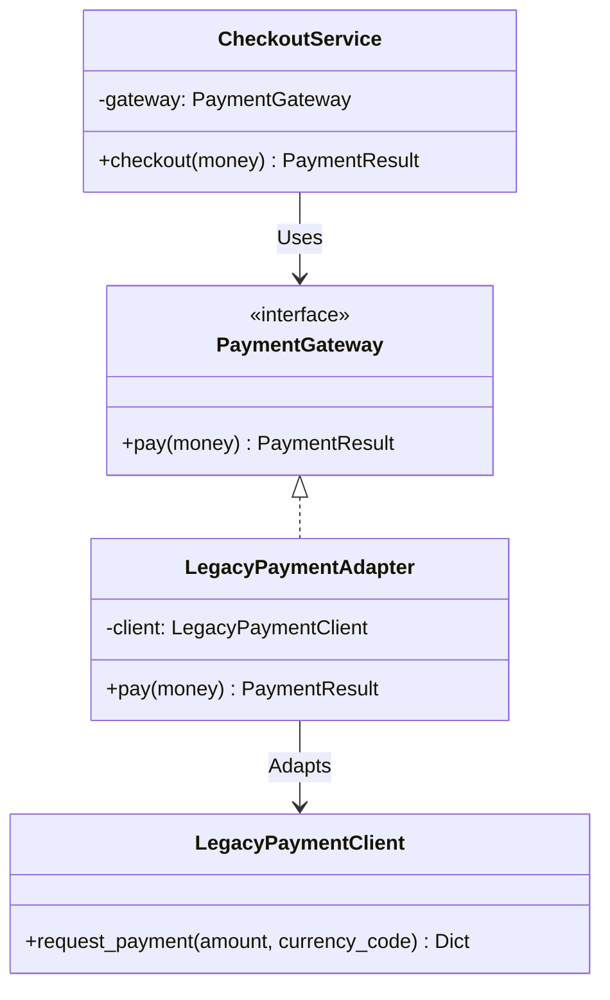

# 어댑터 패턴 (Adapter Pattern)

## 1. 패턴이 없을 때 발생하는 문제점 (The Problem)

어댑터 패턴을 사용하지 않고 기존 시스템과 새로운 인터페이스를 직접 연결하면, 서로 다른 메서드 이름이나 매개변수 형식, 반환 데이터 구조를 맞추기 위한 변환 코드가 클라이언트 곳곳에 반복될 수 있습니다.

예를 들어 새로운 주문 시스템에서는 모든 결제 수단이 다음과 같은 형태로 동작하기를 기대한다고 가정합니다.

```python
gateway.pay(money)

```

하지만 이미 사용 중인 레거시 결제 SDK는 전혀 다른 인터페이스를 제공합니다.

### 패턴을 적용하지 않은 예시

```python
from dataclasses import dataclass


@dataclass(frozen=True)
class Money:
    cents: int
    currency: str


@dataclass(frozen=True)
class PaymentResult:
    transaction_id: str
    approved: bool


class LegacyPaymentClient:

    def request_payment(
        self,
        amount: int,
        currency_code: str,
    ) -> dict[str, object]:

        # 외부 레거시 SDK라고 가정
        return {
            "tx_id": "TX-10001",
            "result_code": "00",
            "amount": amount,
            "currency": currency_code,
        }


class BadCheckoutService:

    def __init__(
        self,
        client: LegacyPaymentClient,
    ):
        self.client = client

    def checkout(
        self,
        money: Money,
    ) -> PaymentResult:

        # 문제점 1: 클라이언트가 레거시 SDK 호출 규칙을 알아야 함
        response = self.client.request_payment(
            amount=money.cents,
            currency_code=money.currency,
        )

        # 문제점 2: 레거시 응답 구조까지 직접 해석
        return PaymentResult(
            transaction_id=str(response["tx_id"]),
            approved=response["result_code"] == "00",
        )

```

이 경우 `CheckoutService`는 단순히 결제를 요청하는 것뿐 아니라 다음과 같은 레거시 시스템의 세부사항까지 알아야 합니다.

* `request_payment()`라는 메서드 이름
* `amount`와 `currency_code`라는 매개변수 규칙
* `"tx_id"`라는 응답 필드
* `"00"`이 결제 성공을 의미한다는 규칙

다른 서비스에서도 동일한 결제 SDK를 사용한다면 변환 로직이 반복됩니다.

```python
class SubscriptionService:

    def renew(
        self,
        money: Money,
    ) -> PaymentResult:

        response = legacy_client.request_payment(
            amount=money.cents,
            currency_code=money.currency,
        )

        return PaymentResult(
            transaction_id=str(response["tx_id"]),
            approved=response["result_code"] == "00",
        )


class RefundService:

    def retry_payment(
        self,
        money: Money,
    ) -> PaymentResult:

        response = legacy_client.request_payment(
            amount=money.cents,
            currency_code=money.currency,
        )

        return PaymentResult(
            transaction_id=str(response["tx_id"]),
            approved=response["result_code"] == "00",
        )

```

레거시 SDK의 응답 코드나 호출 방식이 변경되면 이러한 코드들을 모두 찾아 수정해야 합니다.

### 이 방식이 가진 단점

* **인터페이스 불일치가 클라이언트로 노출:** 클라이언트가 자신이 원하는 인터페이스가 아닌 외부 시스템의 호출 규약에 맞춰 작성되어야 합니다.
* **변환 로직의 중복:** 매개변수와 반환값을 변환하는 코드가 여러 클라이언트에 반복될 수 있습니다.
* **외부 구현에 대한 강한 결합:** `"result_code" == "00"`과 같은 외부 시스템의 세부 규칙이 비즈니스 로직까지 침투합니다.
* **변경 영향 범위 증가:** 레거시 SDK 또는 외부 라이브러리의 인터페이스가 바뀌면 이를 사용하는 여러 클라이언트를 함께 수정해야 합니다.
* **테스트 복잡도 증가:** 비즈니스 로직과 외부 인터페이스 변환 로직이 섞여 있어 각각을 독립적으로 테스트하기 어렵습니다.

---

## 2. 어댑터 패턴으로 해결하기 (The Solution)

어댑터 패턴은 "클라이언트가 기대하는 인터페이스(Target)와 기존 객체가 제공하는 인터페이스(Adaptee) 사이에 변환 객체(Adapter)를 두어 서로 호환되도록 만드는 방식"으로 이 문제를 해결합니다.

일반적인 구조는 다음과 같습니다.

```text
Client
   │
   ↓
Target Interface
   ↑
   │ implements
Adapter
   │
   ↓ delegates
Adaptee

```

먼저 애플리케이션이 사용하고 싶은 인터페이스를 정의합니다.

```python
class PaymentGateway(ABC):

    @abstractmethod
    def pay(
        self,
        money: Money,
    ) -> PaymentResult:
        pass

```

기존 레거시 SDK의 인터페이스는 변경하지 않습니다.

```python
class LegacyPaymentClient:

    def request_payment(
        self,
        amount: int,
        currency_code: str,
    ) -> dict[str, object]:
        ...

```

대신 두 인터페이스 사이에 Adapter를 둡니다.

```python
class LegacyPaymentAdapter(PaymentGateway):

    def __init__(
        self,
        client: LegacyPaymentClient,
    ):
        self._client = client

    def pay(
        self,
        money: Money,
    ) -> PaymentResult:

        response = self._client.request_payment(
            amount=money.cents,
            currency_code=money.currency,
        )

        return PaymentResult(
            transaction_id=str(response["tx_id"]),
            approved=response["result_code"] == "00",
        )

```

클라이언트는 이제 레거시 SDK의 존재를 알 필요가 없습니다.

```python
class CheckoutService:

    def __init__(
        self,
        gateway: PaymentGateway,
    ):
        self.gateway = gateway

    def checkout(
        self,
        money: Money,
    ) -> PaymentResult:

        return self.gateway.pay(money)

```

클라이언트의 관점에서는 다음 인터페이스만 존재합니다.

```text
PaymentGateway.pay(Money)
        ↓
PaymentResult

```

Adapter 내부에서는 실제로 다음 변환이 수행됩니다.

```text
Money
  ↓
레거시 요청 형식
  ↓
LegacyPaymentClient.request_payment()
  ↓
레거시 응답 dict
  ↓
PaymentResult

```

핵심은 단순히 메서드 이름을 바꾸는 래퍼를 만드는 데 있지 않습니다.
서로 다른 두 인터페이스 사이의 호출 규약과 데이터 표현을 변환하여, 기존 구현을 수정하지 않고 새로운 시스템에서 사용할 수 있게 만드는 것이 어댑터 패턴의 본질입니다.

---

## 3. 장점, 단점 및 트레이드오프 (Trade-off)

### 장점 (Pros)

* **기존 코드 재사용:** 인터페이스가 맞지 않는 기존 클래스나 외부 라이브러리를 수정하지 않고 새로운 시스템에서 재사용할 수 있습니다.
* **클라이언트 결합도 감소:** 클라이언트는 외부 SDK의 구체적인 인터페이스가 아닌 자신이 원하는 Target 인터페이스에만 의존합니다.
* **변환 책임 집중:** 매개변수, 반환 데이터, 오류 코드 등의 변환 로직을 Adapter 한곳에 모을 수 있습니다.
* **외부 변경 격리:** 외부 시스템의 인터페이스가 바뀌더라도 Adapter를 수정하는 것으로 변경 영향 범위를 제한할 수 있습니다.
* **레거시 시스템 통합에 유리:** 기존 시스템을 제거하거나 대규모로 수정하기 어려운 상황에서 점진적인 마이그레이션 경계를 만들 수 있습니다.

### 단점 (Cons)

* **추가 추상화 계층:** Target과 Adaptee 사이에 Adapter 객체가 추가되어 구조가 복잡해질 수 있습니다.
* **Adapter 증가 가능성:** 서로 다른 외부 시스템이 많으면 시스템별 Adapter 클래스도 함께 증가합니다.
* **의미적 차이까지 완전히 해결하지 못할 수 있음:** 두 시스템의 기능 자체가 근본적으로 다르면 단순한 인터페이스 변환만으로 완벽한 호환성을 만들기 어렵습니다.
* **변환 비용:** 데이터 구조 변환, 직렬화, 단위 변환 등이 반복되면 추가적인 실행 비용이 발생할 수 있습니다.
* **Adapter에 과도한 책임이 집중될 위험:** 단순 변환을 넘어 비즈니스 규칙과 정책까지 Adapter에 넣기 시작하면 클래스의 책임이 불분명해질 수 있습니다.

### 트레이드오프 (Trade-off)

* **외부 또는 레거시 코드를 수정할 수 없을수록 유리:** 서드파티 라이브러리, 외부 API, 레거시 시스템처럼 직접 인터페이스를 변경할 수 없는 대상에 특히 적합합니다.
* **인터페이스 차이가 작다면 단순 함수가 더 적절할 수 있음:** 메서드 하나의 매개변수만 변환하는 정도라면 별도의 Adapter 클래스보다 변환 함수가 더 단순할 수 있습니다.
* **Object Adapter와 Class Adapter:** 객체 합성(Composition)을 사용하는 Object Adapter는 기존 객체를 내부에 보관하고 호출을 위임합니다. 다중 상속을 지원하는 언어에서는 상속 기반 Class Adapter도 가능하지만, 일반적으로 합성 기반 방식이 결합도가 낮고 유연합니다.
* **Adapter와 Decorator의 차이:** Adapter는 인터페이스를 다른 형태로 변환하는 것이 목적입니다. Decorator는 기본적으로 같은 인터페이스를 유지하면서 기능을 추가합니다.
* **Adapter와 Facade의 차이:** Adapter가 기존 인터페이스를 클라이언트가 요구하는 다른 인터페이스로 변환한다면, Facade는 복잡한 서브시스템에 더 단순한 통합 인터페이스를 제공합니다.
* **Adapter와 Bridge의 차이:** Adapter는 이미 존재하는 호환되지 않는 타입을 연결하는 데 주로 사용되는 반면, Bridge는 처음부터 추상화와 구현을 독립적으로 변화시키기 위해 두 계층을 분리합니다.
* **데이터 변환과 비즈니스 정책을 구분해야 함:** 외부의 `"00"` 성공 코드를 내부의 `approved=True`로 변환하는 것은 Adapter의 자연스러운 역할이지만, "VIP 고객이면 실패한 결제를 자동 승인한다"와 같은 도메인 정책까지 Adapter에 포함시키는 것은 적절하지 않습니다.

---

## 4. 파이썬 오픈소스에서 볼 수 있는 어댑터와 유사한 설계

파이썬 표준 라이브러리와 주요 오픈소스 프로젝트에서도 기존 구현을 감싸 다른 호출 규약이나 인터페이스를 제공하는 Adapter 구조를 찾아볼 수 있습니다.

### Requests `HTTPAdapter`

Requests의 `requests.adapters.HTTPAdapter`는 공식적으로 `urllib3`를 위한 내장 HTTP Adapter로 정의되어 있습니다.
Requests의 `Session`은 Transport Adapter 인터페이스를 통해 요청을 보내며, `HTTPAdapter`가 이 인터페이스와 `urllib3` 기반 연결 관리 사이를 연결합니다. `HTTPAdapter`는 `BaseAdapter`를 구현하고 내부적으로 `urllib3`의 connection pool과 응답을 다룹니다. ([Requests](https://www.google.com/search?q=%5Bhttps%3A%2F%2Frequests.readthedocs.io%2F%5D%28https%3A%2F%2Frequests.readthedocs.io%2F%29))

개념적으로 다음과 같이 볼 수 있습니다.

```text
Requests Session
      │
      ↓
Transport Adapter Interface
      │
      ↓
HTTPAdapter
      │
      ↓
urllib3

```

사용자는 Adapter를 특정 URL prefix에 연결할 수도 있습니다.

```python
import requests

session = requests.Session()

adapter = requests.adapters.HTTPAdapter(
    max_retries=3,
)

session.mount(
    "https://",
    adapter,
)

```

즉 상위 `Session`은 HTTP 연결 구현의 세부사항을 직접 다루지 않고 Adapter 인터페이스를 통해 통신합니다. ([Requests](https://www.google.com/search?q=%5Bhttps%3A%2F%2Frequests.readthedocs.io%2F%5D%28https%3A%2F%2Frequests.readthedocs.io%2F%29))

---

### Python `logging.LoggerAdapter`

Python 표준 라이브러리의 `LoggerAdapter`는 기존 `Logger` 객체를 감싸면서 문맥 정보를 추가하여 로깅할 수 있는 인터페이스를 제공합니다.
`LoggerAdapter`는 `debug()`, `info()`, `warning()`, `error()` 등 `Logger`와 동일한 시그니처의 주요 메서드를 제공하고, 실제 로깅 작업은 내부 `Logger`에 위임합니다. 또한 `process()`를 통해 메시지와 키워드 인자를 변환하여 추가 문맥 정보를 삽입합니다. ([Python documentation](https://www.google.com/search?q=%5Bhttps%3A%2F%2Fdocs.python.org%2F3%2F%5D%28https%3A%2F%2Fdocs.python.org%2F3%2F%29))

```python
import logging

logger = logging.getLogger(__name__)

adapter = logging.LoggerAdapter(
    logger,
    {
        "user_id": 100,
    },
)

adapter.info(
    "로그인 성공"
)

```

구조적으로 보면 다음과 같습니다.

```text
Client
  ↓
Logger-like Interface
  ↓
LoggerAdapter
  ↓
Logger

```

기존 `Logger`를 수정하지 않고 추가적인 호출 문맥을 제공한다는 점에서 Adapter와 매우 유사한 구조입니다.
다만 동일 인터페이스를 상당 부분 유지하면서 동작을 추가한다는 점에서는 Decorator적인 성격도 함께 가지고 있습니다.

---

### Django / asgiref `sync_to_async()`

Django의 비동기 지원에서 사용하는 `asgiref.sync.sync_to_async()`는 동기 함수를 감싸 비동기 함수처럼 호출할 수 있도록 변환합니다.
Django 공식 문서에서는 `sync_to_async()`가 동기 함수를 받아 이를 감싸는 비동기 함수를 반환한다고 설명합니다. 또한 동기/비동기 경계를 넘을 때 threadlocals와 contextvars 값도 보존합니다. ([Django Project](https://www.google.com/search?q=%5Bhttps%3A%2F%2Fdocs.djangoproject.com%2F%5D%28https%3A%2F%2Fdocs.djangoproject.com%2F%29))

```python
from asgiref.sync import sync_to_async


def load_user():
    ...


async_load_user = sync_to_async(
    load_user
)

```

클라이언트는 결과 함수를 다음과 같이 사용할 수 있습니다.

```python
user = await async_load_user()

```

구조적으로 보면 다음과 같습니다.

```text
Async Client
     │
     ↓
async callable
     │
     ↓
sync_to_async
     │
     ↓
sync callable

```

클래스 기반 GoF Adapter는 아니지만 서로 호환되지 않는 호출 프로토콜을 변환한다는 Adapter의 핵심 아이디어를 함수 수준에서 적용한 사례로 볼 수 있습니다. ([Django Project](https://www.google.com/search?q=%5Bhttps%3A%2F%2Fdocs.djangoproject.com%2F%5D%28https%3A%2F%2Fdocs.djangoproject.com%2F%29))

---

## 5. 클래스 다이어그램



각 역할은 다음과 같습니다.

* **Target:** `PaymentGateway`
* **Adaptee:** `LegacyPaymentClient`
* **Adapter:** `LegacyPaymentAdapter`
* **Client:** `CheckoutService`

---

## 6. 파이썬 예제 코드

```python
from abc import ABC, abstractmethod
from dataclasses import dataclass
from typing import Any


# -------------------------------------------------------------------
# 1. 도메인 모델
# -------------------------------------------------------------------

@dataclass(frozen=True)
class Money:
    cents: int
    currency: str


@dataclass(frozen=True)
class PaymentResult:
    transaction_id: str
    approved: bool


# -------------------------------------------------------------------
# 2. Target
# -------------------------------------------------------------------

class PaymentGateway(ABC):

    @abstractmethod
    def pay(
        self,
        money: Money,
    ) -> PaymentResult:
        pass


# -------------------------------------------------------------------
# 3. Adaptee
# -------------------------------------------------------------------

class LegacyPaymentClient:

    def request_payment(
        self,
        amount: int,
        currency_code: str,
    ) -> dict[str, Any]:

        print(
            "[Legacy SDK] "
            f"{amount} {currency_code} 결제 요청"
        )

        return {
            "tx_id": "TX-10001",
            "result_code": "00",
        }


# -------------------------------------------------------------------
# 4. Adapter
# -------------------------------------------------------------------

class LegacyPaymentAdapter(PaymentGateway):

    def __init__(
        self,
        client: LegacyPaymentClient,
    ):
        self._client = client

    def pay(
        self,
        money: Money,
    ) -> PaymentResult:

        # Target 입력 → Adaptee 입력
        response = self._client.request_payment(
            amount=money.cents,
            currency_code=money.currency,
        )

        # Adaptee 출력 → Target 출력
        return PaymentResult(
            transaction_id=str(
                response["tx_id"]
            ),
            approved=(
                response["result_code"]
                == "00"
            ),
        )


# -------------------------------------------------------------------
# 5. 또 다른 구현
# -------------------------------------------------------------------

class ModernPaymentGateway(PaymentGateway):

    def pay(
        self,
        money: Money,
    ) -> PaymentResult:

        print(
            "[Modern Gateway] "
            f"{money.cents} {money.currency} 결제 요청"
        )

        return PaymentResult(
            transaction_id="TX-20001",
            approved=True,
        )


# -------------------------------------------------------------------
# 6. 클라이언트
# -------------------------------------------------------------------

class CheckoutService:

    def __init__(
        self,
        gateway: PaymentGateway,
    ):
        self._gateway = gateway

    def checkout(
        self,
        money: Money,
    ) -> None:

        result = self._gateway.pay(
            money
        )

        if result.approved:
            print(
                "결제가 승인되었습니다. "
                f"거래 ID: {result.transaction_id}"
            )
        else:
            print(
                "결제가 거절되었습니다."
            )


# -------------------------------------------------------------------
# 7. 실행 (Usage)
# -------------------------------------------------------------------

if __name__ == "__main__":

    money = Money(
        cents=10000,
        currency="USD",
    )

    # 기존 레거시 시스템 사용
    legacy_client = LegacyPaymentClient()

    legacy_adapter = LegacyPaymentAdapter(
        legacy_client
    )

    legacy_checkout = CheckoutService(
        legacy_adapter
    )

    legacy_checkout.checkout(
        money
    )

    # 새로운 결제 시스템 사용
    modern_gateway = ModernPaymentGateway()

    modern_checkout = CheckoutService(
        modern_gateway
    )

    modern_checkout.checkout(
        money
    )

```

클라이언트인 `CheckoutService`는 두 구현의 차이를 알 필요가 없습니다.

```python
CheckoutService(
    LegacyPaymentAdapter(
        LegacyPaymentClient()
    )
)

```

와

```python
CheckoutService(
    ModernPaymentGateway()
)

```

모두 동일한 `PaymentGateway` 인터페이스를 통해 사용됩니다.

```text
CheckoutService
       │
       ↓
PaymentGateway
       │
       ├─ ModernPaymentGateway
       │
       └─ LegacyPaymentAdapter
                  │
                  ↓
          LegacyPaymentClient

```

외부 SDK의 호출 방식이나 반환 구조가 변경되더라도 해당 차이는 `LegacyPaymentAdapter` 내부에 격리할 수 있습니다.

---

## 부록 (Appendix): 현대적 타입 시스템과 함수형 관점의 재해석

어댑터 패턴을 현대 타입 시스템과 함수형 프로그래밍 관점에서 재해석하면, Adapter가 해결하는 문제를 반드시 "한 객체를 다른 객체로 감싸는 Wrapper 클래스"로 표현할 필요는 없습니다.

고전적인 Adapter는 다음과 같은 구조를 가집니다.

```text
Client
   ↓
Target
   ↑
Adapter
   ↓
Adaptee

```

이를 더 추상적으로 바라보면 Adapter가 수행하는 작업은 다음과 같습니다.

```text
클라이언트가 사용하는 표현
           ↓
         변환
           ↓
기존 시스템이 이해하는 표현
           ↓
       기존 연산 수행
           ↓
기존 시스템의 결과 표현
           ↓
         변환
           ↓
클라이언트가 이해하는 결과

```

즉 핵심 문제는 다음과 같습니다.
**"같은 의미를 다루지만 서로 다른 타입이나 호출 프로토콜로 표현된 두 시스템 사이의 변환을 어떻게 안전하게 정의할 것인가?"**

이 부록에서는 이를 설명하기 위해 구조적 타이핑(Structural Typing), 타입클래스(Type Class), Newtype, 대수적 데이터 타입(ADT), 고차 함수, 효과 타입(Effect Type), 정제 타입(Refinement Type)을 지원하는 가상의 Python 문법을 가정하여 설명합니다. *(아래 코드는 실제 Python 문법이 아닙니다.)*

### 1. 단순한 명목적 타입 차이는 구조적 타이핑으로 제거하기

고전적인 객체지향 언어에서는 클래스가 명시적으로 특정 인터페이스를 구현해야 하는 경우가 많습니다.

```python
interface PaymentGateway:

    def pay(
        money: Money,
    ) -> PaymentResult

```

다음 타입이 이미 동일한 메서드를 가지고 있어도:

```python
class ExternalGateway:

    def pay(
        money: Money,
    ) -> PaymentResult:
        ...

```

명목적 타입 시스템에서는 `PaymentGateway`를 구현한다고 명시하지 않았다면 직접 사용할 수 없는 경우가 있습니다.

구조적 타이핑에서는 타입의 이름이나 상속 관계보다 실제로 어떤 연산을 제공하는지를 기준으로 호환성을 판단합니다.

```python
protocol PaymentGateway:

    def pay(
        money: Money,
    ) -> PaymentResult

```

`ExternalGateway`가 동일한 시그니처를 제공한다면:

```python
gateway: PaymentGateway =
    ExternalGateway()

```

별도의 Adapter가 필요하지 않습니다.

즉 단순히 "타입 A가 인터페이스 B를 명시적으로 구현하지 않았다"는 이유만으로 만들어지던 일부 Adapter는 구조적 타입 시스템에서는 사라질 수 있습니다.

하지만 다음과 같이 실제 호출 규약이 다르다면:

```text
pay(Money) -> PaymentResult

```

와

```text
request_payment(Int, str) -> LegacyResponse

```

구조적 타이핑만으로는 해결할 수 없습니다. 명목적 차이는 사라질 수 있지만 의미적·구조적 인터페이스 차이는 여전히 변환이 필요합니다.

---

### 2. Adapter를 함수 타입으로 표현하기

가장 단순한 Adapter는 결국 한 타입을 다른 타입으로 변환하는 함수로 볼 수 있습니다.

```python
type Adapter[A, B] =
    A -> B

```

예를 들어 레거시 응답을 새로운 도메인 결과로 변환합니다.

```python
def adapt_response(
    response: LegacyPaymentResponse,
) -> PaymentResult:

    return PaymentResult(
        transaction_id=response.tx_id,
        approved=(
            response.result_code
            == SuccessCode
        ),
    )

```

타입은 다음과 같습니다.

```text
LegacyPaymentResponse
        ↓
    Adapter
        ↓
PaymentResult

```

객체를 별도로 만들 필요가 없습니다.

```python
result =
    adapt_response(
        legacy_response
    )

```

단순한 데이터 표현 차이라면 Adapter 객체보다 변환 함수가 더 직접적인 추상화가 될 수 있습니다.

---

### 3. 입력과 출력을 동시에 변환하는 고차 함수

서비스 전체를 Adapt하려면 입력뿐 아니라 출력도 변환해야 합니다.

기존 시스템의 함수가 다음 타입이라고 가정합니다.

```text
LegacyRequest → LegacyResponse

```

새로운 시스템은 다음 타입을 원합니다.

```text
PaymentRequest → PaymentResult

```

두 개의 변환 함수를 정의합니다.

```python
def to_legacy(
    request: PaymentRequest,
) -> LegacyRequest:
    ...


def from_legacy(
    response: LegacyResponse,
) -> PaymentResult:
    ...

```

이제 일반적인 Adapter 고차 함수를 정의할 수 있습니다.

```python
def adapt[A, B, C, D](
    before: A -> B,
    service: B -> C,
    after: C -> D,
) -> A -> D:

    return lambda value:
        value
        |> before
        |> service
        |> after

```

레거시 결제 함수에 적용합니다.

```python
pay =
    adapt(
        to_legacy,
        legacy_request_payment,
        from_legacy,
    )

```

`pay`의 타입은 다음과 같이 추론됩니다.

```text
PaymentRequest → PaymentResult

```

내부에서는 여전히 레거시 시스템을 사용합니다.

```text
PaymentRequest
      ↓ to_legacy
LegacyRequest
      ↓ legacy_request_payment
LegacyResponse
      ↓ from_legacy
PaymentResult

```

고전적인 Object Adapter의

```text
Adapter 객체
    │
    └─ Adaptee 객체 보관

```

구조가 함수형 관점에서는 "입력 변환 함수 + 기존 함수 + 출력 변환 함수"의 합성으로 바뀝니다.

---

### 4. 타입클래스를 이용해 기존 타입을 직접 적응시키기

서드파티 타입의 소스 코드를 변경할 수 없다고 가정합니다.

```python
external class LegacyPaymentClient:

    def request_payment(
        amount: Int,
        currency: str,
    ) -> LegacyResponse:
        ...

```

고전적인 객체지향에서는 Wrapper Adapter를 만듭니다.

```text
LegacyPaymentAdapter
        ↓
LegacyPaymentClient

```

하지만 Retroactive Conformance를 지원하는 타입클래스 시스템에서는 기존 타입에 새로운 인터페이스 구현을 외부에서 부여할 수 있습니다.

```python
trait PaymentGateway[T]:

    def pay(
        gateway: T,
        money: Money,
    ) -> PaymentResult

```

서드파티 클래스 자체를 수정하지 않고 구현을 추가합니다.

```python
impl PaymentGateway[
    LegacyPaymentClient
]:

    def pay(
        client: LegacyPaymentClient,
        money: Money,
    ) -> PaymentResult:

        response =
            client.request_payment(
                amount=money.cents,
                currency=money.currency,
            )

        return PaymentResult(
            transaction_id=response.tx_id,
            approved=(
                response.result_code
                == "00"
            ),
        )

```

이후 일반적인 함수에서 사용할 수 있습니다.

```python
def checkout[G](
    gateway: G,
    money: Money,
) -> PaymentResult
where PaymentGateway[G]:

    return PaymentGateway.pay(
        gateway,
        money,
    )

```

고전적인 Wrapper Object 대신 "기존 타입 + 외부에서 추가한 인터페이스 구현"으로 Adapter 역할을 표현하는 것입니다.

---

### 5. 의미가 다른 원시 타입은 Newtype으로 구분하기

Adapter는 단순히 메서드 이름만 변환하는 것이 아니라 같은 물리적 표현을 사용하지만 의미가 다른 값을 변환하기도 합니다.

예를 들어 두 시스템이 모두 `int`를 사용한다고 가정합니다.

```python
100

```

하지만 한쪽은 원 단위이고 다른 쪽은 센트 단위라면 두 값은 같은 타입으로 취급해서는 안 됩니다.

```python
newtype Won = Int
newtype Cent = Int

```

환율 또는 변환 규칙을 가진 명시적인 Adapter를 정의합니다.

```python
def won_to_cent(
    value: Won,
    rate: ExchangeRate,
) -> Cent:
    ...

```

잘못된 호출은 정적으로 차단됩니다.

```python
legacy_client.request_payment(
    money.won
)

```

```text
Type Error:
expected: Cent
found: Won

```

반드시 변환을 거쳐야 합니다.

```python
legacy_client.request_payment(
    won_to_cent(
        money.won,
        exchange_rate,
    )
)

```

이 구조에서는 Adapter의 중요한 역할인 의미적 변환을 타입 시스템이 강제합니다.

---

### 6. 손실 없는 변환과 손실 있는 변환을 구분하기

모든 Adapter가 완벽하게 양방향 변환되는 것은 아닙니다.

예를 들어 두 타입이 동일한 정보를 서로 다른 형태로 표현할 뿐이라면 양방향 변환이 가능합니다.

```python
record Iso[A, B]:
    to: A -> B
    from: B -> A

```

다음 법칙을 만족한다고 가정합니다.

```text
from(to(a)) == a
to(from(b)) == b

```

이러한 Adapter는 정보 손실이 없는 동형(Isomorphism)에 가깝습니다.

반면 레거시 시스템이 다음 세 상태를 반환한다고 가정합니다.

```python
data LegacyStatus =
    Approved
  | Declined
  | ManualReview

```

새로운 도메인이 두 상태만 지원한다면:

```python
data PaymentStatus =
    Success
  | Failure

```

변환 과정에서 정보가 사라집니다.

```python
def adapt_status(
    status: LegacyStatus,
) -> PaymentStatus:

    match status:

        case Approved:
            return Success

        case Declined:
            return Failure

        case ManualReview:
            return Failure

```

이 변환은 역변환할 수 없습니다.

```text
Failure
   ↓
Declined인지 ManualReview인지 알 수 없음

```

따라서 현대 타입 설계에서는 단순히 "Adapter가 있다"에서 끝나는 것이 아니라 다음 사항들을 명확히 구분할 수 있습니다.

* 변환이 손실 없는가?
* 부분적인가?
* 실패할 수 있는가?
* 역변환 가능한가?

---

### 7. 실패할 수 있는 Adapter는 Result로 표현하기

외부 데이터를 내부 타입으로 항상 변환할 수 있는 것은 아닙니다.

예를 들어 레거시 응답이 문자열 금액을 반환한다고 가정합니다.

```python
record LegacyResponse:
    amount: str

```

다음 값은 정상적으로 변환할 수 있습니다.

```python
"10000"

```

하지만 다음 값은 그렇지 않습니다.

```python
"UNKNOWN"

```

가상의 ADT를 사용합니다.

```python
data Result[T, E] =
    Ok(T)
  | Err(E)

```

Adapter의 타입을 다음과 같이 정의할 수 있습니다.

```python
type Adapter[A, B, E] =
    A -> Result[B, E]

```

실제 변환 함수:

```python
def adapt_amount(
    value: str,
) -> Result[Money, InvalidAmount]:

    match parse_int(value):

        case Some(amount):
            return Ok(
                Money(
                    cents=amount,
                    currency=USD,
                )
            )

        case None:
            return Err(
                InvalidAmount(value)
            )

```

Adapter 자체의 실패 가능성이 타입에 나타납니다.

```text
Legacy Value
      ↓
Adapter
      ↓
Result[Domain Value, Conversion Error]

```

---

### 8. 외부 오류를 도메인 오류로 변환하기

Adapter의 중요한 역할 중 하나는 외부 시스템의 오류 모델을 내부 도메인의 오류 모델로 변환하는 것입니다.

레거시 시스템의 오류가 다음과 같다고 가정합니다.

```python
data LegacyError =
    ConnectionLost
  | Code(Int)
  | InvalidPayload

```

애플리케이션 내부에서는 다음 오류만 다루고 싶습니다.

```python
data PaymentError =
    NetworkFailure
  | PaymentDeclined
  | InvalidGatewayResponse

```

Adapter가 오류를 변환합니다.

```python
def adapt_error(
    error: LegacyError,
) -> PaymentError:

    match error:

        case ConnectionLost:
            return NetworkFailure

        case Code(51):
            return PaymentDeclined

        case Code(_):
            return InvalidGatewayResponse

        case InvalidPayload:
            return InvalidGatewayResponse

```

Pattern Matching이 exhaustive하다면 새로운 `LegacyError`가 추가되었을 때 Adapter 수정 누락도 정적으로 확인할 수 있습니다.

```text
Non-exhaustive pattern match:
Missing case: AuthenticationExpired

```

즉 Adapter는 외부 시스템의 오류 어휘를 내부 도메인의 오류 어휘로 번역하는 Anti-Corruption Boundary 역할도 수행할 수 있습니다.

---

### 9. 동기와 비동기 인터페이스를 Effect Adapter로 표현하기

인터페이스 차이는 데이터 타입만의 문제가 아닙니다.

다음 동기 함수가 있다고 가정합니다.

```python
def load_user(
    id: UserId,
) -> User
    ! BlockingIO:
    ...

```

새로운 시스템은 비동기 인터페이스를 요구합니다.

```python
def load_user(
    id: UserId,
) -> Async[User]:
    ...

```

고전적인 방식에서는 `SyncToAsyncAdapter`와 같은 Wrapper를 만들 수 있습니다.
현대적인 효과 시스템에서는 효과 자체를 변환합니다.

```python
handler blocking_to_async:

    BlockingIO[A]
        ->
    Async[A]

```

적용하면:

```python
async_load_user =
    handle load_user
    with blocking_to_async

```

타입은 다음과 같이 바뀝니다.

* **Before:** `UserId → User ! BlockingIO`
* **After:** `UserId → Async[User]`

즉 Adapter가 변환하는 것은 객체 인터페이스가 아니라 계산 효과(Effect)의 인터페이스입니다.

---

### 10. Adapter를 "경계에서의 타입 변환"으로 바라보기

고전적인 Adapter는 보통 다음과 같은 객체 구조로 설명됩니다.

```text
Target
  ↑
Adapter
  ↓
Adaptee

```

하지만 더 추상적으로 보면 Adapter의 본질은 시스템 경계에서 서로 다른 표현을 변환하는 것입니다.

```text
External Representation
          ↓
       Adapter
          ↓
Internal Representation

```

이 변환 대상은 여러 종류가 될 수 있습니다.

* **메서드 이름:** 호출 인터페이스 변환
* **매개변수 구조:** 데이터 변환
* **원시 타입 단위:** Newtype 변환
* **외부 오류 코드:** Domain Error ADT
* **동기 호출:** 비동기 Effect
* **외부 타입:** Type Class Instance

따라서 Adapter를 반드시 Wrapper Class로만 볼 필요는 없습니다.
현대적 언어에서는 상황에 따라 순수 변환 함수, 고차 함수, 타입클래스 인스턴스, Newtype 변환, Effect Handler가 모두 Adapter의 역할을 수행할 수 있습니다.

---

### 요약 및 비교

| 관점 | 어댑터 패턴 (OOP 아키텍처) | 현대 타입 시스템 + 함수형 관점 |
| --- | --- | --- |
| **호환성 문제** | Target과 Adaptee 인터페이스 불일치 | 서로 다른 타입·표현·효과의 불일치 |
| **기본 해결 구조** | Wrapper Adapter 객체 | 변환 함수 / 타입 수준 변환 |
| **단순 타입 변환** | Adapter 메서드 내부 처리 | `A -> B` |
| **입출력 동시 변환** | Adapter가 요청/응답 변환 | 고차 함수 합성 |
| **명목적 타입 차이** | Adapter 클래스 작성 | Structural Typing으로 제거 가능 |
| **서드파티 타입 확장** | Wrapper 객체 | Type Class / Retroactive Conformance |
| **단위·의미 차이** | 런타임 변환 | Newtype으로 정적 구분 |
| **손실 없는 변환** | 구현 규약 | `Iso[A, B]` |
| **실패 가능한 변환** | 예외 또는 특수 값 | `Result[B, E]` |
| **오류 모델 변환** | 예외 변환 코드 | ADT + Exhaustive Pattern Matching |
| **Sync / Async 변환** | Wrapper 객체/함수 | Effect Adapter / Handler |
| **외부 시스템 경계** | Adapter 객체 | 명시적인 Typed Boundary |
| **주요 장점** | 기존 구현을 수정하지 않고 재사용 | 변환의 의미와 실패 가능성을 타입에 명시 |
| **주요 비용** | Adapter 클래스 증가 | 타입·효과 변환 추상화에 대한 이해 필요 |

---

### 결론

고전적인 Adapter 패턴은 클라이언트가 요구하는 Target 인터페이스와 기존 객체의 Adaptee 인터페이스 사이에 변환 계층을 두어, 호환되지 않는 두 구성 요소를 함께 사용할 수 있도록 만드는 구조 패턴입니다.
이를 통해 기존 구현이나 외부 라이브러리를 직접 수정하지 않고도 새로운 시스템에 통합할 수 있습니다.

그러나 현대 타입 시스템과 함수형 패러다임에서는 Adapter를 반드시 Wrapper 객체로 구현할 필요는 없습니다.

* **Target 인터페이스** $\leftrightarrow$ 요구되는 타입 또는 Protocol
* **Object Adapter** $\leftrightarrow$ 변환 함수의 합성
* **단순 인터페이스 차이** $\leftrightarrow$ Structural Typing
* **서드파티 타입의 적응** $\leftrightarrow$ Type Class Instance
* **값 표현의 차이** $\leftrightarrow$ Newtype Conversion
* **요청/응답 변환** $\leftrightarrow$ `before → service → after` 함수 합성
* **실패 가능한 변환** $\leftrightarrow$ `Result[T, E]`
* **외부 오류 코드** $\leftrightarrow$ Domain Error ADT
* **Sync/Async 차이** $\leftrightarrow$ Effect Adapter

현대적 관점에서 어댑터 패턴의 본질을 추상화하면, "서로 다른 시스템이 사용하는 타입·데이터 표현·호출 규약·효과를 경계에서 명시적으로 변환하여 의미적으로 호환되게 만드는 기법"으로 확장하여 이해할 수 있습니다.