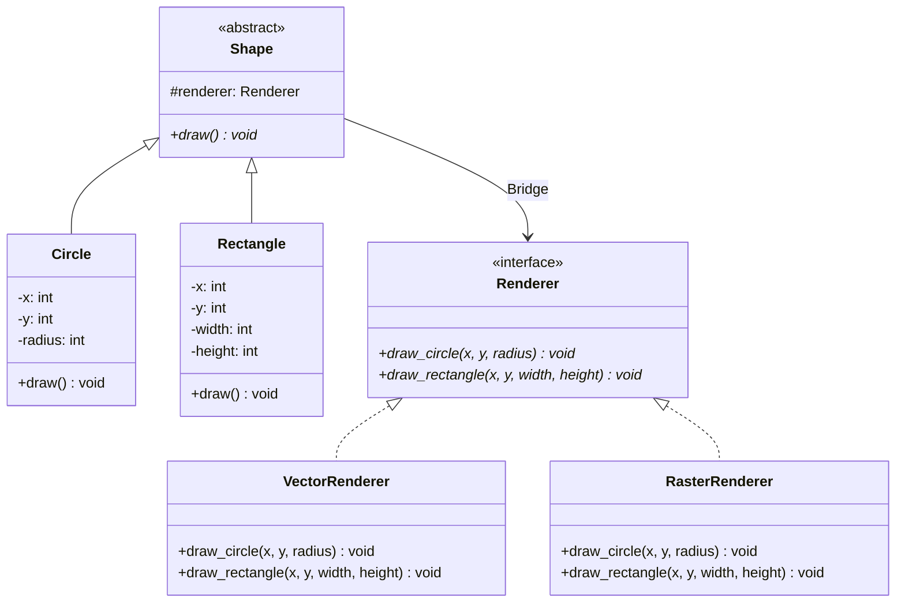

# 브리지 패턴 (Bridge Pattern)


## 1. 패턴이 없을 때 발생하는 문제점 (The Problem)

브리지 패턴을 사용하지 않고 서로 독립적으로 변화해야 하는 두 종류의 기능을 하나의 상속 계층으로 표현하면, 두 변화 축의 조합만큼 클래스가 폭증하는 문제가 발생할 수 있습니다.

예를 들어 그래픽 시스템에서 다음 두 요소가 각각 독립적으로 확장된다고 가정합니다.

* **도형 종류:** `Circle`, `Rectangle`
* **렌더링 방식:** `Vector`, `Raster`

이를 단순 상속으로 표현하면 각 조합마다 별도의 클래스가 필요합니다.

### 패턴을 적용하지 않은 예시

```python
from abc import ABC, abstractmethod


class Shape(ABC):

    @abstractmethod
    def draw(self) -> None:
        pass


class VectorCircle(Shape):

    def __init__(
        self,
        x: int,
        y: int,
        radius: int,
    ):
        self.x = x
        self.y = y
        self.radius = radius

    def draw(self) -> None:
        print(
            "[Vector] "
            f"Circle({self.x}, {self.y}, {self.radius})"
        )


class RasterCircle(Shape):

    def __init__(
        self,
        x: int,
        y: int,
        radius: int,
    ):
        self.x = x
        self.y = y
        self.radius = radius

    def draw(self) -> None:
        print(
            "[Raster] "
            f"Circle({self.x}, {self.y}, {self.radius})"
        )


class VectorRectangle(Shape):

    def draw(self) -> None:
        print("[Vector] Rectangle")


class RasterRectangle(Shape):

    def draw(self) -> None:
        print("[Raster] Rectangle")

```

현재 필요한 클래스 조합은 다음과 같습니다.

```text
Circle
  ├─ VectorCircle
  └─ RasterCircle

Rectangle
  ├─ VectorRectangle
  └─ RasterRectangle

```

여기에 새로운 도형 `Triangle`이 추가되면 `VectorTriangle`, `RasterTriangle` 두 클래스가 추가됩니다.
새로운 렌더러 `OpenGL`이 추가되면 다시 `OpenGLCircle`, `OpenGLRectangle`, `OpenGLTriangle`이 필요합니다.

즉 도형 종류가 $N$개이고 렌더링 방식이 $M$개라면 최대 다음과 같은 조합이 발생합니다.

$$N \times M$$

예를 들어 도형이 4개이고 렌더러가 3개라면 $4 \times 3 = 12$개의 조합을 상속 계층에서 클래스로 표현해야 합니다.

### 이 방식이 가진 단점

* **클래스 조합 폭증:** 서로 독립적인 두 변화 축을 하나의 상속 계층으로 표현하면 가능한 조합만큼 클래스가 증가합니다.
* **관심사의 결합:** `Circle`이라는 도형의 개념과 `Vector`라는 렌더링 방식이 `VectorCircle`이라는 하나의 클래스에 결합됩니다.
* **확장 비용 증가:** 새로운 도형을 추가하면 모든 렌더링 방식에 대응하는 클래스를 만들어야 하고, 새로운 렌더링 방식을 추가하면 모든 도형에 대응하는 클래스를 추가해야 합니다.
* **중복 코드 발생:** `VectorCircle`과 `RasterCircle`은 원의 좌표와 반지름이라는 동일한 상태를 가지면서 렌더링 코드만 달라질 수 있습니다.
* **변화 축의 독립성 상실:** 도형과 렌더링 엔진이 논리적으로는 서로 독립적인 개념임에도 하나의 상속 계층에서 함께 변화하게 됩니다.

---

## 2. 브리지 패턴으로 해결하기 (The Solution)

브리지 패턴은 "서로 독립적으로 변화해야 하는 추상화(Abstraction)와 구현(Implementation)을 별도의 계층으로 분리하고, 상속이 아닌 객체 합성으로 연결하는 방식"으로 이 문제를 해결합니다.

먼저 두 변화 축을 분리합니다.

```text
Abstraction 계층
    Shape
      ├─ Circle
      └─ Rectangle

Implementation 계층
    Renderer
      ├─ VectorRenderer
      └─ RasterRenderer

```

그리고 `Shape`가 `Renderer`를 상속하는 대신 참조하도록 구성합니다.

```text
Shape ──── has-a ────> Renderer

```

`Renderer`는 도형을 실제로 출력하기 위한 연산을 제공합니다.

```python
class Renderer(ABC):

    @abstractmethod
    def draw_circle(
        self,
        x: int,
        y: int,
        radius: int,
    ) -> None:
        pass

    @abstractmethod
    def draw_rectangle(
        self,
        x: int,
        y: int,
        width: int,
        height: int,
    ) -> None:
        pass

```

도형은 자신이 어떤 렌더러를 사용하는지만 알고 있습니다.

```python
class Shape(ABC):

    def __init__(
        self,
        renderer: Renderer,
    ):
        self._renderer = renderer

    @abstractmethod
    def draw(self) -> None:
        pass


class Circle(Shape):

    def __init__(
        self,
        renderer: Renderer,
        x: int,
        y: int,
        radius: int,
    ):
        super().__init__(renderer)
        self.x = x
        self.y = y
        self.radius = radius

    def draw(self) -> None:
        self._renderer.draw_circle(
            self.x,
            self.y,
            self.radius,
        )

```

`Vector`와 `Raster`의 차이는 `Renderer` 구현에서 처리합니다.

```python
class VectorRenderer(Renderer):

    def draw_circle(
        self,
        x: int,
        y: int,
        radius: int,
    ) -> None:
        print(
            "[Vector] "
            f"Circle({x}, {y}, {radius})"
        )


class RasterRenderer(Renderer):

    def draw_circle(
        self,
        x: int,
        y: int,
        radius: int,
    ) -> None:
        print(
            "[Raster] "
            f"Circle({x}, {y}, {radius})"
        )

```

이제 조합을 위해 별도의 클래스가 필요하지 않습니다.

```python
vector_circle = Circle(
    VectorRenderer(),
    x=10,
    y=20,
    radius=5,
)

raster_circle = Circle(
    RasterRenderer(),
    x=10,
    y=20,
    radius=5,
)

```

같은 `Circle` 클래스가 서로 다른 `Renderer` 구현과 조합됩니다.

```text
             ┌── VectorRenderer
Circle ──────┤
             └── RasterRenderer

```

마찬가지로 같은 `Renderer`를 여러 `Abstraction`이 공유할 수 있습니다.

```text
Circle ───────────┐
                  ↓
             VectorRenderer
                  ↑
Rectangle ────────┘

```

핵심은 단순히 객체 하나를 다른 객체에 주입하는 것이 아닙니다.
서로 다른 이유로 변화하는 두 클래스 계층을 독립적으로 유지하면서, 합성을 통해 두 계층의 자유로운 조합을 가능하게 만드는 것이 브리지 패턴의 본질입니다.

---

## 3. 장점, 단점 및 트레이드오프 (Trade-off)

### 장점 (Pros)

* **독립적인 확장:** Abstraction과 Implementation 계층을 서로 독립적으로 확장할 수 있습니다.
* **클래스 수 감소:** 두 변화 축의 모든 조합을 별도의 클래스로 만들 필요가 없습니다 ($N \times M \rightarrow N + M$).
* **상속보다 합성 활용:** 구현 세부사항을 상속 계층에 고정하지 않고 객체 참조를 통해 연결하므로 결합도가 낮아집니다.
* **런타임 구현 교체 가능:** 필요하다면 동일한 Abstraction에 다른 Implementation 객체를 런타임에 동적으로 주입할 수 있습니다.
* **구현 세부사항 은닉:** 클라이언트는 Renderer의 구체 구현을 직접 다루지 않고 상위 Abstraction을 통해 사용합니다.
* **SRP(단일 책임 원칙) 향상:** `Circle`은 도형의 논리적 의미를, `VectorRenderer`는 Vector 렌더링 방식을 각각 독립적으로 담당합니다.

### 단점 (Cons)

* **설계 복잡도 증가:** 단순한 클래스 계층을 Abstraction과 Implementation이라는 두 계층으로 분리하므로 초기 구조 복잡도가 올라갑니다.
* **인터페이스 설계 난이도:** Implementor 인터페이스를 너무 구체적으로 정의하면 새로운 Abstraction을 추가하기 어렵고, 지나치게 일반화하면 사용하기 복잡해질 수 있습니다.
* **간단한 문제에는 과도한 구조:** 변화 축이 하나뿐이거나 구현 종류가 변하지 않는 경우 Bridge가 불필요한 추상화 레이어가 될 수 있습니다.
* **간접 호출 증가:** Abstraction의 동작이 Implementation 객체에 다시 위임되므로 실행 흐름 추적이 한 단계 복잡해집니다.

### 트레이드오프 (Trade-off)

* **두 변화 축이 실제로 독립적일 때 유리:** 도형과 렌더링 방식, 메시지 종류와 전송 채널, UI 추상화와 플랫폼 백엔드처럼 두 축이 각자의 이유로 확장되는 구조에 적합합니다.
* **변화 축이 하나뿐이라면 Strategy가 더 적합:** 단일 Context 내에서 특정 알고리즘만 교체하려는 목적이라면 Bridge보다 Strategy 패턴이 단순하고 직관적입니다.
* **Bridge와 Adapter의 차이:** Adapter는 주로 이미 존재하는 호환되지 않는 인터페이스를 사후(Post-facto)에 연결합니다. Bridge는 시스템을 설계하는 초기에 두 변화 축을 의도적으로 분리(Up-front design)합니다.
* **Bridge와 Strategy의 차이:** Strategy는 단일 Context 내 알고리즘의 캡슐화와 교체에 초점을 두고, Bridge는 **독립적으로 진화하는 두 클래스 계층 자체를 분리**하는 데 초점을 둡니다.
* **Implementor의 추상화 수준:** Implementor에 `draw_circle` 같은 고수준 메서드를 두면 새 도형 추가 시 Implementor도 변경되어야 할 수 있습니다. 실제 시스템에서는 `draw_line`, `draw_path` 같은 저수준 연산(Primitive)으로 Implementor를 설계하는 것이 OCP 관점에서 유리합니다.

---

## 4. 파이썬 오픈소스에서 볼 수 있는 브리지와 유사한 설계

파이썬 주요 라이브러리에서도 상위 추상화와 백엔드 구현을 분리하여 각각 독립적으로 변화시키는 Bridge 및 유사 구조를 찾아볼 수 있습니다.

### Matplotlib Backend 아키텍처

Matplotlib은 상위 Plotting 영역(Frontend)과 실제 화면 출력/파일 생성 영역(Backend)을 명확히 분리합니다.

```text
High-level Figure / Artist
          │
          ↓
Backend-independent abstraction
          │
          ↓
FigureCanvas / Renderer
     ┌────┼─────┐
     ↓    ↓     ↓
    Agg   SVG   PDF

```

동일한 Plot 코드를 유지하면서 `QtAgg`, `TkAgg`, `SVG`, `PDF` 등의 렌더링 백엔드를 독립적으로 결합할 수 있으며, 이는 상위 그래픽 모델과 실제 출력 기술이라는 두 변화 축을 분리한다는 점에서 Bridge 패턴의 대표적 사례입니다.

---

### SQLAlchemy Engine / Dialect

SQLAlchemy의 `Engine`은 데이터베이스 연결 추상화와 데이터베이스별 실제 통신 구현을 분리합니다.

```text
SQLAlchemy Engine
        │
        ↓
      Dialect
   ┌────┼──────┬──────┐
   ↓    ↓      ↓      ↓
Postgres MySQL SQLite Oracle

```

상위 `Engine` API 및 쿼리 구성 로직과 실제 DBAPI별 SQL 변환 및 통신 로직(`Dialect`)이 별도의 축으로 분리되어 독립적으로 진화합니다.

---

### Python `logging.Logger` / `Handler`

Python의 `logging` 시스템에서는 `Logger`가 로그 이벤트를 생성·관리하고, 실제 I/O 처리는 결합된 `Handler` 객체에 위임합니다.

```text
Logger
  │
  └── LogRecord
        ├─ StreamHandler
        ├─ FileHandler
        ├─ SocketHandler
        └─ SMTPHandler

```

`Logger` 계층과 출력 `Handler` 계층이 독립적으로 구성 및 확장 가능하다는 점에서 Bridge와 유사한 구조를 보여줍니다.

---

## 5. 클래스 다이어그램



각 역할은 다음과 같습니다.

* **Abstraction:** `Shape`
* **Refined Abstraction:** `Circle`, `Rectangle`
* **Implementor:** `Renderer`
* **Concrete Implementor:** `VectorRenderer`, `RasterRenderer`

---

## 6. 파이썬 예제 코드

```python
from abc import ABC, abstractmethod


# -------------------------------------------------------------------
# 1. Implementor
# -------------------------------------------------------------------

class Renderer(ABC):

    @abstractmethod
    def draw_circle(
        self,
        x: int,
        y: int,
        radius: int,
    ) -> None:
        pass

    @abstractmethod
    def draw_rectangle(
        self,
        x: int,
        y: int,
        width: int,
        height: int,
    ) -> None:
        pass


# -------------------------------------------------------------------
# 2. Concrete Implementors
# -------------------------------------------------------------------

class VectorRenderer(Renderer):

    def draw_circle(
        self,
        x: int,
        y: int,
        radius: int,
    ) -> None:

        print(f'[Vector] 원의 경로를 생성합니다. center=({x}, {y}), radius={radius}')

    def draw_rectangle(
        self,
        x: int,
        y: int,
        width: int,
        height: int,
    ) -> None:

        print(f'[Vector] 사각형 경로를 생성합니다. position=({x}, {y}), size=({width}, {height})')


class RasterRenderer(Renderer):

    def draw_circle(
        self,
        x: int,
        y: int,
        radius: int,
    ) -> None:

        print(f'[Raster] 원의 픽셀을 계산합니다. center=({x}, {y}), radius={radius}')

    def draw_rectangle(
        self,
        x: int,
        y: int,
        width: int,
        height: int,
    ) -> None:

        print(f'[Raster] 사각형의 픽셀을 채웁니다. position=({x}, {y}), size=({width}, {height})')


# -------------------------------------------------------------------
# 3. Abstraction
# -------------------------------------------------------------------

class Shape(ABC):

    def __init__(
        self,
        renderer: Renderer,
    ):
        self._renderer = renderer

    @abstractmethod
    def draw(self) -> None:
        pass


# -------------------------------------------------------------------
# 4. Refined Abstractions
# -------------------------------------------------------------------

class Circle(Shape):

    def __init__(
        self,
        renderer: Renderer,
        x: int,
        y: int,
        radius: int,
    ):
        super().__init__(renderer)

        self.x = x
        self.y = y
        self.radius = radius

    def draw(self) -> None:

        self._renderer.draw_circle(x=self.x, y=self.y, radius=self.radius)


class Rectangle(Shape):

    def __init__(
        self,
        renderer: Renderer,
        x: int,
        y: int,
        width: int,
        height: int,
    ):
        super().__init__(renderer)

        self.x = x
        self.y = y
        self.width = width
        self.height = height

    def draw(self) -> None:

        self._renderer.draw_rectangle(
            x=self.x,
            y=self.y,
            width=self.width,
            height=self.height,
        )


# -------------------------------------------------------------------
# 5. 실행 (Usage)
# -------------------------------------------------------------------

if __name__ == "__main__":

    vector = VectorRenderer()
    raster = RasterRenderer()

    shapes: list[Shape] = [
        Circle(renderer=vector, x=10, y=20, radius=5),
        Circle(renderer=raster, x=30, y=40, radius=10),
        Rectangle(renderer=vector, x=0, y=0, width=100, height=50),
        Rectangle(renderer=raster, x=50, y=50, width=80, height=40),
    ]

    for shape in shapes:
        shape.draw()

```

**실행 결과:**

```text
[Vector] 원의 경로를 생성합니다. center=(10, 20), radius=5
[Raster] 원의 픽셀을 계산합니다. center=(30, 40), radius=10
[Vector] 사각형 경로를 생성합니다. position=(0, 0), size=(100, 50)
[Raster] 사각형의 픽셀을 채웁니다. position=(50, 50), size=(80, 40)
```

---

## 부록 (Appendix): 현대적 타입 시스템과 함수형 관점의 재해석

브리지 패턴을 현대 타입 시스템과 함수형 프로그래밍 관점에서 재해석하면, Bridge가 해결하려는 문제는 단순히 "상속 대신 객체를 하나 주입하는 것"보다 더 일반적인 형태로 볼 수 있습니다.

핵심 질문은 "두 개의 독립적인 변화 차원(Dimensions of Variance)을 타입 구조에서 어떻게 분리하면서, 필요한 시점에 안전하게 조합할 것인가?"입니다.

---

### 부록을 읽는 순서와 전제

> **표기 안내:** 아래의 `data`, `trait`, `exists`, `>>`는 개념 설명용 가상 문법이며 실제 Python 문법이 아닙니다. Python에서의 구현은 본문의 합성과 추상 클래스 예제를 기준으로 읽습니다.

먼저 1~3절에서 “도형과 출력기를 따로 선택한다”는 기존 문제를 값과 타입으로 옮겨 봅니다. 4~6절은 도형 종류가 정해져 있고, 출력 전 명령을 검사하거나 재사용하려는 경우의 확장입니다. 실존 타입은 구체 구현의 이름을 숨기는 방법이고, IR은 출력할 작업을 데이터로 기록하는 방법입니다. 둘은 서로 다른 문제를 해결합니다.

---

### 1. 두 변화 축을 타입의 곱(Product)으로 바라보기

상속 방식은 조합을 명목상 타입으로 고정합니다 ($Circle \times Vector$).
반면 Bridge는 두 축을 분리하여 선언하고 실행 시점에 곱(Product) 형태로 결합합니다.

```python
data Shape =
    Circle(CircleData)
  | Rectangle(RectangleData)

data Renderer =
    Vector
  | Raster

record Drawing:
    shape: Shape
    renderer: Renderer

```

조합마다 클래스를 만드는 선언적 복잡성 대신, 독립된 두 차원의 값을 합성하는 구조로 변환됩니다.

---

### 2. 구현 축을 제네릭 타입 매개변수로 표현하기

Renderer의 구체 타입을 타입 매개변수로 표현하면 도형과 구현체의 조합을 타입 검사기에 전달할 수 있습니다. 이것만으로 런타임 객체나 간접 호출이 없어지는 것은 아닙니다.

```python
trait Renderer[R]:

    def circle(
        renderer: R,
        x: Int,
        y: Int,
        radius: Int,
    ) -> Unit


immutable record Circle[R]
where Renderer[R]:

    renderer: R
    x: Int
    y: Int
    radius: Int

```

이 경우 `Circle[VectorRenderer]` 및 `Circle[RasterRenderer]`와 같이 별도의 클래스 작성 없이 매개변수화된 단일 타입 생성자 `Circle[R]`로 해결할 수 있습니다.

---

### 3. 정적 Bridge와 동적 Bridge 구분하기

제네릭은 구현체의 타입을 매개변수로 표현하는 수단입니다. **구현 호출을 정적으로 결정하는지는 언어와 컴파일 방식에 달려 있습니다.** 예를 들어 Rust는 구체 타입별 코드를 생성하는 단형화(Monomorphization)를 사용하지만, Python의 제네릭 타입 힌트가 같은 최적화를 수행하는 것은 아닙니다.

실행 중 선택한 서로 다른 Renderer를 공통 타입으로 보관하려면 런타임 다형성을 사용할 수 있습니다. 아래의 실존 타입(Existential Type)은 “구체 타입 이름은 숨기되 Renderer 계약을 충족한다는 사실은 보관한다”는 의미입니다. 구체 타입을 활용하는 최적화와 런타임 선택의 유연성 사이에는 비용 차이가 있을 수 있습니다.

```python
type AnyRenderer =
    exists R.
        Renderer[R] => R


def select_renderer(
    mode: RenderMode,
) -> AnyRenderer:

    match mode:

        case VectorMode:
            return VectorRenderer()

        case RasterMode:
            return RasterRenderer()

```

---

### 4. Abstraction 축이 닫혀 있다면 ADT로 표현하기

도형의 종류가 미리 알려진 닫힌 집합(Closed set)이라면 상속 계층 대신 대수적 데이터 타입(ADT / Sum Type)을 사용할 수 있습니다.

```python
data Shape =
    Circle(x: Int, y: Int, radius: Int)
  | Rectangle(x: Int, y: Int, width: Int, height: Int)


def draw[R](
    shape: Shape,
    renderer: R,
) -> Unit
where Renderer[R]:

    match shape:

        case Circle(x, y, radius):
            Renderer.circle(
                renderer,
                x,
                y,
                radius,
            )

        case Rectangle(x, y, width, height):
            ...

```

---

### 5. Renderer를 객체가 아닌 Algebra와 Interpreter로 바라보기

함수형 관점에서는 Renderer를 연산의 집합(Algebra)으로 정의하고, 도형은 이 연산을 소비하여 자신의 구조를 표현합니다.

```python
trait DrawingAlgebra[R]:

    def line(
        start: Point,
        end: Point,
    ) -> R

    def circle(
        center: Point,
        radius: Int,
    ) -> R

    def combine(
        a: R,
        b: R,
    ) -> R

```

도형은 구체적인 출력이 아닌 추상 연산(Algebra)만을 사용하여 로직을 기술하며, 실제 그리기 동작은 이를 다르게 해석하는 **Interpreter**(SVG Interpreter, Raster Interpreter 등)가 수행합니다.

---

### 6. 프로그램과 Intermediate Representation (IR)의 분리

더 나아가 그래픽 연산 자체를 중간 표현(IR / Command ADT) 데이터로 기술할 수 있습니다.

```text
Shape  ──(describe)──>  DrawCommand (IR)  ──(render)──>  [ SVG / Raster / GPU ]

```

```python
data DrawCommand =
    Line(start: Point, end: Point)
  | Circle(center: Point, radius: Int)


def describe(
    shape: Shape,
) -> Vector[DrawCommand]:
    ...


def render_svg(
    commands: Vector[DrawCommand],
) -> SVG:
    ...

```

중간 표현을 두면 도형을 명령으로 바꾸는 단계와 명령을 출력하는 단계를 따로 검증할 수 있습니다. 예를 들어 `describe(circle)`이 원 명령을 만드는지 먼저 검사하고, 같은 명령을 SVG와 Raster 구현에 전달할 수 있습니다.

다만 두 단계는 여전히 IR의 연산과 의미에 의존합니다. 새 명령을 추가하면 이를 처리하는 백엔드도 수정해야 하며, 명령 목록을 보관하는 메모리 비용도 생깁니다.

---

### 7. 구현 능력 차이를 Capability Type Class로 표현하기

모든 Renderer가 모든 기능을 지원하기 어려울 때는 거대한 단일 인터페이스 대신 기능 단위의 **Capability**로 분리합니다.

```python
trait BasicRenderer[R]:

    def line(...)
    def circle(...)


trait BezierRenderer[R]:

    def bezier(...)


def draw_curve[R](
    curve: BezierCurve,
    renderer: R,
) -> Unit
where
    BasicRenderer[R]
    + BezierRenderer[R]:
    ...

```

Abstraction은 요구하는 최소한의 Capability만 타입 제약으로 선언하므로 Implementor 인터페이스의 비대화를 방지합니다.

---

### 8. Bridge를 함수 합성으로 표현하기

가장 단순한 형태의 Bridge는 두 변환 함수의 합성($\circ$) 문제로 축소됩니다.

```python
draw_svg =
    describe >> render_svg
draw_png =
    describe >> render_png

```

```text
                ┌─ render_svg
describe ───────┼─ render_png
                └─ render_terminal

```

객체 간 참조 대신 변환 함수를 연결합니다. `describe`와 SVG 문자열 생성은 순수 함수로 작성할 수 있지만, 파일 저장이나 화면 출력까지 수행하는 Renderer는 부수효과를 가집니다. 함수로 표현했다는 이유만으로 계산이 순수해지지는 않습니다.

---

### 요약 및 비교

| 관점 | 브리지 패턴 (OOP 아키텍처) | 현대 타입 시스템 + 함수형 관점 |
| --- | --- | --- |
| **핵심 문제** | 두 독립적인 클래스 계층의 결합 | 두 독립적인 변화 차원의 조합 |
| **Abstraction 표현** | 추상 클래스 계층 | ADT / Generic Type / 함수 |
| **Implementation 표현** | Implementor 인터페이스 | Type Class / Algebra / Interpreter |
| **두 축 연결 방식** | 객체 합성 (`has-a`) | 타입 매개변수 / 함수 합성 |
| **조합 클래스 문제** | $N \times M$ 클래스 방지 | 타입의 곱($A \times B$)을 직접 합성 |
| **정적 구현 선택** | 호출 방식은 언어 구현에 의존 | 단형화 등 정적 디스패치를 지원하는 구현에서 가능 |
| **동적 구현 선택** | 런타임 다형성 (Dynamic Dispatch) | Existential Type / Dynamic Dispatch |
| **닫힌 Abstraction** | 클래스 계층 | ADT + Pattern Matching |
| **구현 능력 차이** | 역할별 Implementor 인터페이스로 분리 가능 | Capability Type Class로 요구 기능 명시 |
| **중간 표현** | 객체 메서드 직접 호출 | Command ADT / Intermediate Representation (IR) |
| **구현 해석** | Concrete Implementor | Interpreter |
| **부수효과 차이** | 구현 내부에 암묵적 존재 | Effect Polymorphism |

---

### 결론

브리지는 독립적으로 바뀌는 기능과 구현을 합성으로 연결합니다. 두 축이 실제로 독립적인지, 공통 계약이 각 구현의 능력을 표현하는지가 판단 기준입니다. 제네릭과 IR은 선택적인 표현이며, 런타임 선택·최적화·변경 비용을 고려해 필요한 수준만 도입합니다.
