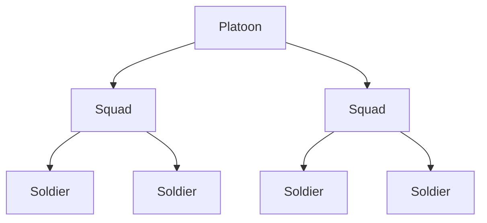
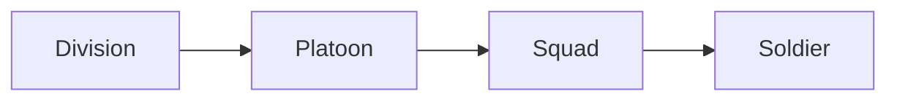
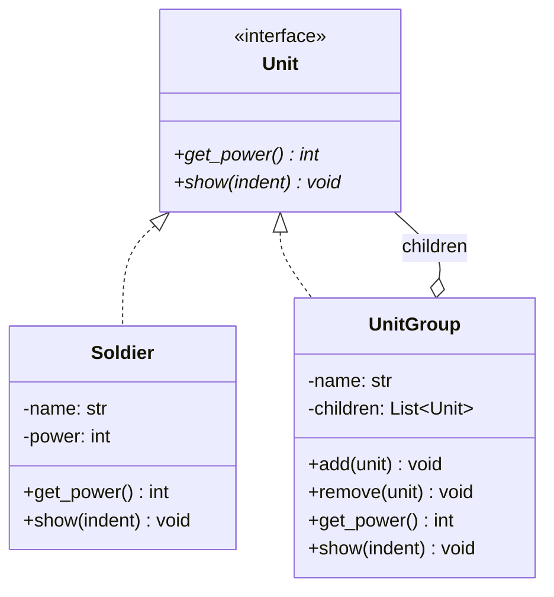

# 컴포지트 패턴 (Composite Pattern)


## 1. 패턴이 없을 때 발생하는 문제점 (The Problem)

컴포지트 패턴을 사용하지 않고 단일 객체와 객체 집합을 서로 다른 타입 및 인터페이스로 다루면, 계층 구조를 사용하는 클라이언트 코드가 객체 종류에 따라 조건문으로 분기해야 하는 문제가 발생합니다.

예를 들어 게임에서 전투력을 계산하는 시스템을 작성한다고 가정합니다.
하나의 `Soldier`가 존재하고, 여러 `Soldier`를 묶은 `Squad`, 그리고 여러 `Squad`를 묶은 `Platoon`이 존재합니다.

### 패턴을 적용하지 않은 예시

```python
class Soldier:

    def __init__(
        self,
        name: str,
        power: int,
    ):
        self.name = name
        self.power = power


class Squad:

    def __init__(
        self,
        name: str,
        soldiers: list[Soldier],
    ):
        self.name = name
        self.soldiers = soldiers


class Platoon:

    def __init__(
        self,
        name: str,
        squads: list[Squad],
    ):
        self.name = name
        self.squads = squads

```

각 객체의 전투력을 계산하려면 타입별 처리가 필요합니다.

```python
def calculate_power(
    unit: Soldier | Squad | Platoon,
) -> int:

    if isinstance(unit, Soldier):
        return unit.power

    elif isinstance(unit, Squad):
        return sum(
            soldier.power
            for soldier in unit.soldiers
        )

    elif isinstance(unit, Platoon):
        return sum(
            soldier.power
            for squad in unit.squads
            for soldier in squad.soldiers
        )

    raise TypeError("알 수 없는 부대 타입입니다.")

```

현재 부대 계층 구조는 다음과 같습니다.



문제는 계층 구조가 확장될수록 클라이언트가 전체 트리 구조를 파악하고 탐색해야 한다는 점입니다.
예를 들어 `Division`이 새롭게 추가되는 상황을 고려해 봅니다.

```python
class Division:

    def __init__(
        self,
        platoons: list[Platoon],
    ):
        self.platoons = platoons

```

이 경우 기존 계산 함수에도 새로운 조건 분기를 추가해야 합니다.

```python
if isinstance(unit, Division):

    return sum(
        soldier.power
        for platoon in unit.platoons
        for squad in platoon.squads
        for soldier in squad.soldiers
    )

```

계층 단계가 늘어날수록 클라이언트는 다음 구조를 직접 순회하고 탐색해야 합니다.



전투력 외에도 인원수, 유지 비용, 이동 속도 등의 연산이 추가될 때마다 유사한 재귀 탐색 코드가 반복해서 작성됩니다.

### 이 방식이 가진 단점

* **단일 객체와 집합 객체의 인터페이스 불일치**: `Soldier`, `Squad`, `Platoon`을 각각 서로 다른 방식으로 다뤄야 합니다.
* **타입 분기 증가**: 클라이언트가 `isinstance()`나 조건문을 통해 실제 객체 종류를 직접 구별해야 합니다.
* **계층 구조와의 강한 결합**: 클라이언트가 `Platoon` $\rightarrow$ `Squad` $\rightarrow$ `Soldier`로 이어지는 내부 트리 구조를 상세히 알고 있어야 합니다.
* **확장 시 기존 코드 수정**: 새로운 컨테이너 타입이 추가될 때마다 기존의 탐색/집계 로직을 수정해야 합니다.
* **트리 순회 코드의 중복**: 합계 계산, 출력, 검증 등 여러 기능에서 동일한 트리 탐색 로직이 반복됩니다.

---

## 2. 컴포지트 패턴으로 해결하기 (The Solution)

컴포지트 패턴은 "단일 객체(Leaf)와 객체 집합(Composite)이 동일한 Component 인터페이스를 구현하도록 하여, 클라이언트가 둘을 구분 없이 동일한 방식으로 다룰 수 있게 만드는 디자인 패턴"입니다.

먼저 공통 인터페이스를 정의합니다.

```python
class Unit(ABC):

    @abstractmethod
    def get_power(self) -> int:
        pass

```

단일 병사는 `Leaf` 역할을 수행합니다.

```python
class Soldier(Unit):

    def __init__(
        self,
        name: str,
        power: int,
    ):
        self.name = name
        self.power = power

    def get_power(self) -> int:
        return self.power

```

여러 `Unit`을 포함하는 `Composite` 객체도 동일한 인터페이스를 구현합니다.

```python
class UnitGroup(Unit):

    def __init__(
        self,
        name: str,
    ):
        self.name = name
        self._children: list[Unit] = []

    def add(
        self,
        unit: Unit,
    ) -> None:
        self._children.append(unit)

    def get_power(self) -> int:
        return sum(
            child.get_power()
            for child in self._children
        )

```

여기서 핵심은 `UnitGroup`이 보유한 자식 요소의 타입 역시 `Unit`이라는 점입니다.
따라서 자식은 `Soldier`일 수도 있고:

```text
UnitGroup
    ├─ Soldier
    └─ Soldier

```

또 다른 `UnitGroup`일 수도 있습니다.

```text
UnitGroup
    │
    ├─ Soldier
    │
    └─ UnitGroup
          ├─ Soldier
          └─ UnitGroup
                └─ Soldier

```

이 구조에서는 트리의 깊이에 제한이 없습니다.
클라이언트는 객체가 `Leaf`인지 `Composite`인지 구별하지 않고 연산을 호출합니다.

```python
def show_power(
    unit: Unit,
) -> None:

    print(
        f"총 전투력: {unit.get_power()}"
    )

```

다음 객체들을 모두 동일한 방식으로 전달할 수 있습니다.

```python
show_power(soldier)
show_power(squad)
show_power(platoon)
show_power(division)

```

호출하는 입장에서는 이들이 모두 단순한 `Unit`으로 보입니다.

```text
Client
   │
   ↓
 Unit
   │
   ├─ Soldier
   │
   └─ UnitGroup
          │
          ├─ Soldier
          └─ UnitGroup
                 │
                 └─ ...

```

컴포지트 패턴의 본질은 단순히 트리 자료구조를 구축하는 데 있지 않습니다. `Leaf`와 `Composite`가 같은 추상 인터페이스를 공유하여, **단일 객체와 객체의 재귀적 집합을 클라이언트가 같은 계약으로 다루게 하는 것**이 패턴의 핵심입니다.

---

## 3. 장점, 단점 및 트레이드오프 (Trade-off)

### 장점 (Pros)

* **단일 객체와 집합의 일관된 처리**: 클라이언트는 `Leaf`와 `Composite`를 구별하지 않고 동일한 Component 인터페이스로 접근할 수 있습니다.
* **재귀적 구조 표현**: `Composite` 자신도 Component 인터페이스를 따르므로, 트리를 재귀적으로 자유롭게 구성할 수 있습니다.
* **클라이언트 코드의 단순화**: 클라이언트가 트리의 내부 구조나 깊이를 직접 탐색할 필요가 없습니다.
* **새로운 Leaf 확장의 용이성**: 공통 Component를 구현하는 새로운 `Leaf` 타입을 추가하더라도 기존 `Composite` 및 클라이언트 코드를 수정할 필요가 없습니다.
* **전체와 부분의 동일 취급**: 트리 전체, 특정 서브트리, 단일 노드에 대해 동일한 연산을 일관되게 적용할 수 있습니다.
* **재귀적 집계에 최적화**: 총 가격, 파일 크기, 인원수, 전투력처럼 자식 노드의 결과를 재귀적으로 합산하는 연산을 자연스럽게 구현할 수 있습니다.

### 단점 (Cons)

* **지나친 일반화의 위험**: 모든 객체를 동일한 Component로 추상화하는 과정에서 `Leaf`와 `Composite`가 가진 고유 기능의 차이가 희석될 수 있습니다.
* **트리 제약 검증의 어려움**: 특정 `Composite`에 특정 종류의 자식 노드만 허용해야 하는 경우, 컴파일 타임이 아닌 런타임에 별도의 검증 로직을 추가해야 합니다.
* **순환 참조 위험**: 가변 객체 구조에서는 잘못된 `add()` 호출로 부모 노드가 자신의 조상이나 자기 자신을 자식으로 추가할 경우 순환 그래프가 형성될 수 있습니다.
* **재귀 호출 비용**: 트리의 깊이가 매우 깊을 경우 재귀 호출에 따른 스택 오버플로우나 탐색 오버헤드가 발생할 수 있습니다.
* **공통 인터페이스 설계의 어려움**: `Leaf`와 `Composite` 모두에게 유의미한 공통 연산을 추출하기 힘든 경우, Component 인터페이스가 지나치게 추상적이거나 어색해질 수 있습니다.

### 트레이드오프 (Trade-off)

* **트리 구조가 핵심 도메인일수록 유리**: 파일 시스템, UI 컴포넌트 트리, 조직도, 문서 구조, 메뉴, AST처럼 "부분-전체" 관계가 본질인 도메인에 매우 적합합니다.
* **단순한 1차원 리스트 구조라면 오버헤드**: 계층 구조가 한 단계뿐이고 재귀적 구성이 필요 없다면, 일반적인 컬렉션을 사용하는 것이 훨씬 단순하고 효율적입니다.
* **Leaf와 Composite의 역할 차이가 클수록 추상화가 난해함**: 두 타입이 공유할 수 있는 연산이 거의 없다면 동일한 인터페이스로 묶는 것이 도리어 부자연스러울 수 있습니다.
* **Composite와 Decorator의 차이**: 두 패턴 모두 내부에 Component를 포함하지만, Decorator는 단일 Component를 감싸 기능을 확장하는 반면 Composite는 여러 Component를 자식으로 보유하여 "부분-전체" 계층을 형성합니다.
* **Composite와 Iterator의 관계**: Composite가 계층적 데이터 구조 자체를 표현한다면, Iterator는 해당 구조를 순회하는 탐색 메커니즘을 분리하는 데 사용됩니다.
* **Composite와 Visitor의 관계**: Composite에 새로운 연산이 자주 추가되는 구조라면 각 Component를 직접 수정하기보다 Visitor 패턴을 도입하여 트리 구조와 연산 로직을 분리하는 것이 좋습니다.

### Transparent Composite vs Safe Composite

Composite 패턴을 설계할 때는 크게 두 가지 접근 방식을 사용합니다.

#### 1. Transparent Composite (투명한 방식)

`add()`와 `remove()` 같은 자식 관리 메서드를 Component 인터페이스에 직접 포함합니다.

```python
class Unit(ABC):

    @abstractmethod
    def get_power(self) -> int:
        pass

    @abstractmethod
    def add(self, unit: "Unit") -> None:
        pass

```

* **장점**: 클라이언트는 모든 Component를 같은 인터페이스로 다룰 수 있습니다.
* **단점**: 자식을 가질 수 없는 `Leaf` 노드에도 `add()` 메서드가 노출됩니다.

```python
soldier.add(other_soldier)  # 런타임 예외 발생 필요

```

따라서 다음과 같이 예외를 발생시키는 처리가 수반됩니다.

```python
def add(
    self,
    unit: Unit,
) -> None:

    raise TypeError(
        "Leaf에는 자식을 추가할 수 없습니다."
    )

```

결과적으로 **인터페이스 일관성은 높아지지만 타입 안전성은 낮아집니다.**

#### 2. Safe Composite (안전한 방식)

`add()`와 `remove()` 메서드를 Composite 클래스(`UnitGroup`)에만 정의합니다.

```python
class Unit(ABC):

    @abstractmethod
    def get_power(self) -> int:
        pass


class UnitGroup(Unit):

    def add(
        self,
        unit: Unit,
    ) -> None:
        ...

```

* **장점**: `soldier.add(...)`와 같은 잘못된 코드 작성을 정적 타입 단계에서 차단할 수 있으며, 타입의 실제 역할을 정확히 표현합니다.
* **단점**: 클라이언트가 자식 노드를 추가하려면 해당 객체가 Composite 타입인지 직접 확인해야 하므로 인터페이스의 투명성이 떨어집니다.

| 방식 | 장점 | 단점 |
| --- | --- | --- |
| **Transparent Composite** | Leaf와 Composite의 인터페이스가 완전히 동일함 | Leaf에 불필요하거나 의미 없는 연산이 노출됨 |
| **Safe Composite** | 타입의 실제 역할과 안전성을 정확하게 표현함 | 트리를 변경할 때 Leaf와 Composite를 구분해야 함 |

---

## 4. 파이썬 오픈소스에서 볼 수 있는 컴포지트와 유사한 설계

파이썬 표준 라이브러리와 주요 오픈소스 프로젝트에서도 동일한 노드가 다른 노드를 재귀적으로 포함하며, 부분 트리와 전체 트리를 동일한 인터페이스로 탐색하는 구조를 쉽게 찾을 수 있습니다.

> **Note**: 아래 사례들이 GoF Composite 패턴을 엄격하게 구현한 것은 아니지만, **"재귀적인 부분-전체 구조"** 및 **"균일한 노드 처리"**라는 컴포지트 패턴의 핵심 사상을 충실히 활용한 대표적 예시입니다.

### 1. `xml.etree.ElementTree`

XML은 본질적으로 계층적인 데이터 구조이며, 파이썬의 `xml.etree.ElementTree`는 이를 트리 형태로 모델링합니다.

파이썬 공식 문서에 따르면 `ElementTree`는 전체 XML 문서를 트리로 표현하며, `Element`는 트리의 개별 노드를 나타냅니다. `Element`는 또 다른 `Element` 객체들을 자식으로 포함할 수 있고, `iter()` 메서드는 현재 `Element`를 루트로 하여 자신과 하위 모든 `Element`를 일관되게 순회합니다.

```python
import xml.etree.ElementTree as ET

root = ET.Element("army")

squad = ET.SubElement(
    root,
    "squad",
)

ET.SubElement(
    squad,
    "soldier",
)

ET.SubElement(
    squad,
    "soldier",
)

```

구조는 다음과 같습니다.

```text
Element("army")
    │
    └─ Element("squad")
           │
           ├─ Element("soldier")
           └─ Element("soldier")

```

모든 노드가 동일한 `Element` 타입으로 다루어지고 자식을 재귀적으로 포함할 수 있다는 점에서 Composite 구조와 매우 유사합니다.

### 2. `ast` (Abstract Syntax Tree)

파이썬의 `ast` 모듈은 파이썬 소스 코드를 추상 구문 트리(AST) 객체 구조로 표현합니다.

모든 AST 노드는 `ast.AST`를 최상위 기반 클래스로 두며, 각 구체 노드는 `_fields` 속성에 자식 노드들을 보관합니다. 예를 들어 `ast.BinOp` 노드는 `left`와 `right` 필드에 다시 `ast.expr` 타입의 자식 노드를 포함합니다.

예를 들어 다음 코드는:

```python
a + b * c

```

개념적으로 아래와 같은 트리 구조로 변환됩니다.

```text
BinOp(+)
  │
  ├─ Name(a)
  │
  └─ BinOp(*)
       │
       ├─ Name(b)
       └─ Name(c)

```

Leaf역할을 하는 `Name` 노드와 하위 노드를 집합으로 갖는 `BinOp` 노드가 하나의 AST 계층 구조 내에서 재귀적으로 결합하는 컴포지트 형태를 띱니다.

### 3. `email.message.EmailMessage`

`EmailMessage` 클래스는 단순 텍스트 메시지뿐만 아니라, 내부에 다른 `EmailMessage` 객체들을 서브 파트로 포함하는 Multipart 메시지를 표현할 수 있습니다.

공식 문서 설명에 따르면, 메시지의 페이로드(Payload)는 단순 문자열/바이트일 수도 있고, 독립된 헤더와 페이로드를 갖는 서브 메시지들의 시퀀스일 수도 있습니다. 또한 `walk()` 메서드를 사용하면 깊이 우선 탐색(DFS) 방식으로 메시지 트리의 모든 파트와 서브 파트를 일관되게 순회할 수 있습니다.

```text
EmailMessage
    │
    ├─ EmailMessage(text/plain)
    │
    └─ EmailMessage(multipart/alternative)
          │
          ├─ EmailMessage(text/plain)
          └─ EmailMessage(text/html)

```

최상위 메시지나 내부 서브 메시지가 모두 동일한 `EmailMessage` 클래스 인스턴스로 표현되고 재귀적으로 중첩된다는 점에서 Composite 패턴의 특성을 강하게 보여줍니다.

---

## 5. 클래스 다이어그램



### 각 역할 설명

* **Component (`Unit`)**: 모든 요소의 공통 추상 인터페이스입니다.
* **Leaf (`Soldier`)**: 자식 노드가 없는 단일 객체입니다.
* **Composite (`UnitGroup`)**: 자식 `Unit` 요소들을 관리하고 연산을 재귀적으로 위임하는 집합 객체입니다.
* **Client**: `Unit` 인터페이스를 통해 객체 트리를 다루는 외부 코드입니다.

핵심적인 재귀 포함 관계는 다음과 같이 나타납니다.

```text
UnitGroup ── contains ──> Unit
                           │
                           ├─ Soldier
                           │
                           └─ UnitGroup

```

`Composite` 자신도 `Component` 인터페이스를 구현하므로 트리가 재귀적으로 형성될 수 있습니다.

---

## 6. 파이썬 예제 코드

```python
from abc import ABC, abstractmethod

# -------------------------------------------------------------------
# 1. Component
# -------------------------------------------------------------------

class Unit(ABC):
    @abstractmethod
    def get_power(self) -> int:
        pass

    @abstractmethod
    def show(self, indent: int = 0) -> None:
        pass

# -------------------------------------------------------------------
# 2. Leaf
# -------------------------------------------------------------------

class Soldier(Unit):
    def __init__(self, name: str, power: int):
        self.name = name
        self.power = power

    def get_power(self) -> int:
        return self.power

    def show(self, indent: int = 0) -> None:
        prefix = " " * indent
        print(f'{prefix}- Soldier: {self.name} (전투력: {self.power})')

# -------------------------------------------------------------------
# 3. Composite
# -------------------------------------------------------------------

class UnitGroup(Unit):
    def __init__(self, name: str):
        self.name = name
        self._children: list[Unit] = []

    def add(self, unit: Unit) -> None:
        self._children.append(unit)

    def remove(self, unit: Unit) -> None:
        self._children.remove(unit)

    def get_power(self) -> int:
        return sum((child.get_power() for child in self._children))

    def show(self, indent: int = 0) -> None:
        prefix = " " * indent
        print(f'{prefix}+ {self.name} (총 전투력: {self.get_power()})')
        for child in self._children:
            child.show(indent + 4)

# -------------------------------------------------------------------
# 4. 클라이언트
# -------------------------------------------------------------------

def print_unit_info(unit: Unit) -> None:
    unit.show()
    print(f"\n총 전투력: " f"{unit.get_power()}")

# -------------------------------------------------------------------
# 5. 실행 (Usage)
# -------------------------------------------------------------------

if __name__ == "__main__":
    # Leaf 생성
    aragorn = Soldier(name='아라곤', power=100)
    legolas = Soldier(name='레골라스', power=90)
    gimli = Soldier(name='김리', power=95)
    boromir = Soldier(name='보로미르', power=85)
    # Composite 생성
    fellowship = UnitGroup('반지원정대')
    fellowship.add(aragorn)
    fellowship.add(legolas)
    fellowship.add(gimli)
    # 또 다른 Composite 생성
    gondor = UnitGroup('곤도르 부대')
    gondor.add(boromir)
    # Composite 내부에 Composite 추가
    allied_forces = UnitGroup('연합군')
    allied_forces.add(fellowship)
    allied_forces.add(gondor)
    print_unit_info(allied_forces)
```

### 실행 결과

```text
+ 연합군 (총 전투력: 370)
    + 반지원정대 (총 전투력: 285)
        - Soldier: 아라곤 (전투력: 100)
        - Soldier: 레골라스 (전투력: 90)
        - Soldier: 김리 (전투력: 95)
    + 곤도르 부대 (총 전투력: 85)
        - Soldier: 보로미르 (전투력: 85)

총 전투력: 370

```

클라이언트는 전달받는 대상의 구체적 구조와 관계없이 아래 객체들을 완전히 동일한 인터페이스로 처리합니다.

```python
print_unit_info(aragorn)        # Leaf 단일 객체
print_unit_info(fellowship)     # Composite 단일 계층
print_unit_info(allied_forces)  # Composite 중첩 계층

```

1. **`aragorn`**: 단일 `Soldier` (`Leaf`)
2. **`fellowship`**: `Soldier`들을 자식으로 가지는 `UnitGroup` (`Composite`)
3. **`allied_forces`**: `UnitGroup`을 자식으로 포함하는 최상위 `UnitGroup` (`Composite`의 중첩)

```text
UnitGroup (allied_forces)
    │
    ├─ UnitGroup (fellowship)
    │    ├─ Soldier (aragorn)
    │    ├─ Soldier (legolas)
    │    └─ Soldier (gimli)
    │
    └─ UnitGroup (gondor)
         └─ Soldier (boromir)

```

어떤 구조이든 클라이언트는 단지 다음 메서드를 호출할 뿐입니다.

```python
unit.get_power()
unit.show()

```

이것이 컴포지트 패턴이 제공하는 "부분과 전체의 일관된 처리"입니다.

---

## 부록 (Appendix): 현대적 타입 시스템과 함수형 관점의 재해석

컴포지트 패턴을 현대적 타입 시스템과 함수형 프로그래밍(FP) 관점에서 재해석해 보면, Composite 구조는 객체지향의 특수한 패턴이라기보다 재귀적 데이터 타입(Recursive Data Type)이라는 보편적인 개념에 가깝습니다.

고전적인 Composite 패턴은 다음과 같은 구성을 가집니다.

```text
Component
    │
    ├─ Leaf
    │
    └─ Composite ──> Component*

```

`Composite`가 `Component`를 재귀적으로 포함하는 구조를 수학식으로 단순화하면 다음과 같습니다.

$$\text{Component} = \text{Leaf} \;\vert\; \text{Composite}(\text{Component}, \text{Component}, \dots)$$

즉, 컴포지트 패턴의 객체 그래프는 재귀적 합 타입(Recursive Sum Type)을 객체지향 클래스 계층으로 표현한 형태입니다.

> **Note**: 이하 부록에서는 이해를 돕기 위해 대수적 데이터 타입(ADT), 패턴 매칭, 고차 함수, 재귀 스킴(Recursion Scheme), 타입클래스, 영속적 자료구조, 효과 타입 등을 지원하는 **가상의 파이썬 확장 문법**으로 코드를 작성했습니다. (실제 실행 가능한 파이썬 코드가 아닙니다.)

---

### 부록을 읽는 순서와 전제

전투력 계산에서 먼저 확인할 것은 두 가지입니다. 병사는 자신의 전투력을 반환하고, 부대는 자식 결과를 더합니다. 1~4절은 이 계산을 데이터 정의와 공통 순회 함수로 분리합니다. 그 뒤 5~7절에서 결과 결합과 불변 갱신을 다루고, 효과 결합과 `Fix[F]`가 나오는 10~11절은 선택적으로 읽어도 됩니다.

ADT는 가능한 노드 종류를 나열한 타입이며, Fold는 자식의 계산 결과를 부모에서 결합하는 순회입니다. `Fix[F]`는 그 재귀 구조를 한 단계의 모양과 반복으로 분리하는 추가 추상화입니다. 같은 형태의 순회가 여러 번 반복될 때 도입 이점이 있으며, 작은 트리 하나에는 직접 재귀가 더 읽기 쉬울 수 있습니다.

---

### 1. Leaf와 Composite를 재귀적 ADT로 표현하기

객체지향에서의 `Soldier`와 `UnitGroup` 타입을 하나의 재귀적 ADT로 정의할 수 있습니다.

```text
data Unit =

    Soldier(
        name: str,
        power: Int,
    )

  | Group(
        name: str,
        children: Vector[Unit],
    )

```

`Group`의 자식 타입이 다시 자기 자신인 `Unit`으로 정의되어 있습니다.

```text
Unit
  │
  ├─ Soldier
  │
  └─ Group
        │
        └─ Vector[Unit] ──> ...

```

이 타입을 사용하면 데이터 구조를 단 하나의 표현식으로 직접 구성할 수 있습니다.

```python
army = Group(
    name="연합군",
    children=[
        Group(
            name="반지원정대",
            children=[
                Soldier(
                    "아라곤",
                    100,
                ),
                Soldier(
                    "레골라스",
                    90,
                ),
            ],
        ),
        Soldier(
            "보로미르",
            85,
        ),
    ],
)

```

객체지향에서의 `Component 인터페이스 + Leaf 서브클래스 + Composite 서브클래스` 조합이 하나의 **Recursive ADT**로 깔끔하게 통합됩니다.

---

### 2. 공통 인터페이스 대신 패턴 매칭으로 연산 정의하기

객체지향 Composite에서는 각 클래스가 인스턴스 메서드로 동일한 연산을 구현했습니다.

```python
unit.get_power()

```

반면 ADT 관점에서는 데이터 정의와 연산 로직을 서로 분리할 수 있습니다.

```python
def get_power(
    unit: Unit,
) -> Int:

    match unit:

        case Soldier(
            name,
            power,
        ):
            return power

        case Group(
            name,
            children,
        ):
            return sum(
                get_power(child)
                for child in children
            )

```

* **`Soldier`**: `power` 값을 그대로 반환
* **`Group`**: 자식 노드(`children`) 각각에 `get_power`를 재귀적으로 적용하고 그 결과를 합산

이 재귀 함수는 객체지향의 `sum(child.get_power() for child in self._children)`과 같은 방식으로 결과를 계산합니다. 차이는 연산 로직이 클래스별로 분산되지 않고 하나의 함수에 모인다는 점입니다.

---

### 3. 재귀 구조와 연산을 `fold`로 분리하기

전투력 계산 외에도 인원수, 총 비용, 트리 출력, 최대 전투력 구하기 등 다양한 연산이 필요하다고 가정해 봅니다.
함수마다 재귀 탐색 로직을 매번 작성하면 패턴이 중복됩니다.

```text
match node:
    case Leaf:
        ...
    case Composite:
        # 자식 노드들을 재귀 탐색 후 결합

```

이 재귀 구조 자체를 `fold` 기법으로 추상화할 수 있습니다.

```text
def fold_unit[R](
    unit: Unit,
    soldier: (
        str,
        Int,
    ) -> R,
    group: (
        str,
        Vector[R],
    ) -> R,
) -> R:

    match unit:

        case Soldier(
            name,
            power,
        ):
            return soldier(
                name,
                power,
            )

        case Group(
            name,
            children,
        ):
            return group(
                name,
                [
                    fold_unit(
                        child,
                        soldier,
                        group,
                    )
                    for child
                    in children
                ],
            )

```

이제 전투력 계산 로직은 재귀 구현 없이 선언적으로 작성할 수 있습니다.

```python
def total_power(
    unit: Unit,
) -> Int:

    return fold_unit(
        unit,
        soldier=lambda name, power: power,
        group=lambda name, powers: sum(powers),
    )

```

인원수 집계 함수 역시 마찬가지입니다.

```python
def count_soldiers(
    unit: Unit,
) -> Int:

    return fold_unit(
        unit,
        soldier=lambda name, power: 1,
        group=lambda name, counts: sum(counts),
    )

```

이로써 "트리를 탐색하는 구조적 로직"과 "각 노드에서 수행할 구체적인 연산 로직"이 깔끔하게 분리됩니다.

---

### 4. Composite의 재귀 연산을 Catamorphism으로 바라보기

재귀적 ADT에서 각 하위 구조를 먼저 계산하고, 그 결과를 현재 노드의 결합 규칙에 전달하는 구조적 Fold를 **Catamorphism**이라고 부릅니다. 모든 재귀 함수를 뜻하는 것은 아니며, 결과 역시 숫자뿐 아니라 문자열이나 새로운 트리일 수 있습니다.

```text
Recursive Tree ──> [Leaf 변환] ──> [Branch 결과 결합] ──> 최종 축약값

```

전투력 계산 과정은 다음과 같은 흐름을 가집니다.

```text
Group
 ├─ Soldier(100)
 ├─ Soldier(90)
 └─ Group
      ├─ Soldier(80)
      └─ Soldier(70)

```

1. 각 `Leaf`를 해당 전투력 값으로 변환합니다.

```text
Group
 ├─ 100
 ├─ 90
 └─ Group
      ├─ 80
      └─ 70

```

2. 각 `Group` 단계에서 자식들의 값을 합산합니다.
* 하위 Group: $80 + 70 = 150$
* 최상위 Group: $100 + 90 + 150 = 340$

객체지향 Composite 패턴의 재귀 메서드 호출(`child.get_power()`)은 이러한 Catamorphism의 구체적인 구현 형태 중 하나입니다.

---

### 5. 합산 연산을 Monoid로 일반화하기

Composite 패턴으로 다루는 연산들은 대부분 하위 노드의 결과를 하나로 합치는 형태입니다.

* **전투력 합계**: $100 + 90 + 80 = 270$
* **유지 비용**: $1000 + 500 + 700 = 2200$
* **텍스트 연쇄**: `"A" + "B" + "C" = "ABC"`

이 연산들은 모두 항등원(Identity)과 결합법칙을 만족하는 연산(Combine)을 가집니다. 즉, **모노이드(Monoid)** 구조를 형성합니다.

```text
trait Monoid[T]:

    def empty() -> T

    def combine(
        a: T,
        b: T,
    ) -> T

```

정수 합산에 대한 모노이드 구현 예시입니다.

```text
impl Monoid[Sum[Int]]:

    def empty() -> Sum[Int]:
        return Sum(0)

    def combine(
        a: Sum[Int],
        b: Sum[Int],
    ) -> Sum[Int]:

        return Sum(
            a.value + b.value
        )

```

모노이드를 활용하면 Composite 트리의 집계 연산을 다음과 같이 극도로 일반화할 수 있습니다.

```text
def aggregate[T](
    tree: Tree[T],
) -> T
where Monoid[T]:
    ...

```

결과의 결합 연산이 결합 법칙을 만족하고 항등원이 있다면 **Monoid**로 일반화할 수 있습니다. 정수 합산에서는 덧셈과 0이 그 역할을 합니다. 뺄셈처럼 결합 순서에 따라 값이 바뀌거나 부모의 문맥이 필요한 계산은 이 모델에 그대로 들어맞지 않습니다.

---

### 6. Functor, Foldable, Traversable 관점

트리의 모든 `Leaf` 값을 일괄 변환해야 하는 상황을 생각해 봅니다. (예: 모든 병사의 전투력을 10% 상승)

```python
def buff(
    unit: Unit,
) -> Unit:

    match unit:

        case Soldier(
            name,
            power,
        ):
            return Soldier(
                name,
                power * 110 // 100,
            )

        case Group(
            name,
            children,
        ):
            return Group(
                name,
                [
                    buff(child)
                    for child
                    in children
                ],
            )

```

이 예제는 구조를 유지하는 값 변환을 보여줍니다. 이를 Functor로 일반화하려면 `Tree[A]`처럼 변환할 값의 타입을 매개변수로 두고, 항등 변환과 함수 합성에 관한 법칙을 만족하는 `map`을 정의해야 합니다. 고정된 `Unit` 타입의 `buff()` 하나가 곧 범용 Functor 구현인 것은 아닙니다.

* **`map_tree(tree, transform)`**: 트리의 구조를 유지하며 Leaf 내부의 값만 변환 (**Functor**)
* **`fold_tree(tree, combine)`**: 트리의 값들을 하나의 결과로 축약 (**Foldable**)
* **`traverse(tree, action)`**: 각 값의 계산 결과가 가진 컨텍스트를 결합하여 `F[Tree[B]]`를 만드는 연산 (**Traversable**). 선택한 Applicative에 따라 실패 처리나 효과 결합 방식이 달라집니다.

따라서 Composite 구조는 현대 함수형 추상화를 통해 **Functor**, **Foldable**, **Traversable** 인터페이스로 확장 및 정교화될 수 있습니다.

---

### 7. 가변 Composite 대신 영속적 트리 사용하기

고전적인 Composite 패턴은 객체 내부 상태를 직접 변경(Mutation)하는 방식을 자주 사용합니다.

```python
group.add(unit)
group.remove(unit)

```

이 같은 가변 트리는 다중 참조 환경에서 의도치 않은 상태 변경 문제를 야기할 수 있습니다.
불변(Immutable) 데이터 모델에서는 트리를 직접 수정하는 대신 연산 결과로 새로운 트리를 반환합니다.

```text
immutable data Unit =

    Soldier(...)

  | Group(
        name: str,
        children: Vector[Unit],
    )

```

자식을 추가하는 함수는 기존 객체를 수정하지 않고 새로운 `Group`을 생성합니다.

```text
def add_child(
    group: Group,
    child: Unit,
) -> Group:

    return group with {
        children = group.children.append(child)
    }

```

이때 **영속적 자료구조(Persistent Data Structure)** 기술을 사용하면 변경되지 않은 서브트리의 노드들을 메모리상에서 구조적으로 공유(Structural Sharing)하여 효율성을 극대화합니다.

```text
old_tree ─────┐
              ├── (공유되는 서브트리)
new_tree ─────┘
                \
                 [새로 추가된 노드]

```

---

### 8. 불변 재귀 타입으로 순환 구조 자체를 방지하기

가변 Composite 패턴에서는 개발자의 실수로 인해 순환 참조가 형성될 위험이 있습니다.

```python
group_a.add(group_b)
group_b.add(group_a)  # 순환 구조 형성!

```

이 상태에서 `get_power()` 같은 재귀 연산을 실행하면 무한 루프에 빠져 스택 오버플로우가 발생합니다.

유한한 귀납적 ADT를 이미 완성된 하위 값만으로 생성하고, 가변 참조·재귀적 지연 바인딩·우회 생성 수단을 허용하지 않는 모델에서는 순환을 만들 수 없습니다. 여기서 보장은 불변성만이 아니라 **유한한 값의 생성 규칙**에서 나옵니다.

```text
Unit₀ ──> Unit₁ ──> Unit₂

```

이 제약을 지키는 모델은 순환 방지를 생성 규칙으로 옮깁니다. Python의 frozen dataclass나 불변 참조 하나만으로 객체 그래프 전체에 이 조건이 성립하지는 않습니다. 외부 데이터에서 트리를 복원할 때는 순환·깊이·노드 수의 검증이 여전히 필요할 수 있습니다.

---

### 9. 트리와 연산을 분리하면 Expression Problem이 나타난다

객체지향 Composite와 함수형 ADT 패턴은 확장 가능성 측면에서 서로 반대되는 트레이드오프를 가집니다. 이를 **Expression Problem**이라고 합니다.

* **객체지향 Composite**:
* 새로운 **노드 종류**를 추가하기 매우 쉽습니다. (`Vehicle` 클래스를 새로 정의하고 인터페이스만 구현하면 됨)
* 새로운 **연산**을 추가하려면 모든 기존 클래스(`Soldier`, `UnitGroup` 등)를 수정해야 합니다.

* **ADT + 패턴 매칭**:
* 새로운 **연산**을 추가하기 매우 쉽습니다. (새로운 함수 하나만 작성하면 됨)
* 새로운 **노드 종류**를 추가하려면 해당 ADT를 다루는 기존의 모든 `match` 분기 함수를 수정해야 합니다.

| 접근 방식 | 새로운 노드 타입 추가 | 새로운 연산 함수 추가 |
| --- | --- | --- |
| **OOP Composite** | **매우 용이** (기존 코드 수정 없음) | **어려움** (모든 클래스에 메서드 추가 필요) |
| **ADT + Pattern Matching** | **어려움** (모든 match 문 수정 필요) | **매우 용이** (새로운 함수 추가로 해결) |

---

### 10. 효과가 있는 트리 순회를 Traversable로 표현하기

트리의 각 노드별로 비동기 작업이나 데이터베이스 조회 같은 효과(Effect)를 실행하는 상황을 가정해 봅니다.

```python
async def load_status(
    soldier: Soldier,
) -> SoldierStatus:
    ...

```

효과 시스템을 지원하는 타입 환경에서는 트리 순회 로직과 부수 효과 로직의 경계를 타입에 드러낼 수 있습니다.

```text
def traverse_unit[
    F[_]
](
    unit: Unit,
    f: Soldier -> F[SoldierStatus],
) -> F[UnitStatus]
where Applicative[F]:
    ...

```

동일한 순회 틀을 사용하면서 비동기 처리(`Async`), 예외 처리(`Result`), 검증(`Validation`), 상태 변경(`State`) 등의 다양한 효과와 조합할 수 있습니다.

```python
status: Async[UnitStatus] = traverse_unit(army, load_status)

```

---

### 11. 재귀 구조 자체를 `Fix[F]`로 일반화하기

더 높은 수준의 추상화에서는 재귀적 구조 자체를 고차 타입인 `Fix[F]`로 분리하여 다룹니다.

우선 재귀 호출을 제외한 단일 단계의 구조만 정의합니다.

```text
data UnitF[A] =

    SoldierF(
        name: str,
        power: Int,
    )

  | GroupF(
        name: str,
        children: Vector[A],
    )

```

이후 `Fix` 타입을 통해 재귀를 주입합니다.

```text
newtype Fix[F] = Fix(value: F[Fix[F]])

type Unit = Fix[UnitF]

```

이제 **Catamorphism (`cata`)** 기법을 적용하면, 개발자는 재귀 로직을 작성하지 않고 단일 노드에 대한 계산 규칙인 **Algebra**만 정의하면 됩니다.

```python
def power_algebra(
    node: UnitF[Int],
) -> Int:

    match node:

        case SoldierF(_, power):
            return power

        case GroupF(_, powers):
            return sum(powers)


# 실제 호출
power = cata(power_algebra, army)

```

이 표현에서는 객체지향의 "재귀적 객체 구조 + 재귀적 메서드 호출"을 "재귀 타입 구조(`Fix`) + Algebra + Recursion Scheme(`cata`)"으로 분해합니다.

---

### 12. Composite를 "재귀적 구조와 해석의 분리"로 바라보기

컴포지트 패턴을 거시적으로 바라보면 결국 아래와 같은 대수적 데이터 모델에 도달합니다.

$$\text{Tree}[A] = \text{Leaf}[A] \;\vert\; \text{Branch}(\text{List}[\text{Tree}[A]])$$

즉 컴포지트 패턴의 본질은 객체지향에 한정된 테크닉이 아닙니다. "부분, 부분들의 집합, 그리고 그 집합 역시 전체의 일부가 되는 재귀적 구조"를 모델링하는 데 핵심이 있습니다.

* **객체지향 (OOP)**: `Component` 인터페이스와 `Leaf` / `Composite` 클래스 계층으로 표현
* **함수형 (FP)**: `Recursive ADT`, `Pattern Matching`, `Fold` 연산으로 표현
* **고급 추상화**: `Functor`, `Foldable`, `Traversable`, `Catamorphism`으로 확장 표현

결과적으로 컴포지트 패턴은 단순한 "객체로 트리를 만드는 디자인 패턴"을 넘어, "부분과 전체가 재귀적으로 구성되는 데이터를 모델링하고, 해당 구조에 대한 연산을 구조의 깊이나 세부 타입에 의존하지 않고 일관되게 정의하는 보편적 기법"으로 이해할 수 있습니다.

---

### 요약 및 비교

| 관점 | 컴포지트 패턴 (OOP 아키텍처) | 현대 타입 시스템 + 함수형 관점 (FP) |
| --- | --- | --- |
| **구조 표현** | `Component` 클래스 계층 구조 | `Recursive ADT` |
| **단일 객체 (Leaf)** | `Leaf` 서브클래스 | ADT의 `Leaf` Constructor |
| **객체 집합 (Composite)** | `Composite` 서브클래스 | ADT의 `Branch` Constructor |
| **재귀 포함 관계** | `Composite`가 `Component` 컬렉션을 보유 | `Tree[A]`가 내부 요소로 `Tree[A]`를 보유 |
| **공통 연산 정의** | Component 인터페이스의 추상 메서드 | ADT 대상 `Pattern Matching` 함수 |
| **재귀 탐색 순회** | `Composite` 메서드 내부에서 자식 노드 재귀 호출 | `fold` / `Catamorphism` |
| **결과 집계 방식** | 자식 메서드의 실행 결과를 인스턴스 내에서 합산 | `Monoid` / `Algebra` 구조 활용 |
| **Leaf 요소 일괄 변환** | 각 클래스별 메서드 재정의 | `Functor` (`map`) 활용 |
| **부수 효과 탐색** | 메서드 내부에서 직접 부수 효과 실행 | `Traversable`을 통한 효과 분리 |
| **트리 상태 변경** | `add()` / `remove()`를 통한 가변 Mutation | `Persistent Tree Update` (불변 구조 공유) |
| **순환 참조 위험** | 가변 연결을 검증해야 함 | 유한한 귀납적 값만 허용하는 생성 규칙에서 차단 |
| **재귀 구조 추상화** | 도메인별 클래스 계층 직접 작성 | `Fix[F]` 고차 타입을 통한 일반화 |
| **연산 추상화** | Component 내부에 메서드 추가 | `Algebra` + `Recursion Scheme` |
| **주요 장점** | 부분과 전체의 균일하고 명확한 처리 | 재귀 순회의 공통화와 노드별 계산의 분리 |
| **주요 비용** | 공통 인터페이스 및 가변 상태 관리 오버헤드 | ADT, Fold, Recursion Scheme 등 개념적 학습 비용 |

---

### 결론

컴포지트는 단일 항목과 묶음을 같은 계약으로 처리합니다. 트리 순회가 반복되면 Fold로 공통화할 수 있고, 갱신 이력을 보존하려면 불변 구조를 검토할 수 있습니다. 순환과 깊이의 제약, 새로운 노드와 연산 중 어느 쪽이 자주 추가되는지를 기준으로 표현 방식을 선택합니다.
