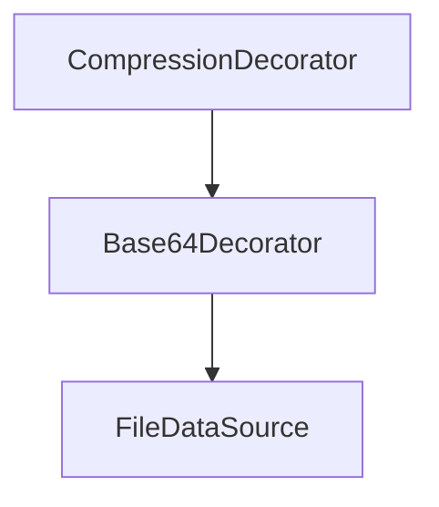
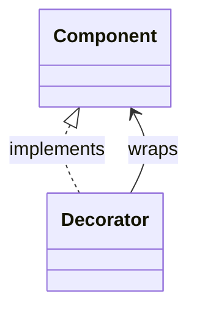
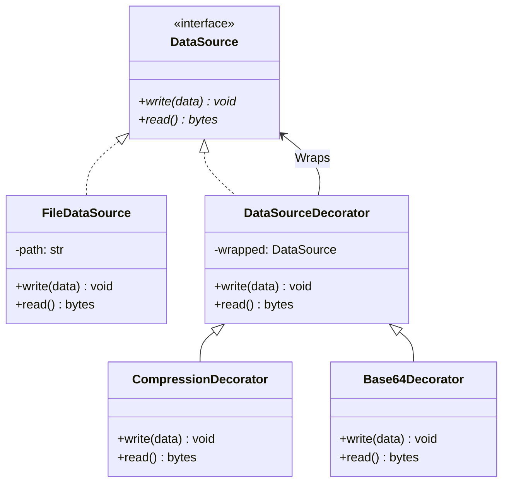

# 데코레이터 패턴 (Decorator Pattern)


## 1. 패턴이 없을 때 발생하는 문제점 (The Problem)

데코레이터 패턴을 사용하지 않고 기존 객체에 선택적인 기능을 추가하려고 하면, 기능의 조합만큼 하위 클래스가 증가하거나 하나의 클래스 내부에 여러 조건문과 옵션이 집중되는 문제가 발생할 수 있습니다.

예를 들어 파일에 데이터를 저장하는 `DataSource`가 있고, 저장 과정에 다음 기능을 선택적으로 적용해야 한다고 가정합니다.

* 기본 파일 저장
* 압축 후 저장
* Base64 인코딩 후 저장
* 압축 + Base64 인코딩 후 저장

이를 상속만으로 해결하면 기능의 조합마다 별도의 클래스가 필요할 수 있습니다.

### 패턴을 적용하지 않은 예시

```python
class FileDataSource:

    def write(
        self,
        data: bytes,
    ) -> None:
        print("파일에 데이터를 저장합니다.")


class CompressedFileDataSource(FileDataSource):

    def write(
        self,
        data: bytes,
    ) -> None:
        compressed = compress(data)
        super().write(compressed)


class EncodedFileDataSource(FileDataSource):

    def write(
        self,
        data: bytes,
    ) -> None:
        encoded = encode(data)
        super().write(encoded)
```

문제는 두 기능을 동시에 사용해야 할 때 발생합니다.

```python
class CompressedEncodedFileDataSource(FileDataSource):

    def write(
        self,
        data: bytes,
    ) -> None:
        compressed = compress(data)
        encoded = encode(compressed)
        super().write(encoded)
```

새로운 기능으로 암호화가 추가되면 필요한 조합은 더욱 증가합니다.

* `FileDataSource`
* `CompressedFileDataSource`
* `EncodedFileDataSource`
* `EncryptedFileDataSource`
* `CompressedEncodedFileDataSource`
* `CompressedEncryptedFileDataSource`
* `EncodedEncryptedFileDataSource`
* `CompressedEncodedEncryptedFileDataSource`

기능이 $N$개 존재한다면 가능한 조합의 수는 상황에 따라 빠르게 증가할 수 있습니다.

이를 피하기 위해 하나의 클래스에 옵션을 모두 넣는 방법도 있습니다.

```python
class BadFileDataSource:

    def __init__(
        self,
        path: str,
        compress: bool = False,
        encode: bool = False,
        encrypt: bool = False,
    ):
        self.path = path
        self.compress = compress
        self.encode = encode
        self.encrypt = encrypt

    def write(
        self,
        data: bytes,
    ) -> None:
        if self.compress:
            data = compress(data)

        if self.encode:
            data = encode(data)

        if self.encrypt:
            data = encrypt(data)

        with open(
            self.path,
            "wb",
        ) as file:
            file.write(data)
```

이 경우 새로운 기능이 추가될 때마다 클래스의 생성자와 `write()` 로직을 계속 수정해야 합니다.

또한 기능의 적용 순서까지 중요하다면 조건문은 더 복잡해집니다.

* 압축 → 암호화
* 암호화 → 압축
* 압축 → Base64 → 암호화

### 이 방식이 가진 단점

* **상속 클래스 조합 폭증:** 여러 기능을 독립적으로 조합하려면 가능한 조합마다 하위 클래스가 필요할 수 있습니다.
* **OCP(개방-폐쇄 원칙) 위반:** 하나의 클래스에 옵션을 모으면 새로운 기능을 추가할 때 기존 클래스를 계속 수정해야 합니다.
* **기능 간 강한 결합:** 압축, 인코딩, 암호화처럼 서로 독립적인 책임이 하나의 클래스 안에 섞일 수 있습니다.
* **런타임 조합의 어려움:** 실행 중 필요한 기능만 선택하여 자유롭게 조합하기 어렵습니다.
* **기능 순서 관리의 어려움:** 여러 부가 기능의 적용 순서가 중요해질 경우 하나의 클래스에서 모든 조합을 관리하기 복잡해집니다.

---

## 2. 데코레이터 패턴으로 해결하기 (The Solution)

데코레이터 패턴은 "기존 객체와 동일한 인터페이스를 구현하는 Wrapper 객체를 두고, 내부에 같은 인터페이스의 객체를 보관하면서 호출 전후에 새로운 책임을 추가하는 방식"으로 이 문제를 해결합니다.

먼저 클라이언트가 사용하는 공통 인터페이스를 정의합니다.

```python
class DataSource(ABC):

    @abstractmethod
    def write(
        self,
        data: bytes,
    ) -> None:
        pass

    @abstractmethod
    def read(self) -> bytes:
        pass
```

기본 구현은 실제 파일 저장 책임만 담당합니다.

```python
class FileDataSource(DataSource):

    def write(
        self,
        data: bytes,
    ) -> None:
        ...

    def read(self) -> bytes:
        ...
```

Decorator 역시 동일한 `DataSource` 인터페이스를 구현합니다.

```python
class DataSourceDecorator(DataSource):

    def __init__(
        self,
        wrapped: DataSource,
    ):
        self._wrapped = wrapped

    def write(
        self,
        data: bytes,
    ) -> None:
        self._wrapped.write(data)

    def read(self) -> bytes:
        return self._wrapped.read()
```

구체 Decorator가 필요한 기능을 추가합니다.

```python
class CompressionDecorator(DataSourceDecorator):

    def write(
        self,
        data: bytes,
    ) -> None:
        compressed = compress(data)
        self._wrapped.write(compressed)

    def read(self) -> bytes:
        data = self._wrapped.read()
        return decompress(data)
```

다른 기능 역시 별도의 Decorator로 정의합니다.

```python
class Base64Decorator(DataSourceDecorator):

    def write(
        self,
        data: bytes,
    ) -> None:
        encoded = encode(data)
        self._wrapped.write(encoded)

    def read(self) -> bytes:
        data = self._wrapped.read()
        return decode(data)
```

이제 필요한 기능을 객체 조합으로 구성할 수 있습니다.

```python
source = CompressionDecorator(
    Base64Decorator(
        FileDataSource("data.bin")
    )
)
```

구조는 다음과 같습니다.



클라이언트는 가장 바깥쪽 객체만 사용합니다.

```python
source.write(b"Hello Decorator")
data = source.read()
```

클라이언트의 관점에서 모든 객체는 동일한 `DataSource`입니다.

* `FileDataSource : DataSource`
* `Base64Decorator : DataSource`
* `CompressionDecorator : DataSource`

따라서 다음과 같이 자유롭게 조합할 수 있습니다.

```python
plain = FileDataSource("plain.bin")

compressed = CompressionDecorator(
    FileDataSource("compressed.bin")
)

encoded = Base64Decorator(
    FileDataSource("encoded.bin")
)

compressed_and_encoded = CompressionDecorator(
    Base64Decorator(
        FileDataSource("data.bin")
    )
)
```

핵심은 단순히 Wrapper 객체를 만드는 것에 있지 않습니다.

원본 객체와 동일한 인터페이스를 유지하면서 하나의 객체를 다른 객체로 재귀적으로 감쌀 수 있게 하여, 새로운 책임을 상속 계층의 폭증 없이 동적으로 조합하는 것이 데코레이터 패턴의 본질입니다.

---

## 3. 장점, 단점 및 트레이드오프 (Trade-off)

### 장점 (Pros)

* **상속 없이 기능 확장:** 기존 클래스나 하위 클래스를 수정하지 않고 객체 합성을 통해 기능을 추가할 수 있습니다.
* **기능의 독립적인 조합:** 압축, 인코딩, 로깅, 캐싱 등의 기능을 서로 독립적인 Decorator로 분리할 수 있습니다.
* **런타임 구성 가능:** 실행 중 필요한 Decorator만 선택하여 객체를 구성할 수 있습니다.
* **OCP 적용:** 새로운 부가 기능을 추가할 때 기존 Component나 Decorator를 수정하지 않고 새로운 Concrete Decorator를 추가할 수 있습니다.
* **SRP(단일 책임 원칙) 향상:** 하나의 거대한 클래스가 여러 부가 기능을 담당하는 대신 각 Decorator가 하나의 책임에 집중할 수 있습니다.
* **Decorator 중첩 가능:** Decorator 역시 Component이므로 다른 Decorator로 다시 감쌀 수 있습니다.

### 단점 (Cons)

* **객체 수 증가:** 작은 기능마다 Decorator 객체가 하나씩 생성되므로 런타임 객체 수가 증가할 수 있습니다.
* **호출 흐름 추적의 어려움:** 여러 Decorator가 중첩되어 있으면 실제 호출이 어떤 순서로 전달되는지 파악하기 어려울 수 있습니다.
* **디버깅 복잡도 증가:** 클라이언트가 실제로 어떤 Decorator 조합을 사용하고 있는지 확인해야 할 수 있습니다.
* **순서에 따른 동작 차이:** Decorator를 어떤 순서로 조합하느냐에 따라 결과가 달라질 수 있습니다.
* **구체 Component에 의존하면 추상화가 깨짐:** Decorator가 공통 인터페이스가 아니라 특정 Concrete Component의 메서드나 상태에 의존하기 시작하면 자유로운 조합이 어려워집니다.

### 트레이드오프 (Trade-off)

* **독립적인 부가 기능이 많을수록 유리:** 로깅, 캐싱, 압축, 재시도, 권한 검사처럼 핵심 기능 주변에 선택적으로 추가되는 책임에 적합합니다.
* **기능 조합이 거의 없다면 상속이 더 단순할 수 있음:** 확장 방식이 한두 개로 고정되어 있고 조합이 필요 없다면 별도의 Decorator 계층이 오히려 복잡할 수 있습니다.
* **Decorator의 순서는 의미가 있음:** 다음 두 구성은 반드시 동일하지 않습니다.

```python
CompressionDecorator(Base64Decorator(FileDataSource(...)))
# 과
Base64Decorator(CompressionDecorator(FileDataSource(...)))
```

첫 번째는 개념적으로 `원본 → 압축 → Base64 → 파일`이 되고, 두 번째는 `원본 → Base64 → 압축 → 파일`이 됩니다.

### 관련 패턴과의 차이

* **Decorator와 Adapter:** Adapter는 클라이언트가 요구하는 다른 인터페이스로 변환하는 것이 목적입니다. Decorator는 기본적으로 같은 인터페이스를 유지하면서 새로운 책임을 추가합니다.
* **Decorator와 Proxy:** 두 패턴 모두 동일 인터페이스로 다른 객체를 감쌀 수 있습니다. Decorator는 기능의 추가와 조합이 핵심인 반면 Proxy는 접근 제어, 지연 생성, 원격 접근, 캐싱 등 대상 객체에 대한 접근을 대신 관리하는 데 초점을 둡니다.
* **Decorator와 Composite:** Decorator는 일반적으로 하나의 Component를 감싸며, Composite는 여러 Component를 자식으로 포함하여 부분-전체 계층을 만듭니다.
* **Decorator와 Chain of Responsibility:** Decorator는 보통 각 계층이 호출을 다음 객체로 위임하면서 자신의 기능을 추가합니다. Chain of Responsibility는 요청을 처리할 객체를 체인에서 찾거나 특정 Handler가 처리한 뒤 전파를 중단할 수 있다는 점에 초점이 있습니다.

### Python의 `@decorator` 문법과 GoF Decorator 패턴의 차이

Python에서 "Decorator"라는 용어는 언어 기능으로도 사용됩니다.

```python
@some_decorator
def function():
    ...
```

이 문법은 본질적으로 다음과 같습니다.

```python
def function():
    ...

function = some_decorator(function)
```

즉, 기존 callable을 받아 새로운 callable로 감싸는 방식입니다.

GoF Decorator는 원래 객체 구조 패턴입니다.



Python의 함수 Decorator는 이것을 함수라는 값에 적용한 형태로 볼 수 있지만 두 개념이 완전히 동일한 것은 아닙니다.

* **GoF Decorator:** 객체 합성을 이용하는 구조 패턴
* **Python `@decorator`:** callable 변환을 위한 언어 문법

다만 둘 모두 "기존 인터페이스를 유지하면서 기존 동작 주변에 새로운 동작을 추가한다"라는 아이디어를 공유합니다.

---

## 4. 파이썬 오픈소스에서 볼 수 있는 데코레이터와 유사한 설계

파이썬의 표준 라이브러리와 주요 웹 프레임워크에서도 동일한 호출 인터페이스를 유지하면서 기존 객체나 함수를 감싸 기능을 추가하고 여러 Wrapper를 중첩하는 구조를 찾아볼 수 있습니다.

다만 아래 사례들은 GoF의 클래스 기반 Decorator와 완전히 동일한 구현만을 의미하는 것이 아니라, Decorator의 핵심인 인터페이스 보존과 동작의 중첩을 보여주는 사례로 이해하는 것이 적절합니다.

### Starlette ASGI Middleware

Starlette의 Middleware는 Decorator와 매우 가까운 구조를 가집니다.

Starlette 공식 문서에서는 ASGI middleware가 다른 ASGI application을 생성자에서 받아 보관하고, 자신도 동일한 ASGI callable 인터페이스인 `__call__(scope, receive, send)`를 구현한 뒤 내부 application을 다시 호출하는 형태를 설명합니다.

개념적으로 다음과 같습니다.

```python
class Middleware:

    def __init__(
        self,
        app,
    ):
        self.app = app

    async def __call__(
        self,
        scope,
        receive,
        send,
    ):
        # 추가 동작
        await self.app(
            scope,
            receive,
            send,
        )
```

여러 Middleware를 겹겹이 적용할 수 있습니다.

```text
ServerErrorMiddleware
        ↓
TrustedHostMiddleware
        ↓
HTTPSRedirectMiddleware
        ↓
ExceptionMiddleware
        ↓
Application
```

Starlette 공식 문서 역시 middleware가 계층적으로 적용되며 ASGI middleware가 다음 ASGI application을 감싸는 형태임을 설명합니다.

따라서 `ASGI Application`이라는 동일 인터페이스를 유지하면서 예외 처리, 호스트 검증, HTTPS 강제, CORS 등의 책임을 중첩해서 추가한다는 점에서 Decorator와 매우 유사합니다.

### Django Middleware

Django Middleware 역시 함수형 Decorator 구조와 매우 가깝습니다.

Django 공식 문서에서 middleware factory는 `get_response` callable을 받아 새로운 middleware callable을 반환하며, middleware 역시 request를 받아 response를 반환합니다. 또한 다음 middleware 또는 view가 `get_response`로 전달되어 계층적으로 감싸집니다.

개념적으로 다음과 같습니다.

```python
def middleware(get_response):

    def wrapped(request):
        # 요청 전 추가 동작
        response = get_response(request)
        # 응답 후 추가 동작
        return response

    return wrapped
```

Django 공식 문서는 이 구조를 양파(onion)에 비유하며, 요청이 바깥 Middleware에서 안쪽으로 이동하고 응답은 역순으로 다시 통과한다고 설명합니다.

```text
Middleware A
    ↓
Middleware B
    ↓
Middleware C
    ↓
View
```

호출 타입은 계속 동일합니다.

$$\text{Request} \rightarrow \text{Response}$$

즉, $\text{Request} \rightarrow \text{Response}$ 함수를 $(\text{Request} \rightarrow \text{Response}) \rightarrow (\text{Request} \rightarrow \text{Response})$ 함수로 계속 감싸는 구조라고 볼 수 있습니다.

### functools.lru_cache

Python 표준 라이브러리의 `functools.lru_cache()`는 기존 함수를 감싸 동일한 호출 형태를 가진 memoizing callable을 반환합니다.

공식 문서에서는 `lru_cache`가 함수를 memoizing callable로 감싸 최근 호출 결과를 저장하며, 원래 함수는 `__wrapped__` 속성을 통해 접근할 수 있다고 설명합니다.

```python
from functools import lru_cache


@lru_cache(maxsize=128)
def load_user(user_id: int):
    ...
```

개념적으로는 다음과 같습니다.

```text
Client
   ↓
Caching Wrapper
   ↓
Original Function
```

함수의 본래 책임을 수정하지 않고 캐싱이라는 새로운 책임을 호출 주변에 추가한다는 점에서 함수형 Decorator의 대표적인 사례입니다.

다만 이는 GoF의 객체 기반 Decorator라기보다 Python의 고차 함수와 Decorator 문법을 이용한 함수 수준의 동일한 설계 아이디어로 보는 것이 정확합니다.

---

## 5. 클래스 다이어그램



각 역할은 다음과 같습니다.

* **Component:** `DataSource`
* **Concrete Component:** `FileDataSource`
* **Base Decorator:** `DataSourceDecorator`
* **Concrete Decorators:** `CompressionDecorator`, `Base64Decorator`

핵심 관계는 다음과 같습니다.

```text
DataSourceDecorator
       │
       └── contains ──> DataSource
```

Decorator 자신도 DataSource이므로 다시 다른 Decorator로 감쌀 수 있습니다.

```text
DataSource
   ↑
Decorator
   │
   └── DataSource
          ↑
       Decorator
          │
          └── DataSource
```

---

## 6. 파이썬 예제 코드

```python
from abc import ABC, abstractmethod
from base64 import b64decode, b64encode
from pathlib import Path
from zlib import compress, decompress

# -------------------------------------------------------------------
# 1. Component
# -------------------------------------------------------------------

class DataSource(ABC):
    @abstractmethod
    def write(self, data: bytes) -> None:
        pass

    @abstractmethod
    def read(self) -> bytes:
        pass

# -------------------------------------------------------------------
# 2. Concrete Component
# -------------------------------------------------------------------

class FileDataSource(DataSource):
    def __init__(self, path: str):
        self._path = Path(path)

    def write(self, data: bytes) -> None:
        self._path.write_bytes(data)

    def read(self) -> bytes:
        return self._path.read_bytes()

# -------------------------------------------------------------------
# 3. Base Decorator
# -------------------------------------------------------------------

class DataSourceDecorator(DataSource):
    def __init__(self, wrapped: DataSource):
        self._wrapped = wrapped

    def write(self, data: bytes) -> None:
        self._wrapped.write(data)

    def read(self) -> bytes:
        return self._wrapped.read()

# -------------------------------------------------------------------
# 4. Concrete Decorator - Compression
# -------------------------------------------------------------------

class CompressionDecorator(DataSourceDecorator):
    def write(self, data: bytes) -> None:
        compressed = compress(data)
        self._wrapped.write(compressed)

    def read(self) -> bytes:
        compressed = self._wrapped.read()
        return decompress(compressed)

# -------------------------------------------------------------------
# 5. Concrete Decorator - Base64
# -------------------------------------------------------------------

class Base64Decorator(DataSourceDecorator):
    def write(self, data: bytes) -> None:
        encoded = b64encode(data)
        self._wrapped.write(encoded)

    def read(self) -> bytes:
        encoded = self._wrapped.read()
        return b64decode(encoded)

# -------------------------------------------------------------------
# 6. 클라이언트
# -------------------------------------------------------------------

def save_message(source: DataSource, message: str) -> None:
    source.write(message.encode("utf-8"))

def load_message(source: DataSource) -> str:
    return source.read().decode("utf-8")

# -------------------------------------------------------------------
# 7. 실행 (Usage)
# -------------------------------------------------------------------

if __name__ == "__main__":
    source: DataSource = CompressionDecorator(
        Base64Decorator(FileDataSource('message.dat'))
    )
    save_message(source, "Decorator Pattern")
    message = load_message(source)
    print(message)
```

실행 결과:

```text
Decorator Pattern
```

저장 과정은 바깥 Decorator에서 안쪽으로 진행됩니다.

```text
원본 bytes
    │
    ↓ CompressionDecorator
압축 bytes
    │
    ↓ Base64Decorator
Base64 bytes
    │
    ↓ FileDataSource
파일 저장
```

읽기 과정에서는 반대 방향의 변환이 수행됩니다.

```text
파일 bytes
    │
    ↓ Base64Decorator
Base64 decode
    │
    ↓ CompressionDecorator
압축 해제
    │
    ↓
원본 bytes
```

Decorator 조합을 바꾸는 것도 쉽습니다.

* **기본 저장:** `source = FileDataSource("plain.dat")`
* **압축만 적용:** `source = CompressionDecorator(FileDataSource("compressed.dat"))`
* **Base64만 적용:** `source = Base64Decorator(FileDataSource("encoded.dat"))`
* **두 기능을 조합:** `source = CompressionDecorator(Base64Decorator(FileDataSource("combined.dat")))`

클라이언트 코드는 변경되지 않습니다.

```python
save_message(source, "Decorator Pattern")
```

클라이언트가 알고 있는 타입은 항상 다음 하나뿐입니다: `DataSource`

---

## 부록 (Appendix): 현대적 타입 시스템과 함수형 관점의 재해석

데코레이터 패턴을 현대 타입 시스템과 함수형 프로그래밍 관점에서 재해석하면, Decorator가 표현하는 구조는 "동일한 인터페이스를 가진 값을 입력받아 같은 인터페이스를 가진 새로운 값을 반환하는 변환"으로 일반화할 수 있습니다.

고전적인 Decorator 구조는 다음과 같습니다.

```text
Component
    ↑
Decorator
    │
    └── Component
```

Decorator는 Component를 입력으로 받아 사실상 새로운 Component를 만듭니다.

이를 함수 형태로 표현하면:

$$\text{Component} \rightarrow \text{Component}$$

함수 자체를 Component라고 생각하면 더 일반적인 형태는 다음과 같습니다.

```text
Handler
   ↓
Decorator
   ↓
Handler
```

즉, $\text{Handler} \rightarrow \text{Handler}$ 입니다.

이 부록에서는 이를 설명하기 위해 고차 함수(Higher-Order Function), 매개변수적 다형성, 함수 합성, Endomorphism, 타입클래스, Phantom Type, Effect System, Algebraic Effect를 지원하는 가상의 Python 문법을 가정하여 설명합니다. (아래 코드는 실제 Python 문법이 아닙니다.)

### 부록을 읽는 순서와 전제

본문의 압축과 Base64는 적용 순서가 있는 변환입니다. 1~4절에서는 “입력과 출력 계약을 유지하며 감싼다”는 구조를 함수로 옮깁니다. 여기서 Endomorphism은 `T -> T` 형태의 변환을 뜻합니다. 7절의 Codec은 인코딩과 디코딩을 한 쌍으로 묶어 본문의 저장·복원 흐름을 설명합니다.

Phantom Type과 Effect System은 각각 적용 기능의 기록과 실행 효과의 분리를 위한 선택적인 확장입니다. 기본 데코레이터를 구현하기 위한 필수 조건은 아니며, 잘못된 조합이나 반복되는 효과 관리가 실제 문제가 될 때 검토합니다.

---

### 1. Decorator를 고차 함수로 표현하기

요청을 받아 응답을 반환하는 함수가 있다고 가정합니다.

```text
type Handler[Request, Response] = Request -> Response
```

Decorator는 Handler를 받아 다시 같은 Handler를 반환합니다.

```text
type Decorator[Request, Response] = (
    Handler[Request, Response] -> Handler[Request, Response]
)
```

즉, $(\text{Request} \rightarrow \text{Response}) \rightarrow (\text{Request} \rightarrow \text{Response})$ 입니다.

로깅 Decorator 정의:

```python
def with_logging[Request, Response](
    next: Handler[Request, Response]
) -> Handler[Request, Response]:

    def wrapped(request: Request) -> Response:
        log("request received")
        response = next(request)
        log("response returned")
        return response

    return wrapped
```

캐싱 Decorator:

```python
def with_cache[Request: Hashable, Response](
    next: Handler[Request, Response]
) -> Handler[Request, Response]:

    cache = Map[Request, Response]()

    def wrapped(request: Request) -> Response:
        match cache.get(request):
            case Some(value):
                return value
            case None:
                value = next(request)
                cache.insert(request, value)
                return value

    return wrapped
```

클래스 계층 없이 함수로 조합할 수 있습니다.

```text
handler = (
    base_handler
    |> with_cache
    |> with_logging
)
```

이는 고전적인 `LoggingDecorator(CacheDecorator(BaseComponent))`와 같은 구조입니다.

### 2. 정확한 함수 시그니처를 보존하는 다형적 Decorator

Decorator의 중요한 조건은 기존 인터페이스를 유지한다는 것입니다.

가상의 강력한 타입 시스템에서는 임의의 함수 시그니처를 보존하는 Decorator를 다음과 같이 표현할 수 있습니다.

```text
type Decorator = forall Args, R. (Args -> R) -> (Args -> R)
```

즉, 입력 함수가 $(\text{Int}, \text{str}) \rightarrow \text{User}$라면 Decorator를 적용한 결과도 반드시 $(\text{Int}, \text{str}) \rightarrow \text{User}$이어야 합니다.

예를 들어:

```text
def trace[*Args, R](
    fn: (*Args) -> R
) -> (*Args) -> R:
    ...
```

다음 함수에 적용합니다.

```python
def load_user(id: UserId, active_only: Bool) -> User:
    ...
```

Decorator 이후에도 타입은 유지됩니다.

```python
traced = trace(load_user)
# traced : (UserId, Bool) -> User
```

즉, 인터페이스 보존이라는 Decorator의 핵심 규칙을 타입 시스템 자체가 검증할 수 있습니다.

### 3. Decorator를 Endomorphism으로 바라보기

수학적으로 같은 타입을 입력받아 같은 타입을 반환하는 함수는 Endomorphism으로 볼 수 있습니다.

```text
type Endo[T] = T -> T
```

Decorator 역시 `type Decorator[C] = Endo[C]` 입니다.

예를 들어:

* `logging: Handler -> Handler`
* `cache: Handler -> Handler`
* `retry: Handler -> Handler`

각 Decorator는 모두 `Handler -> Handler`라는 동일한 타입을 가집니다.

따라서 Decorator 자체를 합성할 수 있습니다.

```python
def compose[T](
    first: Endo[T],
    second: Endo[T]
) -> Endo[T]:
    return lambda value: second(first(value))
```

다음과 같이 하나의 정책을 만들 수 있습니다.

```python
production = with_cache >> with_retry >> with_logging
```

적용:

```python
handler = production(base_handler)
```

객체 Decorator의 중첩 구조가 함수의 합성으로 변환됩니다.

### 4. Decorator의 순서는 일반적으로 교환 가능하지 않다

Decorator 합성에서 중요한 특징은 대부분의 Decorator가 교환법칙을 만족하지 않는다는 점입니다.

* `Logging(Cache(Service))`에서는 캐시 Hit도 바깥 Logging에 기록됩니다.
* 반대로 `Cache(Logging(Service))`에서는 캐시 Hit 시 내부 Logging까지 호출되지 않을 수 있습니다.

함수로 표현하면 `with_logging >> with_cache`와 `with_cache >> with_logging`은 일반적으로 동일하지 않습니다.

즉, $A \circ B \neq B \circ A$ 일 수 있습니다.

Decorator의 적용 순서는 단순 구현 세부 사항이 아니라 프로그램의 의미 일부가 됩니다.

### 5. Decorator Pipeline을 값으로 표현하기

Decorator 조합을 코드 구조로 직접 중첩하지 않고 데이터로 표현할 수도 있습니다.

```text
data Layer =
    Logging
  | Cache(capacity: Int)
  | Retry(attempts: Int)
  | Timeout(duration: Duration)
```

Pipeline:

```python
type Pipeline = Vector[Layer]
```

설정값으로 구성합니다.

```python
pipeline = [
    Logging,
    Retry(attempts=3),
    Cache(capacity=1000),
]
```

Interpreter가 실제 Handler를 구성합니다.

```python
def apply_pipeline[Req, Res](
    base: Handler[Req, Res],
    layers: Pipeline,
) -> Handler[Req, Res]:
    ...
```

구조는 다음과 같습니다.

```text
Pipeline Data
     │
     ↓
Interpreter
     │
     ↓
Decorated Handler
```

이렇게 하면 Decorator 구성을 설정 파일이나 정책 데이터로 관리할 수도 있습니다.

### 6. Phantom Type으로 적용된 기능을 타입에 기록하기

고전적인 Decorator에서는 객체를 보았을 때 어떤 기능이 적용되어 있는지 정적 타입만으로 알기 어려울 수 있습니다. (`source: DataSource`)

가상의 타입 시스템에서는 적용된 기능을 Phantom Type으로 기록할 수 있습니다.

```text
data Plain
data Compressed
data Encoded

record Source[Features]:
    ...
```

압축 함수:

```python
def compress_source[F](
    source: Source[F]
) -> Source[F + Compressed]:
    ...
```

인코딩:

```python
def encode_source[F](
    source: Source[F]
) -> Source[F + Encoded]:
    ...
```

사용:

```text
source = (
    file_source
    |> compress_source
    |> encode_source
)
```

컴파일러가 보는 타입은 `Source[Plain + Compressed + Encoded]`입니다.

Phantom Type은 런타임 데이터에 직접 저장하지 않는 타입 표식입니다. 위 표식은 어떤 기능이 적용되었는지 기록하지만, `+`를 순서 없는 기능 집합으로 해석하면 압축과 인코딩의 순서를 구별하지 못합니다. 순서와 중복 적용까지 검사하려면 순서 있는 타입 목록이나 중첩 타입을 사용해야 합니다.

또한 생성자를 제한하고 실제 변환이 성공한 경계에서만 표식을 바꿔야 합니다. 표식만 붙이고 데이터 변환을 생략하는 구현까지 타입 매개변수 자체가 검증하지는 않습니다.

### 7. 데이터 변환 Decorator를 Codec 합성으로 표현하기

앞의 `CompressionDecorator`와 `Base64Decorator`는 사실 데이터를 양방향으로 변환합니다.

* `write: A -> B`
* `read: B -> A`

이를 하나의 Codec으로 표현할 수 있습니다.

```text
record Codec[A, B]:
    encode: A -> B
    decode: B -> Result[A, DecodeError]
```

압축 Codec: `compression: Codec[Bytes, CompressedBytes]`

Base64 Codec: `base64: Codec[CompressedBytes, EncodedBytes]`

두 Codec을 합성합니다.

```python
storage_codec = compression >> base64
# 타입: Codec[Bytes, EncodedBytes]
```

저장소 자체는 변환 기능을 알 필요가 없습니다.

```python
def store[A, B](
    source: Storage[B],
    codec: Codec[A, B],
    value: A,
) -> Unit:
    source.write(codec.encode(value))
```

고전적인 `CompressionDecorator → Base64Decorator → FileDataSource` 구조가 `Compression Codec >> Base64 Codec >> Storage`라는 함수 합성 구조로 바뀝니다.

### 8. 횡단 관심사는 Effect System으로 분리하기

Decorator는 로깅, tracing, metrics, retry와 같은 횡단 관심사(Cross-Cutting Concern)에 자주 사용됩니다.

```python
service = MetricsDecorator(
    LoggingDecorator(
        RetryDecorator(
            UserService()
        )
    )
)
```

Decorator가 늘어날수록 핵심 서비스 주변에 Wrapper 계층이 계속 쌓입니다.

```text
Metrics → Logging → Retry → Tracing → Authorization → Service
```

효과 시스템(Effect System)을 지원하는 언어에서는 핵심 로직이 필요한 효과만 선언할 수 있습니다.

```text
def load_user(id: UserId) -> User ! Database + Logging + Metrics:
    ...
```

실행 경계에서 Handler를 적용합니다.

```text
handle Database with ProductionDatabase
handle Logging with StructuredLogger
handle Metrics with Prometheus:
    run_application()
```

고전 Decorator에서 객체 Wrapper로 표현되던 횡단 관심사를 Effect Handler Stack으로 분리한 것입니다.

### 9. Retry와 Timeout을 효과 해석으로 표현하기

네트워크 호출이 다음 효과를 발생시킨다고 가정합니다.

```text
effect Network:
    def request(req: Request) -> Response
```

비즈니스 로직:

```text
def load_profile(id: UserId) -> Profile ! Network:
    ...
```

Retry Decorator 대신 Network 효과를 처리하는 Handler를 만들 수 있습니다.

```text
handler retry_network(attempts: Int):
    on Network.request(req):
        repeat attempts:
            match resume(req):
                case Ok(response):
                    return response
                case Err(_):
                    continue
```

Timeout 역시 별도의 Handler입니다.

```text
handler timeout_network(duration: Duration):
    ...
```

둘을 겹쳐 적용합니다.

```text
Retry Handler
      ↓
Timeout Handler
      ↓
Network Implementation
```

구조적으로는 Decorator와 유사하지만, 핵심 객체 자체를 여러 Wrapper 객체로 변경하지 않습니다. 어떤 효과를 어떻게 해석할 것인가를 별도의 계층으로 이동시킵니다.

### 10. 정적 Capability 조합으로 기능을 확장하기

Decorator를 사용하는 이유 중 하나는 객체에 기능을 단계적으로 추가하기 위해서입니다.

가상의 타입 시스템에서 Capability를 합성할 수 있다고 가정합니다.

```text
trait Readable[T]:
    def read(value: T) -> Bytes

trait Writable[T]:
    def write(value: T, data: Bytes) -> Unit

trait Compressed[T]:
    def compression_level(value: T) -> Level
```

타입이 여러 Capability를 제공할 수 있습니다.

```python
Source : Readable + Writable + Compressed
```

함수는 필요한 기능만 요구합니다.

```text
def backup[T](source: T) -> Unit
where Readable[T] + Compressed[T]:
    ...
```

고전적인 Decorator가 객체를 감싸 기능을 동적으로 추가했다면, 정적 조합이 가능한 언어에서는 타입이 제공하는 Capability 집합을 합성하는 접근도 가능합니다.

### 11. Decorator와 Wrapper의 차이를 타입 수준에서 표현하기

모든 Wrapper가 Decorator는 아닙니다.

* **Adapter:** 인터페이스를 변경합니다. (`A → B`)
* **Decorator:** 인터페이스를 유지합니다. (`A → A`)

```text
Adapter: A -> B
Decorator: A -> A
```

Proxy 역시 일반적으로 `A -> A` 형태를 가지므로 타입 모양만으로 Decorator와 구별되지는 않습니다. 차이는 의도와 의미에 있습니다.

* **Decorator:** 책임 추가
* **Proxy:** 접근 제어 또는 대리

디자인 패턴의 구분은 타입 구조뿐 아니라 각 Wrapper가 담당하는 의미적 역할까지 포함합니다.

### 12. Decorator를 "행동의 합성"으로 바라보기

고전적인 Decorator는 객체 그래프로 표현됩니다.

```text
Decorator A → Decorator B → Decorator C → Component
```

하지만 더 추상적으로 보면 다음과 같습니다.

```text
기본 행동 → 행동 변환 A → 행동 변환 B → 행동 변환 C
```

즉, Decorator의 본질은 객체의 계층보다 행동의 단계적인 변환과 합성에 있습니다.

* **객체지향:** `Component Interface + Wrapper Object + Delegation`
* **함수형:** `Higher-Order Function (Handler -> Handler) + Function Composition`
* **데이터 변환:** `Codec Composition`
* **횡단 관심사:** `Effect Handler Stack`

따라서 Decorator를 단순히 "객체를 객체로 감싸는 패턴"으로만 이해할 필요는 없습니다. "기존 행동의 인터페이스를 보존하면서 독립적인 행동 변환을 여러 단계로 조합하는 방법"으로 이해할 수 있습니다.

---

### 요약 및 비교

| 관점 | 데코레이터 패턴 (OOP 아키텍처) | 현대 타입 시스템 + 함수형 관점 |
| --- | --- | --- |
| **기본 구조** | Component를 Decorator가 감쌈 | $T \rightarrow T$ |
| **인터페이스 유지** | Component 인터페이스 구현 | 동일 함수/타입 보존 |
| **기능 추가** | Concrete Decorator | Higher-Order Function |
| **기능 조합** | Wrapper 중첩 | Function Composition |
| **Decorator의 일반형** | `Decorator(Component)` | `Endo[T] = T -> T` |
| **함수 Decorator** | 별도 callable wrapper | $(A \rightarrow B) \rightarrow (A \rightarrow B)$ |
| **조합 순서** | 객체 중첩 순서 | 비가환 함수 합성 |
| **구성의 데이터화** | 객체 그래프 | Pipeline ADT |
| **적용 기능 추적** | 주로 런타임 구조 | Phantom Type / Type State |
| **데이터 변환 계층** | Decorator 객체 중첩 | Codec Composition |
| **로깅·Metrics 등** | Wrapper 객체 | Effect Handler |
| **기능 능력 표현** | 인터페이스/Decorator | Capability Composition |
| **주요 장점** | 상속 없이 기능을 동적으로 조합 | 행동 변환 자체를 직접 합성 |
| **주요 비용** | Wrapper 객체와 호출 계층 증가 | 고차 함수·Effect·타입 추상화에 대한 이해 필요 |

---

### 결론

데코레이터는 공통 계약을 유지하는 변환을 필요한 순서로 조합합니다. 본문의 저장 예제처럼 쓰기와 읽기가 반대 순서로 동작하는지 확인하고, 각 단계의 오류와 자원 관리 책임을 정해야 합니다. 객체 포장과 함수 합성 중 어느 쪽이 실제 상태와 계약을 더 명확히 드러내는지에 따라 선택합니다.
