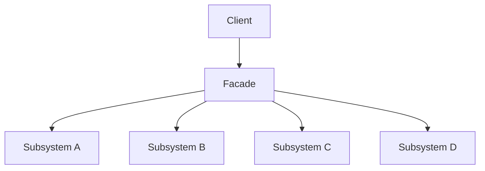
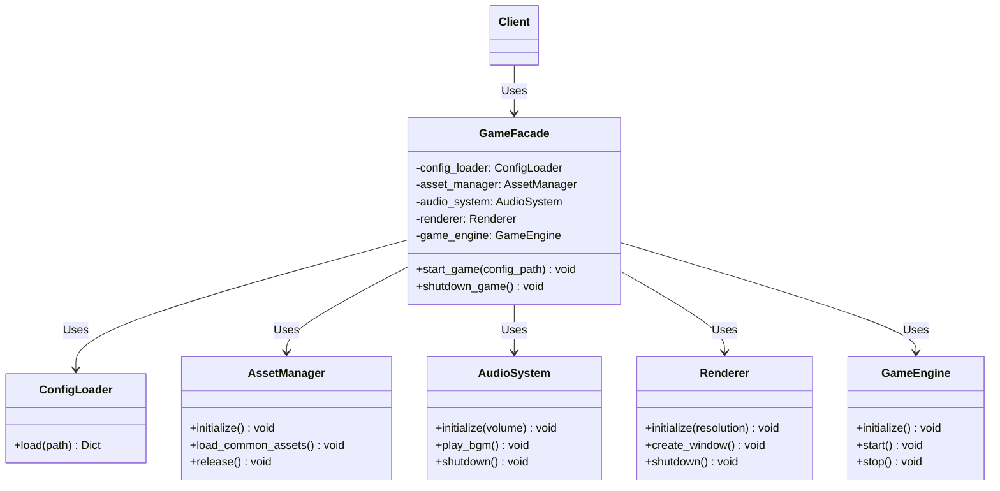

# 파사드 패턴 (Facade Pattern)


## 1. 패턴이 없을 때 발생하는 문제점 (The Problem)

파사드 패턴을 사용하지 않고 복잡한 서브시스템을 클라이언트가 직접 사용하면, 클라이언트가 여러 객체의 생성 순서, 호출 관계, 설정 규칙까지 모두 알아야 하는 문제가 발생할 수 있습니다.

예를 들어 게임을 실행하기 위해 다음과 같은 여러 서브시스템이 필요하다고 가정해 봅시다.

* `ConfigLoader`
* `AssetManager`
* `AudioSystem`
* `Renderer`
* `GameEngine`

게임을 시작하려면 단순히 `GameEngine.start()`만 호출하는 것으로는 부족하며, 여러 시스템을 올바른 순서로 초기화해야 합니다.

### 패턴을 적용하지 않은 예시

```python
class ConfigLoader:
    def load(self, path: str) -> dict[str, object]:
        print(f"설정 파일 로딩: {path}")
        return {
            "resolution": "1920x1080",
            "volume": 80,
        }


class AssetManager:
    def initialize(self) -> None:
        print("Asset Manager 초기화")

    def load_common_assets(self) -> None:
        print("공통 Asset 로딩")


class AudioSystem:
    def initialize(self, volume: int) -> None:
        print(f"Audio 초기화: volume={volume}")

    def play_bgm(self) -> None:
        print("배경 음악 재생")


class Renderer:
    def initialize(self, resolution: str) -> None:
        print(f"Renderer 초기화: {resolution}")

    def create_window(self) -> None:
        print("게임 Window 생성")


class GameEngine:
    def initialize(self) -> None:
        print("Game Engine 초기화")

    def start(self) -> None:
        print("게임 시작")

```

클라이언트가 게임을 실행하려면 모든 서브시스템을 직접 조립해야 합니다.

```python
config_loader = ConfigLoader()
asset_manager = AssetManager()
audio_system = AudioSystem()
renderer = Renderer()
game_engine = GameEngine()

config = config_loader.load("game.json")

asset_manager.initialize()
asset_manager.load_common_assets()

renderer.initialize(resolution=str(config["resolution"]))
renderer.create_window()

audio_system.initialize(volume=int(config["volume"]))
audio_system.play_bgm()

game_engine.initialize()
game_engine.start()

```

클라이언트는 단순히 "게임을 실행하고 싶다"는 목적만 가지고 있지만, 아래 세부 정보를 모두 파악해야 합니다.

1. `ConfigLoader`를 먼저 실행해야 함
2. 설정에서 `resolution`을 읽어 `Renderer`에 전달해야 함
3. `AssetManager`를 초기화한 뒤 Asset을 로드해야 함
4. `AudioSystem` 초기화 시 `volume` 값을 전달해야 함
5. `Renderer` 초기화 이후 Window를 생성해야 함
6. 마지막으로 `GameEngine`을 초기화하고 실행해야 함

다른 실행 진입점에서도 동일한 과정이 필요하다면 복잡한 호출 절차가 반복됩니다.

```python
def run_game_from_launcher():
    ...

def run_game_from_editor():
    ...

def run_game_for_test():
    ...

```

이 상황에서 서브시스템의 초기화 방법이나 순서가 변경되면 모든 클라이언트 코드를 수정해야 합니다.

### 이 방식이 가진 단점

* **클라이언트와 서브시스템의 강한 결합:** 클라이언트가 여러 구체 서브시스템 클래스에 직접 의존합니다.
* **복잡한 호출 순서 노출:** 클라이언트가 어떤 객체를 어떤 순서로 호출해야 하는지 직접 파악해야 합니다.
* **중복된 오케스트레이션(Orchestration) 로직:** 동일한 사용 시나리오가 여러 클라이언트에서 반복될 수 있습니다.
* **변경 영향 범위 증가:** 서브시스템의 구성이나 초기화 순서가 변경되면 이를 사용하는 클라이언트도 함께 수정되어야 합니다.
* **상위 수준의 의도 파악 어려움:** `load()`, `initialize()`, `create_window()`, `play_bgm()` 등의 저수준 호출이 나열되어 있어, 코드가 실제로 수행하려는 목적이 "게임 실행"이라는 점이 명확히 드러나지 않습니다.

---

## 2. 파사드 패턴으로 해결하기 (The Solution)

파사드 패턴은 **복잡한 서브시스템 앞에 단순하고 목적 중심적인 통합 인터페이스를 제공하여, 클라이언트가 내부 구성 요소의 세부 사용법을 몰라도 주요 기능을 사용할 수 있도록 만드는 방식**으로 이 문제를 해결합니다.

일반적인 구조는 다음과 같습니다.



앞선 게임 시스템에 `GameFacade`를 추가해 봅니다.

```python
class GameFacade:
    def __init__(
        self,
        config_loader: ConfigLoader,
        asset_manager: AssetManager,
        audio_system: AudioSystem,
        renderer: Renderer,
        game_engine: GameEngine,
    ):
        self._config_loader = config_loader
        self._asset_manager = asset_manager
        self._audio_system = audio_system
        self._renderer = renderer
        self._game_engine = game_engine

    def start_game(self, config_path: str) -> None:
        config = self._config_loader.load(config_path)

        self._asset_manager.initialize()
        self._asset_manager.load_common_assets()

        self._renderer.initialize(resolution=str(config["resolution"]))
        self._renderer.create_window()

        self._audio_system.initialize(volume=int(config["volume"]))
        self._audio_system.play_bgm()

        self._game_engine.initialize()
        self._game_engine.start()

```

클라이언트 측 코드는 다음과 같이 단순해집니다.

```python
game = GameFacade(
    ConfigLoader(),
    AssetManager(),
    AudioSystem(),
    Renderer(),
    GameEngine(),
)

game.start_game("game.json")

```

클라이언트가 바라보는 인터페이스는 사실상 다음 하나뿐입니다.

```python
GameFacade.start_game()

```

내부에서는 여전히 여러 객체가 협력합니다.

```text
GameFacade.start_game()
        │
        ├─ ConfigLoader.load()
        ├─ AssetManager.initialize()
        ├─ AssetManager.load_common_assets()
        ├─ Renderer.initialize()
        ├─ Renderer.create_window()
        ├─ AudioSystem.initialize()
        ├─ AudioSystem.play_bgm()
        ├─ GameEngine.initialize()
        └─ GameEngine.start()

```

하지만 클라이언트는 이 내부 구조를 알 필요가 없습니다.

여기서 중요한 점은 **Facade가 기존 서브시스템을 제거하거나 사용하지 못하게 봉쇄하는 것이 아니라는 점**입니다. 세밀한 제어가 필요한 고급 클라이언트는 여전히 특정 서브시스템을 직접 사용할 수 있습니다.

```python
# 세밀한 제어가 필요한 경우: 저수준 API 직접 사용
renderer = Renderer()
renderer.initialize("3840x2160")

# 일반적인 경우: Facade 사용
game.start_game("game.json")

```

파사드 패턴의 핵심은 단순히 여러 함수를 하나의 메서드에 모아두는 데 있지 않습니다. 복잡한 서브시스템의 일반적인 사용 시나리오를 상위 수준의 인터페이스로 표현함으로써, 클라이언트와 서브시스템 간의 결합도와 클라이언트가 떠안아야 할 인지 복잡성을 줄이는 것이 파사드 패턴의 본질입니다.

---

## 3. 장점, 단점 및 트레이드오프 (Trade-off)

### 장점 (Pros)

* **클라이언트 단순화:** 여러 서브시스템 객체의 생성과 호출 순서를 클라이언트가 직접 관리할 필요가 없습니다.
* **서브시스템과의 결합도 감소:** 클라이언트가 다수의 내부 클래스 대신 `Facade`라는 제한된 진입점에 의존하게 됩니다.
* **복잡성 캡슐화:** 초기화 순서, 객체 간 협력 관계, 데이터 전달 등의 내부 절차를 Facade 내부에 숨길 수 있습니다.
* **상위 수준의 의도 표현:** `start_game()`, `convert_video()`, `place_order()`처럼 사용자의 목적 중심적인 API를 설계할 수 있습니다.
* **변경 영향 범위 감소:** 서브시스템 내부 구성이 변경되더라도 Facade 인터페이스만 유지되면 대다수 클라이언트 코드는 수정할 필요가 없습니다.
* **점진적인 추상화 제공:** 일반 사용자는 Facade를 사용하고, 특수한 경우에는 저수준 서브시스템 API에 직접 접근할 수도 있습니다.

### 단점 (Cons)

* **Facade에 책임이 집중될 위험:** 너무 많은 사용 케이스를 하나의 Facade에 추가하다 보면 거대한 거대 객체(God Object)가 될 위험이 있습니다.
* **서브시스템 기능 일부가 숨겨질 수 있음:** 지나치게 단순한 Facade만 제공하면 고급 기능에 접근하기 어려워질 수 있습니다.
* **추상화 누수 가능성:** 서브시스템의 오류나 설정 차이를 완전히 감추지 못하면, Facade 인터페이스에도 내부 개념이 노출될 수 있습니다.
* **불필요한 중간 계층 추가:** 서브시스템 자체가 이미 충분히 단순하다면, Facade는 단순히 호출을 전달하는 위임 코드만 늘리는 셈이 됩니다.
* **변경 병목 현상:** 서로 연관 없는 기능까지 하나의 Facade에 몰아넣으면 새로운 요구사항이 생길 때마다 Facade를 계속 수정해야 합니다.

### 트레이드오프 (Trade-off)

* **서브시스템이 복잡할수록 유리:** 객체 수가 많고 올바른 사용 순서가 복잡할수록 Facade의 가치가 더욱 커집니다.
* **자주 사용하는 시나리오가 명확할수록 유리:** 저수준 API를 자유롭게 조합해야 하는 시스템보다는 "파일 복사", "게임 시작", "HTTP 요청 실행"처럼 대표적인 상위 사용 유스케이스가 존재할 때 효과적입니다.
* **모든 기능을 Facade에 넣을 필요는 없음:** Facade는 서브시스템 모든 기능을 1:1로 재노출하는 API가 아니며, 자주 사용하는 상위 수준 작업만 제공하는 것이 자연스럽습니다.
* **여러 Facade가 존재할 수 있음:** 하나의 거대한 Facade 대신, 사용자 유형이나 기능 영역에 따라 여러 Facade를 분리하여 제공할 수 있습니다. (예: `GameRuntimeFacade`, `GameEditorFacade`, `GameAssetFacade`)

### 다른 패턴과의 차이점

* **vs Adapter:** Adapter는 기존 인터페이스를 클라이언트가 요구하는 다른 인터페이스로 변환합니다. Facade는 복잡한 여러 인터페이스 위에 더 단순한 상위 인터페이스를 제공합니다.
* **vs Mediator:** Facade는 주로 클라이언트에서 서브시스템 방향으로의 단방향 단순 접근 지점을 제공합니다. Mediator는 여러 객체가 직접 통신하지 않고 중재자를 통해 서로 복잡하게 협력하도록 만드는 데 초점을 둡니다.
* **vs Proxy:** Proxy는 기본적으로 하나의 대상 객체를 대신하여 접근을 제어합니다. Facade는 여러 서브시스템을 하나의 상위 API 뒤로 묶는 것이 목적입니다.
* **vs Service Layer:** 둘 다 형태는 유사할 수 있으나, Service Layer는 주로 애플리케이션의 비즈니스 유스케이스와 트랜잭션 경계를 표현합니다. Facade는 더 일반적으로 복잡한 서브시스템의 사용 방식을 단순화하는 구조적 목적을 가집니다.

### Facade는 캡슐화와 동일하지 않음

Facade를 적용했다고 해서 서브시스템을 외부에서 절대 접근하지 못하게 차단해야 하는 것은 아닙니다.

```text
Client
   │
   ├────> Facade
   │        │
   │        └────> Subsystem
   │
   └─────────────> Subsystem

```

일반적인 클라이언트는 Facade를 사용하고, 고급 기능이 필요한 클라이언트는 서브시스템을 직접 활용할 수 있습니다. 즉, Facade의 목적은 "서브시스템을 완전히 숨겨 접근을 막는 것"이라기보다는 "대부분의 사용자가 서브시스템 전체를 이해하지 않아도 주요 작업을 쉽게 수행하도록 돕는 것"입니다.

---

## 4. 파이썬 오픈소스에서 볼 수 있는 파사드와 유사한 설계

파이썬 표준 라이브러리와 주요 프레임워크에서도 여러 저수준 기능이나 객체 협력을 하나의 편리한 상위 API 뒤로 감추는 Facade 스타일의 구조를 쉽게 찾아볼 수 있습니다. (GoF Facade 패턴을 엄격히 구현했다기보다는, 복잡한 하위 API 위에 목적 중심의 단순한 진입점을 제공한다는 관점에서 이해하는 것이 적절합니다.)

### Python `subprocess.run()`

Python의 `subprocess` 모듈은 프로세스 생성, 표준 입출력/에러 파이프 연결, 종료 코드 처리 등의 기능을 제공합니다. 공식 문서에서는 일반적인 프로세스 실행 작업에 `run()`을 사용하는 것을 권장하며, 세밀한 제어가 필요한 특수 상황에는 하위 수준의 `Popen` 인터페이스를 직접 사용하도록 안내합니다.

```python
import subprocess

result = subprocess.run(
    ["python", "--version"],
    capture_output=True,
    text=True,
)

```

상위 API인 `subprocess.run()`은 내부적으로 `Popen`을 호출하여 더 세밀한 프로세스 관리를 수행합니다.

```text
일반적인 사용 ──> subprocess.run()
                     │
                     ↓
                   Popen
                     ├─ process creation
                     ├─ stdin/stdout/stderr
                     ├─ communicate()
                     └─ return code

```

이처럼 일반 사용자에게는 자주 쓰는 시나리오를 고수준 함수 하나로 제공하고, 필요시 저수준 API(`Popen`)도 직접 쓸 수 있게 연 방식은 Facade의 개념과 유사합니다.

### Python `shutil`

Python 표준 라이브러리의 `shutil`은 파일 및 파일 집합에 대한 고수준 연산(high-level file operations)을 제공합니다. 디렉터리 전체를 복사할 때 클라이언트는 복잡한 세부 동작을 신경 쓸 필요가 없습니다.

```python
import shutil

shutil.copytree("source", "backup")

```

클라이언트는 디렉터리 생성, 하위 디렉터리 탐색, 파일 반복, 개별 파일 복사, 메타데이터 및 오류 처리 과정을 직접 구현하지 않아도 됩니다.

```text
복잡한 파일 시스템 연산 ──> shutil ──> 간단한 고수준 함수

```

### Django `django.shortcuts`

Django의 `django.shortcuts` 패키지는 웹 개발에서 자주 사용하는 작업을 고수준 함수로 제공합니다.

예를 들어 `render()` 함수는 Template Loader 호출, Template 조회, Context 적용, `HttpResponse` 객체 생성을 한 번에 처리해 줍니다.

```python
from django.shortcuts import render

def my_view(request):
    return render(request, "index.html", {"name": "Aragorn"})

```

이를 직접 작성할 경우 다음과 같은 저수준 단계를 거쳐야 합니다.

```text
Template Loader ──> Template 조회 ──> Context 적용 ──> Template.render() ──> HttpResponse 생성

```

`render()` 함수는 이를 목적 중심의 단일 API로 깔끔하게 단순화해 줍니다. 또한 `get_object_or_404()` 역시 ORM의 `get()` 호출과 `DoesNotExist` 예외 처리를 HTTP 404 응답과 매핑해 주는 전형적인 파사드 형태의 편의 함수입니다.

---

## 5. 클래스 다이어그램



### 역할 분담

* **Facade:** `GameFacade`
* **Subsystem Classes:** `ConfigLoader`, `AssetManager`, `AudioSystem`, `Renderer`, `GameEngine`
* **Client:** `GameLauncher` 등

### 핵심 관계

```text
             ┌─ ConfigLoader
             ├─ AssetManager
Client ──> Facade ── AudioSystem
             ├─ Renderer
             └─ GameEngine

```

클라이언트는 여러 서브시스템을 개별적으로 다룰 필요 없이, Facade를 통해 대표적인 시나리오를 간편하게 수행할 수 있습니다.

---

## 6. 파이썬 예제 코드

```python
from dataclasses import dataclass

# 1. 설정 모델
@dataclass(frozen=True)
class GameConfig:
    resolution: str
    volume: int


# 2. Subsystem - Config
class ConfigLoader:
    def load(self, path: str) -> GameConfig:
        print(f"[Config] {path} 로딩")
        return GameConfig(resolution="1920x1080", volume=80)


# 3. Subsystem - Asset
class AssetManager:
    def initialize(self) -> None:
        print("[Asset] 초기화")

    def load_common_assets(self) -> None:
        print("[Asset] 공통 리소스 로딩")

    def release(self) -> None:
        print("[Asset] 해제")


# 4. Subsystem - Audio
class AudioSystem:
    def initialize(self, volume: int) -> None:
        print(f"[Audio] 초기화 volume={volume}")

    def play_bgm(self) -> None:
        print("[Audio] BGM 재생")

    def shutdown(self) -> None:
        print("[Audio] 종료")


# 5. Subsystem - Renderer
class Renderer:
    def initialize(self, resolution: str) -> None:
        print(f"[Renderer] 초기화 resolution={resolution}")

    def create_window(self) -> None:
        print("[Renderer] Window 생성")

    def shutdown(self) -> None:
        print("[Renderer] 종료")


# 6. Subsystem - Game Engine
class GameEngine:
    def initialize(self) -> None:
        print("[Engine] 초기화")

    def start(self) -> None:
        print("[Engine] 게임 시작")

    def stop(self) -> None:
        print("[Engine] 게임 종료")


# 7. Facade
class GameFacade:
    def __init__(
        self,
        config_loader: ConfigLoader,
        asset_manager: AssetManager,
        audio_system: AudioSystem,
        renderer: Renderer,
        game_engine: GameEngine,
    ):
        self._config_loader = config_loader
        self._asset_manager = asset_manager
        self._audio_system = audio_system
        self._renderer = renderer
        self._game_engine = game_engine

    def start_game(self, config_path: str) -> None:
        print("\n=== 게임 시작 준비 ===")
        config = self._config_loader.load(config_path)

        self._asset_manager.initialize()
        self._asset_manager.load_common_assets()

        self._renderer.initialize(config.resolution)
        self._renderer.create_window()

        self._audio_system.initialize(config.volume)
        self._audio_system.play_bgm()

        self._game_engine.initialize()
        self._game_engine.start()
        print("=== 게임 시작 완료 ===")

    def shutdown_game(self) -> None:
        print("\n=== 게임 종료 준비 ===")
        self._game_engine.stop()
        self._audio_system.shutdown()
        self._renderer.shutdown()
        self._asset_manager.release()
        print("=== 게임 종료 완료 ===")


# 8. 클라이언트
def run_game(facade: GameFacade) -> None:
    facade.start_game("game.json")
    # 게임 실행...
    facade.shutdown_game()


# 9. 실행 (Usage)
if __name__ == "__main__":
    facade = GameFacade(
        config_loader=ConfigLoader(),
        asset_manager=AssetManager(),
        audio_system=AudioSystem(),
        renderer=Renderer(),
        game_engine=GameEngine(),
    )

    run_game(facade)

```

본문 예제는 초기화와 종료의 정상 순서를 보여줍니다. 실제 게임에서는 중간 초기화 실패 시 이미 확보한 자원을 역순으로 정리해야 하며, 시작·종료의 중복 호출도 처리해야 합니다. `try/finally`나 컨텍스트 관리자로 정리를 보장하되, 아직 초기화되지 않은 자원을 해제하지 않도록 획득 상태를 함께 관리합니다.

### 실행 결과

```text
=== 게임 시작 준비 ===
[Config] game.json 로딩
[Asset] 초기화
[Asset] 공통 리소스 로딩
[Renderer] 초기화 resolution=1920x1080
[Renderer] Window 생성
[Audio] 초기화 volume=80
[Audio] BGM 재생
[Engine] 초기화
[Engine] 게임 시작
=== 게임 시작 완료 ===

=== 게임 종료 준비 ===
[Engine] 게임 종료
[Audio] 종료
[Renderer] 종료
[Asset] 해제
=== 게임 종료 완료 ===

```

클라이언트가 직접 접하는 코드는 아래처럼 매우 간단합니다.

```python
facade.start_game("game.json")
facade.shutdown_game()

```

반면 Facade 내부에는 다음과 같은 복잡한 오케스트레이션이 숨겨져 있습니다.

```text
start_game()
    │
    ├─ load config
    ├─ initialize assets
    ├─ load assets
    ├─ initialize renderer
    ├─ create window
    ├─ initialize audio
    ├─ start BGM
    ├─ initialize engine
    └─ start engine

```

Facade는 복잡성 자체를 없앤 것이 아니라, 명확한 경계 뒤로 감추어 고수준 작업으로 재표현한 것입니다.

---

## 부록 (Appendix): 현대적 타입 시스템과 함수형 관점의 재해석

파사드 패턴을 현대적인 타입 시스템 및 함수형 프로그래밍 관점에서 재해석해 보면, 파사드가 해결하고자 하는 본질은 단순한 "여러 객체의 클래스 감싸기"를 넘어 훨씬 일반적인 프로그래밍 문제에 닿아 있음을 알 수 있습니다.

서브시스템 전체가 갖는 넓은 인터페이스(`A₁~A₄`, `B₁~B₃`, `C₁~C₅` 등) 중에서, 대다수 클라이언트에게 실제로 필요한 진입점(`start()`, `stop()`)만 작은 인터페이스로 정제하여 노출하는 것입니다.

즉, 추상적인 핵심 질문은 다음과 같습니다.

> **"복잡한 시스템의 광범위한 기능 중에서 특정 클라이언트에게 필요한 제한된 권한과 능력만을 어떻게 명시적 경계로 선언할 것인가?"**

*(이 부록은 구조적 타입, Capability, Effect System 등을 설명하기 위해 가상의 파이썬 스타일 문법을 사용합니다.)*

### 부록을 읽는 순서와 전제

본문의 게임 시작 절차를 기준으로 읽습니다. 1~4절은 호출자가 알아야 할 기능을 줄이고, 5~6절은 효과와 내부 표현의 경계를 다룹니다. 7~8절은 “두 번 시작하면 어떻게 되는가”, “일부 초기화만 성공하면 어떻게 되는가”라는 추가 문제를 다룹니다.

Capability는 연산을 사용할 수 있는 권한을 전달하는 값이고, Typestate는 현재 상태를 타입에 기록하는 기법입니다. 좁은 API, 실제 권한 제한, 상태 전이 검사는 각각 다른 보장입니다. 아래에서는 이를 구분하고 각 보장에 필요한 언어 제약을 함께 설명합니다.

---

### 1. Facade를 인터페이스 축소(Interface Narrowing)로 바라보기

전체 시스템이 가지고 있는 무수히 많은 기능(`config.reload`, `assets.invalidate_cache`, `renderer.change_backend` 등)을 일반 클라이언트에게 모두 개방할 필요는 없습니다.

```python
# 가상 코드: 좁은 인터페이스 정의
protocol GameRuntime:
    def start(config_path: str) -> Unit
    def stop() -> Unit

def make_runtime(system: GameSystem) -> GameRuntime:
    ...

```

타입 관점에서 파사드는 **객체의 개수를 줄이는 것이 아니라, 클라이언트에 노출되는 능력의 표면적(Surface Area)을 줄이는 추상화**입니다.

### 2. 구조적 타입으로 필요한 능력만 노출하기

구조적 타이핑(Structural Typing) 환경에서는 전체 기능을 가진 `FullGameSystem` 객체가 있더라도, 좁은 형태의 `GameFacade` 프로토콜 타입으로 지정하여 클라이언트의 접근 범위를 제어할 수 있습니다.

```python
facade: GameFacade = full_system

# 가능
facade.start("game.json")

# 컴파일 에러: GameFacade에 선언되지 않은 기능
facade.rebuild_shaders() 

```

이 가상 언어에서는 공개된 타입 계약을 기준으로 호출을 검사합니다. Python의 `Protocol`도 정적 검사에 사용할 수 있지만, 타입을 좁혀 표시하는 것만으로 실제 객체의 다른 메서드가 사라지지는 않습니다. 따라서 좁은 타입은 API 사용 규약이며, 신뢰할 수 없는 코드에 대한 보안 경계로 간주해서는 안 됩니다.

### 3. Capability Projection으로 Facade를 표현하기

최소 권한 원칙(Principle of Least Authority)에 따라, 전체 애플리케이션 환경의 기능 중 필요한 역량(Capability)만 뽑아내어 제공합니다.

```python
capability GameRuntime:
    def start(config: ConfigPath) -> Unit
    def stop() -> Unit

def launcher(using runtime: GameRuntime) -> Unit:
    runtime.start("game.json")

```

클라이언트에 필요한 기능만 전달하면 의존 범위를 줄일 수 있습니다. 실제 권한 제한으로 사용하려면 Capability의 임의 생성과 우회 접근을 막아야 하며, 권한을 발급하는 쪽에서는 사용자와 실행 환경을 검사해야 합니다.

### 4. Facade를 고차 함수로 표현하기

Facade가 반드시 클래스 형태의 객체일 필요는 없습니다. 객체지향의 `Facade Object + Method` 조합은 함수형 패러다임에서 **고수준 조합 함수(High-level Function)** 하나로 깔끔하게 대치될 수 있습니다.

```python
def start_game(path: ConfigPath, using subsystems...) -> RunningGame:
    # 내부 서브시스템 초기화 수행...
    return RunningGame(...)

# 클라이언트 호출
game = start_game("game.json")

```

### 5. 여러 저수준 효과를 하나의 고수준 효과로 추상화하기

이펙트 시스템(Effect System) 관점에서는 여러 저수준 Effect(`Config`, `Assets`, `Audio`, `Rendering`, `Engine`)들을 다루는 핸들러를 두고, 상위 클라이언트에는 단일 고수준 Effect인 `GameRuntime`만 요구하도록 인터페이스를 추상화할 수 있습니다.

### 6. Opaque Module로 서브시스템 자체를 숨기기

불투명 타입의 내부 표현을 외부에서 열어볼 수 없도록 강제하는 언어에서는 모듈 경계로 구현을 숨길 수 있습니다. 아래는 그런 모듈 시스템을 가정한 예시이며, Python 모듈의 밑줄 이름 규약과는 보장 수준이 다릅니다.

```python
module Game:
    opaque Runtime
    def create() -> Runtime
    def start(runtime: Runtime, path: ConfigPath) -> Unit

```

외부 클라이언트는 `runtime.renderer`와 같이 모듈 내부 필드에 접근할 수 없으며, 오직 공개된 모듈 함수(`Game.start`)만 사용할 수 있게 정적으로 강제됩니다.

### 7. Facade의 상태 전이를 타입으로 표현하기

런타임에 "이미 시작된 게임을 다시 시작하려 함" 등의 오류를 방지하기 위해 타입 상태(Typestate) 기법을 결합할 수 있습니다.

```python
# 가상 문법: consume은 이전 소유권을 넘기며, 해당 값의 재사용을 금지합니다.
def start(consume facade: GameFacade[Created], config: ConfigPath) -> GameFacade[Running]: ...
def stop(consume facade: GameFacade[Running]) -> GameFacade[Stopped]: ...

created = create_facade()
running = start(consume created, config)
# start(consume created, config)  # 오류: created의 소유권은 이미 이동했습니다.
stopped = stop(consume running)

```

상태별 타입은 `Stopped` 객체를 `stop()`에 전달하는 실수를 검출합니다. **같은 객체를 두 번 시작하는 것까지 막으려면 이전 상태의 소유권을 소비하고, 재사용 가능한 별칭을 허용하지 않는 규칙도 필요합니다.** 반환 타입만 바꾸면 호출자가 보관한 `created` 참조로 다시 시작할 수 있습니다.

이 예시는 성공한 상태 전이만 표현합니다. 초기화 실패 시에는 확보한 자원을 해제하고, 오류와 함께 재시도 가능한 상태를 반환할지 종료 상태로 옮길지 정해야 합니다. Python에서는 이러한 규칙을 타입 힌트만으로 강제할 수 없으므로 런타임 상태 검사와 자원 정리를 함께 구현해야 합니다.

### 8. 오류 집합 축소 (Error Normalization)

각 서브시스템에서 발생하는 구체적인 오류들(`ConfigError`, `AudioError`, `RenderError` 등)을 클라이언트가 모두 알고 처리하게 만드는 대신, Facade 계층에서 도메인에 맞는 상위 오류 모델(`GameStartError`)로 변환(Projection)하여 전달합니다.

### 9. 반환 타입을 통한 추상화 은닉

Facade가 서브시스템 내부 객체를 그대로 반환하면 추상화 누수가 발생합니다. 반환 타입 역시 `RunningGame`과 같은 불투명 타입(Opaque Type)으로 감싸 전달함으로써 클라이언트와의 결합도를 최소화합니다.

### 10. 복잡성의 국소화 (Complexity Localization)

파사드를 사용한다고 해서 복잡성 자체가 사라지지는 않습니다. 파사드는 복잡성을 없애는 것(Complexity Elimination)이 아니라, 복잡성이 위치하는 장소를 한 곳으로 국소화(Complexity Localization)하는 도구입니다.

### 11. 역할별 Capability View 제공

하나의 거대한 Facade를 만드는 대신, 클라이언트 역할(Launcher, Editor, Operations 등)에 맞추어 최소한의 프로토콜 인터페이스(View)를 분리하여 제공하는 것이 좋습니다.

### 요약 및 비교

| 관점 | 파사드 패턴 (OOP) | 현대 타입 시스템 + 함수형 관점 |
| --- | --- | --- |
| **핵심 문제** | 복잡한 서브시스템 사용법 노출 | 과도하게 넓은 기능·효과·타입 표면적 |
| **기본 구조** | Facade 객체가 여러 Subsystem을 감쌈 | 좁은 타입 / 함수 / Capability로 투영 |
| **클라이언트 인터페이스** | Facade 메서드 | Narrow Protocol / Module Signature |
| **서브시스템 조합** | Facade 내부 오케스트레이션 | 고수준 함수 합성 (Function Composition) |
| **접근 기능 제한** | 관례적 API 경계 | Capability Projection |
| **내부 타입 은닉** | private 필드 등 | Opaque Type / Module |
| **상태별 사용 규칙** | 런타임 상태 검사 | Typestate + 소유권 소비·별칭 제한 |
| **서브시스템 오류** | Facade 내 예외 변환 | Domain Error ADT |
| **여러 저수준 효과** | Facade 내부 메서드 호출 | High-level Effect |
| **역할별 인터페이스** | 여러 Facade 클래스 | Capability View / Narrow Protocol |
| **복잡성 처리** | Facade 내부로 이동 | Complexity Localization |
| **주요 장점** | 일반적인 사용법 단순화 | 노출되는 기능·타입·오류·효과를 정적으로 축소 |
| **주요 비용** | Facade 비대화 가능성 | 타입·Capability·Effect 경계 설계 필요 |

---

### 결론

파사드는 자주 사용하는 절차를 작은 API로 제공하여 호출자의 의존 범위를 줄입니다. 내부 복잡성과 실패 가능성은 남아 있으므로, 초기화·정리·오류 변환을 함께 설계해야 합니다. 역할별로 API를 나누되, 타입을 좁히는 것과 실제 접근 권한을 제한하는 것을 구분합니다.
