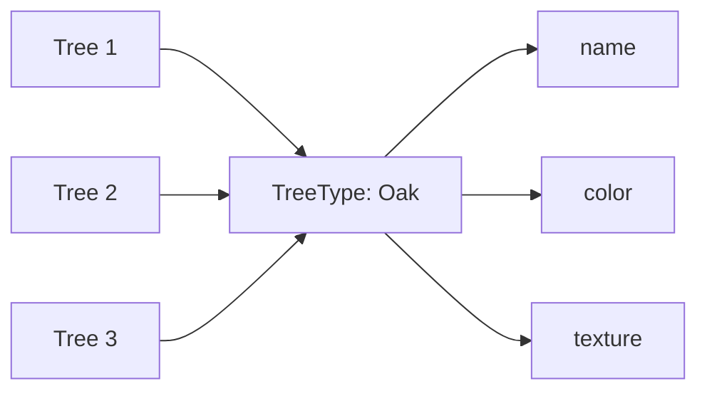
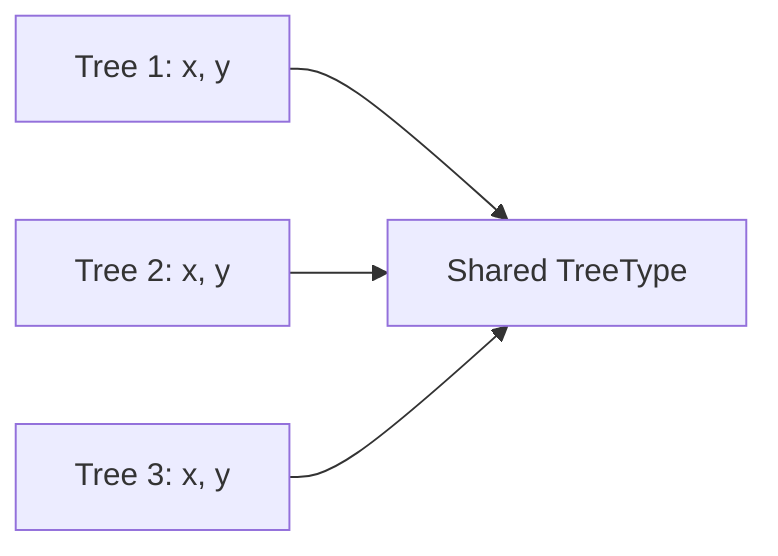
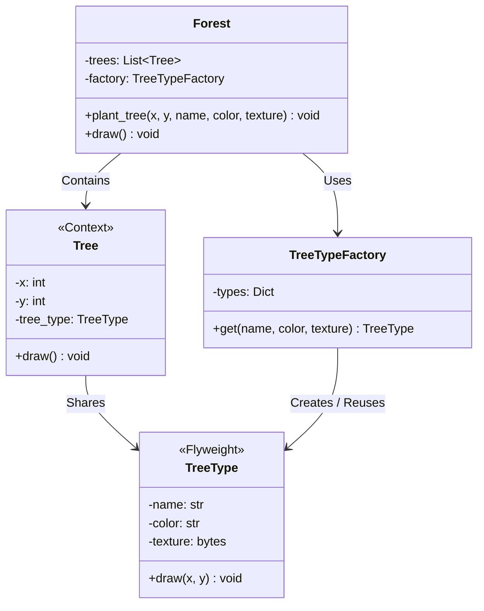

# 플라이웨이트 패턴 (Flyweight Pattern)


## 1. 패턴이 없을 때 발생하는 문제점 (The Problem)

플라이웨이트 패턴을 사용하지 않고 동일한 데이터를 반복해서 가지는 객체를 대량으로 생성하면, 객체마다 중복된 상태가 저장되어 불필요한 메모리를 많이 사용할 수 있습니다.

예를 들어 게임의 숲에 수십만 개의 나무를 배치한다고 가정합니다. 각 나무는 다음 정보를 가지고 있습니다.

* **공통 정보**: 나무 종류, 색상, 텍스처
* **개별 정보**: x 좌표, y 좌표

### 패턴을 적용하지 않은 예시

```python
class Tree:
    def __init__(
        self,
        x: int,
        y: int,
        name: str,
        color: str,
        texture: bytes,
    ):
        self.x = x
        self.y = y
        self.name = name
        self.color = color
        self.texture = texture

    def draw(self) -> None:
        print(f"{self.name} 나무를 ({self.x}, {self.y})에 그립니다.")
```

숲에 같은 종류의 나무를 여러 개 배치합니다.

```python
trees = [
    Tree(
        x=10,
        y=20,
        name="Oak",
        color="green",
        texture=load_texture("oak.png"),
    ),
    Tree(
        x=30,
        y=50,
        name="Oak",
        color="green",
        texture=load_texture("oak.png"),
    ),
    Tree(
        x=100,
        y=200,
        name="Oak",
        color="green",
        texture=load_texture("oak.png"),
    ),
]
```

각 나무의 위치는 서로 다릅니다.

* **Tree 1**: `x = 10`, `y = 20`
* **Tree 2**: `x = 30`, `y = 50`
* **Tree 3**: `x = 100`, `y = 200`

하지만 다음 정보는 모두 동일합니다.

```text
name = "Oak"
color = "green"
texture = oak.png
```

특히 `texture`처럼 크기가 큰 데이터가 각 객체마다 독립적으로 존재한다면 중복 비용이 매우 커질 수 있습니다.

예를 들어 나무가 100,000개이고 각 객체가 동일한 1MB 텍스처를 별도로 소유한다고 단순화하면:

$$100,000 \times 1\text{MB}$$

에 해당하는 비현실적인 중복 데이터가 발생할 수 있습니다.

> **참고**: 실제 그래픽 시스템에서는 텍스처 리소스 자체를 별도의 시스템에서 공유하는 경우가 많지만, 여기서는 반복되는 상태를 각 객체가 직접 소유할 때의 문제를 단순화하여 표현한 것입니다.

### 이 방식이 가진 단점

1. **중복 메모리 사용**: 여러 객체가 동일한 데이터를 각각 저장하면 객체 수에 비례하여 메모리 사용량이 증가합니다.
2. **비싼 리소스의 반복 생성**: 텍스처, 폰트, 메타데이터처럼 생성 비용이 큰 객체를 반복해서 로딩할 수 있습니다.
3. **공통 상태 관리의 어려움**: 동일한 종류의 객체들이 논리적으로 같은 정보를 가지고 있음에도 각각 별도의 사본을 관리하게 됩니다.
4. **객체 수 증가에 따른 확장성 저하**: 수십만~수백만 개의 작은 객체를 다루는 시스템에서는 객체당 몇 개의 중복 필드도 큰 비용이 될 수 있습니다.
5. **동일 값의 불필요한 Identity 증가**: 논리적으로 동일한 데이터가 여러 객체로 존재하여 캐시 효율과 참조 지역성이 나빠질 수 있습니다.

---

## 2. 플라이웨이트 패턴으로 해결하기 (The Solution)

플라이웨이트 패턴은 "많은 객체에서 반복되는 공통 상태를 하나의 Flyweight 객체로 분리하여 공유하고, 객체마다 달라지는 상태만 별도로 유지하는 방식"으로 이 문제를 해결합니다.

이때 객체의 상태를 크게 두 종류로 구분합니다.

* **Intrinsic State**: 공유 가능한 내부 상태
* **Extrinsic State**: 객체마다 다른 외부 상태

앞의 나무 예제에서는 다음과 같이 나눌 수 있습니다.

* **Intrinsic State**: `name`, `color`, `texture`
* **Extrinsic State**: `x`, `y`

공통 상태를 `TreeType`으로 분리합니다.

```python
class TreeType:
    def __init__(
        self,
        name: str,
        color: str,
        texture: bytes,
    ):
        self.name = name
        self.color = color
        self.texture = texture

    def draw(self, x: int, y: int) -> None:
        print(f"{self.name} 나무를 ({x}, {y})에 그립니다.")
```

각 실제 나무는 위치와 공유 Flyweight에 대한 참조만 가집니다.

```python
class Tree:
    def __init__(
        self,
        x: int,
        y: int,
        tree_type: TreeType,
    ):
        self.x = x
        self.y = y
        self.tree_type = tree_type

    def draw(self) -> None:
        self.tree_type.draw(self.x, self.y)
```

구조는 다음과 같습니다.



각 `Tree`는 작은 개별 상태만 가집니다.



동일한 `TreeType` 객체를 재사용하기 위해 일반적으로 Flyweight Factory를 둡니다.

```python
class TreeTypeFactory:
    def __init__(self):
        self._types = {}

    def get(
        self,
        name: str,
        color: str,
        texture_path: str,
    ) -> TreeType:
        key = (name, color, texture_path)

        if key not in self._types:
            self._types[key] = TreeType(
                name=name,
                color=color,
                texture=load_texture(texture_path),
            )

        return self._types[key]
```

같은 키로 요청하면 동일한 Flyweight 객체를 반환합니다.

```python
oak1 = factory.get("Oak", "green", "oak.png")
oak2 = factory.get("Oak", "green", "oak.png")

assert oak1 is oak2
```

핵심은 단순히 객체를 캐싱하는 데 있지 않습니다. 객체의 상태를 공유 가능한 **Intrinsic State**와 개별적인 **Extrinsic State**로 의도적으로 분리하고, Intrinsic State의 객체 수를 제한하여 매우 많은 논리적 객체를 적은 물리적 상태로 표현하는 것이 플라이웨이트 패턴의 본질입니다.

---

## 3. 장점, 단점 및 트레이드오프 (Trade-off)

### 장점 (Pros)

* **메모리 사용량 감소**: 동일한 Intrinsic State를 많은 객체가 공유하므로 중복 데이터를 크게 줄일 수 있습니다.
* **비싼 리소스 재사용**: 텍스처, 폰트, 메타데이터, 스타일 등 생성 비용이 큰 값을 한 번만 생성하여 공유할 수 있습니다.
* **대량 객체 처리에 유리**: 게임 오브젝트, 문자 Glyph, 입자, 타일 등 비슷한 객체가 매우 많이 존재하는 문제에 적합합니다.
* **캐시 효율 개선 가능**: 동일한 공통 객체를 반복 참조하므로 데이터가 여러 객체에 흩어지는 것을 줄일 수 있습니다.
* **공통 상태의 일관성**: 동일한 Flyweight를 사용하는 객체들은 동일한 Intrinsic State를 공유합니다.

### 단점 (Cons)

* **설계 복잡도 증가**: 객체 상태를 Intrinsic State와 Extrinsic State로 정확하게 구분해야 합니다.
* **외부 상태 전달 필요**: Flyweight가 자체적으로 가지고 있지 않은 위치, 크기, 문맥 등의 정보를 호출 시마다 전달해야 할 수 있습니다.
* **공유 객체의 변경 위험**: Flyweight가 가변적이면 하나의 변경이 이를 사용하는 모든 객체에 영향을 미칠 수 있습니다.
* **Factory / Cache 관리 필요**: 동일한 Flyweight가 중복 생성되지 않도록 Registry 또는 Factory를 관리해야 합니다.
* **조회 비용 추가**: 객체를 생성할 때마다 Flyweight Factory에서 기존 객체가 있는지 검색해야 할 수 있습니다.
* **객체 Identity 의미가 약해질 수 있음**: 값 공유가 중심이므로 "각 객체가 독립적으로 자기 상태를 가진다"는 모델과 잘 맞지 않을 수 있습니다.

### 트레이드오프 (Trade-off)

* **객체 수가 많고 반복 상태가 클수록 유리**: 객체가 몇 개뿐이거나 공유 데이터가 매우 작다면 Flyweight 도입 비용이 더 클 수 있습니다.
* **Intrinsic State는 불변에 가까울수록 안전**: 공유 Flyweight의 상태를 수정할 수 있으면 모든 사용자가 동시에 영향을 받습니다. 따라서 Flyweight는 일반적으로 불변 객체로 설계하는 것이 안전합니다.
* **Extrinsic State가 너무 크면 효과가 감소**: 객체마다 다른 상태가 대부분이라면 공유할 수 있는 부분이 작아 Flyweight의 메모리 절감 효과가 제한됩니다.
* **메모리와 계산 비용의 교환**: 상태를 객체 내부에 직접 저장하지 않고 외부에서 계산하거나 전달하면 메모리는 줄지만 계산 및 인자 전달 비용이 증가할 수 있습니다.

### 유사 개념 및 패턴 비교

#### Flyweight vs Singleton

Singleton은 특정 클래스 전체에서 하나의 인스턴스만 존재하도록 제한합니다. Flyweight는 여러 종류의 객체가 존재할 수 있으며, 같은 Intrinsic State를 가진 요청끼리 동일한 객체를 공유합니다.

```text
Singleton:
    GameConfig → 1 instance

Flyweight:
    TreeType["Oak"]   → 1 shared instance
    TreeType["Pine"]  → 1 shared instance
    TreeType["Birch"] → 1 shared instance
```

> **참고**: Flyweight Factory는 키별로 객체를 하나씩 유지한다는 점에서 Registry 또는 Multiton과 비슷한 형태를 가질 수 있지만, 목적은 대량 객체의 상태 공유와 메모리 절감입니다.

#### Flyweight vs Prototype

Prototype은 기존 객체를 복제하여 새로운 객체를 생성하는 것이 목적입니다. Flyweight는 동일한 상태의 객체를 새로 만들지 않고 기존 객체를 공유하는 것이 목적입니다.

```text
Prototype:
    기존 객체 ──(clone)──> 새로운 객체

Flyweight:
    기존 객체 <──(공유)─── 여러 Context들
```

#### Flyweight vs Object Pool

Object Pool은 사용이 끝난 객체를 반환받아 나중에 다시 사용하는 **수명 주기 재사용**에 초점을 둡니다. Flyweight는 **여러 사용자가 동시에 하나의 공유 상태를 참조**할 수 있다는 점에서 다릅니다.

---

### Intrinsic State와 Extrinsic State의 구분

Flyweight에서 가장 중요한 설계 판단은 어떤 상태가 공유 가능한지를 결정하는 것입니다.

| 구분 | 설명 | 만족 조건 / 예시 |
| --- | --- | --- |
| **Intrinsic State** | Flyweight 내부에 저장할 수 있는 상태 | • 여러 객체에서 동일함<br>• 사용 문맥에 독립적임<br>• 공유해도 의미가 바뀌지 않음<br>• 가능하면 불변임<br>*(예: `TreeType` - `name`, `color`, `texture`)* |
| **Extrinsic State** | 각 사용 위치나 문맥마다 달라지는 상태 | • Flyweight 연산 시 외부에서 전달 가능<br>*(예: `Tree` - `x`, `y`)* |

> 즉, Flyweight가 메모리를 줄이는 핵심은 **"모든 상태 공유"**가 아니라 **"공유 가능한 상태만 공유"**하는 것입니다.

---

## 4. 파이썬 오픈소스에서 볼 수 있는 플라이웨이트와 유사한 설계

Python과 주요 라이브러리에서도 동일한 값이나 결과 객체를 여러 사용자 사이에서 재사용하여 중복 객체 생성을 줄이는 구조를 찾아볼 수 있습니다.

단, 아래 사례들은 GoF Flyweight 패턴을 정석 그대로 구현한 것은 아니며, **Interning**, **Canonicalization**, **Cache** 등 Flyweight와 밀접한 상태 공유 기법으로 이해하는 것이 적절합니다.

### 1) Python `sys.intern()`

`sys.intern()`은 동일한 문자열 값을 intern table에 등록하고, 해당 문자열 또는 이미 intern되어 있는 동일 내용의 문자열 객체를 반환합니다. Python 문서에서는 intern된 문자열이 딕셔너리 키 비교에서 문자열 전체 비교 대신 포인터 비교를 활용할 수 있어 성능상 이점이 있을 수 있다고 설명합니다.

```python
from sys import intern

a = intern("player_health")
b = intern("player_health")

assert a is b
```

개념적으로 다음과 같습니다.

```text
"player_health" ──┐
                  │
"player_health" ──┼──> canonical str object
                  │
"player_health" ──┘
```

CPython의 현재 내부 문서 역시 intern된 문자열을 인터프리터 범위의 집합처럼 설명하며, 같은 내용의 interned string이 중복되지 않도록 관리한다고 설명합니다. CPython은 이를 딕셔너리 및 attribute lookup 등의 최적화에 활용합니다. 이는 동일한 Intrinsic Value를 하나의 canonical object로 공유한다는 점에서 Flyweight와 매우 직접적으로 유사한 사례입니다.

### 2) `functools.cache`를 이용한 Flyweight Factory

Python의 `functools.cache`는 함수 인자에 따라 계산 결과를 저장한 뒤 같은 인자로 다시 호출되면 캐시된 결과를 재사용하는 memoization 기능입니다. 캐시는 함수의 인자와 반환값에 대한 참조를 유지합니다. 따라서 immutable Flyweight Factory를 매우 간단하게 구성할 수도 있습니다.

```python
from dataclasses import dataclass
from functools import cache

@dataclass(frozen=True)
class TreeType:
    name: str
    color: str
    texture: str

@cache
def get_tree_type(name: str, color: str, texture: str) -> TreeType:
    return TreeType(
        name=name,
        color=color,
        texture=texture,
    )
```

동일한 인자로 호출하면 캐시된 결과를 사용합니다.

```python
oak1 = get_tree_type("Oak", "green", "oak.png")
oak2 = get_tree_type("Oak", "green", "oak.png")

assert oak1 is oak2
```

`functools.cache` 자체가 GoF Flyweight는 아니지만 `key -> canonical shared value` 구조를 구현하는 Flyweight Factory의 기반으로 활용할 수 있습니다.

### 3) `weakref.WeakValueDictionary`

Flyweight Factory가 모든 객체를 강한 참조로 영구 보관하면 메모리 누수 문제가 발생할 수 있습니다.

```text
한 번 생성된 Flyweight ──> Cache가 계속 참조 ──> 사용되지 않아도 메모리 유지
```

Python의 `weakref.WeakValueDictionary`는 값을 약한 참조로 저장하며, 해당 객체에 대한 강한 참조가 더 이상 존재하지 않으면 엔트리가 자동으로 제거됩니다. 이를 Flyweight Registry에 활용할 수 있습니다.

```python
from weakref import WeakValueDictionary

class TreeTypeFactory:
    def __init__(self):
        self._types = WeakValueDictionary()

    def get(self, key):
        ...
```

구조는 다음과 같습니다.

```text
Flyweight Factory
      │
      ↓
Weak Cache
      │
      ├─ 사용 중인 Flyweight         ──> 유지
      │
      └─ 아무도 사용하지 않는 Flyweight ──> GC 가능
```

`WeakValueDictionary` 역시 Flyweight 패턴 그 자체는 아니지만 Flyweight의 canonical object cache를 수명 주기까지 고려하여 구현할 때 유용한 기반 구조입니다.

---

## 5. 클래스 다이어그램



### 역할 및 상태 분리

| 구분 | 요소 | 구성 상세 |
| --- | --- | --- |
| **역할 정의** | • Flyweight: `TreeType`<br>• Concrete Flyweight: 각각의 `TreeType` 객체 | • Context: `Tree`<br>• Flyweight Factory: `TreeTypeFactory`<br>• Client: `Forest` |
| **상태 분리** | **`TreeType` (Intrinsic State)**<br>• `name`<br>• `color`<br>• `texture` | **`Tree` (Extrinsic State + 참조)**<br>• `x`, `y`<br>• `tree_type` 참조 |

---

## 6. 파이썬 예제 코드

```python
from dataclasses import dataclass

# -------------------------------------------------------------------
# 1. Flyweight
# -------------------------------------------------------------------

@dataclass(frozen=True)
class TreeType:
    name: str
    color: str
    texture: str

    def draw(self, x: int, y: int) -> None:
        print(
            f"[{self.name}] "
            f"color={self.color}, texture={self.texture} "
            f"→ ({x}, {y})에 렌더링"
        )

# -------------------------------------------------------------------
# 2. Flyweight Factory
# -------------------------------------------------------------------

class TreeTypeFactory:
    def __init__(self):
        self._types: dict[tuple[str, str, str], TreeType] = {}

    def get(self, name: str, color: str, texture: str) -> TreeType:
        key = (name, color, texture)
        tree_type = self._types.get(key)
        if tree_type is None:
            tree_type = TreeType(name=name, color=color, texture=texture)
            self._types[key] = tree_type
            print(f"[Factory] 새 TreeType 생성: {key}")
        return tree_type

    def count(self) -> int:
        return len(self._types)

# -------------------------------------------------------------------
# 3. Context
# -------------------------------------------------------------------

@dataclass
class Tree:
    x: int
    y: int
    tree_type: TreeType

    def draw(self) -> None:
        self.tree_type.draw(self.x, self.y)

# -------------------------------------------------------------------
# 4. Client
# -------------------------------------------------------------------

class Forest:
    def __init__(self, factory: TreeTypeFactory):
        self._factory = factory
        self._trees: list[Tree] = []

    def plant_tree(self, x: int, y: int, name: str, color: str, texture: str) -> None:
        tree_type = self._factory.get(name=name, color=color, texture=texture)
        self._trees.append(Tree(x=x, y=y, tree_type=tree_type))

    def draw(self) -> None:
        for tree in self._trees:
            tree.draw()

    def tree_count(self) -> int:
        return len(self._trees)

# -------------------------------------------------------------------
# 5. 실행 (Usage)
# -------------------------------------------------------------------

if __name__ == "__main__":
    factory = TreeTypeFactory()
    forest = Forest(factory)
    # Oak 3개
    forest.plant_tree(10, 20, "Oak", "green", "oak.png")
    forest.plant_tree(30, 50, "Oak", "green", "oak.png")
    forest.plant_tree(100, 200, "Oak", "green", "oak.png")
    # Pine 2개
    forest.plant_tree(40, 60, "Pine", "dark-green", "pine.png")
    forest.plant_tree(80, 120, "Pine", "dark-green", "pine.png")
    forest.draw()
    print("\n실제 Tree 객체 수:", forest.tree_count())
    print("실제 TreeType 객체 수:", factory.count())
```

예제의 `texture`는 실제 이미지 데이터가 아닌 파일명 문자열입니다. 따라서 이 코드는 **나무 5개가 TreeType 2개를 공유하는 구조**를 보여주며, 대용량 텍스처의 메모리 절감량을 측정하지는 않습니다. 다음 비교 예제에서 중복 데이터의 크기를 별도로 확인합니다.

### 실행 결과

```text
[Factory] 새 TreeType 생성: ('Oak', 'green', 'oak.png')
[Factory] 새 TreeType 생성: ('Pine', 'dark-green', 'pine.png')
[Oak] color=green, texture=oak.png → (10, 20)에 렌더링
[Oak] color=green, texture=oak.png → (30, 50)에 렌더링
[Oak] color=green, texture=oak.png → (100, 200)에 렌더링
[Pine] color=dark-green, texture=pine.png → (40, 60)에 렌더링
[Pine] color=dark-green, texture=pine.png → (80, 120)에 렌더링

실제 Tree 객체 수: 5
실제 TreeType 객체 수: 2
```

논리적으로는 나무가 다섯 개 존재하지만(`Tree x 5`), 무거운 공통 상태는 두 종류만 존재합니다 (`Oak TreeType x 1`, `Pine TreeType x 1`).

```text
Tree(x=10, y=20) ───┐
                    │
Tree(x=30, y=50) ───┼──> Oak TreeType
                    │
Tree(x=100, y=200) ─┘

Tree(x=40, y=60) ───┐
                    ├──> Pine TreeType
Tree(x=80, y=120) ──┘
```

> **`frozen=True` 사용 이유**:
> 공유 상태가 바뀌면 이를 참조하는 모든 Tree에 영향을 줍니다. 예제는 문자열 필드와 `frozen=True`로 일반적인 필드 수정을 제한합니다. 다만 `frozen=True`가 리스트 등의 내부 데이터까지 불변으로 만들지는 않으므로, 필드를 추가할 때도 공유 데이터의 변경 가능성을 확인해야 합니다.

---

### 공유 전후의 데이터 크기 비교

다음 독립 예제는 나무 100개가 두 종류의 텍스처를 사용하는 상황을 단순화합니다. 복제 방식은 매번 별도의 64 KiB 버퍼를 만들고, 공유 방식은 수종별로 만든 버퍼를 재사용합니다.

```python
TEXTURE_SIZE = 64 * 1024
SPECIES = (0, 1) * 50


def load_texture(species: int) -> bytes:
    # 호출할 때마다 별도의 데이터 버퍼를 만듭니다.
    return bytes([species + 1]) * TEXTURE_SIZE


def payload_size(textures: list[bytes]) -> int:
    # 같은 객체를 여러 번 참조하더라도 한 번만 셉니다.
    unique = {id(texture): texture for texture in textures}
    return sum(len(texture) for texture in unique.values())


if __name__ == "__main__":
    copied = [load_texture(species) for species in SPECIES]
    pool = {species: load_texture(species) for species in set(SPECIES)}
    shared = [pool[species] for species in SPECIES]

    print("복제 데이터:", payload_size(copied), "bytes")
    print("공유 데이터:", payload_size(shared), "bytes")
    print("동일 수종 공유:", shared[0] is shared[2])
    print("데이터 내용 일치:", copied == shared)
```

**실행 결과:**

```text
복제 데이터: 6553600 bytes
공유 데이터: 131072 bytes
동일 수종 공유: True
데이터 내용 일치: True
```

이 조건에서는 텍스처 데이터의 총크기가 100개분에서 2개분으로 줄어듭니다. 이는 서로 다른 버퍼의 데이터 길이를 합한 값이며, 객체 헤더·참조·딕셔너리를 포함한 전체 메모리 사용량이나 실행 시간 측정값은 아닙니다. 실제 로더가 이미 텍스처를 공유한다면 이만큼의 추가 절감도 발생하지 않습니다.

---

## 부록 (Appendix): 현대적 타입 시스템과 함수형 관점의 재해석

플라이웨이트 패턴을 현대 타입 시스템과 함수형 프로그래밍 관점에서 재해석하면, Flyweight가 해결하려는 문제는 단순히 "객체를 캐시에 넣고 재사용하는 것"보다 더 일반적인 형태인 "논리적으로 동일하고 불변인 값을 물리적으로 하나의 canonical representation으로 공유하는 기법"으로 확장하여 이해할 수 있습니다.

> **주의**: 본 부록의 예제는 개념 설명을 위한 가상 패러다임 코드이며 실제 Python 코드가 아닙니다.

### 부록을 읽는 순서와 전제

본문에서 확인한 것은 같은 수종의 나무가 하나의 TreeType을 참조한다는 사실입니다. 1~3절은 공유해도 안전한 조건과 생성 진입점을, 9~10절은 공유 객체를 언제까지 보관할지를 다룹니다. Hash-Consing은 같은 하위 트리까지 공유하는 방법이며, 단순한 수종 공유에는 필요하지 않습니다.

값의 동등성, 객체의 정체성, 메모리에서 살아 있는 기간을 구분해서 읽습니다. 같은 값을 다시 만들 수 있다는 것과 같은 객체가 계속 살아 있다는 것은 서로 다른 보장입니다.

---

### 1. 불변 값에서는 공유가 관찰되지 않는다

값의 내용만 관찰하고 객체 정체성, 약한 참조의 수명, 생성 부수효과를 관찰하지 않는 계산에서는 같은 불변 값을 복제하거나 공유해도 결과가 같습니다. 이것이 불변 값이 공유에 적합한 이유입니다.

Python에서는 불변 객체도 `is`로 정체성을 비교할 수 있으므로, 불변이라는 조건만으로 공유 여부가 관찰되지 않는 것은 아닙니다.

### 2. Smart Constructor로 동일 값을 Canonicalize하기

스마트 생성자는 생성과 검증을 한 진입점에 모은 함수입니다. 모든 생성이 같은 Intern Table을 거치고 키의 동등성 규칙이 일관되면, 같은 키에 대해 같은 객체를 반환하도록 구현할 수 있습니다.

이 보장은 생성자가 관리하는 공유 범위에 한정됩니다. 여러 스레드가 접근한다면 조회와 생성을 하나의 동기화 구간으로 묶어야 합니다. 스마트 생성자라는 이름이나 타입 선언만으로 객체 정체성의 유일성이 보장되지는 않습니다.

### 3. Interning을 일반적인 타입 연산으로 표현하기

문자열에 국한되지 않고 임의의 불변 타입에 대해 `Internable[T]` 트레이트를 구현함으로써 Flyweight Factory를 특정 도메인 클래스에서 일반화된 Interning 연산으로 추상화할 수 있습니다.

### 4. Hash-Consing으로 재귀적 데이터까지 공유하기

AST(구문 분석 트리)와 같이 재귀적인 트리 구조에서 동일한 하위 트리가 발견될 때 `node()` 생성 함수가 해시 기반 캐시를 활용하면, 트리 형태를 동일 서브구조를 공유하는 **DAG(Directed Acyclic Graph)** 형태로 바꿀 수 있습니다.

```text
  Tree (중복 노드 존재) ────(Hash-Consing)────> DAG (공유 서브구조)
```

### 5. Structural Sharing과 Flyweight의 차이

| 구분 | 메커니즘 |
| --- | --- |
| **Flyweight** | 동일한 값을 발견 $\rightarrow$ Canonical object 공유 |
| **Structural Sharing** | 기존 불변 값을 변형 $\rightarrow$ 변경되지 않은 구조 공유 |

### 6. Extrinsic State를 별도 데이터 구조로 완전히 분리하기 (Data-Oriented)

Context 객체조차 많다면 DOD(Data-Oriented Design) 관점에서 위치 배열(`positions: Vector[Point]`)과 타입 ID 배열(`types: Vector[TreeTypeId]`)로 완전히 분리하여 메모리 효율과 CPU 캐시 적합성을 향상시킬 수 있습니다.

### 7. Flyweight 참조를 Opaque Handle로 표현하기

객체 포인터 대신 `TreeTypeId(UInt16)` 같은 정수 핸들(Handle) 방식을 사용하면 직렬화와 메모리 배치 면에서 훨씬 정돈된 아키텍처를 얻을 수 있습니다.

### 8. 타입으로 Intrinsic State와 Extrinsic State를 구분하기

이 가상 모델에서는 `Shared[T]`를 깊은 불변성이 확인된 타입에만 허용한다고 가정합니다. 내부 컬렉션이나 별칭을 통해 수정할 수 없다는 조건까지 만족해야 공유 상태의 변경을 정적으로 차단할 수 있습니다. Python의 `frozen=True`는 필드 재할당을 제한할 뿐, 내부의 가변 객체까지 불변으로 만들지는 않습니다.

### 9. Canonical Object Cache의 수명을 Region으로 제어하기

앱 전체에서 사용하는 수종을 제한된 수로 보관하는 Registry는 의도적인 장기 캐시일 수 있습니다. 반면 레벨마다 새로운 키가 생기고 다시 사용하지 않을 객체까지 강한 참조로 계속 보관하면 불필요한 메모리 보유가 누적됩니다.

레벨 단위 자원이라면 `region LevelResources:`처럼 공유 범위를 제한할 수 있습니다. 이때 Region 밖으로 참조가 빠져나가지 않도록 검사하거나, 모든 사용자가 종료된 뒤 해제하는 규칙이 필요합니다. 범위를 좁히면 레벨 간 재사용은 줄어들고 재로딩 비용이 늘 수 있습니다.

### 10. Weak Interning으로 사용되지 않는 Flyweight 회수하기

`WeakInternTable[Key, Value]`는 다른 강한 참조가 사라진 공유 객체를 회수 가능하게 만듭니다. 회수 시점은 런타임에 달려 있으며, 다음 요청에서 같은 값의 새 객체를 생성할 수 있습니다. 따라서 살아 있는 객체 사이의 공유에는 적합하지만, 프로그램 전체 수명에 걸친 동일한 객체 정체성은 보장하지 않습니다.

### 11. Identity가 필요하지 않다면 Flyweight 자체가 구현 세부 사항이 된다

순수 함수형 언어나 최적화 컴파일러에서는 객체의 메모리 주소(Identity)보다 값 동등성(`a == b`)이 더 중요하므로, Flyweight가 디자인 패턴이 아닌 런타임 최적화 메커니즘으로 자동화될 수 있습니다.

### 12. Flyweight를 "Canonical Representation"으로 바라보기

플라이웨이트의 본질은 "동일한 의미를 가진 반복 상태를 하나의 불변 canonical representation으로 정규화하여 안전하게 공유하는 것"입니다.

---

### 관점 비교 요약

| 관점 | 플라이웨이트 패턴 (OOP 아키텍처) | 현대 타입 시스템 + 함수형 관점 |
| --- | --- | --- |
| **핵심 문제** | 대량 객체의 중복 상태 | 동일 값의 중복 물리 표현 |
| **공유 상태** | Intrinsic State | Immutable Canonical Value |
| **개별 상태** | Extrinsic State | 별도 Context / Data Array |
| **공유 객체 생성** | Flyweight Factory | Smart Constructor / Interning |
| **동일 객체 탐색** | Factory의 Dictionary | Hash-based Canonicalization |
| **재귀 구조 공유** | 일반적으로 수동 구현 | Hash-Consing |
| **불변 구조 재사용** | Flyweight 참조 | Structural Sharing |
| **Context 표현** | 객체 + Flyweight 참조 | Value + Handle / Index |
| **공유 가능성 규칙** | 개발자 규약 | `Shared[Immutable T]` |
| **공유 범위** | Factory 수명에 의존 | Region / Arena |
| **미사용 공유값 회수** | 직접 Cache 관리 | Weak Interning |
| **Identity 처리** | 객체 Identity가 존재 | Value Semantics에서는 숨길 수 있음 |
| **주요 장점** | 중복 메모리 감소 | 공유를 불변성·타입·런타임 최적화로 일반화 |
| **주요 비용** | Intrinsic/Extrinsic 분리 필요 | Canonicalization과 수명 정책 설계 필요 |

---

### 결론

플라이웨이트는 반복되는 공통 상태와 개별 상태를 나누어 공유합니다. 도입 효과는 객체 수, 중복 데이터의 크기, 기존 로더의 공유 여부에 달려 있습니다. 공유 데이터의 변경 가능성, 키의 동등성, 동시 생성, 보관 수명을 함께 검토하고 실제 작업에서 메모리와 조회 비용을 확인합니다.
