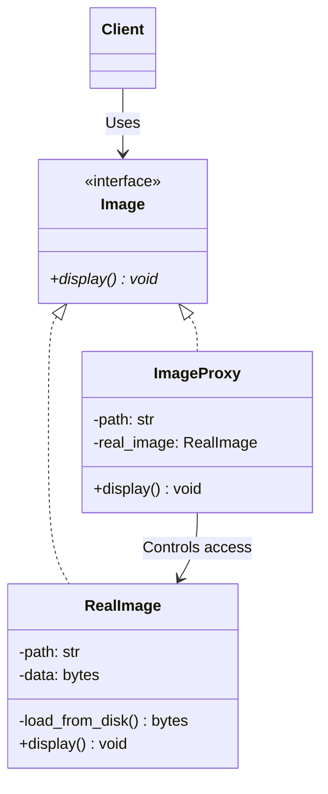

# 프록시 패턴 (Proxy Pattern)

## 1. 패턴이 없을 때 발생하는 문제점 (The Problem)

프록시 패턴을 사용하지 않고 생성 비용이 크거나 접근 제어가 필요한 객체를 클라이언트가 직접 사용하면, 클라이언트가 객체의 생성 시점과 접근 정책, 원격 통신 등의 부가적인 책임까지 직접 처리해야 하는 문제가 발생할 수 있습니다.

예를 들어 고해상도 이미지를 디스크에서 불러와 화면에 표시하는 시스템이 있다고 가정합니다.

이미지 데이터는 매우 크기 때문에 실제로 화면에 표시할 때만 로딩하고 싶지만, 클라이언트가 `RealImage`를 직접 생성하면 생성 시점에 즉시 파일을 읽게 됩니다.

### 패턴을 적용하지 않은 예시

```python
class RealImage:

    def __init__(self, path: str):
        self.path = path
        # 문제점 1: 객체 생성 즉시 비용이 큰 리소스를 로딩
        self._data = self._load_from_disk()

    def _load_from_disk(self) -> bytes:
        print(f"[Disk] {self.path} 로딩")
        with open(self.path, "rb") as file:
            return file.read()

    def display(self) -> None:
        print(f"[Display] {self.path} 표시")

```

여러 이미지 객체를 미리 구성한다고 가정합니다.

```python
images = [
    RealImage("photo1.jpg"),
    RealImage("photo2.jpg"),
    RealImage("photo3.jpg"),
]

```

아직 어떤 이미지도 화면에 표시하지 않았지만, 생성자 호출만으로 모든 이미지가 디스크에서 로딩됩니다.

```text
[Disk] photo1.jpg 로딩
[Disk] photo2.jpg 로딩
[Disk] photo3.jpg 로딩

```

실제로 사용자가 첫 번째 이미지만 보는 경우라면 나머지 두 이미지의 로딩은 불필요합니다.

```python
images[0].display()

```

접근 제어가 필요한 객체에서도 비슷한 문제가 발생합니다.

```python
class AdminService:

    def delete_user(self, user_id: int) -> None:
        ...

```

클라이언트가 `AdminService`를 직접 참조하면 호출 전에 권한을 검사해야 합니다.

```python
if current_user.role == "admin":
    admin_service.delete_user(user_id)
else:
    raise PermissionError("관리자 권한이 필요합니다.")

```

이 로직이 여러 클라이언트에 반복되면 접근 정책이 시스템 곳곳으로 퍼질 수 있습니다.

### 이 방식이 가진 단점

* **비싼 객체의 조기 생성:** 실제로 사용하지 않는 객체까지 미리 생성하거나 리소스를 로딩할 수 있습니다.
* **접근 제어 로직의 확산:** 권한 검사, 인증, 호출 제한 등의 정책이 여러 클라이언트에 반복될 수 있습니다.
* **원격 통신 세부사항 노출:** 실제 객체가 다른 프로세스나 서버에 있다면 직렬화, 네트워크 통신, 오류 변환 등을 클라이언트가 직접 처리해야 할 수 있습니다.
* **부가적인 접근 책임과 비즈니스 로직의 혼재:** 캐싱, 로깅, 참조 관리 등의 기능이 실제 객체를 사용하는 코드와 섞일 수 있습니다.
* **실제 객체와의 강한 결합:** 클라이언트가 객체의 생성 방법과 위치, 수명 주기를 직접 알아야 합니다.

---

## 2. 프록시 패턴으로 해결하기 (The Solution)

프록시 패턴은 "실제 객체(Real Subject)와 동일한 인터페이스를 구현하는 대리 객체(Proxy)를 두고, 클라이언트의 요청을 실제 객체에 전달하기 전에 접근과 생성, 통신 등의 과정을 제어하는 방식"으로 이 문제를 해결합니다.

일반적인 구조는 다음과 같습니다.

```text
Client ──> Subject
             ▲
             │
           Proxy ──> RealSubject

```

먼저 클라이언트가 사용하는 공통 인터페이스를 정의합니다.

```python
from abc import ABC, abstractmethod


class Image(ABC):

    @abstractmethod
    def display(self) -> None:
        pass

```

실제 이미지 객체는 기존과 같이 비용이 큰 리소스를 관리합니다.

```python
class RealImage(Image):

    def __init__(self, path: str):
        self.path = path
        self._data = self._load_from_disk()

    def display(self) -> None:
        ...

```

Proxy 역시 동일한 `Image` 인터페이스를 구현합니다.

```python
class ImageProxy(Image):

    def __init__(self, path: str):
        self.path = path
        self._real_image: RealImage | None = None

    def display(self) -> None:
        if self._real_image is None:
            self._real_image = RealImage(self.path)

        self._real_image.display()

```

Proxy 생성 자체는 매우 가볍습니다.

```python
images = [
    ImageProxy("photo1.jpg"),
    ImageProxy("photo2.jpg"),
    ImageProxy("photo3.jpg"),
]

```

이 시점에는 실제 이미지가 로딩되지 않습니다.

첫 번째 이미지를 사용할 때 비로소 실제 객체가 생성됩니다.

```python
images[0].display()

```

```text
ImageProxy
   │
   │ display()
   ▼
RealImage 생성
   │
   ▼
파일 로딩
   │
   ▼
display()

```

같은 Proxy를 다시 호출하면 이미 생성된 `RealImage`를 재사용합니다.

```python
images[0].display()

```

클라이언트의 관점에서는 Proxy인지 Real Subject인지 구분할 필요가 없습니다.

```python
def show_image(image: Image) -> None:
    image.display()

```

다음 두 객체 모두 같은 방식으로 전달할 수 있습니다.

```python
show_image(RealImage("photo.jpg"))
show_image(ImageProxy("photo.jpg"))

```

핵심은 단순히 다른 객체를 감싸는 Wrapper를 만드는 것이 아닙니다.

실제 객체와 동일한 인터페이스를 유지하면서 실제 객체에 대한 접근 경로를 Proxy가 대신 관리하여, 객체 생성·권한 검사·원격 호출·캐싱 등의 접근 정책을 클라이언트로부터 분리하는 것이 프록시 패턴의 본질입니다.

---

## 3. 장점, 단점 및 트레이드오프 (Trade-off)

### 장점 (Pros)

* **실제 객체의 지연 생성:** 비용이 큰 객체를 실제로 필요한 시점까지 생성하지 않을 수 있습니다.
* **접근 제어 집중:** 인증이나 권한 검사를 Proxy 내부에 모아 클라이언트에서 분리할 수 있습니다.
* **원격 객체 추상화:** 다른 프로세스나 서버에 존재하는 객체를 로컬 객체처럼 표현할 수 있습니다.
* **캐싱 적용 가능:** 실제 객체의 호출 결과를 Proxy에서 캐싱하여 반복적인 비용을 줄일 수 있습니다.
* **실제 객체의 생명 주기 관리:** 생성, 해제, 참조 횟수 등을 Proxy에서 관리할 수 있습니다.
* **클라이언트 코드 유지:** Proxy가 Subject 인터페이스를 유지하면 클라이언트는 실제 구현 위치나 접근 정책을 알 필요가 없습니다.

### 단점 (Cons)

* **추가적인 간접 계층:** 클라이언트와 실제 객체 사이에 Proxy가 추가되어 호출 흐름이 복잡해집니다.
* **응답 지연 가능성:** Proxy 내부에서 네트워크 통신, 권한 검사, 지연 초기화 등이 수행되면 단순 메서드 호출처럼 보여도 실제 비용이 클 수 있습니다.
* **투명성의 한계:** 로컬 객체처럼 보이는 Remote Proxy가 실제로는 네트워크 오류와 큰 지연 시간을 가질 수 있으므로 완벽하게 같은 의미라고 보기 어렵습니다.
* **동시성 처리 필요:** 여러 스레드가 Lazy Proxy의 최초 생성 코드를 동시에 실행하면 실제 객체가 중복 생성되지 않도록 동기화가 필요할 수 있습니다.
* **Proxy 로직 비대화 위험:** 캐싱, 로깅, 권한 검사, 재시도 등을 하나의 Proxy에 모두 넣으면 책임이 과도하게 커질 수 있습니다.

### 트레이드오프 (Trade-off)

* **객체 생성 비용이 클수록 Virtual Proxy가 유리:** 이미지, 대용량 문서, DB 연결처럼 실제 객체 생성이 비싼 경우 효과적입니다.
* **접근 정책이 명확할수록 Protection Proxy가 유리:** 인증과 권한처럼 대상 객체 호출 전 반드시 검사해야 하는 정책을 중앙화할 수 있습니다.
* **원격 객체에서는 완전한 투명성이 오히려 위험할 수 있음:** `proxy.save()`가 일반 메서드처럼 보여도 실제로는 네트워크를 거치는 경우 성능과 실패 모델이 크게 다릅니다.
* **Proxy와 Decorator의 차이:** 두 패턴 모두 동일한 인터페이스로 객체를 감싸는 구조를 가질 수 있습니다. Decorator는 객체에 새로운 책임을 동적으로 추가하는 것에 초점을 두지만, Proxy는 실제 객체에 대한 접근을 대신 관리하는 것에 초점을 둡니다.
```text
Decorator : 기능 확장
Proxy     : 접근 통제

```


* **Proxy와 Adapter의 차이:** Adapter는 인터페이스를 다른 형태로 변환합니다. Proxy는 일반적으로 실제 객체와 동일하거나 호환되는 인터페이스를 유지합니다.
* **Proxy와 Facade의 차이:** Proxy는 주로 하나의 Subject를 대신합니다. Facade는 여러 서브시스템을 더 단순한 상위 인터페이스 뒤에 묶습니다.

### 대표적인 Proxy 유형

Proxy는 목적에 따라 여러 형태로 구분할 수 있습니다.

#### Virtual Proxy

비용이 큰 실제 객체의 생성을 지연합니다.

```text
ImageProxy ──> (필요할 때 생성) ──> RealImage

```

* **대표적인 용도:** 대형 이미지, 대형 문서, DB 연결, 복잡한 객체 그래프

#### Protection Proxy

호출 전에 접근 권한을 검사합니다.

```text
Client ──> ProtectionProxy ──(권한 검사)──> RealSubject

```

#### Remote Proxy

다른 프로세스나 서버에 존재하는 객체를 로컬 객체처럼 표현합니다.

```text
Client ──> RemoteProxy ──(Serialization)──> Network ──> Remote Object

```

#### Caching Proxy

실제 객체의 호출 결과를 보관하고 같은 요청에 대해 기존 결과를 재사용합니다.

```text
Client ──> CachingProxy ──┬── Cache Hit  ──> (결과 바로 반환)
                         └── Cache Miss ──> RealSubject

```

#### Smart Reference Proxy

참조 횟수, 수명 주기, 락 등의 추가적인 참조 관리 기능을 수행합니다.

---

## 4. 파이썬 오픈소스에서 볼 수 있는 프록시와 유사한 설계

Python 표준 라이브러리에는 Proxy라는 용어와 구조를 직접 사용하는 사례가 여러 곳에 존재합니다.

### `xmlrpc.client.ServerProxy`

`xmlrpc.client.ServerProxy`는 원격 XML-RPC 서버와 통신하는 객체입니다.

Python 공식 문서에 따르면 `ServerProxy` 인스턴스는 원격 XML-RPC 서버와의 통신을 관리하며, Proxy의 메서드를 호출하면 해당 이름과 인자에 대응하는 원격 프로시저 호출이 수행됩니다.

```python
from xmlrpc.client import ServerProxy

server = ServerProxy("http://example.com:8000/")
result = server.add(10, 20)

```

표면적으로는 `server.add(10, 20)`처럼 보이지만, 내부적으로는 다음과 같이 수행됩니다.

```text
Python method call
       │
       ▼
  ServerProxy
       │
       ▼
XML serialization
       │
       ▼
     HTTP
       │
       ▼
Remote XML-RPC Server
       │
       ▼
Remote method execution

```

즉 원격 객체의 위치와 통신 세부사항을 Proxy가 대신 관리한다는 점에서 **Remote Proxy**의 매우 직접적인 사례입니다.

### `multiprocessing.Manager()`의 Proxy Objects

Python의 `multiprocessing.Manager()`는 별도의 서버 프로세스에서 공유 객체를 관리하며, 다른 프로세스는 Proxy Object를 통해 해당 객체에 접근합니다.

공식 문서에서는 Manager가 관리하는 공유 객체가 다른 프로세스에 존재하며, 프로세스들이 Proxy를 통해 이를 조작한다고 설명합니다. Proxy의 메서드 호출은 실제 referent의 대응 메서드를 Manager 프로세스에서 실행합니다.

```python
from multiprocessing import Manager

with Manager() as manager:
    values = manager.list([1, 2, 3])
    values.append(4)
    print(values[0])

```

`values`는 일반적인 `list` 자체가 아니라 공유 리스트를 가리키는 Proxy입니다.

```text
Process A ──> ListProxy ──(IPC)──> Manager Process ──> Actual List

```

공식 문서 역시 Proxy를 다른 프로세스에 존재하는 공유 객체를 참조하는 객체로 정의하고, Proxy의 메서드가 referent의 대응 메서드를 호출한다고 설명합니다. 이는 **Remote Proxy / Process Proxy**의 전형적인 구조와 매우 가깝습니다.

### `weakref.proxy()`

Python의 `weakref.proxy()`는 객체에 대한 약한 참조를 Proxy 형태로 제공합니다.

일반적인 `weakref.ref()`는 실제 객체를 얻기 위해 명시적으로 참조 객체를 호출해야 합니다.

```python
reference = weakref.ref(obj)
value = reference()

```

반면 `weakref.proxy()`는 대부분의 문맥에서 실제 객체처럼 사용할 수 있는 Proxy를 반환합니다.

```python
import weakref

proxy = weakref.proxy(obj)
proxy.some_method()

```

공식 문서에서도 `weakref.proxy()`가 명시적인 역참조 없이 대부분의 문맥에서 원본 객체 대신 사용할 수 있는 Proxy를 반환한다고 설명합니다. 원본 객체가 이미 가비지 컬렉션된 이후 Proxy에 접근하면 `ReferenceError`가 발생합니다.

```text
Client ──> Weak Proxy ──(Weak Reference)──> Real Object

```

Proxy가 실제 객체의 수명을 강제로 연장하지 않는다는 점에서 참조와 생명 주기를 중재하는 **Smart Reference Proxy**와 유사한 사례로 볼 수 있습니다.

---

## 5. 클래스 다이어그램



각 역할은 다음과 같습니다.

* **Subject:** `Image`
* **Real Subject:** `RealImage`
* **Proxy:** `ImageProxy`
* **Client:** `Image`를 사용하는 외부 코드

핵심 관계는 다음과 같습니다.

```text
Client ──> Image
            ▲
            │
       ImageProxy ──(Controls access)──> RealImage

```

클라이언트는 `Image` 인터페이스에만 의존하며 Proxy가 실제 객체의 생성과 접근 시점을 제어합니다.

---

## 6. 파이썬 예제 코드

```python
from abc import ABC, abstractmethod
from pathlib import Path


# -------------------------------------------------------------------
# 1. Subject
# -------------------------------------------------------------------

class Image(ABC):

    @abstractmethod
    def display(self) -> None:
        pass


# -------------------------------------------------------------------
# 2. Real Subject
# -------------------------------------------------------------------

class RealImage(Image):

    def __init__(self, path: str):
        self._path = Path(path)
        # 실제 객체 생성 시 비용이 큰 로딩 작업 수행
        self._data = self._load_from_disk()

    def _load_from_disk(self) -> bytes:
        print(f"[RealImage] {self._path} 로딩")
        # 예제에서는 실제 파일이 없어도 실행 흐름을 보여주기 위해 가상의 데이터를 반환
        return b"high-resolution-image-data"

    def display(self) -> None:
        print(f"[RealImage] {self._path} 표시")


# -------------------------------------------------------------------
# 3. Proxy
# -------------------------------------------------------------------

class ImageProxy(Image):

    def __init__(self, path: str):
        self._path = path
        self._real_image: RealImage | None = None

    def display(self) -> None:
        # 실제로 필요한 최초 시점에만 Real Subject 생성
        if self._real_image is None:
            print("[Proxy] RealImage를 생성합니다.")
            self._real_image = RealImage(self._path)

        # 이후 호출은 실제 객체에 위임
        self._real_image.display()


# -------------------------------------------------------------------
# 4. 클라이언트
# -------------------------------------------------------------------

def show_image(image: Image) -> None:
    image.display()


# -------------------------------------------------------------------
# 5. 실행 (Usage)
# -------------------------------------------------------------------

if __name__ == "__main__":

    images: list[Image] = [
        ImageProxy("photo1.jpg"),
        ImageProxy("photo2.jpg"),
        ImageProxy("photo3.jpg"),
    ]

    print("=== Proxy 객체 생성 완료 ===")
    # 아직 어떤 실제 이미지도 로딩되지 않음

    print("\n=== 첫 번째 이미지 표시 ===")
    show_image(images[0])

    print("\n=== 첫 번째 이미지 다시 표시 ===")
    show_image(images[0])

    print("\n=== 세 번째 이미지 표시 ===")
    show_image(images[2])

```

실행 결과는 다음과 같습니다.

```text
=== Proxy 객체 생성 완료 ===

=== 첫 번째 이미지 표시 ===
[Proxy] RealImage를 생성합니다.
[RealImage] photo1.jpg 로딩
[RealImage] photo1.jpg 표시

=== 첫 번째 이미지 다시 표시 ===
[RealImage] photo1.jpg 표시

=== 세 번째 이미지 표시 ===
[Proxy] RealImage를 생성합니다.
[RealImage] photo3.jpg 로딩
[RealImage] photo3.jpg 표시

```

`photo2.jpg`는 한 번도 사용되지 않았기 때문에 실제 이미지 객체도 생성되지 않습니다.

```text
photo1 ──> Proxy ──> RealImage 생성됨
photo2 ──> Proxy ──> RealImage 없음
photo3 ──> Proxy ──> RealImage 생성됨

```

클라이언트에서는 이 차이를 알 필요가 없습니다.

```python
show_image(images[0])
show_image(images[1])

```

두 객체 모두 타입은 단순히 `Image`로 취급됩니다.

---

## 부록 (Appendix): 현대적 타입 시스템과 함수형 관점의 재해석

프록시 패턴을 현대 타입 시스템과 함수형 프로그래밍 관점에서 재해석하면, Proxy가 해결하는 문제는 단순히 "실제 객체 앞에 같은 인터페이스의 객체를 하나 더 둔다"는 구조보다 훨씬 일반적인 문제로 볼 수 있습니다.

고전적인 Proxy는 다음 구조를 가집니다.

```text
Client ──> Proxy ──> Real Subject

```

하지만 Proxy가 실제로 수행하는 역할(생성 지연, 접근 권한 검사, 원격 호출 변환, 캐싱, 수명 주기 관리, 동시성 동기화 등)을 더 추상적으로 표현하면 다음과 같습니다.

> **"어떤 값이나 자원에 대한 직접 접근을 허용하는 대신, 접근을 표현하는 간접적인 값이나 계산을 제공하고 그 경계에서 정책을 적용할 수는 없는가?"**

이 부록에서는 이를 설명하기 위해 `Lazy[T]`, `Thunk`, `Capability Type`, `Opaque Handle`, `Effect System`, `Ownership/Borrowing`, `Linear Type`, `Future/Async Type`을 지원하는 가상의 Python 문법을 가정하여 설명합니다. *(아래 코드는 실제 Python 문법이 아닙니다.)*

---

### 1. Virtual Proxy를 `Lazy[T]`로 표현하기

고전적인 Virtual Proxy는 실제 객체 생성을 지연합니다.

```text
Proxy 생성 ──> (아직 Real Subject 없음) ──> 최초 method 호출 ──> Real Subject 생성

```

이를 타입으로 직접 표현할 수 있습니다.

```python
data Lazy[T] = Unevaluated(thunk: () -> T) | Evaluated(T)

```

값을 지연 생성합니다.

```python
image: Lazy[Image] = lazy { load_image("photo.jpg") }

```

아직 `load_image()`는 실행되지 않습니다. 실제 값이 필요할 때 비로소 실행됩니다.

```python
real_image = force(image)

```

```text
Unevaluated ──(force() 호출)──> load_image() 실행 ──> Evaluated(Image)

```

두 번째 호출부터는 기존 결과를 사용합니다.

```python
again = force(image)

```

고전적인 `VirtualProxy + RealSubject field` 구조를 `Lazy[T]`라는 일반적인 타입으로 표현한 것입니다.

---

### 2. Lazy Proxy와 Thunk를 구분하기

단순한 Thunk는 지연된 계산입니다.

```python
type Thunk[T] = () -> T

```

```python
image: Thunk[Image] = lambda: load_image("photo.jpg")

```

호출할 때마다 다시 계산할 수 있습니다 (`image()`, `image()`).

반면 일반적인 Virtual Proxy는 한 번 생성한 실제 객체를 재사용합니다.

```text
첫 호출   : 생성
이후 호출 : 재사용

```

따라서 의미적으로는 단순 Thunk보다 **Memoized Lazy Value**에 가깝습니다.

```python
type Lazy[T] = Memoized[Thunk[T]]

```

$$\text{Virtual Proxy} \approx \text{Memoized Lazy}[T]$$

---

### 3. Protection Proxy를 Capability Type으로 표현하기

고전적인 Protection Proxy는 호출 전에 권한을 확인합니다.

```text
Client ──> Protection Proxy ──(permission check)──> Real Subject

```

```python
proxy.delete_user(user_id)

```

호출 시 내부에서 현재 사용자 권한을 검사할 수 있습니다.

하지만 현대적인 Capability 기반 타입 시스템에서는 **권한이 없는 코드에 해당 연산 자체를 제공하지 않는 방식**으로 접근할 수 있습니다.

```python
capability DeleteUser:
    def delete_user(id: UserId) -> Unit

```

관리자에게만 Capability를 발급합니다.

```python
admin_capability: DeleteUser

```

함수는 해당 권한을 요구합니다.

```python
def remove_user(id: UserId, using permission: DeleteUser) -> Unit:
    permission.delete_user(id)

```

권한이 없는 코드는 `remove_user(id)`를 호출할 수 없으며 컴파일 에러가 발생합니다.

```text
Type Error: Missing capability: DeleteUser

```

전통적인 Protection Proxy의 **"호출 허용 $\rightarrow$ 런타임 권한 검사 $\rightarrow$ 거부"** 흐름을 "Capability 없음 $\rightarrow$ 호출 자체가 불가능"으로 바꿀 수 있습니다.

---

### 4. 권한을 세분화하여 최소 권한만 제공하기

실제 객체가 다음 기능을 모두 가진다고 가정합니다.

```python
class UserRepository:
    def read(...)
    def create(...)
    def update(...)
    def delete(...)

```

Proxy를 하나 두고 역할별로 검사할 수도 있지만, Capability 시스템에서는 능력을 나눌 수 있습니다.

```python
capability ReadUser:
    def read(id: UserId) -> User

capability WriteUser:
    def update(user: User) -> Unit

capability DeleteUser:
    def delete(id: UserId) -> Unit

```

* **일반 사용자 서비스:** `ReadUser + WriteUser` 만 전달
* **관리자 서비스:** `ReadUser + WriteUser + DeleteUser` 전달

Proxy에서 런타임 조건문으로 접근을 검사하는 대신, 타입 수준에서 접근 가능한 기능의 집합을 제한하는 것입니다.

---

### 5. Remote Proxy를 `RemoteHandle[T]`로 표현하기

실제 객체가 다른 서버에 존재한다고 가정합니다.

고전적인 Remote Proxy에서는 `Local Proxy ──> Network ──> Remote Object` 구조를 만듭니다.

하지만 Remote Object는 실제로 로컬 값과 동일하지 않으므로 이를 타입에 명시할 수 있습니다.

```python
opaque type RemoteHandle[T]

```

```python
user_service: RemoteHandle[UserService]

```

직접적인 메서드 호출 대신 Remote 연산을 사용합니다.

```python
def call[T, Args, Result](
    target: RemoteHandle[T],
    method: Method[T, Args, Result],
    args: Args,
) -> Async[Result[Result, RemoteError]]:
    ...

```

```python
result = call(user_service, UserService.get_user, user_id)

```

타입만 보아도 **원격 호출임 / 비동기일 수 있음 / 실패할 수 있음**을 명확히 알 수 있습니다. 고전적인 Transparent Remote Proxy보다 비용과 실패 모델을 더 정직하게 표현합니다.

---

### 6. 원격 객체와 로컬 객체를 완전히 같은 인터페이스로 만드는 위험

고전적인 Proxy는 투명성을 강조하여 `local.get_user(id)`와 `remote_proxy.get_user(id)`가 같은 형태를 가질 수 있습니다. 하지만 실제 의미는 매우 다릅니다.

* **`local.get_user()`:** 메모리 호출, 매우 빠름, 프로세스 실패 가능성 낮음
* **`remote_proxy.get_user()`:** 직렬화, 네트워크, 인증, Timeout, Retry, 원격 서버 오류 발생 위험

따라서 현대적인 API에서는 일부러 타입을 다르게 만들기도 합니다.

`UserService`와 `Remote[UserService]`를 구분하고, 반환 결과 역시 `User`가 아니라 `Async[Result[User, NetworkError]]`처럼 표현합니다. 즉, **완전한 Proxy 투명성이 항상 좋은 설계는 아닐 수 있습니다.**

---

### 7. Remote Proxy를 Effect로 표현하기

원격 호출 자체를 하나의 효과(Effect)로 정의할 수도 있습니다.

```python
effect RemoteCall:
    def invoke[Request, Response](request: Request) -> Response

```

비즈니스 로직:

```python
def load_user(id: UserId) -> User ! RemoteCall:
    return perform invoke(GetUser(id))

```

* **실제 네트워크 환경:** `handle RemoteCall with HttpRPCHandler`
* **테스트 환경:** `handle RemoteCall with InMemoryHandler`

객체 Proxy 대신 원격 접근이라는 효과 자체를 추상화하는 방식입니다.

---

### 8. Caching Proxy를 Memoization으로 표현하기

Caching Proxy의 구조는 다음과 같습니다.

```text
Client ──> Caching Proxy ──┬── Cache Hit  ──> Result
                          └── Cache Miss ──> Real Subject

```

함수형 관점에서는 순수 함수의 Memoization으로 표현할 수 있습니다.

```python
def memoize[A: Hashable, B](fn: A -> B) -> A -> B:
    ...

```

```python
calculate_price : ItemId -> Money
cached_price    : ItemId -> Money  # memoize(calculate_price)

```

타입이 완전히 동일하므로, 순수한 계산의 Caching Proxy는 객체보다 고차 함수가 더 직접적인 표현이 될 수 있습니다.

---

### 9. 부수효과가 있는 계산에서는 캐싱의 의미가 달라진다

다음 함수가 있다고 가정합니다.

```python
def get_balance(account: AccountId) -> Money ! Database:
    ...

```

이 결과를 무조건 캐싱하면 실제 데이터베이스 값이 변경되어도 오래된 값을 반환할 수 있습니다. 즉 `Database Read`와 `Cached Database Read`는 의미적으로 동일하지 않습니다.

효과 시스템에서는 캐시 정책을 별도 효과 Handler로 표현할 수 있습니다.

```python
handle DatabaseRead with Cache(ttl=30.seconds)

```

따라서 Caching Proxy가 수행하는 의미 변경을 호출 타입이나 Effect Layer에 명시적으로 드러낼 수 있습니다.

---

### 10. Smart Reference Proxy를 Borrowing으로 표현하기

고전적인 Smart Proxy는 참조 횟수 관리, 락 획득, 수명 검사, 수정 권한 검사 등을 수행합니다.

현대적인 소유권 타입에서는 이를 별도의 Proxy 객체 없이 참조 타입으로 표현할 수 있습니다.

* **소유권 객체:** `owned: Own[Database]`
* **읽기 전용 참조:** `borrowed: &Database`
* **가변 참조:** `mutable: &mut Database`

컴파일러가 참조 규칙(여러 읽기 참조 허용, 읽기+쓰기/여러 쓰기 참조 금지)을 검사합니다. 고전적인 Smart Proxy가 런타임에서 관리하던 일부 접근 규칙을 Borrow Checker와 Ownership Type이 정적으로 수행하는 것입니다.

---

### 11. 수명 주기 Proxy를 Linear Type으로 표현하기

어떤 자원은 정확히 한 번 닫아야 한다고 가정합니다.

```python
linear resource Connection:
    ...

```

```python
connection = open_connection()
query(connection, ...)
close(connection)

```

닫은 이후 다시 `query(connection, ...)`를 시도하면 컴파일 에러가 발생합니다.

```text
Type Error: connection has already been consumed.

```

Proxy 객체로 수명을 감시하는 대신 자원의 사용 가능성 자체를 타입 상태(Typestate)로 관리합니다.

---

### 12. 동시성 Proxy를 Actor Handle로 표현하기

실제 객체가 다른 스레드에서만 안전하게 접근 가능하다고 가정합니다.

고전적인 Proxy는 메서드 호출을 받아 락을 획득하거나 작업 큐에 전달합니다.

```text
Client ──> ThreadSafeProxy ──> Lock / Queue ──> RealSubject

```

Actor 기반 모델에서는 객체 자체를 직접 공유하지 않고 Handle만 제공합니다.

```python
actor Counter:
    state: value: Int
    message Increment
    message Get -> Int

counter: ActorRef[Counter]

```

```python
send(counter, Increment)

```

```text
ActorRef ──(Message)──> Actor Mailbox ──> Actor State

```

실제 객체의 내부 상태에 직접 접근할 수 없게 만드는 구조로, 동시성 접근을 통제하는 Proxy를 언어의 동시성 모델로 일반화한 형태입니다.

---

### 13. Proxy가 투명해야 하는지를 타입으로 선택하기

고전적인 Proxy는 보통 `Proxy <: Subject` 관계를 사용하여 클라이언트가 실제 객체와 Proxy를 동일하게 사용합니다. 하지만 현대 타입 시스템에서는 투명성 여부를 명시적으로 선택할 수 있습니다.

* **Transparent Proxy:** `type Proxy[T] <: T`
* `service.method()` 형태로 바로 사용
* 클라이언트는 차이를 알지 못하지만 비용과 실패 모델이 숨겨짐


* **Explicit Proxy:** `opaque type Proxy[T]`
* `proxy.call(Service.method, args)` 형태로 사용
* 간접 접근이라는 사실을 명확하게 드러냄 (Remote Proxy 등에서 선호)


---

### 14. Proxy를 "값"이 아니라 "접근 권한"으로 바라보기

고전적인 Proxy는 실제 객체를 대신하는 객체처럼 보이지만, 추상적으로 보면 Proxy가 제공하는 것은 "해당 객체에 어떤 방식으로 접근할 수 있는가(Access Path)"입니다.

* **Virtual Proxy:** 아직 없는 값에 대한 지연 접근
* **Protection Proxy:** 권한이 제한된 접근
* **Remote Proxy:** 네트워크를 통한 접근
* **Weak Proxy:** 객체의 생명을 유지하지 않는 접근
* **Caching Proxy:** 캐시를 거친 접근

즉, Proxy는 접근 경로 자체를 값으로 만든 것이라고 볼 수 있습니다.

---

### 15. Proxy를 효과 변환으로 바라보기

보다 일반적으로 Proxy는 실제 연산의 앞뒤에 접근 정책을 삽입하는 효과 변환(Effect Transformation)으로 볼 수 있습니다.

```text
Client Operation ──> Proxy Policy ──> Real Operation

```

* **Caching Proxy:** $A \rightarrow B ! \text{Database} \quad \Longrightarrow \quad A \rightarrow B ! \text{Cache} + \text{Database}$
* **Protection Proxy:** $A \rightarrow B ! \text{Database} \quad \Longrightarrow \quad A \rightarrow B ! \text{Authorization} + \text{Database}$
* **Remote Proxy:** $A \rightarrow B ! \text{Database} \quad \Longrightarrow \quad A \rightarrow B ! \text{Network}$

즉, Proxy의 종류는 실제 연산을 어떤 접근 효과를 통해 실행할 것인가의 차이로 재해석할 수 있습니다.

---

### 16. Proxy를 "간접 참조의 정책화"로 바라보기

고전적인 Proxy 구조를 더 일반화하면 다음과 같습니다.

```text
Client ──> Indirect Reference ──> Access Policy ──> Resource

```

접근 정책은 Lazy, Authorization, Remote, Cache, Weak, Synchronized, Transactional 등으로 달라질 수 있습니다.

객체지향에서는 이러한 정책을 **Proxy Object**에 넣지만, 현대적인 언어에서는 상황에 따라 `Lazy[T]`, `Capability`, `RemoteHandle[T]`, `Effect Handler`, `Memoization`, `Borrowed Reference`, `Linear Resource`, `ActorRef[T]` 등으로 표현합니다.

따라서 Proxy를 단순히 "진짜 객체 대신 가짜 객체를 하나 두는 패턴"으로만 이해하기보다, **직접 접근을 간접 접근으로 바꾸고 그 간접 경계에 접근 정책을 부여하는 기법**으로 이해하는 것이 더 일반적입니다.

---

### 요약 및 비교

| 관점 | 프록시 패턴 (OOP 아키텍처) | 현대 타입 시스템 + 함수형 관점 |
| --- | --- | --- |
| **기본 구조** | Proxy가 Real Subject를 대신함 | 간접 접근을 별도 타입/효과로 표현 |
| **인터페이스** | Subject 인터페이스 유지 | Transparent 또는 Explicit Proxy |
| **지연 생성** | Virtual Proxy | `Lazy[T]` / Memoized Thunk |
| **권한 검사** | Protection Proxy | Capability Type |
| **원격 접근** | Remote Proxy | `RemoteHandle[T]` |
| **원격 실패** | Proxy 내부 예외 | `Async[Result[T, E]]` |
| **원격 호출 추상화** | Proxy Method | Remote Effect |
| **캐싱** | Caching Proxy | Memoization / Cache Handler |
| **참조 관리** | Smart Reference | Ownership / Borrowing |
| **자원 수명** | Proxy가 관리 | Linear Type / Typestate |
| **동시성 접근** | Locking Proxy | `ActorRef` / Ownership |
| **약한 참조** | Smart Proxy | Weak Reference Type |
| **주요 장점** | 클라이언트 수정 없이 접근 정책 삽입 | 접근 비용·권한·효과·수명을 타입으로 명시 가능 |
| **주요 비용** | 간접 호출과 투명성 문제 | 고급 타입·효과·소유권 모델에 대한 이해 필요 |

---

## 결론

고전적인 프록시 패턴은 실제 객체와 동일한 인터페이스를 가진 대리 객체가 클라이언트와 Real Subject 사이에 위치하여, 실제 객체에 대한 접근과 생성·권한·통신·캐싱·수명 등의 정책을 대신 관리하는 구조 패턴입니다.

```text
Client ──> Subject
             ▲
             │
           Proxy ──> RealSubject

```

현대 타입 시스템과 함수형 패러다임에서는 이러한 접근 정책을 더 직접적인 언어 구조로 1:1 매핑하여 표현할 수 있습니다.

* $\text{Virtual Proxy} \leftrightarrow \text{Lazy}[T] \text{ / Memoized Thunk}$
* $\text{Protection Proxy} \leftrightarrow \text{Capability Type}$
* $\text{Remote Proxy} \leftrightarrow \text{RemoteHandle}[T] \text{ / Remote Effect}$
* $\text{Caching Proxy} \leftrightarrow \text{Memoization / Cache Handler}$
* $\text{Smart Reference} \leftrightarrow \text{Borrowing / Ownership}$
* $\text{수명 관리 Proxy} \leftrightarrow \text{Linear Type / Typestate}$
* $\text{동시성 Proxy} \leftrightarrow \text{ActorRef}$

현대적 관점에서 프록시 패턴의 본질을 추상화하면, "값이나 자원에 대한 직접 접근을 정책이 적용되는 간접 접근으로 치환하고, 그 접근 경계에서 생성 시점·권한·위치·비용·수명·동시성 등의 제약을 일관되게 통제하는 기법"으로 확장하여 이해할 수 있습니다.